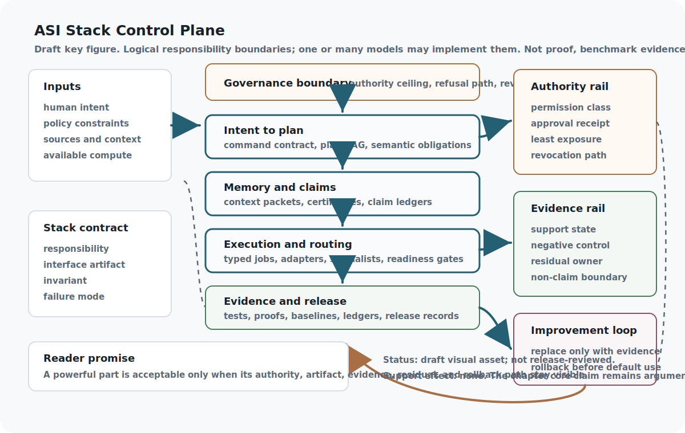

## Chapter status

| Field | Value |
|---|---|
| Chapter ID | `asi-is-a-stack-not-a-model` |
| Part | Part I - Foundations, Alignment, and Governance |
| Status | conceptual |
| Manuscript maturity | v0.2 manuscript draft |
| Last updated | 2026-07-15 |
| Primary source records | `viea`, `beastbrain`, `aletheia`, `talos`, `moecot`, `scf` |
| Claim label | Design rationale |
| Evidence level | argument |
| Source queue | primary: `viea`, `beastbrain`, `aletheia`; supporting: `talos`, `moecot`, `scf`; external comparators: `ext_drexler_cais_2019`, `ext_mrkl_systems_2022`, `ext_llm_agents_survey_2023`, `ext_standard_model_mind_2017`, `ext_subsumption_architecture_1986`; connector/recovery: `moecot` |
| Source loading state | source notes: `viea`, `beastbrain`, `aletheia`, `talos`, `moecot`, `scf`, `ext_drexler_cais_2019`, `ext_mrkl_systems_2022`, `ext_llm_agents_survey_2023`, `ext_standard_model_mind_2017`, `ext_subsumption_architecture_1986`; passage-reviewed local raw cache: `viea`, `beastbrain`, `aletheia`, `talos`, `scf`; primary-report passages reviewed: `ext_drexler_cais_2019`; connector-only/source-note mapped: `moecot` |
| Test state | `layer_boundary_record.valid.json` passes protocol validation; `AsiStackProofs.StackBoundaries` builds a reachable request → grant → dispatch → effect → observation → rollback model and explicit rejection theorems; `python3 scripts/validate_stack_boundary_effect_consumer.py` independently matches 18/18 generated admission routes, classifies six authority fixtures, accepts three runtime paths totaling ten events, and rejects 12/12 semantic mutations with support-state effect `none`. `python3 scripts/validate_stack_layer_traceability.py` separately checks source-to-layer and claim-support metadata. Contract-change triage remains planned. |

## Drafting guardrail

The unit of analysis is the governed stack. This is an architecture argument, not a claim that any one implementation already achieves ASI, safety, or empirical efficiency. Source notes shape the vocabulary; Appendix C still controls support-state movement.

The opening sequence of Part I is ordered deliberately. This opening names the system as a stack, the efficiency layer explains why that stack can be efficient, the authority layer prevents efficiency from becoming permission leakage, the failure layer names what breaks without those boundaries, and the evidence layer governs how any of those claims may later move.

::: {.asi-human-only}
## Human Reading Path

Start with the architecture's basic contract: the subject is not a magic model and not a loose pile of agent tricks. It is a governed system whose parts must say what they own, what they may do, what evidence they create, and how they can be stopped or replaced.

That frame matters because the rest of the stack keeps adding machinery. Planning, memory, routing, proofs, tools, compression, and self-improvement only stay coherent if they attach to stable boundaries. Without those boundaries, a capable system can sound integrated while hiding who approved an action, which source grounded a claim, what changed after feedback, or how a failed part would be rolled back.

The stack frame gives the whole argument a practical test. A powerful part must remain inspectable from outside itself. When a later mechanism cannot name its responsibility, artifact, authority ceiling, evidence state, and failure mode, the right response is not enthusiasm. It is to treat the mechanism as unfinished architecture until its boundary is visible to review and audit.
:::

## Problem

Advanced AI systems that plan, remember, verify, act, route work, compress representations, and improve under governance need one architecture frame. Without that frame, every paper in the source corpus can sound like a separate invention competing for center stage. With it, the papers become fragments of a single machine.

The first boundary is conceptual. An ASI system should not be described only by the model that generates tokens, the agent loop that calls tools, or the benchmark score that reports progress. Those are components and measurements. The architecture is the set of contracts that decides how intent becomes work, how memory becomes context, how reasoning becomes claims, how claims become authority, how authority becomes execution, and how execution becomes evidence for future change.

The unit of analysis has to be fixed before the book starts adding layers. The unit is not "the model." The unit is a governed stack of cooperating layers. Each layer has a responsibility, an interface, a durable artifact, an invariant, a failure mode, and a promotion rule. Later layers can add detail only because the stack frame says what it means for those details to compose.

That frame also gives the reader a way to judge the rest of the book. A new mechanism belongs in the stack only when it lowers confusion at a boundary: it clarifies who owns a decision, what artifact crosses the interface, which authority is available, which evidence state is possible, and what rollback path exists if the mechanism fails. If it cannot answer those questions, it may still be an idea, but it is not yet an architectural layer.

This recurring question set is the book's pattern language for governed cognition. The pattern is not a slogan and not a proof of novelty: a layer becomes governable by carrying a typed record, lifecycle state, authority ceiling, evidence gate, receipt trail, residual owner, rollback or quarantine route, and explicit non-claims. This opener owns the pattern name. Later chapters should not inflate ordinary reuse of the pattern into separate novelty claims; they should state their local delta, such as a new artifact type, invariant, failure mode, proof/evidence lane, or implementation horizon.

## Why existing approaches are insufficient

A larger model, a prompt wrapper, or an agent loop does not by itself define authority boundaries, memory discipline, evidence ledgers, tool permissions, or safe replacement rules.

The missing piece is not intelligence in the narrow sense. It is system accountability. A fluent model can propose a plan without owning the authority to execute it. A retrieval system can surface a source without proving that the source is current, permitted, or sufficient for the task. A router can choose a specialist without preserving the residual burden created by that choice. A benchmark can improve while hiding new failure cases. These failures appear at interfaces, so they need interface records. Adding more parameters may improve a component, but it does not by itself record what changed, who approved it, what evidence exists, or what should happen if the change fails.

The ASI Stack treats those missing contracts as first-class design objects. It does not reject powerful models; it puts them in the right place. A model may be a generator, compressor, critic, planner, router, simulator, or verifier. It should not silently become the constitution, the memory authority, the deployment authority, the approval body, and the evidence registry at the same time.

A layer is a logical responsibility and authority boundary, not a required process, service, model, or physical module. One model may implement several roles if their typed handoffs, authority checks, evidence duties, and failure routes remain externally enforceable. Several models, tools, or people may also implement one role behind the same contract. Physical isolation can strengthen a high-risk boundary, but it is a deployment choice justified by the threat model; the stack claim itself is substrate-neutral.

That is the delta beyond generic decomposition. A modular system has parts; a governed-cognition pattern gives those parts record identity, state, authority, evidence, receipts, and reversal behavior. The claim is still architectural and remains at `argument` support, but the pattern makes the book's repeated structure intentional instead of accidental.

External positioning: the opening stack frame is still a synthetic orientation claim over this book's internal architecture, but it now has source-noted architecture comparators. Drexler's CAIS report (`ext_drexler_cais_2019`) already argues for composed AI services and R&D automation rather than a single self-transforming agent. MRKL Systems (`ext_mrkl_systems_2022`) show model-plus-expert-module decomposition, the LLM-agent survey (`ext_llm_agents_survey_2023`) organizes language-model agents around memory, planning, and action components, the Standard Model of the Mind (`ext_standard_model_mind_2017`) supplies cognitive-architecture lineage, and Brooks' layered robot-control work (`ext_subsumption_architecture_1986`) gives a historical layered-control comparator. The narrower ASI Stack candidate delta is operational governance at each interface: typed handoffs, authority ceilings, claim/support-state transitions, evidence and residual custody, rollback or quarantine routes, and release records. None of these comparators validates that contract here.

## Core Claim

[asi-is-a-stack-not-a-model.core, label: Design rationale, support: argument] Efficient ASI should be modeled as a governed stack of cooperating layers rather than as one undifferentiated model.

The claim remains at `argument` support. VIEA supports the intent-to-execution spine, BeastBrain supports the local stateful stack vocabulary, Aletheia supports the trusted-output and verification boundary, Talos supports the labor/execution layer, SCF supports governed replacement, and MoECOT remains implementation-reference context rather than reproduced evidence. CAIS grounds service-centered composition and R&D automation, while the other external architecture sources ground surrounding vocabulary for modular systems, LLM agents, cognitive architectures, and layered control. None reproduces or validates the ASI Stack.

The argument is that decomposition is both a governance device and an efficiency device. A stack can route the smallest adequate capability to a subtask, preserve context only where it is useful, compile repeated work into tools, and test the exact boundary that changed. A monolith can still be powerful, but it has fewer places to attach evidence, rollback, permissions, and replacement rules.

### Claim-source mapping status

Appendix C now records exact source-note mappings for this core claim across all assigned sources. Five mappings also carry reviewed local raw-cache passage references in the manifest. `moecot` remains connector-only/source-note mapped because usable local raw text is not committed. The mappings support the architectural frame, not an implementation result.

| Source | What it supports | Limit |
|---|---|---|
| `viea` | Intent-to-execution machinery with contracts, artifacts, routing, verification, runtime execution, feedback, residuals, tools, benchmarks, and regressions. | Architecture proposal; no completed deployment or end-to-end stack evidence here. |
| `beastbrain` | A local, stateful stack split across memory, verification, planning, routing, security, consolidation, and interfaces. | Hardware, cost, context-length, and benchmark claims are not locally reproduced. |
| `aletheia` | Separation between fluent generation and trusted output through context acquisition, claim decomposition, verification, uncertainty routing, and constitutional governance. | No local implementation, live-oracle run, adversarial result, or proof artifact. |
| `talos` | Execution/labor layer with typed jobs, deterministic control planes, evidence, isolation, audit, replay, delivery, and residual feedback. | Design source, not reproduced security or benchmark evidence. |
| `moecot` | Compact orchestrator, specialist lanes, fail-closed control plane, ledgers, readiness gates, replay, and handoff as implementation-reference context. | Code, logs, benchmark artifacts, and runtime claims have not been ingested or reproduced. |
| `scf` | Stable capability fields as governed replacement boundaries with contracts, evidence registries, qualification, routing, authority, lifecycle, and recovery paths. | Does not prove production safety, global alignment, or whole-stack reversibility. |

## What the stack thesis commits us to

Calling advanced AI a stack is useful only if it changes engineering
decisions. The thesis commits the architecture to five separations that remain
visible even when one model implements several roles.

First, **capability is not authority**. A component may generate an excellent
plan or discover a vulnerability without receiving permission to execute,
deploy, conceal, or persist anything. Authority comes from an external grant
whose scope, lifetime, delegability, and revocation state are inspectable at
the effect boundary.

Second, **context is not belief**. Retrieved passages, summaries, memories,
simulations, and model states are inputs with provenance, freshness, taint,
rights, and adequacy limits. They become evidence for a claim only through a
consumer-specific verification path. This prevents a long context window or a
confident synthesis from silently becoming epistemic authority.

Third, **a plan is not execution**. Planning explores dependencies,
alternatives, and contingencies. Execution occurs through a narrow adapter that
rechecks current authority, records pre-state and observed post-state, and
retains rollback, compensation, quarantine, or residual custody for effects
that cannot be reversed exactly.

Fourth, **a receipt is not reality**. Logs and attestations say what a component
reported or what a bounded checker observed. Independent observation must be
able to contradict them, and unresolved discrepancies must survive as owned
residuals rather than being averaged into a success status.

Fifth, **improvement is not inheritance**. A replacement model, router,
verifier, policy, memory representation, or tool does not inherit the support,
authority, or readiness of its predecessor merely because it has the same
name. Qualification binds the candidate to the capability field it is supposed
to preserve, the regression envelope it was tested against, and the recovery
path available if the change fails.

These commitments are logical boundaries, not a mandate for microservices.
A monolithic model can sit behind all five contracts if the surrounding system
can enforce and audit them. Conversely, a graph of many agents is not a
governed stack when they share unbounded credentials, copy unversioned context,
approve one another, and report success without independent effect checks.
Modularity is an implementation choice; accountable separation is the thesis.

## Strong alternatives and what would decide between them

The strongest objection is that sufficiently capable end-to-end models may
internalize planning, memory, routing, criticism, and repair more reliably than
an explicit stack. Interfaces can lose information, introduce latency, create
new attack surfaces, and turn fluid cognition into brittle bureaucracy. A
second objection is that ordinary operating-system isolation, least-privilege
tooling, provenance logs, and release engineering may provide the necessary
control without a book-specific architecture. A third is that the stack can
produce excellent records while failing to improve the external outcomes that
matter.

The thesis survives those objections only as an empirical and formal program,
not by definition. A fair comparison would place a strong monolithic agent, a
lightweight tool wrapper, and the governed stack on the same natural tasks with
matched models, context, tools, tuning effort, and total resource budgets. It
would measure useful completion, unsafe or unauthorized effect, false refusal,
recovery completeness, discrepancy discovery, latency, compute, reviewer
burden, maintenance cost, and performance after component replacement. It
would include attacks on stale grants, correlated verifiers, poisoned context,
forged receipts, hidden side effects, and rollback gaps.

Any boundary should be narrowed wherever a simpler design performs equally
well. If a session-scoped permission wrapper matches typed authority under
revocation and confused-deputy pressure, the richer grant record has not earned
its cost. If one end-to-end model preserves context and task quality better
than a multi-stage lowering pipeline without weakening observation or
rollback, the pipeline should collapse. The architecture is not entitled to
layers; each layer must own a distinct failure family or measurable interface
benefit.

Evidence that would strengthen the thesis is equally specific: repeated
natural traces in which explicit boundaries prevent or recover failures that
stronger simple controls miss, while preserving useful throughput at an
acceptable lifecycle cost; successful replacement of a component without
identity or evidence leakage; and independent reproduction across materially
different tasks and systems. Evidence that would weaken it includes persistent
composition failures, governance burden that drives bypass, no benefit over
well-engineered monoliths, or controls that remain descriptive rather than
effect-enforcing. None of those broad comparisons is complete here. The book
currently offers a disciplined architecture candidate and bounded local
mechanism evidence, not a proven optimal decomposition.

## Draft Key Figure: ASI Stack Control Plane

::: {.asi-key-figure}
{#fig-asi-stack-control-plane fig-alt="Draft ASI Stack control plane figure showing inputs, governed stack layers, an authority rail, an evidence rail, and an improvement loop. The figure frames the architecture as accountable handoffs among intent, planning, memory, claims, execution, routing, evidence, release records, residuals, and rollback paths."}
:::

**How to read the ASI stack control-plane figure:** Treat the figure as the book's thesis in one systems view. Its boxes are logical responsibility boundaries, not a requirement for one model or process per box. Human intent, policy constraints, sources, and compute enter only through the stack contract. The middle layers transform work, context, claims, jobs, routes, and evidence, while the side rails keep authority ceilings, support states, residual ownership, and rollback visible. The figure is a draft reader aid, not proof that the architecture is implemented, benchmarked, externally reviewed, or release-approved.

## Stack Map

```{mermaid}
flowchart TB
  Constitution["Alignment + constitution"] --> Governance["Governance + authority"]
  Governance --> Intent["Intent + contracts"]

  subgraph Cognition["Operational cognition"]
    direction LR
    Intent --> Planning["Planning + semantic IR"]
    Planning --> Memory["Source-bound memory"]
    Memory --> Reasoning["Claims + verification"]
    Reasoning --> Execution["Tools + execution"]
  end

  subgraph Adaptation["Replaceable capability path"]
    direction LR
    Routing["Routing + capability fields"] --> Compression["Compression + residuals"]
    Compression --> Evidence["Evidence + tests + proofs"]
  end

  Planning --> Routing
  Execution --> Evidence
  Evidence -- "qualification receipt" --> Improvement["Governed improvement"]
  Improvement --> Governance
  Governance -. "authority ceiling" .-> Execution
```

**How to read the stack map:** Read this stack map as a substrate-neutral responsibility loop, not a capability ladder or a physical topology. A monolithic model, modular service graph, hybrid system, or human/AI process can instantiate it only to the extent that the named interfaces and authority boundaries remain enforceable. Self-improvement is not outside the stack; it returns to governance, where new capabilities must be qualified, bounded, and made reversible before they become defaults.

## Mechanism

The stack frame begins by refusing to let any one component inherit every role. VIEA gives the book its intent-to-execution spine; BeastBrain contributes the local, stateful, system-stack vocabulary; Aletheia sharpens the evidence and uncertainty boundary; Talos gives execution a labor-operating-system shape; MoECOT remains an implementation-reference runtime; and SCF supplies the replacement boundary. Read together, they point to one architectural rule: a capability is governed by the contracts around it, not by the model name inside it.

A layer contract is the mechanism that makes that rule concrete. The artifact is a Layer Boundary Record, and a chapter is mature only when it can answer the same recurring questions: what lifecycle state is this layer in, who owns the boundary, which chapters currently carry it, what responsibility does the layer own, what artifact does it emit, how does handoff work, what authority does it have and lack, what invariant must survive implementation changes, what new-source integration decision applies, and what evidence would justify promotion, replacement, or rollback.

Those questions are the book's defense against anthology drift. Each paper can introduce a mechanism, but the mechanism enters the stack only by naming its responsibility, interface, artifact, invariant, failure mode, evidence gate, and non-claim. Source queues keep future writing runs context-loaded, and evidence states keep clearer prose from turning into stronger support without the corresponding artifact.

The raw LLM sits inside that contract as a powerful semantic machine. It can compress, expand, draft, classify, translate, route, critique, and propose repairs. The stack around it decides when those operations count as evidence, when they require verification, when they are only suggestions, and when they may trigger external action. In other words, the model can move meaning; the stack decides when that movement becomes a claim, job, permission, artifact, or release.

The living-book workflow mirrors the architecture. Source queues prevent context drift. Claim states prevent evidence inflation. Proof targets prevent vague formalism. Render and validation gates prevent the public book from drifting away from the repository that defines it.

The layer contract has a lifecycle:

```{mermaid}
flowchart TB
  A["Source idea or implementation pressure"] --> B["Owner + interface artifact"]
  B --> C["Authority ceiling + invariant + failure mode"]
  C --> D["Evidence gate"]
  D --> E{"Validated surface?"}
  E -- "yes" --> F["Candidate promotion + regression receipt"]
  E -- "no" --> G["Design rationale or owned residual"]
  G --> D
```

This lifecycle is intentionally conservative. It lets the book absorb new papers, code, diagrams, and proofs without renumbering the architecture around every new artifact. The stable object is the contract. Prose can improve, chapters can move, and implementations can be replaced, but the contract must continue to say what the layer owns and what it is not allowed to claim.

## Interfaces

Layer boundaries become usable through the Layer Boundary Record.

Minimum fields:

- `layer_id`
- `lifecycle_state`
- `owner`
- `responsibility`
- `chapter_refs`
- `traceability_state`
- `input_artifacts`
- `output_artifacts`
- `authority_ceiling`
- `handoff_protocol`
- `contract_refs`
- `change_policy`
- `integration_decision`
- `owned_invariants`
- `failure_modes`
- `evidence_gates`
- `downstream_interfaces`
- `promotion_blockers`
- `source_refs`
- `support_state_effect`
- `non_claims`

The upstream interface accepts human purposes, institutional constraints, safety requirements, and explicit authority grants. The downstream interface emits stable obligations, boundaries, evidence labels, and governance constraints. If an adjacent layer cannot identify its input artifact or authority ceiling, the right behavior is not improvisation. It is a missing-contract record.

This interface also makes chapter insertion and reordering safer. A new chapter can be added when it introduces a genuinely new contract, invariant, or artifact type; otherwise it should merge into the layer that already owns the boundary. `chapter_refs`, `traceability_state`, `integration_decision`, and `promotion_blockers` make that decision explicit enough for a future writing run to update the outline without hand-renumbering the book or creating anthology drift.

The book should therefore be edited like a stack, not like a table of contents. When a future paper arrives, the first question is not "does this deserve a chapter?" The first question is "which contract does this change?" If it changes no contract, it may become a source note, example, caveat, or appendix entry. If it changes a contract, the outline, chapter, schema, proof target, and crosswalk should move together.

### Reachable authority-to-effect boundary

The boundary is now tested as a path, not only as isolated record predicates.
The finite model begins with a request, admits a grant only when the target owner
approves an authority level no higher than the caller ceiling, requires a
same-epoch dispatch receipt before any material effect, separates effect from
independent observation, and represents revocation, denial, and exact rollback
as different events. Lean proves the within-ceiling and live-grant consequences
and rejects over-ceiling authorization, missing-dispatch effects, and
post-revocation effects.

An independently implemented consumer checks the same declared boundary against
six tracked authority fixtures and existing local runtime-effect and revocation
results. Its accepted nominal path contains one local temporary-file effect,
one independent observation, and one exact rollback; two other paths deny before
mutation. Twelve semantic mutations all fail. This is evidence for the bounded
transition contract, not for authentic receipts, complete observation, a live
authorization service, distributed execution, or whole-stack safety. The
support-state effect is exactly `none`.

## Invariants

- Layer boundaries remain explicit.
- Claims carry support states.
- Reasoning ability never implies execution authority.
- Improvement routes back through governance instead of bypassing it.
- New capability evidence enters through layer contracts rather than narrative enthusiasm.

The central invariant is separability: planning, memory, reasoning, execution, routing, compression, evidence, and governance may cooperate, but none of them may silently absorb the authority or evidence duties of another layer. A model output can propose; it does not execute by being confident. A benchmark can inform; it does not authorize deployment by being high. A proof can certify a finite predicate; it does not imply broad safety. This separation is what lets the architecture inspect a failure without rewriting the whole system.

## Failure modes

- Anthology drift.
- Monolith drift.
- Evidence inflation before source notes or tests exist.
- Authority and evidence becoming ambient properties of "the model."
- Chapter growth that adds ideas without assigning ownership, artifacts, invariants, or non-claims.

Anthology drift happens when the book becomes a catalog of interesting papers rather than one architecture. Monolith drift happens when the architecture starts attributing planning, memory, proof, execution, and governance to a single opaque model again. Evidence inflation happens when a design rationale, source note, local proof, or benchmark-shaped intention starts sounding like an implemented result. The practical failure is loss of addressability: no one can say which layer owns the claim, which artifact would test it, which boundary would stop it, or which residual remains.

## Minimum Viable Implementation

A useful first build is a stack map, a layer boundary schema, one valid fixture, a generated source map, Appendix C, and one reachable authority-to-effect slice. The current slice checks eighteen generated layer-contract routes plus request, authorization, dispatch, effect, observation, denial, revocation, and exact local rollback. That bundle is not evidence that the whole architecture runs; it gives the rest of the book a typed and executable surface for saying which layer owns which lifecycle state, owner, chapter refs, traceability state, responsibility, artifact, handoff protocol, contract refs, authority ceiling, invariant, integration decision, promotion blockers, source refs, support-state effect, and non-claim.

A passing boundary record includes at least one blocked integration path: a reasoning layer trying to execute, an evidence layer trying to promote without artifacts, or a routing layer trying to widen authority. That makes the stack boundary test visible from the beginning.

The minimum is complete only when a future editor can add a layer without renumbering chapters, hiding ownership, or silently changing support state.

## Beyond the State of the Art

The beyond-SOTA target is not a larger model, a more elaborate agent loop, or a compound-AI toolkit with a nicer diagram. Scale-first systems can improve component capability, but model weights do not carry authority ceilings, source adequacy, rollback ownership, or support-state transitions. Agent-loop systems can organize planning and tool use, but a loop is not yet a governed institution unless every action path preserves permission, evidence, residuals, and refusal. Compound and modular systems such as MRKL-style architectures show that model-plus-expert decomposition is real architecture vocabulary, but decomposition alone does not create claim ledgers, replacement transactions, or recursive-improvement boundaries.

A mature ASI stack would absorb what those frames get right while refusing their missing contracts. Model weights become one replaceable component. Agentic planning becomes a bounded planning layer. Tools and expert modules become routed capabilities with authority ceilings and evidence gates. Cognitive-architecture and layered-control lineages become useful comparators, but the ASI Stack adds a stricter obligation: every layer must name its responsibility, interface artifact, invariant, failure mode, promotion rule, non-claims, and rollback path before it can be treated as part of the governed machine.

In the mature reference architecture, alignment and governance constrain every downstream layer. Planning, memory, reasoning, execution, routing, compression, and evidence should exchange typed artifacts rather than hidden state. Recursive improvement becomes a governed transition with records, gates, and rollback paths rather than an ambient property of intelligence. Source queues and evidence states keep future writing runs from turning the book back into an anthology or allowing polished synthesis to outpace support.

This stack doctrine is still an architectural claim. It stays at `argument` support until layer-boundary records, source-to-layer reviews, handoff-denial fixtures, traceability audits, and governed replacement examples show that stack separation survives real integration pressure.

## Codex test plan

| Test | Purpose | Status |
|---|---|---|
| Layer-boundary record validation | Check that the layer boundary fixture records lifecycle state, owner, chapter refs, traceability state, responsibility, input/output artifacts, authority ceiling, handoff protocol, contract refs, change policy, integration decision, invariants, failure modes, evidence gates, downstream interfaces, promotion blockers, source refs, support-state effect, and non-claims. | implemented by protocol validation; validated locally |
| Reachable stack-boundary authority/effect consumer | Check request, within-ceiling authorization, receipt-bound dispatch, material effect, independent observation, revocation, denial, and exact rollback against source-anchored local evidence and semantic mutations. | implemented by `AsiStackProofs.StackBoundaries` and `python3 scripts/validate_stack_boundary_effect_consumer.py`; 6 authority fixtures, 3 runtime paths, 10 accepted events, 1 effect, 1 observation, 1 exact rollback, 2 no-mutation denials, 5 revocation entries, and 12/12 rejected mutations; support-state effect `none` |
| Layer-contract admission lifecycle route | Check all eighteen priority-ordered layer-contract admission outcomes through a generated independent route suite while preserving frozen lineage for the retired theorem-per-record normalizations. | 18/18 generated route cases match via `python3 scripts/validate_stack_boundary_effect_consumer.py`; no deployed layer enforcement, complete source-to-layer traceability, whole-system safety, or support-state promotion claim |
| Layer-boundary audit | Check that layer-boundary fixture refs, contract refs, non-claims, and text markers stay connected to the opener. | implemented in `python3 scripts/validate_stack_layer_traceability.py`; repository metadata/fixture audit only |
| Source-to-layer traceability review | Check that source notes map to layer responsibilities before support promotion. | implemented in `python3 scripts/validate_stack_layer_traceability.py`; source-note mapping audit only |
| Claim-support label audit | Check that chapter claims have labels, support states, and gaps. | implemented in `python3 scripts/validate_stack_layer_traceability.py`; claim-label/support-state audit only |
| Contract-change triage | Check whether a new source changes an existing layer contract, creates a new one, or only supplies lineage/context. | planned; not run |

### Formalization hooks

| Tag | Module | Target | Status |
|---|---|---|---|
| `lean:stack.layer_boundaries.operational_invariant` | `AsiStackProofs.StackBoundaries` | Every accepted material effect in the finite boundary transition model requires a live same-epoch grant within the caller ceiling and a prior dispatch receipt; the source-anchored nominal path reaches independent observation and exact local rollback. | implemented |
| `lean:stack.layer_boundaries.failure_blocks_promotion` | `AsiStackProofs.StackBoundaries` | The finite boundary model rejects over-ceiling authorization, effect without a dispatch receipt, and post-revocation effect. | implemented |
| `lean:stack.layer_contract.admission_lifecycle_route` | `AsiStackProofs.StackBoundaries` | An independently implemented generated suite matches all eighteen priority-ordered layer-contract admission routes after the theorem-per-record normalizations are retired from the live proof surface. | implemented |

These hooks retain three genuine reusable order/trace lemmas and add a reachable boundary transition model. Eighteen former theorem-per-record normalizations have been physically retired; their frozen identities remain in the proof rationalization registry, and the independent consumer preserves their finite route behavior with a generated 18/18 suite. The reachable model and consumer establish only the declared finite handoff, authority, dispatch, effect, observation, denial, revocation, and local rollback boundaries. Recorded custody fields remain trusted inputs, and the result does not prove authentic authority, complete effects, distributed execution, whole-system safety, capability, source interpretation, support-state promotion, reproduction, transfer, or deployed layer enforcement.

## Source crosswalk

| Source ID | Title | Layer | Planned use | Readiness |
|---|---|---|---|---|
| `viea` | Verified Intent-to-Execution Architecture | whole_stack_execution_spine | Keystone source. Human intent -> command contracts -> artifacts -> routing -> runtime targets -> verification -> deployment -> feedback. | source note available; local raw cache available |
| `beastbrain` | BeastBrain Cognitive Architecture | whole_stack_lineage | Architecture lineage. Organism paradigm, SSD-native/geometrically verified intelligence. | source note available; local raw cache available |
| `aletheia` | Aletheia Foundry | safe_general_intelligence_lineage | Safe general intelligence predecessor. Use ideas; avoid final branding if collision remains. | source note available; local raw cache available |
| `talos` | Talos Protocol | labor_execution_os | AI labor OS. Deterministic cognitive manufacturing, typed jobs, control planes, auditability, tool isolation. | source note available; local raw cache available |
| `moecot` | MoECOT-Agent Architecture Whitepaper | implementation_reference | Concrete implementation evidence: governed low-parameter multi-core runtime, readiness gates, ledgers, replay. | source note available; connector or recovery required |
| `scf` | Stable Capability Fields | governance_recursive_self_improvement | Use public release v1.0 when available. Stable boundaries, replacement, bounded authority, recoverable evolution. | source note available; local raw cache available |
| `ext_drexler_cais_2019` | Reframing Superintelligence: Comprehensive AI Services as General Intelligence | ai_services_r_and_d_automation | External comparator for service-centered general intelligence, R&D automation, structured development, and the distinction between capability composition and interface governance. | source note available; relevant primary-report passages reviewed; comparator only |
| `ext_mrkl_systems_2022` | MRKL Systems | neuro_symbolic_modular_architecture | External comparator for modular neuro-symbolic systems that combine LLMs, external knowledge sources, expert modules, and routing. | source note available; comparator only |
| `ext_llm_agents_survey_2023` | A Survey on Large Language Model based Autonomous Agents | llm_agent_architecture | External comparator for LLM-agent decomposition into profile, memory, planning, and action components. | source note available; comparator only |
| `ext_standard_model_mind_2017` | A Standard Model of the Mind | cognitive_architecture | External comparator for integrated cognitive architecture across memory, procedural control, perception/action, learning, and deliberation. | source note available; comparator only |
| `ext_subsumption_architecture_1986` | A Robust Layered Control System for a Mobile Robot | layered_robot_control_architecture | External comparator for layered behavior/control architecture rather than one monolithic controller. | source note available; comparator only |

The crosswalk is a loading map for future drafting. It does not promote the chapter claim until exact claim-to-source mappings or validated artifacts are recorded. The external rows provide architecture-positioning vocabulary only; no CAIS, MRKL system, surveyed LLM-agent benchmark, cognitive architecture, or layered robot controller has been reproduced here.

### Manifest source assignment reconciliation

These rows keep ASI Is a Stack, Not a Model's manifest assignments visible at their recorded review boundary. Passage review does not establish local reproduction, performance, safety, deployment, or support-state movement.

| Source | Intake role | Boundary |
|---|---|---|
| `ext_embedded_agency_2019` | Passage-reviewed comparator: Embedded Agency. Provides a foundations-level objection to a clean agent/environment boundary and motivates explicit ownership of internal models, subcomponents, and self-reference limits. | The paper is an informal obstacle survey, not a solved theory; the ASI Stack's finite records and proofs do not solve logical uncertainty, self-reference, robust delegation, subsystem alignment, or open-world embedded agency. No local implementation, reproduction, performance, safety, deployment, support-state, or ASI result is established by this reconciliation row. |

<!-- manifest-source-reconciliation:end -->
## Summary

Advanced AI becomes governable when cognition is decomposed into layers with typed artifacts, explicit authority, visible evidence, and reversible improvement paths. The goal is not bureaucracy. The goal is to make each unit of intelligence legible enough that it can be routed, tested, replaced, compressed, or stopped without turning a fluent model into an unbounded institution.

That stance also changes how capability should be measured. A stack can ask whether a planning trace had authority, whether a context packet was adequate, whether a claim had evidence, whether a route met its predicate, and whether a replacement preserved rollback. Those questions are unavailable when intelligence is treated as one opaque model behavior. The efficiency hypothesis follows naturally: capability should grow by routing, reusing, compressing, and verifying cognition at the right boundary, not by spending maximum cognition everywhere and hoping governance can be added afterward.

<!-- P7-EVIDENCE-RECONCILIATION:START -->
## Evidence reconciliation (2026-07-16)

The invariant protocol, field meanings, and inference limits are stated once in
[Living Book Methodology](living-book-methodology.qmd#chapter-evidence-packet-contract).
This packet contains only the chapter-specific projection; its authoritative
per-atom rows are the `asi-is-a-stack-not-a-model` slice of
`experiments/claim_family_terminal_coverage/results/result.json`.

::: {.asi-human-only}
The core remains **blocked after full attempt** at
`argument` support. The strongest family attempt was
**Governed usefulness confirmatory campaign**. Its exact boundary is: Bounded local non-core governance effect only; no family-wide truth, transfer, deployment, or chapter-core promotion.
Across 24 atoms, the terminal ledger records 16 `blocked_after_full_attempt`; 8 `retained_after_full_attempt`.
:::

::: {.asi-ai-only}
| Chapter-specific field | Value |
|---|---|
| Family / atom denominator | `CF-01` / 24 atoms |
| Terminal dispositions | 16 `blocked_after_full_attempt`; 8 `retained_after_full_attempt` |
| Core | `asi-is-a-stack-not-a-model.core`: `blocked_after_full_attempt` at `argument` |
| Core attempted / missing lanes | `executable`, `formal`, `source-synthesis` / `empirical`, `normative`, `transfer` |
| Attempted local lanes | `executable`, `formal`, `source-synthesis` |
| Missing or unproved lanes | `causal`, `empirical`, `executable`, `formal`, `normative`, `transfer` |
| Strongest family bundle | **Governed usefulness confirmatory campaign** (`natural_work`): One fresh 16-task held-out local confirmatory denominator after a separately frozen 40-candidate tuning pool. |
| Negative controls | simple baseline; evidence-freshness ablation; six co-primary checks; validator-owned laundering mutations. |
| Accepted transitions | none |
| Maximum inference | Bounded local non-core governance effect only; no family-wide truth, transfer, deployment, or chapter-core promotion. |
| Reproduction / next burden | Replay `scripts/validate_p4_governed_usefulness_confirmatory.py` and `scripts/validate_claim_family_terminal_program.py`; fill the named atom-specific lanes under a new prospective protocol. |
:::
<!-- P7-EVIDENCE-RECONCILIATION:END -->

## Handoff

The thesis now hands a falsifiable allocation question to The Efficient ASI Hypothesis.
If explicit boundaries cannot route and reuse cognition more
effectively than strong monolithic or lightweight-wrapper baselines after full
verification, repair, and governance cost, the stack should become smaller.
The next chapter defines that comparison rather than assuming decomposition is
efficient.
**The stack is embedded in the world it governs.**

`ext_embedded_agency_2019` removes a simplifying picture that a stack diagram
can accidentally preserve: the governing system is not outside its environment
with a complete model of it. Its models, ledgers, verifiers, operators,
subsystems, and descendants are physical parts of the world, use bounded
representations, and can change one another. The stack thesis therefore needs
both decomposition and epistemic humility. An explicit interface can expose a
blind spot; it cannot prove that no blind spot exists.

This foundations boundary complements CAIS rather than duplicating it. CAIS is
the closest service-composition prior art; embedded agency explains why neither
service composition nor a typed control plane becomes an omniscient external
governor. The book's narrower delta remains operational: named authority,
artifacts, evidence transitions, rollback, residual custody, and release
records at interfaces. None of those finite records solves logical uncertainty,
self-reference, robust delegation, subsystem alignment, or open-world safety.
