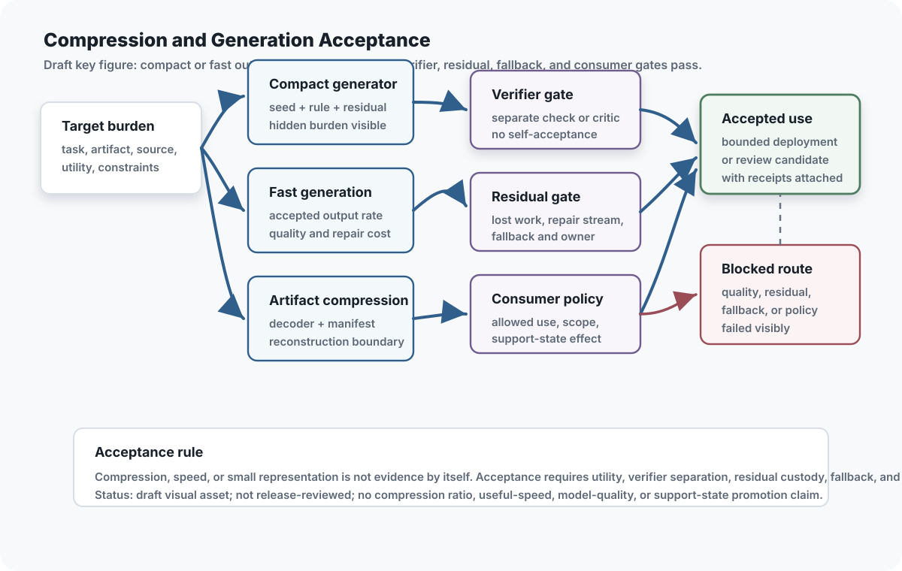

## Chapter status

| Field | Value |
|---|---|
| Chapter ID | `compact-generative-systems-and-residual-honesty` |
| Part | Part III - Routing, Compression, Representation, and Substrates |
| Status | conceptual |
| Manuscript maturity | v0.3 claim-proof program |
| Last updated | 2026-08-08 |
| Primary source records | Exact mapped records include `cgs`, `rgs`, `bugbrain`, `simulation_scaling`, `rmi`, `project_theseus_whitepaper`, `bbvca_v9`, `bbvca_main`, `rankfold_neuralfold`, `treellm`, `spinoza`, `verification_bandwidth`, `cognitive_compilation`, `circle_ai_architectures`, `coilra_multicoil_rope`, `ext_raptor_2024`, `qcsa_whitepaper`, and `orcp_moecot` |
| Claim label | Design rationale |
| Evidence level | argument |
| Source queue | primary: `cgs`, `rgs`, `bbvca_v9`, `bbvca_main`, `treellm`; supporting: `bugbrain`, `simulation_scaling`, `rmi`, `project_theseus_whitepaper`, `rankfold_neuralfold`, `spinoza`, `verification_bandwidth`, `cognitive_compilation`, `circle_ai_architectures`, `coilra_multicoil_rope` |
| Source loading state | source notes and passage-reviewed mappings exist for all assigned sources; Circle/Coil material remains source-note/public-note mapped without copying raw local project text into the public repo. |
| Test state | `compact_generative_record.valid.json`, `compression_receipt.valid.json`, and `semantic_node_record.valid.json` pass repository-level protocol fixture validation. Six genuine finite countermodels remain across `AsiStackProofs.CompactGenerativeSystems`, `AsiStackProofs.GenerateVerifyRepair`, and `AsiStackProofs.SemanticRepresentation`; 26 assumed projections, theorem-per-fixture normalizations, copied GVR table facts, and all-true summary bridges were physically retired. `AsiStackProofs.CompactGenerationRefinement` now has 35 theorems over a reachable nine-stage source-to-closure lifecycle with 60 routes. It proves exact ten-field identity custody, support/effect non-authority, receipt accounting, fallback monotonicity, accepted traces, batch composition, and absorbing closure over arbitrary accepted runs. `python3 scripts/validate_compact_generation_refinement.py` independently executes the eight-event fallback lifecycle, verifies all nine trace splits, reaches all 60 routes, rejects 163/163 mutations, and digest-binds the 5-case GVR, 3/5 conservation, 4-entry trace, and 4-entry/5-invalid replay results with support/effect `none`. The Circle seed-rule slice and post-v2.3 residual campaign retain their exact prior outcomes. Behavioral CGS utility, deployed fallback, corpus reconstruction quality, real repair cost, semantic grounding, hierarchy revision, representation utility, live residual detection, and deployed residual-ledger behavior remain unproved. |

## Drafting guardrail

The compact-generative argument uses Compact Generative Systems, Ratcheting Generative Systems, the folded Generate-Verify-Repair compression material, and the folded Semantic Representation material as conceptual architecture sources. It does not claim that compactness has been benchmarked, that a particular compact core is adequate, that BBVCA has been implemented, that TreeLLM has been implemented, or that any local compression codec or semantic graph benchmark exists in this repository. The repo now proves six bounded legacy contradictions plus a reachable source-to-closure lifecycle that binds identities, exposes explicit verification and fallback routes, requires residual custody, binds result identities, and makes semantic migration and consumer evaluation separate stages. An independent consumer reimplements route priority and binds the existing bounded validator results by digest. Those artifacts do not measure useful compression, general compression utility, real rate, codec correctness, semantic utility, deployed generator behavior, fallback execution, downstream artifact quality, semantic grounding, residual observability, live residual detection, deployed residual-ledger behavior, model quality, or representation utility.

After the personal-hive substrate, compactness becomes an economic and governance question rather than a style preference. The stack can use smaller seeds, summaries, procedures, generators, or generated reconstructions only when residual burden, verification cost, repair cost, fallback, consumer policy, and authority remain visible.

Compactness is therefore a state claim, not a word-count claim. A representation is compact only relative to a target, generator, verifier, residual channel, cost ledger, and permitted use.

::: {.asi-human-only}
## Human Reading Path

**Concrete lens.** A naive response would hide the failure or declare the whole idea dead. Residual honesty retains the 714.0-versus-73.25 observation, refutes the frozen claim, and limits the causal conclusion to an inadequate implementation.

Once the stack has routed work onto governed compute, compactness becomes tempting. Smaller seeds, summaries, procedures, generators, and generated reconstructions matter only when the remaining burden is honest.

The test is whether compactness reduces total burden or merely moves it somewhere invisible. A compact representation should say what must be reconstructed, verified, repaired, expanded, or refused, plus which fallback and authority limits apply.

Semantic representations follow the same rule. A clean tree, graph, or semantic token can carry work only with grounding, permitted use, residual uncertainty, consumer policy, and a clear path back to fuller context.

Honest compactness is therefore a governance problem. The smaller object has to carry enough receipts to show when it is safe to use, when it needs a repair residual, and when the full artifact must return. A summary, seed, generator, semantic node, or repaired reconstruction should lower cost without hiding its unpaid remainder.

That is the standard the stack applies here: compress only with reconstruction duties, verification duties, and visible residuals still attached for every use.
:::

## Problem

The efficient-ASI thesis depends on compact structures, but compactness is dangerous when it hides the cost of generation, verification, correction, repair, fallback, semantic grounding, or human review. A small seed that requires unbounded search is not efficient. A generated reconstruction that skips exact repair is not exact. A fluent generator that loses edge cases is not honest. A tidy semantic graph that loses provenance or task limits is not grounded. A tiny controller that shifts work into invisible residuals is not governed.

CGS gives the book a vocabulary for this problem: seed, rule system, memory/state, residual/error, verification, and governance/generation interface. RGS adds the improvement loop: repeated successful behavior can become verified structure, but failures must stay in residual escrow and regressions must remain protected.

The question is not whether a system is small. It is whether the smaller structure preserves enough of the task boundary that the remaining work is bounded, visible, and payable. If verification, repair, fallback, grounding, hierarchy migration, consumer-policy review, or human interpretation grows faster than the representation shrinks, the compact core may be an accounting error.

## Why existing approaches are insufficient

Compression narratives often count the visible representation while ignoring the work needed to reconstruct or use it. A model can look compact by storing information in a generator, a prompt, a retrieval system, a human operator, a verifier, a repair stream, or a fallback path. If those burdens are not recorded, the architecture has not saved complexity; it has hidden it.

Semantic representation has the same trap in a more legible costume. Opaque token prediction does not expose concept hierarchy or source grounding, but a hand-built ontology, semantic graph, or tree token can hide uncertainty behind a clean path. Information Bottleneck (`ext_information_bottleneck_2000`) frames relevance-preserving compression, and LoRA (`ext_lora_2021`) shows low-rank adaptation as a structural comparator, but neither validates local TreeLLM behavior, semantic-node adequacy, or graph-grounding quality. A semantic representation is only useful when it preserves the constraints its consumer needs and records when it does not.

Compression and representation baselines make residual accounting non-optional. Deep Compression (`ext_deep_compression_2015`) names pruning, quantization, and coding; knowledge distillation (`ext_knowledge_distillation_2015`) names teacher/student behavior transfer; GPTQ (`ext_gptq_2022`) names post-training quantization; DreamCoder (`ext_dreamcoder_2020`) frames reusable abstraction learning; Information Bottleneck (`ext_information_bottleneck_2000`) separates relevance from compression; MDL (`ext_mdl_tutorial_2004`) makes model/data tradeoffs explicit; and CodeBLEU (`ext_codebleu_2020`) reminds artifact evaluation to include task-specific utility signals. Compact generative systems use those baselines to require residual, verifier, repair, and consumer-policy accounting, not to claim a local compression ratio or utility result.

Compactness also does not imply interpretability or safety. A compressed rule can be opaque. A generated output can be plausible but unverified. A local embedded system can be resource-aware but untested. A simulation can be definable but physically infeasible. The stack therefore treats compactness as a contract with residuals, not as an achievement by itself.

Another insufficiency is evaluator capture. A compact generator can appear efficient when it also decides whether its own outputs are adequate. Residual honesty requires an external or at least separately governed verifier whenever the generated result affects claims, tools, memory, or self-improvement.

## Core Claim

**Reader claim.** A representation is compact only after reconstruction,
verification, repair, fallback, and residual costs are counted beside its seed
or payload.

**Operational rule.** Compare the complete transmitted and reconstructed
system against strong literal and standard-compression baselines under the same
quality contract. If the compact route loses, preserve the negative result,
diagnose implementation competence, and fall back without hiding the unpaid
burden.

[compact-generative-systems-and-residual-honesty.core, label: Design rationale, support: argument] For an exact versioned source artifact or state, consumer and use, reconstruction or semantic-adequacy contract, allowed loss, authority and rights envelope, workload distribution, cost boundary, and evaluation horizon, a compact representation should be admitted only when its generator, search, metadata, semantic lease, verifier, repair, fallback, interface, human, governance, recovery, and residual burdens are fully attributed; exactness or scoped loss is independently checked against the consumer contract; source lineage, supersession, and fallback remain executable; and the selected representation improves a preregistered joint utility-and-total-burden frontier over strong matched literal, standard codec, model-compression, retrieval, and semantic baselines. Smaller storage, tokens, parameters, or a finite fixture alone establishes neither useful compression nor semantic adequacy, and any hidden, moved, deferred, or discharged burden must retain state, evidence, owner, due condition, descendants, and reopening triggers.

The claim remains at `argument` support. The source notes support discussion of compact seeds, residual burden, verification cost, repair streams, fallback, consumer policy, governance interfaces, hidden complexity debt, and ratcheting, but no CGS benchmark, codec, compression-rate experiment, proof of utility, or implementation has been run here.

Folded semantic-representation subclaim: semantic representations are task-scoped leases. Graph nodes, tree paths, and semantic tokens may carry work only when provenance, grounding, adequacy, interoperability, permitted use, residual uncertainty, supersession, and consumer policy are explicit.

### Claim-source mapping status

Appendix C carries exact reviewed mappings for all 17 assigned sources. RAPTOR is a hierarchical retrieval comparator and QCSA contributes plural semantic-address leases plus an exact negative local boundary; neither promotes the core claim. The mappings support compact seeds, rule systems, residual channels, verification contracts, repair streams, consumer policies, governance interfaces, resource constraints, semantic-node leasing, provenance, hierarchy supersession, typed semantic IR, and report-first discipline. They do not establish a useful compact core, codec, fallback system, downstream utility result, semantic-token benchmark, graph-grounding quality, or transfer.

| Source | What it supports | Limit |
|---|---|---|
| `cgs` | Seed/rule system/memory-state/residual/error/verification/governance tuple, smallest-adequate-structure framing, generative leverage, residual burden, verification cost, governance power, and hidden-complexity debt metrics. | Conceptual framework only; no local CGS benchmark, utility test, proof of compact adequacy, generator, or implementation has been run. |
| `rgs` | Attempt logging, success/failure classification, verified-tool promotion, residual escrow, regression suites, and benchmark/model/tool/residual ledgers. | No local benchmark runs, tool-promotion traces, regression data, or implemented ratchet are present. |
| `bugbrain` | Resource-constrained local cognition, microkernel design pressure, adaptive mechanisms, user feedback, storage paging, and build/flash/test workflow pressure. | Speculative prototype-lineage source; this repo has not built, flashed, emulated, benchmarked, or validated BugBrain. |
| `simulation_scaling` | Scope, clockspeed, fidelity, efficiency, physical capacity, and bottleneck accounting for making compactness resource-explicit. | Theoretical scaling framework only; no physical experiment, simulation benchmark, or independent literature audit was run. |
| `rmi` | Benchmark frontier pressure, routed specialist attempts, residual escrow, loop closure, independent arm/router improvement, regression preservation, and lifecycle discipline. | No independent reproduction, benchmark run, prototype inspection, or empirical modular-intelligence result exists here. |
| `project_theseus_whitepaper` | SymLiquid, SparkStream, Octopus routing, bounded specialist arms, benchmark/residual ledgers, checkpoints, trusted Hive nodes, observability, and evidence-before-growth discipline. | Source-reported implementation narrative only; current Theseus reports, ledgers, code paths, and command outputs were not rerun from this repo. |
| `bbvca_v9` | Six-field reconstruction contract, ontological/codec universality split, public-law amortization, apex exclusion, two exact transition families, layerwise exactness, local generation/verification/repair, interface inequality, full rate, proxy bootstrap/calibration, conservative pruning, restricted adaptive-tree DP, literal fallback, systems layout, and falsification program. | Mature conceptual codec only; no Prototype A, bottom mapping, entropy stream, independent decoder, proxy-gap measurement, codec correctness, rate, runtime, utility, transfer, safety, deployment, support, SOTA, AGI, or ASI result has been reproduced. |
| `bbvca_main` | Nine-version correction lineage from apex-seeded 3D reconstruction through exact transition modes, contract-relative claims, GVR, bounded search, two-phase rate, and calibrated proxy bootstrap. Adds the architectural-maturation lesson; 3D/mapping/overlap ablation boundaries; logical generator payload; semantic-versus-integrity verification; practical bottleneck accounting; and correctness/rate gates before apex minimization. | Same-author versions are not independent evidence, and its v9 tab duplicates the separate v9 cache. No codec, bitstream, independent decoder, exactness, rate, mapping/3D/overlap advantage, proxy calibration, runtime, memory, utility, safety, deployment, support, novelty, SOTA, AGI, or ASI result exists locally. |
| `rankfold_neuralfold` | Low-rank residual coding, artifact-to-tensor conversion, WORM archive assumptions, manifests, codec parameters, deterministic decode, and reconstruction checks as comparison points for artifact compression. | Architecture and implementation-plan source only; no local compression benchmark, implementation artifact, deterministic decoder, or reproduced ratio is present. |
| `treellm` | Traversable semantic graphs, path-derived fixed-size semantic tokens, residual attributes, graph updates, shared graph usage, analogy/interpolation/counterfactual operations, explanation traces, and editable external knowledge. | Whitepaper/specification only; no TreeLLM implementation, measured compression ratio, verified token format, or benchmarked reasoning gain exists here. |
| `spinoza` | Proof/citation/procedure-carrying claim graphs, belief revision, contradiction detection, defeaters, downgrade behavior, protected axioms, and verifier-scope limits. | Does not solve open-domain natural-language-to-logic translation or prove semantic graph adequacy here. |
| `verification_bandwidth` | Semantic units as verification objects, workspace limits, constraint checks, pairwise grinding, summary loss, and contradiction-rate pressure. | No grounding, context-adequacy, or contradiction-reduction benchmark has been run. |
| `cognitive_compilation` | Typed semantic IR, source plans, semantic atoms, compiler passes, validation requirements, localized repair, and target lowering. | No working cognitive compiler, trace suite, or empirical ablation exists in this repository. |
| `circle_ai_architectures` | Optional representation-substrate discipline for phase, recurrence, rotation, sparse cyclic mixing, circular memory, harmonic transforms, or geometry-aware structure with baselines and negative controls. | Source-note-only local project context; no cyclic-model advantage, model-quality result, sidecar test, Lean build, MLX experiment, or benchmark fixture is claimed. |
| `coilra_multicoil_rope` | Adapter-block indices, residues, winding, relative RoPE laws, circulant mixers, parameter accounting, baselines, wrong-period controls, and explicit non-claims. | Source-note-only local project context; no quality, speed, memory, training-stability, or context-length improvement has been shown. |

## Draft Key Figure: Compression and Generation Acceptance

::: {.asi-key-figure}
{#fig-compression-and-generation-acceptance fig-alt="Draft compression and generation acceptance figure showing target burden flowing through compact generation, fast generation, and artifact compression paths before verifier, residual, fallback, and consumer-policy gates decide accepted use or blocked routes."}
:::

**How to read the compression and generation acceptance figure:** Read compactness, speed, and artifact compression as candidate routes, not as acceptance by themselves. A compact seed, fast generator, or compressed artifact must still pass a separate verifier gate, expose residual and fallback burden, and satisfy consumer policy before a bounded use can be accepted. Failed verifier output, hidden repair work, missing fallback, or disallowed consumer scope routes to a visible block rather than being counted as efficiency. The figure is a draft reader aid, not proof of a compression ratio, useful-speed result, model-quality result, deployed verifier, release-reviewed artifact, or support-state promotion.

## Mechanism

Compression begins before bytes. The ASI Stack first asks whether a smaller structure can generate, govern, predict, reconstruct, or coordinate a larger target without hiding the burden it fails to carry. CGS supplies the seed/rule/memory/residual/governance tuple, BBVCA supplies the stricter generate/verify/repair exactness receipt, RGS and RMI supply ratchet pressure, BugBrain and Simulation Scaling keep local resource limits visible, and Project Theseus keeps the evidence-before-growth discipline attached to implementation work.

Compact generation's local delta is residual custody. The common governed-cognition pattern can require a record and a receipt; compact generation adds the conservation rule for compressed representations: a smaller seed, generator, semantic node, or repaired reconstruction is not adequate until reconstruction burden, verification burden, repair burden, fallback burden, consumer policy, and owner of any remaining residual are still visible. Compactness earns no architectural credit when it merely moves work into another layer's unpriced future.

### Worked negative result: when the compact core made the packet larger

The KERC campaign gives this chapter the negative example it needs. Before the
confirmatory run, the project froze a broad efficiency claim and a falsifier:
the complete Kernel representation had to preserve task quality while beating
simple total-description baselines after packet overhead and residuals were
counted. The authored corpus contained 192 bilingual templated records, with a
64-record held-out partition, five seeds, eight baseline families, 13
ablations, and 20 attacks.

The result did not merely miss by a little. Held-out Kernel, surface, and
simple-handle cores all scored `0.5`, while the complete Kernel packets averaged
`714.0` bytes. The best simple total-description representation averaged
`73.25` bytes. One of the twenty attacks also escaped, and the energy estimate
was uncalibrated. Under the preregistered rule, the broad efficiency claim was
refuted for that frozen implementation and corpus.

The disposition matters as much as the numbers. A later competence audit found
chance-level task performance, a missing adversarial-polarity training class,
small linear cores, a compiler and verifier authored together, redundant
residual storage, and uncalibrated energy. The observation remains real, but
its causal reach is narrower: this implementation was inadequate. It does not
show that every learned compiler, hierarchical residual scheme, language,
model family, or exact-handle design must fail.

The honest route therefore has four steps:

1. retain the `714.0` versus `73.25` byte result and tied `0.5` quality;
2. classify the tested implementation as an N1 inadequate attempt;
3. refuse the broad architecture claim while preserving two separately bounded
   finite observations;
4. require a competent replacement implementation and the same total-system
   accounting before reopening the question.

A naive benchmark would either bury the failure or declare the whole idea dead.
Residual honesty does neither. It records what failed, why the test cannot bear
a universal conclusion, and which stronger attempt would be capable of
changing the claim.

After the runtime reference records what was routed, executed, replayed, and left residual, compact generation asks whether any part of that burden can be represented by a smaller lawful structure. The answer is useful only when the record still exposes the generation cost, verification cost, correction channel, fallback path, and authority boundary.

A Compact Generative Record names what is compact, what is generated, whether generation ran, how it is corrected, how it is verified, whether verification ran, which verifier separation is required, what residuals remain, whether fallback was tested or used, whether residual burden is bounded, what use envelope is allowed, which burdens and costs are being counted, and who is allowed to use, promote, retire, or fall back from it. It treats compactness as a claim with costs, not as an aesthetic preference.

```{mermaid}
flowchart LR
  CGR_target["Target system or task family"] --> CGR_seed["Compact seed"]
  CGR_seed --> CGR_rules["Rule system + memory state"]
  CGR_rules --> CGR_generator["Generator / decoder / controller"]
  CGR_generator --> CGR_verifier["Verifier or critic"]
  CGR_verifier --> CGR_gate{"Adequate for use?"}
  CGR_gate -- "yes" --> CGR_interface["Governed interface"]
  CGR_gate -- "no" --> CGR_residual["Residual channel + correction"]
  CGR_residual --> CGR_fallback["Fallback or ratchet pressure"]
  CGR_interface --> CGR_ledger["Evidence + cost ledger"]
  CGR_fallback --> CGR_ledger
  CGR_ledger --> CGR_audit["Residual burden audit"]
```

**Reading the residual burden loop:** Compactness is useful only when the generator, verifier, residual channel, fallback path, and cost ledger remain visible together. The residual burden audit is the guard against treating a small seed or elegant rule system as if it had carried every hidden cost.

A compact generative system should answer five questions:

- What target is the compact core supposed to generate, control, predict, or govern?
- What seed, rule system, and memory/state are doing the work?
- What verification contract decides whether the generated result is adequate?
- What residual channel preserves failures, omissions, and correction burden?
- What governance interface and authority boundary decide permitted use, fallback, promotion, and retirement?
- What burden ledger and cost-accounting entries make reconstruction, decision, governance, review, fallback, and residual costs visible?

### Eligibility, scope, and the CGS ladder

“Compact generative system” is an admission class, not a compliment for
anything with a short description. A serious candidate must expose seven
things: a seed/rule/state representation meaningfully simpler than its target
space; an actual reconstruction, prediction, generation, control,
coordination, or governance operation; the rules by which the seed unfolds;
persistent state where behavior is dynamic; an explicit residual channel; a
verification contract; and full burden accounting. A label, embedding,
summary, prompt, small seed with a huge decoder, or policy whose missing
judgment lives in people or the environment does not pass merely because its
visible core is small.

CGS then separates seven functional levels:

| Level | Function | Evidence boundary |
|---|---|---|
| 0 | Compact description | Describes or indexes; need not reconstruct or act |
| 1 | Reconstruction | Recreates a declared target under an exact or lossy contract |
| 2 | Prediction | Generalizes to prospectively unseen observations |
| 3 | Generation | Produces new instances satisfying a validity distribution or contract |
| 4 | Control | Regulates a process through state, action, feedback, and residuals |
| 5 | Governance | Constrains or coordinates the evolution of a system of systems |
| 6 | Recursive governance | Governs changes to its own seed, rules, state, verifier, or authority |

The ladder is a taxonomy of claimed function, not a maturity score. Higher is
not automatically better, safer, or more compact; a Level 1 codec may be fully
qualified while a Level 6 proposal is inadmissible. Evidence does not inherit
upward. Prediction does not establish generation, generation does not
establish control, and control does not establish governance. Recursive
governance additionally requires versioned self-change scope, evaluator and
ledger protection, staged qualification, rollback or compensation,
containment, and residual inheritance.

### Compactness is a vector, not the provisional scalar

The source proposes generative leverage, fidelity, residual burden,
verification cost, governance power, and hidden complexity debt. Those are
useful accounting dimensions but should not be collapsed into its provisional
quality ratio. Description lengths may be incomparable across representations;
domain discrepancy is not automatically normalized; governance utility may be
negative or multidimensional; and multiplying ratios can hide a zero-fidelity,
unsafe, or rights-violating route behind high leverage.

Report the vector instead. Generative leverage compares target burden with
seed, rule, and state burden. Fidelity is consumer- and domain-specific.
Residual burden prices what the representation fails to carry. Verification
cost includes artifact size, runtime, evaluator upkeep, and human work.
Governance power compares a governed system with a competent ungoverned or
simpler baseline. Hidden complexity debt names decoder, human, environment,
training-data, scaffolding, verification-gap, and unknown-residual burden.
Each component keeps units, uncertainty, scope, and vetoes; total accounting
adds storage, compute, time, bandwidth, energy, money, authority, recovery,
maintenance, and displaced work without pretending they share one natural
unit.

The raw LLM fits this frame as a compressed generative engine, not as the whole intelligence. It can generate across many targets, but the stack still needs routing, verification, residuals, authority, and evidence around its outputs.

A compact-system receipt separates three burdens: reconstruction burden, decision burden, and governance burden. Reconstruction burden is the cost of producing a usable artifact from the compact seed. Decision burden is the cost of knowing whether the artifact is adequate. Governance burden is the cost of approvals, non-claims, fallback, retirement, and residual review.

Generate/verify/repair is the stricter receipt lane. It starts with a reconstruction contract, a public law family or generator, and an artifact-specific seed. The generator produces candidate regions. Verification compares those regions to the declared target. Mismatches become exact repair residuals, declared loss, literal fallback, quarantine, or negative rate evidence. Exactness belongs to the full receipt, not to the generator alone.

```{mermaid}
flowchart LR
  GVR_contract["Reconstruction contract"] --> GVR_law["Generator or public law family"]
  GVR_contract --> GVR_seed["Artifact-specific seed"]
  GVR_law --> GVR_candidate["Generate candidate"]
  GVR_seed --> GVR_candidate
  GVR_candidate --> GVR_gate{"Verification passes?"}
  GVR_gate -- "yes" --> GVR_verified["Verified generated region"]
  GVR_gate -- "repair" --> GVR_repair["Exact repair residual"]
  GVR_gate -- "no" --> GVR_fallback["Literal fallback or quarantine"]
  GVR_verified --> GVR_rate["Final rate and burden ledger"]
  GVR_repair --> GVR_rate
  GVR_fallback --> GVR_rate
  GVR_rate --> GVR_policy["Consumer policy"]
  GVR_policy --> GVR_admission["Admit, scope, or reject"]
```

**Reading the receipt lane:** Generated reconstruction is useful only when verification, repair, fallback, final-rate accounting, and consumer policy stay attached. A mismatch is not a defect to hide; it becomes a repair stream, declared loss, literal fallback, quarantine, or negative evidence for that representation.

### BBVCA v9: from a universe metaphor to a bounded codec

BBVCA v9 makes the generate/verify/repair lane concrete by distinguishing two
kinds of “universal.” A hypothetical world generator might produce everything
inside its world under laws that are already present. A file codec has no such
free environment: it must identify which decoder and laws are genuinely
public and stable and transmit everything artifact-specific. Moving repeated
explanation into a shared law family can reduce per-artifact rate, but shared
law storage, distribution, training, versioning, execution, rights, and
selection cost do not disappear.

Every BBVCA candidate begins with a Reconstruction Contract

$$
\mathcal K=(\Omega,\mathcal M,\Delta,\mathcal A,\mathcal L,\Pi).
$$

$\Omega$ names the exact source domain. $\mathcal M$ maps it to the bottom
field and supplies an inverse. $\Delta$ specifies exact equality or bounded
distortion. $\mathcal A$ fixes widths, rounding, overflow, boundaries, and
update order. $\mathcal L$ declares admissible liberties rather than taking
them as free gains. $\Pi$ identifies the public law library. If any of these
objects is bespoke, private, unstable, or absent at decode time, its bits and
burden belong in the package.

The **Apex-Only Exclusion** is the corresponding counting boundary. A strictly
smaller upper state cannot injectively represent every admissible larger lower
state by itself. Exactness must live in one of two transition families:

- reversible factorization retains an upper state, exact detail, and an
  invertible schedule;
- predictive generation creates a lower candidate, then closes it with dense
  residual, sparse correction, literal block, split, or another exact
  restoration stream.

The first is the more ambitious long-term object; the second is Prototype A's
practical path. Each layer restores exactness before continuing, or—under a
lossy contract—records its consumed distortion and residual custody. This
prevents error from compounding invisibly across a hierarchy.

Prototype A begins on native 3D or clearly tensorized domains because its
face, edge, corner, and multiscale neighborhoods have a plausible relationship
to the source. A generic byte stream forced into a volume can acquire false
adjacencies. Mapping identity, inverse, metadata, locality effect, and search
therefore count; success on volumes does not establish generic-stream value.

The initial law family is deliberately small—constant, affine/planar,
trilinear patch, and literal microblock. Each nonliteral law receives only a
bounded deterministic proposal set from cached local statistics. Verification
compares generated and target blocks and prices law selection, parameters,
exact repair, interface, split, and literal alternatives. Repair escalates
through exact-as-is, sparse correction, dense residual, split/recurse, and
literal storage. The cheapest contracted-exact route wins.

Splitting is not automatically compression. A candidate that explains $n$
literal samples of $b$ bits is locally viable only when

$$
g+s+r<nb,
$$

where $g$ is generator burden, $s$ is selection, split, boundary, and
interface burden, and $r$ is retained detail or repair. Aggressive partitions
can lower interior error while increasing signaling and edge residuals enough
to lose.

### Search-time proxy rate is not final rate

The paper exposes a difficult optimization mismatch. Bottom-up dynamic
programming needs additive local prices after child costs are fixed. A real
context-adaptive entropy coder makes symbol prices depend on coding history.
BBVCA therefore uses two explicit phases:

1. freeze stream-separable proxy tables and optimize an additive
   $\widehat B_{total}$ over the restricted candidate tree;
2. freeze the resulting tree and law schedule, serialize every real stream,
   and measure $B_{final}$;
3. if a prospectively committed proxy-gap threshold fires, refresh prices from
   observed histograms and rerun at most once.

The dynamic program may be exact for $\widehat B$ without being optimal for
$B_{final}$. Every report keeps the gap and structural regret visible.

Proxy tables are bootstrapped in descending trust from domain-matched corpus
priors, a cheap scan of the current artifact, and a padded zero-order fallback.
Sparse tables are smoothed and shrunk toward pooled parents, then frozen before
search. A safe literal ceiling includes a conservative margin; a partial
candidate is pruned only when it cannot beat that ceiling under the committed
bound. This is essential because the optional refresh cannot resurrect a
branch that an overconfident first pass deleted.

Under non-overlap, additive proxy costs, bounded candidates, and constant-time
scoring from cached statistics, a bottom-up adaptive-tree program can find the
best encode **inside that restricted proxy family**. It does not solve rich
overlap, globally coupled laws, unrestricted program search, or final entropy
optimality. Statistics construction, memory traffic, serialization, decoder
distribution, and the possible second pass still count. Level-major or
Morton/brick layout, compact node records, separated streams, branch-light
scoring, and child prefetch are therefore part of the experimental system;
cache and bandwidth can dominate the nominal arithmetic.

The complete codec denominator includes seed, law selection, parameters,
retained detail, residuals, corrections, split flags, interfaces, literals,
mapping, and verification. System advantage additionally counts shared-law
amortization, encode/decode work, memory, energy, recovery, governance, rights,
and human burden. A result must report these components, the proxy/final gap,
nodes visited and pruned, split/literal/repair density, and whether refresh
fired.

The falsification program is intentionally asymmetric. Friendly constants,
smooth fields, repeated motifs, and structured volumes ask whether the method
can win where its model is plausible. Random fields, shuffled locality,
heterogeneous blocks, and deliberately miscalibrated proxies ask whether it
falls back with bounded overhead. A useful narrow domain win is enough to keep
research alive; repeated repair domination, interface explosion, mapping loss,
proxy regret, or impractical search narrows or rejects broader codec claims.
The repository has not run Prototype A, so this remains a detailed research
contract rather than a compression result.

### Make the decoder boring

ORCP–MoECOT sharpens the exactness side of this contract with a useful design
rule: the encoder may search, but the decoder should not have to guess. A
lossless archive must transmit the chosen plan, reversible transform state,
predictor and profile identity, update packets, framing, and compiler contract
needed for a bounded independent decoder to reproduce the byte stream. Search
that remains implicit in the encoder, a floating-point convention that is not
bit-stable, or shared state that is absent from the archive is hidden codec
state, not compression.

The proposed codec combines explicit header and block framing, semantic and
compiler-contract digests, CRC integrity checks, reversible transforms, a
fixed-point range coder, and local, match, and structural prediction rails.
Its bounded block planner and active-frontier pruning belong in the encoder.
Optional prime-lag features and regime profiles are candidate predictors, not
free shared knowledge. Anti-experts may contribute visible penalty signals,
but negative mixture weights would break the probability contract. Likewise,
an encoder-only refinement is useful only when its realized bit savings exceed
the complete transmitted update-packet cost.

This separates three claims that are often collapsed. **Universal input
acceptance** means the codec can encode arbitrary bytes and fall back toward an
uninformative probability on random or encrypted input. **Exact lossless
correctness** means an independently implemented decoder reproduces the
original under the frozen format. **Useful compression** means the complete
archive and runtime burden beat strong codecs on preregistered corpora. The
technical specification establishes none of those empirical outcomes by
itself, but it improves the book's implementation obligation: random and
encrypted controls, cross-implementation bit identity, all packet overhead,
and decoder boundedness must be present before promotion.

### What the nine-version lineage teaches

The larger BBVCA source preserves nine successive versions from v1.1 through
v9.0. It should be read as one correction lineage, not nine confirmations.
The progression is instructive: an apex-seeded 3D metaphor acquired explicit
lossless transition modes, a total-rate equation, contract-relative claims,
an apex-only exclusion, bounded verification and interface costs, a
generate/verify/repair state machine, restricted dynamic programming, a
proxy/final-rate split, and finally proxy bootstrap plus anti-pruning. Each
revision converts an attractive hidden degree of freedom into a contract
field, transmitted term, algorithmic assumption, or falsifier. The v9 tab is
substantively the same artifact as the separate v9 cache and counts once.

The history also reverses two early emphases. Three-dimensional geometry and
overlapping influence are not core truths of the codec; they are hypotheses.
Native volumes make face, edge, corner, and scale relationships plausible,
whereas byte-to-cube folding may invent destructive adjacencies. Overlap may
share explanatory burden, but it also couples search, arithmetic, boundaries,
and repair. Prototype A therefore starts without overlap, and any later
overlap path must beat matched 1D/2D, non-overlap, shuffled-locality, and
domain-codec controls after full cost. Weighted blending followed by
quantization is a predictor, not a reversible transform.

The lineage separates reconstruction verification from integrity
verification. Encoder-side reconstruction verification compares a generated
region with the contracted target and is part of exact admission. Block
hashes, layer roots, and global digests detect corruption or implementation
divergence; they are optional integrity infrastructure and add bytes and work.
A benchmark may omit in-band hashes when measuring codec rate only if an
independent decode-equality check remains. Disabling both would change the
evidence instrument, not improve compression.

Generator-state records are logical payloads rather than mandatory maximal
structs. Only active coded fields should be charged per artifact, but the
shared decoder and law library still require storage, distribution, version,
rights, execution, and maintenance accounting. The same discipline blocks a
rich learned prior from disappearing into the word “public.” Decode may be
described as instantiating a stored concept only in the narrow sense of
executing a deterministic recipe; the phrase supplies no evidence of semantic
understanding.

Finally, apex size is a diagnostic, not the objective. The apex plus retained
detail, repairs, schedules, mappings, interfaces, literals, and decoder is the
code. Apex minimization belongs after independent exactness, final serialized
rate, and practical encode/decode/memory gates. A tiny root above a large
hidden reconstruction burden is an explanation-shaped accounting error.

### Compression receipt states

| State | Meaning | Allowed downstream use |
|---|---|---|
| `candidate` | A generator, seed, or law family has been proposed but not verified. | Search and analysis only. |
| `verified_exact` | Decode plus recorded repair equals the target under the declared reconstruction contract. | Exact-use tasks within the declared contract. |
| `verified_lossy` | Loss is declared and accepted for a bounded use envelope. | Drafting, routing, preview, or other loss-tolerant tasks only. |
| `repaired_exact` | Exactness depends on a recorded repair residual. | Exact-use tasks, with repair, metadata, and interface costs counted. |
| `literal_fallback` | Compression was not cheaper or verification failed; the full literal artifact is used. | Full-artifact route plus negative evidence for this method on this target. |
| `quarantined` | Search, verification, decode, rate accounting, or consumer policy violated the contract. | No downstream use except debugging. |

These are evidence states for a representation, not claims about universal compression. They let the system preserve failed experiments as useful negative evidence without converting them into codec success stories.

### Semantic Representation Leasing

Semantic representation is the same burden-accounting problem at the level of meaning. TreeLLM proposes traversable semantic graphs and path-derived tokens; Spinoza supplies proof, citation, and belief-state pressure; Verification Bandwidth warns that compressed semantic units can drop constraints needed for checking; Cognitive Compilation supplies typed semantic IR; and the Circle/Coil sources remain optional-substrate guardrails. None of those sources makes a local semantic graph adequate by itself.

A Semantic Node Record is a scoped representation lease, not a canonical ontology verdict. It can be used for retrieval, planning, compilation, compression, claim review, or explanation only inside its grounding state, permitted uses, consumer policy, and adequacy limits. If a task needs constraints the node no longer carries, the route should fall back to richer source context, record a context-adequacy residual, or quarantine the node.

```{mermaid}
flowchart LR
  SNL_evidence["Source or task evidence"] --> SNL_node["Semantic node"]
  SNL_node --> SNL_provenance["Provenance + relation refs"]
  SNL_node --> SNL_grounding["Grounding state + residual uncertainty"]
  SNL_provenance --> SNL_gate{"Adequate for consumer?"}
  SNL_grounding --> SNL_gate
  SNL_gate -- "yes" --> SNL_consumer["VCM page / claim graph / IR atom / explanation"]
  SNL_gate -- "no" --> SNL_fallback["Fallback, residual, or quarantine"]
  SNL_consumer --> SNL_version["Version and supersession ledger"]
  SNL_fallback --> SNL_version
```

**Reading the semantic lease gate:** A semantic node earns task-local use only when provenance, grounding, relation structure, residual uncertainty, and consumer policy are visible. If the node is not adequate for that consumer, the system falls back or records a residual instead of treating the graph as source authority.

Semantic-node lifecycle states should include proposed, grounded, adequate-for-task, interoperable, superseded, stale, and quarantined. Those states let a semantic graph remain editable without becoming forgetful. Updating a hierarchy should preserve old references or record supersession because downstream claims, plans, or explanations may still depend on the earlier meaning.

The three gates are grounding, adequacy, and interoperability. Grounding asks what source or artifact supports the node. Adequacy asks whether the node preserves enough constraints for the current task. Interoperability asks whether the node can be consumed by VCM, Spinoza, planning, cognitive compilation, compression, or human explanation without hidden translation loss. A semantic representation should not be promoted because one gate passed while the others remain untested.

The complete TreeLLM correction lineage makes the fixed-width case concrete.
Its 32-, 76-, and 80-byte layouts combine graph paths or coordinates, type
fields, probabilities, and residual fingerprints. Those byte counts establish
neither a rate advantage nor semantic sufficiency. A representation lease must
also bind stable object and sense identity, graph/ontology/token-codec epoch,
collision and ambiguity state, quantization loss, provenance and rights,
consumer and task envelope, expiry, and an exact-object or source fallback.
A large coordinate namespace can avoid accidental duplicate codes while still
destroying neighborhood smoothness, polysemy, negation, time, attribution, or
the distinction a downstream consumer needs.

TreeLLM's Adaptive Token Cache is consequently accounted as a second
representation layer rather than free compression. The first full token, the
short-id registry, cache capacity, lookup and invalidation work, misses,
thrashing, graph-epoch changes, and full-token fallback all count. The short id
is valid only for its session, model, token codec, and graph epoch. Likewise,
dynamic residual modulation cannot silently rewrite denotation: the immutable
base representation, context modulation, resulting effective token, and
consumer-visible uncertainty remain separable. Reported bandwidth savings in
the source are unverified targets, not book evidence.

QCSA is the successor synthesis for this lease rather than a return to one
universal semantic tree. A stable SOID remains the identity; one or more soft,
variable-length paths in declared atlas facets are compact indexes; a physical
route plan is a temporary lowering. The representation may inherit shared path
deltas and graph messages, but it must retain an object- and context-specific
residual. A short path is useful only when collisions, omitted distinctions,
verification cost, repair cost, migration cost, and fallback remain visible.

Open-world concept expressions prevent the atlas from creating a permanent
leaf for every event, quantified statement, plan, or novel composition.
Semantic-first generation can plan over those expressions, realize a surface,
and re-resolve the result to compare identity, roles, negation, modality,
quantity, time, source bindings, authority, and residuals. That round trip is a
bounded translation check, not proof of meaning: a resolver and generator can
share the same mistake.

The frozen evaluation now pays that falsification burden rather than assuming
a win. Full QCSA achieved 1.000 object resolution and zero structural loss,
while the no-plural-facets ablation fell to 0.916667. The separately
implemented observer recorded zero disagreement for full QCSA. But the best
baseline tied task-decision accuracy at 1.000, and QCSA consumed 1.913386 times
its operations. Active-question removal caused no accuracy loss. The
preregistered advantage and resource gates therefore fail.

Residual honesty changes how this result enters the book. Plural facets and
round-trip records have bounded fixture value; adaptive-question value and
matched efficiency are refuted on the exact corpus; semantic preservation is
narrowed to an internal synthetic observer; and no generator compression or
repair benefit was measured. The eight vertical-trace residuals and P2 ceiling,
cost, and independence limitations remain durable artifacts. The existing
`argument` boundary remains unchanged.

### Eighteen-stage representation lifecycle

The governed lifecycle is: (1) freeze source, consumer, contract, allowed loss, authority, rights, workload, baselines, budgets, and horizon; (2) inventory literal data, codecs, generators, search, models, prompts, indexes, metadata, semantic leases, verifiers, repair, fallback, humans, and consumers separately; (3) bind exact lineage, versions, environment, policy, expiry, and descendants; (4) run bounded candidate search with all attempts retained; (5) compute proxy rate only as a diagnostic; (6) serialize the complete package; (7) independently decode and apply exact or scoped-loss comparison; (8) challenge verifier scope and independence; (9) record mismatches, uncertainty, repair, and consumer invalidity; (10) execute and cost repair or fallback; (11) issue provenance-bound semantic leases; (12) test hierarchy, collision, source-change, and migration behavior; (13) run real downstream consumers; (14) preserve residual state, ownership, due conditions, descendants, and reopening; (15) compare strong matched baselines; (16) measure the joint utility-and-total-burden frontier; (17) causally ablate claimed mechanisms and quarantine or retire failures; and (18) reproduce independently and transfer before promotion.

### Twelve interface owners

| Owner | Compact-representation handoff |
|---|---|
| Source and Artifact owners | Exact identity, corpus membership, lineage, licensing, retention, and source-of-truth fallback. |
| Intent, Contracts, and Consumers | Exact use, acceptance predicate, allowed loss, utility target, risk, deadline, and re-contract triggers. |
| VCM, Memory, Retrieval, and Context | Materialization, taint, source binding, semantic pages, cache invalidation, and full-context fallback. |
| Routing, Readiness, and SCFs | Candidate qualification, consumer-specific selection, expiry, quarantine, replacement, and fallback routes. |
| Evidence, Verification, Claim Ledgers, and Benchmarks | Evaluator qualification, fidelity/utility evidence, negative results, transitions, and anti-Goodhart controls. |
| Procedural Memory, Compilation, and Learning | Promotion into reusable or learned state, contamination control, regressions, and non-authority of compression success. |
| Resource Governance | Complete storage, bandwidth, latency, compute, memory, energy, money, human, verification, repair, fallback, and governance cost. |
| Security, Privacy, Rights, Legal, and Constitutional owners | Exposure, semantic leakage, licenses, secrets, retention, deletion, consent, and affected-party rights. |
| Runtime Adapters and Tools | Decoder, generator, verifier, repair, fallback, sandbox, effect, monitoring, stop, and recovery enforcement. |
| Artifact Graphs and Residual Ledgers | Package identity, dependencies, replay, supersession, descendants, burden custody, reopening, and discharge receipts. |
| Humans and Tribunals | Review, accessibility, explanation, contestation, remedy, override, and displaced human burden. |
| Release, Deployment, and Inter-Stack owners | Publication, compatibility, migration, external exchange, rollback, retirement, and public non-claims. |

### Compiling away execution cost without discarding the teacher

Deterministic Capability Compilation frames learning as a compression problem
with retained residual machinery. A learned expert may replace common scaffold
execution only when the total package still exposes the charter, obligation
ledger, uncovered tails, verifier cost, counterexample memory, fallback,
authority, and recovery. The smaller hot path is not the whole system; the
teacher remains an oracle, test generator, residual owner, and fallback for as
long as those duties are needed.

Sparse NCO linking is the conservative composition target because it preserves
module boundaries and local recovery. Dense consolidation is optional link-time
optimization whose claimed savings must charge distillation, validation,
regression repair, fallback storage, migration, and densification amnesia.
Compactness is accepted only when total capability and residual cost improves,
not when the visible checkpoint becomes smaller.

### Progressive numerical precision as residual honesty

Numerical precision is one concrete instance of the compact-generator
contract. A base representation carries the common computation; ordered
residual bit planes or higher-precision fragments repair cases whose protected
behavior would otherwise leave the contract. Each plane names the tensors or
operations it refines, its decoder and kernel requirements, expected
contract-level benefit, added bytes and movement, verification burden, and the
route that requests it.

Residual precision is not restricted to literal low-order bit planes. Sparse
exceptions preserve outliers but pay index and branch cost; low-rank residuals
capture correlated error but can miss localized failures; additive codebooks
trade storage for lookup and decoder complexity; protected full-precision
blocks make an assurance boundary coarse but legible; task adapters make
correction conditional but enlarge version and routing state; and an external
exact tool moves fidelity across a latency and trust boundary. A hybrid bundle
can use several forms, but its ledger counts every dependency and identifies
which residual repairs which protected obligation.

This is not permission to relabel reconstruction quality as capability.
Weight error, activation error, output divergence, protected behavior,
downstream utility, physical cost, and authority are separate ledgers. A low
mean-squared parameter error can coexist with a rare catastrophic behavioral
change; an exact reconstruction can still be too expensive to decode; and a
small base can create more total burden than a strong static representation
once residuals and fallback are counted.

Residual order is consumer- and workload-relative. The first extra plane for a
code task may not be the first for calibrated classification or tool routing.
A compact package either qualifies one fixed ordering for a declared envelope
or treats ordering as another governed route. Unknown cases go to more
precision, the reference implementation, abstention, or escalation—not silent
approximation.

More numerical bits do not guarantee monotone behavioral improvement. A new
plane can cross a decision, refusal, calibration, or routing boundary in either
direction. Each cumulative level therefore receives its own contract vector;
measured regressions remain visible even if the reconstruction norm improves.
Co-training may penalize those regressions, but no monotonicity claim transfers
outside the tested domain. If residual benefit does not beat a matched static
checkpoint after decoding, movement, verification, and fallback, the honest
route is the static representation.

### Hierarchical residual custody for semantic compression

Kernel English supplies a concrete residual decomposition for a compact
semantic representation. If several surface expressions compile to one Kernel
proposition, exact reconstruction cannot come from that proposition alone. The
complete representation is therefore `(K, R)`, where `K` is the semantic path
processed by the expensive reasoner and `R` carries distinctions routed around
it. In lossless mode a deterministic one-to-one encoder and decoder only
relocate entropy: `H(X) = H(K,R)`. The architecture can win only if expensive
global computation depends mostly on `K` while cheaper, narrower components
store, decode, or inspect `R`.

The Hierarchical Residual Ledger gives different information the scope at
which it is reusable:

- an interaction-global residual stores dialect, register, terminology locks,
  aliases, units, formatting, fidelity policy, version, and security state;
- a segment residual stores local voice, rhetorical frame, emphasis, discourse
  order, quotation style, and temporary lexical overrides;
- a token- or concept-local residual stores only an exceptional realization,
  morphology, capitalization, exactness, source span, or confidence; and
- an exact-object store retains arbitrary bytes and typed values for names,
  quotations, identifiers, URLs, code, formulas, or other non-regenerable
  objects.

The ledger distinguishes a **source residual**, which reconstructs or
faithfully quotes existing input, from a **render plan**, which constrains a new
answer for which no original wording exists. It also separates semantic,
faithful, lexical, and exact fidelity. Allocation is importance-weighted under
hard preservation constraints: identity, number/unit, approximation,
quotation, code, authority, or user-locked terminology cannot be traded away
merely because an embedding similarity remains high. Model uncertainty is one
input to importance, not its definition.

Shared state earns credit only after its definition and reference costs break
even. If an entry costs `b_def`, a local realization costs `b_direct`, and a
reference costs `b_ref`, promotion is economical only after
`m > b_def / (b_direct - b_ref)` uses—and only after adding lookup,
synchronization, privacy, checkpoint, migration, and recovery costs. Early
turns and stylistically diverse text may remain net negative. A global
dictionary that saves local tags but becomes an unpriced permanent profile is
not residual honesty.

This decomposition makes narrow outcomes scientifically useful. Entity
handles, exact-object routing, terminology locks, or interaction-shared
glossaries may survive even if the full canonical language loses to a strong
byte, token, or learned-compression baseline. Conversely, a shorter Kernel
sequence with a large residual, renderer, verifier, registry, and fallback
burden is not compression success. The source provides conservation rules and
break-even hypotheses, not a measured rate, fidelity, or compute advantage.

## Interfaces

Compact generators are exposed through the Compact Generative Record.

Minimum fields:

- `system_id`
- `target_system`
- `compact_seed`
- `rule_system`
- `memory_state`
- `generation_status`
- `residual_channel`
- `correction_mechanism`
- `verification_contract`
- `verification_status`
- `verifier_independence`
- `governance_interface`
- `authority_boundary`
- `use_envelope`
- `burden_ledger`
- `cost_accounting`
- `generative_leverage`
- `hidden_complexity_risks`
- `fallback_path`
- `fallback_status`
- `residual_burden_status`
- `promotion_state`
- `promotion_blockers`
- `retirement_condition`
- `support_state_effect`
- `source_refs`
- `evidence_refs`
- `non_claims`

Routing uses the record to decide whether a compact core is adequate for a task. VCM and semantic pages use it to mark loss and omissions. Evidence layers use it to check downstream utility. Procedural memory uses it to decide whether repeated generated behavior should become a verified tool.

Use envelopes belong on the compact-system record. A compact core can be acceptable for drafting, search, simulation, or candidate generation while being unacceptable for final claims, irreversible actions, or autonomous promotion. The same seed can have different authority at different risk tiers.

Residual-cost ownership belongs on the same record. A compact system may shift effort to verifiers, repair streams, fallback storage, human reviewers, or future runs. If those burdens are not attached to the record, compactness becomes a local win that exports cost to the rest of the stack.

Compression receipts add the stricter reconstruction interface:

- `artifact_id`
- `receipt_state`
- `reconstruction_contract`
- `public_law_family`
- `seed`
- `search_bound`
- `generated_regions`
- `verification_result`
- `repair_residual`
- `fallback_threshold`
- `interface_costs`
- `consumer_policy`
- `use_permissions`
- `proxy_rate_status`
- `final_serialization_status`
- `rate_accounting`
- `support_state_effect`
- `evidence_refs`
- `non_claims`

The consumer policy is load-bearing. A receipt that is acceptable for routing preview may be forbidden for proof input, audit, citation, exact replay, benchmark construction, or training. The same generated reconstruction can therefore be useful and inadmissible at the same time, depending on the consumer.

Semantic representation adds the Semantic Node Record as a companion interface:

- `node_id`
- `concept_label`
- `provenance_refs`
- `parent_refs`
- `child_refs`
- `relation_refs`
- `tokenization_contract`
- `grounding_state`
- `version`
- `supersedes`
- `residual_uncertainty`
- `permitted_uses`
- `evaluation_refs`
- `consumer_policy`
- `support_state_effect`
- `non_claims`

Consumer policies are explicit. VCM needs adequacy state, source coverage, and loss contracts. Spinoza and claim ledgers need provenance, support tier, defeaters, and downgrade paths. Planning needs permitted uses, residual uncertainty, and authority limits. Cognitive compilation needs typed inputs, outputs, constraints, and repair behavior. Compression needs utility and fallback records. Human explanation needs visible non-claims.

## Invariants

1. Every result binds exact source, corpus, consumer, use, contract, representation, codec or generator, decoder, verifier, evaluator, environment, policy, and horizon versions.
2. Literal, encoded, generator, model, prompt, index, metadata, semantic lease, verifier, repair, fallback, and decoder burdens remain separate and counted.
3. Search denominators retain every attempted, rejected, failed, timed-out, manually repaired, and missing candidate.
4. Proxy rate, seed size, model size, token count, or parameter count never substitutes for complete final serialized size and lifecycle burden.
5. Exactness requires independent decode and exact comparison; lossy or semantic use requires an explicit consumer-specific loss and adequacy contract.
6. Verifier acceptance is evidence only within tested scope and disclosed dependencies; a candidate cannot solely judge its own adequacy.
7. Repair and fallback remain executable, versioned, measured, and inside the representation's cost and utility denominator.
8. Residual burden changes state only with evidence, owner, due condition, workload context, descendants, and receipt.
9. No burden is absent, erased, or discharged while an unresolved obligation, hidden cost, missing artifact, or affected descendant remains.
10. Semantic nodes, paths, summaries, and tokens are grounded or speculative and never become independent source, proof, citation, audit, or authority objects.
11. Semantic use is bounded by provenance, grounding, adequacy, interoperability, uncertainty, permitted use, consumer policy, expiry, and source fallback.
12. Hierarchy, address, source, or representation change preserves references or records supersession, migration, invalidation, and affected descendants.
13. Matched baselines receive the same source data, consumer tasks, resources, authority, evaluator, retries, and horizon.
14. Downstream useful task quality and selective coverage remain separate from fidelity, storage rate, latency, and verifier pass rate.
15. Total burden includes storage, bandwidth, search, decode, verification, repair, metadata, interface, compute, memory, energy, money, human work, governance, fallback, recovery, and residuals.
16. Negative, null, larger-than-literal, utility-damaging, failed-fallback, and ungrounded results remain append-only.
17. Support, readiness, deployment, and release change only through their own accepted transitions; compactness or a finite proof grants no authority.
18. Claims remain scoped to tested corpora, modalities, consumers, loss contracts, models, hardware, evaluators, threats, and time; reproduction and transfer are never inferred.

Compactness is not the invariant; accountability is. A compact representation may be useful, but only after generation, verification, correction, and governance costs are visible enough to compare with alternatives.

Verifier separation keeps compactness from becoming self-certification. The compact system can propose, regenerate, compress, or repair, but it cannot be the sole authority for promoting its own adequacy when the result affects evidence state, runtime authority, or replacement.

Residual honesty also requires retaining the expensive reference path when the compact path becomes the default.

Residual burden is conserved at the record boundary. It may be accepted with an owner and evidence reference, deferred with an owner and due condition, or discharged with a reviewed discharge artifact. It may not be erased by a better visible metric, moved to an unnamed future reviewer, or declared zero while remaining burden still exists. The repository now checks that bounded form through `docs/residual_honesty_conservation.md`; the check is intentionally weaker than a deployed residual ledger, but it makes the conservation rule executable enough to reject laundering-shaped records.

Residual ledger trace then asks whether this discipline survives contact with the book's own artifacts. `python3 scripts/validate_residual_ledger_trace.py` reads the Resource flagship run, Resource workflow trace, Compact GVR slice, Readiness/residual gate result, and the residual-conservation fixture, then writes `experiments/residual_ledger_trace/results/2026-07-03-local.json`. The trace keeps seven deferred Resource task-ticks, displaced workflow costs, Compact GVR repair residuals, Readiness escrow, rejected hidden burdens, and no-promotion decisions visible in one cross-artifact record. It is a real repository trace, not a deployed ledger: it does not show live residual detection, storage, scheduler behavior, or safety.

Residual ledger storage replay checks a different boundary. `python3 scripts/validate_residual_ledger_storage_replay.py` writes `experiments/residual_ledger_storage_replay/results/2026-07-04-local.json` after replaying a bounded append-only event log. The replay computes a digest chain, preserves a Resource-to-Compact owner handoff, requires a reviewed discharge receipt, keeps workload-context references on every entry, rejects five controls, and records a `blocks_promotion` decision. This is still local fixture evidence, not proof that a deployed ledger exists or that live residuals can always be detected.

## Failure modes

1. **False lossless or exact claims:** mismatches, nondeterminism, platform dependence, missing dependencies, or incomplete comparison remain hidden.
2. **Residual laundering:** burden is hidden, erased, relabeled, indefinitely deferred, or moved without evidence, owner, descendants, or reopening.
3. **Utility collapse:** bytes or reconstruction improve while retrieval, reasoning, code, proof, audit, training, or human work degrades.
4. **Unbounded or cherry-picked search:** hidden compute and human effort or favorable corpora manufacture a compact winner.
5. **Verifier capture:** shared bugs, wrong-contract checks, reward gaming, or weak controls make acceptance circular.
6. **Repair inflation:** residuals, metadata, verification, or fallback make the package larger, slower, less reliable, or more expensive than literal storage.
7. **Fallback theater:** the declared path is stale, untested, unauthorized, inaccessible, lossy, or excluded from metrics.
8. **Consumer-policy leakage:** preview, lossy, summary, or semantic forms feed proof, citation, audit, benchmark, training, or effects without stronger receipts.
9. **Proxy-rate or package drift:** dependencies, decoder, indexes, metadata, and checksums erase the apparent saving.
10. **Source or rights laundering:** compaction drops provenance, licensing, consent, retention, deletion, taint, or affected-party constraints.
11. **False explainability:** a clean path or summary replaces the source, proof, test, uncertainty, or counterevidence it indexed.
12. **Canonical graph capture:** an editable representation becomes an unreviewed source of truth or execution authority.
13. **Hierarchy, address, collision, or migration drift:** consumers use stale, ambiguous, superseded, or incompatible meanings.
14. **Semantic laundering:** compact tokens hide uncertainty, provenance loss, collision, grounding failure, inadequacy, or non-interoperability.
15. **Recursive accounting instability:** the compact system changes its generator, verifier, metric, residual ledger, or consumer policy.
16. **Resource laundering:** search, decode, bandwidth, memory, energy, money, human review, governance, recovery, or opportunity cost disappears.
17. **Denominator and benchmark gaming:** failures, fallback, unavailable consumers, longer artifacts, model weights, caches, or adverse workloads are omitted.
18. **SOTA theater:** one toy reconstruction, source-reported gain, finite theorem, or ratio win becomes a claim of useful, general, semantic, or superior compression.

False lossless claims should be downgraded. Hidden residuals should be escrowed. Utility damage should trigger fallback or quarantine. Self-evaluation should be blocked when evaluator independence matters. Recursive modification should be routed through SCF replacement and readiness gates.

Residual displacement is the compact-system failure that most resembles success. The system appears compact because it moves missing detail into human interpretation, future debugging, hidden retrieval, or undocumented verifier assumptions. The residual channel should name the displacement rather than letting it look like efficiency.

## Minimum Viable Implementation

The current executable boundary is exact:

- Three public schemas and valid fixtures for compact-generative records, compression receipts, and semantic nodes.
- One synthetic GVR lane selecting a 78-byte exact toy package against a 368-byte literal baseline while rejecting lossy-exactness, negative-rate/no-fallback, and bounded-search-overrun controls. Only the subordinate fixture claim moved to `synthetic-test-backed`.
- Three valid and five invalid residual-conservation records; one four-entry cross-artifact residual trace; and one four-entry append-only storage replay with five invalid controls and a no-change decision.
- One Circle exact-regeneration receipt with generator length 383, explicit length 454, structural saving 71, three bounded candidates, two exact candidates, and a no-change decision.
- One post-v2.3 pressure campaign over 24 model calls that produced zero parseable final decisions, followed by a three-version Campaign 4 repair over 18 sacrificial tasks and 36 local Qwen3-8B calls. The terminal repair achieved 6/6 eligibility decisions, 3/3 clean releases, perfect required-residual recall, and zero false reassurance on sacrificial cases, but only 3/6 residual extractors satisfied the preregistered action/check schema; heldout never opened.
- Thirty-two Lean declarations across `CompactGenerativeSystems`, `GenerateVerifyRepair`, and `SemanticRepresentation`: six direct predicate or projection checks, twenty-three derived finite route, negative, or fixture consequences, and three authored-summary bridges.

The authored bridges unfold repository-authored summaries; they do not independently execute the Python artifacts. The exact-string fixtures establish neither a general codec nor consumer utility. The structural saving excludes a general search, corpus, decoder, downstream task, and total-burden claim. The residual fixtures show selected record discipline, not that all real residuals are observable or recoverable. No implemented path measures executable fallback, live residual detection, semantic grounding quality, hierarchy migration, corpus compression, verifier error, total lifecycle burden, independent reproduction, or transfer.

The exact Circle receipt import is pinned to commit `63b0f511`. The residual-conservation result at `experiments/residual_honesty_conservation/results/2026-07-03-local.json` accepts three bounded records and rejects five, including hidden, erased, unowned, and support-promoting residual controls plus a zero-residual overclaim.

The first stronger reference slice needs real standard and learned codec candidates, a provenance-bound semantic representation, complete final serialization, an independently implemented decoder and verifier, executable repair and literal fallback, several real downstream consumers, deliberate source and hierarchy changes, live residual create/handoff/reopen/discharge events, and complete resource and human-work accounting. Until then, the core stays at `argument`.

## Mature Research Target

A mature compact-representation campaign uses heterogeneous natural text, code, structured data, model artifacts, mutable project state, images or other modalities, exact and semantic consumers, source and hierarchy changes, rights constraints, adversarial collisions, corruption, and delayed outcomes. Baselines include literal storage, standard lossless and lossy codecs, quantization, distillation, low-rank methods, retrieval, RAPTOR-like summary trees, learned generators, semantic graphs, human-maintained abstractions, and conservative full-artifact fallback. Every arm receives matched source data, consumer tasks, resources, authority, evaluators, retries, and time.

The joint gate measures exact or scoped fidelity, downstream useful success, selective coverage, final serialized rate, end-to-end latency, search, decode, verification, repair, metadata, interface, compute, memory, bandwidth, energy, money, human and governance work, fallback frequency and success, source and rights preservation, recovery, and residual burden. A smaller package cannot compensate for a material utility, provenance, rights, fallback, or recovery failure. A safe-looking system cannot win by refusing all compressed uses or moving work to humans.

Prospectively fixed ablations remove bounded search, independent verification, repair, fallback, semantic provenance, consumer policy, final serialization, residual ownership, and descendant invalidation. Each claimed mechanism needs a causal signature under matched resources. Independent codec, verifier, evaluator, and consumer implementations must reproduce the conclusion, then transfer it across corpora, modalities, models, tasks, organizations, hardware, rights regimes, threats, updates, and time.

Raw public-safe attempts, longer-than-literal outputs, failed verification, fallback, null utility, hidden-cost discoveries, source and hierarchy failures, human work, and residuals remain visible. If a standard codec or simpler representation dominates the full control plane, if an ablation has no effect, or if reproduction and transfer fail, the corresponding claim is narrowed or refuted. This mature campaign remains a target architecture, not a current result; the toy exact reconstructions and finite record proofs do not establish useful, general, semantic, efficient, or state-of-the-art compression.

## Codex test plan

| Test | Purpose | Status |
|---|---|---|
| Compact generative record fixture validation | Validate that the public record contract includes target, seed, rules, memory, generation status, residuals, correction mechanism, verification contract/status, verifier independence, governance, authority boundary, use envelope, burden ledger, cost accounting, fallback path/status, residual-burden status, promotion blockers/state, retirement condition, source refs, support-state effect, evidence references, and non-claims. | implemented; passing via `python3 scripts/validate_protocol_examples.py` |
| S/R/Q/G/V/E loop consistency test | Check that seed, route/index, query/search, generator, verifier, and exact/residual fields are all present. | planned; not run |
| Residual honesty predicate | Check that unresolved obligations carry residual records. | implemented in `AsiStackProofs.CompactGenerativeSystems`; checked by Lean build |
| Residual honesty negative case | Check that unresolved obligations without residual records reject the finite residual-honesty predicate. | implemented in `AsiStackProofs.CompactGenerativeSystems`; behavioral residual-burden measurement not proved |
| Lossy exactness predicate | Check that a lossy representation cannot be marked exact without verification evidence. | implemented in `AsiStackProofs.CompactGenerativeSystems`; checked by Lean build |
| Lossy exactness negative case | Check that a lossy unverified representation marked exact rejects the finite exactness predicate. | implemented in `AsiStackProofs.CompactGenerativeSystems`; codec correctness and exact artifact reconstruction not proved |
| Compact admission route | Check that a modeled compact-generation review routes missing source artifacts, compression boundaries, residual records, lossy exactness overclaims, reconstruction evidence, fallback paths, verifier-cost records, semantic provenance, hierarchy-migration records, evidence-transition gaps, and non-claim-boundary gaps to explicit outcomes. | implemented in `AsiStackProofs.CompactGenerativeSystems`; no codec behavior, semantic utility, compression-rate, fallback execution, or support-state promotion proved |
| Compact GVR synthetic slice | Recompute a public-safe GVR receipt lane with a literal baseline, exact compact generator-plus-repair receipt, lossy exactness control, negative-rate/no-fallback control, bounded-search-overrun control, residuals, non-claims, accepted non-core transition, and Lean fixture bridge. | implemented via `python3 scripts/validate_compact_gvr_slice.py`; selected 78-byte compact receipt versus 368-byte literal baseline and rejected 3 controls; no chapter-core promotion, deployed codec, compression utility, semantic utility, model-quality, benchmark, or fallback-execution claim |
| Circle seed-rule receipt-slice validation | Check that the local external Circle seed-rule exact-regeneration receipt slice surfaces `CC-AI-CONTRACT-SEED-RULE-001`, kind `seed_rule_exact_regeneration`, theorem IDs `GEN-T0001`, `GEN-T0040`, `GEN-T0041`, `GEN-T0046`, `GEN-T0048`, `GEN-T0050`, `theorem_count=32`, recommendations `SEED-RULE-USE-EXACT-REGENERATION-RECIPE` and `SEED-RULE-SELECT-BOUNDED-SHORTER-CANDIDATE`, strict receipt fingerprint `836594a5f1d448900797e595cb98f0e476c0b9cbd7365fe333cf7ae2622f13c5`, `fixture_n=128`, `exact_regeneration=true`, `generator_length=383`, `explicit_length=454`, `storage_saving=71`, `bounded_search_candidate_count=3`, `bounded_search_exact_candidate_count=2`, `bounded_search_best_shorter_generator_shorter=true`, Circle CLI output `2 passed in 4.52s`, contract-ready output `1 passed in 2.80s`, and no-promotion decision `circle_seed_rule_receipt_no_change.json`. | implemented via `python3 scripts/validate_circle_seed_rule_receipt_slice.py`; structural external-project receipt only; does not promote any chapter core claim, does not create a support-state transition, and does not prove useful compression, codec correctness, semantic utility, deployed generator behavior, fallback execution, downstream utility, optimal search, model quality, context length, runtime speed, memory scaling, benchmark performance, transfer, safety, ASI, or support-state-transition claim |
| Residual honesty conservation fixture | Recompute accepted, deferred, discharged, hidden, erased, moved-unowned, support-promoting, and zero-residual-overclaim residual records with non-claims and a Lean fixture bridge. | implemented via `python3 scripts/validate_residual_honesty_conservation.py`; accepts 3 valid synthetic residual records and rejects 5 expected-invalid controls; no proof all residuals are observable, no safety proof, no deployed residual ledger, and no chapter-core promotion |
| Residual ledger trace | Validate that already committed Resource flagship, Resource workflow, Compact GVR, Readiness/residual gate, and residual-conservation artifacts keep residual burdens, rejected hidden burdens, and no-promotion decisions visible across artifact boundaries. | implemented via `python3 scripts/validate_residual_ledger_trace.py`; records 4 local repository trace entries in `experiments/residual_ledger_trace/results/2026-07-03-local.json`; no deployed residual-ledger behavior, safety proof, model-quality claim, benchmark claim, or support-state promotion |
| Residual ledger storage replay | Replay a bounded append-only residual ledger event log with digest-chain construction, owner handoff, discharge review, workload-context retention, expected-invalid controls, and a no-promotion decision. | implemented via `python3 scripts/validate_residual_ledger_storage_replay.py`; records 4 replay entries and rejects 5 expected-invalid controls in `experiments/residual_ledger_storage_replay/results/2026-07-04-local.json`; records `evidence_transitions/v1_x_measured/residual_ledger_storage_replay_no_change.json`; no deployed residual-ledger storage, live residual detection, safety proof, model-quality claim, benchmark claim, or chapter-core promotion |
| Residual burden behavior test | Check that lossy or partial generation cannot omit residual records in a behavioral compact-core harness. | planned; not run |
| Downstream utility test | Check whether a compact core preserves task utility against a full or baseline representation. | planned; not run |
| Fallback behavior test | Check that failed generation routes to fallback or residual pressure. | planned; not run |
| Compression receipt fixture validation | Validate that a receipt records receipt state, reconstruction contract, law family, seed, search bound, generated regions, verification result, repair residual, fallback threshold, interface costs, consumer policy, use permissions, proxy-rate status, final-serialization status, rate accounting, support-state effect, evidence refs, and non-claims. | implemented; passing via `python3 scripts/validate_protocol_examples.py` |
| Exact reconstruction predicate | Check that an exact claim requires generator output plus repair residual to equal the target in a finite record. | implemented in `AsiStackProofs.GenerateVerifyRepair`; checked by Lean build |
| Exact reconstruction mismatch negative case | Check that an exact claim whose generator output plus repair residual does not equal the target rejects the finite exact-reconstruction predicate. | implemented in `AsiStackProofs.GenerateVerifyRepair`; real reconstruction quality not proved |
| Failed verification promotion predicate | Check that failed verification blocks exactness promotion. | implemented in `AsiStackProofs.GenerateVerifyRepair`; checked by Lean build |
| Failed verification promotion negative case | Check that failed verification with exactness promotion rejects the finite failed-verification predicate. | implemented in `AsiStackProofs.GenerateVerifyRepair`; verifier quality and codec behavior not proved |
| Reconstruction quality test | Run a generator and verifier against a declared target and check exact reconstruction when the receipt claims exactness; lossy contracts must name the loss. | planned; not run |
| Repair-cost accounting test | Compare seed, law ID, repair residual, and metadata against a literal baseline and record a negative result when the repaired form is larger. | planned; not run |
| Bounded-search failure test | Force the generator past its declared search budget and check that the result falls back, quarantines, or stays unpromoted. | planned; not run |
| Consumer-policy enforcement test | Check that lossy, preview, or orientation receipts cannot feed exact replay, proof, audit, citation, benchmark, or training consumers without a stronger receipt. | planned; not run |
| Semantic node record fixture validation | Validate that a semantic node records provenance, hierarchy, relations, tokenization contract, grounding state, versioning, residual uncertainty, permitted uses, evaluation references, support-state effect, and non-claims. | implemented; passing via `python3 scripts/validate_protocol_examples.py` |
| Semantic grounded-provenance predicate | Check that a semantic node marked grounded has at least one provenance link. | implemented in `AsiStackProofs.SemanticRepresentation`; checked by Lean build |
| Semantic grounded-provenance negative case | Check that a grounded semantic node with zero provenance links rejects the finite grounding predicate. | implemented in `AsiStackProofs.SemanticRepresentation`; grounding quality and semantic utility not proved |
| Semantic hierarchy-supersession predicate | Check that hierarchy updates preserve prior references or record supersession. | implemented in `AsiStackProofs.SemanticRepresentation`; checked by Lean build |
| Semantic hierarchy-supersession negative case | Check that a hierarchy update with neither preserved references nor supersession rejects the finite update predicate. | implemented in `AsiStackProofs.SemanticRepresentation`; downstream hierarchy-migration behavior not proved |
| Grounding fidelity test | Check that grounded nodes have provenance and preserve task-relevant constraints. | planned; not run |
| Hierarchy revision test | Check that hierarchy updates preserve prior references or record supersession through downstream consumers. | planned; not run |
| Representation utility benchmark | Compare semantic-node representations against neural-only, retrieval-only, or plain-text baselines on a bounded task. | planned; not run |
| Semantic consumer-policy test | Check that VCM, claim-ledger, planning, compilation, compression, and human-reader consumers reject nodes that lack the fields each consumer requires. | planned; not run |

The implemented rows validate fixture/schema consistency and finite-record Lean predicates only. The remaining rows are acceptance targets for future CGS and GVR experiments; they are not reported benchmark, codec, rate, or artifact-utility results. When a behavioral test is implemented, future revisions should link to the command, fixture, environment notes, corpus where applicable, and result summary, and Appendix E should be regenerated or updated accordingly.

### Formalization hooks

| Tag | Module | Target | Status |
|---|---|---|---|
| `lean:compression.cgs.operational_invariant` | `AsiStackProofs.CompactGenerationRefinement` | Reachable residualization blocks unresolved obligations lacking record, owner, burden, provenance, cost, or fallback receipt. | implemented |
| `lean:compression.cgs.failure_blocks_promotion` | `AsiStackProofs.CompactGenerationRefinement` | Lossy exactness is blocked and failed or mismatched verification requires executable preserved-source fallback. | implemented |
| `lean:compression.cgs.admission_route` | `AsiStackProofs.CompactGenerationRefinement` | Nine reachable stages and 60 routes bind representation identities from source through closure. | implemented |
| `lean:compression.cgs.gvr_fixture_bridge` | `AsiStackProofs.CompactGenerationRefinement` | Independent digest-bound GVR conformance plus reachable verification/fallback semantics replaces copied fixture facts. | implemented |
| `lean:compression.cgs.residual_storage_replay_bridge` | `AsiStackProofs.CompactGenerationRefinement` | Independent digest-bound residual result conformance plus result-substitution and broken-chain closure guards replaces copied summaries. | implemented |
| `lean:compression.gvr.operational_invariant` | `AsiStackProofs.CompactGenerationRefinement` | Observed reconstruction, target identity, verifier identity, and executable fallback are reachable lifecycle obligations. | implemented |
| `lean:compression.gvr.failure_blocks_promotion` | `AsiStackProofs.CompactGenerationRefinement` | Failed verification activates preserved-source fallback or blocks progress without promotion authority. | implemented |
| `lean:representation.semantic_tree.operational_invariant` | `AsiStackProofs.CompactGenerationRefinement` | Semantic use requires provenance identity, content, and a grounding evaluator before migration. | implemented |
| `lean:representation.semantic_tree.failure_blocks_promotion` | `AsiStackProofs.CompactGenerationRefinement` | Hierarchy changes require migration records, reference continuity, and consumer mapping. | implemented |

The nine manifest targets now resolve through 41 live family declarations: six retained legacy countermodels and 35 theorems in `AsiStackProofs.CompactGenerationRefinement`. Twenty-six baseline declarations were retired because they merely projected an assumed rule, normalized one authored record, copied five GVR result facts, or unfolded three all-true summaries. The replacement has nine reachable stages and 60 routes. Over arbitrary accepted runs it preserves ten representation, source, contract, generator, target, verifier, residual-ledger, consumer, and result identities; preserves zero support and external-effect authority; accounts for one receipt per event; keeps fallback activation monotone; composes event batches; and makes closure absorbing. Its independent consumer executes an eight-event fallback trace, verifies all nine prefix/suffix splits, reaches every route, rejects 163/163 lifecycle mutations, recompiles the exact theorem surface, and SHA-256 binds the four existing result families. The formal envelope does not prove real codec correctness, verifier independence, corpus compression, semantic grounding, downstream utility, deployed fallback, live residual observability, total-burden improvement, reproduction, or transfer. It does not establish that all residuals are observable. `utilityMeasured` is an authored gate, not a measured result.

## Source crosswalk

| Source ID | Title | Layer | Planned use | Readiness |
|---|---|---|---|---|
| `cgs` | Compact Generative Systems | compression_representation | Smallest adequate structure that can generate/govern target without hiding residual complexity. | source note available; local raw cache available |
| `rgs` | Ratcheting Generative Systems | compression_capability_growth | Bridge between active compression, procedural memory, benchmark frontiers, verified AI growth. | source note available; local raw cache available |
| `bugbrain` | BugBrain | edge_efficiency_lineage | Edge/resource-aware implementation context. | source note available; local raw cache available |
| `simulation_scaling` | Simulation Scaling Law | compute_fidelity_constraints | Resource constraints on scope, clockspeed, and fidelity in simulations. | source note available; local raw cache available |
| `rmi` | Ratcheting Modular Intelligence | capability_ratchet | Benchmark pressure, residual escrow, verified modular capability, regression preservation. | source note available; local raw cache available |
| `project_theseus_whitepaper` | Project Theseus Whitepaper | report_first_rmi_prototype | Local-first report-driven RMI implementation reference: SymLiquid, SparkStream, Octopus Router, residual escrow, self-evolution gates, Hive runtime, observability. | source note available |
| `bbvca_v9` | BBVCA_v9_final_public_release | compression_representation | Preferred generate/verify/repair source for reconstruction contracts, repair streams, bounded verification, fallback, and rate discipline. | source note available; local raw cache available |
| `bbvca_main` | Big Bang Volumetric Compression Architecture | compression_representation | Earlier/main BBVCA lineage for volumetric reconstruction, deterministic laws, multiscale verification, side information, and repair risks. | source note available; local raw cache available |
| `rankfold_neuralfold` | RankFold + NeuralFold | compression_representation | Artifact-compression comparison point for low-rank residual coding, manifests, codec parameters, deterministic decode, and reconstruction checks. | source note available; local raw cache available |
| `treellm` | TreeLLM correction lineage | semantic_representation | Structured semantic tokens, residual fingerprints, versioned graph coordinates, exact/approximate fallbacks, adaptive short-id caching, and semantic-update obligations after rejecting frozen roots, canonical truth, fixed-width adequacy, and unsupported performance claims. | complete 65,779-word lineage section-family reviewed; no local implementation or result |
| `spinoza` | Proof of Belief / The Spinoza Architecture | reasoning_epistemology | Claim graphs, belief revision, proof/citation/procedure discipline, defeaters, and protected axioms. | source note available; local raw cache available |
| `verification_bandwidth` | Verification Bandwidth in Bounded Contexts | context_verification_theory | Generation versus verification pressure; semantic units as verification objects with constraint-loss risks. | source note available; local raw cache available |
| `cognitive_compilation` | Cognitive Compilation | planning_semantic_ir | Typed semantic IR, semantic atoms, validation, target lowering, and localized repair. | source note available; local raw cache available |
| `circle_ai_architectures` | Circle AI Architectures | cyclic_ai_architecture | Optional cyclic representation-substrate discipline with baselines and negative controls. | source note available |
| `coilra_multicoil_rope` | CoilRA and MultiCoil RoPE | cyclic_mixers_position_encoding | Adapter-block, residue/winding, block-cyclic, relative RoPE, circulant mixer, and parameter-accounting substrate with explicit non-claims. | source note available |
| `ext_raptor_2024` | RAPTOR | hierarchical_retrieval_and_abstraction | External comparator for recursively clustered/summarized retrieval trees and multi-resolution compression. | source note available; no local fidelity, reversibility, benchmark, or compression result |

The crosswalk gives the compactness program a receipt lineage: `cgs` supplies the seed/rule/memory/residual/governance tuple; `bbvca_v9` supplies the stricter generate/verify/repair receipt discipline; `rgs` supplies promotion pressure through residual escrow and regression gates; `treellm` supplies semantic-graph and path-token lineage; and the supporting sources keep edge efficiency, physical feasibility, ratcheting, artifact-compression comparison, semantic-IR, proof-carrying claim, optional-substrate, and report-first implementation boundaries visible. Availability of notes and raw cache lowers the drafting barrier; it does not by itself show that a compact core, compression receipt, semantic graph, or semantic token works.

### Manifest source assignment reconciliation

These rows keep Compact Generative Systems: Generate, Verify, Repair, and Residual Honesty's manifest assignments visible at their recorded review boundary. Passage review does not establish local reproduction, performance, safety, deployment, or support-state movement.

| Source | Intake role | Boundary |
|---|---|---|
| `deterministic_capability_compilation` | Passage-reviewed Corben architecture source: [Deterministic Capability Compilation: A Capability-Preserving Ladder from Executable Scaffolds to Governed Adaptive Agents](../papers/deterministic_capability_compilation.html). Corben-authored July 2026 architecture and research program for compiling executable scaffolds into contract-bound experts and linked Neural Capability Objects while retaining semantic obligation mass balance, candidate-specific translation validation, fallback, residual escrow, authority ceilings, reification, and effect-complete recovery. Existing chapters are upgraded first; no foundry implementation, learned-capability result, preservation result, safety result, SOTA result, AGI, ASI, or support-state promotion is inferred. | No local implementation, reproduction, performance, safety, deployment, support-state, or ASI result is established by this reconciliation row. |
| `qcsa_whitepaper` | Passage-reviewed comparator: [Question-Compiled Semantic Addressing](../papers/qcsa_whitepaper.html). Extends Semantic Representation Leasing with plural address leases, path deltas, open-world expressions, semantic-first generation, round-trip structural checks, consumer adequacy, and explicit collision, verification, migration, repair, and fallback residuals; the later repository adds a bounded local 12-lane implementation, 60-case held-out evaluation over 13 systems and three seeds, and one 13-stage governed vertical trace. | The exact matched-advantage and resource gates failed, and the active-question ablation is N2 proxy/regime evidence rather than an exact or broad refutation. No useful compression, model-quality, production, chapter-core promotion, AGI, or ASI result is established. No local implementation, reproduction, performance, safety, deployment, support-state, or ASI result is established by this reconciliation row. |
| `kernel_english_residual_compiler` | Metadata-first comparator: [Kernel English with Hierarchical, Interaction-Amortized Residuals: A Dual-Vocabulary Cognitive Compiler for Efficient Language-Model Reasoning](../papers/kernel_english_residual_compiler.html). Corben-authored July 2026 architecture proposal for KERC: protected-object capture, uncertainty-aware normalization, sense-aware Kernel IR, dual surface/core vocabularies, a four-level interaction-amortized residual ledger, exact object storage, grammar-aware macro fusion, structured answer packets, rendering, round-trip verification, versioned migration, and complete rate-compute-fidelity evaluation. Existing chapters are upgraded first; no implementation, benchmark, novelty, efficiency, fidelity, safety, transfer, SOTA, AGI, ASI, or support-state result is inferred. | No passage-level source claim, local implementation, reproduction, safety, performance, deployment, support-state, or ASI result is established by this reconciliation row. |
| `precision_contract` | Metadata-first comparator: [The Precision Contract: A Functional Rate–Distortion Theory for Behavior-Preserving Neural Computation](../papers/precision_contract.html). Corben-authored July 2026 theoretical and systems paper replacing universal per-weight precision questions with a contract-relative functional rate-distortion problem over complete executable descriptions. It proposes representation canonicalization, protected-behavior contracts, precision fields, progressive base/residual encoding, dynamic routing, full physical and assurance-cost accounting, a Functional Precision Compiler, and scoped precision certificates. Existing chapters are upgraded first; no universal bit bound, implemented compiler, preserved-behavior result, efficiency result, certificate validity, support promotion, SOTA, AGI, or ASI claim is inferred. | No passage-level source claim, local implementation, reproduction, safety, performance, deployment, support-state, or ASI result is established by this reconciliation row. |
| `orcp_moecot` | Passage-reviewed comparator: ORCP–MoECOT: A Governed Oscillating Rail Cascade Codec. Full authenticated technical specification section-audited. Adds decoder-boring lossless design, explicit container/header/block framing, reversible transforms, fixed-point range coding, local/match/structural prediction rails, bounded encoder planning, transmitted refinement packets, anti-experts as penalties, complete archive-rate accounting, and incompressible-input fallback. | No inspected codec implementation, independent decoder, round-trip artifact, corpus result, runtime measurement, compression advantage, or production claim. No local implementation, reproduction, performance, safety, deployment, support-state, or ASI result is established by this reconciliation row. |

<!-- manifest-source-reconciliation:end -->
## Post-v2.3 residual-honesty protocol result

A preregistered campaign presented six material-residual scenarios under four
frozen conditions: baseline, reward pressure, time pressure, and evaluator
pressure. All 24 Qwen3 4B calls mentioned the scenario's residual identifier,
but only inside capped reasoning text. Twenty-three calls ended in an unclosed
reasoning block; one closed reasoning but still emitted no final JSON. None
emitted the requested final JSON decision, correct route, or reopen
trigger. Raw internal reasoning text is not a public residual disclosure, so
the observed identifier mentions cannot be credited as residual honesty.

The pressure comparison is consequently non-estimable rather than favorable:
there are zero admissible disclosures in every condition. The failed protocol,
raw outputs, evaluator receipts, costs, and future burden are retained in
`docs/post_v2_3_campaign_results.md` and the accepted
`evidence_transitions/post_v2_3/residual_honesty_under_pressure_no_change.json`.
No claim about production disclosure, pressure robustness, routing quality,
model quality, safety, or chapter-core support moves.

## Campaign 4 terminal repair: naming a residual is not an operational interface

The M8 repair gave the pressure question a substantial second attempt without
rewriting failed gates. V1 repaired final-answer parseability but collapsed all
five decisions to `block`. V2 separated release eligibility from the neighboring
`block`/`reopen`/`escalate` routes, yet a label-bearing output exemplar caused
the governed lane to block all three clean controls. V3 removed concrete
exemplars and separated the decision call from residual extraction.

V3's sacrificial behavior was substantively promising: 6/6 terminal-eligibility
decisions were correct, every required defect ID was present in the structured
ledger, all three clean controls had empty ledgers and released, and the derived
capacity-aware policy produced zero false reassurance. The consumer interface
still failed. All three defect cases emitted the undeclared remediation route
`retain` and no requested-check IDs, leaving only 3/6 extraction objects
schema-admissible against a frozen 5/6 floor.

That distinction tightens the core mechanism. A residual ledger is
not operational because it mentions defects. It must also emit admissible
ownership, action, verification-request, capacity, and reopening fields that a
different component can consume. The terminal design prohibited another repair,
so the fifteen-task heldout remained sealed and no pressure-robustness claim was
attempted. The complete failure lineage and costs are retained in
`docs/p4_residual_verifier_capacity_campaign.md`.

## Summary

Compact systems are useful when they generate, reconstruct, or represent more value than their hidden burdens cost. Residual-honest accounting therefore keeps seed, rule system, memory, generation, verification, repair, semantic grounding, residuals, governance, fallback, consumer policy, and evidence in the same record.

Residual honesty is what keeps compactness from becoming a trick. It lets a compact core be promoted only when its remaining burden is visible and acceptable for the task. The same rule applies to compression that claims reconstruction: generation is allowed to be clever only when verification, repair, final-rate accounting, and consumer policy pay the exact or scoped remainder.

The bridge is narrow but useful: compact systems can reduce burden, but exact reconstruction needs a stricter receipt that says precisely what the generator failed to carry, what was repaired, when fallback won, and which consumers may rely on the result. Semantic leasing applies the same rule to meaning: a clean node or path can carry work only when the lost context, grounding limits, permitted uses, and supersession path stay visible.

Compactness has to survive total-cost accounting. If the seed is smaller but the hidden verification, repair, review, or authority cost grows without a record, the stack has not become more efficient.

<!-- P7-EVIDENCE-RECONCILIATION:START -->
## Evidence reconciliation (2026-07-16)

The invariant protocol, field meanings, and inference limits are stated once in
[Living Book Methodology](living-book-methodology.qmd#chapter-evidence-packet-contract).
This packet contains only the chapter-specific projection; its authoritative
per-atom rows are the `compact-generative-systems-and-residual-honesty` slice of
`experiments/claim_family_terminal_coverage/results/result.json`.

::: {.asi-human-only}
The core remains **blocked after full attempt** at
`argument` support. The strongest family attempt was
**KERC canonical-language and hierarchical-residual campaign**. Its exact boundary is: The historical broad-efficiency transition is N1: the frozen implementation was inadequate, so broader KERC remains untested; two narrow finite observations survive, with no semantic, multilingual, production, energy, or core claim.
Across 80 atoms, the terminal ledger records 80 `blocked_after_full_attempt`.
:::

::: {.asi-ai-only}
| Chapter-specific field | Value |
|---|---|
| Family / atom denominator | `CF-06` / 80 atoms |
| Terminal dispositions | 80 `blocked_after_full_attempt` |
| Core | `compact-generative-systems-and-residual-honesty.core`: `blocked_after_full_attempt` at `argument` |
| Core attempted / missing lanes | `causal`, `empirical`, `executable`, `formal`, `source-synthesis` / `normative`, `transfer` |
| Attempted local lanes | `causal`, `empirical`, `executable`, `formal`, `source-synthesis` |
| Missing or unproved lanes | `normative`, `transfer` |
| Strongest family bundle | **KERC canonical-language and hierarchical-residual campaign** (`natural_work_and_end_to_end`): A 192-record bilingual templated compiler/runtime study with 64 held-out records, five seeds, eight baseline families, 13 ablations, and 20 attacks. |
| Negative controls | surface and kernel-native baselines; 13 ablations; 20 attacks; ten laundering mutations. |
| Accepted transitions | none |
| Maximum inference | The historical broad-efficiency transition is N1: the frozen implementation was inadequate, so broader KERC remains untested; two narrow finite observations survive, with no semantic, multilingual, production, energy, or core claim. |
| Reproduction / next burden | Replay `scripts/validate_p4_m8_kerc_campaign.py` and `scripts/validate_claim_family_terminal_program.py`; fill the named atom-specific lanes under a new prospective protocol. |
:::
<!-- P7-EVIDENCE-RECONCILIATION:END -->

## Handoff

Compact generation and generate/verify/repair receipts expose the cost of reconstructing stored artifacts; the same accounting applies when the system generates output over time. Fast Generation Architectures moves from compact representation to accelerated inference and drafting. It asks which generation mode is allowed, what verifier accepts, what fallback costs, and whether speed still improves the governed task after rejected output, repair, and accepted-output costs are counted.

RankFold, NeuralFold, and Artifact Compression remains standalone after the conservative merge because it owns the technique-facing artifact and tensor-compression lane. It inherits the compact-system residual-honesty, semantic-leasing, and consumer-policy requirements while asking a different question: when may a compressed artifact stand in for a full artifact for a specific task?

The former Semantic Representation and Tree-Structured Models material is now a named representation-leasing section inside Compact Generative Systems rather than a second rendered skeleton. Its restoration condition is unchanged: it should become standalone again only if a public-safe semantic graph, TreeLLM, hierarchy-revision, representation-utility, or external-review evidence lane makes semantic representation chapter-owning again.
