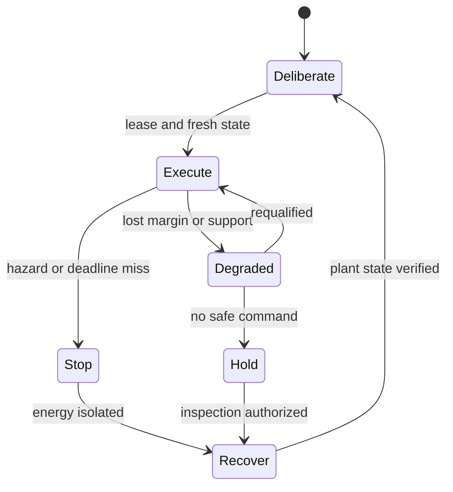

## Chapter status

| Field | Value |
|---|---|
| Chapter ID | `embodied-agency-real-time-control-and-physical-safety` |
| Part | Part II - Planning, Memory, Reasoning, and Execution |
| Status | conceptual |
| Manuscript maturity | v0.1 integrated argument chapter |
| Claim label | Design rationale |
| Evidence level | argument |
| Source loading state | Two passage-reviewed Corben architecture sources supply hierarchical embodied logging and reflex-data policy, and five external records cover generalist robotics, foundation-model physical risks, barrier-function safety filters, independent runtime fallback, and safe-RL taxonomy. No local physical or logging result is claimed. |
| Test state | A 22-declaration finite control-lease model and independent 13-axis mutation validator pass locally; the Project Theseus closed-loop and simulation-to-low-energy-hardware campaigns remain unrun, with no plant, controller, fault, or person observed. |

## Drafting guardrail

This chapter does not equate a successful robot demonstration with general
embodied competence or physical safety. Software rollback is not physical
rollback: momentum, heat, chemical change, contact, released information, and
human injury may be irreversible.

::: {.asi-human-only}
## Human Reading Path

A plan can be valid and an API call authorized while the physical action is
still unsafe. A robot has mass, force, timing, contact, blind spots, wear, and a
changing environment. It can miss a deadline, saturate an actuator, lose a
sensor, enter a state from which its backup controller cannot recover, or
continue moving after software thinks the task has stopped.

The physical layer translates a symbolic action into a time-indexed control
lease. The lease names the plant, controller, state estimator, safe region,
force and speed limits, deadline, interlocks, fallback controller, independent
stop path, human-presence rules, and compensation limits. Authority shrinks as
uncertainty or latency grows. A model may propose actions, but it does
not become the safety controller because it is capable.

Choosing an action differs from keeping a plant inside its envelope while the
action unfolds. Each period can reveal delay, contact, or human presence.
Enough margin must remain to filter commands, reach fallback, stop energy, and
observe effects. Even a successful stop records what moved, what remains
irreversible, who must inspect it, and which evidence expired.
:::

## Problem

**Mechanism.** Freeze the plant, task, environment, people and assets at risk, hazard set, consequence severity, operating region, authority envelope, and stop conditions before granting motion. **Failure mode.** A semantic task label can hide force, speed, energy, contact, workspace, and bystander consequences. **Non-claim.** A hazard inventory does not establish completeness or safety. **Source grounding.** The physical-risk survey and Gemini Robotics motivate lifecycle and generalist-control pressure; neither validates this envelope.

The transition from “move the object” to motor commands is not an ordinary tool
call. The controller must repeatedly estimate state, produce commands before a
deadline, respect dynamics and contacts, detect hazards, and preserve a
reachable safe response. Failures continue after a process is killed: a vehicle
coasts, an arm falls, a gripper releases, a vessel remains hot, or a person has
already entered the workspace.

Modern foundation robotics makes the boundary more important. Gemini Robotics
integrates multimodal reasoning and vision-language-action control and reports
adaptation across tasks and embodiments. That is a powerful capability
direction, but open-vocabulary reasoning and smooth demonstrations do not
replace hard timing, state-estimation, force, collision, or fallback evidence.
The physical-risk survey catalogues the broader failure surface. Control
barrier functions, Simplex architectures, and safe-RL methods provide different
mechanisms for constraints and fallback; none is sufficient outside its
assumptions.

### Exclusive job and adjacent boundaries

| Adjacent owner | That owner keeps | Embodied Control owns |
|---|---|---|
| Planning | Goal decomposition, candidate action sequence, and replanning. | Whether a symbolic action can become a safe real-time trace on a named plant. |
| Perception | Admitted observations and uncertainty. | Deadline-bound state estimation and authority narrowing when observations fail. |
| Runtime Adapters | Generic tool permissions, approvals, and effect receipts. | Control periods, dynamics, force/space/time envelopes, interlocks, stops, and physical residuals. |
| World Models | Predicted state and counterfactual branches. | Plant-facing execution and reconciliation under actual dynamics. |
| Governed Operations | Service incidents, recovery, and organizational command. | Immediate plant safety, controlled degradation, and physical stop/fallback. |

```{mermaid}
flowchart LR
  P["Authorized symbolic action"] --> L["Compile plant-specific control lease"]
  L --> C{"State, timing, and safety envelope valid?"}
  C -- "no" --> H["Safe hold, human intervention, or independent stop"]
  C -- "yes" --> A["Advanced controller proposes command"]
  A --> S{"Safety filter / switching monitor admits command?"}
  S -- "no" --> B["Baseline safety controller or stop path"]
  S -- "yes" --> E["Actuate for one bounded period"]
  B --> E
  E --> O["Observe plant and physical effects"]
  O --> C
  O --> R["Effect receipt, irreversible residual, and incident handoff"]
```

**How to read the physical-control safety loop:** the advanced controller never owns the final safety
decision alone. Every control period rechecks state, timing, and envelope; a
separate path can switch to a baseline controller or stop. Physical effects and
irreversible residuals remain visible.

## Why existing approaches are insufficient

**Mechanism.** Keep observation admission, world-state estimation, planning, control choice, safety filtering, actuation, and effect observation as separate receipts with bounded authority. **Failure mode.** A confident perception or language-model plan can bypass timing and plant checks by appearing semantically correct. **Non-claim.** Separation does not prove the interfaces are correctly implemented or independent. **Source grounding.** Gemini Robotics provides embodied capability context, while control and Simplex sources motivate downstream control boundaries.

**A model policy is not a real-time controller.** A large model can reason about
an action while missing the response period, jitter, actuator limits, or
state-estimation requirements of the plant.

**Simulation is necessary and incomplete.** A simulator can expose faults and
support wide sweeps, but it inherits its dynamics, contact, latency, sensor,
and environment assumptions. Simulated safety is not hardware evidence.

**Constraints need an operational fallback.** Barrier functions can enforce a
modeled safe set; constrained RL can shape exploration; Simplex can switch to a
baseline. Each fails if its model, monitor, feasible set, timing, or backup path
is wrong. The control path needs plural evidence and explicit residuals.

**Emergency stop is not effect-complete recovery.** The system must know which
commands reached actuators, what motion or energy remains, which interlocks
engaged, what human or environmental effects occurred, and which compensation
or inspection remains.

**Human proximity changes the contract.** Presence, predictability, consent,
communication, accessibility, and escape routes matter. A safe empty-cell
demonstration cannot authorize operation beside people.

### Strongest objection

No general software architecture can guarantee physical safety across unknown
plants. That boundary is accepted. The control contract prevents a general AI
claim from erasing plant-specific control evidence. It fails if its extra
machinery cannot improve hazard containment, deadline behavior, recovery, or
residual honesty relative to a competent conventional controller and safety
system.

## Core Claim

[embodied-agency-real-time-control-and-physical-safety.core, label: Design
rationale, support: argument] A symbolic action is eligible for physical
execution only when a plant-specific control lease binds embodiment and
workspace identity; dynamics and state-estimator versions; control period,
latency, and jitter budgets; actuation, force, speed, energy, space, and contact
limits; human-presence state; safe set and model assumptions; advanced,
baseline, and stop-controller identities; switching and interlock logic;
exploration authority; communication and power failure behavior; effect
observation; compensation and irreversible residuals; costs; and expiry.
Simulation success, an end-to-end model demonstration, a barrier certificate,
a safe-RL label, a software rollback, or a schema-valid receipt alone
establishes neither physical safety, human safety, effect reversal, support,
readiness, release, transfer, nor SOTA.

## Mechanism

**Mechanism.** Bind dynamics model, state estimate, uncertainty, reachable set, control period, sensing and compute latency, jitter, actuator lag, saturation, braking distance, and deadline misses into each control lease. **Failure mode.** A mathematically admissible command can become unsafe when executed late or under the wrong plant model. **Non-claim.** Timing accounting does not prove reachability estimates or real-time schedulability. **Source grounding.** Control-barrier-function literature exposes model and timing assumptions; no local physical theorem or timing campaign is claimed.

1. **Freeze the plant identity.** Bind embodiment, payload, workspace, firmware,
   actuators, sensors, power, communication, maintenance state, and environment.
2. **Compile the action.** Convert a semantic request into a trajectory or
   controller objective with explicit force, space, time, contact, and
   irreversibility limits.
3. **Establish the safety envelope.** Name safe sets, dynamics assumptions,
   margins, uncertainty, deadlines, and human-presence rules.
4. **Separate controllers.** Record the advanced controller, safety filter or
   switching monitor, baseline controller, and independent stop path with
   distinct trust assumptions.
5. **Admit one bounded period.** Every command is checked against current state,
   latency, envelope, actuator capability, and control authority.
6. **Degrade deliberately.** Lost sensing, compute, communications, power, or
   model support narrows authority toward slower motion, a baseline, hold, or
   stop.
7. **Observe effects.** Record commands sent, actuator acknowledgments, measured
   motion, contact, human entry, environmental effect, and discrepancies.
8. **Recover physically.** Stop, stabilize, isolate energy, inspect, compensate,
   and retain irreversibility rather than claiming state rollback.

The lease is hierarchical in time. A slower deliberative model may propose a
goal, trajectory, constraint update, or recovery option; a real-time controller
closes the local loop; an independent monitor or interlock enforces the
fastest safety boundary. Each layer has a deadline, authority ceiling,
observable state, failure destination, and safe degradation rule. A slower
component cannot borrow the deadline or trust earned by a faster one.

Safety envelopes are conditional objects. They state which plant, payload,
workspace, human-presence mode, estimator, dynamics approximation, disturbance
range, and actuator health make the protected set meaningful. Feasibility is
checked online: if no command satisfies the modeled constraints, the system
does not invent safety by choosing the least-violating command. It enters a
predeclared hold, fallback, isolation, or emergency path and records the loss
of guarantee.

Adaptation is separately governed. Online learning, gain tuning, tool changes,
payload changes, and self-modification may improve control while invalidating
the envelope, fallback comparison, or stop timing. Adaptation happens in a
shadow or bounded region until the changed controller and its interaction with
the independent safety path are requalified.

Effect closure extends beyond the robot state. A command can move an object,
release energy, expose a person, change an environment, or create obligations
that no controller can reverse. The effect receipt follows command, actuator,
plant, human and environment observations, compensation, inspection, and
unresolved harm. Recovery means reaching and verifying an acceptable physical
condition, not loading an old checkpoint.

### Hybrid control, timing evidence, and sim-to-real limits

**Mechanism.** Separate an advanced controller from a simpler safety controller, monitor the approach to the safe-set boundary, and switch early enough that the fallback remains reachable under worst-case delay. **Failure mode.** Shared defects, late switching, oscillation, or an unavailable fallback can turn the monitor into theater. **Non-claim.** A Simplex-style architecture does not prove the baseline controller safe for the actual plant. **Source grounding.** The Simplex source supplies the architectural comparator; this stack has not reproduced its guarantees.

Embodied intelligence is a hybrid system: discrete modes such as
*deliberate*, *execute*, *degrade*, *hold*, *stop*, and *recover* contain
continuous plant dynamics. A controller can satisfy a continuous barrier
condition inside one mode yet become unsafe through a late or invalid mode
transition. The contract specifies mode guards, reset maps, dwell times,
hysteresis, priority, and the monitor that arbitrates simultaneous transitions.

Timing is measured end to end: sensing exposure, transport, synchronization,
state estimation, model inference, planning, safety filtering, queueing,
actuator acceptance, and plant response. Average latency is insufficient; the
lease binds worst-case or defensible tail bounds, jitter, deadline-miss policy,
clock source, and contention. Every command carries the observation age and
prediction horizon it consumed.

The advanced controller and safety path must fail differently enough for
separation to matter. Shared sensing, power, runtime, learned features, code
generation, or networking can create common-mode dependency despite different
component names. Simplex switching and control-barrier filters are strong
comparators, not magic labels: model assumptions, feasible sets, switching
latency, and recovery remain test obligations. Hazard analysis may still
require a mechanically simple stop or energy-isolation path.

Simulation is a development and falsification instrument. Qualification names
which dynamics, contacts, latency, corruptions, humans, and failures are
represented; what was calibrated against the plant; and what remains outside
the simulator. Progression moves from software-in-loop to hardware-in-loop,
bounded empty-cell trials, controlled interaction, and the intended envelope
only as each stage passes positive controls and retains an independent stop.

Evaluation includes ordinary success, boundary behavior, deadline misses,
estimator drift, actuator saturation, unexpected contact, communication loss,
power transitions, human entry, payload change, controller replacement, and
recovery after partial effect. Metrics include task value, envelope violation,
minimum margin, stop distance, isolation time, false intervention, residual
harm, and operator burden. A scripted trajectory cannot stand in for them.



### Hierarchical logs without evidence amnesia

Ratcheting Modular Intelligence identifies a practical mismatch between
embodied telemetry and capability learning. Camera, lidar, IMU, force, motor,
localization, controller, and power streams are too large and too weakly typed
to feed directly into loop discovery, yet an event summary alone may discard
the precursor that later explains an accident. The logging surface therefore
keeps five linked representations:

| Representation | Primary use | Characteristic failure |
|---|---|---|
| Raw telemetry | Plant replay, forensics, calibration, and new detector development. | Excess storage and privacy exposure; unindexed volume can still be unusable. |
| Event log | Salient transitions such as contact, slip, gate failure, reflex, hold, or recovery. | Detector blind spots omit events that were not anticipated. |
| Semantic trace | Objects, landmarks, relations, task and environment state, and uncertainty. | Learned interpretation can rewrite ambiguous observation as fact. |
| Skill trace | Active planner, controller, tool, specialist, configuration, and authority lease. | A nominal skill label can hide the actual command path. |
| Residual log | Surprises, prediction errors, monitor violations, unsafe margins, failed recovery, and unresolved effects. | Taxonomy errors can route a real incident into a low-severity bucket. |

All five share a synchronized trace identity and clock model so a semantic
event can be joined back to the responsible command, controller, lease, raw
window, observation age, actuator acknowledgement, effect, and recovery. A
bounded raw ring buffer preserves pre-trigger and post-trigger windows around
hazards, anomalies, random audit samples, operator interventions, and policy
changes. The retention policy names which triggers pin data, which consumers
need which fidelity, what may be summarized or deleted, and which privacy,
rights, security, and access constraints apply.

Compression is not neutral. Every event extractor, semantic encoder, and log
retention rule declares expected information loss, missingness, version,
dependencies, and fallback. Qualification includes incident-reconstruction
recall, false and missed triggers, clock drift, cross-layer join completeness,
raw-to-summary discrepancy, replay fidelity, storage and bandwidth, detector
latency, privacy exposure, and whether independently written queries can still
recover the causal precursor. “Enough logging to debug” is a measured,
hazard-specific claim—not a consequence of having an event table.

### Required artifacts

```text
PhysicalControlLease {
  plant_payload_workspace_and_maintenance_identity,
  symbolic_action_and_compiled_control_objective,
  state_estimator_and_dynamics_model,
  control_period_latency_jitter_and_compute_budget,
  force_speed_energy_space_contact_and_human_envelope,
  advanced_safety_baseline_and_stop_controller_identities,
  switching_interlock_and_degraded_mode_logic,
  exploration_and_adaptation_authority,
  command_actuator_effect_and_presence_trace,
  stop_stabilization_compensation_and_irreversible_residual,
  lifecycle_cost_and_non_authorities
}
```

## Interfaces

**Mechanism.** Layer barrier functions, shields, interlocks, geofences, rate and force limits, collision monitors, and independent emergency stop so each states its model, coverage, reaction time, and infeasibility route. **Failure mode.** Constraints can conflict, omit the real hazard, or push the system into an unmodeled state. **Non-claim.** Multiple controls do not establish independent defense in depth. **Source grounding.** Barrier-function and safe-RL sources define bounded control approaches; neither validates their composition here.

The chapter receives an authorized symbolic action, an observation contract,
and a world-model prediction. It returns a bounded control lease and effect
trace to Runtime Adapters, Operations, Claim Ledgers, and Capability
Replacement. Replacement cannot treat software checkpoint restoration as plant
restoration. Incident command cannot widen the controller's certified
operating region.

Perception supplies time-bound state and uncertainty; the control layer returns
which observations were actually consumed and which deadline or coverage
failure forced degradation. System Boundaries and Runtime own authorization
and software effects, but physical control owns command admissibility under the
plant lease. Artifact Graphs stores controller, model, calibration, trace,
interlock, and recovery lineage for replay without pretending playback
recreates the world.

Human Factors owns warning comprehension, intervention time, training, and
escape-path usability. Operations owns longer-horizon incident coordination,
maintenance, and service recovery. Capability Replacement must requalify state,
fallback, timing, and physical-effect obligations, while Evidence and Readiness
keep simulation, isolated hardware, human-proximity, deployment, and transfer
claims in distinct lanes. Privacy and Rights govern sensing and recording
around people.

## Invariants

**Mechanism.** Give exploration, online learning, adaptation, and controller replacement narrower authority than ordinary bounded control, with shadow evaluation, rollback state, novelty limits, and human-clearable stops. **Failure mode.** Learning can visit unsafe states before competence, alter the safety model, or inherit deployment authority from training success. **Non-claim.** Constrained learning is not proof of safe exploration or transfer. **Source grounding.** The safe-RL survey separates learning-time and deployment-time questions; local efficacy remains untested.

Physical invariants must survive the exact moment when the advanced route is
wrong, late, disconnected, or unable to observe the plant. They keep a
controller certificate tied to current state and timing, preserve independent
stopping power, and prevent software records from overstating what happened in
the world.

- Every physical command belongs to a current plant and control lease.
- A stop path is independent enough to survive the advanced controller's
  failure.
- Fallback is reachable before the safety margin expires.
- Missing sensing, timing, or human-presence state narrows authority.
- Adaptation or payload change expires affected safety evidence.
- Simulation and hardware evidence remain distinct.
- Safety-filter intervention and advanced-controller performance are reported
  separately.
- Actuator acknowledgment is not proof of intended physical effect.
- Software rollback never implies reversal of physical effects.
- Unknown external effects remain owned residuals.
- Envelope feasibility and stop reachability are checked for the current state,
  not inherited from a design-time certificate.
- Deliberative capability cannot widen the local controller or interlock
  authority ceiling.

## Evidence

**Mechanism.** Treat a digital twin as a versioned hypothesis with synchronized plant identity, fidelity envelope, latency, coverage, discrepancy tests, scenario provenance, and expiry after plant, environment, or controller change. **Failure mode.** Simulator exploitation, stale synchronization, and policy–twin co-adaptation can make simulated safety anti-predictive in the field. **Non-claim.** A twin label or simulated success does not establish physical faithfulness. **Source grounding.** The digital-twin review supplies lifecycle concepts; it reports no local sim-to-real guarantee.

The sources provide complementary pieces: Gemini Robotics illustrates the
generalist capability frontier; the physical-risk survey broadens the threat
model; barrier functions supply conditional safety-set enforcement; Simplex
supplies independent fallback architecture; safe RL separates objective and
exploration interventions. None validates their composition.

The evidence ladder begins with deterministic simulation and a separately
implemented physics or hazard oracle. Compare a competent conventional
controller, an unconstrained learned controller, constraint-aware learning, a
safety-filter route, and an advanced-plus-Simplex route under matched tasks and
resources. Inject latency, state-estimation error, actuator saturation, sensor
loss, communication loss, wrong payload, contact perturbation, human-entry
events, and unsafe fallback. Positive controls must prove that each safeguard
activates before a null can be interpreted. Only after the controller, stop
path, envelope monitor, instrumentation, and failure detection pass may a
low-energy, physically separated hardware transfer occur.

Joint outcomes include useful task completion, deadline misses, envelope
violations, minimum safety margin, unsafe energy, collisions or near misses,
false interventions, fallback availability, stabilization time, irreversible
effects, operator burden, latency, energy, hardware wear, and full lifecycle
cost. Human-proximity work requires separate ethics and safety authority and is
not implied by hardware success.

## Digital twins and sim-to-real custody

**Mechanism.** After anomaly or incident, preserve commands, observations, timing, effects, controller and model versions, stop behavior, damage and near misses, recovery actions, independent inspection, and recommissioning criteria; keep the system degraded or quarantined until the physical state and fallback are requalified. **Failure mode.** Resetting software can erase causal evidence while latent damage, calibration drift, or unreachable stopping behavior persists. **Non-claim.** Incident closure or successful restart is not proof of restored safety, and this book has not operated a consequential plant. **Source grounding.** The physical-risk survey motivates pre-, during-, and post-incident phases; Simplex, barrier, safe-RL, and digital-twin sources provide bounded comparators only. The recommissioning transaction is ASI Stack design rationale pending a low-energy natural campaign.

A digital twin is useful when it is treated as a versioned, synchronized model of a particular physical system—not as a more convenient reality. AI-enabled twins can fuse telemetry, simulation, learned residuals, maintenance history, and scenario generation to support diagnosis and control design [@ext_ai_simulation_digital_twins_2025]. Their value depends on fidelity at the states, contacts, faults, humans, and time scales relevant to the proposed action.

The controller should receive a **twin validity envelope** binding plant identity, geometry and dynamics version, sensors and calibration, synchronization delay, operating region, modeled and omitted phenomena, intervention interface, uncertainty, validation episodes, fault library, sim-to-real residuals, expiry, and the authority permitted to consume the prediction. A twin may expand shadow testing or narrow a control lease; it cannot authorize physical action merely because a simulated trajectory succeeded. Deployment compares predicted and observed trajectories online, and residual growth routes to a baseline controller, stop, or human review.

The mechanism fails through stale synchronization, reality-gap hiding, simulator overfitting, missing contact modes, correlated sensor errors, invented fault coverage, or a learned residual compensating for the wrong physics. The explicit nonclaim is that a high-fidelity twin in a measured operating region does not prove physical safety outside that region, and simulation coverage does not establish the frequency or severity of real hazards.

## Failure modes

- deadline miss, jitter, or stale state;
- actuator saturation, wear, or unmodeled dynamics;
- contact instability and collision;
- unsafe exploration or online adaptation;
- sim-to-real and model-plant mismatch;
- sensor-actuator desynchronization;
- interlock or stop-path bypass;
- unsafe, unavailable, or oscillatory fallback;
- human entry or misunderstood intent;
- communication or power loss;
- delayed, hidden, or irreversible effect;
- software recovery presented as physical recovery.

Additional failures include *certificate staleness*, where a valid envelope is
reused after payload, wear, workspace, estimator, or timing change;
*fallback common mode*, where advanced and baseline controllers depend on the
same faulty sensor or compute path; and *handover instability*, where switching
itself causes unsafe oscillation. A conservative filter can also create
deadlock, repeated nuisance stops, or operator bypass pressure. Human-presence
state can be missing or wrong, residual energy can survive an emergency stop,
and a controller can satisfy modeled constraints while exploiting an omitted
hazard. These are explicit incident and residual states rather than silent
exceptions.

## Minimum Viable Implementation

Use a low-energy simulated plant with a simple baseline controller, one learned
or model-based advanced controller, an independent safety monitor, a reachable
stop, and a complete command-to-effect trace. Prove seeded deadline,
state-estimator, saturation, and fallback faults are detected. Transfer only to
a physically isolated low-energy device after the simulator and monitor
positive controls pass.

The **minimum honest implementation** contains a versioned PhysicalControlLease,
plant and payload identity, state-estimator and dynamics versions, deadline and
jitter limits, protected envelope, advanced and baseline controllers, an
independent stop route, command/actuator/effect logging, and a verified
stabilization state. A validator rejects stale plant identity, missing human
state, infeasible envelopes, common-mode fallback, late commands, unobserved
effects, and software-only rollback claims.

All seeded faults, nuisance interventions, failed tasks, missed deadlines,
recovery attempts, and irreversible residuals remain in the denominator.
Passing the simulator or record validator is **not** evidence of hardware,
human, or general physical safety. The first artifact stays at `argument` and
cannot authorize deployment; hardware transfer requires independent safety
authority, a physically isolated low-energy setup, passed positive controls,
and a new bounded claim.

## Mature Research Target

The mature target is a plant-neutral control plane that can host classical,
learned, model-predictive, and future controllers behind stable leases while
keeping high-rate safety local and independently enforceable. It would
compose verified envelopes with uncertainty-aware perception, effect-complete
receipts, safe controller replacement, and human-centered operating rules. It
would not promise universal safe embodiment; it would make every plant-specific
assumption and failure impossible to hide behind general intelligence.

Beyond current practice, the target architecture would compile an authorized
semantic action into plant-specific objectives and constraints while preserving
separate deliberative, real-time, safety-filter, baseline, interlock, and stop
identities. It would choose among classical, model-predictive, learned, and
hybrid controllers by qualified operating region; monitor whether model,
timing, sensing, and actuator assumptions remain true; and degrade before
safety margin is exhausted.

The research program must compare competent conventional control, constrained
optimization, learned control, safe-RL variants, control-barrier filtering,
Simplex-style switching, and the full governed lease under matched tasks and
resources. Stressors include state error, model mismatch, contact, payload
change, latency, jitter, compute overload, sensor loss, actuator saturation,
power and communication failure, human entry, fallback faults, and unsafe
recovery. Joint outcomes include task utility, envelope violations, minimum
margin, energy, near misses, false interventions, deadlock, deadline behavior,
stabilization, physical residuals, wear, operator burden, and lifecycle cost.

Ablations remove independent stop, timing admission, envelope expiry,
common-mode analysis, effect observation, or recovery verification. Transfer
progresses from independent simulation to isolated low-energy hardware and
only then to other plants, never to human proximity by implication.
Independent safety and effect evaluators must not share the learned controller's
model. This is a **research target, not a current result**: no campaign here
establishes dominance, physical safety, or general embodied competence.

## Codex test plan

### Formalization hooks

**Implemented finite control-lease model.**

`lean:embodiment.missing_safety_state_blocks_control` is implemented in
`AsiStackProofs.EmbodiedPhysicalSafety` with 22 theorem declarations in a finite
control-lease model. A complete authored lease derives current-version and
expiry checks, observation freshness, state and actuator envelopes, timing
budget, fallback stopping distance, independent stop, effect observation,
residual custody, and a non-claim boundary. Its only successful route is
eligibility for a Project Theseus closed-loop trial, not permission to actuate a
physical plant.

Thirteen independently checkable admission-axis mutations each fail readiness,
reach their exact repair route, and cannot reach trial eligibility. Three
arithmetic monotonicity laws establish that reducing latency preserves an
already-valid timing budget, lowering an already-unsafe estimated lower bound
cannot restore the state envelope, and increasing an already-infeasible stop-
distance bound cannot restore fallback reachability. The independent Python
consumer re-encodes those decisions instead of reading a copied Lean summary.

The formalization does not prove physical safety. The model trusts every
authored plant, estimator, controller, timing, effect,
custody, and boundary field. It establishes no plant truth, physical or human
safety, real deadline satisfaction, safe-set validity, fallback effectiveness,
recovery, support movement, release, transfer, or external effect. Chapter support remains `argument`.

| Test | Purpose | Status |
|---|---|---|
| Derived control-lease admission guard | Recompute the positive route, all 13 exact failure routes, and three arithmetic monotonicity controls independently of Lean. | implemented and passed locally |
| Deadline and jitter injection | Verify late control narrows authority before unsafe state. | planned |
| State and actuator fault suite | Detect wrong estimates, saturation, desynchronization, and unavailable fallback. | planned |
| Independent stop-path test | Demonstrate stop reachability under advanced-controller and communication failure. | planned |
| Simulation-to-hardware equivalence audit | Record every assumption that fails to transfer. | planned |
| Irreversible-effect accounting | Reject software rollback as physical recovery. | planned |

### Project Theseus closed-loop campaign handoff

Project Theseus must replace the model's authored fields with measured plant,
estimator, scheduler, actuator, fallback, stop, and effect traces. The first
bounded campaign should compare a competent conventional controller, an
advanced controller, and the governed lease under matched timing, state-error,
saturation, sensor-loss, fallback, communication-loss, and irreversible-effect
faults. It must keep failed controls, missed deadlines, nuisance stops, damage,
and recovery residuals in the denominator. Only that executable campaign can
test whether the formal admission boundary corresponds to real closed-loop
behavior; this Lean result does not move a support state.

## Source crosswalk

| Source | Contribution | Boundary |
|---|---|---|
| `ext_gemini_robotics_2025` | Modern VLA and embodied-reasoning capability comparator. | Source-reported; no independent assurance. |
| `ext_foundation_robotics_physical_risk_2025` | Broad foundation-robotics physical-risk taxonomy. | Survey; no local risk mitigation. |
| `ext_control_barrier_functions_2019` | Conditional safety-filter theory. | Requires correct dynamics, state, set, feasibility, and timing. |
| `ext_simplex_architecture_1998` | Independent advanced/baseline controller switching. | Bounded process-control precedent. |
| `ext_safe_reinforcement_learning_survey_2015` | Objective- and exploration-level safety taxonomy. | Survey context, not a safety result. |
| `viea` | Corben's intent-to-runtime adapter and observed-effect lineage. | Speculative architecture source; no real-time control, plant-safety, or physical-effect result. |

### Manifest source assignment reconciliation

These rows keep Embodied Agency, Real-Time Control, and Physical Safety's manifest assignments visible at their recorded review boundary. Passage review does not establish local reproduction, performance, safety, deployment, or support-state movement.

| Source | Intake role | Boundary |
|---|---|---|
| `rmi` | Passage-reviewed comparator: Ratcheting Modular Intelligence. Supplies a hierarchical embodied-log design separating raw telemetry, salient events, semantic state, active skill/controller identity, and residuals so loop learning and safety review do not consume an undifferentiated sensor stream. | Conceptual architecture only; no logger, event detector, semantic encoder, raw-ring buffer, trace join, incident reconstruction, storage result, privacy result, physical controller, or hardware campaign has been implemented or measured. No local implementation, reproduction, performance, safety, deployment, support-state, or ASI result is established by this reconciliation row. |
| `cognitive_loop_closure` | Passage-reviewed comparator: Cognitive Loop Closure. Supplies the detailed embodied trajectory policy: raw telemetry separated from cognitive/event/residual logs, rolling multi-resolution buffers, triggered pre/post-event retention, semantic eventization, feature compression, reflex-state custody, memory budgets, and explicit warning against loss of safety-relevant information. | Conceptual architecture only; no telemetry corpus, eventizer, feature compressor, raw-buffer policy, reflex logger, incident reconstruction, privacy evaluation, real-time controller, simulator, or hardware result has been implemented or measured. No local implementation, reproduction, performance, safety, deployment, support-state, or ASI result is established by this reconciliation row. |
| `ext_ai_simulation_digital_twins_2025` | Passage-reviewed comparator: AI Simulation by Digital Twins: Systematic Survey, Reference Framework, and Mapping to a Standardized Architecture. Surveys AI-enabled simulation and digital-twin patterns relevant to plant models, telemetry synchronization, scenario testing, and sim-to-real residuals. | A digital twin is a maintained model, not the physical system; fidelity, synchronization, coverage, and transfer must be measured for each use. No local implementation, reproduction, performance, safety, deployment, support-state, or ASI result is established by this reconciliation row. |

<!-- manifest-source-reconciliation:end -->
## Summary

Embodied agency is the governed translation from an authorized symbolic action
to a deadline-bound physical trace. Generalist models can propose and adapt,
but plant identity, safety envelopes, independent fallback, stop authority,
effect observation, and irreversible residuals remain outside the model's
self-certification path.

Control authority is split across timescales: deliberation may propose, a
real-time controller acts, and an independent safety path can filter, switch,
hold, isolate, or stop. Each command is admitted against current plant,
payload, estimator, dynamics, deadline, human-presence, actuator, and fallback
state. Missing information or lost feasibility narrows authority instead of
converting urgency into permission.

Simulation, isolated hardware, human-proximity, and deployed evidence remain
different lanes. Every command, actuator response, observed motion, contact,
interlock, compensation, and irreversible effect stays in the receipt.
Controller replacement or adaptation expires affected evidence, and recovery
requires a verified physical condition rather than restored software. The
result is not universal safe embodiment; it is a plant-specific boundary that
makes assumptions, intervention, degradation, and residual harm reviewable.

## Handoff

The physical control lease and its observed-effect receipt hand off to
**Inter-Stack Protocols, Identity, and Economic Exchange** when controllers,
operators, facilities, or services cross trust domains. Inter-stack exchange
must preserve the embodiment, timing, authority, safety, and irreversible-
residual boundaries rather than reducing them to a successful remote call.

## Sources

See the source crosswalk above and the generated external-source appendix.
