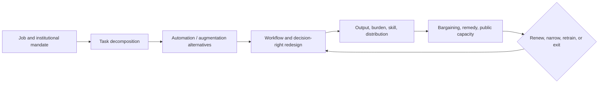

## Chapter status

| Field | Value |
|---|---|
| Chapter ID | `human-ai-organizations-delegation-and-accountability` |
| Part | Part II - Planning, Memory, Reasoning, and Execution |
| Status | conceptual |
| Manuscript maturity | v0.3 concept-complete argument-level manuscript |
| Claim label | Design rationale |
| Evidence level | argument |
| Source loading state | Five external records cover risk-governance roles, moral crumple zones, decision-authority incentives, field productivity heterogeneity, and constructive interdependence. |
| Test state | A 21-declaration Lean review model covers one bounded accountability-assignment invariant; no organization, worker, task, or intervention observed. |

## Drafting guardrail

This chapter does not prescribe one employment model, turn productivity into
welfare, or treat a human name on an approval form as accountability. It owns
the meso-level design of a human-AI organization; public legitimacy, economy-
wide transition, and emergent multi-agent dynamics remain separate owners.

::: {.asi-human-only}
## Human Reading Path

**Concrete lens.** A role matrix changes the assignee and forgets prior owners. The compositional route lowers authority, transfers control paths, and retains the residual chain.

An AI system almost never acts alone once its outputs matter to other people.
It sits inside a team, firm, laboratory, government office, household, or
network. People decide what work exists, who may delegate it, when an AI can
decide, who must review, who receives the benefits, and who carries the
consequences.

The organization needs more than a list of users and agents. It needs roles,
competence requirements, decision rights, workload limits, separation of
duties, escalation, conflict rules, accountability, succession, and a way to
dissolve the arrangement. If the AI makes the real decision while a person
absorbs the blame, the system has created a moral crumple zone. If the human
retains a title but loses information, time, skill, or authority, human control
is ceremonial.

Inspect the recurring arrangement rather than one approval screen. Ask whether
the reviewer can change the decision in time, a worker can challenge it,
delegation can silently pass through another agent, and responsibilities
survive model or management changes. A credible arrangement answers before an
incident and preserves responsibility, remedy, and residual obligations when it
ends.
:::

## Problem

Labor OS can type one unit of work and Human Factors can ask whether an
oversight action is usable. Neither owns the organization that repeatedly
allocates tasks and authority among human and AI actors. Repetition changes
skills, incentives, workload, information flow, bargaining power, and the
meaning of review. An arrangement can improve throughput while concentrating
decision power, degrading human competence, or assigning blame to the least
powerful participant.

The external evidence makes the boundary concrete. NIST AI RMF supplies roles
and lifecycle governance but does not design a particular organization.
Elish's moral-crumple-zone analysis warns against accountability being
misallocated to a proximate human. Athey, Bryan, and Gans show in a formal
model that authority allocation can alter human information-acquisition
incentives and AI-reliability investment. Generative AI at Work reports
heterogeneous worker effects in one customer-support deployment. Biswas et al.
show that team reward can fail to reveal constructive interdependence. Together
they argue against designing organizations from accuracy or throughput alone.

### Exclusive job and adjacent boundaries

| Adjacent owner | That owner keeps | Human-AI Organizations owns |
|---|---|---|
| Labor OS | One typed job, its inputs, authority, worker, output, and receipt. | Repeated allocation of roles, decision rights, workload, incentives, accountability, succession, and dissolution. |
| Human Factors | Whether an oversight or control action is exercisable. | Which actor is assigned that action and whether the organization preserves capacity to perform it. |
| Human Intent | Authorized purposes and contestable intent. | Organizational delegation of decisions under those purposes. |
| Inter-Stack Protocols | Pairwise identity, message, transaction, and exchange. | Internal organizational authority and responsibility across actors. |
| Multi-Agent Dynamics | Emergent population behavior, coalitions, collusion, cascades, and systemic externalities. | Deliberately designed meso-level organization and its lifecycle. |

```{mermaid}
flowchart LR
  C["Organization charter and purpose"] --> R["Actor, role, competence, workload, and conflict registry"]
  C --> P["Affected parties, participation, rights, and benefit commitments"]
  P --> R
  R --> D["Decision-right and delegation graph"]
  D --> J{"Authority, information, time, and separation adequate?"}
  J -- "no" --> E["Escalate, reassign, train, slow, or suspend"]
  J -- "yes" --> W["Execute typed work and decision"]
  W --> O["Observe outcome, contribution, dependence, burden, and affected parties"]
  O --> A["Accountability, remedy, learning, and authority update"]
  A --> D
  A --> X["Succession or dissolution with residual custody"]
```

**How to read the organizational-authority loop:** accountability begins before a decision, in the
charter and authority graph. Outcome review includes contribution, dependence,
and burden rather than task reward alone. Authority can be reassigned, and the
organization must survive or close without orphaning residuals.

## Why existing approaches are insufficient

**“Human in the loop” is not an organization.** It says nothing about which
human, what authority, which information, available time, incentives, workload,
appeal path, or consequences.

**Task routing is not decision-right allocation.** The best-performing actor
may not be the legitimate decision maker. Expertise, affected-party rights,
separation of duties, conflicts, and reversibility matter.

**Accountability after failure is too late.** A named person cannot be
responsible for a decision they could not inspect, change, stop, or appeal.
Responsibility must track prospective authority and actual capacity.

**Productivity is not organizational welfare.** Faster work can coexist with
deskilling, surveillance, work intensification, inequitable benefit, lower
autonomy, or fragile dependence. Heterogeneous worker and affected-party
outcomes must remain separate.

**Task reward is not teamwork.** A team can achieve the goal with one actor
dominating and another cleaning up errors. Contribution and constructive
interdependence are useful diagnostics, but even they cannot replace welfare,
legitimacy, or accountability.

### Strongest objection

Organization design is contextual, political, and legally situated; a generic
AI stack should not encode one managerial ideology. The design therefore
standardizes the questions, records, and failure routes—not the answer. The
mechanism earns its place only if it makes authority, dependence, workload,
accountability, and remedy more visible and improves decisions compared with a
simple role-and-approval matrix.

## Core Claim

[human-ai-organizations-delegation-and-accountability.core, label: Design
rationale, support: argument] A human-AI organization is eligible to delegate
consequential work only when a versioned organizational contract binds purpose
and mandate; membership and affected parties; human, AI, and institutional
identities; roles, competence, training, workload, and accessibility;
information and decision rights; delegation depth, expiry, revocation, and
separation of duties; conflicts, incentives, compensation, and benefit
distribution; escalation, appeal, incident, and remedy paths; contribution,
dependence, and outcome measures; accountability; succession; dissolution; and
residual custody. A human signature, model accuracy, task reward, throughput
gain, role label, or source-reported field result alone establishes neither
meaningful control, legitimate authority, accountability, worker welfare,
organizational resilience, support, readiness, release, transfer, nor SOTA.

**Reader claim.** Delegation moves bounded authority and current responsibility; it must not erase prior owners, reviewers, evidence custodians, appeal paths, or remedy obligations.

**Operational rule.** Every handoff must lower or preserve the authority ceiling, name the new accountable owner, keep review and evidence custody independent, transfer intervention and remedy paths, and retain prior owners in the residual chain. An incomplete handoff does not activate.

### Worked two-hop delegation: responsibility follows the grant

Principal `1` grants bounded operation authority to owner `2` with ceiling `4`. Owner `2` delegates to owner `3` at ceiling `3`, then owner `3` delegates to owner `4` at ceiling `1`. Each handoff changes the reviewer and evidence custodian, transfers intervention, appeal, and remedy paths, and carries an acknowledgment receipt. The final accountable owner and current delegate both equal `4`; prior owners remain visible as residual owners `[3, 2]` rather than disappearing from the audit trail.

The compositional model rejects a handoff when responsibility moves without the matching authority transition, when reviewer and evidence roles collapse, when a ceiling widens, or when a remedy path disappears. Across the larger lifecycle, one adverse nine-event trace closes after contestation and remedy with authority reduced to zero. The consumer checks 39 routes, 156 lifecycle mutations, and 50 bridge mutations. These finite checks preserve organizational custody; they do not establish human control, legal accountability, remedy efficacy, or good organizational outcomes.

## Mechanism

1. **Charter the organization.** State purpose, mandate, affected parties,
   prohibited ends, jurisdictional assumptions, lifespan, and owners.
2. **Register actors and roles.** Bind human, AI, team, and institutional
   identities to competence, training, workload, accessibility, conflicts, and
   maintenance state.
3. **Map decision rights.** For each decision class, name who proposes,
   advises, decides, executes, reviews, can stop, can appeal, and receives
   notice.
4. **Constrain delegation.** Limit depth, duration, scope, subdelegation,
   automation, and model replacement; preserve revocation and reversion.
5. **Separate duties.** Avoid one actor generating, evaluating, authorizing,
   executing, and closing a consequential action without independent checks.
6. **Observe real work.** Record task outcomes beside contribution,
   interdependence, error recovery, workload, skill change, autonomy, access,
   benefit, harm, and affected-party distribution.
7. **Assign accountability prospectively.** Accountability follows actual
   information and authority; impossible oversight becomes an organizational
   defect, not personal blame.
8. **Adapt or dissolve.** Rebalance roles, train, narrow automation, compensate,
   transfer custody, or close the organization with residuals intact.

The decision-right graph is typed by consequence, not merely by department.
For each decision class it distinguishes recommendation, option generation,
selection, approval, execution, veto, audit, appeal, remedy, and policy change.
An actor may hold several roles, but the contract exposes that concentration
and states when independent review is mandatory. Authority is granted only
when information, competence, time, accessibility, workload, and conflict
conditions make the role usable in practice.

Organizational evidence is longitudinal. A deployment can raise immediate
throughput while reducing skill, situational awareness, bargaining power, or
capacity to recover later. The outcome ledger therefore measures learning,
dependency, review quality, error discovery, workload, distribution of gains
and losses, worker and affected-party option value, and what happens when the
AI is unavailable or wrong. Counterfactual staffing and automation alternatives
remain visible instead of disappearing after adoption.

Delegation changes the institution's incentives. A vendor may benefit from
automation while a worker bears review liability; a manager may optimize
average speed while a minority receives more failures; an AI evaluator may
reward the behaviors it generates. Conflict-of-interest and benefit records
join the authority graph, and material conflicts narrow the route or require a
separate owner.

Succession and dissolution are ordinary lifecycle states. The organization
must transfer role identity, credentials, pending appeals, evidence, benefits,
liabilities, learned procedures, affected-party notices, and residuals when a
person leaves, a model changes, a vendor fails, or the institution closes.

## Concept-by-concept organizational contract

The eight concepts below divide the chapter's composite organizational claim
into decisions that can fail independently. They define the manuscript's
editorial responsibilities; no organizational intervention or legal conclusion
is implied.

### Charter, mandate, and affected-party standing

An organization needs an explicit reason to exist before it allocates work.
The charter states the mandate, prohibited ends, lifespan, jurisdictional
assumptions, funding and ownership interests, affected populations, and who may
change or terminate the arrangement. Affected-party standing is not equivalent
to employment or system access: customers, patients, residents, families,
competitors, and future workers can bear consequences without holding an
account. The contract records how those groups are identified, represented,
notified, heard, and connected to appeal and remedy.

**Mechanism.** Version the charter with its authorizing institution and map
each decision class to intended beneficiaries, burdened groups, excluded
populations, participation routes, prohibited effects, review date, and
termination authority. Changes to purpose or affected-party scope invalidate
delegation derived from the earlier charter.

**Failure mode.** Mission drift lets a workflow optimized for one purpose
quietly become surveillance, discipline, eligibility screening, or cost
cutting. A nominal consultation can omit people with less bargaining power,
while an institution treats legal access or technical feasibility as social
authorization.

**Non-claim.** A complete charter does not establish consent, legitimacy,
lawfulness, representativeness, or that the chosen mandate is morally correct.
Those judgments remain with constitutional, moral, legal, and public-
institution owners.

**Source grounding.** `ext_nist_ai_rmf_1_0_2023` contributes lifecycle context,
roles, and risk-governance functions but no certified organization design.
`talos` supplies typed-work and explicit-contract lineage as a speculative
system design; it does not establish stakeholder standing or institutional
authority.

### Actor, role, competence, workload, and accessibility state

A role title is not operational capacity. The actor registry binds every human,
AI, team, vendor, and institution to the exact role it can perform, the
information it receives, required competence, current training, workload,
availability, accessibility needs, conflicts, and maintenance state. Human and
AI competence are versioned differently: a model update can invalidate an AI
role, while fatigue, turnover, deskilling, task novelty, or inaccessible
interfaces can invalidate a human control path.

**Mechanism.** For each role and decision class, define prospective competence
tests, maximum concurrent burden, time-to-intervene, accessible control
interfaces, required context, substitution rules, and expiry. Runtime
admission checks current state rather than trusting the organization chart. A
failed check routes to reassignment, training, slower work, narrower
automation, or suspension.

**Failure mode.** Role-label laundering names a reviewer who lacks time,
information, skill, language access, physical access, or power to intervene.
Workload aggregation can make individually plausible approvals collectively
impossible, and automation can erode the unaided competence needed during
failure or withdrawal.

**Non-claim.** Passing an authored competence field does not prove real
competence, accessibility, vigilance, or human control. Synthetic role fixtures
cannot substitute for ethically reviewed observations of people.

**Source grounding.** `ext_ai_decision_authority_2020` shows in a bounded model
that authority allocation can change human information-acquisition and AI-
reliability incentives. `ext_generative_ai_at_work_2025` reports heterogeneous
effects in one customer-support deployment. Neither supplies universal
competence thresholds or a longitudinal workforce result.

### Decision rights and meaningful intervention capacity

“Human in the loop” hides several different rights. For each consequential
decision, the organization must say who may frame options, recommend, select,
approve, execute, veto, pause, audit, appeal, remedy, and change policy.
Information access and timing accompany those rights: an actor cannot
meaningfully stop a decision after the effect is irreversible or review
evidence they cannot inspect. Decision rights can be distributed, but the
distribution must preserve a reachable owner for the outcome.

**Mechanism.** Compile a typed decision-right graph from charter and role state.
Trace every effect path backward to proposal, authorization, execution,
intervention, review, and remedy nodes; require current competence, information,
time, and practical authority at each mandatory human control point. Exercise
stop and appeal paths with seeded cases before consequential use.

**Failure mode.** Rubber-stamp review gives a person a binary approval under
time pressure after the model has framed every option. Accountability diffusion
splits decisions into many steps so that no actor can see or own the whole
outcome. An AI-generated assessment can also become its own nominally
independent approval.

**Non-claim.** A connected graph does not establish that the decision is
legitimate, wise, lawful, or safe. It records and tests organizational
reachability; Human Factors still owns whether controls are usable in practice.

**Source grounding.** `ext_moral_crumple_zones_2019` motivates matching
responsibility to actual control but provides no complete remedy.
`ext_nist_ai_rmf_1_0_2023` provides governance-role vocabulary without
certifying the graph, and `talos` contributes typed execution lineage rather
than evidence of meaningful human intervention.

### Delegation, subdelegation, expiry, and revocation

Delegation changes who may decide; routing changes who performs a task. They
are not the same operation. A delegation lease names principal, delegate,
decision class, purpose, scope, duration, consequence ceiling, permitted
subdelegation, required review, model and tool identity, revocation authority,
and reversion path. The lease is re-evaluated when workload, competence,
purpose, model, vendor, or institutional conditions change.

**Mechanism.** Make every delegation edge explicit and depth-bounded. A runtime
check resolves the complete chain to an accountable principal, verifies
non-expiry and non-expansion, and rejects hidden replacement or subdelegation.
Revocation stops new effects, reconciles work already in flight, restores a
qualified fallback, and preserves affected appeals and residuals.

**Failure mode.** Delegation laundering treats an API call, vendor service, or
secondary agent as implementation detail even though it exercises independent
judgment. Temporary assistance becomes an automation ratchet when the human
fallback loses skill or staffing. Revocation theater disables one route while
copies, queues, credentials, cached decisions, or downstream agents continue.

**Non-claim.** An expiring lease does not guarantee enforceable revocation,
complete rollback, or lawful delegation. It also does not authorize a broader
purpose or permit the delegate to create its own successor authority.

**Source grounding.** `ext_ai_decision_authority_2020` supplies an
incentive-aware authority-allocation comparator, not a deployed delegation
control. `talos` supplies typed job, contract, replay, and approval lineage;
its architecture is not evidence that revocation or subdelegation control
works.

### Separation of duties, conflicts, incentives, and benefits

An actor that generates, evaluates, authorizes, executes, and closes the same
consequential action can hide errors and optimize the evidence used to judge
it. Separation of duties creates independent-enough challenge where
consequence warrants it. Independence is not just a different username: shared
models, prompts, data, vendors, reporting lines, incentives, and performance
metrics can make nominally separate roles one failure domain. Benefits and
burdens must be visible because they shape which failures an organization is
motivated to notice.

**Mechanism.** For each decision class, compile prohibited role combinations
and a dependency graph among generators, evaluators, approvers, operators, and
auditors. Record financial, career, vendor, model, data, and metric conflicts;
who receives productivity gains; who absorbs review, error, surveillance, and
remedy costs; and which independent route can reopen the decision.

**Failure mode.** Self-approval, evaluator capture, and shared blind spots make
paper separation ineffective. A manager can optimize average throughput while
workers or affected minorities bear errors, or a vendor can validate the same
model from which it earns revenue. Excessive separation can also create delay
and responsibility diffusion without better challenge.

**Non-claim.** More reviewers are not automatically more independent, fair, or
effective. The contract does not determine just compensation, lawful conflicts,
or legitimate benefit distribution.

**Source grounding.** `ext_nist_ai_rmf_1_0_2023` supports explicit governance
roles. `ext_generative_ai_at_work_2025` provides bounded evidence that workplace
effects can be heterogeneous. `ext_eu_ai_civil_liability_2025` adds a
jurisdiction-specific institutional comparator; none proves this separation
design.

### Longitudinal contribution, skill, dependence, and burden

Task reward and short-run productivity cannot describe an organization. A
combined system may outperform a human while underperforming the AI alone, or
it may succeed because one participant repairs the other's errors under rising
burden. Repeated interaction can change skill, trust, judgment, dependence,
workload, bargaining position, and the ability to recover after tool loss.
Those trajectories need shared populations, time points, and attrition
denominators.

**Mechanism.** Compare human or team alone, the AI-operated process when
legitimate, the combined process, and relevant conventional workflow
alternatives. Track useful quality, contribution, constructive
interdependence, review and rework, unaided and assisted competence,
calibration, workload, autonomy, accessibility, benefit, harm, withdrawal
recovery, turnover, and who is missing from later measurements.

**Failure mode.** Synergy laundering compares the team only with the human,
while productivity laundering treats output as welfare. Short studies can miss
deskilling and lock-in; survivorship can exclude people who leave; a dependence
metric can be optimized even when dependence reduces human option value.

**Non-claim.** The chapter does not assert universal complementarity, harmful
co-adaptation, durable skill change, or economy-wide labor effects. Synthetic
humans remain debugging fixtures rather than participant evidence.

**Source grounding.** `ext_human_ai_team_meta_analysis_2024` motivates the
three-arm strongest-component comparison. `ext_constructive_interdependence_human_ai_2026`
adds a study-specific cooperation measure, while
`ext_human_ai_feedback_loops_2025` motivates longitudinal coupled-state
tracking. Their tasks and populations bound every inference.

### Accountability, causation, evidence access, and remedy

Accountability begins before failure by aligning prospective authority with
the capacity to know and intervene. After harm, it requires more than finding
the nearest human: preserve evidence about design, deployment, delegation,
model and policy changes, review, actual effects, institutional decisions, and
who controlled each route. Affected parties need an identifiable entity,
usable evidence access, timely appeal, correction, compensation or other
remedy, and a route that remains available when organizations disagree.

**Mechanism.** Compile an accountability map from the decision-right and
delegation graphs, then join it to effect and incident lineage. Flag
responsibility assigned without matching information, competence, time, or
control. Preserve contestable causation hypotheses, disclosure and privacy
limits, insurer or compensation routes, appeal status, remedy execution, and
unresolved ownership instead of generating an automatic fault verdict.

**Failure mode.** A moral crumple zone makes a proximate worker absorb blame
for system-level choices. Technical logs can be withheld, selectively framed,
or mistaken for legal causation. Formal appeal can be too slow, expensive,
inaccessible, retaliatory, or powerless to alter the effect.

**Non-claim.** The organizational record is not legal advice, a liability
judgment, a proof of causation, or evidence that remedy is adequate. Legal and
institutional authorities retain those decisions.

**Source grounding.** `ext_moral_crumple_zones_2019` supplies the
responsibility-without-control failure. `ext_eu_ai_civil_liability_2025`
describes a European policy space involving responsible operators, evidence,
causation, insurance, and remedy. Neither is a universal legal rule or a tested
ASI Stack accountability intervention.

### Succession, dissolution, continuity, and residual custody

Human-AI organizations change even when their tasks do not. People leave,
models and vendors are replaced, institutions merge, contracts expire, and
systems are deliberately retired. Succession transfers a live organizational
role; dissolution closes the arrangement. Neither transition may erase pending
decisions, appeals, evidence, benefits, liabilities, learned procedures,
credentials, affected-party notices, or harms that outlive the technical
system.

**Mechanism.** Before succession, requalify the replacement actor, model, tool,
and institution; migrate only compatible authority; rotate credentials; notify
affected parties; and preserve prior decision lineage. Before dissolution,
stop or transfer work, reconcile effects and queues, preserve required
records, fund or assign pending remedies, restore practical alternatives, and
name every residual owner and review trigger. Unowned obligations block clean
closure.

**Failure mode.** Model replacement inherits stale competence and delegation,
vendor failure strands appeals and evidence, or a dissolved entity abandons
remedy. Technical rollback can be institutionally impossible after layoffs,
deskilling, procurement lock-in, or public-capacity loss. Over-retention can
also violate privacy or rights.

**Non-claim.** A succession receipt does not prove equivalent competence,
continuity, complete erasure, or that affected parties have been made whole.
The book has not exercised organizational dissolution.

**Source grounding.** `ext_nist_ai_rmf_1_0_2023` motivates lifecycle
governance, and `talos` contributes artifact, replay, and residual-custody
lineage. `ext_human_ai_feedback_loops_2025` supports treating dependence and
human state as longitudinal variables. None establishes successful succession,
dissolution, or recovery here.

### Organizational transition: tasks, jobs, power, and public capacity

The unit of change is not simply “a job exposed to AI.” A job bundles tasks,
relationships, tacit knowledge, legal duties, bargaining arrangements,
learning pathways, and responsibility. Automation can remove one task while
increasing review, exception handling, customer interaction, or liability. It
can also remove entry-level work that trained future experts. The transition
ledger maps task creation, substitution, complementarity, supervision,
rework, and coordination burden before making a job-level claim.

Adoption is a diffusion process, not an instantaneous technical capability.
Integration cost, data and workflow constraints, trust, regulation, capital,
vendor dependence, and managerial incentives determine uptake. A field
productivity result can establish a bounded task effect; it does not by itself
forecast occupation-wide employment, wages, firm concentration, public-service
capacity, or economic growth.

Distribution is a first-class outcome. The record follows wages, hours,
workload, surveillance, accessibility, error liability, bargaining power,
ownership, consumer benefit, vendor rents, geographic concentration, and
affected parties who never touch the system. More output can coexist with
deskilling, work intensification, exclusion, or a moral crumple zone where the
least empowered human absorbs blame for a decision they could not change.

Skill is dynamic. AI may scaffold learning and widen access; it may also
replace deliberate practice, hide causal structure, or turn professionals into
exception handlers who cannot recover when automation fails. Qualification
tracks unaided and assisted performance, error detection, novel-case transfer,
recovery after tool loss, mentoring capacity, and who receives training or
advancement.

Concentration and public capacity need separate denominators. Shared models,
clouds, data suppliers, and evaluators create common-mode risk and bargaining
asymmetry across nominally independent organizations. Public institutions may
gain service capacity or become dependent on vendors whose objectives and
continuity they do not control. Procurement, interoperability, exit, local
capability, audit rights, continuity, and public-interest obligations belong
in the organizational contract.

A serious comparison includes workflow redesign, conventional software,
staffing, training, reduced workload, decision support, partial automation,
collective governance, and full delegation under matched obligations. It
reports output, quality, distribution, skill, autonomy, resilience,
accountability, infrastructure cost, and option value separately. Economy-wide
inference remains another modeling and evidence problem.



### Required artifacts

```text
HumanAIOrganizationContract {
  charter_mandate_lifespan_and_affected_parties,
  actor_role_competence_workload_and_accessibility_registry,
  information_and_decision_rights_graph,
  delegation_subdelegation_expiry_and_revocation,
  separation_of_duties_and_independence_matrix,
  conflict_incentive_compensation_and_benefit_record,
  escalation_stop_appeal_incident_and_remedy_routes,
  contribution_interdependence_outcome_and_burden_ledger,
  accountability_map,
  succession_dissolution_and_residual_custody,
  non_authorities
}
```

## Interfaces

Human Intent supplies authorized purpose. Labor OS supplies typed work and
receipts. Human Factors supplies control-envelope evidence. Security and
Runtime Adapters supply identities and actual permissions. Claim Ledgers and
Operations receive organizational outcomes and residuals. Inter-Stack
Protocols govern external counterparties; Multi-Agent Dynamics observes
population consequences. No interface allows a role title to substitute for
competence or a completed task to settle accountability.

Privacy and Data Rights governs employee, customer, and affected-party data,
including monitoring and derived performance records. Moral Uncertainty and
Constitutional Alignment supply protected predicates and unresolved value
conflicts; an organization cannot vote itself broader technical authority.
Resource Economics receives human review, training, delay, coordination,
appeal, and recovery cost rather than counting only model tokens.

Artifact Graphs preserves decision, delegation, review, intervention, outcome,
and remedy receipts. Capability Replacement invalidates role competence and
delegation leases when the underlying model or tool changes materially.
Readiness can require organizational evidence for a named deployment, but it
cannot establish legitimacy or legal compliance. Institutions and Multi-Agent
Dynamics consume aggregate signals while preserving the difference between a
deliberately designed organization and an emergent population.

## Invariants

These constraints keep an organization from using paperwork to counterfeit
control. They bind responsibility to actual information and intervention
capacity, keep burden and benefit visible, and ensure that reorganization,
model replacement, or closure cannot erase rights, remedies, records, and
residual obligations created earlier.

- Decision authority, execution authority, review authority, and accountability
  are explicit and may differ.
- A person cannot be accountable for an action they lacked information,
  competence, time, authority, or practical ability to change.
- AI-generated evaluation cannot be its own independent approval.
- Delegation is scoped, expiring, revocable, and depth-bounded.
- Model replacement expires competence and role evidence where material.
- Workload, accessibility, conflict, and incentive state travel with a role.
- Task reward, contribution, interdependence, welfare, and legitimacy remain
  separate outcome axes.
- Affected parties retain named notice, appeal, and remedy routes.
- Succession and dissolution preserve artifacts, obligations, and residuals.
- Organizational records create no public or legal legitimacy by themselves.
- Review burden, training cost, and benefit distribution remain attributed to
  the actors and decisions that cause them.

## Evidence

The current source packet spans governance, theory, field evidence, and
measurement. Its diversity is useful because no one source can establish the
chapter. The first campaign should examine a real but low-consequence recurring
workflow with prospective participants and appropriate ethics/privacy review.
Compare a conventional human workflow, AI advice, AI execution with human
approval, competence-aware dynamic delegation, and a deliberately simple
role-and-approval baseline. Freeze tasks, role training, escalation routes,
model versions, positive controls, and independent scoring before held-out
work.

Measure useful output and errors, but also information acquisition,
intervention success, review time, workload, skill retention, constructive
interdependence, automation bias, appeal, affected-party distribution,
accountability accuracy, recovery, worker experience, access, and cost. A
participant study or organizational intervention cannot begin from repository
authority alone. Synthetic human models may support debugging but remain
separate from evidence about people.

## Failure modes

- moral crumple zone;
- rubber-stamp or impossible review;
- authority without accountability or accountability without authority;
- hidden subdelegation;
- automation bias and deskilling;
- work intensification or surveillance;
- conflict of interest and incentive gaming;
- separation-of-duties collapse;
- contribution or interdependence mismeasurement;
- benefit concentration and harm externalization;
- inaccessible oversight or appeal;
- succession failure and orphaned residuals.

Further failures include *role-label laundering*, where “reviewer” is recorded
without time or control; *accountability diffusion*, where every actor owns a
small step and nobody owns the outcome; and *automation ratchet*, where
temporary assistance removes the human competence needed for rollback.
Metric capture can optimize task reward while degrading service quality,
worker welfare, or affected-party rights. Vendor opacity can make competence,
incident, or change evidence unavailable. Appeals can be formally present but
too slow, costly, inaccessible, or retaliatory to use. A technically reversible
workflow can become institutionally irreversible through layoffs, lost skills,
contract lock-in, or redistributed liability.

## Minimum Viable Implementation

Represent one recurring workflow with four decision classes and at least three
actor roles. Compile a decision-right graph, competence and workload checks,
delegation expiry, independent approval, stop and appeal routes, and
accountability receipts. Use synthetic cases to reject rubber-stamp approval,
conflicted review, overloaded humans, unauthorized subdelegation, and model
replacement without requalification before any human study.

The **minimum honest implementation** includes a versioned organization schema,
decision-class inventory, actor and role registry, competence/workload state,
typed rights graph, delegation leases, conflicts and benefits, stop/appeal
routes, accountability mapping, and succession receipt. A validator rejects
missing affected parties, role without a usable authority path, accountability
without control, self-approval, stale model competence, overloaded review,
unbounded subdelegation, and orphaned residuals.

Synthetic cases are only the first artifact. They must show that the control
plane changes routing and catches seeded defects while allowing legitimate
work. Passing those cases is **not** evidence about human behavior,
organizational effectiveness, worker welfare, legitimacy, or legal liability.
Support remains `argument` until an ethically reviewed natural or high-fidelity
workflow compares competent alternatives with independent outcome and
affected-party evaluation.

## Mature Research Target

The mature target is an organizational control plane that can simulate and
audit decision rights before deployment, measure how automation changes human
skill and option value over time, and reallocate authority without losing
traceability or remedy. It would support many organizational forms rather than
hard-code one. It would integrate collective bargaining, accessibility,
affected-party representation, and dissolution while refusing to infer
legitimacy from technical coherence.

Beyond current practice, the target would make organizational design
counterfactual and testable. Before deployment it could compare human-only,
advice, approval, execution, mixed-team, and dynamically delegated structures
under the same task and consequence model. During operation it would estimate
review capacity, dependence, skill change, contribution, intervention
effectiveness, distributional outcomes, and recovery readiness, and it would
reallocate authority or slow work when those conditions deteriorate.

The research program must use real or realistic recurring work with multiple
decision classes, heterogeneous roles, consequential but ethically acceptable
errors, and affected-party feedback. Comparators should include mature workflow
and process controls, ordinary role matrices, strong human-AI assistance,
static approval, competence-aware delegation, and the full organizational
contract. Outcomes include useful quality, error and recovery, false approval,
missed help, review time, workload, training, skill retention, autonomy,
accessibility, appeal, accountability accuracy, benefit and harm distribution,
latency, cost, and resilience to AI or vendor loss.

Causal ablations remove workload checks, competence leases, separation of
duties, contribution measures, affected-party routes, or succession custody.
Transfer spans domains, organization sizes, labor arrangements, models,
jurisdictions, and time. Independent evaluators and participant safeguards are
mandatory, and synthetic people cannot stand in for human evidence. This is a
**falsifiable research program, not a current result**: no such campaign has
passed here, so the technical record establishes no superior organization or
institutional legitimacy.

## Formalization hooks

### Implemented formalization

`lean:human_ai_org.accountability_requires_authority` is implemented in
`AsiStackProofs.HumanAIOrganizations` as three bounded models with 62 theorem declarations.
The retained five-stage finite review covers identity, capacity,
intervention authority, independence, and remedy/custody. A stage invariant is preserved for one
step and by induction over an arbitrary finite run; if the run reaches
`accountabilityAssignable`, all 20 authored assignment fields are true. One
complete record reaches that state, while 20 closed mutations cover every
assignment field and reach the exact refusal or repair state.

The separate ten-stage delegation-to-remedy lifecycle binds nine decision,
delegator, delegate, policy, authority, reviewer, evidence, remedy, and result
identities across delegation, activation, escalation, handoff, contestation,
authority expiry, incident reconstruction, remedy, and closure. Arbitrary
successful runs preserve those identities and zero support/external-effect
authority, account for exactly one receipt per event, keep contest and remedy
receipts monotone, expose accepted traces, compose across all ten prefix/suffix
splits, and reject every event after closure. One nine-event adverse-path
witness closes with authority zero and one contest and remedy receipt. The
independent consumer reaches all 39 routes and rejects 156/156 lifecycle mutations
spanning identity, stage, replay, over-ceiling delegation, missing
process records, authority requests, and post-closure events.

The third model composes organizational responsibility with the independently
defined authority-delegation chain. Every accepted handoff refines an accepted
authority step, assigns the exact child delegate as accountable owner, retains
the prior owner in residual custody, adds exactly one responsibility receipt,
and preserves reviewer and evidence-custodian separation plus zero support and
external-effect authority. These properties hold over arbitrary successful
runs and across event-batch composition. A concrete two-hop witness delegates
from owner 2 to 3 to 4 while attenuating authority to read-only, retaining
residual owners `[3, 2]`, and aligning two responsibility receipts with two
authority receipts. The independent consumer checks all three bridge compositions
and rejects 50/50 bridge mutations without changing the rejected state. A paired
countermodel also gives a safe record and an owner/reviewer/evidence gap the
same aggregate delegation summary; no classifier over only that summary can
recover whether accountability is assignable.

This is a mechanized property of a finite authored record. Lean does not prove
that any identity, assignment, review, evidence, handoff, or control field is
truthful or usable, that a person could intervene in a real workflow, that
accountability is lawful or legitimate, or that an
organization is effective, fair, resilient, or safe. Chapter support therefore
remains `argument`.

## Codex test plan

| Test | Purpose | Status |
|---|---|---|
| Decision-right reachability | Ensure each modeled assignment traverses identity, capacity, authority, independence, and remedy stages before becoming assignable. | implemented in Lean; no runtime workflow |
| Moral-crumple-zone mutation | Reject accountability assigned to an actor without real authority or capacity. | implemented for 20 exact authored-record mutations |
| Delegation-to-remedy lifecycle | Exercise bounded delegation, escalation, handoff, contestation, expiry, reconstruction, remedy, and closure with exact custody and non-authority checks. | implemented in Lean and independently reconstructed; no runtime workflow |
| Authority/accountability refinement | Prevent accepted subdelegation from creating an owner gap, erasing residual custody, collapsing review, or widening authority. | implemented in Lean with a two-hop witness, three bridge compositions, and 50/50 bridge mutations; authentic identities and controls untested |
| Aggregate-summary countermodel | Show that depth, receipt count, authority ceiling, and residual count cannot recover missing accountability identities. | implemented as a paired Lean witness and independent summary collision |
| Workload and competence positive controls | Verify the finite route narrows when authored workload or competence fields fail. | implemented in Lean; real human capacity untested |
| Contribution/interdependence audit | Prevent task reward from standing in for teamwork. | planned |

## Source crosswalk

| Source | Contribution | Boundary |
|---|---|---|
| `ext_nist_ai_rmf_1_0_2023` | Lifecycle roles and risk-governance vocabulary. | Framework; no organization design or effectiveness result. |
| `ext_moral_crumple_zones_2019` | Accountability-misallocation failure model. | Conceptual/empirical analysis, not a complete remedy. |
| `ext_ai_decision_authority_2020` | Incentive-aware human/AI authority allocation. | Bounded economic model, not a universal law. |
| `ext_generative_ai_at_work_2025` | Heterogeneous field effects in customer support. | One deployment setting; no economy-wide inference. |
| `ext_constructive_interdependence_human_ai_2026` | Team-dependence measure beyond task reward. | Domain- and metric-bound; not reproduced. |
| `talos` | Corben's Labor OS and typed-work lineage for roles, work contracts, delegation, and review. | Speculative system design; no organizational, legitimacy, accountability, or welfare result. |

### Manifest source assignment reconciliation

These rows keep Human-AI Organizations, Delegation, and Accountability's manifest assignments visible at their recorded review boundary. Passage review does not establish local reproduction, performance, safety, deployment, or support-state movement.

| Source | Intake role | Boundary |
|---|---|---|
| `ext_human_ai_team_meta_analysis_2024` | Metadata-first comparator: When combinations of humans and AI are useful: A systematic review and meta-analysis. Preregistered synthesis of 106 experiments and 370 effect sizes using human-alone, AI-alone, and combined-system comparisons. The aggregate findings are task- and population-bound and do not establish universal human-AI synergy or longitudinal benefit. | No passage-level source claim, local implementation, reproduction, safety, performance, deployment, support-state, or ASI result is established by this reconciliation row. |
| `ext_human_ai_feedback_loops_2025` | Metadata-first comparator: Human-AI feedback loops alter human perceptual, emotional and social judgements. Experimental evidence that repeated human-AI interaction can create feedback dynamics in studied judgment tasks. It supports measuring coupled trajectories, not a universal claim about all users, systems, settings, or long-term clinical outcomes. | No passage-level source claim, local implementation, reproduction, safety, performance, deployment, support-state, or ASI result is established by this reconciliation row. |
| `ext_eu_ai_civil_liability_2025` | Metadata-first comparator: Artificial intelligence and civil liability. European Parliament research service study of AI and civil-liability questions. It supports explicit causation, evidence-access, insurance, compensation, and remedy analysis but is not legal advice or a globally settled liability rule. | No passage-level source claim, local implementation, reproduction, safety, performance, deployment, support-state, or ASI result is established by this reconciliation row. |

<!-- manifest-source-reconciliation:end -->
## Co-adaptation is an outcome, not a premise

An organization cannot infer “human-AI complementarity” from adoption or from
a team beating the human alone. The three-arm evidence rule from
`ext_human_ai_team_meta_analysis_2024` applies at the organizational level:
compare the human or team without the AI, the AI-operated process where that is
a legitimate comparator, and the combined process. The strongest competent
component is the performance floor.

Longitudinal feedback can change expertise, trust, workload, escalation habits,
and what work the organization retains. `ext_human_ai_feedback_loops_2025`
therefore adds trajectory fields to the delegation record: unaided skill,
calibration, override quality, dependence, distribution of learning, turnover,
error inheritance, and recovery after withdrawal. A short productivity gain
can coexist with brittle expertise and growing vendor dependence.

The organization must also distinguish an accountable role from a liability
sink. When harm occurs, evidence access, causation, duty, insurance,
compensation, and remedy need an executable route. Civil-liability analysis can
inform that design but does not supply one universal legal answer. A human
reviewer is not automatically responsible for defects they could not inspect,
contest, or prevent; the model is not a legal person that can absorb duties
assigned by deployers, vendors, or institutions.

## Summary

Human-AI organization design governs the repeated allocation of information,
work, authority, burden, benefit, and accountability. Its purpose is not to
choose one institutional form but to prevent throughput and role labels from
hiding who actually decides, who can intervene, who bears the cost, and how the
arrangement changes or ends.

The central rule is that responsibility follows prospective information,
competence, time, authority, and practical control. Recommendation, decision,
approval, execution, veto, audit, appeal, remedy, and policy change remain
separate rights even when one actor holds several. Delegation is scoped,
expiring, revocable, and requalified when the model, task, workload, or
institution changes.

Outcomes include contribution, dependence, skill, burden, access, benefit,
harm, recovery, and affected-party experience alongside useful task quality.
This prevents short-run throughput from hiding deskilling, surveillance,
fragile dependence, or concentrated gains. Succession and dissolution preserve
pending appeals, artifacts, liabilities, learned procedures, and residuals so
temporary automation does not become an unowned institutional ratchet. The
result is a governable organization contract, not a claim that one structure
is universally legitimate.

## Handoff

The organizational contract hands its roles, decisions, workload, incidents,
appeals, and outcome receipts to **Human-AI Symbiosis, Neurotechnology, and Cognitive Sovereignty**. That chapter asks what repeated coupling changes in
the person and the AI: complementarity, feedback, skill, dependence, neural
and inferred mental data, consent, practical exit, and longitudinal recovery.
Organizational accountability cannot stand in for cognitive sovereignty or
evidence that the combined system beats its strongest component.

## Sources

See the source crosswalk above and the generated external-source appendix.
