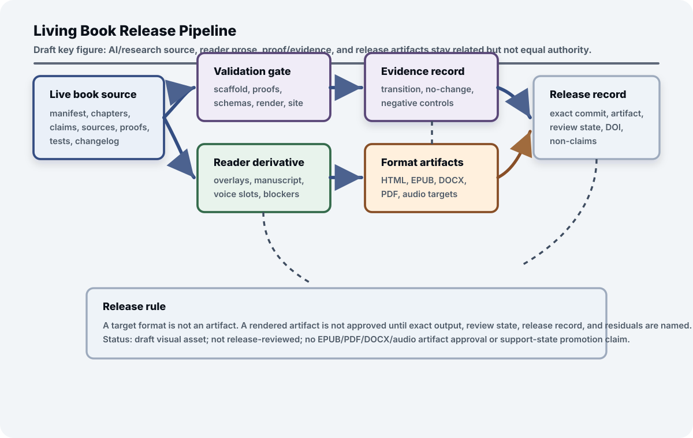

## Chapter status

| Field | Value |
|---|---|
| Chapter ID | `living-book-methodology` |
| Part | Part IV - Evidence, Implementation, and the Living Book |
| Status | conceptual |
| Manuscript maturity | v0.3 semantically audited manuscript |
| Last updated | 2026-08-03 |
| Primary source records | `benchmaxxing`, `viea`, `bugbrain`, `cognitive_loop_closure`, `moecot`, `moecot_md`, `road_to_agi`, `ext_openunlearning_2025`, `ext_literate_programming_1984`, `ext_jupyter_book_docs`, `ext_quarto_books_docs`, `ext_nist_ai_rmf_1_0_2023`, `ext_frontier_ai_regulation_2023`, `ext_helm_2022`, `ext_livebench_2024`, `ext_benchmark_contamination_2023` |
| Claim label | Design rationale |
| Evidence level | argument |
| Source queue | primary: `benchmaxxing`, `viea`; supporting: `bugbrain`, `cognitive_loop_closure`; connector/recovery: `moecot`, `moecot_md`, `road_to_agi`; external comparators: `ext_literate_programming_1984`, `ext_jupyter_book_docs`, `ext_quarto_books_docs`, `ext_nist_ai_rmf_1_0_2023`, `ext_frontier_ai_regulation_2023`, `ext_helm_2022`, `ext_livebench_2024`, `ext_benchmark_contamination_2023` |
| Source loading state | source notes: all assigned sources; local raw cache: `benchmaxxing`, `viea`, `bugbrain`, `cognitive_loop_closure`; authenticated connector text passage-reviewed: `moecot`, `moecot_md`; connector/recovery bounded: `road_to_agi` |
| Test state | Quarto render, manifest/proof sync, changelog updates, protocol fixtures, and the reader release-candidate bridge remain active. The exact 39-declaration `AsiStackProofs.LivingBook` surface adds inductive manifest numbering plus a governed structural-change lifecycle with arbitrary-run custody and gate coherence, exact composition, an accepted-current witness, zero support and publication authority, absorbing accepted/rolled-back suffixes, and a thin-summary insufficiency result. `python3 scripts/validate_living_book_change_packets.py` recompiles the surface, retains three valid and six expected-invalid fixtures, checks all five trace splits, explores nine reachable states through 162 transitions, checks ninety transitions from five terminal states, and rejects fifteen semantic mutations. Claim quality remains human/editorial; accepted-current is not public release approval and no reader/audio artifact is implied. |

## Drafting guardrail

This chapter describes the repository's operating method. It can claim that local validators and Quarto renders pass only when they have actually been run; it cannot use release hygiene as evidence that architecture claims are true.

The prototype roadmap sequences future builds. The same sequencing discipline applies to the manuscript itself. The book should not ask future AI systems to preserve provenance, gates, residuals, and rollback while its own chapters drift away from manifest order, source notes, proof targets, validation, changelog, or release records.

The living-book method is the book's own governance test. Every substantive change should leave a packet that says what changed, why it changed, which source or author-intent context justified it, which evidence state moved, which validations ran, and which residuals remain.

Together with Evidence States, this is the book's methodological contribution. Evidence States governs claim strength; Living Book Methodology governs the source graph, release graph, reader projections, validation receipts, and revision process that keep those claim states from drifting.

This chapter is also the reflexive application of the governed-cognition pattern. A manuscript change is not just a better paragraph; it is a typed change with lifecycle state, source boundary, claim effect, validation receipt, release route, residual, and non-claim. The local delta is that the book itself becomes an artifact governed by the same pattern it recommends for AI systems.

::: {.asi-human-only}
## Human Reading Path

The prototype roadmap explains how the system should be built over time. The manuscript itself needs the same discipline so it can keep changing without losing its evidence controls. The manuscript is part of the architecture, not a static brochure about it. If the architecture is living, its written form must also have controlled change, reviewable lineage, and a visible boundary between aspiration and evidence.

Trust comes through process. The manuscript should remain readable, but it also has to show how parts move, how sources enter, how claims change state, how proofs and tests are recorded, and how reader editions are derived without becoming a separate truth. That makes the manuscript a demonstration of the governance discipline it argues for.

The same machinery that helps AI agents maintain the work should help humans see what changed and why. A living book is credible when its revisions leave receipts: source routes, changelog entries, validation reports, non-claims, and open residuals that make improvement auditable rather than mysterious. Receipts make revision trustworthy because later edits can find their debt.
:::

## Problem

The book itself must remain a living technical system rather than a static anthology. That is not a publishing preference. It is part of the architecture. A book about governed self-improving systems should not improve by silently rewriting claims, losing source provenance, or hiding failed tests. It should model the same discipline it asks of the AI stack.

The living-book problem is versioned coherence. New papers will arrive. Chapters will split and merge. Proof targets will move from vague ideas to schemas or Lean modules. Some claims will strengthen, some will remain speculative, and some should be deprecated. The system needs a way to absorb those changes without making the reader guess which claims are current, which are supported, and which are only design hypotheses.

That operating system is the living-book method. It turns the manuscript into a governed artifact graph: manifest, outline, source inventory, source notes, claim matrix, proof manifest, schemas, tests, changelog, rendered site, and Git history.

## Why existing approaches are insufficient

Static manuscripts cannot show source additions, claim-state movement, deprecations, proof updates, render status, or test history.

The usual alternatives fail in opposite directions. A static PDF can be polished, but it freezes the source and evidence state at one moment. A loose wiki can change quickly, but it often loses architectural discipline. A code repo can validate structure, but it does not by itself explain the thesis to readers. A chat history can preserve intent, but it is not a public evidence artifact.

External governance and evaluation practice sets the public-record bar for a living book. NIST AI RMF (`ext_nist_ai_rmf_1_0_2023`) and frontier-governance work (`ext_frontier_ai_regulation_2023`) require lifecycle and oversight vocabulary, HELM (`ext_helm_2022`) models transparent multi-metric reporting, LiveBench (`ext_livebench_2024`) demonstrates living benchmark pressure, and contamination analysis (`ext_benchmark_contamination_2023`) warns that evaluation surfaces can go stale or leak. The living-book method uses those as publication discipline, not as evidence that the ASI Stack satisfies any governance framework.

Executable publication practice supplies the technical lineage. Literate programming (`ext_literate_programming_1984`) treats explanation and executable structure as one authored artifact. Jupyter Book (`ext_jupyter_book_docs`) shows a modern executable-book pattern around notebooks, Markdown, code execution, cross references, and web publication. Quarto Books (`ext_quarto_books_docs`) supplies the concrete multi-chapter publishing substrate used here. The ASI Stack method borrows from that lineage but adds claim/evidence ledgers, source queues, proof manifests, release records, reader/audio derivative boundaries, and explicit non-claims.

The living book needs all four properties at once: readable prose, versioned source, executable validation, and visible evidence state. That combination is what lets the project improve aggressively without becoming a moving target that no reader can audit.

The audience split makes this stricter, not looser. AI assistants need structured scaffolding. Human researchers need source maps and evidence state. General readers need coherent editions without scaffolding noise. A living book has to derive all three from one governed source rather than hand-maintaining divergent manuscripts.

## Core Claim

[living-book-methodology.core, label: Design rationale, support: argument] Living Book Methodology owns a book-, edition-, change-, source-, claim-, proof-, test-, render-, audience-, derivative-, release-, rights-, reviewer-, consumer-, environment-, and time-specific **Evidence-Preserving Publication Transaction**. It binds every substantive intake, structural edit, claim change, proof or test change, render, reader or audio projection, release, correction, rollback, and successor handoff to canonical source state, provenance, authority, validation, evidence effect, residuals, non-claims, and immutable lineage. Generated scaffolds, green validators, theorem builds, successful renders, local format artifacts, publication activity, or a polished release never by themselves establish source interpretation, editorial quality, accessibility, reader approval, chapter truth, capability, safety, external reproduction, transfer, AGI, ASI, or SOTA.

The claim remains at `argument` support. The repository demonstrates the method in part through generated scaffolds, validators, proof manifests, schema fixtures, changelog entries, commits, and GitHub Pages renders. Those artifacts support release discipline, not the truth of every chapter claim.

### Claim-source mapping status

Appendix C now records sixteen passage-reviewed mappings for this claim: seven local or connector-context sources, OpenUnlearning, and eight publication, governance, evaluation, living-benchmark, and contamination comparators previously cited in prose. The review grounds maintenance discipline without turning release hygiene, publication lineage, or external frameworks into evidence for the book's architecture claims.

| Source group | Reviewed support | Boundary |
|---|---|---|
| Ratchet and artifact-discipline sources: `benchmaxxing`, `viea` | Benchmark lifecycle, residual reporting, ledgers, regression preservation, anti-Goodhart safeguards, durable artifacts, claim support states, release manifests, feedback records, and workflow-to-tool pressure. | No manuscript-quality, editorial-completeness, source-interpretation-quality, rendered-site-quality, VIEA-runtime, benchmark-validity, or chapter-truth claim. |
| Procedural and implementation-lineage sources: `cognitive_loop_closure`, `bugbrain` | Repeated workflow proceduralization, tool cards, verification, routing, monitoring, retirement, and explicit build/test/bridge/training documentation discipline. | No autonomous loop-closure implementation, trajectory-mining run, tool-synthesis harness, book-maintenance router, BugBrain build, emulation, flash, bridge, hardware result, AGI result, or consciousness result. |
| Connector/recovery runtime context: `moecot`, `moecot_md`, `road_to_agi` | Runtime-reference ledgers, readiness gates, replay, promotion blockers, terminology normalization, remaining-work categories, and unreproduced source-reported status boundaries. | Source-note-only or variant use; no MoECOT runtime artifact, reproduced command, benchmark result, readiness result, independent corroboration, or raw source publication. |
| Local release/proof artifacts: `living_book_release_record.valid.json`, `schemas/living_book_change_packet.schema.json`, `python3 scripts/validate_living_book_change_packets.py`, `AsiStackProofs.LivingBook`, validation commands, changelog entries, GitHub Pages deployment | Release-record shape, change-packet shape, audience scope, derived-artifact boundaries, support-state effect, manifest/proof/scaffold sync discipline, public release records, and finite record-level structural predicates. | No manuscript-quality proof, source-correctness proof, editorial judgment proof, live-site availability proof beyond observed checks, future-agent correctness, or reader/audio artifact. |

## Draft Key Figure: Living Book Release Pipeline

::: {.asi-key-figure}
{#fig-living-book-release-pipeline fig-alt="Draft living book release pipeline figure showing live book source, validation gates, reader derivatives, evidence records, format artifacts, and release records while keeping their authority boundaries separate."}
:::

**How to read the living-book release figure:** Read the live book source as the canonical research artifact and the reader manuscript, format outputs, proof records, evidence records, and release records as related but not equal authority. Validation can show that scaffolds, schemas, proofs, render checks, and site checks passed; it cannot approve prose quality or prove chapter claims. A target format is not an artifact, and a rendered artifact is not approved until its exact output, review state, release record, residuals, and non-claims are named. The figure is a draft reader aid, not EPUB, PDF, DOCX, audio, release-artifact approval, manuscript-quality evidence, or support-state promotion.

## Mechanism

The owned object is an **Evidence-Preserving Publication Transaction**, not Quarto, CI, or a release checklist. Its lifecycle is:

| Phase | Required operations |
|---|---|
| 1. Freeze and identify | Freeze change objective, canonical commit, affected graph, audiences, authority, rights, release target, environments, time, and non-claims; assign stable IDs to chapters, sources, claims, proofs, tests, figures, derivatives, releases, residuals, corrections, and successors. |
| 2. Ingest and separate | Route public, local, private, connector, conversation, project, and external inputs through provenance, permission, source-note, passage-review, readiness, and non-claim states; separate source report, author intent, synthesis, experiment, proof, editorial judgment, and open question. |
| 3. Atomize and change | Bind material claims to falsifiers, evidence lanes, mappings, contrary evidence, disposition, ceiling, residual, and consumers; link proof, executable, benchmark, and transition artifacts without substitution; issue a typed change packet for every substantive edit. |
| 4. Regenerate and validate | Regenerate scaffold, proof manifest, appendices, metrics, projections, status, and releases from canonical inputs; run the semantic, source, proof, executable, adversarial, rights, accessibility, render, browser, release, reproducibility, and deployment gates appropriate to the surface. |
| 5. Derive and decide | Keep AI/research, Human view, reader, HTML, DOCX, EPUB, PDF, companion, article, image, and audio outputs as typed derivatives; distinguish generation, inspection, accessibility, editorial approval, release approval, deployment, observation, archive, and external publication; move support only by accepted transition. |
| 6. Correct and continue | Preserve every terminal result and denominator; propagate corrections, downgrades, proof retirement, test failure, rights changes, release revocation, and derivative drift; monitor quality, freshness, debt, drift, accessibility, residuals, burden, and cost; hand exactly one active roadmap to the successor and expire changed transactions. |

The transaction begins by freezing what is changing and who may rely on the
result. That freeze separates canonical source from generated projections and
gives every affected claim, proof, test, figure, derivative, and release a
stable identity. Intake then records provenance, permission, public-safety
state, and source-reading depth before material is used. Atomization binds each
load-bearing proposition to falsifiers, contrary evidence, required lanes,
consumers, and a ceiling, so an elegant paragraph cannot outrun the records
that would challenge it.

Regeneration is a dependency operation, not cosmetic housekeeping. A changed
manifest must update the outline, chapter projections, proof manifest,
appendices, status surfaces, and derivatives that consume it. Validation checks
the appropriate semantic, executable, formal, adversarial, rights,
accessibility, render, browser, release, and deployment contracts while keeping
their meanings separate. A green render says the page rendered; a passing Lean
build says stated finite propositions compile; neither decides whether a source
was interpreted correctly or a core claim deserves stronger support.

Chapter numbers are generated presentation data, not chapter identity. The
manifest stores stable chapter and part identities in order; the compiler
derives contiguous ordinals from that order on every build. Inserting, removing,
moving, or merging a chapter therefore changes the generated numbering without
requiring stored chapter numbers to be rewritten. References and evidence
records follow stable IDs, while the displayed sequence follows the current
manifest.

Derivation and correction complete the loop. Human view, reader formats,
article text, images, audio, archives, and public sites retain their source
commit, generation environment, review state, approval state, residuals, and
non-claims. Corrections propagate through exact consumer edges, while negative,
failed, blocked, unpublished, superseded, and revoked outcomes remain visible.
The successor roadmap inherits unresolved obligations and one active authority
path, preventing maintenance from manufacturing completion by dropping old
failures or opening parallel definitions of current work.

Every terminal state therefore remains inspectable by its named consumers.

Quarto renders the book, but canonical structure, claim authority, proof scope, release identity, and derivative boundaries live in separate records. That separation is the rollback handle: a polished output can be rebuilt or withdrawn without rewriting what the source, claim, proof, or approval state actually was.

### Narrative compression without claim absorption

A broad technical book needs more than one useful reading density. The
complete architecture reference preserves all canonical owners, but forcing a
new reader through every specialist mechanism before the central thesis is
visible creates a different kind of information loss. The narrative product
therefore groups chapters into thematic units and chooses one representative
chapter to orient each unit. Representation is a navigation role, not a
transfer of claim ownership.

The unit boundary preserves four identities for every specialist: its distinct
responsibility, core-claim identifier, claim label, and current support
ceiling. A direct route returns the reader to the complete chapter. The
representative may explain how those responsibilities compose, but it may not
inherit their sources, evidence, authority, implementation burden, or
conclusions. Conversely, omission from the short path does not demote,
deprecate, merge, or reject a specialist owner.

| Reader projection object | What it owns | What it cannot absorb |
|---|---|---|
| Narrative unit | One conceptual question, orientation, running example, objection, failure story, and handoff. | The separate claims or evidence of its member chapters. |
| Representative chapter | The unit's plain-language thesis, normative engineering rule, and bounded machine contract. | Specialist mechanisms merely because it introduces their shared context. |
| Specialist owner | One distinct responsibility, claim identity, evidence ceiling, interfaces, failures, and implementation target. | The representative's orientation role or another specialist's claim. |
| Architecture reference | Complete canonical lookup and technical density across every owner. | Evidence that the architecture is correct, deployed, or sufficiently complete. |

This makes editorial compression reversible. A reader can expand from the
unit orientation to the exact owner without guessing which chapter contains
the mechanism or whether the short route changed its evidentiary status.
Generated products must bind the canonical structure and unit crosswalk, and
validation must reject missing owners, stale responsibility prose, duplicate
assignment, broken links, or support inflation. A smoother narrative is useful
only if it remains an honest projection of the full responsibility graph.

### Evidence-led derivative program

The book may eventually support several smaller publications, but they must be
projections of evidence rather than summaries inflated into new claims. Three
bounded contribution packages organize that work:

1. **Governed-cognition interface contracts** explains the noninheritance law,
   typed handoffs, the Governed Transition Calculus, and the integrated trace.
2. **Public claim-state transition discipline** explains claim identity,
   support movement, contradiction, downgrade, correction, and publication
   boundaries.
3. **Record/reality reconciliation and residual honesty** explains why plans,
   receipts, dashboards, rollback claims, and public surfaces require
   independent effect observation and conserved residuals.

Routing, developmental learning, trusted-kernel minimization, bounded
liveness, and the transition calculus are mechanisms or evaluation dimensions
inside those packages, not five extra headline contributions. A fourth
derivative may describe the governed repository-change flagship only after
that program has a terminal result.

Each derivative keeps canonical claim IDs, source and artifact links, maximum
inference, contrary evidence, costs, and residuals. It states which content is
shared with the book, which synthesis is new, and which evidence is unique.
No chapter count, theorem count, validator result, render, or polished outline
is a publication result. During the prose-first phase the work product is a
contribution map and bounded outline; standalone papers wait for the semantic
proof audit and natural flagship outcome required by their claims.

## Operating loop

```{mermaid}
flowchart LR
  Source["New source or idea"] --> Triage["Triage into inventory and outline"]
  Triage --> Notes["Source note or author-intent record"]
  Notes --> Draft["Chapter revision"]
  Draft --> Claims["Claim/evidence matrix update"]
  Claims --> Proofs["Proof, schema, or test update"]
  Proofs --> Validate["Validation and render"]
  Validate --> Release["Commit, changelog, public live site"]
  Release --> Editions["Reader/audio derivatives when tagged"]
  Editions --> Residuals["Residuals, companion notes, and next queue"]
  Residuals --> Triage

  Notes -. "no note, no source-derived support" .-> Claims
  Proofs -. "no run, no result" .-> Claims
  Editions -. "target format is not an artifact" .-> Residuals
  Validate -. "failure blocks release" .-> Draft
```

**What the living book ratchet shows:** The living-book loop treats sources, notes, drafts, claims, proofs, validation, release, editions, and residuals as one publication ratchet. Dashed edges mark non-claim boundaries: no note means no source-derived support, no run means no result, and a target format is not itself an artifact.

This loop is the book's own version of benchmark ratcheting and cognitive loop closure. Repeated maintenance work should become scripts, validators, schemas, or proof modules. But the same rule applies as everywhere else in the stack: do not close a loop until it is parameterized, testable, and safe to reuse.

When an AI agent writes from the outline, the outline should behave like a build plan. It names source queues, proof tags, expected mechanisms, failure modes, and deliverables so a future writing pass can update the right chapter or add a new one without renumbering the book by hand.

## Interfaces

The transaction joins twelve interfaces while leaving authority distinct: (1) human intent, editorial judgment, rights, accessibility, and publication approval; (2) source inventory, notes, passage reviews, caches, connectors, projects, and source appendices; (3) manifest, outline, chapters, figures, appendices, glossary, citations, and changelog; (4) claim registry, reviews, Appendix C, transitions, contrary evidence, residuals, and non-claims; (5) proof manifest, Lean, proof reviews, Appendix E, schemas, fixtures, validators, benchmarks, and results; (6) Git commits, diffs, tags, archives, releases, citations, checksums, and reproducibility; (7) Quarto, HTML, Human view, browser checks, navigation, search, figures, styles, and deployment; (8) reader, DOCX, EPUB, PDF, companion, article, image, and audio derivatives; (9) validation registry, CI, supply-chain pins, rights, accessibility, deployment attestation, and public-truth gates; (10) roadmaps, status, goals, work contracts, stewardship, terminals, and successor handoffs; (11) external publication, governance, evaluation, and contamination comparators; and (12) readers, researchers, AI agents, builders, reviewers, citers, mirrors, archives, downstream repositories, and future editions.

## Invariants

The eighteen invariants require exact transaction scope; canonical-source primacy; stable identities; zero fabricated source, proof, test, render, review, or publication claims; lane separation; complete material-claim records; accepted evidence transitions only; explicit proof scope and consumers; generated-projection synchronization; typed derivative boundaries; distinct generation, review, approval, deployment, observation, archive, and publication states; retained negative and unpublished outcomes; correction propagation; commit-bound release identity; visible living versus immutable versus local truth; joint quality, failure, burden, and cost; exactly one active successor roadmap; and a strict boundary around what green validation or polished prose can prove. Release lineage remains immutable even when the living source, public site, derivatives, or current claims later change.

## Failure modes

The named falsifiers are canonical/projection inversion; manifest-outline-chapter-proof drift; source laundering; claim laundering; proof theater; validation theater; release laundering; derivative equality; derivative drift; latest-release overwrite; stale public truth; editorial automation that smooths uncertainty; accessibility theater; rights or provenance drift; correction failure; maintenance bloat; successor discontinuity; and unsupported transfer. Each failure must create a blocking validator, correction, erratum, residual, downgrade, reverted derivative, revoked release, archived supersession, or successor work item. Publication and claim support remain related but separate: a beautiful, accessible, reproducible release can still contain an unsupported claim, while a well-supported claim can still be packaged badly. Maintenance debt becomes a failure when duplicate machinery obscures rather than strengthens the current publication contract.

## Minimum Viable Implementation

The implemented minimum contains sixteen exact source mappings, a living-book release-record fixture, and a change-packet harness with three valid and six expected-invalid synthetic cases. The reader release-candidate bridge covers the current blocked candidate, three additional valid routes, and eleven expected-invalid controls. Canonical workflows also synchronize manifest, outline, proof manifest, claim and source appendices, trust metrics, Quarto HTML, Human view, browser checks, changelog, release records, and the authoritative validation registry.

Four proof targets are implemented by 39 Lean declarations. Eighteen retained record and reader-route guards now sit beside an inductive manifest compiler and a finite structural-change lifecycle. The compiler preserves manifest length and stable chapter identity order while deriving contiguous ordinals. The lifecycle proves rejected-event noninterference, exact manifest and authority custody, gate coherence across arbitrary runs, exact composition, one accepted-current witness, zero support and publication authority, absorbing accepted and rolled-back suffixes, and an impossibility result showing that manifest digest plus chapter count cannot determine acceptance. The current packet and reader fixtures remain hand-authored finite records, not manuscript- or reader-quality results.

These artifacts establish repository, record, build, render, derivative, and release discipline only. Source interpretation, editorial quality, accessibility approval, chapter truth, reader or audio approval, external reproduction, transfer, and a chapter-core support effect remain outside their scope.

## Mature Research Target

The mature argument-exit campaign must follow a prospectively frozen stream of natural substantive updates: new sources, conflicts, promotion and refutation, proof retirement, schema changes, figures, accessibility fixes, corrections, rollbacks, releases, reader derivatives, and successor handoffs performed by multiple independent human and AI maintainers. It must compare the Evidence-Preserving Publication Transaction with matched static manuscript, wiki, ordinary Git repository, literate-programming, executable-book, docs-as-code, and strongest conventional scholarly publishing workflows under equal content, tooling, time, and review opportunity.

The campaign must inject source revocation, citation error, claim drift, proof bloat, validator weakness, rights conflict, derivative drift, release mismatch, deployment failure, errata, and handoff loss. It must jointly measure claim accuracy and calibration, source and proof traceability, error detection, correction latency, reproducibility, rollback, accessibility, reader comprehension, editorial quality, maintenance burden, reviewer time, compute, storage, hosting, opportunity cost, and total cost.

Independent maintainers, editors, accessibility reviewers, readers, repositories, institutions, formats, hosting systems, and domains must reproduce and transfer positive, negative, null, narrowed, blocked, and refuted outcomes. Results also retain abandoned changes, publication refusals, unresolved rights, reader disagreement, and costs displaced onto future maintainers. Until then the transaction remains a target architecture, not proof of superior scholarship, editorial quality, accessibility, reader value, governance effectiveness, external reproducibility, transfer, or SOTA publishing.

## Codex test plan

| Test | Purpose | Status |
|---|---|---|
| Living book release record validation | Validate that release records name release state, audience profile, canonical scope, commit, render output, scaffold/proof sync, validation commands, changelog refs, public URL, derived artifacts, support-state effect, residuals, and non-claims. | implemented; passing via `python3 scripts/validate_protocol_examples.py` |
| Living-book change-packet validation | Validate packet fields and independently reconstruct dynamic numbering and the structural-change lifecycle, including custody, gate coherence, composition, terminal closure, summary insufficiency, and semantic mutations. | implemented; passing via `python3 scripts/validate_living_book_change_packets.py` with 3 valid and 6 expected-invalid fixtures, 39 exact Lean declarations, 5/5 trace splits, 9 reachable states through 162 transitions, 5 terminal states through 90 absorbing transitions, and 15 semantic mutations |
| Reader release-candidate bridge | Validate that the current blocked curated-reader candidate and route controls cannot convert local reader format evidence into release approval while accessibility, audio, approval, or non-claim blockers remain. | implemented; passing via `python3 scripts/validate_reader_release_candidate_bridge.py` with the current blocked candidate, 3 additional valid route cases, and 11 expected-invalid controls; exercised only for a deliberate major-version candidate |
| Quarto render check | Check that the public book renders locally to HTML. | implemented; validated locally |
| Reading-mode toggle check | Check that the live-site Human view toggle is included by the generated Quarto config and tracks the reader-release strip-heading policy. | implemented by `scripts/validate_reading_mode_toggle.py`; validated locally |
| Manifest/outline consistency check | Check that scaffold and proof manifest are regenerated from their sources of truth. | implemented; validated locally |
| Changelog update check | Check that meaningful changes are recorded before publication. | implemented manually; validated locally |
| Manifest artifact negative case | Prove that a manifest chapter missing outline proof targets or generated claim placeholders rejects the finite drafting-artifact predicate. | implemented in `AsiStackProofs.LivingBook.manifest_chapter_missing_outline_targets_or_claim_placeholders_rejected`; no editorial-completeness claim |
| Structural sync negative case | Prove that a structural update marked valid without scaffold or proof-manifest regeneration rejects the finite structural-update predicate. | implemented in `AsiStackProofs.LivingBook.structural_update_marked_valid_without_sync_artifacts_rejected`; no publication-quality claim |
| Dynamic manifest compiler and change lifecycle | Prove by induction that generated numbering preserves manifest length and stable-ID order and derives consecutive ordinals; prove arbitrary-run change custody and gate coherence, exact composition, accepted-current reachability, zero support/publication authority, terminal absorption, and thin-summary insufficiency. | implemented in `AsiStackProofs.LivingBook`; independently consumed by `python3 scripts/validate_living_book_change_packets.py`; no source-truth, prose-quality, validator-adequacy, future-maintainer, or release claim |
| Release readiness negative case | Prove that a ready release missing render validation, validation commands, changelog refs, or residual records rejects the finite release-readiness predicate. | implemented in `AsiStackProofs.LivingBook.release_ready_without_validation_changelog_or_residuals_rejected`; no release approval beyond recorded artifacts |
| Derived artifact boundary negative case | Prove that a reader, ebook, document, companion, or audio derivative without source commit, strip policy, review state, or support-state effect rejects the finite derived-artifact predicate. | implemented in `AsiStackProofs.LivingBook.derived_artifact_without_source_review_or_support_boundary_rejected`; no ebook, PDF, DOCX, or audio artifact approval |
| Change-packet boundary negative cases | Prove that public-surface change packets missing validation/changelog/support/non-claim receipts, equal-authority reader derivatives, or support-promotion claims without evidence-transition refs reject the finite change-packet predicate. | implemented in `AsiStackProofs.LivingBook`; no release approval, manuscript-quality, future-agent-correctness, or support-state-promotion claim |
| Reader release-candidate bridge | Prove that the current reader release-candidate route cannot treat local format evidence as approval while accessibility, audio, release-approval, or non-claim blockers remain. | implemented in `AsiStackProofs.LivingBook`; no reader artifact approval, audiobook approval, publication approval, or support-state promotion |

These checks validate release discipline. They do not validate every chapter claim, source interpretation, or editorial quality judgment.

### Formalization hooks

| Tag | Module | Target | Status |
|---|---|---|---|
| `lean:living_book.methodology.operational_invariant` | `AsiStackProofs.LivingBook` | A finite manifest review with a present chapter but missing outline targets or claim placeholders is rejected. | implemented |
| `lean:living_book.methodology.failure_blocks_promotion` | `AsiStackProofs.LivingBook` | A finite structural update marked valid while either the scaffold or proof manifest is unsynchronized is rejected. | implemented |
| `lean:living_book.methodology.change_packet_boundary` | `AsiStackProofs.LivingBook` | A public-surface change packet requires validation, changelog, support-state, non-claim, derivative-boundary, and evidence-transition discipline. | implemented |
| `lean:living_book.methodology.reader_release_candidate_bridge` | `AsiStackProofs.LivingBook` | A current reader release-candidate route cannot treat local format evidence as approval while accessibility, audio, release-approval, or non-claim blockers remain. | implemented |

These Lean hooks combine retained finite-record rejection predicates with an inductive manifest compiler and an executable structural-change lifecycle. The compiler has no stored chapter-number field: it derives ordinals from manifest order while preserving stable IDs. The lifecycle separates proposed, structure-synchronized, evidence-synchronized, validated, accepted-current, and rolled-back states; arbitrary runs preserve exact manifest identity, authority ceilings, zero support assignment, zero publication effects, and stage-required receipts. Accepted-current means only that the bounded local transaction passed its authored gates. It does not authorize a public release.

### Formal-proof audit boundary

The module contains 39 declarations. Eighteen retained declarations remain finite record or reader-route consequences; 21 declarations cover dynamic numbering, reachable structural-change execution, arbitrary-run custody and gate invariants, trace composition, terminal closure, rejecting countermodels, and a thin-summary impossibility result. The independent consumer recompiles the exact surface, checks one middle insertion, all five trace splits, nine reachable states through 162 transitions, five terminal states through ninety absorbing transitions, and fifteen semantic mutations. None proves that records or sources are truthful, validators are adequate, prose is correct or readable, accessibility or editorial review succeeds, a public site is continuously available, future maintainers follow the process, or the method improves scholarship, maintenance, governance, reproduction, or transfer.

## Source crosswalk

| Source ID | Title | Layer | Planned use | Readiness |
|---|---|---|---|---|
| `benchmaxxing` | Benchmaxxing: The Performance Ratchet | benchmarks_evidence | Benchmarks as pressure surfaces, saturation -> regression, harder frontier, anti-Goodhart safeguards. | source note available; local raw cache available |
| `viea` | Verified Intent-to-Execution Architecture | whole_stack_execution_spine | Keystone source. Human intent -> command contracts -> artifacts -> routing -> runtime targets -> verification -> deployment -> feedback. | source note available; local raw cache available |
| `bugbrain` | BugBrain | edge_efficiency_lineage | Cautionary explicit build/test/bridge/training documentation lineage; speculative implementation and consciousness claims not promoted. | source note available; local raw cache available |
| `cognitive_loop_closure` | Cognitive Loop Closure | procedural_memory | Repeated cognition should become procedural memory / verified tools. | source note available; local raw cache available |
| `moecot` | MoECOT-Agent Architecture Whitepaper | implementation_reference | Runtime-reference context for ledgers, replay, readiness gates, residuals, handoff, and promotion blockers. | source note available; connector/recovery required |
| `moecot_md` | moecot_agent_whitepaper.md | implementation_reference_variant | Markdown export/source version for terminology normalization and variant comparison only. | source note available; source-note-only variant |
| `road_to_agi` | Road To AGI | strategic_roadmap | Remaining-work, source-reported status, unreproduced benchmark, and promotion-blocker context. | source note available; auth-gate/source-note-only placeholder |
| `ext_literate_programming_1984` | Literate Programming | literate_programming | External lineage comparator for coupling human-readable exposition with executable artifact structure. | source note available; comparator only |
| `ext_jupyter_book_docs` | Jupyter Book Documentation | executable_books | External comparator for computational/executable books built from notebooks or Markdown with code execution, cross references, and web publication. | source note available; comparator only |
| `ext_quarto_books_docs` | Quarto Books Documentation | technical_publishing | External comparator for multi-chapter Quarto manuscripts, book-style HTML, cross references, and publication-format targets. | source note available; comparator only |
| `ext_nist_ai_rmf_1_0_2023` | Artificial Intelligence Risk Management Framework (AI RMF 1.0) | governance_evals | External comparator for lifecycle, risk, trustworthiness, and Govern/Map/Measure/Manage vocabulary. | source note available; comparator only |
| `ext_frontier_ai_regulation_2023` | Frontier AI Regulation | governance_evals | External comparator for reporting, standards, scrutiny, compliance, pre-deployment assessment, and post-deployment monitoring vocabulary. | source note available; comparator only |
| `ext_helm_2022` | Holistic Evaluation of Language Models | benchmark_science | External comparator for transparent multi-scenario, multi-metric reporting and missing-coverage disclosure. | source note available; comparator only |
| `ext_livebench_2024` | LiveBench | benchmark_science | External comparator for living benchmark pressure and contamination-limited update practice. | source note available; comparator only |
| `ext_benchmark_contamination_2023` | Investigating Data Contamination in Modern Benchmarks for Large Language Models | benchmark_contamination | External comparator for stale/leaky evaluation surfaces and score-interpretation limits. | source note available; comparator only |

The crosswalk connects the book's method to the stack's method and to publication lineage. Benchmaxxing supplies ratchet discipline, VIEA supplies artifact durability, BugBrain supplies resource-aware implementation lineage, Cognitive Loop Closure supplies toolification pressure, and MoECOT/Road To AGI supply roadmap context. External comparators supply literate/executable-book and public-record vocabulary only. These sources guide the method; local validation artifacts show repository hygiene.

### Manifest source assignment reconciliation

These rows keep Living Book Methodology's manifest assignments visible at their recorded review boundary. Passage review does not establish local reproduction, performance, safety, deployment, or support-state movement.

| Source | Intake role | Boundary |
|---|---|---|
| `ext_openunlearning_2025` | Passage-reviewed comparator: OpenUnlearning: Accelerating LLM Unlearning via Unified Benchmarking of Methods and Metrics. Supports versioned unlearning methods, standardized execution interfaces, public checkpoints, diverse evaluations, and meta-evaluation of metric faithfulness. | The framework, methods, checkpoints, evaluations, and meta-evaluations were not run; standardized record shape does not establish semantic validity or erasure. No local implementation, reproduction, performance, safety, deployment, support-state, or ASI result is established by this reconciliation row. |

<!-- manifest-source-reconciliation:end -->
## Chapter evidence packet contract {#chapter-evidence-packet-contract}

The book uses one repository-wide evidence protocol and many chapter-specific
projections. Repeating the protocol beside every chapter made the manuscript
longer without making the custody rule stronger, so the invariant is stated
here and enforced by validators.

The frozen terminal denominator contains 3,745 structured claim atoms. A
chapter packet identifies its claim family and atom count, reports every
terminal-disposition count, names the core atom and support state, separates
attempted from missing evidence lanes, and points to the strongest relevant
family bundle. It also preserves that bundle's scope, negative controls,
accepted transitions, maximum inference, and reproduction path. The
authoritative atom rows remain in
`experiments/claim_family_terminal_coverage/results/result.json`; chapter
tables are projections, not replacement ledgers.

The interpretation rule is deliberately asymmetric. Passing a family
validator establishes only that the declared bounded attempt survived its
registered controls. It cannot fill an atom's missing lane, promote a chapter
core, imply transfer, or turn a fixture, theorem count, source count, or nearby
result into evidence for a different claim. Movement requires atom-specific
evidence under a prospective protocol and an accepted transition. These are
residual proof obligations, not false claims. A narrowed or bounded promotion
cannot be widened beyond its recorded scope.

This centralized contract is also an editorial boundary. Per-chapter packets
retain only values that can differ by chapter. Changes to the denominator,
field semantics, or inference rule must change this contract, the terminal
ledger, and their validators together rather than silently altering boilerplate
across dozens of chapters.

### Shared lifecycle method and inheritance boundary {#shared-chapter-lifecycle-method}

Many stack components obey the same abstract discipline: bind identity and
authority before use; admit only a scoped, versioned contract; preserve inputs,
attempts, state changes, effects, and residuals; observe through a method that
cannot grant its own authority; and either hand off a bounded result or return
to correction, quarantine, expiry, or retirement. That discipline belongs
here. A chapter should not restate it as if a generic lifecycle were its
mechanism.

The local chapter instead has four jobs. It must name the object that moves,
the distinctions that cannot collapse, the adjacent owners and authority
changes at each interface, and the failure or observation that changes the
route. Its diagram must expose that subject-specific state machine. Its test
plan must attack the chapter's own construct, instrument, noninheritance, and
recovery boundaries. Its handoff must say what exact artifact crosses to the
next owner and what does not cross with it.

Shared evidence rules are equally narrow. A source table records bounded use,
not local reproduction. A schema-valid record proves shape, not the truth of
its fields. A finite formal model proves only the modeled proposition under its
assumptions. A completed fixture, proof, source review, or handoff cannot
promote another claim, grant authority, establish transfer, or erase a
residual. Chapters link this rule and state their unique application rather
than copying a universal disclaimer.

This is a prospective inheritance guard, not a ban on common vocabulary.
Terms, field names, and links may repeat when they preserve a real shared
interface. Long prose, disposition tables, diagrams, and test matrices may
repeat only when identity is itself the claim and an explicit owner says why.
A new or substantially revised chapter that copies a neighboring scaffold
must be rejected until it supplies distinct claims, sources, boundaries,
evidence plans, diagrams, and handoff semantics. Editorial variation alone is
not enough; the test is distinct responsibility.

## Summary

Living Book Methodology defines how this project improves without losing its memory. Paired with Evidence States, it is the book's methodological contribution: a claim-aware, source-aware, proof-aware, release-aware way for a technical book to change. The method is not "keep editing until it feels better." It is: ingest sources honestly, revise chapters through stable IDs, track support states, mechanize what can be mechanized, validate the public render, and preserve the residuals.

The book is part of the argument. If The ASI Stack cannot manage its own source queues, claim states, proofs, tests, reader editions, audio derivatives, and releases, then it has not earned the right to describe governed recursive improvement. This humility becomes an open research agenda and bibliography plan: what still needs to be read, built, tested, proved, or rejected.

A future agent should be able to resume the book from the repository state, not from private memory. If the repo cannot explain what to load, what to change, what to validate, what to publish, and what remains blocked, the living-book layer is not yet alive enough.

<!-- P7-EVIDENCE-RECONCILIATION:START -->
## Evidence reconciliation (2026-07-16)

The invariant protocol, field meanings, and inference limits are stated once in
[Living Book Methodology](living-book-methodology.qmd#chapter-evidence-packet-contract).
This packet contains only the chapter-specific projection; its authoritative
per-atom rows are the `living-book-methodology` slice of
`experiments/claim_family_terminal_coverage/results/result.json`.

::: {.asi-human-only}
The core remains **blocked after full attempt** at
`argument` support. The strongest family attempt was
**Integrated governed lifecycle slices**. Its exact boundary is: Bounded local replay only; no deployment, whole-book proof, external effect authority, transfer, publication, or release claim.
Across 75 atoms, the terminal ledger records 75 `blocked_after_full_attempt`.
:::

::: {.asi-ai-only}
| Chapter-specific field | Value |
|---|---|
| Family / atom denominator | `CF-08` / 75 atoms |
| Terminal dispositions | 75 `blocked_after_full_attempt` |
| Core | `living-book-methodology.core`: `blocked_after_full_attempt` at `argument` |
| Core attempted / missing lanes | `causal`, `empirical`, `executable`, `formal`, `source-synthesis` / `normative`, `transfer` |
| Attempted local lanes | `causal`, `empirical`, `executable`, `formal`, `source-synthesis` |
| Missing or unproved lanes | `normative`, `transfer` |
| Strongest family bundle | **Integrated governed lifecycle slices** (`end_to_end`): Three versioned integrated slices, 12 cases, all ten lifecycle states, six observed effects, rollback/residual/quarantine outcomes, and an eleven-surface sealed epoch. |
| Negative controls | 20 named boundary injections; three exact rollbacks; partial-effect residual and quarantine; 11 rejecting mutations. |
| Accepted transitions | `v1_0_pilot.living_book_methodology.no_change` |
| Maximum inference | Bounded local replay only; no deployment, whole-book proof, external effect authority, transfer, publication, or release claim. |
| Reproduction / next burden | Replay `scripts/validate_p3_integrated_slices.py` and `scripts/validate_claim_family_terminal_program.py`; fill the named atom-specific lanes under a new prospective protocol. |
:::
<!-- P7-EVIDENCE-RECONCILIATION:END -->

## Handoff

A living methodology needs a backlog that tells future work what to read, mine, test, prove, normalize, import, reproduce, defer, or reject. Open Research Agenda and Bibliography Plan provides that control surface. It keeps source families, external literature, missing artifacts, proof targets, experiment backlogs, chapter insertion rules, and non-claims visible so future additions strengthen the architecture instead of turning it back into an anthology.
