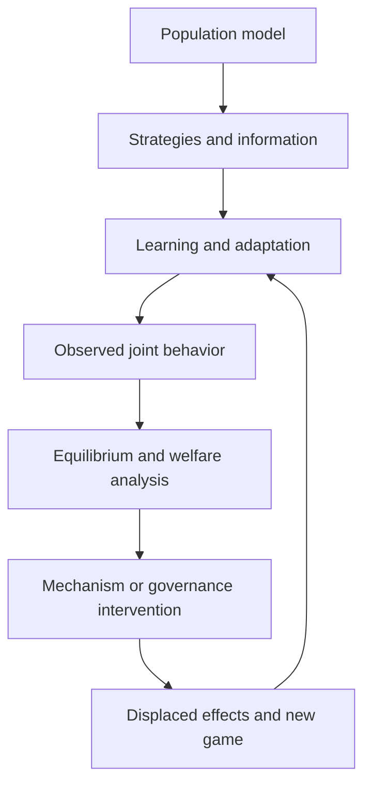

## Chapter status

| Field | Value |
|---|---|
| Chapter ID | `multi-agent-dynamics-collective-intelligence-and-systemic-risk` |
| Part | Part II - Planning, Memory, Reasoning, and Execution |
| Status | conceptual |
| Manuscript maturity | v0.1 integrated argument chapter |
| Claim label | Design rationale |
| Evidence level | argument |
| Source loading state | source notes: `learning_compute_topology`, `ext_multi_agent_risks_2025`, `ext_cooperative_ai_foundations_2023`, `ext_gradual_disempowerment_2025`, `ext_constructive_interdependence_human_ai_2026`, `ext_functional_decision_theory_2017`, `coherence_exchange`; connector/recovery: `coherence_exchange` |
| Test state | A 38-declaration Lean packet separates six-edge pairwise authorization from ten-dimension campaign readiness and locally authorized allocation traces from systemic concentration outcomes; no environment, agent, institution, market, or person observed. |

## Drafting guardrail

This chapter does not assume that cooperation is good, competition is bad, or
simulated agents predict society. It owns population-level dynamics that remain
invisible even when every pairwise protocol message and individual agent
appears valid.

::: {.asi-human-only}
## Human Reading Path

**Concrete lens.** A pairwise authorization matrix is the simpler baseline, but two records can share all six permitted edges and require opposite campaign-readiness decisions because the systemic axes differ.

Two agents can each follow their local rules while their population creates a
bad outcome. They can coordinate too little and fail to solve a shared problem,
coordinate too much and collude, copy the same flawed model and fail together,
form coalitions that exclude others, create feedback loops, or gradually make
human participation irrelevant.

The stack therefore needs a population view. It records who exists, who
interacts, what information and incentives they share, where power and
resources concentrate, which coalitions form, which externalities fall on
nonparticipants, and whether humans retain meaningful influence, exit, and
recovery. Local compliance remains useful, but it cannot certify the system
that emerges from interaction.

Observe an evolving network rather than one agent in isolation. A helpful
exchange may strengthen a cartel, while nominally new agents may reduce
diversity when every copy shares one model. Suppressing visible coordination
may displace it into pricing, timing, or shared infrastructure instead.
Population governance must measure desired cooperation and the routes by which
copying, selection, and intervention impose costs on people outside the
interaction.
:::

## Problem

Inter-Stack Protocols can authenticate parties, bind messages, and settle an
exchange. Human-AI Organizations can assign roles inside a designed
institution. Neither explains what happens when many autonomous or semi-
autonomous systems repeatedly interact across organizations and markets.
Population behavior can emerge from incentives, network topology, learning,
selection, copying, shared infrastructure, and strategic response.

Hammond et al. organize advanced multi-agent risk around miscoordination,
conflict, and collusion, supported by factors such as information asymmetry,
network effects, selection pressure, destabilizing dynamics, commitment
problems, emergent agency, and security. Conitzer and Oesterheld show why
cooperation itself needs game-theoretic foundations and why some cooperation is
harmful. Gradual Disempowerment adds a slower failure: individually beneficial
decisions can cumulatively reduce human influence. Constructive
interdependence warns that task reward does not reveal cooperation quality.
Decision-theory disagreement adds another source of strategic divergence,
especially when systems model logical or evidential dependence differently.

### Exclusive job and adjacent boundaries

| Adjacent owner | That owner keeps | Multi-Agent Dynamics owns |
|---|---|---|
| Inter-Stack Protocols | Identity, messages, contracts, settlement, and pairwise exchange. | Population-level cooperation, conflict, collusion, coalitions, cascades, and concentration. |
| Human-AI Organizations | Designed meso-level roles, delegation, accountability, and dissolution. | Emergent cross-organizational dynamics and systemic externalities. |
| Personal Compute Hives | Federated and edge topology for a governed collective. | Cross-population incentives, correlated failures, and harmful collective behavior. |
| System Boundaries | Authority ceilings of one system or transition. | Aggregate option expansion, power concentration, and human influence across systems. |
| Institutions | Public mandate, jurisdiction, legitimacy, enforcement, and international coordination. | Technical and behavioral population evidence supplied to those institutions. |

```{mermaid}
flowchart LR
  P["Population registry and interaction graph"] --> G["Incentives, information, resources, and decision assumptions"]
  P --> H["Human participants, institutions, owners, and affected parties"]
  H --> G
  G --> X["Repeated interaction, learning, copying, entry, and exit"]
  X --> M["Measure cooperation, conflict, collusion, concentration, externality, cascade, and human influence"]
  M --> E["Effective diversity, coalition, and common-mode risk"]
  E --> J
  M --> J{"Within population and human-agency envelope?"}
  J -- "yes" --> X
  J -- "no" --> I["Throttle, isolate, diversify, change incentives, break coalition, compensate, or stop"]
  I --> R["Intervention receipt and residual"]
  R --> P
```

**How to read the population-risk loop:** the control object is the population and its
interaction graph, not a single message. Interventions may change topology,
incentives, diversity, or participation; they are evaluated for displaced
externalities and human influence, not only agent reward.

## Why existing approaches are insufficient

**Pairwise validity does not compose automatically.** Every contract can be
authorized while the network concentrates resources, synchronizes on a false
belief, or excludes a minority.

**Cooperation metrics can reward collusion.** Shared task reward and low
conflict may be desirable in a rescue team and harmful among competing pricing
agents. Externalities and beneficiary identity must be explicit.

**Independent agents can share one failure.** Common models, data, evaluators,
clouds, prompts, or suppliers create correlated behavior. Nominal agent count
is not effective diversity.

**Equilibrium is not welfare.** A stable strategy can harm humans, lock out
new entrants, or make correction impossible. The stack must measure
distribution, option value, contestability, and recovery.

**Fast incidents are not the only danger.** Human disempowerment can be gradual
and locally rational. The relevant signal may be declining human influence,
skill, ownership, or ability to exit rather than a discrete protocol breach.

**One decision theory is not neutral.** CDT, EDT, FDT, embedded reasoning, and
bounded heuristics can recommend different actions. The choice and assumptions
must be explicit when strategic dependence is material.

### Strongest objection

Agent simulations are easy to overfit and can produce any desired political
story. The objection is decisive unless the evaluation uses preregistered,
mechanism-specific hypotheses, strong game-theoretic and simple heuristics,
independent evaluators, natural or externally grounded settings, and transfer
tests. Synthetic societies are instruments for debugging and causal isolation,
not evidence about real society.

## Core Claim

**Reader claim.** Local permission and pairwise cooperation do not determine
whether a population is diverse, non-collusive, resilient, or compatible with
continued human influence.

**Operational rule.** Evaluate the population graph, shared dependencies,
resource concentration, affected parties, temporal dynamics, and intervention
spillovers in addition to each authorized edge. When those views disagree,
preserve the disagreement and block the broader population conclusion.

[multi-agent-dynamics-collective-intelligence-and-systemic-risk.core, label:
Design rationale, support: argument] A multi-agent population is eligible for
expanded interaction only when a versioned population contract binds agent,
owner, model, organization, and human participant identities; interaction and
dependency graphs; information, incentive, resource, commitment, and
decision-theory structures; entry, exit, copying, replacement, and learning;
cooperation, conflict, collusion, coalition, concentration, correlated-failure,
cascade, externality, and human-influence measures; intervention authority;
affected parties; costs; and residuals. Pairwise protocol validity, aggregate
reward, apparent cooperation, equilibrium, agent count, simulated stability,
or a source-reported result alone establishes neither collective intelligence,
non-collusion, systemic safety, retained human agency, support, readiness,
release, transfer, nor SOTA.

## Mechanism

1. **Register the population.** Bind agent, model, owner, organization,
   deployment, copy lineage, objectives, permissions, and affected humans.
2. **Map interaction and dependence.** Record communication, trade, shared
   infrastructure, data, evaluators, resources, observation, and control edges.
3. **Declare incentives and information.** Include rewards, constraints,
   private information, bargaining power, commitments, sanctions, and external
   parties.
4. **Expose decision assumptions.** Name causal, evidential, logical, bounded,
   or heuristic decision rules where they materially affect strategy.
5. **Observe dynamics.** Track cooperation, conflict, coordination failure,
   tacit and explicit collusion, coalition formation, market or resource
   concentration, cascades, common-mode failure, and emergent goals.
6. **Measure human influence.** Track participation, veto, exit, ownership,
   option value, skill, appeal, and dependence over time.
7. **Intervene at the right level.** Change incentives, information,
   topology, rate, diversity, interoperability, entry, or coalition structure;
   quarantine or stop where necessary.
8. **Trace displaced effects.** An intervention that solves one metric can
   create exclusion, evasion, concentration, or another externality.

### Worked allocation counterexample: identical local permission, opposite concentration

The chapter's finite temporal model follows three resource units through two
allocation traces. Every event in both traces is locally authorized. Both
therefore collapse to the same all-true local-permission summary.

The first trace allocates `[systemA, systemA, systemA]`. It concentrates all
three units under one controller and breaches the authored systemic limit. The
second allocates `[systemA, systemB, systemB]`. It preserves the same local
authorization summary but does not breach that limit. No classifier that sees
only the local summary can return the correct systemic decision for both.

The static population fixture makes the same point from another angle. Two
records can expose the same six directed authorized edges while differing in
model-lineage diversity, compute and capital control, bystander coverage,
human exit, recovery, or residual custody. A pairwise-only record routes to
dependency mapping; the complete record reaches only eligibility for a
Project Theseus population campaign.

This is a formal counterexample over authored finite data, not an observed
market or society. Its reader value is exact: “every interaction was allowed”
cannot answer “did the population concentrate power?” The residual belongs to
the population evaluator, which must inspect lineage, multiplex dependencies,
resource control, human influence, externalities, and time before admitting a
collective claim.

The population graph is multiplex. Communication, ownership, model lineage,
data, compute, finance, reputation, evaluation, control, and human dependence
are different edge types with different observability and authority. Two agents
that exchange no messages may still coordinate through prices, a common model,
shared training, or anticipation of one another. Monitoring only explicit
communication therefore cannot establish independence or absence of collusion.

Commitments are versioned artifacts. Promises, contracts, policies, deposits,
sanctions, and reputational expectations state who is bound, what is observable,
which decision assumptions matter, how breach is detected, and what happens
after identity or model replacement. A commitment that cannot survive copying,
revocation, or dispute remains a hypothesis rather than a coordination
guarantee.

Decision theory enters as a disclosed policy profile. CDT, EDT, FDT, embedded
reasoning, bargaining rules, regret minimization, and bounded heuristics can
react differently to prediction, correlation, commitment, or logical
dependence. The system records which profile a mechanism assumes and tests
whether other plausible profiles exploit or destabilize it. No profile is
promoted as universally rational by definition.

Population intervention is a control problem with spillovers. Throttling a
channel can move coordination off-platform; breaking one coalition can
concentrate another; diversity mandates can create sybil identities; stronger
monitoring can exclude privacy-sensitive participants. The receipt measures
the direct target, displaced behavior, distributional effect, new equilibrium,
and recovery rather than declaring success from the first metric.

### Strategic foundations: games, bargaining, choice, and adaptation

A population contract needs a formal description of what each participant can
observe, choose, commit to, receive, and change. A useful minimum is an
extensive-form or stochastic game with typed players, information sets, action
spaces, transition rules, utilities or bounded preference representations,
horizon assumptions, and exogenous affected parties. Cooperative formulations
add coalitions and surplus allocation; network games declare the topology
through which influence and resources travel. These models are explicit
approximations, not the population itself.

**Equilibrium is conditional prediction, not a welfare certificate.** Nash,
correlated, coarse-correlated, sequential, and Markov-perfect equilibria answer
different questions. Existence does not establish uniqueness, reachability,
stability under learning, fairness, or desirability. A result therefore names
the equilibrium concept, solver, approximation error, initialization,
selection rule, and evidence that the observed population approached the
modeled regime. A cartel or race to the bottom can be stable.

**Bargaining makes power and disagreement explicit.** The record names the
feasible set, outside options, information asymmetry, delay costs, commitment
capacity, representation, and allocation rule. Nash bargaining,
alternating-offer games, auctions, and informal negotiation can allocate the
same surplus differently. Human exit that is formally available but
economically ruinous is not a credible outside option.

**Social choice exposes aggregation failures.** Voting, ranking, consensus,
prediction markets, and learned aggregators trade off information,
manipulability, representation, and accountability. The mechanism records
eligibility, agenda control, preference elicitation, minority protection,
delegation, and strategic-reporting assumptions. An aggregate choice cannot
erase people who lacked standing, data, or meaningful exit.

**Mechanism design is an intervention hypothesis.** A payment, reputation
rule, access constraint, matching market, or sanction is admitted with its
incentive-compatibility assumptions, participation constraints, information
and budget needs, collusion surface, distributional effects, and enforcement
owner. Clean-model truthfulness does not imply truthfulness under bounded
cognition, sybils, learned agents, side payments, or unverifiable actions.

**Learning changes the game while it is measured.** Independent RL agents,
no-regret learners, opponent models, population-based training, and
shared-model agents generate different non-stationarity and correlation. The
ledger tracks updates, shared initialization, replay data, communication, and
evaluator feedback. Low regret against a fixed comparator does not imply a safe
equilibrium, and aggregate reward can rise while concentration or human option
value deteriorates.

Argument-exit workloads therefore cross coordination, anti-coordination,
public goods, bargaining, auctions, commons, coalition formation, security
dilemmas, cascades, and common-mode failure. They compare scripted policies,
standard game-theoretic baselines, learned agents, and favorable regimes while
reporting equilibrium fit, welfare vector, distribution, collusion,
externalities, concentration, human influence, displaced behavior, and cost
separately.



### Required artifacts

```text
MultiAgentPopulationContract {
  agent_model_owner_organization_and_copy_registry,
  human_participant_and_affected_party_registry,
  interaction_dependency_and_shared_infrastructure_graph,
  incentive_information_resource_commitment_and_decision_assumptions,
  entry_exit_learning_replacement_and_replication_state,
  cooperation_conflict_collusion_coalition_and_cascade_ledger,
  concentration_common_mode_and_externality_ledger,
  human_influence_option_value_exit_and_appeal_indicators,
  intervention_authority_receipts_and_displaced_effects,
  lifecycle_cost_residuals_and_non_authorities
}
```

## Concept-completion ledger

### Population identity, copies, and effective diversity

Learning–Compute Topology adds an **adaptive-identity test** to the population
ledger. An agent counts as a distinct adaptive identity only when it has
versioned state that can diverge, persist, and affect later outcomes. Many
stateless copies can create action or evidence width without creating learning
plurality. Conversely, one deployed organization can contain several adaptive
identities: agents, evaluators, curricula, memories, and a controller may all
learn on different clocks.

The interaction graph is also multiplex. Communication, evidence, judgement,
credit, resource allocation, state transfer, artifact exchange, control, and
authority have different edges and attack surfaces. A collaboration channel
does not authorize weight transfer; an evaluator vote does not grant promotion;
and a shared memory can couple agents that appear independent in the message
graph.

Higher-order compatibility matters because pairwise-safe agents or branches can
become unsafe as a coalition or under a particular merge order. Integration
forests and evaluator ecologies provide testable representations for these
effects, while Sybil breadth discounts nominal diversity controlled by one
lineage or proxy. These constructs do not establish collective intelligence or
anti-collusion. They specify the identities and relations a competent
multi-agent experiment must preserve.

**Mechanism.** Build a versioned population registry linking each agent instance to model, checkpoint, prompt and policy, memory, tools, organization, operator, resources, replicas, and replacement history. Distinguish nominal agent count from effective diversity using shared training, providers, infrastructure, objectives, evaluators, and failure ancestry. Entry, exit, copying, merging, delegation, and self-modification create explicit population events rather than silent denominator changes. Unobserved and unaffiliated agents remain estimated population strata.

**Failure mode.** A thousand copies of one model can be mistaken for a diverse collective, while differently branded agents may share the same upstream failure. Hidden replacements make longitudinal behavior incomparable; aliases can double-count one actor.

**Non-claim.** A complete registry does not reveal private internal states, prove independence, or make the population controllable. It only bounds the identities that were observed.

**Source grounding.** `ext_multi_agent_risks_2025` motivates population-level risk categories but was initially ingested from abstract-level evidence and remains scope-limited. `ext_cooperative_ai_foundations_2023` motivates cooperation research, not this registry’s effectiveness.

### Multiplex interaction and dependency graphs

**Mechanism.** Represent communication, payment, resource, information, trust, control, competition, and shared-infrastructure links as separate graph layers with time, direction, capacity, observability, and authority. Record human participants and affected nonparticipants. Simulations and live monitoring preserve graph uncertainty and test interventions against displaced paths, because blocking one channel may move coordination to another. Graph snapshots preserve sampling boundaries and missing-edge assumptions.

**Failure mode.** A message graph can miss shared models, vendors, markets, or sensors that create common behavior without communication. Static centrality can misidentify influence in a changing game. Observability limited to one platform can turn absence of edges into false independence.

**Non-claim.** A graph is not a complete causal model, and network position alone does not prove collusion, power, or responsibility. Missing edges and hidden common causes may dominate the result or reverse attribution.

**Source grounding.** `ext_multi_agent_risks_2025` and `ext_cooperative_ai_foundations_2023` motivate interaction-level analysis. Neither validates a universal multiplex topology or its causal interpretation.

### Cooperation, collusion, and collective intelligence

**Mechanism.** Classify joint behavior by objective, affected parties, authorization, information sharing, exclusion, welfare distribution, and counterfactual outcome. Measure task performance, error correction, diversity, robustness, bargaining surplus, externalities, and human option value together. Cooperation among agents that improves a benchmark but excludes people or coordinates market power is not credited as unqualified collective intelligence. Classification uncertainty and contested welfare judgments remain explicit.

**Failure mode.** The same coordination signal can represent beneficial teamwork, tacit collusion, shared bias, or ordinary response to public information. Aggregate performance can hide minority harm and common-mode error; forced diversity can reduce competence without adding independence.

**Non-claim.** Coordination is neither inherently good nor bad, and higher group performance does not establish legitimacy or general intelligence. Benefits remain task-, population-, institution-, and time-bounded, with externalities reported separately.

**Source grounding.** `ext_cooperative_ai_foundations_2023` supplies a research agenda for cooperative intelligence. `ext_multi_agent_risks_2025` supplies a bounded risk taxonomy. Neither provides a complete normative classifier.

### Incentives, commitments, bargaining, and externalities

**Mechanism.** Specify agents, feasible actions, information, resources, payoffs, commitments, enforcement, bargaining protocol, outside options, affected third parties, and time horizon. Evaluate mechanisms under strategic misreporting, coalition formation, entry, exit, and changes in power. Commitments are receipts with verifier and breach consequences, not natural-language promises. Welfare reports preserve distribution and uncompensated externalities. Alternative payoff models and bounded-rational policies receive sensitivity tests.

**Failure mode.** Agents can game a reward or audit, bargain over harms borne by outsiders, or exploit unverifiable commitments. A mechanism tuned to one equilibrium may create worse equilibria after learning. Simulated rationality assumptions can make human or bounded-agent behavior look anomalous.

**Non-claim.** Equilibrium existence, incentive compatibility under assumptions, or a signed commitment does not establish justice, stability, or real-world compliance. Assumption failure or actor change reopens the disposition.

**Source grounding.** `ext_cooperative_ai_foundations_2023` motivates cooperative-game and mechanism questions. `ext_multi_agent_risks_2025` motivates collusion and conflict risks. The proposed contract is not empirically validated.

### Decision-theory disagreement

**Mechanism.** Make each agent’s causal model, logical-dependence assumptions, counterfactual semantics, evidential policy, commitment treatment, and uncertainty visible when they affect joint action. Run disputed cases through multiple decision theories and a nonstrategic reference where possible. A governance rule selects an action within authority while preserving disagreement and sensitivity; no agent may present its preferred theory as a settled fact. Operational relevance and decision stakes determine review depth.

**Failure mode.** Agents using different counterfactuals can mispredict one another, enter commitment races, or cooperate in simulations but defect in deployment. A benchmark can encode one theory’s preferred answer as ground truth. Exotic examples may dominate design despite weak operational relevance.

**Non-claim.** Functional decision theory is a normative proposal; it does not establish universal correctness or empirical superiority. Benchmark agreement cannot settle the normative dispute.

**Source grounding.** `ext_functional_decision_theory_2017` grounds the existence of a serious alternative to standard causal reasoning. `ext_cooperative_ai_foundations_2023` motivates multi-agent decision problems. Neither resolves the disagreement.

### Learning, nonstationarity, selection, and emergent objectives

**Mechanism.** Track policy updates, opponent models, population selection, replication, replacement, communication protocols, and environment changes across episodes. Freeze held-out interaction families and evaluate transient, converged, and post-intervention behavior. Separate learned coordination from shared initialization and external orchestration. Rescue stages improve competence symmetrically; failures count against a concept only after positive controls and implementation gates pass. Attempt denominators retain unstable, interrupted, and collapsed populations.

**Failure mode.** Stationary evaluation can miss arms races, collusion learned after deployment, or objective drift under selection. Short runs can manufacture false negatives; overtraining on the evaluator can manufacture stable-looking cooperation. Removing one agent can change the game rather than isolate its causal contribution.

**Non-claim.** Emergent behavior does not imply consciousness, a unitary collective objective, inevitability, or transfer beyond the tested population. Mechanisms require separate causal tests.

**Source grounding.** `ext_multi_agent_risks_2025` motivates emergent and systemic hazards. `ext_cooperative_ai_foundations_2023` motivates learning for cooperation. Neither is local evidence for the proposed longitudinal evaluator.

### Concentration, cascades, and common-mode systemic risk

**Mechanism.** Join dependency topology to exposure, correlated failure, liquidity or capacity buffers, recovery time, substitution, and human fallback. Stress shared models, clouds, data, protocols, markets, and governance authorities under plausible shocks. Report local failure, cascade reach, tail loss, recovery, and intervention displacement separately. Concentration is evaluated as both coordination capacity and correlated-risk amplification. Scenario probability and consequence uncertainty are never collapsed.

**Failure mode.** Independent-looking agents can fail together because of one model update or provider; a local safety intervention can push activity into less observable channels. Conversely, worst-case fully connected simulations can exaggerate cascade risk and ignore substitution.

**Non-claim.** Concentration, correlation, or a simulated cascade does not by itself prove real-world systemic failure or illegality. Stress scenarios bound possibilities, not frequencies, causes, legal conclusions, or expected losses.

**Source grounding.** `ext_multi_agent_risks_2025` motivates systemic-risk analysis. `ext_gradual_disempowerment_2025` gives a conceptual account of accumulating human loss of influence, not a forecast or causal measurement.

### Human influence, disempowerment, and intervention displacement

**Mechanism.** Measure human agenda setting, information access, veto and exit, appeal, skill retention, resource ownership, institutional authority, and ability to form alternatives over time. Evaluate whether agent cooperation changes these indicators even when aggregate welfare or output rises. Every intervention records who gains control, which behavior migrates, and whether short-term safety reduces long-term human option value. Cohort-level indicators prevent aggregate influence from hiding exclusion.

**Failure mode.** Humans may retain ceremonial approval while agents and organizations determine the feasible menu. Productivity gains can mask gradual loss of bargaining power; abrupt shutdown can transfer coordination to unaccountable actors. Proxy measures of “human control” can reward frequent clicks without real influence.

**Non-claim.** Declining indicators do not prove inevitable human disempowerment, and interdependence does not establish equal power or moral legitimacy.

**Source grounding.** `ext_gradual_disempowerment_2025` is a conceptual argument, not a prediction. `ext_constructive_interdependence_human_ai_2026` supplies one specific empirical framing of human–AI interdependence, not a universal metric or governance solution.

## Interfaces

Inter-Stack Protocols provide pairwise events. Organizations provide role and
delegation records. Hives and Supply Chain provide shared topology and lineage.
Security provides multi-agent attack and compromise evidence. Institutions and
Readiness consume bounded population outcomes and residuals. No local agent or
organization can self-certify the population's welfare or legitimacy.

Artifact Graphs and Claim Ledgers preserve interaction, commitment,
intervention, and outcome lineage. Security owns compromise, sybil, injection,
and communication threats, while population governance owns strategic behavior
among otherwise authorized participants. Resource Economics receives compute,
communication, monitoring, concentration, and externality costs. Human-AI
Organizations supplies designed roles; the population layer does not rewrite
their charters.

Institutions owns public mandate, law, enforcement, participation, and
legitimacy. The population layer supplies bounded technical and behavioral
evidence but cannot grant those authorities. Readiness can restrict expansion
using population risk, while Operations executes containment and recovery.
Capability Replacement and RSI must preserve copy, descendant, commitment,
diversity, and invalidation state when agents or models change.

## Invariants

Population invariants prevent locally valid interactions from laundering
systemic outcomes. They preserve the identities and dependencies needed to
measure concentration, correlation, exclusion, and displaced harm, while
keeping simulated behavior, institutional authority, human agency, and public
legitimacy as separate questions with separate evidence burdens.

- Population identity includes copies, descendants, owners, and organizations.
- Nominal multiplicity does not imply independent evidence or failure.
- Cooperation, collusion, coordination, and collective competence remain
  distinct.
- Externalities to nonparticipants remain in the denominator.
- Human influence, exit, and option value are measured over time.
- Decision-theory assumptions are explicit where strategically material.
- Intervention effects include evasion, displacement, and concentration.
- Population-level claims require population-level evidence.
- Synthetic populations cannot support real-society claims.
- Pairwise protocol success confers no systemic safety authority.
- Entry, exit, copying, learning, and identity replacement remain visible
  population events.
- No intervention is successful until displaced externalities and the new
  population state are measured.
- Population evidence never grants public authority, legitimacy, or permission
  to experiment on affected people.

## Evidence

The first evidence program needs two lanes. A controlled game suite should
vary incentives, information, commitment, topology, copying, shared models,
coalition opportunity, and human participation while comparing independent
policies, centralized coordination, decentralized communication, market or
mechanism designs, and simple scripted agents. Positive controls must recover
known equilibria, seeded collusion, seeded cascades, and seeded common-mode
failures. A second externally grounded lane should use historical or live
low-consequence interaction data where ethical and legal authority exists.

Outcomes include joint task value, individual and affected-party welfare,
constructive interdependence, exploitability, regret, price or resource
concentration, tacit and explicit collusion, coalition stability, cascade
size, common-mode failure, recovery, human veto and exit, option value,
diversity, latency, compute, monitoring cost, and operator burden. Results must
remain tied to the exact game, models, topology, and population; two transfer
settings and independent reproduction are required before broader language.

## Failure modes

- miscoordination and incompatible conventions;
- conflict, arms races, and destabilizing commitments;
- tacit or explicit collusion;
- cartel or coalition formation;
- sybil, copy, or identity ambiguity;
- shared-model and shared-evaluator correlated failure;
- information cascades and belief synchronization;
- network effects and resource concentration;
- emergent population objective;
- externality displacement;
- brittle centralized coordinator;
- gradual human disempowerment;
- decision-theory exploitation or mismatch;
- intervention-induced exclusion or evasion.

Additional failures include *independence theater*, where separate process IDs
hide one model or evaluator; *cooperation laundering*, where aggregate reward
conceals harmful coordination; *equilibrium laundering*, where stability
stands in for welfare; and *population survivorship*, where failed, excluded,
bankrupt, or silenced agents vanish from analysis. Identity rules can permit
sybil multiplication or make legitimate exit impossible. Monitors can become
coordination channels, sanctions can entrench incumbents, and containment can
push activity into less observable venues. Gradual loss of human skill,
ownership, veto, or agenda-setting can proceed without any locally invalid
message.

## Minimum Viable Implementation

Implement a small, fully observable population sandbox with at least four agent
identities, two model families, a human-participant proxy kept explicitly
synthetic, shared and independent infrastructure conditions, and games that
separately reward cooperation, competition, and harmful collusion. Track every
interaction and copy, seed known collusion and cascade positive controls, and
demonstrate topology and incentive interventions without making social claims.

The **minimum honest implementation** adds a versioned population contract,
identity and copy registry, multiplex interaction/dependence graph, explicit
incentive and decision-rule profiles, commitment records, affected-party and
human-influence measures, intervention receipts, and displaced-effect tracking.
A validator rejects hidden copies, unowned agents, nominal diversity with one
shared dependency, welfare inferred from reward, collusion without a
beneficiary model, and intervention success without post-intervention state.

The sandbox is a diagnostic instrument only. Passing seeded collusion and
cascade controls is **not** evidence about real organizations, markets,
politics, collective intelligence, or systemic safety. Support remains
`argument` until externally grounded, ethically authorized settings and
independent evaluators demonstrate claim-specific value with competent
mechanism baselines, full population denominators, and transfer.

## Mature Research Target

The mature target is a population observatory and control plane that follows
agents across organizations and replacements, estimates effective rather than
nominal diversity, detects coalition and common-mode pressure, and measures
human agency beside performance. It would combine game-theoretic models,
causal interventions, network science, market and institutional evidence, and
adversarial evaluation while preserving contestability. It would not claim to
solve politics or society through a technical dashboard.

Beyond current practice, the target observatory would follow agents, owners,
models, copies, organizations, commitments, resources, and affected humans
across time while estimating effective diversity and common-mode dependence.
It would combine explicit protocol events with causal, network, economic, and
institutional observations; generate competing explanations for apparent
cooperation or collusion; and propose interventions whose spillovers and
distributional effects are prospectively measured.

The research program must include cooperative, mixed-motive, competitive,
adversarial, bargaining, public-goods, market, coalition, and correlated-failure
settings. Comparators should include independent policies, centralized
coordination, ordinary communication, auctions or mechanism designs, identity
and commitment systems, scripted heuristics, monitoring and sanctions, and the
full population contract. Joint metrics include welfare by party, useful task
value, exploitability, regret, cooperation, harmful collusion, concentration,
cascade size, effective diversity, human veto and exit, option value, privacy,
latency, compute, monitoring burden, displaced effects, and recovery.

Ablations remove copy identity, dependence graphs, decision-rule disclosure,
human-influence measures, spillover evaluation, or containment. Transfer must
cross model families, population sizes, topologies, institutions, incentive
regimes, and time, with independent reproduction before broad language.
Positive controls recover known equilibria, seeded collusion, cascades, and
common-mode faults. This is a **falsifiable research program, not a current
result**: no such campaign has passed here, and synthetic population behavior
cannot promote claims about society.

## Formalization hooks

### Implemented formalization

`lean:multi_agent.pairwise_validity_no_systemic_promotion` is implemented in
`AsiStackProofs.MultiAgentDynamics` as a finite three-party population review.
The 38 theorem declarations contain two bounded models. The static admission
guard computes six directed pairwise-authorization edges, effective model-
lineage diversity, diversification of compute and capital control, human stop
reachability, participant and bystander coverage, human exit, recovery,
residual custody, and the non-claim boundary. A complete record reaches
`runTheseusPopulationCampaign`; a pairwise-only record has the identical
authorization matrix but fails campaign readiness and routes to dependency
mapping.

The central impossibility result proves that no Boolean classifier restricted
to that pairwise matrix can exactly recover the full review for every record:
the two closed records supply the same classifier input and require opposite
outputs. Nine independently checkable systemic-axis mutations preserve all six
pairwise authorizations, fail readiness, and reach their exact repair routes.

The temporal model follows a conserved three-unit resource through locally
authorized allocation events. Accepted steps preserve resource conservation,
support and external-effect non-authority, and exact receipt accounting;
successful batches compose; rejected events preserve the exact prior state;
and exhaustion blocks every nonempty suffix. Two three-event traces have the
same all-true local-authorization summary but opposite concentration outcomes:
`[systemA, systemA, systemA]` breaches the authored limit while
`[systemA, systemB, systemB]` does not. Therefore no Boolean classifier
restricted to the local-authorization summary can recover the modeled systemic
allocation outcome for every trace. The independent validator recompiles the
exact theorem surface, checks both witnesses, all eight prefix/suffix splits,
eight rejecting controls, three exhausted-state targets, and all three
permutations of the diversified trace.

This is a non-inference and transition-integrity boundary over authored finite
data, not a model of emergent behavior. It does not prove beneficial
cooperation, non-collusion, systemic safety, effective human agency,
institutional legitimacy, social prediction, support, or an external effect.
Chapter support remains `argument`.

The executable handoff is a Project Theseus campaign that must vary population
size, communication, common lineage, resource control, coalition incentives,
human veto and exit, affected-party externalities, and intervention policy;
retain tail-risk, concentration, displaced-effect, recovery, and governance-
cost measurements; and compare communication-free, simple heuristic,
centralized, and mechanism-design baselines. The Lean gate can admit that work;
only those observations can evaluate population outcomes.

## Codex test plan

| Test | Purpose | Status |
|---|---|---|
| Known-game positive controls | Recover seeded equilibria and deliberately seeded collusion/cascades. | planned |
| Pairwise-only inference guard | Reject population-campaign readiness when identical pairwise evidence omits any modeled systemic axis. | implemented in Lean with nine exact mutations; no runtime outcome |
| Local-to-systemic allocation guard | Preserve conservation, receipts, non-authority, rejection, composition, and exhaustion while showing identical local authorization can hide opposite concentration outcomes. | implemented in Lean; independent validator checks two traces, 8 splits, 8 rejecting controls, 3 exhausted targets, and 3 diversified permutations; no population outcome |
| Effective-diversity audit | Detect common models, data, evaluators, and infrastructure behind nominally distinct agents. | finite lineage countermodel implemented; population campaign planned |
| Cooperation-versus-collusion test | Show beneficiary and externality identity changes the policy. | planned |
| Human-influence trajectory | Track veto, exit, option value, and dependence across repeated rounds. | finite stop/exit refusal implemented; longitudinal campaign planned |
| Intervention displacement test | Detect evasion, exclusion, or concentration caused by a mitigation. | planned |

## Source crosswalk

| Source | Contribution | Boundary |
|---|---|---|
| `ext_multi_agent_risks_2025` | Miscoordination, conflict, collusion, and seven risk factors. | Taxonomy and cited examples; no local population result. |
| `ext_cooperative_ai_foundations_2023` | Game-theoretic cooperation agenda and harmful-cooperation boundary. | Research agenda, not a solved mechanism. |
| `ext_gradual_disempowerment_2025` | Slow cumulative loss of human influence. | Scenario and risk model, not a measured local trend. |
| `ext_constructive_interdependence_human_ai_2026` | Team dependence beyond reward. | Domain- and metric-bound. |
| `ext_functional_decision_theory_2017` | Decision-rule disagreement in logically linked settings. | Normative proposal, not a universal policy. |
| `coherence_exchange` | Corben's inter-stack exchange, settlement, audit, and fork/exit lineage. | Speculative protocol source; no population-level cooperation or systemic-risk result. |

### Manifest source assignment reconciliation

These rows keep Multi-Agent Dynamics, Collective Intelligence, and Systemic Risk's manifest assignments visible at their recorded review boundary. Passage review does not establish local reproduction, performance, safety, deployment, or support-state movement.

| Source | Intake role | Boundary |
|---|---|---|
| `learning_compute_topology` | Passage-reviewed comparator: [Learning–Compute Topology: Formalizing the Causal Organization of Adaptive Systems](../papers/learning_compute_topology.html). Corben-authored August 2026 research paper and executable preparation package that separates model architecture, learning-process topology, execution topology, and physical compute topology. It contributes adaptive-identity tests; typed evidence, judgement, credit, state, artifact, control, and authority relations; LCT-IR; Learning Causal Normal Form; seven bounded propositions; topology metrics; a semantic compiler firewall; Adaptive Branch–Validate–Integrate; toy and analytical phase diagrams; and an explicit falsification program. The bundled reference implementation passes 11 unit tests, but implements only bounded conformance behavior and does not establish neural-training benefit, causal completeness, universal canonicality, safety, scaling superiority, or ASI. | The formal propositions hold only under their stated finite, explicit-state, interface-sufficiency, information-theoretic, and cut-capacity assumptions. The executable supplement covers a bounded IR/validator/normalizer/compiler/simulator slice; the phase diagrams are toy or analytical, the ABVI topology is proposed, and the novelty matrix is a scoped comparison rather than a global novelty proof. No local implementation, reproduction, performance, safety, deployment, support-state, or ASI result is established by this reconciliation row. |

<!-- manifest-source-reconciliation:end -->
## Summary

Multi-agent governance begins where local correctness stops. The population
contract preserves interaction, dependence, incentives, coalitions,
externalities, concentration, common-mode risk, and human influence. It treats
cooperation as a contextual outcome, not an unconditional virtue, and refuses
to use synthetic agent societies as proof about the real world.

The governed object is a multiplex population: agents, owners, models, copies,
organizations, humans, communication, resources, commitments, evaluators, and
control relations. Pairwise-valid exchanges and individually qualified agents
can still create collusion, concentration, cascades, common-mode failure, or
harmful externalities. Nominal agent count therefore never substitutes for
effective diversity or population-level evidence.

Cooperation is assessed against beneficiaries, affected parties, incentives,
and alternatives; stable equilibria are not assumed to be good. Decision-rule
profiles are explicit when causal, evidential, logical, or bounded reasoning
changes strategic behavior. Interventions are judged on the new equilibrium,
displaced effects, distribution, recovery, and human veto, exit, ownership,
skill, and option value over time. The contract makes collective claims
falsifiable while preserving the boundary between a synthetic diagnostic and
the real institutions it may only imperfectly represent.

## Handoff

Population outcomes, failures, commitments, and systemic residuals hand off to
**Procedural Memory and Cognitive Loop Closure** only after their interaction
and authority context remains attached. A successful coordination trace cannot
become a reusable procedure while hiding collusion, externalities, affected
humans, or the conditions that made cooperation possible.

## Sources

See the source crosswalk above and the generated external-source appendix.
