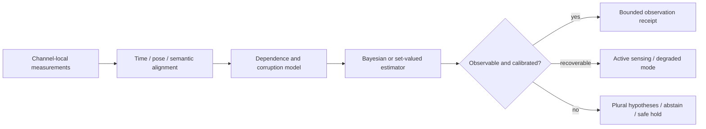

## Chapter status

| Field | Value |
|---|---|
| Chapter ID | `perception-sensor-fusion-and-observation-trust` |
| Part | Part II - Planning, Memory, Reasoning, and Execution |
| Status | conceptual |
| Manuscript maturity | v0.1 integrated argument chapter |
| Claim label | Design rationale |
| Evidence level | argument |
| Source loading state | Five primary external records cover multimodal taxonomy, shared representations, natural corruptions, adversarial cross-channel effects, and integrated vision-language-action systems. All results remain source-reported. |
| Test state | Claim-bearing campaign specified; no task, sensor stream, corruption, model, or evaluator run. |

## Drafting guardrail

This chapter governs when environmental signals may become observations. It
does not claim that more sensors imply more truth, that a shared embedding is a
world model, or that a calibrated detector makes physical action safe.

::: {.asi-human-only}
## Human Reading Path

The stack cannot begin with “the camera saw a person” as if that sentence were
raw reality. A camera emitted time-stamped measurements through a lens,
calibration, exposure, software, and data path. A detector
transformed those measurements into a hypothesis. Other sensors may agree
because they provide independent evidence, or because they share the same
weather, alignment error, training data, or attacker.

Perception governance preserves that chain. Each observation
states which modalities contributed, when and where they were measured, how
they were calibrated and aligned, what was missing or occluded, how fusion
changed the result, what uncertainty remains, and which new observation could
resolve it. The output is trusted enough for a named use or it is not. It is
never promoted to universal truth.

A planner may use an estimate for a reversible step while refusing an
irreversible sequence. A controller may slow when synchronization degrades. A
world model may retain hypotheses rather than average away warnings.
Observation trust is not a permanent sensor score; it is a bounded permission
whose assumptions and unresolved disagreement remain visible to every consumer.
:::

## Problem

**Mechanism.** Compile every sensing request into a task-relative observation need that names the consumer, consequence class, required variables, deadline, acceptable uncertainty, and maximum authority. **Failure mode.** A generic perception request can return plausible objects while omitting the quantity or timing the decision actually needs. **Non-claim.** Naming the need does not make any sensor accurate or authorize an action. **Source grounding.** The multimodal taxonomy and Gemini Robotics motivate distinct perception operations and embodied consumers, but the admission contract remains ASI Stack design rationale.

Planning, world modeling, and control depend on observations, yet most AI
architecture diagrams begin after perception has already compressed the world
into convenient tokens, objects, or embeddings. That omission hides some of
the hardest failures: a sensor can drift, saturate, lag, move, become occluded,
be spoofed, or observe a different time from its peers. A learned perception
model can hallucinate semantics, erase rare objects, become overconfident under
shift, or inherit a common failure across modalities.

Multimodal systems deepen the problem. Baltrušaitis, Ahuja, and Morency
separate representation, translation, alignment, fusion, and co-learning;
these are not interchangeable operations. ImageBind shows that six modalities
can share a learned space through image-paired data, but semantic proximity in
that space does not prove physical co-reference, current calibration, or
task-relevant completeness. The 3D corruption benchmark and adversarial
camera-LiDAR study show why clean accuracy and ordinary fusion tests are
insufficient: robustness varies by corruption, channel, architecture, and
defense, and hardening one channel can harm another.

### Exclusive job and adjacent boundaries

| Adjacent owner | That owner keeps | Perception owns |
|---|---|---|
| Command Contracts | The requested task, constraints, and required evidence. | Which environmental observations are adequate for that task. |
| Governed World Models | Belief state, prediction, imagined branches, and reality residuals. | Admission of time-bound observations before they update belief. |
| Context ABI | Typed information supplied to a cognitive consumer. | Whether sensor-derived information corresponds to a bounded observation contract. |
| Security Kernel | Authentication, integrity, hostile-input policy, and isolation. | Calibration, coverage, disagreement, uncertainty, and perceptual sufficiency even without an attacker. |
| Embodied Control | Deadline-bound actuation and plant safety. | The observation and freshness envelope the controller is allowed to consume. |

```{mermaid}
flowchart LR
  S["Sensor and modality streams"] --> I["Identity, calibration, time, pose, provenance"]
  S --> C["Shared-cause, channel-dependence, and attack hypotheses"]
  C --> I
  I --> Q{"Coverage and quality sufficient?"}
  Q -- "no" --> A["Active observation, alternate modality, abstain, or safe hold"]
  Q -- "yes" --> F["Alignment and fusion with per-channel evidence retained"]
  F --> D{"Material disagreement, shift, or common-mode risk?"}
  D -- "yes" --> A
  D -- "no" --> O["Task-relative observation contract"]
  O --> W["World-model update or control handoff"]
  W --> R["Observed downstream effect and residual feedback"]
  R --> I
```

**How to read the observation-trust loop:** fusion occurs only after identity, calibration,
timing, and coverage checks. Disagreement is a routing signal, not noise to be
averaged away. The downstream result feeds back into calibration and residual
tracking without rewriting what the system believed earlier.

## Why existing approaches are insufficient

**Mechanism.** Keep sensor identity, calibration, pose, preprocessing, model version, and operating envelope attached to every measurement and invalidate descendants when any of them changes materially. **Failure mode.** Clean benchmark accuracy or a new encoder can conceal calibration drift, wrong geometry, or an expired sensor-to-world transform. **Non-claim.** Complete identity metadata is not proof of calibration or field reliability. **Source grounding.** The 3D-corruption and sensor-fusion studies expose configuration sensitivity; neither reproduces the proposed lifecycle control.

**A high benchmark score is not an observation contract.** Accuracy averages
over a dataset and scoring rule. It does not state which sensor version,
environment, corruption, class tail, latency, or consequence the score covers.

**More modalities are not automatically independent evidence.** Two cameras
can share glare; camera and LiDAR can share a pose error; every modality can
share training-set bias or a wrong clock. Fusion must represent common-cause
risk and effective evidence diversity.

**A shared representation can hide provenance.** Cross-modal embeddings are
valuable candidate substrates, but the stack must still identify the source
measurement, transformation, alignment, and uncertainty behind every admitted
observation.

**Calibration is conditional.** A confidence score calibrated on yesterday's
population can fail under a new location, sensor replacement, weather regime,
or active policy. Calibration travels with its cohort and expires under shift.

**Passive perception can be the wrong policy.** When uncertainty matters, the
system may need to change viewpoint, request a different modality, wait for a
fresh sample, ask a person, or reduce authority. Active observation has cost,
privacy, and physical-risk consequences that must be governed.

### Strongest objection

A detailed observation ledger can become expensive ceremony around a weak
perception model. The objection wins if typed records do not change routing,
abstention, active sensing, or downstream harm. The layer earns its place
only if observation-aware governance beats a strong ordinary-fusion baseline
on joint task value, false certainty, tail harm, latency, sensing cost, and
operator burden.

## Core Claim

[perception-sensor-fusion-and-observation-trust.core, label: Design rationale,
support: argument] A sensor-derived claim is eligible to update a consequential
world model or controller only when a versioned observation contract binds the
task and required evidence; sensor and modality identities; calibration, pose,
clock, and synchronization state; provenance and transformations; spatial,
temporal, semantic, and population coverage; missingness, occlusion,
saturation, and taint; per-channel predictions and uncertainty; fusion method
and common-mode assumptions; disagreement and shift tests; active-observation
options; freshness and expiry; downstream authority; costs; and residuals.
Clean accuracy, cross-modal similarity, sensor count, fused confidence, source-
reported robustness, or a formally valid record alone establishes neither
environmental truth, causal grounding, physical safety, support, readiness,
release, transfer, nor SOTA.

## Mechanism

**Mechanism.** Preserve event time, acquisition time, processing time, pose time, and delivery time separately, then align channels only inside declared tolerance and uncertainty envelopes. **Failure mode.** A spatially plausible fusion can join measurements from different physical moments and manufacture agreement. **Non-claim.** Clock synchronization does not establish semantic correspondence or causal grounding. **Source grounding.** The multimodal taxonomy supports separating alignment from fusion, while the remaining timing and pose requirements are engineering proposals awaiting a natural campaign.

1. **Compile the observation need.** The task declares which entities,
   attributes, spatial region, time horizon, precision, recall, and consequence
   classes matter.
2. **Bind sensing identity.** Record hardware, firmware, model, calibration,
   pose, clock, sampling, field of view, and environmental operating range.
3. **Preserve channel-local evidence.** Each modality emits its own hypothesis,
   uncertainty, quality flags, and missingness before fusion.
4. **Align explicitly.** Temporal, spatial, semantic, and population alignment
   are separate operations with their own error budgets.
5. **Model dependence.** Record shared clocks, mounts, preprocessing, training
   data, environmental causes, and attack surfaces before treating agreement as
   additional evidence.
6. **Fuse or keep plural.** The policy may fuse, retain multiple hypotheses, or
   privilege a modality for a task. It records why.
7. **Test disagreement and shift.** Material disagreement, coverage gaps,
   unknown corruptions, or calibration failure route to active observation,
   abstention, review, or safe hold.
8. **Issue a bounded observation.** The receipt states the exact use, freshness
   window, uncertainty, unresolved alternatives, and authority ceiling.
9. **Close the loop.** Later measurements and effects update calibration and
   failure ledgers without backfilling earlier certainty.

Admission is consumer-relative. A lane boundary may require centimeter-scale
position and millisecond freshness; a maintenance report may tolerate meters
and minutes but require strong provenance. The contract compiles those needs
into per-field tolerances, consequence-weighted error classes, acceptable
missingness, and a loss function for abstention versus false admission. A
global confidence threshold cannot substitute for that decision context.

Fusion is evaluated as a causal graph, not a vote count. The graph records
shared hardware, clock, pose, preprocessing, training data, environment,
network, operator, and evaluator dependencies. Agreement contributes new
evidence only to the extent that the error mechanisms are plausibly diverse.
When dependence is unknown, the result remains conservative or plural rather
than receiving the confidence of independent corroboration.

Active observation is a policy with side effects. A new camera angle, higher
power pulse, human question, network fetch, or instrument run can consume time,
energy, privacy, attention, and physical authority. The expected reduction in
decision loss must justify those costs, and a deadline-aware fallback remains
reachable when additional sensing cannot arrive in time.

Observation records are append-only about what was known when. Downstream
effects may improve calibration, reveal a corruption, or defeat a hypothesis,
but they create a new evidence event rather than rewriting the old receipt.
That distinction permits incident reconstruction and prevents hindsight from
laundering a false observation into an apparently well-founded decision.

### Bayesian state estimation and concrete fusion regimes

The contract becomes implementation-determining when it names the estimation
regime rather than saying only “fuse the sensors.” Let $x_t$ be latent state,
$u_t$ an applied control, and $y_t^m$ the observation from modality $m$. A
governed estimator declares a transition model
$p(x_t\mid x_{t-1},u_{t-1})$, observation models
$p(y_t^m\mid x_t)$, the prior, clock and pose transformations, missingness
process, and the approximation used to update the belief. The posterior is
useful only inside those assumptions and its calibration envelope.

| Regime | Competent baseline | Principal boundary |
|---|---|---|
| approximately linear, Gaussian, synchronized | Kalman or information filter | covariance and model mismatch remain visible |
| nonlinear but locally smooth | extended or unscented Kalman filter | linearization can produce false certainty |
| multimodal, discontinuous, or contact-rich | particle or mixture filter | particle impoverishment and deadlines matter |
| learned high-dimensional observations | calibrated encoder plus explicit filter | representation drift and training correlation remain |
| asynchronous event streams | timestamped factor graph or smoothing window | late data cannot rewrite an executed decision |
| adversarial or unknown corruption | robust estimator, channel exclusion, or plural hypotheses | robust loss does not identify coordinated compromise |

Observability is tested before confidence is consumed. A state component can
be unobservable under the current motion, view, topology, or sensor set even
when an estimator emits a narrow covariance. The receipt records local
observability or empirical identifiability, excitation, geometry, and
unresolved symmetries. Active sensing earns its cost when it changes that
condition, not merely when it gathers more correlated evidence.

Fusion must model correlation. Multiplying likelihoods or averaging confidence
double-counts evidence when modalities share a clock, pose estimate, training
set, encoder, weather condition, mount, or attack path. A competent system
carries cross-covariance where known, uses conservative fusion where dependence
is uncertain, or retains separate hypotheses. Learned fusion is compared with
strong late-fusion and channel-local baselines so average accuracy cannot hide
correlation errors.

Calibration is conditional and consequence-aware. Proper scoring, coverage,
reliability, and residual tests are stratified by channel, environment, range,
object or population slice where applicable, corruption, missingness, and
decision consequence. Tail and abstention behavior appear beside average
error. Aggregate calibration can coexist with dangerous miscalibration on the
exact boundary that triggers physical action.

Degradation is an explicit state machine. Channel loss may preserve a
low-speed mode; synchronization loss may widen uncertainty; unknown
common-mode failure may preserve plural hypotheses; loss of observability may
require active sensing, human inspection, or safe hold. The consumer receives
the estimate together with estimator mode, coverage, age, and invalidating
assumptions.



### Required artifacts

```text
ObservationContract {
  task_and_evidence_need,
  sensor_modality_model_and_environment_identity,
  calibration_pose_clock_and_sync_state,
  source_measurement_and_transformation_lineage,
  coverage_missingness_occlusion_saturation_and_taint,
  channel_local_hypotheses_and_uncertainty,
  alignment_fusion_and_dependence_model,
  disagreement_shift_and_active_observation_routes,
  freshness_expiry_and_downstream_authority,
  joint_quality_latency_privacy_energy_and_operator_cost,
  residuals_and_non_authorities
}
```

## Interfaces

**Mechanism.** Represent each channel as its own hypothesis packet with measurement, uncertainty, coverage, missingness, transformation history, and alternative explanations before any shared representation is admitted. **Failure mode.** Early collapse can turn absence into negative evidence or make a dominant modality overwrite a rarer but decisive signal. **Non-claim.** Multiple packets do not imply independent evidence. **Source grounding.** ImageBind supplies a shared-embedding comparator and the taxonomy supplies missing-pair questions; neither establishes trustworthy hypothesis management.

Command Contracts supply required evidence and consequence classes. Sensor
adapters supply measurements and identity. Security supplies integrity and
attack state. The observation layer returns bounded hypotheses to World Models
and, where deadlines permit, directly to Embodied Control. Claim Ledgers retain
calibration and failure evidence. No consumer may widen the observation's
freshness, support domain, or authority.

World Models consume admitted observations as fallible evidence and return
prediction residuals; they do not certify the sensors. Planning states its
information value and deadline and may request active sensing, while Runtime
and Embodied Control enforce the resulting authority and timing envelope.
Artifact Graphs stores raw-measurement handles, transformations, calibration,
model, and receipt identity so later replay can distinguish source bytes from a
derived hypothesis.

Security owns authenticity, integrity, hostile-input policy, and isolation;
observation trust still owns benign corruption, coverage, calibration, and
epistemic sufficiency. Privacy and Data Rights own whether collection,
retention, linkage, and disclosure are permitted. Readiness consumes
claim-specific calibration and tail evidence but cannot convert a valid record
into environmental truth. Operations receives degradation and incident routes
and returns observed outcomes, clock failures, replacements, and repair state.

## Invariants

**Mechanism.** Estimate dependence explicitly and retain disagreement after fusion, distinguishing redundant agreement, complementary evidence, contradiction, and unresolved plurality. **Failure mode.** Correlated channels or a shared hub encoder can inflate confidence, while averaging can erase the very conflict that should trigger abstention. **Non-claim.** Dependence accounting does not prove that the surviving hypothesis is true. **Source grounding.** ImageBind and the adversarial sensor-fusion study motivate hub bias and cross-channel externalities; local calibration remains untested.

The invariant set protects the observation's meaning while it crosses models,
planners, controllers, storage, and later review. A downstream consumer may
narrow a record for its task, but it may not erase missingness, manufacture
independence, refresh stale evidence, or turn semantic confidence into broader
authority.

- Missing or stale modalities remain visible.
- Agreement from correlated channels cannot count as independent evidence.
- Calibration is bound to a population, environment, metric, and version.
- Observation time and event time are not silently conflated.
- Fusion retains per-channel provenance and material disagreement.
- Active sensing requires its own privacy, resource, and physical authority.
- Semantic confidence does not authorize physical action.
- Sensor or model replacement expires affected observation evidence.
- Later success cannot rewrite an earlier observation as certain.
- When task-relevant uncertainty exceeds the envelope, the route narrows
  authority or stops.
- Every admitted observation names its consumer, consequence class, and
  falsifiable expiry condition.
- Raw measurement identity and derived hypothesis identity never collapse into
  one interchangeable object.

## Evidence

**Mechanism.** Challenge the observation path with named natural corruptions, joint-channel attacks, missing modalities, distribution shift, and known-vulnerable positive controls, reporting calibration and downstream decision harm rather than accuracy alone. **Failure mode.** An easy or incomplete corruption suite can create a false-negative robustness result. **Non-claim.** Passing the suite would remain sensor-, environment-, severity-, and task-specific. **Source grounding.** The 3D corruption benchmark and camera–LiDAR attack study provide bounded external families, not local robustness evidence.

The current evidence is external and architectural. The multimodal taxonomy
separates operations; ImageBind supplies a modern shared-representation
comparator; the 3D corruption work supplies natural degradation tests; the
sensor-fusion paper supplies adversarial and cross-channel failure evidence;
Gemini Robotics supplies an integrated capability example. None validates the
ASI Stack mechanism.

The first claim-bearing campaign should use a natural multimodal dataset or
low-energy instrumented environment with independent ground truth. Compare
competent unimodal specialists, ordinary early and late fusion, a shared-
embedding route, reliability-aware plural fusion, and active-observation
governance. Freeze natural and synthetic corruptions, timing and pose faults,
missing channels, correlated failures, calibration shift, benign near-
neighbors, and positive controls before held-out opening. Measure task utility,
false certainty, selective risk, subgroup and corruption tails, abstention,
active-sensing value, downstream decision harm, latency, energy, privacy, and
operator cost. A failed positive control or inactive route makes a null result
instrument-inadequate, not evidence against perception governance.

## Failure modes

**Mechanism.** Route stale, unsupported, contradictory, integrity-failing, or undercovered observations to active sensing, degraded mode, abstention, review, or safe hold under separately bounded sensing authority. **Failure mode.** Active perception can itself consume privacy, energy, time, or physical risk, and a degraded route can silently become ordinary operation. **Non-claim.** A safe-hold route does not establish that it is reachable or sufficient. **Source grounding.** Gemini Robotics provides embodied capability pressure; active-observation governance is not a reported source result.

- sensor spoofing or poisoning;
- calibration, pose, clock, or synchronization drift;
- occlusion, saturation, blur, weather, or environmental shift;
- modality collapse or missing-channel concealment;
- correlated error counted as independent confirmation;
- semantic hallucination or wrong co-reference;
- fusion confidence inflation;
- common-mode training or evaluator bias;
- active-perception privacy or physical harm;
- stale observation replay;
- OOD overconfidence;
- downstream authority inherited from a perception score.

Other failures include *alignment laundering*, where a timestamped but
misregistered channel is treated as the same event; *coverage laundering*,
where a clear view of one region stands for an occluded population; and
*agreement inflation*, where several outputs share a model, dataset, pose, or
environmental cause. A fusion route may suppress a rare but decisive channel,
or an active-sensing policy may repeatedly collect from easy cases while
abandoning expensive tails. Cached observations can survive calibration or
sensor replacement, privacy deletion can leave derived features, and a model
can exploit known sensor blind spots. Each case retains an owner, affected
consumers, invalidation scope, and safe degradation route.

## Minimum Viable Implementation

**Mechanism.** Issue an expiring observation lease that binds the admitted variables, provenance, freshness, uncertainty, permitted consumers, prohibited uses, fallback, and reconciliation rule for later evidence. **Failure mode.** Cached or replayed observations can outlive calibration, environment, or model changes and retain authority after their basis expires. **Non-claim.** A validated lease schema is not an observation-trust result. **Source grounding.** The Platonic World Model contributes authorial lineage for versioned grounding and revisable state; it supplies no empirical sensing evidence.

Build a two- or three-modality observation service with immutable sensor
identity, clock and calibration checks, per-channel hypotheses, a dependence-
aware fusion record, calibrated abstention, one active-observation action, and
a safe-hold route. Demonstrate seeded time drift, one missing channel, one
correlated failure, one spoofing case, and one benign disagreement while
retaining complete denominators and costs.

The **minimum honest implementation** adds a versioned ObservationContract
schema, immutable raw-measurement handles, per-channel uncertainty, an explicit
dependence graph, task-relative acceptance thresholds, a freshness lease, and
an independent ground-truth path. A validator rejects missing clock,
calibration, provenance, coverage, dependence, disagreement, consumer,
authority, and expiry state. Seeded corruptions serve as positive controls,
while clean cases verify that the guard does not collapse into refusal.

Report false admission, false refusal, selective risk, disagreement routing,
active-sensing success, deadline misses, privacy and energy cost, and downstream
decision harm for every case. Passing record validation or detecting the
seeded faults is **not** a perception-quality, causal-grounding, robustness,
physical-safety, or support promotion. The implementation remains at
`argument` until a source-disjoint natural campaign with competent fusion
baselines and independent evaluation demonstrates decision-relevant value.

## Mature Research Target

The mature target is a substrate-neutral observation fabric in which cameras,
audio, depth, thermal, inertial, text reports, scientific instruments, and
future modalities can be replaced behind stable contracts. It would estimate
evidence dependence, choose observations for expected decision value, preserve
plural hypotheses through ontology change, and transfer calibrated uncertainty
into world models and controllers. It would still refuse the strongest claim:
no finite perception layer proves open-world truth.

Beyond current practice, the target observation fabric would qualify each
sensor, learned encoder, alignment transform, fusion route, and active-sensing
policy for named consumers and consequence classes. It would maintain a live
dependence graph, estimate effective evidence diversity, detect shifts in
calibration and common causes, and carry multiple hypotheses through world
models and planners without forcing premature consensus. New modalities could
enter behind stable contracts, but old calibration would not transfer by
interface compatibility alone.

The claim-bearing program must compare strong unimodal specialists, ordinary
early and late fusion, shared-embedding systems, reliability-aware ensembles,
active perception, and the full governed route. It should span natural
weather, occlusion, hardware replacement, time/pose error, missing channels,
adversarial perturbation, correlated failure, distribution shift, and rare
consequence tails. Metrics include task utility, calibration, selective risk,
downstream regret and harm, evidence diversity, latency, throughput, energy,
privacy, operator work, false refusal, recovery time, and lifecycle cost.

Causal ablations remove dependence modeling, channel-local evidence,
calibration expiry, disagreement routing, active sensing, or consumer-relative
thresholds. Transfer crosses sensor suites, model families, environments,
organizations, and tasks. Independent observers own ground truth and
downstream effect scoring. A negative conclusion requires competent base
perception, activated corruptions, passed positive controls, relevant
deadlines, and method-specific rescue. This is a **research target, not a
current result**: no such joint campaign has passed, and the present work does
not establish superior fusion or observation trust.

## Codex test plan

### Planned formalization

`lean:perception.correlated_agreement_no_independent_promotion` will model a
declared dependence relation and prevent correlated agreement from increasing
the finite record's independent-evidence count. It will not prove dependence,
calibration, observation truth, robustness, causal grounding, or safety.

| Test | Purpose | Status |
|---|---|---|
| Identity and freshness mutation suite | Reject wrong sensor, clock, calibration, pose, model, or expired observation. | planned |
| Correlated-agreement positive control | Show that common-mode agreement does not increase evidence as if independent. | planned |
| Cross-channel defense test | Detect a defense that hardens one modality while weakening another. | planned |
| Active-observation value test | Measure whether asking for another observation reduces decision harm enough to justify cost. | planned |
| Natural shift and tail audit | Preserve environment, subgroup, corruption, and consequence denominators. | planned |

## Source crosswalk

| Source | Contribution | Boundary |
|---|---|---|
| `ext_multimodal_machine_learning_taxonomy_2019` | Representation, translation, alignment, fusion, and co-learning taxonomy. | Survey; no local mechanism result. |
| `ext_imagebind_2023` | Six-modality shared-representation comparator. | Representation quality is not observation trust. |
| `ext_3d_detection_corruptions_2023` | Natural corruption benchmark and tail pressure. | Source results not reproduced. |
| `ext_adversarial_sensor_fusion_2022` | Cross-channel attacks and defense externalities. | Threat-model- and architecture-bound. |
| `ext_gemini_robotics_2025` | Integrated perception/reasoning/action capability context. | No independent safety or local transfer result. |
| `platonic_world_model` | Corben design lineage for separating observations, representations, and a revisable world state. | Speculative architecture source; no sensor-fusion, calibration, or trust result. |

## Summary

Perception is the governed transition from physical or digital signals to
task-relative observations. Its central discipline is to preserve identity,
timing, calibration, coverage, dependence, disagreement, uncertainty, and
expiry through fusion. The output is useful precisely because it is bounded:
an observation may be adequate for one decision without becoming truth for
every later consumer.

The observation contract is task-relative because different decisions require
different spatial, temporal, semantic, and consequence resolution. It preserves
per-channel hypotheses and a causal dependence graph so several correlated
signals cannot masquerade as independent confirmation. Conditional calibration,
freshness, coverage, common-mode risk, and downstream authority travel with the
observation instead of disappearing inside a fused confidence score.

When evidence is stale, contradictory, unsupported, or too costly to repair in
time, the system requests another view, changes modality, asks a person,
degrades, abstains, or enters safe hold. Later outcomes update calibration and
failure memory without rewriting what was known at the decision time. This
creates a usable boundary between sensing, belief, planning, and control while
preserving the central non-claim: an admitted observation is bounded evidence,
not open-world truth.

## Handoff

The admitted, provenance-bearing observation contract hands off to **Planning as a Control Layer: DAGs and Intelligence Arbitrage**. Planning may request
active sensing or use observations within their declared scope, but it may not
erase disagreement, extend freshness, or turn perception confidence into
execution authority. Every plan retains the observation lease and its
degradation route.

## Sources

See the source crosswalk above and the generated external-source appendix.
