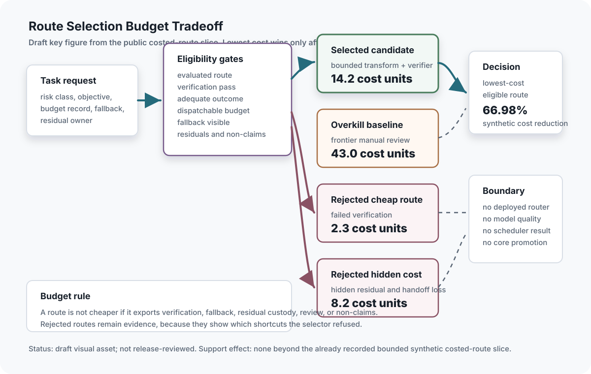

## Chapter status

| Field | Value |
|---|---|
| Chapter ID | `resource-economics-and-token-budgets` |
| Part | Part III - Routing, Compression, Representation, and Substrates |
| Status | conceptual |
| Manuscript maturity | v0.4 temporal-access integration |
| Last updated | 2026-08-08 |
| Primary source records | 41 assigned records spanning local resource and simulation lineage, serving and heterogeneous-memory comparators, current provider cache contracts, exact and modular prefix reuse, disaggregated and non-prefix KV state, semantic response caching, and benchmark context |
| Claim label | Design rationale |
| Evidence level | argument |
| Source queue | primary: `tokenmana`, `planforge`; supporting: the local resource, simulation, routing, residual, and relational lineage; external comparators: verification, memory, serving, recurrent compute, training benchmarks, heterogeneous inference memory, exact-prefix and prompt-module caches, disaggregated and non-prefix KV state, current provider contracts, and semantic response caching |
| Source loading state | source notes: `learning_compute_topology`, `tokenmana`, `ext_eggroll_hyperscale_es_2026`, `ext_openai_es_2017`, `ext_mezo_2023`, `planforge`, `coherence_exchange`, `simulation_scaling`, `viea`, `project_theseus_whitepaper`, `coilra_multicoil_rope`, `cgs`, `rankfold_neuralfold`, `alignment_field`, `ext_pagedattention_vllm_2023`, `ext_reluplex_2017`, `ext_mem0_2025`, `ext_recurrent_transformer_2026`, `ext_dynamic_compute_recurrent_transformers_2026`, `ext_claw_swe_bench_2026`, `reflexive_router_whitepaper`, `kernel_english_residual_compiler`, `ext_mlperf_training_v6_2026`, `relational_dimension_compiler`, `ext_airllm_2023`, `ext_deepspeed_inference_2022`, `ext_flexgen_2023`, `ext_hf_accelerate_big_model_inference_2026`, `ext_llama_cpp_memory_mapping_2026`, `ext_llm_in_flash_2024`, `ext_powerinfer_2024`, `ext_vattention_2025`, `ext_infinigen_2024`, `ext_specache_2025`, `ext_specoffload_2025`, `ext_atsinfer_2026`, `ext_openai_prompt_caching_docs_2026`, `ext_anthropic_prompt_caching_docs_2026`, `ext_gemini_context_caching_docs_2026`, `ext_vllm_automatic_prefix_caching_2026`, `ext_sglang_radixattention_2024`, `ext_prompt_cache_2024`, `ext_mooncake_2025`, `ext_cacheblend_2025`, `ext_azure_llm_semantic_cache_2026`, `precision_contract`; raw cache: `tokenmana`, `planforge`, `simulation_scaling`, `viea`, `cgs`, `rankfold_neuralfold`, `alignment_field`; connector/recovery: `coherence_exchange` |
| Test state | `resource_budget_record.valid.json` and `simulation_contract_record.valid.json` pass repository-level protocol fixture validation; `python3 scripts/validate_generation_mode_baselines.py` checks paired generation-mode/resource-budget fixture alignment; `python3 scripts/validate_costed_route_resource_slice.py` checks the four-route costed selector against JSON costs, eligibility fields, negative controls, a finite Lean selector-state trace theorem, and the tracked result's field-level Python/Lean alignment record; `python3 scripts/validate_resource_budget_ledgers.py` checks 6 valid and 7 expected-invalid deterministic budget-ledger dispatch, escalation, protected-overhead, security-overhead erasure rejection, displaced-cost residualization, review-capacity hoarding, KV-cache/serving-memory accounting separation, throughput-to-quality overclaim rejection, evidence-ref, and no-promotion scenarios; `python3 scripts/validate_capacity_smoothing.py` checks 3 valid and 6 expected-invalid toy capacity traces for bounded regeneration arithmetic, priority deferral, reviewer-capacity arithmetic, protected-review overhead, displaced-review-cost residualization, overload rejection, Lean bridge coverage, and no-promotion boundaries; `python3 scripts/validate_resource_workflow_trace.py` checks 1 valid and 5 expected-invalid deterministic workflow fixtures for selected-route cost recomputation, scheduler ordering, protected high-risk review, displaced-cost residuals, capacity-budget-overrun rejection, physical-feasibility overclaim rejection, no-promotion boundaries, and the tracked result's trace-property Python/Lean alignment record over finite dispatch events, rollup totals, high-risk-first order, guard flags, over-budget rejection, and no-promotion boundaries; `python3 scripts/validate_resource_live_probe.py` replays 5 local Resource Economics validators and checks command-output digests plus tracked artifact hashes without creating a support-state transition; `python3 scripts/validate_resource_workload_quality_probe.py` checks 3 local route candidates across 5 measured samples each for a scoped workflow-trace review task, selects `validate_resource_workflow_trace.py` over the broader Resource live-probe baseline by median elapsed time, rejects a cheaper no-op success-text route, records residuals, and preserves no-promotion boundaries; `python3 scripts/validate_resource_load_stability_probe.py` checks a 10-task local synthetic burst-review workload across admit-arrivals, protected capacity-smoothing, and review-erasure routes, verifies 100.0 percent selected-vs-baseline finite overload reduction, 7 residualized selected deferrals, 3 review-erasure negative-control violations, Lean fixture alignment, and no-promotion boundaries; `python3 scripts/validate_resource_ci_cost_profile.py` checks 8 recorded GitHub Pages runs, 8 completed runs, 5 successful completed runs, 3 classified deploy-service failures, a 131-second recovery boundary, finite Lean fixture alignment, duration metrics, and no-transition boundaries as publication-pipeline metadata only; `python3 scripts/validate_simulation_transfer_boundaries.py` checks 3 valid and 6 expected-invalid simulation-transfer fixtures for fidelity declaration, resource bills, bottlenecks, omissions, approximation liberties, instrumentation effects, transfer decisions, residual/downgrade behavior, and support-state non-promotion; `python3 scripts/validate_resource_flagship_lane.py` now also checks an aggregate Python/Lean flagship invariant over 10 command replays, 26 tracked artifacts, 3 accepted narrow transitions, 5 no-promotion decisions, preserved negative controls, residuals, non-claims, and the no-core-promotion/no-new-transition boundary; `AsiStackProofs.ResourceEconomics` and `AsiStackProofs.SimulationFidelity` implement finite record-level predicates plus negative cases for disabled required gates, high-risk insufficient-budget dispatch, finite selector-state trace selection, finite workflow event rollup/order/guard preservation, finite capacity-smoothing reviewer trace guards, aggregate serving-throughput quality overclaim rejection, aggregate flagship replay accounting, CI failure-classification accounting, missing simulation scope, and fidelity overclaim; deployed scheduler, real load-stability, verification-tax optimization, KV-cache behavior, serving throughput, single-request quality, physical-feasibility, runtime security-budget enforcement, reviewer-capacity optimization, displaced-cost measurement, stable speedup, external workload-quality review, and live cost-quality tests remain planned. |

One narrow non-core import has moved: the Theseus simulation-fidelity receipt suite import, `resource-economics.simulation_fidelity_receipt_suite_import`, is `prototype-backed` through `python3 scripts/validate_theseus_simulation_fidelity_receipt_suite_import.py`. It records a public-safe digest-and-count summary of 5/5 passed fixture scenarios, six simulation contract records, six fidelity records, six world-adapter receipts, six evidence-transition records, six failure-boundary records, one blocked transfer, one downgraded claim, one scenario-only record, and seven expected-invalid controls. It does not prove simulator adequacy, physical feasibility, benchmark transfer, native KV parity, deployment, live simulator behavior, model quality, economic outcome, learned generation, clean live Project Theseus replay, or any chapter-core support-state promotion.

The Theseus RLDS/Minari trace-export import, `resource-economics.theseus_rlds_minari_trace_export_import`, adds a second narrow Theseus bridge for simulation-data interchange rather than simulation truth. It is validated by `python3 scripts/validate_theseus_rlds_minari_trace_export_import.py` with result `experiments/theseus_rlds_minari_trace_export_import/results/2026-07-05-local.json`. The import records one READY export manifest, three declared formats, seven declared fields, license metadata required, replay smoke required, zero public training rows, zero external inference calls, no copied episode payload, and seven expected-invalid controls. It does not prove RLDS dataset correctness, Minari dataset quality, simulator adequacy, replay success, physical feasibility, benchmark transfer, model quality, economic outcome, clean live Project Theseus replay, deployment readiness, or the Resource Economics chapter core claim.

## Drafting guardrail

TokenMana and PlanForge appear here as resource-governance and planning sources, Simulation Scaling as a contract-relative physical/fidelity source, and PagedAttention/vLLM plus Reluplex as external comparators for serving economics and scoped formal verification. The book does not reproduce TokenMana formal results, run load simulations, deploy vLLM, audit KV-cache behavior, run a simulator, reproduce Reluplex, validate physical feasibility, or claim measured welfare, profit, latency, throughput, productivity, transfer, or safety effects.

Closing the compression/resource cluster, resource economics asks whether the stack actually saved anything after verification, repair, fallback, memory pressure, human review, and risk are counted. A cheaper representation or faster route is only efficient when the budget record still preserves protected gates and task success.

Resource economics is the cost counterpart to the security kernel. Least exposure, verification, review, replay, and rollback all consume resources. A governed stack has to budget for those costs explicitly rather than letting local optimization make them disappear.

::: {.asi-human-only}
## Human Reading Path

**Concrete lens.** A scalar cost sort chooses the 2.3-unit route and calls it efficient. The accepted selector rejects it for failed verification and compares the 14.2 route with a 43.0 adequate baseline.

Governed routing, compression, faster generation, richer representations, and synthetic experiments can look locally cheap. Resource economics asks whether they still save anything after verification, repair, fallback, memory pressure, fidelity limits, and risk are counted.

The efficiency thesis depends on this accounting. A route is efficient only when full system cost, protected overhead, displaced work, and residual burden are visible.

Token budgets are policy objects, not just engineering knobs. They decide what may be shortened, what must be reviewed, what cannot be compressed, and which costs are protected from local optimization.

A budget expresses values when it protects work from optimization. Simulation contracts express honesty when they say what a synthetic result is allowed to mean. Cheapness that erases verification or outruns fidelity is debt moved into the future.

The budget should reveal tradeoffs before they become hidden policy: which latency target is flexible, which review cost is mandatory, which cache is safe, which simulation boundary is narrow, and which shortcut would spend authority the task lacks. Efficiency is credible only after protected costs and fidelity boundaries are paid.
:::

## Problem

ASI architecture consumes scarce resources: tokens, context, verifier time, model calls, tool time, storage, latency, human attention, review capacity, and risk budget. If those resources are implicit, the system will overspend expensive cognition on low-value tasks, cut verification when it is most needed, and overload at synchronized demand spikes.

Resource economics is not an accounting appendix. It is a control layer. Planning needs budgets. Routing needs costed specialists. Evidence needs verification tax. Governance needs to know when cost pressure is trying to bypass protected gates.

The central question is not "how do we spend less?" It is "which costs are safe to reduce, which costs are evidence obligations, and which costs are protected governance overhead?" That distinction keeps efficiency work from becoming permission to cut the very checks that make capability usable.

## Why existing approaches are insufficient

Ignoring resource economics makes high-quality verification unaffordable and encourages hidden cost shifts. Hard quota resets can synchronize bursts. Token-only accounting can ignore human friction, sleep, quality, latency, and risk. Cheap routes can look efficient while exporting cost into later repair, review, or failure handling.

TokenMana contributes the regenerative-capacity idea: bounded capacity accumulates continuously instead of appearing in synchronized cliffs. PlanForge contributes tier-aware scheduling: tasks should be assigned to the minimum adequate capability with fallback and replanning. Simulation Scaling contributes the transfer warning: synthetic or simulated results mean only what their scope, fidelity, resource bill, omissions, and transfer decision allow. PagedAttention/vLLM contributes a serving-layer warning: KV-cache memory, batching, and aggregate throughput are real resource variables, but they are not the same as verified output quality. Together they imply that budgets should be typed, risk-aware, fidelity-aware, and tied to evidence.

Budget records should therefore include the cost of not acting, too. Deferral, rejection, escalation, and scope reduction are not failures if they preserve higher-value capacity or prevent unverifiable high-risk work. The ledger should make those choices visible instead of rewarding only dispatch.

### Worked cost comparison: the cheapest route is not the economical route

The tracked costed-route fixture begins with one bounded transformation task
and four ways to handle it. A cheap unverified transform costs 2.3 synthetic
units. A hidden-residual auto-merge costs 8.2. A bounded transform plus a
verifier costs 14.2. A manual-review baseline costs 43.0. If the scheduler
sorts one number, it selects 2.3 and appears efficient.

The ledger changes the decision. The 2.3 route fails verification, leaves a
`cheap_brittle` outcome, and cannot become a promotion candidate. The 8.2
route passes a shallow surface check but loses residual ownership and the
reviewer handoff. Both become `residualized`, not dispatchable successes. The
43.0 route remains adequate but spends more tokens, time, and tool units than
the 14.2 route. The selector therefore chooses the lowest-cost *eligible*
route, not the lowest number.

```text
2.3  cheap-unverified-transform       -> reject: verification failed
8.2  hidden-residual-auto-merge       -> reject: residual and reviewer lost
14.2 bounded-transform-plus-verifier  -> select: adequate and fully owned
43.0 frontier-manual-review           -> retain: adequate overkill baseline
```

Under the fixture's frozen formula—tokens per thousand, seconds per minute,
and five units per tool-cost unit—the selected route is 66.98 percent cheaper
than the adequate baseline. That percentage is a synthetic arithmetic result,
not a production saving. Its useful lesson is the denominator: generation,
verification, fallback, residual custody, non-claims, and review eligibility
all determine whether a route is allowed into the cost comparison. The same
accounting later expands to caches, paging, energy, latency tails, human work,
and recovery.

## Core Claim

**Readable claim.** Resource efficiency means the lowest complete cost for a
qualified useful outcome—not the fewest tokens, fastest local step, highest
cache-hit rate, or cheapest route before verification and repair.

**Normative rule.** Protected safety, rights, verification, recovery, and
residual costs enter the ledger before selection. A route that omits them is
ineligible, not inexpensive.

[resource-economics-and-token-budgets.core, label: Design rationale, support: argument] Resource Economics owns a consumer-, task-, risk-, workload-, organization-, resource-, and time-specific allocation lease that admits, prices, schedules, defers, shrinks, escalates, or rejects work only after protected safety and rights floors, complete direct and displaced costs, uncertainty, useful outcome value, verification capacity, load and tail stability, simulation-transfer limits, recovery, and residual ownership are explicit; throughput, low token count, synthetic success, or a cheap route alone confers no quality, safety, economic-optimality, support, or deployment authority.

Resource Economics distinctly owns the **Resource Allocation Lease** and the resource side of the **Simulation Claim-Transport Contract**. Intent and Planning own task value and dependencies; Routing owns eligible routes; Runtime and Serving own execution receipts; Verification owns check adequacy; Security, Rights, and Authority own protected floors; Labor owns reviewer conditions; Evidence and Claims own support; Artifact Graph owns lineage; Readiness and Incident Response own qualification and recovery; and Release owns public use. Resource Economics may allocate or deny capacity, but it cannot waive those owners or convert cheapness into truth.

The claim remains at `argument` support. The source notes justify design discussion of regenerative capacity, tier-aware planning, load variance, cognitive friction, cost-quality tradeoffs, and verification scarcity. They do not establish measured infrastructure or human-outcome claims in this repository.

### Proof rationalization receipt

The formal surface now separates policy conformance from economic or simulation
evidence. `AsiStackProofs.ResourceEconomicsRefinement` contains 29 theorem
declarations over nine reachable stages and 66 routes from scoped request
through budgeting, protected capacity, scheduling, observed execution,
verification, simulation-claim transport, reconciliation, and closure.
Arbitrary accepted runs preserve nine request, consumer, task, policy, rights,
resource, evaluator, simulation, and result identities and zero
support/external-effect authority. They account for exactly one receipt per
event, keep resource-bill and reconciliation receipts monotone, expose an
accepted trace, compose across event batches, and admit no event after closure.
One eight-event witness closes with eight receipts, one resource-bill receipt,
and one reconciliation receipt.

An independently implemented consumer reconstructs the lifecycle, checks all
nine prefix/suffix composition splits, reaches all 66 routes, and rejects
170/170 route, identity, wrong-stage, replay, authority, support, effect, and
post-closure mutations. These include missing protected floors, missing
reviewer or verifier capacity, raw-proxy promotion, incomplete failure
accounting, incomplete simulation contracts, fidelity overclaim, and incomplete
closure.

The consumer also reruns and digest-binds twelve bounded source families. Their
evidence meanings remain separate: authored fixtures test record discipline;
repository replays test local reproducibility; local timing describes only its
recorded machine and task; historical CI records describe past publication
runs; and sanitized Theseus imports describe import boundaries. In particular,
the 66.98 percent cost difference is arithmetic inside one four-route synthetic
fixture, not a general efficiency result. Thirty-five copied summaries or
assumption-restating declarations were retired with frozen lineage; twenty-three
countermodels and bounded computations remain. Support-state and external-effect
authority remain exactly `none`, so the core claim remains at `argument`.

Folded simulation-fidelity subclaim: simulation and synthetic-environment results are resource-governed claim-transport records whose support cannot exceed declared scope, fidelity, temporal semantics, resource bill, assumptions, omitted variables, instrumentation effects, residual risks, and transfer decision.

### Claim-source mapping status

Appendix C carries seventeen exact passage-reviewed mappings for the original
resource packet. Fifteen metadata-first assignments now add relational,
training-benchmark, and heterogeneous-memory drafting context. The mappings
support budget records, regenerative capacity, scheduling, physical/fidelity
boundaries, execution-spine discipline, hidden-burden warnings, serving and
recurrent-compute comparisons, variable-depth allocation, persistent-memory
costs, relational-compute accounting, scoped verification, and harness-bound
cost reporting. They do not support measured economic outcomes, welfare
effects, scheduler quality, serving or paging performance, simulator adequacy,
physical feasibility, open-world transfer, cache behavior, model quality, or
local superiority.

| Source | What it supports | Limit |
|---|---|---|
| `tokenmana` | Regenerative bounded capacity, burst controls, load signals, convex infrastructure-cost comparisons, load variance, renewal clustering, nocturnal usage, cognitive friction, and privacy/opt-in study constraints. | Formal results, simulations, human outcomes, profit effects, and productivity claims have not been reproduced. |
| `planforge` | Hierarchical decomposition, MVI tiers, dependency scheduling, cost/capability routing, fallback, replanning, and execution handoff. | No scheduler benchmark, cost-quality trace, or verified implementation exists here. |
| `coherence_exchange` | Source-note-only verified epistemic units, verification supply chains, intelligence arbitrage, coherence/liquidity language, fork, exit, audit, and contestability as value/accounting and governance framing. | Connector source text is not published here; speculative economic/liquidity metaphors are not implemented mechanisms or external corroboration. |
| `simulation_scaling` | Scope, clockspeed, fidelity, resource fraction, efficiency, memory, heat, bandwidth, latency, and capacity bottleneck accounting. | Theoretical synthesis only; no simulation benchmark, physical experiment, or independent literature audit was run. |
| `viea` | Command contracts, artifacts, specialist-routed work, verification, runtime execution, feedback, residuals, tools, benchmarks, and regression coverage as the execution-spine context for resource accounting. | No completed deployment, runtime trace, budget scheduler, or verified execution result exists here. |
| `project_theseus_whitepaper` | Source-note-only small-until-evidence growth, compact substrate, autonomy control loop, benchmark/residual ledgers, checkpoints, sparse teacher governance, trusted Hive nodes, and observability. | Raw local project text is not copied here; current reports, ledgers, code paths, and command outputs were not rerun. |
| `coilra_multicoil_rope` | Source-note-only parameter-accounting and hardware/baseline discipline for dense, low-rank, block-cyclic, block-circulant, and circulant routes. | Raw local project text is not copied here; no model-quality, speed, memory, training-stability, or context-length result exists. |
| `cgs` | Hidden complexity debt, residual burden, verification cost, governance interfaces, and the warning that compact generators or simulators can hide cost unless residuals remain visible. | Conceptual framework only; no local CGS benchmark, simulator adequacy test, or compression-safety result has been run. |
| `rankfold_neuralfold` | Artifact manifests, deterministic reconstruction checks, residual coding, WORM assumptions, archive-backend obligations, and trace/storage costs around simulation records. | Architecture and implementation-plan source only; no local artifact compressor, trace-store benchmark, deterministic decoder, or reproduced ratio exists here. |
| `alignment_field` | Normative/speculative boundaries around agency, dignity, confinement, consciousness heuristics, and metaphysical assumptions in simulation scenarios. | Philosophical/normative source, not physics or simulation evidence; consciousness and metaphysical claims remain speculative. |
| `ext_pagedattention_vllm_2023` | KV-cache memory management, batching, cache sharing, fragmentation, aggregate throughput, and serving latency as a resource-economics lane separate from verified-output quality. | Reviewed against public arXiv abstract/metadata only; no vLLM/PagedAttention deployment, cache audit, serving benchmark, local throughput measurement, latency result, or quality result has been reproduced. |
| `ext_reluplex_2017` | Scoped property verification as an external example of a result whose claim boundary is useful precisely because the model class and property are explicit. | External paper only; no Reluplex run, ACAS Xu reproduction, ASI Stack model verification, broad system-safety proof, or simulation-transfer result has been reproduced. |
| `ext_mem0_2025` | Persistent-memory extraction, consolidation, retrieval, graph linkage, latency, and token-cost pressure as a resource comparator. | Metadata-first note only; no LOCOMO, memory operation, cost-quality, privacy, retention, deletion, or production result is reproduced. |
| `ext_recurrent_transformer_2026` | Recurrent KV memory, effective depth/width, cache pressure, and autoregressive compute accounting. | Metadata-first note only; no checkpoint, cache trace, hardware, quality, useful-throughput, or production result is reproduced. |
| `ext_dynamic_compute_recurrent_transformers_2026` | Token-level variable-depth compute, online halting, complexity-aware allocation, and a negative generalization boundary. | Metadata-first note only; no model, calibration, hardware, useful outcome, economic, or transfer result is reproduced. |
| `ext_claw_swe_bench_2026` | Harness-, workspace-, evaluator-, runtime-, and cost-bound coding-agent comparison discipline. | Primary-preprint comparator only; no task, score, harness, cost, contamination, safety, or local reproduction result is imported. |

## Draft Key Figure: Route Selection Budget Tradeoff

::: {.asi-key-figure}
{#fig-route-selection-budget-tradeoff fig-alt="Draft route-selection budget tradeoff figure showing a task request, eligibility gates, selected bounded transform plus verifier route at 14.2 cost units, adequate overkill baseline at 43.0 cost units, rejected failed-verification route at 2.3 cost units, rejected hidden-residual route at 8.2 cost units, and no deployed-router or core-claim-promotion boundary."}
:::

**How to read the route-selection figure:** Treat this draft reader aid as a summary of the bounded public costed-route slice, not a deployed scheduler. Read it from left to right: the task request enters eligibility gates, where verification, adequacy, budget dispatch, fallback, residual custody, and non-claims must all remain visible. The cheapest route is rejected because verification fails. The hidden-residual route is rejected because residual ownership and reviewer handoff are lost even though it looks cheaper than the selected route. The adequate overkill baseline stays eligible but costs more. The selected route is the lowest-cost eligible route in this synthetic fixture, with the already recorded 66.98 percent synthetic cost reduction against the adequate overkill baseline. The figure does not promote the Resource Economics core claim, prove deployed routing, measure model quality, establish scheduler behavior, or create a new evidence transition.

### Resource-allocation lifecycle

The lease moves through eighteen auditable stages: (1) freeze consumer, task, value, risk, workload, organization, authority, rights, horizon, success, and non-claims; (2) inventory compute, memory, storage, network, energy, tools, verifiers, reviewers, approval, security, rollback, and recovery capacity with units and owners; (3) declare protected floors; (4) estimate direct, uncertain, error, verification, fallback, repair, incident, opportunity, reviewer, governance, and displaced costs; (5) separate attempted through recovered work states; (6) choose dispatch, defer, shrink, escalate, fallback, refuse, or residual; (7) bound any regenerative credits, debt, and expiry; (8) reserve scarce verification and review capacity; (9) measure queues, caches, warmup, compilation, preemption, retries, tails, OOM, saturation, and tenant interference; (10) separate aggregate serving metrics from verified useful outcomes; (11) attach a Simulation Contract Record to every synthetic result used as evidence; (12) freeze its fidelity and transfer boundary; (13) compare strong matched allocation controls; (14) measure usefulness, unsafe release, false refusal, missed help, fairness, latency, resources, human and governance cost, recovery, and residuals jointly; (15) run causal ablations; (16) expire qualifications on material drift; (17) reconcile estimates to actuals and preserve failures; and (18) adjudicate each claim through an explicit transition and independent reproduction.

Every stage has a rejecting route. Missing scope or units requests repair; an erased protected floor blocks dispatch; insufficient high-risk verification escalates or narrows; unbounded credits are rejected; review capture reschedules work; partial denominators invalidate comparative claims; missing simulation scope blocks transfer; unmatched baselines block superiority; drift expires the lease; and unexplained variance becomes an owned residual rather than disappearing.

## Mechanism

Resource economics is the control layer that prevents efficiency work from becoming blind cost cutting. TokenMana supplies regenerative-capacity and load-variance pressure; PlanForge supplies task and route scheduling; Verification Bandwidth turns verification into a scarce resource; Simulation Scaling keeps physical capacity and fidelity explicit; VIEA and Project Theseus connect cost to execution/report discipline; PagedAttention-style serving work keeps aggregate throughput separate from single-request verified-output quality.

A budget record is not a quota override. It is the policy surface that decides whether a task can afford the required cognition, context, tool use, verification, and human review without weakening protected gates. When the budget is insufficient, the correct result is escalation, scope reduction, deferral, rejection, or residual accounting, not quiet degradation.

The budget state should therefore be an adjudication state, not just a number. A task can be `proposed`, `priced`, `underfunded`, `protected_overhead_required`, `dispatchable`, `escalated`, `deferred`, `scope_reduced`, `rejected`, or `residualized`. Those states keep verification, security, approval, replay, and human-review costs visible when local optimization pressure wants to compress them into zero.

A Resource Budget Record attaches those constraints to a task, route, plan node, benchmark run, or review process. It records value, risk, capacity, cost, verification tax, serving pressure, protected gates, budget decision, escalation rule, residuals, and evidence references.

### Generation mode and deliberation depth are allocation decisions

Generation speed and reasoning depth belong in one economic decision even
though they remain different technical mechanisms. A request can spend its
budget by drafting more tokens per second, by branching across candidate
solutions, by revising one candidate, by paying an independent verifier, or by
falling back to a slower route. Comparing only the generator hides branch
cost; comparing only the reasoning policy hides queueing, memory, decode,
verification, and repair. Resource Economics owns the comparison across those
choices because it owns the complete bill and the opportunity cost of the
capacity they consume.

The allocation lease therefore receives two independently governed offers.
[Fast Generation Architectures](fast-generation-architectures.qmd) offers a
named execution path with its model, hardware, cache, paging, proposal,
verification, fallback, and expiry contract.
[Governed Deliberation and Test-Time Scaling](governed-deliberation-and-test-time-scaling.qmd)
offers a direct, revision, search, or abstention policy with branch custody,
stopping rules, evaluator scope, answer-change accounting, and residual owner.
The resource controller may fund, narrow, combine, defer, or reject those
offers. It may not redefine their mechanisms, certify their outputs, or borrow
their local evidence as proof of economic advantage.

This separation changes the optimization target. The controller does not ask
for the fastest mode or the largest reasoning budget. It asks for the
lowest-cost eligible route to an accepted useful outcome under the request's
risk, latency, authority, rights, and verification floors. Sometimes that is
a fast exact path with cheap verification. Sometimes it is direct generation
because extra branches mostly corrupt initially correct answers. Sometimes a
slower deliberative route earns its cost by repairing difficult cases. When
the evidence cannot distinguish those conditions, the honest state is a
bounded default, escalation, or unresolved allocation residual.

The two technical chapters remain stable detail routes because the economic
ledger cannot substitute for their contracts. Fast Generation owns whether an
accelerated execution path is admissible. Governed Deliberation owns how
candidates are generated, retained, stopped, and handed to planning. Resource
Economics owns whether the complete route is worth funding. No parent or child
inherits another's claim support, proof result, test result, or authority.

### Bounded-liveness accounting

Resource Economics owns the accounting projection of bounded liveness. A task
does not satisfy the liveness contract merely because it left a queue: the
ledger distinguishes completed, refused, quarantined, compensated, retired,
expired, and unresolved work, and it charges retries, review loops, waiting,
fallback, recovery, residual ageing, and displaced useful work to the route
that created them. Each blocked record names the minimum missing condition and
the budget or authority owner that could change it; an unowned “pending” state
is neither safe hold nor progress.

The joint comparison therefore keeps useful throughput, false blocking,
missed help, unsafe or unauthorized effects, latency, compute, storage, energy
where measured, human time, verification capacity, recovery quality,
residual burden, and governance cost separate. A stop-only policy can be a
necessary control and still lose the useful-work frontier. A fast policy can
also lose when it externalizes repair or open effects. Economics supplies
these denominators; Security owns the trusted-kernel properties, Readiness
owns qualification and quarantine, Runtime and Operations own effect closure,
and none of those owners may borrow an attractive cost result as permission.

```{mermaid}
flowchart LR
  A["Task or plan node"] --> B["Value and risk estimate"]
  B --> C["Capacity pool"]
  C --> D["Cost estimate"]
  S["Serving memory / throughput pressure"] --> D
  D --> E["Verification + security overhead"]
  P["Protected gates"] --> F{"Budget adequate and gates intact?"}
  E --> F
  F -- "yes" --> G["Dispatch route"]
  F -- "no" --> H["Escalate, defer, shrink, or reject"]
  G --> I["Cost-quality and residual evidence"]
  H --> I
```

**What the budget adequacy gate shows:** Budget adequacy is checked after risk, capacity, cost, verification tax, serving pressure, and protected gates are visible. If the gates cannot stay intact, the correct route is escalation, deferral, scope reduction, rejection, or residual accounting rather than quiet quality degradation.

A budget ledger separates:

- Value hypothesis: why the task is worth spending on.
- Risk class: what failure would cost.
- Capacity pool: what resource is being drawn down or regenerated.
- Cost estimate: tokens, time, tools, storage, human review, or money.
- Verification tax: the extra cost required to trust the output.
- Protected overhead: security handles, Digital SCIFs, approval, replay, rollback, audit, and human review that policy requires.
- Serving pressure: memory pressure, batching, cache reuse, aggregate throughput, and latency when those affect route cost.
- Safety gates: checks that cannot be disabled by budget pressure.
- Budget decision: dispatch, escalate, defer, shrink, reject, or residual.

The stack can save resources, but not by silently dropping protected verification. High-risk tasks should either pay the verification cost or route to escalation.

The security interface matters here. Secure handles, Digital SCIFs, human approval, and replayable artifacts add cost, but those costs are part of the task when protected authority is involved. A route that is cheap only because it avoids the security boundary is not a cheaper equivalent route.

The budget record should also carry a displaced-cost section. If a route saves model calls by increasing future debugging, reviewer burden, hidden context reconstruction, private-data exposure, benchmark contamination, or rollback difficulty, the savings are not yet accepted. They become residual costs until a cost-quality test or evidence packet shows the displacement is harmless for the specific risk class.

### Resource policy shapes human time

An AI budget is also a temporal access contract. Renewal times, accrual rates,
expiration, burst and concurrency limits, price updates, throttling, queue
priority, and notifications change when people can do work—not only how many
tokens they can consume. A deterministic reset can concentrate requests near a
boundary; continuous regeneration can remove that one discontinuity while
still creating peaks through shared deadlines, common price signals, outages,
time zones, product releases, identical accrual rules, or strategic waiting.
Load smoothing is therefore an empirical property of a policy and population,
not a semantic property of the word “regenerative.”

A `TemporalAccessContract` should bind:

- account or workload class, covered resource, meter, and units;
- regeneration, maximum stock, spill at the upper bound, permitted debt,
  expiration, transfer, rollover, burst, concurrency, and service-rate rules;
- renewal, pricing, observation, feedback, notification, and policy-change
  cadence;
- protected safety, verification, security, accessibility, and human-review
  capacity that scarcity cannot consume;
- expected deadline, time-zone, fairness, predictability, and availability
  effects;
- observed mean, variance, tails, queueing, deferred and abandoned work,
  useful completion, quality, false blocking, price, and displaced costs; and
- expiry, appeal, rollback, adverse-outcome, and residual owners.

The human pathway needs its own claim boundaries. Renewal clustering is a
timestamp pattern. Nocturnal usage is a schedule pattern. Sleep duration and
regularity are sensitive human outcomes. Rework, correction loops, and test
failures are noisy task-friction proxies. None establishes the next link in a
causal chain by itself, and token volume is not productivity. Deadlines,
caregiving, time zones, incidents, job type, plan selection, and shared
infrastructure can affect several stages at once.

Any study of these effects should minimize what the platform learns about the
person. Sleep or wearable data is opt-in, purpose-limited, short-lived,
deletable, exportable, separated from employer and performance-management
access, and unavailable for medical or individualized impairment inference.
Aggregate timing telemetry should be preferred when it answers the question.
Shared load and load-responsive pricing also create interference between users,
so a staggered rollout cannot assume that one person's treatment leaves the
control group unchanged.

TokenMana motivates this temporal-access lens, but its equilibrium, variance,
profit, sleep, and productivity claims remain unproved or unmeasured here. Its
regenerative policy is one candidate beside staggered quotas, ordinary token
buckets, reservations, queue admission, pay-as-you-go, and static rate limits.
The design succeeds only if it improves a joint frontier over useful work,
load, cost, access, fairness, human burden, protected capacity, and failures;
merely moving demand or surveillance cost outside the provider's dashboard is
not a win.

### Simulation Fidelity and Claim Transport

Simulation fidelity is folded here because the central object is not a standalone simulator. It is a resource-governed claim-transport rule. A simulated, synthetic, benchmark, or scenario result may travel only as far as its contract permits: declared scope, fidelity standard, temporal semantics, demand estimate, resource bill, capacity bottlenecks, omitted variables, approximation liberties, instrumentation effects, observed-result boundary, supported-claim boundary, transfer decision, residual risks, and non-claims.

The Resource Budget Record says what the stack can afford. The Simulation Contract Record says what a cheap or synthetic experiment is allowed to mean. Those records should be paired whenever a budget, benchmark, safety rehearsal, or synthetic environment is used as evidence. A cheap simulation can be excellent for a unit invariant and useless for a physical-deployment claim; a high-fidelity simulation can still fail if it omits the bottleneck that decides the question.

Reluplex is useful as a comparison point because scoped verification gains authority from its property boundary. It can verify a specified property or return a counterexample inside its own model class; it does not verify all behavior. Simulation contracts should follow the same discipline. Name the preserved structure, omitted physics, resource cost, instrumentation effect, and transfer boundary before a result is allowed to support a broader claim.

#### Feasibility is a vector before it is a score

The useful intuition in Simulation Scaling is that scope, simulated-time rate,
implementation efficiency, and available physical resources trade against one
another. Its compact expression should not be treated as a universal physical
law. Memory demand need not grow with clockspeed; communication and
synchronization can grow faster than instantiated state; event-driven work can
be sparse; sequential depth can bind despite spare operations; and
compression, reversibility, or distribution can reduce one bill while
increasing another.

The operative check is therefore component-wise. For a fixed simulation
contract (C), implementation (I), architecture and environment (A), and
resource allocation (m), require

\[
d_j(C,I) \leq c_j(A,m) \quad \text{for every operative resource } j,
\]

plus the coupling constraints among resources. The vector should include, when
relevant, state-transition rate, working and persistent memory, communication,
synchronization, latency or sequential depth, energy, irreversible erasure,
heat rejection, error correction, sensing and I/O, verification, and human
review. A minimum normalized margin can summarize an already completed audit;
it cannot replace one or make unlike units interchangeable.

Efficiency also stays typed. Representational compression, conditional
evaluation, algorithm choice, hardware, reversible computation, and
communication changes can overlap or conflict. A lower resolution, smaller
observable set, delayed answer, or observer-conditioned world is a new contract
when the original required what was removed. It is not an implementation gain
under the same task. Likewise, Margolus–Levitin/Lloyd, Bekenstein or
holographic, and Landauer-style limits are assumption-bound physical ceilings,
not achievable hardware specifications. Engineering feasibility needs a bridge
from each ceiling to an actual architecture, reliability target, geometry,
temperature, duration, and uncertainty interval.

This separation also keeps evidence states distinct: logical definability,
computability, consistency with an ideal upper bound, engineering feasibility,
simulator adequacy, benchmark performance, and external transfer are different
claims. A scalar frontier plot can be a useful conditional visualization, but
it does not prove that real simulation frontiers are linear, that all resources
share one efficiency multiplier, or that a proper subsystem cannot satisfy any
particular simulation contract.

```{mermaid}
flowchart LR
  A["Simulation or synthetic result"] --> B["Scope and claim class"]
  B --> C["Fidelity and temporal semantics"]
  C --> D["Demand, resource bill, and bottlenecks"]
  D --> E["Omissions and instrumentation effects"]
  E --> F{"Transfer allowed?"}
  F -- "yes" --> G["Bounded evidence claim"]
  F -- "no" --> H["Residual, downgrade, or blocked claim"]
  G --> I["Resource/evidence ledger"]
  H --> I
```

**Reading the claim-transport gate:** A simulation output is not promoted merely because it came from a simulator. It moves only after scope, fidelity, temporal semantics, resources, bottlenecks, omissions, and transfer are explicit. Failed transfer is still useful: it becomes a downgrade, residual, reduced-scope test, or blocked claim rather than hidden evidence inflation.

This fold preserves the old simulation-fidelity chapter's restoration condition. Simulation Fidelity and Physical Constraints should be restored as a standalone chapter if public-safe artifacts create a distinct evidence lane: a feasibility calculator, physical-computation audit, simulation benchmark with negative controls, executable simulator evidence tied to a `Simulation Contract Record`, or independent external review showing that the simulation contract is too central to remain a section inside resource economics.

### Minimum sufficient compute is a qualified frontier

The Reflexive Router turns “use the cheapest mechanism” into a constrained
selection rule. Let route proposals carry a generalized cost vector over
latency, model and tool compute, memory, energy, money, verification,
monitoring, human work, governance, recovery, opportunity cost, and residual
risk. The optimizer may compare those costs only after capability, freshness,
authority, rights, quality, verifier, effect, fallback, and resource
obligations qualify the route. A cheap inadmissible route is not on the
frontier.

This distinction changes fast-path accounting. Raw reflex coverage can rise
when a router overuses easy rules, refuses difficult work, or omits expensive
verification. A useful ledger must retain qualified coverage, useful outcome
rate, wrong-fast-path rate, selective risk, route regret against the best
qualified alternative, abstention and fallback, verification escape,
unauthorized effects, recovery, and displaced work beside latency and cost.

The paper proposes “Useful Reflex Efficiency” as a synthesis metric, but this
chapter treats it only as a view over non-collapsible measures. No scalar may
hide zero useful throughput, unsafe release, false refusal, verifier burden,
monitoring cost, human burden, energy, or residual risk. Pareto analysis and
claim-specific floors remain authoritative; a system that is faster because it
discarded governance has not demonstrated minimum sufficient compute.

The source includes illustrative budgets and launch gates, not measured
resource results. Its economics therefore strengthens the natural campaign and
cost ledger while leaving the core at `argument`.

The same rule now covers relational computation. A comparison cannot report
only the final pairwise or polyadic contraction. Its cost vector includes
candidate construction, rejected tuples, sparse gathers and scatters,
factorization, kernel work, optimizer state, memory traffic, communication,
relation qualification, branch bookkeeping, persistent incidence storage,
contraction, expansion, cache invalidation, verification, repair, and compiler
overhead. Candidate proposal recall belongs beside cost: an inexpensive route
that never considers the required relation has not reached the same quality
frontier.

Semantic arity is not itself a cost estimate. A six-role relation may be stored
as one object and six incidences, while a pairwise system may spend substantial
depth and intermediate state reconstructing it; a selective triadic kernel may
save steps but lose on irregular memory traffic. The ledger therefore records
primitive arity, candidate count, accepted relation count, persistent bytes,
measured data movement, verification burden, and total time-to-qualified-useful
outcome separately. Asymptotic sparsity and nominal tensor order are diagnostic
metadata, not economic conclusions.

### P4/M6 bounded cost record

All eight routing policies consumed the same closed candidate bytes and share
32 local model calls and 1,148.660632 seconds of generation. Useful Reflex
Efficiency therefore appears only beside useful-outcome, wrong-fast-path, and
unsafe-output denominators. The run measured no calibrated energy; zero
marginal API charge excludes hardware, electricity, and operator time; human
scoring was automated internal evaluation; and displaced work was not
estimable. Those missing burdens block any acceptable-cost or deployment
claim, even though the full policy's useful outcomes per shared model call were
higher on this one authored corpus.

## The I/O roofline and the price of virtual VRAM

Virtualizing accelerator memory changes which capacity constraint fails first;
it does not make memory free. A useful accounting model separates at least four
resources:

1. **capacity** — how many bytes each tier can hold;
2. **bandwidth** — how many useful bytes per second can move along each path;
3. **latency** — how long a required transfer delays a dependent operation; and
4. **endurance** — how much sustained reading, writing, heat, and device wear
   the policy can impose over its intended lifetime.

The four are not fungible. A multi-terabyte SSD can hold a large checkpoint
while being far too slow for interactive layer streaming. A fast SSD can still
lose on small random reads, thermal throttling, or host-to-device transfer. A
large host-memory cache can reduce reads while displacing other applications.
A route that meets a short benchmark by allowing the operating system to cache
the entire model in otherwise unused RAM is not evidence for a genuinely
RAM-constrained disk-resident deployment.

For a dense route, let \(W\) be the checkpoint bytes touched by one model
evaluation, \(R\) the fraction already resident at the execution tier, \(A\)
the reuse from batching or repeated work before eviction, and \(B\) the
sustained end-to-end bandwidth of the limiting path. A first lower-bound check
is

\[
\text{bytes/token} \ge \frac{W(1-R)}{A},
\qquad
\text{transfer time/token} \ge
\frac{W(1-R)}{A B}.
\]

This bound deliberately ignores overhead and is therefore optimistic. Actual
cost adds metadata reads, page faults, alignment and read amplification,
decompression or dequantization, CPU copies, PCIe transfer, synchronization,
unused prefetch, cache eviction, KV and activation traffic, and recovery.
Sparse or predicted routes can lower the bytes touched, but then the ledger
must add predictor execution, misses, cold fallback, quality loss, and
architecture dependence. The useful economic question is never “does the
checkpoint fit?” It is “what complete resource bundle buys one qualified
useful outcome for this workload?”

### Sequential bytes, random bytes, and the page-cache illusion

Storage specifications usually foreground large sequential transfers. Paging
systems may instead issue small or irregular reads, especially for
token-dependent experts, neurons, or KV entries. The system should report
logical bytes requested, physical bytes read, request size distribution,
queue depth, cache hits by tier, and observed latency. Contiguous reads and
double-buffered layer prefetch can approach a different region of the device
than sparse random fetches. One bandwidth number is not enough.

Operating-system page cache is valuable, but it must be named as RAM residency.
Cold, warm, and steady-state runs answer different questions. A cold run
includes open, mapping, page-fault, integrity, and initial transfer costs. A
warm run may measure host-RAM-backed execution even when the file lives on SSD.
Steady state should report how much of the model, KV, and converted artifact
remains cached and what other work was displaced to keep it there. Direct I/O
or explicit cache control can clarify the mechanism, but should not be treated
as universally superior; the point is to expose the tier that actually served
the bytes.

### Lifecycle costs before the first useful token

The checkpoint used by a paging runtime is often not the downloaded artifact.
It may be split, reordered, quantized, sparsified, indexed, memory-mapped, or
repacked. The budget includes conversion time, peak scratch space, duplicate
copies, checksums, interrupted-conversion recovery, compatibility testing, and
retention or deletion of the original. If a 100-gigabyte checkpoint temporarily
requires the original, a converted copy, and scratch, advertising only the
final converted size misstates admission.

Cold start includes artifact discovery, key access, verification, mapping,
buffer allocation, kernel initialization, and prefill before useful output.
Prefetch adds reads that arrive too early, too late, or are never consumed.
Unused prefetch is not harmless: it spends energy, occupies queues, pollutes
caches, evicts useful pages, and can worsen tail latency for another request.
The route should therefore report prefetch precision and recall, late-fetch
stalls, unused bytes, evicted useful bytes, and the latency distribution with
concurrency rather than celebrating overlap in one trace.

Energy and thermal costs can also change the answer. Sustained SSD reads,
host-memory traffic, CPU decompression, and PCIe movement consume power even
when GPU utilization appears low. On a laptop, those costs compete with
battery life and foreground use. On a desktop, they can trigger CPU, storage,
or enclosure thermal limits before the accelerator throttles. Endurance is
likewise a lifecycle resource: read-heavy inference and write-heavy conversion
or cache churn are different, and a wear proxy should distinguish them. A
short experiment cannot establish lifetime reliability, but it can at least
record device health, bytes read and written, write amplification where
available, temperature, throttling, and the assumed service horizon.

### Compare frontiers, not one winning number

Heterogeneous-memory routes should be plotted on a joint frontier:

- useful task success and output quality;
- first-token, inter-token, end-to-end, and tail latency;
- tokens and completed requests per second at declared concurrency;
- peak VRAM, host RAM, storage, and scratch;
- bytes moved on storage, host-memory, and accelerator links;
- energy, thermal stability, endurance proxy, money, and operator time;
- startup, conversion, interruption, recovery, and cleanup; and
- privacy, authority, integrity, and residual-custody constraints.

Different workloads can choose different frontier points. Interactive use may
prefer a smaller resident model. A latency-insensitive batch may prefer planned
disk/CPU/GPU placement and large batches. Long-context serving may prioritize
KV allocation or selective prefetch. An MoE worker may benefit from hot/cold
expert placement only while locality remains stable. No single ranking should
collapse these regions.

This is also why source-reported speedups do not transfer automatically.
AirLLM, FlexGen, LLM in a Flash, PowerInfer, PagedAttention, vAttention,
InfiniGen, SpeCache, SpecOffload, and ATSInfer optimize different objects under
different hardware and workload assumptions. Their results are comparators for
the cost model. The ASI Stack should adopt a method only after its own measured
bundle shows a better qualified-useful frontier for a named consumer—not merely
lower peak VRAM or the ability to emit a token.

### Inference-like throughput is not inference-like training cost

Forward-only and population methods create a particularly tempting accounting
error. EGGROLL reports up to 91% of batch-inference throughput for a specific
large bfloat16 matrix case, or 69% when perturbation regeneration is included.
That is an impressive kernel result. It does not say that a useful parameter
update costs one inference pass. An update consumes a population of candidate
forwards, fitness evaluations, aggregation, optimizer work, synchronization,
and often repeated tuning.

The paper itself supplies the corrective: its largest pure-int8 language-model
population required roughly 180 times the GPU-hours of the reported
backpropagation baseline. Conversely, MeZO reports settings where avoiding
backward activations lowers both memory and GPU-hours. Neither headline can be
transported without the regime. A fair ledger records:

- forward evaluations per accepted update and total attempted candidates;
- population parallelism, rank, data reuse, evaluator calls, and invalid runs;
- peak and persistent memory, wall time, accelerator-hours, energy, and money;
- communication, noise regeneration, aggregate-update, checkpoint, and tuning
  overhead; and
- useful held-out outcomes at matched data and authority boundaries.

Population parallelism can improve time-to-result while worsening total
resource consumption; low memory can enable a model that otherwise cannot run;
black-box fitness can solve a task for which no reliable gradient exists. These
are different benefits. The economic verdict names which one occurred instead
of collapsing them into “training efficiency.”

## Cache-hit economics and honest inference pricing

Reusable inference state can lower marginal cost, so offering cached input more
cheaply is economically sensible. The discount is not automatic, and “cached”
must name the object. An exact prompt-prefix hit avoids part of prefill while
the system still generates and verifies a new output. A persistent KV hit also
pays lookup and transfer. An exact or semantic response hit may avoid model
generation but assumes a much stricter or more approximate validity decision.
Those are different products.

Let \(S\) be the reusable prefix tokens, \(p_u\) the ordinary input price per
token, \(p_w\) the effective cache-write price, \(p_r\) the cache-read price,
\(N\) successful reuses after creation, \(C_s\) storage and retention cost, and
\(C_l\) lookup, transfer, validation, eviction, and governance cost. Ignoring
the suffix and output work common to both routes, repeated uncached prefill is

\[
C_{\text{uncached}}=(N+1)S p_u .
\]

A simplified explicit-cache route is

\[
C_{\text{cache}}=S p_w + N S p_r + C_s + C_l .
\]

When \(p_u>p_r\), the simplified break-even is

\[
N >
\frac{S(p_w-p_u)+C_s+C_l}{S(p_u-p_r)}.
\]

This equation is a decision aid, not an invoice. A provider may charge ordinary
input plus a write premium, make implicit writes free, meter storage by token
and time, expire an entry early, or return a partial hit. The actual contract
must replace the abstraction. Misses, unused prewarming, invalidations,
evictions, write amplification, lookup failures, and retained state that is
never read belong in the observed denominator.

### Current provider contracts are examples, not constants

The official contracts inspected on 2026-07-23 show why the ledger needs
separate meters:

| Provider contract | Cache-cost shape | Boundary |
|---|---|---|
| OpenAI prompt caching | Current models report cached input and, where supported, cache-write tokens; current GPT-5.6-family documentation describes a 1.25-times write meter and a discounted cached-input meter | A hit reuses a prefix and generates a new answer; cached tokens can still count toward rate limits |
| Anthropic prompt caching | Five-minute writes are currently documented at 1.25 times base input, one-hour writes at 2 times, and reads at 0.1 times | Lifetime choice and unused writes can erase the saving |
| Gemini context caching | Supported models expose implicit or explicit reuse, a discounted cached-input meter, and storage charges for explicit retention | Implicit hits are not guaranteed; explicit storage continues until expiry or deletion |

Models, eligibility, thresholds, multipliers, lifetimes, and rate-limit terms
change. The book records their contract shapes, dates the inspection, and
routes current purchasing decisions to the provider's live pricing page. No
provider bill or latency result has been reproduced by this repository.

The same logic applies to self-hosting. A cache hit may save accelerator
prefill while consuming CPU hashing, DRAM or SSD capacity, network transfer,
replication, invalidation, encryption, observability, deletion, incident
response, and opportunity cost. Cached tokens can still occupy admission and
rate-limit capacity because the service has more scarce resources than model
FLOPs. Lower marginal compute supports a lower price; it does not imply zero
cost.

### Price the observed route

The cleanest downstream policy is measured pass-through: charge the actual
uncached input, cache write, cache read, storage, output, tools, and service
margin recorded for the request. A service can also publish a blended price
for a named cohort, charge separately for reserved cache lifetime, or sell
bounded capacity through a subscription. Those choices are defensible when the
customer can see what the unit buys and the operator reconciles the realized
hit distribution.

Three practices are not defensible:

1. promising a cache discount before knowing whether the request hit;
2. calling an input-prefix hit a fully cached answer; or
3. passing through only the saved token price while hiding storage,
   rate-limit, privacy, support, or governance costs.

A measured receipt lets the service share savings while retaining a disclosed
margin. It records eligible, written, read, partially reused, invalidated,
evicted, and expired tokens; request and byte hit rates; provider meters;
lookup and transfer; cache lifetime; output generation; verification and
repair; accepted task result; and the final customer price. A miss is a normal
measured outcome, not evidence of operator failure or permission to relabel
uncached work.

### Optimize useful reuse, not raw hit rate

Raw request hit rate is easy to game. A system can cache tiny prefixes, reuse
stale answers, or retain everything indefinitely and report many hits while
saving little or creating unacceptable risk. The joint report includes:

- eligible, written, read, partially reused, expired, invalidated, evicted, and
  deleted tokens and bytes;
- cache-build, hashing, lookup, transfer, storage-time, eviction,
  recomputation, and unused-prefetch cost;
- cold, warm, steady-state, burst, failover, and mixed-tenant behavior;
- time to first token, time per output token, completion and tail latency,
  throughput, queueing, starvation, and fairness;
- task quality, calibration, stale or unsafe reuse, verification, repair,
  fallback, and accepted useful outcomes; and
- provider bill, infrastructure bill, energy, human support, privacy,
  invalidation, deletion, incident, and residual cost.

The budget policy can then select different routes by workload. A high-reuse
immutable reference prefix may justify an explicit long-lived entry. A
low-reuse or fast-changing prefix may be cheaper to recompute. Remote KV
retrieval may win when prefill is expensive and the interconnect is free, while
local recomputation wins when transfer or validation dominates. A semantic
response cache may look cheapest of all and still be inadmissible because its
false-positive cost exceeds any saving.

No cache-cost transition follows from this prose. A competent campaign needs
natural repeated-prefix work across several prefix lengths and reuse counts,
matched cache-disabled execution, cold and warm runs, burst and eviction
pressure, tenant-isolation negatives, source correction and policy revocation,
and complete receipts. Semantic response reuse is a separate experiment with
deliberately confusable prompts, dynamic facts, poisoning, calibrated
abstention, and a fresh-model fallback.

### The full economics of precision

Precision is a governed resource only when its entire cost path is measured.
The ledger separates artifact storage, host-to-device and device-to-device
movement, decompression or dequantization, arithmetic, kernel conversion,
residual fetches, router execution, verification, fallback, repair,
certificate generation, cache interaction, and operator work. It also records
the opportunity cost of memory occupied by codebooks, scales, residuals, or a
retained reference model.

Allocation follows marginal protected-behavior value per marginal physical
cost, not bits-per-weight in isolation. One more precision plane may be cheap
in storage and expensive in random I/O; a higher-precision kernel may reduce
verification and fallback enough to lower total cost; a smaller payload may
increase energy through decoding. The relevant frontier joins quality, tail
risk, latency, throughput, memory, bandwidth, energy, money, and governance
burden.

Assurance-generation cost is distinct from runtime assurance cost. Building
the protected corpus, calibrating routes, producing certificates, and
requalifying after drift may dominate an apparent inference saving. Those
costs are amortized only over the exact workload and validity window that use
them. A precision policy that is economical at high stable reuse can be
uneconomical for a volatile or low-volume deployment.

### The Kernel rate–compute–fidelity ledger

KERC is a useful stress test for token accounting because it can make the
core sequence shorter while making the whole system larger. Its complete coded
rate includes Kernel tokens; entity, concept, and object metadata; the initial
global residual and every delta; segment and local residuals; exact objects;
codec and registry overhead; checkpoints; migration maps; and the assumptions
embedded in any shared decoder. A pretrained renderer is not a free dictionary
when the comparison concerns standalone description length.

Its compute ledger is equally explicit:

```text
C_total = C_compiler + C_core(L_K) + C_renderer
        + C_verifier + C_residual + C_object + C_state + C_fallback
```

A Transformer's projection/feed-forward term may scale approximately linearly
with sequence length and attention quadratically, so replacing `L_S` surface
steps with `L_K = L_S/c` Kernel steps creates a plausible core saving. It does
not establish `C_total < C_baseline`. Compiler and renderer KV state, output
heads, byte windows, object indexes, retries, local regeneration, and human
adjudication stay in the denominator. The same rule applies to a non-
Transformer core: physical work is measured rather than inferred from tokens.

Lossy modes add a multidimensional distortion vector, not one semantic-
similarity score. Proposition error, entity identity, value/unit/precision,
negation and modality, time, causality, attribution, terminology, style, and
exact bytes receive separate floors and importance weights. Hard constraints
make prohibited changes inadmissible rather than merely expensive. The
interaction-amortization curve reports early setup, each update, checkpoint,
hash comparison, lookup, recovery, and eventual reuse; a favorable long-run
average may not justify short or volatile sessions.

Three controls prevent token laundering: equal underlying raw bytes, equal
training FLOPs including compiler and renderer training, and equal end-to-end
inference budget at matched task and fidelity floors. Report total parameters,
peak memory, KV cache, data movement, latency distributions, energy where
instrumented, residual rate by level, fallback, initially correct corruption,
governance cost, and useful outcomes. A smaller vocabulary or Kernel token
count is a mechanism diagnostic until this complete frontier improves.

## Interfaces

### Price the learning topology, not only the model run

A branch is not one unit of compute. Its lifecycle may include state creation,
differentiated evidence, evaluation, credit assignment, synchronization,
integration search, validation, archive storage, restoration, migration,
monitoring, and retirement. Learning–Compute Topology contributes work and span,
communication volume and critical cuts, evaluator queries, integration
capacity, effective breadth, commitment width, storage option value, and
realization leakage to the cost ledger.

This exposes three common accounting errors. First, raw branch count overstates
useful search when branches are correlated. Second, cheap proposal generation
can be dominated by evaluator or integration cost. Third, an apparently cheap
merge can destroy valuable alternatives and create future retraining or
rollback debt. The relevant frontier is retained useful learning per complete
lifecycle resource, not candidates per second.

A matched topology experiment must freeze accelerator time, CPU, memory,
network, storage, evaluator calls, data access, tuning, wall time, operator work,
and governance review. It should report discovery, evaluation, and integration
bottlenecks together. The source's phase diagrams illustrate this accounting
logic but contain toy or analytical values; they do not yet price a production
system.

Resource choices move through the Resource Budget Record and, when synthetic or simulated evidence is used, the Simulation Contract Record.

The twelve-owner boundary is explicit: Intent and Planning provide value, scope, deadlines, dependencies, and acceptable reduction; the Resource Budget Record owns units, capacity, floors, estimates, decision, actuals, variance, and residuals; Routing provides eligible routes and consumes the allocation decision; Runtime and Serving report queue-to-recovery receipts; Verification owns checks and verifier capacity; Security, Rights, and Authority own non-waivable floors; Labor and Human review own reviewer capacity and conditions; the Simulation Contract Record owns fidelity and transfer; Evidence and Claim Ledgers keep proxy, useful, safety, fairness, economic, deployment, and SOTA states separate; Artifact Graph binds all receipts and descendants; Readiness and Incident Response own qualification, expiry, rollback, and reopening; and Release consumes only claims whose exact use and ceiling remain valid.

Minimum fields:

- `budget_id`
- `task_id`
- `value_hypothesis`
- `risk_class`
- `capacity_pool`
- `budget_state`
- `cost_estimate`
- `verification_tax`
- `protected_overhead`
- `displaced_costs`
- `quality_predicate`
- `safety_gates`
- `budget_decision`
- `escalation_rule`
- `residuals`
- `evidence_refs`

Simulation-contract companion fields:

- `simulation_id`
- `claim_id`
- `contract_version`
- `claim_class`
- `scope`
- `fidelity_standard`
- `fidelity_state`
- `temporal_semantics`
- `input_assumptions`
- `demand_estimate`
- `resource_bill`
- `capacity_bottlenecks`
- `omitted_variables`
- `approximation_liberties`
- `instrumentation_effects`
- `supported_claim_boundary`
- `observed_result_boundary`
- `transfer_decision`
- `support_state_effect`
- `failure_behavior`
- `residual_risks`
- `non_claims`

Planning allocates budgets and schedules work. Routing chooses costed specialists. Runtime adapters record actual spend. Evidence compares cost and quality. Serving infrastructure reports memory and throughput costs without converting them into quality claims. Simulation records preserve fidelity limits and claim boundaries before synthetic results enter the evidence ledger. Governance protects gates that budget pressure is not allowed to override. Benchmark chapters use the same record pair to avoid Goodharting cheap metrics or laundering convenient synthetic environments.

Self-improvement transitions also consume this interface. A proposed improvement should say whether it saves tokens, verifier time, human review, memory, or latency, and whether those savings preserve quality and protected gates. Cost savings without a support boundary are just a pressure to overclaim.

That means budgets can constrain self-improvement in both directions. They can block wasteful architecture churn, but they can also block supposedly efficient changes that reduce the verifier, security kernel, rollback, or human-review budget below the risk class. Efficiency is admissible only after the protected overhead remains paid.

## Invariants

- Budgets never override protected safety, verification, security, rights, approval, replay, rollback, audit, or human-review floors.
- High-risk work receives required verification and review or routes to reduction, escalation, deferral, fallback, or refusal.
- Every quantity has a unit, meter or estimation method, time window, owner, uncertainty, and reconciliation path.
- Savings travel with useful outcome, safety, fairness, latency, tail, failure, fallback, recovery, and residual results.
- Aggregate throughput, cache efficiency, or memory reduction never implies verified usefulness, safety, or economic value.
- Protected overhead is explicit and cannot be deleted, relabeled, or shifted outside the denominator.
- Displaced and opportunity costs remain residuals until measured or accepted by a scoped transition.
- Failed, deferred, refused, cancelled, preempted, timed-out, OOM, fallback, repaired, and reviewed work remains in denominators.
- Capacity issuance and regeneration are bounded and create no infinite spend authority.
- Low-risk volume cannot consume protected verifier or reviewer capacity reserved for blocked high-risk work.
- Comparisons match information, workload, models, tools, hardware, cache, load, resources, evaluators, rights, and time.
- Simulation scope, fidelity, temporal semantics, resources, bottlenecks, omissions, instrumentation, and transfer are prospective.
- Synthetic results do not transfer beyond their declared support boundary by default.
- Approximation liberties, parent assumptions, omitted variables, and instrumentation survive every summary and handoff.
- Economic optimality is not inferred from a finite selector, modeled table, local replay, or one workload.
- Qualifications expire on material workload, price, hardware, model, policy, rights, threat, organization, or time change.
- Support changes require an accepted transition for the exact claim and scope.
- Every shortfall, variance, overload, protected-capacity conflict, failed transfer, and undisclosed cost has an owner and reopening condition.

The central invariant is risk-adjusted adequacy: a route is not cheap if it leaves the system unable to verify a high-impact outcome.

Protected overhead keeps budgeting from deleting governance. Safety gates, evidence requirements, approval paths, and secret-handling boundaries are not optional line items unless governance explicitly changes the policy. Budgets can force escalation or deferral, but they cannot erase the requirement.

## Failure modes

- Verification, security, rights, approval, replay, rollback, audit, or review is cut to make a route appear cheaper.
- Synchronized arrivals, retries, cache misses, or failures produce load collapse and correlated quality degradation.
- Low-value or strategically inflated work hoards compute, verifier, reviewer, tool, or approval capacity.
- Aggregate throughput or cache savings are mistaken for lower request risk, better quality, or economic value.
- Protected overhead is deleted, relabeled, hidden in another budget, or excluded from comparison.
- Cheaper inference displaces cost into debugging, repair, incidents, privacy exposure, evidence loss, or rollback difficulty.
- A proxy value model rewards visible throughput while missing usefulness, safety, fairness, or opportunity cost.
- Failed, refused, deferred, cancelled, timed-out, OOM, fallback, or reviewed work disappears from denominators.
- Risk labels, value estimates, or deadlines are gamed to capture priority.
- Static budgets ignore queueing, tails, interference, prices, saturation, or recovery debt.
- Regenerative credits create inflation, circular issuance, hidden debt, or unbounded authority.
- Review reservation protects the wrong work, creates starvation, or ignores fatigue and disagreement.
- Simulation laundering turns clean synthetic results into real-world claims while omitting fidelity or bottlenecks.
- Sandbox-to-world transfer occurs without fidelity, resource, instrumentation, and rights contracts.
- Parent physics, workload, price, policy, or organizational assumptions drift without expiry.
- Shared scheduler, meter, evaluator, simulator, and organization create false independent agreement.
- A local selector or replay is described as economic optimality, welfare improvement, production stability, or SOTA.
- Governance cost exceeds benefit, but institutional lock-in preserves the policy and hides the refutation.

Cost-cut verification should block or escalate. Load synchronization should trigger capacity smoothing or scheduling changes. Resource hoarding should be visible in the ledger. Human repair burden should count as cost. Speculative market language should remain optional until executable records and tests exist.

Efficiency laundering returns at the budget layer. A route may look cheaper because it shifts work into future debugging, human review, hidden context reconstruction, or unrecorded security risk. The budget record should count those displaced costs as residuals rather than letting the route appear efficient.

## Minimum Viable Implementation

The first resource-economics artifact is a resource budget record. The repository fixture records value, risk, capacity, cost, verification tax, quality predicate, safety gates, decision, escalation, residuals, and evidence references.

The folded simulation-fidelity artifact is a simulation contract record. The repository fixture records contract version, claim class, scope, fidelity state, temporal semantics, assumptions, demand, resource bill, bottlenecks, omitted variables, approximation liberties, instrumentation effects, supported and observed-result boundaries, transfer decision, support-state effect, failure behavior, residual risks, evidence references, and non-claims.

The exact current flagship is a ten-command local replay over twenty-six tracked artifacts. It preserves three accepted narrow transitions, five no-promotion decisions, and no chapter-core effect. Its bounded components include a four-route modeled selector reporting 66.98 percent synthetic cost reduction against its chosen adequate baseline; a three-step 119.7-unit workflow fixture; six valid and seven invalid budget records; three valid and six invalid capacity traces; five command replays with fifteen digests; a three-route, five-sample local validator-timing probe reporting 84.421 percent median reduction while rejecting a cheaper no-op; a ten-task synthetic burst where smoothing reduces modeled overrun from five to zero by residualizing seven deferred-task ticks and rejects three review-erasure violations; eight CI runs with five successes, three classified deploy-service failures, and a 131-second recovery boundary; and three valid plus six invalid simulation-transfer fixtures. These are finite repository, timing, and accounting results—not deployed scheduling, real verification-tax measurement, economic optimality, production stability, human productivity, model quality, welfare, physical feasibility, or open-world transfer.

The generation-mode baseline harness now checks that deterministic generation-mode scenarios keep resource-budget records aligned on task identity, risk class, verification tax, protected overhead, safety gates, residuals, evidence references, and no-promotion boundaries. The resource-budget ledger harness adds deterministic records for low-risk dispatch, high-risk escalation, protected-overhead dispatch, displaced-cost residualization, review-capacity hoarding, and security-overhead erasure rejection. The capacity-smoothing toy harness checks bounded regeneration arithmetic, priority deferral, reviewer-capacity arithmetic, protected-review overhead, displaced-review-cost residualization, and low-risk review hoarding in small traces. The simulation-transfer boundary harness checks synthetic contract wrappers for declared fidelity, resource bills, bottlenecks, omitted variables, approximation liberties, instrumentation effects, transfer decisions, residual or downgrade behavior, and support-state non-promotion. That is useful accounting and claim-transport coverage, not a scheduler, simulator, or economics result.

The resource-budget fixture does not establish load stability or economic optimality. The simulation-contract fixture and transfer harness do not establish feasibility or open-world transfer. Together they give future PlanForge, TokenMana, simulator, and benchmark work a shared budget and fidelity contract.

A toy budget ledger is now the first executable economics slice: one low-risk dispatch, one high-risk escalation due to insufficient verification budget, one SCIF-secured task whose overhead is protected, and one cheaper route rejected because repair burden or evidence loss exceeds the savings. The ledger tests budget semantics while leaving economic results unclaimed.

A first budget ledger shows the rejected route alongside the chosen route, because hidden savings are not governed savings. The first simulation-transfer fixture suite now covers one unit-invariant transfer, one benchmark result downgraded to reduced scope, one scenario-only blocker, and expected-invalid cases for missing fidelity, unbounded world transfer, missing resource bills, missing bottleneck residuals, ignored instrumentation, and support-state promotion. A future simulator lane still has to replace those synthetic wrappers with actual simulator outputs, workload assumptions, physical-feasibility reviews, and negative controls.

The first bounded governance-tax model adds the missing analytic question:
when the governance tax pays for itself, and when a low-risk shortcut is
honestly cheaper? `python3 scripts/validate_resource_governance_tax_tradeoff.py`
checks three deterministic scenarios and five negative controls over risk,
route quality, hidden verification and fallback cost, reviewer burden,
residual discharge, protected-gate deletion, low-risk shortcut allowance, and
no-promotion boundaries. The fixture shows two modeled cases where full-cost
accounting selects governance and one low-risk case where the shortcut remains
allowed. It does not measure real verification tax, prove deployed scheduler
behavior, prove economic optimality, promote the Resource Economics chapter
core claim, or create a support-state transition.

## Mature Research Target

Resource economics matures into a risk-aware budget operating system for cognition. It decides when the stack may spend, defer, shrink, escalate, reject, or residualize work without letting local cost pressure delete verification, security, approval, replay, rollback, or human review.

Cognition has a budget, but the budget cannot delete verification tax, protected overhead, review capacity, rollback cost, security cost, or residual burden. Budget records price the value hypothesis, risk class, capacity pool, budget state, model/tool/storage/human-review cost, verification tax, protected overhead, serving pressure, displaced costs, safety gates, quality predicate, escalation rule, and residuals before ordinary dispatch.

Cost savings are accepted only with quality results, verifier cost, repair burden, fallback frequency, human-review load, evidence loss, privacy exposure, rollback difficulty, memory pressure, and baseline comparison visible. Planning allocates budget and defers or scopes work, routing chooses costed specialists, runtime adapters report actual spend, evidence measures cost-quality tradeoffs, serving infrastructure reports KV-cache and throughput economics without promoting quality claims, and governance protects gates that budgets cannot erase.

Cheap routes that preserve evidence become defaults, underfunded high-risk tasks escalate or shrink, synchronized load triggers smoothing, low-value work loses scarce review capacity, and displaced costs remain residuals until measured or accepted under a scoped evidence transition. Verification cost-cutting, load-synchronized degradation, low-value resource hoarding, protected-overhead deletion, review-capacity capture, token optimization that increases human repair, and aggregate-throughput overclaim become blocked dispatches, escalations, residual-cost records, or budget-policy updates.

Simulation becomes part of the same budget operating system. Synthetic worlds, unit simulators, benchmark environments, safety rehearsals, and scenario models can be used aggressively, but their outputs travel only through a contract that names scope, fidelity, resources, omissions, instrumentation, and transfer. Failed transfers reduce claim scope, missing bottlenecks become residuals, instrumentation costs force downgrades, and approximate worlds stay useful for narrow tests instead of becoming borrowed reality.

This cognition-budget and claim-transport system is still proposed architecture. Resource economics should remain `argument` until budget ledgers, verification-budget checks, load/friction tests, value-of-computation comparisons, scarce-resource scheduler traces, rejected-saving records, simulation-fidelity declarations, physical-constraint reviews, transfer checks, and negative simulation results show that resource discipline improves the stack without hiding risk.

The competent full attempt freezes a natural multi-tenant workload with real models, tools, verifiers, reviewers, serving infrastructure, prices, rights, and delayed outcomes. It compares optimized risk-blind, fixed-budget, greedy-throughput, value-of-computation, queueing-aware, serving-native, human-first, conservative, and full-governed policies under matched information and resources. It measures useful accepted throughput, unsafe release, false refusal, missed help, fairness, queue and tail latency, compute, memory, network, energy, tool and reviewer use, governance work, displaced work, incidents, recovery, and residuals together. Causal ablations remove protected floors, verification pricing, displaced-cost accounting, review reservation, load smoothing, fallback, simulation contracts, and expiry. Independent schedulers, meters, evaluators, simulators, and organizations must reproduce predicted signatures, followed by transfer across workloads, models, hardware, prices, organizations, rights regimes, attacks, updates, and time. A simpler policy winning is an informative refutation or narrowing result.

M8 Campaign 4 tested the boundary between residual identification and verifier
capacity on three prospectively versioned sacrificial instruments. The terminal
version correctly separated release eligibility on 6/6 cases and retained all
required defect IDs, but every defect extractor omitted requested-check IDs and
used an undeclared remediation route. Only 3/6 extraction records were
admissible, below the frozen 5/6 floor, so the fifteen-task heldout never opened.
This is not a measured verification-tax result. It is a concrete reason that a
budget record must price admissible checks and escalation work rather than count
residual mentions as verification supply.

## Codex test plan

| Test | Purpose | Status |
|---|---|---|
| Resource budget record fixture validation | Validate that a budget record names value, risk, capacity, budget state, cost, verification tax, protected overhead, displaced costs, quality predicate, safety gates, decision, escalation, residuals, and evidence references. | implemented; passing via `python3 scripts/validate_protocol_examples.py` |
| Generation-mode resource-budget alignment harness | Check that deterministic generation-mode scenarios carry matching resource-budget records with task/risk alignment, verification tax, protected overhead, safety gates, residuals, evidence refs, and no-promotion boundaries. | implemented; passing via `python3 scripts/validate_generation_mode_baselines.py` |
| Resource budget ledger harness | Check deterministic Resource Budget Record decisions for dispatch, high-risk escalation, protected overhead, security-overhead erasure rejection, displaced-cost residualization, review-capacity hoarding, KV-cache/serving-memory accounting separation, throughput-to-quality overclaim rejection, evidence refs, and no-promotion boundaries. | implemented; passing via `python3 scripts/validate_resource_budget_ledgers.py` |
| Required budget-gate preservation negative case | Check that a required safety gate disabled by budget pressure rejects the finite budget-gate preservation predicate. | implemented in `AsiStackProofs.ResourceEconomics`; scheduler quality and economic optimality not proved |
| High-risk insufficient-budget dispatch negative case | Check that high-risk work with insufficient verification budget cannot remain a valid ordinary dispatch decision. | implemented in `AsiStackProofs.ResourceEconomics`; real resource-allocation performance not proved |
| Capacity smoothing toy harness | Check deterministic toy capacity traces for bounded regeneration arithmetic, priority deferral under blocked high-risk work, scope reduction, reviewer-capacity arithmetic, protected-review overhead, displaced-review-cost residualization, overload rejection, Lean bridge coverage, and no-promotion boundaries. | implemented; passing via `python3 scripts/validate_capacity_smoothing.py`; 3 valid and 6 expected-invalid fixtures; no TokenMana, scheduler, load-stability, reviewer-optimization, or economic-result claim |
| Resource workflow trace harness | Check a deterministic multi-step workflow for selected-route cost recomputation, high-risk-first scheduler ordering, protected review overhead, displaced-cost residual ownership, capacity-budget-overrun rejection, physical-feasibility overclaim rejection, no-promotion boundaries, and finite Lean dispatch-event trace alignment. | implemented; passing via `python3 scripts/validate_resource_workflow_trace.py`; no deployed scheduler, physical-feasibility, model-quality, or economic-outcome claim |
| Resource live probe | Replay the local Resource Economics validator stack, record command-output digests and tracked artifact hashes, and preserve a no-transition boundary for the flagship evidence lane. | implemented; passing via `python3 scripts/validate_resource_live_probe.py`; local repository command replay only; no deployed scheduler, physical-feasibility, model-quality, economic-outcome, or support-state-transition claim |
| Resource workload-quality probe | Measure a scoped Resource workflow trace review route across five local samples against a broader Resource Economics replay baseline, reject a cheaper no-op success-text route, record residuals and non-claims, and preserve the no-transition boundary. | implemented; passing via `python3 scripts/validate_resource_workload_quality_probe.py`; local five-sample median repository task only; no stable-speedup, deployed-scheduler, model-quality, economic-outcome, external-review, or support-state-transition claim |
| Resource load-stability probe | Run a finite local synthetic burst-review workload across admit-arrivals, protected capacity-smoothing, and review-erasure routes; check overload reduction, residualized deferrals, protected-review preservation, Lean fixture alignment, and no-promotion boundaries. | implemented; passing via `python3 scripts/validate_resource_load_stability_probe.py`; local synthetic workload only; no TokenMana, deployed-scheduler, production-queue, real-load-stability, human-productivity, model-quality, economic-outcome, external-review, or support-state-transition claim |
| Resource flagship lane replay | Run the Resource Economics flagship evidence lane as one command across costed-route, workflow-trace, budget-ledger, capacity-smoothing, live-probe, workload-quality, load-stability, CI-cost, simulation-transfer, evidence-transition validators, and an aggregate Python/Lean flagship invariant while preserving non-core and chapter-core boundaries. | implemented; passing via `python3 scripts/validate_resource_flagship_lane.py`; aggregate local repository replay only; the Lean fixture checks finite counts and no-core-promotion/no-new-transition accounting; no Resource Economics chapter-core promotion, deployed scheduler, production workload, model-quality, economic-outcome, external-review, artifact-approval, or new support-state-transition claim |
| Resource governance-tax trade-off model | Check deterministic modeled cases where governance pays for itself after hidden verification, fallback, reviewer-burden, and residual costs are priced, plus one low-risk shortcut that remains allowed when full cost is lower and no protected gate is required. | implemented; passing via `python3 scripts/validate_resource_governance_tax_tradeoff.py`; bounded synthetic trade-off only; no deployed scheduler behavior, real verification-tax measurement, economic optimality, chapter-core promotion, or support-state transition |
| Budget allocation test | Check that task value, risk, capacity, and cost are present before dispatch. | partially covered by deterministic workflow fixtures; live scheduler and real workload quality review not run |
| Risk-adjusted verification test | Check that high-risk tasks cannot remove required verification to save cost. | partially covered by deterministic workflow fixtures; deployed verification-budget enforcement not run |
| Protected-overhead accounting test | Check that security handles, SCIFs, approvals, replay, rollback, audit, and human review remain budgeted when the risk class requires them. | partially covered by deterministic workflow fixtures; runtime overhead accounting not run |
| Displaced-cost residual test | Check that cheaper routes record future debugging, reviewer burden, evidence loss, privacy exposure, or rollback difficulty as residual cost before promotion. | implemented for deterministic workflow fixtures; real human repair burden not measured |
| Review-capacity hoarding test | Check that low-risk bulk work cannot consume scarce reviewer or verifier capacity while high-risk blocked work waits. | partially covered by deterministic workflow fixtures; live queue behavior not measured |
| Real load stability scenario | Simulate or review whether regenerative capacity reduces synchronized overload under explicit workload assumptions beyond the current toy trace. | partially covered by the finite local synthetic Resource load-stability probe; production queue, TokenMana, live workload, human-repair, and external-review evidence not run |
| KV-cache memory accounting scenario | Check that serving-memory, batching, aggregate throughput, single-request verified-output boundaries, and model-quality non-claims remain separate in deterministic Resource Budget Records. | implemented; passing via `python3 scripts/validate_resource_budget_ledgers.py`; 6 valid and 7 expected-invalid fixtures; no KV-cache behavior, serving-throughput, single-request quality, or model-quality claim |
| Simulation contract record fixture validation | Validate that a simulation claim records contract version, claim class, scope, fidelity state, temporal semantics, assumptions, demand, resource bill, bottlenecks, omissions, approximation liberties, instrumentation effects, supported and observed-result boundaries, transfer decision, support-state effect, failure behavior, residual risks, evidence references, and non-claims. | implemented; passing via `python3 scripts/validate_protocol_examples.py` |
| Simulation evidence-field negative case | Check that a simulation claim used as evidence without a declared scope rejects the finite simulation-claim predicate. | implemented in `AsiStackProofs.SimulationFidelity`; simulator adequacy and transfer not proved |
| Simulation fidelity-overclaim negative case | Check that a promoted result above its declared fidelity support rejects the finite experiment-promotion predicate. | implemented in `AsiStackProofs.SimulationFidelity`; physical feasibility and open-world transfer not proved |
| Fidelity declaration test | Check that every simulation claim declares scope, fidelity, and temporal semantics. | implemented by `python3 scripts/validate_simulation_transfer_boundaries.py`; no simulator-adequacy or physical-feasibility claim |
| Resource-bound simulation sanity check | Check that demand and capacity bottlenecks are named before simulation feasibility is claimed. | implemented by `python3 scripts/validate_simulation_transfer_boundaries.py`; deterministic fixture discipline only |
| Simulation approximation audit | Check that conclusions do not exceed approximation, instrumentation, and fidelity boundaries. | implemented by `python3 scripts/validate_simulation_transfer_boundaries.py`; no benchmark-reproduction, physical-feasibility, open-world-transfer, or support-state claim |
| Theseus simulation-fidelity receipt suite import | Check a sanitized Project Theseus receipt-suite import for 5/5 simulation-fidelity fixtures, six simulation contract records, six world-adapter receipts, blocked/downgraded/scenario-only transfer boundaries, public-safety counts, seven expected-invalid overclaim controls, and non-claims. | implemented by `python3 scripts/validate_theseus_simulation_fidelity_receipt_suite_import.py`; narrow claim `resource-economics.simulation_fidelity_receipt_suite_import` is `prototype-backed`; no simulator-adequacy, physical-feasibility, benchmark-transfer, native-KV-parity, deployment, model-quality, economic-outcome, clean-live-Theseus-replay, or chapter-core-promotion claim |
| Theseus RLDS/Minari trace-export import | Check a sanitized Project Theseus trace-export readiness summary for one READY export manifest, three formats, seven fields, license-metadata and replay-smoke gate fields, public-safety counts, seven expected-invalid overclaim controls, and non-claims. | implemented by `python3 scripts/validate_theseus_rlds_minari_trace_export_import.py`; narrow claim `resource-economics.theseus_rlds_minari_trace_export_import` is `prototype-backed`; no RLDS dataset correctness, Minari dataset quality, simulator adequacy, replay success, benchmark-transfer, model-quality, clean-live-Theseus-replay, or chapter-core-promotion claim |

The implemented rows validate fixture/schema consistency, deterministic record-accounting behavior, toy capacity traces, deterministic workflow traces, local command replay, CI publication metadata, finite serving-memory separation, and synthetic simulation-transfer boundaries only. The remaining rows require deployed scheduler behavior, live risk-policy checks, a real load model, KV-cache or serving-memory measurement, physical-feasibility review, measured simulation outputs, resource estimates, and human review harnesses; they are not reported results. Future resource-economics or simulation-audit tests should link to the command, fixture, environment notes, assumptions, and result summary, and Appendix E should be regenerated or updated accordingly.

### Formalization hooks

| Tag | Module | Target | Status |
|---|---|---|---|
| `lean:resources.budgets.operational_invariant` | `AsiStackProofs.ResourceEconomics` | A task budget cannot disable required safety or verification gates. | implemented |
| `lean:resources.budgets.failure_blocks_promotion` | `AsiStackProofs.ResourceEconomics` | A high-risk task with insufficient verification budget is blocked or escalated. | implemented |
| `lean:resources.costed_route.fixture_bridge` | `AsiStackProofs.ResourceEconomics` | The four-route costed-route fixture rejects the failed-verification and hidden-residual controls, keeps the bounded transform route eligible, proves it is lowest-cost among eligible modeled routes, and now proves a finite selector-state replay ends with that route after rejecting the cheaper controls. | implemented |
| `lean:resources.workflow_trace.trace_property_bridge` | `AsiStackProofs.ResourceEconomics` | The finite Resource workflow trace fixture carries dispatch events whose costs, review minutes, and verification minutes roll up to the public summary, whose schedule keeps high-risk release work before lower-risk work, whose selected events preserve protected-overhead, residual-ownership, and non-claim guard flags, and whose public negative controls reject over-budget aggregate resource bills. | implemented |
| `lean:resources.capacity_smoothing.reviewer_trace_bridge` | `AsiStackProofs.ResourceEconomics` | The finite capacity-smoothing reviewer trace fixture preserves bounded capacity, reviewer capacity, protected review overhead, displaced-review-cost residualization, no low-risk review during blocked protected review, and no support-state promotion; negative cases reject low-risk review hoarding, high-risk review without protected overhead, and missing displaced-cost residuals. | implemented |
| `lean:resources.serving_memory.separation_guard` | `AsiStackProofs.ResourceEconomics` | Aggregate serving-throughput or KV-cache reuse claims remain valid only when KV-cache budget, batching scope, and single-request verified-output boundaries are recorded; throughput-to-quality overclaims reject validity. | implemented |
| `lean:resources.flagship.aggregate_invariant` | `AsiStackProofs.ResourceEconomics` | The aggregate Resource flagship replay fixture carries 10 command replays, 26 tracked artifacts, 3 accepted narrow transitions, 5 no-promotion decisions, preserved negative controls, residuals, non-claims, and explicit no-core-promotion/no-new-transition guards. | implemented |
| `lean:resources.ci_failure_classification.fixture_bridge` | `AsiStackProofs.ResourceEconomics` | The finite Resource CI cost-profile fixture carries 8 recorded Pages runs, 8 completed runs, 5 successes, 3 classified deploy-service failures, 0 in-progress runs, the 131-second recovery boundary, publication-metadata-only scope, and no support-state or chapter-core promotion. | implemented |
| `lean:resource.governance_tax.tradeoff_bridge` | `AsiStackProofs.ResourceEconomics` | The finite governance-tax trade-off fixture carries 3 valid modeled scenarios, 5 expected-invalid controls, 2 governed selections, 1 allowed low-risk shortcut, protected-gate deletion rejection, residual-pricing requirement, reviewer-burden pricing, and no support-state or chapter-core promotion. | implemented |
| `lean:simulation.fidelity.operational_invariant` | `AsiStackProofs.SimulationFidelity` | A simulation claim includes declared scope, fidelity, and resource bounds. | implemented |
| `lean:simulation.fidelity.failure_blocks_promotion` | `AsiStackProofs.SimulationFidelity` | An experiment result cannot exceed the declared fidelity support of its simulation. | implemented |
| `lean:resource.simulation_fidelity.theseus_receipt_suite.fixture_bridge` | `AsiStackProofs.SimulationFidelity` | A sanitized Project Theseus simulation-fidelity receipt-suite import records fixture, contract, adapter, record-count, public-safety, and non-promotion boundaries while rejecting chapter-core, physical-feasibility, benchmark-transfer, and native-KV-parity overclaims. | implemented |
| `lean:resource.simulation_fidelity.theseus_rlds_minari_trace_export.fixture_bridge` | `AsiStackProofs.SimulationFidelity` | A sanitized Project Theseus RLDS/Minari trace-export import records export readiness, format and field counts, license-metadata and replay-smoke requirements, public-safety boundaries, and no-promotion boundaries while rejecting chapter-core, dataset-quality, and replay-success overclaims. | implemented |

These Lean hooks are implemented as finite-record predicates and negative-case theorems over required gates, risk class, verification-budget sufficiency, budget decision fields, costed-route fixture eligibility, capacity-smoothing reviewer traces, finite load-smoothing workload summaries, serving-memory separation, aggregate flagship replay accounting, simulation claim fields, and declared support levels. They prove only record-level gates: required safety and verification gates cannot be disabled, a disabled required safety gate rejects the preservation predicate, high-risk work with insufficient verification budget must route away from ordinary dispatch, a high-risk insufficient-budget dispatch rejects the validity predicate, the four-route costed selector bridge rejects the failed-verification and hidden-residual controls while proving the bounded transform route is lowest-cost among modeled eligible routes, and the finite selector-state replay ends with the selected route after seeing two eligible routes and two cheaper rejected controls. The finite workflow trace summary bridge records the public trace step count, selected-route count, total cost tenths, expected-invalid controls, high-risk-first ordering, displaced-cost residualization, physical-feasibility-overclaim rejection, latency-only rejection, capacity-budget-overrun rejection, and no-promotion boundary. The finite capacity-smoothing reviewer bridge records bounded capacity, reviewer capacity, protected review overhead, displaced-review residualization, low-risk review exclusion during blocked protected review, no-support-promotion boundaries, and negative cases for review hoarding, erased protected overhead, and missing displaced-cost residuals. The finite load-smoothing bridge records the public 10-task synthetic workload, three modeled routes, baseline total overrun, selected zero-overrun behavior, residualized selected deferrals, rejected review-erasure violations, and no-support-promotion boundary. The finite serving-memory guard requires KV-cache budget, batching scope, and single-request verified-output separation for aggregate throughput claims, and rejects throughput-to-quality overclaims. The aggregate flagship bridge checks that the one-command replay still carries 10 command replays, 26 tracked artifacts, 3 accepted narrow transitions, 5 no-promotion decisions, preserved negative controls, residuals, non-claims, and no-core-promotion/no-new-transition guards. Simulation claims used as evidence include scope/fidelity/resource fields, simulation evidence without declared scope is invalid, promoted experiment results cannot exceed declared fidelity support, and fidelity overclaim rejects promotion validity. The Project Theseus simulation-fidelity and RLDS/Minari import bridges preserve sanitized report counts, public-safety boundaries, source-digest continuity, license-metadata and replay-smoke requirements, and expected-invalid overclaim controls while keeping simulator adequacy and dataset-quality conclusions outside the checked fixture. The costed-route, workflow, load-stability, aggregate flagship, and Theseus import validators now require the tracked result records to expose their Python/Lean fixture-equivalence fields: route constructors, per-route costs and eligibility booleans, selector-trace expectations, workflow summary fields, finite workload summary fields, aggregate replay counts, export format and field counts, checked theorem names, expected-invalid control names, and no-promotion boundaries. Together with the deterministic generation-mode/resource-budget alignment harness, the resource-budget ledger harness, the capacity-smoothing toy harness, local synthetic load-stability probe, protocol fixture validation, and public-safe Theseus imports, they are useful but too narrow for the chapter boundary. They do not prove real load stability, economic optimality, welfare effects, scheduler quality, KV-cache behavior, serving throughput, single-request quality, TokenMana performance, reviewer-capacity optimization, protected-overhead adequacy, displaced-cost measurement, physical feasibility, simulator adequacy, RLDS dataset correctness, Minari dataset quality, external physics assumptions, clean live Theseus replay, or open-world transfer.

Across the two folded modules, fifty-eight theorem declarations are present: forty-five in `ResourceEconomics` and thirteen in `SimulationFidelity`. Their current value is finite gate, negative-case, fixture, and public-record alignment. The semantic audit must retain only declarations with a named claim consumer, classify direct predicate/projection consequences separately from derived negatives and authored fixture-summary bridges, and replace any assumption-restating or unconsumed count proof with stronger transition, trace, conservation, liveness, countermodel, or runtime-refinement semantics. None of the current declarations proves scheduler optimality, real load stability, welfare, serving quality, simulator adequacy, physical feasibility, or transfer.

## Persistence Carrying Cost and Adaptation Debt

The cost of adaptation continues after the update. Durable memories, tools,
policies, evaluators, model deltas, and institutional routines consume storage,
validation, monitoring, security review, dependency maintenance, rollback
capacity, human attention, and eventual retirement work. They can also narrow
future search by making one representation or procedure the default.

The Adaptive Commit Boundary makes those carrying costs part of locus choice.
Adaptation debt is the accumulated burden of commitments whose current benefit,
evidence, ownership, or reversibility no longer justifies their maintenance.
This chapter owns the measurement and opportunity-cost model; the boundary
requires the estimate to remain visible rather than letting short-term task
gain erase lifecycle cost.

## Source crosswalk

| Source ID | Title | Layer | Planned use | Readiness |
|---|---|---|---|---|
| `reflexive_router_whitepaper` | The Reflexive Router | pre_deliberative_reflexive_routing_control_plane | Qualification-before-cost optimization, generalized route cost, Useful Reflex Efficiency as a non-authoritative synthesis, route regret, displaced work, and joint usefulness/safety/cost accounting. | source note available |
| `tokenmana` | TokenMana | resource_economics | Regenerative capacity mechanisms for load-stable token pricing. | source note available; local raw cache available |
| `planforge` | PlanForge | planning_control | Planning substrate. Goal-to-execution compilation, hierarchical decomposition, DAG planning, scheduling, intelligence arbitrage. | source note available; local raw cache available |
| `coherence_exchange` | The Coherence Exchange | epistemic_market_synthesis | Found in AI generated paper dump. Use carefully; speculative synthesis of PlanForge, Spinoza, Talos, UAT, Alignment Field. | source note available; connector or recovery required |
| `simulation_scaling` | Simulation Scaling Law | compute_fidelity_constraints | Resource constraints on scope, clockspeed, and fidelity in simulations. | source note available; local raw cache available |
| `viea` | Verified Intent-to-Execution Architecture | whole_stack_execution_spine | Keystone source. Human intent -> command contracts -> artifacts -> routing -> runtime targets -> verification -> deployment -> feedback. | source note available; local raw cache available |
| `project_theseus_whitepaper` | Project Theseus Whitepaper | report_first_rmi_prototype | Local-first report-driven RMI implementation reference: SymLiquid, SparkStream, Octopus Router, residual escrow, self-evolution gates, Hive runtime, observability. | source note available |
| `coilra_multicoil_rope` | CoilRA and MultiCoil RoPE | cyclic_mixers_position_encoding | Adapter-block, residue/winding, block-cyclic, multicoil, relative RoPE, circulant convolution, cyclic mixer, and parameter-accounting substrate with explicit non-claims. | source note available |
| `cgs` | Compact Generative Systems | compression_representation | Smallest adequate structure that can generate/govern target without hiding residual complexity. | source note available; local raw cache available |
| `rankfold_neuralfold` | RankFold + NeuralFold | compression_representation | Tensor/artifact compression, residual coding, manifests, reconstruction checks, and trace-storage obligations. | source note available; local raw cache available |
| `alignment_field` | Field of God / Alignment Field family | alignment_constitution | Normative/speculative scenario boundaries around agency, dignity, confinement, and metaphysical assumptions. | source note available; local raw cache available |
| `ext_pagedattention_vllm_2023` | Efficient Memory Management for Large Language Model Serving with PagedAttention | fast_generation | KV-cache memory management, batching, and serving throughput as a separate resource-economics lane. | source note available |
| `ext_reluplex_2017` | Reluplex: An Efficient SMT Solver for Verifying Deep Neural Networks | ai_formal_verification | Scoped property-verification comparator for explicit model/property boundaries and counterexample discipline. | source note available |
| `ext_mem0_2025`, `ext_recurrent_transformer_2026`, `ext_dynamic_compute_recurrent_transformers_2026` | Mem0 and current recurrent/adaptive-compute work | memory_and_compute_economics | External comparators for token/latency savings, cache/traffic claims, and difficulty-dependent compute allocation. | source notes available; no pinned local cost, quality, scale, or efficiency result |

The crosswalk separates resource accounting and claim transport from economic or simulation overclaim. `tokenmana` motivates regenerative capacity and load-variance questions, `planforge` supplies tier-aware scheduling, `simulation_scaling` keeps physical/fidelity feasibility explicit, `cgs` and `rankfold_neuralfold` keep hidden generation, reconstruction, and trace-storage burden visible, `alignment_field` keeps speculative agency/metaphysics outside engineering evidence, `viea` and Project Theseus connect budgets to execution/report discipline, `coilra_multicoil_rope` keeps parameter accounting distinct from quality claims, `ext_pagedattention_vllm_2023` keeps serving throughput distinct from verified cognition, and `ext_reluplex_2017` keeps verification authority property-scoped. `coherence_exchange` remains speculative connector context, not an implemented market.


Campaign 6 demonstrates why token count is not the budget.

### Manifest source assignment reconciliation

These rows keep Resource Economics and Token Budgets's manifest assignments visible at their recorded review boundary. Passage review does not establish local reproduction, performance, safety, deployment, or support-state movement.

| Source | Intake role | Boundary |
|---|---|---|
| `learning_compute_topology` | Passage-reviewed comparator: [Learning–Compute Topology: Formalizing the Causal Organization of Adaptive Systems](../papers/learning_compute_topology.html). Corben-authored August 2026 research paper and executable preparation package that separates model architecture, learning-process topology, execution topology, and physical compute topology. It contributes adaptive-identity tests; typed evidence, judgement, credit, state, artifact, control, and authority relations; LCT-IR; Learning Causal Normal Form; seven bounded propositions; topology metrics; a semantic compiler firewall; Adaptive Branch–Validate–Integrate; toy and analytical phase diagrams; and an explicit falsification program. The bundled reference implementation passes 11 unit tests, but implements only bounded conformance behavior and does not establish neural-training benefit, causal completeness, universal canonicality, safety, scaling superiority, or ASI. | The formal propositions hold only under their stated finite, explicit-state, interface-sufficiency, information-theoretic, and cut-capacity assumptions. The executable supplement covers a bounded IR/validator/normalizer/compiler/simulator slice; the phase diagrams are toy or analytical, the ABVI topology is proposed, and the novelty matrix is a scoped comparison rather than a global novelty proof. No local implementation, reproduction, performance, safety, deployment, support-state, or ASI result is established by this reconciliation row. |
| `ext_eggroll_hyperscale_es_2026` | Passage-reviewed comparator: Evolution Strategies at the Hyperscale. Supplies the explicit contrast between inference-like population-kernel throughput and total learning cost, including the reported large-population GPU-hour denominator. | All throughput and cost observations are source-scoped and configuration-bound; no local population run or economic advantage is established. No local implementation, reproduction, performance, safety, deployment, support-state, or ASI result is established by this reconciliation row. |
| `ext_openai_es_2017` | Passage-reviewed comparator: Evolution Strategies as a Scalable Alternative to Reinforcement Learning. Shows how scalar communication and large worker populations can improve wall-clock scaling while leaving rollout and total-resource denominators intact. | Source-reported worker scaling is not universal sample, energy, or cost efficiency. No local implementation, reproduction, performance, safety, deployment, support-state, or ASI result is established by this reconciliation row. |
| `ext_mezo_2023` | Passage-reviewed comparator: Fine-Tuning Language Models with Just Forward Passes. Provides a countercase in which forward-only estimation can reduce memory and, in selected settings, GPU-hours. | Reported savings are task-, baseline-, and estimator-bound and do not erase query count or variance. No local implementation, reproduction, performance, safety, deployment, support-state, or ASI result is established by this reconciliation row. |
| `ext_claw_swe_bench_2026` | Passage-reviewed comparator: Claw-SWE-Bench: A Benchmark for Evaluating OpenClaw-style Agent Harnesses on Coding Tasks. Supports binding coding-agent outcomes to a fixed model, harness, workspace, patch extraction, evaluator, runtime budget, and cost rather than attributing a harness result to the model alone. | Primary preprint comparator only; no reported task, score, harness, cost, contamination control, or safety result was reproduced here. No local implementation, reproduction, performance, safety, deployment, support-state, or ASI result is established by this reconciliation row. |
| `kernel_english_residual_compiler` | Metadata-first comparator: [Kernel English with Hierarchical, Interaction-Amortized Residuals: A Dual-Vocabulary Cognitive Compiler for Efficient Language-Model Reasoning](../papers/kernel_english_residual_compiler.html). Corben-authored July 2026 architecture proposal for KERC: protected-object capture, uncertainty-aware normalization, sense-aware Kernel IR, dual surface/core vocabularies, a four-level interaction-amortized residual ledger, exact object storage, grammar-aware macro fusion, structured answer packets, rendering, round-trip verification, versioned migration, and complete rate-compute-fidelity evaluation. Existing chapters are upgraded first; no implementation, benchmark, novelty, efficiency, fidelity, safety, transfer, SOTA, AGI, ASI, or support-state result is inferred. | No passage-level source claim, local implementation, reproduction, safety, performance, deployment, support-state, or ASI result is established by this reconciliation row. |
| `ext_mlperf_training_v6_2026` | Metadata-first comparator: MLPerf Training v6.0. Official current measurement comparator for fixed datasets and quality targets, repeated time-to-quality, system metadata, divisions, variance, and corrected results. No MLPerf run is performed and the benchmark does not establish safety or complete run integrity. | No passage-level source claim, local implementation, reproduction, safety, performance, deployment, support-state, or ASI result is established by this reconciliation row. |
| `relational_dimension_compiler` | Passage-reviewed comparator: [The Relational Dimension Compiler: Adaptive Polyadic Cognition with Bounded Computational Arity and Unbounded Semantic Structure](../papers/relational_dimension_compiler.html). Adds candidate proposal, rejected tuples, sparse gather, factorization, kernel execution, state, communication, qualification, verification, contraction, expansion, repair, and compiler work to relational-compute accounting. | The paper provides asymptotic envelopes and required cost categories, not measured costs, resource advantage, queue behavior, hardware utilization, or economic optimality. No local implementation, reproduction, performance, safety, deployment, support-state, or ASI result is established by this reconciliation row. |
| `ext_airllm_2023` | Metadata-first comparator: AirLLM: Scaling Large Language Models on Low-End Commodity Computers. Official implementation comparator for layer-wise model sharding, one-layer accelerator residency, next-layer prefetch, optional storage compression, and original-versus-transformed model storage. Maintainer-reported fit and speed claims are not independently reproduced. | No passage-level source claim, local implementation, reproduction, safety, performance, deployment, support-state, or ASI result is established by this reconciliation row. |
| `ext_deepspeed_inference_2022` | Metadata-first comparator: DeepSpeed Inference: Enabling Efficient Inference of Transformer Models at Unprecedented Scale. Primary heterogeneous-inference systems source spanning GPU, CPU, and NVMe for dense and sparse Transformer inference. Reported latency, throughput, scale, and model-fit results remain source-scoped and unreproduced. | No passage-level source claim, local implementation, reproduction, safety, performance, deployment, support-state, or ASI result is established by this reconciliation row. |
| `ext_flexgen_2023` | Metadata-first comparator: FlexGen: High-Throughput Generative Inference of Large Language Models with a Single GPU. Primary planned-placement source for GPU/CPU/disk tensor storage and access, batching, and optional weight/cache compression under latency-insensitive workloads. Its throughput results are not interactive-latency or local evidence. | No passage-level source claim, local implementation, reproduction, safety, performance, deployment, support-state, or ASI result is established by this reconciliation row. |
| `ext_hf_accelerate_big_model_inference_2026` | Metadata-first comparator: Hugging Face Accelerate: Loading Big Models into Memory. Official implementation documentation for automatic or explicit GPU/CPU/disk device maps and memory-mapped disk tensors. The documented sequential-dispatch, prefetch, and hard-drive-performance limitations make it a baseline, not a qualification result. | No passage-level source claim, local implementation, reproduction, safety, performance, deployment, support-state, or ASI result is established by this reconciliation row. |
| `ext_llama_cpp_memory_mapping_2026` | Metadata-first comparator: llama.cpp CLI Memory Mapping, Tensor Placement, and KV Offload Controls. Official consumer-runtime documentation for model load modes, memory mapping, DirectIO, GPU-layer and tensor placement, MoE CPU placement, KV offload, and KV data types. No local model or performance result is implied. | No passage-level source claim, local implementation, reproduction, safety, performance, deployment, support-state, or ASI result is established by this reconciliation row. |
| `ext_llm_in_flash_2024` | Metadata-first comparator: LLM in a Flash: Efficient Large Language Model Inference with Limited Memory. Primary flash-aware inference source for on-demand parameter loading, I/O cost modeling, transfer reduction, contiguous reads, windowing, and row-column bundling. Sparse/context-adaptive loading is not an exact dense paging result. | No passage-level source claim, local implementation, reproduction, safety, performance, deployment, support-state, or ASI result is established by this reconciliation row. |
| `ext_powerinfer_2024` | Metadata-first comparator: PowerInfer: Fast Large Language Model Serving with a Consumer-Grade GPU. Primary consumer-inference source for source-reported power-law neuron locality, hot-GPU/cold-CPU placement, adaptive predictors, and sparse operators. Architecture transfer and performance are not locally reproduced. | No passage-level source claim, local implementation, reproduction, safety, performance, deployment, support-state, or ASI result is established by this reconciliation row. |
| `ext_vattention_2025` | Metadata-first comparator: vAttention: Dynamic Memory Management for Serving LLMs without PagedAttention. Primary counterpoint to non-contiguous PagedAttention layouts: decouples virtual and physical GPU memory while retaining contiguous KV virtual addresses. Reported serving results remain source-scoped. | No passage-level source claim, local implementation, reproduction, safety, performance, deployment, support-state, or ASI result is established by this reconciliation row. |
| `ext_infinigen_2024` | Metadata-first comparator: InfiniGen: Efficient Generative Inference of Large Language Models with Dynamic KV Cache Management. Primary speculative-KV-prefetch source using minimal rehearsal and partial next-layer state to select host-resident KV entries. Prediction, quality, miss, and fallback results are not locally reproduced. | No passage-level source claim, local implementation, reproduction, safety, performance, deployment, support-state, or ASI result is established by this reconciliation row. |
| `ext_specache_2025` | Metadata-first comparator: SpeCache: Speculative Key-Value Caching for Efficient Generation of LLMs. Primary speculative-KV-prefetch source keeping complete KV state in CPU memory, a low-bit importance copy in VRAM, and predicted next-step KV transfers. Source-reported quality and memory results are unreproduced. | No passage-level source claim, local implementation, reproduction, safety, performance, deployment, support-state, or ASI result is established by this reconciliation row. |
| `ext_specoffload_2025` | Metadata-first comparator: SpecOffload: Unlocking Latent GPU Capacity for LLM Inference on Resource-Constrained Devices. Primary composition source for target-model offloading, draft-model placement, speculative decoding, and joint tensor/decoding planning. It is not speculative physical-page prediction, and reported results are unreproduced. | No passage-level source claim, local implementation, reproduction, safety, performance, deployment, support-state, or ASI result is established by this reconciliation row. |
| `ext_atsinfer_2026` | Metadata-first comparator: Automated Tensor Scheduling for Hybrid CPU-GPU LLM Inference on Consumer Devices. Very recent preprint comparator for tensor-granular static placement, load-aware dynamic transfer, and asynchronous CPU-GPU coordination on consumer devices. Only abstract/metadata were reviewed; reported results are provisional and unreproduced. | No passage-level source claim, local implementation, reproduction, safety, performance, deployment, support-state, or ASI result is established by this reconciliation row. |
| `ext_openai_prompt_caching_docs_2026` | Metadata-first comparator: Prompt Caching. Current official provider contract for exact-prefix prompt caching, cache-write and cache-read metering, usage receipts, retention, organization isolation, and rate-limit boundaries. Product behavior and prices are time-sensitive; inspected 2026-07-23. | No passage-level source claim, local implementation, reproduction, safety, performance, deployment, support-state, or ASI result is established by this reconciliation row. |
| `ext_anthropic_prompt_caching_docs_2026` | Metadata-first comparator: Prompt caching. Current official provider contract for reusable prompt prefixes, explicit cache breakpoints, five-minute and one-hour lifetimes, cache creation and read metering, and prewarming. Product behavior and prices are time-sensitive; inspected 2026-07-23. | No passage-level source claim, local implementation, reproduction, safety, performance, deployment, support-state, or ASI result is established by this reconciliation row. |
| `ext_gemini_context_caching_docs_2026` | Metadata-first comparator: Context caching. Current official provider contract for implicit and explicit context caching, common-prefix placement, cached-token usage reporting, time-to-live, and storage charges. Product behavior and prices are time-sensitive; inspected 2026-07-23. | No passage-level source claim, local implementation, reproduction, safety, performance, deployment, support-state, or ASI result is established by this reconciliation row. |
| `ext_vllm_automatic_prefix_caching_2026` | Metadata-first comparator: Automatic Prefix Caching. Official vLLM design documentation for block-hash exact-prefix KV reuse, least-recently-used eviction, multi-modal and adapter identity, and tenant cache-salt protection against timing inference. No local serving benchmark was run. | No passage-level source claim, local implementation, reproduction, safety, performance, deployment, support-state, or ASI result is established by this reconciliation row. |
| `ext_sglang_radixattention_2024` | Metadata-first comparator: SGLang: Efficient Execution of Structured Language Model Programs. Primary RadixAttention and cache-aware scheduling source for structured multi-call language-model programs. Source-reported throughput and theorem scope remain unreproduced. | No passage-level source claim, local implementation, reproduction, safety, performance, deployment, support-state, or ASI result is established by this reconciliation row. |
| `ext_prompt_cache_2024` | Metadata-first comparator: Prompt Cache: Modular Attention Reuse for Low-Latency Inference. Primary MLSys source for schema-defined reusable prompt modules, positional accuracy, and attention-state reuse across prompts. Source-reported latency remains unreproduced. | No passage-level source claim, local implementation, reproduction, safety, performance, deployment, support-state, or ASI result is established by this reconciliation row. |
| `ext_mooncake_2025` | Metadata-first comparator: Mooncake: Trading More Storage for Less Computation — A KVCache-centric Architecture for Serving LLM Chatbot. Primary FAST 2025 source for a KV-cache-centric disaggregated serving architecture spanning prefill, decode, DRAM, SSD, and network resources. Production-trace and capacity results remain source-reported. | No passage-level source claim, local implementation, reproduction, safety, performance, deployment, support-state, or ASI result is established by this reconciliation row. |
| `ext_cacheblend_2025` | Metadata-first comparator: CacheBlend: Fast Large Language Model Serving for RAG with Cached Knowledge Fusion. Primary source for non-prefix and multi-chunk KV reuse with selective recomputation. It makes the cross-attention failure of naïve independent-chunk KV fusion explicit. Source-reported latency and quality remain unreproduced. | No passage-level source claim, local implementation, reproduction, safety, performance, deployment, support-state, or ASI result is established by this reconciliation row. |
| `ext_azure_llm_semantic_cache_2026` | Metadata-first comparator: Azure API Management LLM semantic cache lookup policy. Official semantic-response-cache policy documentation. It treats vector similarity as an approximate response-reuse decision and warns that a hit can return an incorrect, outdated, or unsafe answer. No local semantic-cache deployment was run. | No passage-level source claim, local implementation, reproduction, safety, performance, deployment, support-state, or ASI result is established by this reconciliation row. |
| `precision_contract` | Passage-reviewed comparator: [The Precision Contract: A Functional Rate–Distortion Theory for Behavior-Preserving Neural Computation](../papers/precision_contract.html). Turns compression and mixed-precision choices into a resource-allocation problem over complete executable packages. For Resource Economics, the paper requires separate accounting for stored and moved bits, decoder and routing work, fallback, repair, verification, certificate generation, monitoring, retained-reference cost, latency, energy, and peak memory under a protected-behavior contract. | The functional-rate formulation is conditional on a declared contract, decoder, code family, and system boundary. No compiler run, useful compression result, physical-cost advantage, certificate qualification, or production transfer has been demonstrated. No local implementation, reproduction, performance, safety, deployment, support-state, or ASI result is established by this reconciliation row. |
| `assurance_shift_learning` | Passage-reviewed comparator: [When Success Stops Teaching: Assurance-Shift Learning and Governed Residual Boundary Learning for Mature AI Systems](../papers/assurance_shift_learning.html). Adds assurance-share and equal-total-cost accounting across ordinary learning, evaluators, probes, adjudication, repair, governance, monitoring, and recovery. | No optimal allocation, amortization rate, or net lifecycle saving was measured. No local implementation, reproduction, performance, safety, deployment, support-state, or ASI result is established by this reconciliation row. |
| `adjudicated_persistence` | Passage-reviewed comparator: [Adjudicated Persistence: Governing the Transition from Experience to Durable Structure in Adaptive Systems](../papers/adjudicated_persistence.html). Adds persistence carrying cost and adaptation debt across storage, validation, monitoring, rollback, human review, rigidity, and descendant maintenance. | Conceptual author framework and benchmark proposal; no local implementation, empirical result, independently checked proof, safety result, or support movement. No local implementation, reproduction, performance, safety, deployment, support-state, or ASI result is established by this reconciliation row. |

<!-- manifest-source-reconciliation:end -->
## Post-v2 measured governance cost

The governed-work flagship records 1,968 planning-input, 1,024 planning-output,
3,166 code-input, and 2,048 code-output tokens. On one Apple M1 it measured
160.711 seconds of planning, 330.028 seconds of code generation, 1.960 seconds
of independent observation, and 498.459 seconds end to end. Governed route
bookkeeping took 3.026 seconds versus 2.534 seconds for the baseline, while
reducing unsafe releases from five to zero but also reducing useful releases
to zero.

The routing/deliberation study adds matched candidate-operation accounts:
adaptive stopping reached 179/180 correct in 236 operations, fixed three-step
reached 154/180 in 540 and harmed 15 initially correct answers, and the
one-step reference reached 130/180 in 180. These are local synthetic costs, not
production economics, so the core claim remains at `argument` with a
`no_change` disposition.

## Post-v2.1 joint cost accounting

The successor cycle consumes exactly 332 registered model calls with zero
retries or outcome-driven arm expansion. Its outcomes show why compute totals
must be joined to utility: the governed arm's safety gain accompanies only
2/36 useful releases; the learned router's 20/60 correct outcomes are all
non-answer actions; and adaptive deliberation spends 300 candidate operations
without one correct final answer, compared with 60 operations for the equally
zero-utility no-deliberation arm. Extra computation and governance are costs
whose value depends on jointly measured useful throughput, unsafe release,
latency, rollback, and abstention—not on call count or route accuracy alone.

## QCSA prevention-cost adjudication

The QCSA evaluation makes the same joint-accounting rule concrete. Exact
governance/migration failure prevention was 1.000000 for QCSA and 0.487179 for
the selected baseline, a 0.512821 gain, but QCSA used 729 operations and a
1.913386 matched operation ratio. That exceeds the preregistered 1.50 ceiling,
so the acceptable-resource claim is not promoted. The retained narrow result
is that the exact prevention gain came with an over-ceiling proxy cost. It is
not a production incident rate, acceptable governance tax, economic optimum,
or chapter-core support result.

## Post-v2.3 governance-tax protocol result

The prospectively frozen natural-work campaign completed 12 local Qwen3 4B
calls, each evaluated under matched baseline and governed release policies,
plus 12 independent rollback probes. Every model call consumed its full
256-token output allowance; 11 ended inside an unclosed reasoning block and
one closed reasoning but emitted no requested final JSON object. Both
routes therefore had zero admissible candidates, zero useful releases, and
zero unsafe releases. With a zero-release denominator, neither useful
throughput nor unsafe-release reduction is estimable, so the campaign cannot
price governance or support a safety comparison. The exact generation,
evaluation, token-proxy, and wall-clock costs remain in
`experiments/post_v2_3_evidence_campaigns/results/adjudication.json`.

The separate nine-surface rollback harness restored 12/12 declared local
states and detected 12/12 descendant-or-receipt omission controls. That result
validates the harness boundary only. It is not evidence of model quality,
production rollback, acceptable governance cost, useful governed throughput,
or the resource-economics core claim. The accepted transition is
`evidence_transitions/post_v2_3/governance_tax_natural_work_no_change.json`.

## P4/M5 informative-regime result

The successor protocol repaired the measurement regime rather than erasing the
zero-output result. A prospectively pooled tuning sequence admitted 32/40
candidates and populated all useful-safe, useful-unsafe, useless-safe, and
useless-unsafe cells. A disjoint 16-task held-out run then admitted 15
candidates with zero evaluator disagreement. Full governance released 9 useful
and 0 unsafe candidates; candidate self-release and record-only released none.
Removing evidence freshness produced one additional useful-unsafe release.

This establishes a bounded local governance-policy effect, but not an economic
optimum. The primary gate did not require a latency, energy, dollar, human-
effort, or displaced-work advantage, and the baseline's zero release makes its
opportunity cost unusually high. The result therefore moves one non-core claim
to `synthetic-test-backed` while leaving the resource-economics core at
`argument`. A proper cost claim still needs matched strong baselines that
release useful work, repeated timing and energy measurement, operator burden,
uncertainty, and transfer.

## Summary

Resources are part of governance. A system that cannot account for tokens, verification, latency, human review, risk, fidelity, transfer limits, and quality cannot honestly claim efficiency.

Budget pressure becomes an explicit record so the stack can save cost where it is safe, spend verification where risk demands it, and keep protected gates above local optimization. Simulation pressure becomes an explicit record so synthetic success cannot outrun scope, fidelity, resources, omissions, or transfer. With compactness, speed, representation, budgets, and simulation claims bounded, the sequence can ask which mathematical substrates are legitimate targets for adoption rather than architectural fashion.

The handoff is deliberate: cyclic mixers and mathematical substrates are not adopted because they look elegant or cheap. They have to enter through resource, fidelity, baseline, and evidence contracts.

The same rule governs self-improvement. A system may not call itself more efficient by moving verification, security, or human repair cost out of sight.

<!-- P7-EVIDENCE-RECONCILIATION:START -->
## Evidence reconciliation (2026-07-16)

The invariant protocol, field meanings, and inference limits are stated once in
[Living Book Methodology](living-book-methodology.qmd#chapter-evidence-packet-contract).
This packet contains only the chapter-specific projection; its authoritative
per-atom rows are the `resource-economics-and-token-budgets` slice of
`experiments/claim_family_terminal_coverage/results/result.json`.

::: {.asi-human-only}
The core remains **blocked after full attempt** at
`argument` support. The strongest family attempt was
**Ambiguous routing and deliberation confirmatory campaign**. Its exact boundary is: Mixed bounded routing effect with unsafe outputs and no support promotion; no general router, deliberation, or transfer claim.
Across 82 atoms, the terminal ledger records 82 `blocked_after_full_attempt`.
:::

::: {.asi-ai-only}
| Chapter-specific field | Value |
|---|---|
| Family / atom denominator | `CF-05` / 82 atoms |
| Terminal dispositions | 82 `blocked_after_full_attempt` |
| Core | `resource-economics-and-token-budgets.core`: `blocked_after_full_attempt` at `argument` |
| Core attempted / missing lanes | `causal`, `empirical`, `executable`, `formal`, `source-synthesis` / `normative`, `transfer` |
| Attempted local lanes | `causal`, `empirical`, `executable`, `formal`, `source-synthesis` |
| Missing or unproved lanes | `normative`, `transfer` |
| Strongest family bundle | **Ambiguous routing and deliberation confirmatory campaign** (`natural_work`): A 32-task held-out real-model workload across eight tracks, four ingress modes, eight routing arms, and four stopping arms. |
| Negative controls | 17 active control mutations; five disposition mutations; 15 preserved extra-compute harms; wrong-fast-path and unsafe-release accounting. |
| Accepted transitions | `v1_0_pilot.resource_economics.no_change` |
| Maximum inference | Mixed bounded routing effect with unsafe outputs and no support promotion; no general router, deliberation, or transfer claim. |
| Reproduction / next burden | Replay `scripts/validate_p4_m6_routing_deliberation.py` and `scripts/validate_claim_family_terminal_program.py`; fill the named atom-specific lanes under a new prospective protocol. |
:::
<!-- P7-EVIDENCE-RECONCILIATION:END -->

## Handoff

Resource budgets and simulation contracts decide what the stack can afford to
try and what each experiment is allowed to mean. **Physical Compute Infrastructure, Energy, and Environmental Constraints** receives that abstract
budget and determines whether the requested capacity can be delivered at the
required place and time through hardware, memory, network, power, cooling,
water, materials, maintenance, resilience, and retirement without hiding
community or environmental residuals.

Optimizer choice is one such resource decision, but step count is not the bill.
Governed Model Training returns tokens/examples, wall and accelerator time,
energy, optimizer-state and peak memory, preconditioner or curvature work,
communication, tuning trials, failures, checkpoint overhead, resume cost, and
operator/governance work. Resource Economics may compare that joint lifecycle
vector; it may not declare a method efficient because it uses fewer steps or
less optimizer state while moving cost into communication, tuning, instability,
or lost data efficiency.
