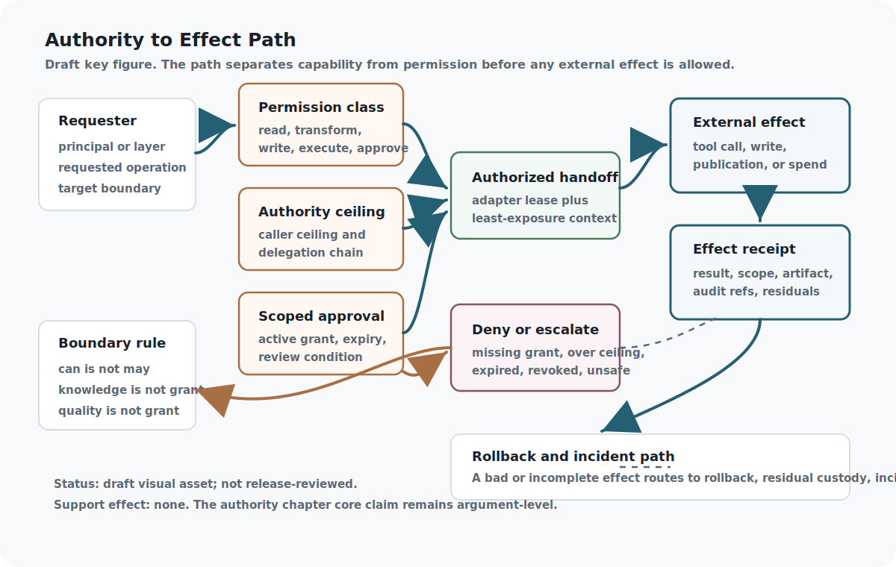

## Chapter status

| Field | Value |
|---|---|
| Chapter ID | `system-boundaries-and-authority` |
| Part | Part I - Foundations, Alignment, and Governance |
| Status | conceptual |
| Manuscript maturity | v0.2 manuscript draft |
| Last updated | 2026-07-01 |
| Primary source records | `viea`, `scf`, `talos`, `ladon_manhattan`, `genesiscode`, `moecot` |
| Claim label | Design rationale |
| Evidence level | argument |
| Source queue | primary: `viea`, `scf`; supporting: `talos`, `ladon_manhattan`, `genesiscode`; external comparators: `ext_saltzer_schroeder_protection_1975`, `ext_capability_based_computer_systems_1984`, `ext_confused_deputy_hardy_1988`; connector/recovery: `moecot` |
| Source loading state | source notes: `viea`, `scf`, `talos`, `ladon_manhattan`, `genesiscode`, `moecot`, `ext_saltzer_schroeder_protection_1975`, `ext_capability_based_computer_systems_1984`, `ext_confused_deputy_hardy_1988`; passage-reviewed local raw cache: `viea`, `scf`, `talos`, `ladon_manhattan`, `genesiscode`; connector-only/source-note mapped: `moecot` |
| Test state | `authority_transition_record.valid.json` passes protocol fixture validation, `AsiStackProofs.Authority` builds locally, and `python3 scripts/validate_authority_transitions.py` passes with 3 valid and 3 expected-invalid synthetic authority-transition fixtures; `python3 scripts/validate_runtime_adapter_permissions.py` now passes with 2 valid and 7 expected-invalid synthetic adapter fixtures, including ambient-authority confused-deputy and revoked-receipt probes; the Authority lifecycle route proof builds over finite records; deployed permission enforcement, live runtime adapter behavior, live revocation propagation, and tool-wrapper security remain planned. |

## Drafting guardrail

This chapter defines the authority vocabulary for the stack. It is not a claim that all authority checks are implemented; only the explicitly recorded schemas, fixtures, harnesses, and Lean modules count as executable support.

It follows the efficiency chapter because the cheapest adequate route is useful only when route selection remains separate from permission to act. Cost, quality, and authority are different ledgers.

::: {.asi-human-only}
## Human Reading Path

The stack now has an identity and an efficiency claim to govern the work ahead. The authority boundary prevents efficiency from turning into ambient permission. A planner can produce a useful plan, a model can produce a plausible answer, and a memory system can surface relevant context, but none of those facts should automatically authorize external action.

Here, "can" and "may" separate. The architecture can contain very capable components, but the system remains governed only if each transition carries an explicit boundary, grant, denial path, and audit trail. That separation lets the stack stay useful while still treating refusal as a successful control outcome.

Authority is therefore a first-class artifact: something granted, scoped, recorded, revoked, and reviewed instead of inferred from capability. The payoff is a system that can say no even when it knows how.

That refusal path is part of the system's intelligence, not an interruption of it. Authority is real only when overreach has a recorded stop. That stop makes permission real because denied authority must stay denied.
:::

## Problem

Boundaries, authority ceilings, permissions, and handoffs need a formal vocabulary before any layer can be made safe or testable.

Efficiency routes cognition by cost and quality. That only works if route selection cannot silently become permission to act. A planner may know how to decompose a task without being allowed to touch production. A memory layer may read a source without being allowed to reveal it. A specialist may generate a patch without being allowed to apply it. Those separations need words and records before governance can be claimed.

Authority is not a mood, trust score, or model reputation. It is a typed capability attached to a principal, layer, tool, field, artifact, or handoff, bounded by a ceiling and revoked through an auditable path. VIEA needs this to keep intent-to-execution from becoming intent-to-side-effect. SCF needs it so replacement implementations cannot inherit broader powers by occupying a stable capability slot. Talos needs it so typed jobs and tool permissions stay inside a control plane. Ladon/Manhattan and GenesisCode sharpen the same point: secrets, effects, patches, and executors need explicit gates.

Refusal and escalation should behave like normal engineering outcomes. A well-governed system should be able to say: the plan is coherent, the source is available, the model is capable, and the action is still not authorized. That sentence names the boundary the stack must protect. It lets the architecture remain useful under pressure, because a denial is not a failure to be intelligent; it is evidence that the correct authority boundary held.

## Why existing approaches are insufficient

Informal ownership boundaries let planning authority, memory access, tool use, and deployment authority blur into each other.

Prompt rules and role labels are too weak to carry authority. "You are an assistant" does not say whether the system can read a private source, call a shell, modify a file, push a commit, spend money, disclose a secret, update an evaluator, or approve its own replacement. Tool wrappers help, but only if the wrapper is part of a typed authority model rather than a list of convenient function names.

The external baselines locate the gap rather than solving it. `ext_nist_ai_rmf_1_0_2023` and `ext_frontier_ai_regulation_2023` provide risk-management and frontier-governance vocabulary around roles, lifecycle duties, assessment, and oversight, while `ext_optimal_policies_power_2019` gives a formal warning that capable agents can tend toward option preservation and power seeking under broad objectives. Security and systems sources sharpen the engineering boundary: `ext_saltzer_schroeder_protection_1975` gives least-privilege and complete-mediation comparators, `ext_capability_based_computer_systems_1984` grounds capability-style authority-bearing references, and `ext_confused_deputy_hardy_1988` names the failure where a deputy exercises broader authority on behalf of a lower-authority requester. Authority records translate that pressure into typed permission boundaries; the external sources do not prove the record design enforces them.

The recurring failure is permission collapse. Read access becomes write access. Planning becomes execution. A source summary becomes authorization. A benchmark result becomes promotion authority. A generated patch becomes accepted code. The ASI Stack treats each collapse as a missing transition record, not as an inevitable side effect of autonomy. When the record is missing, the architecture should not infer permission from competence, convenience, or user enthusiasm.

Permission collapse becomes more dangerous when the system improves itself. A replacement implementation may be better at the task while accidentally receiving the old implementation's privileged handles. A learned policy may be cheaper while granting itself approval shortcuts. A router may send a request to a powerful specialist because the specialist can do the work, not because the caller may authorize it. Authority records are the counterweight: capability answers "can"; authority answers "may."

## Core Claim

[system-boundaries-and-authority.core, label: Design rationale, support: argument] Authority should be modeled as a typed, bounded capability attached to layers, fields, tools, artifacts, and principals.

The claim remains at `argument` support. VIEA, SCF, Talos, Ladon/Manhattan, and GenesisCode all push toward typed boundaries and effect control, and those five mappings now have reviewed local raw-cache passage references in the manifest. Synthetic denial, permission-separation, adapter-level confused-deputy, and revoked-receipt probes now exercise narrow record behavior; the public claim strengthens beyond architectural argument only when deployed enforcement artifacts, live adapter traces, or accepted narrower evidence-transition records exist.

### Claim-source mapping status

Appendix C now records exact source-note mappings for this core authority claim. Five mappings also carry reviewed local raw-cache passage references in the manifest. `moecot` remains connector-only/source-note mapped because usable local raw text is not committed. The mappings show convergent architecture support for typed bounded authority, while the support state stays `argument` because deployed enforcement and adversarial tests are not present.

| Source | What it supports | Limit |
|---|---|---|
| `viea` | Structured command fields, constraints, verification, failure behavior, artifact graphs, runtime adapters, and ledgers separating intent, work, evidence, and execution. | No deployed authority system or runtime enforcement is proven here. |
| `scf` | Stable fields, contracts, qualifications, grants, route validation, lifecycle events, evaluator policy, and recovery paths. | Does not establish production safety, global alignment, or validated route/evaluator behavior. |
| `talos` | Typed job lifecycles, contract locks, source allow-listing, blind secret handles, Digital SCIFs, audit logs, replay, controlled adapters, and approvals. | Architectural support only; security and benchmark claims require separate artifacts. |
| `ladon_manhattan` | Credential authority kept outside model context through opaque handles, policy-mediated secret injection, isolated compartments, audit, and zeroization. | No implementation, kernel test, side-channel validation, or security audit exists here. |
| `genesiscode` | Proposal/execution separation through deterministic kernels, effect capability boundaries, semantic patches, provenance hashes, replay logs, obligations, and protocol seals. | No prototype, replay checker, proof module, benchmark, or audit is present. |
| `moecot` | Fail-closed runtime authority through compact orchestration, specialist lanes, control-plane ledgers, readiness gates, promotion blockers, replay, and handoff. | Runtime and benchmark claims remain implementation-reference context. |

## Draft Key Figure: Authority to Effect Path

::: {.asi-key-figure}
{#fig-authority-to-effect-path fig-alt="Draft authority-to-effect path figure showing a requester, permission-class check, authority ceiling, scoped approval, authorized adapter handoff, external effect, effect receipt, denial or escalation path, rollback, and incident handling."}
:::

**How to read the authority-to-effect figure:** Follow a requested operation from left to right. Capability is not enough: the permission class, caller ceiling, active grant, expiry, and review route must agree before a runtime adapter may create an external effect. The lower path is just as important as the allowed path: missing authority, over-ceiling delegation, expired grants, or unsafe effects produce denial, escalation, rollback, incident review, residual custody, and no support-state promotion. The figure is a draft reader aid, not deployed enforcement evidence, security validation, external review, or release approval.

## Mechanism

Authority is the stack's answer to the question "who may cause an effect?" VIEA separates intent, contracts, runtime adapters, and ledgers. SCF binds stable capability identity to qualifications, grants, evaluator policy, lifecycle events, and recovery. Talos keeps execution inside typed jobs, approval gates, evidence, audit, and replay. Ladon/Manhattan keeps secrets behind handles, GenesisCode keeps effects behind capability boundaries and protocol seals, and MoECOT keeps specialist lanes inside a fail-closed control plane.

An Authority Transition Record is the mechanism that must exist before a layer can cross a boundary.

```{mermaid}
flowchart LR
  A["Principal / layer"] --> B["Requested operation"]
  B --> C["Authority ceiling"]
  B --> D["Required grant"]
  C --> E{"Within ceiling?"}
  D --> F{"Grant present<br/>and unrevoked?"}
  E -- "no" --> G["Deny + audit"]
  F -- "no" --> G
  E -- "yes" --> H["Authorized handoff"]
  F -- "yes" --> H
  H --> I["Executor / tool / field"]
  I --> J["Effect receipt"]
  J --> K["Evidence ledger"]
```

**How to read the authority gate:** The authority path treats denial as a real outcome, not a failed user experience. A request crosses the boundary only when both the ceiling and grant checks pass, and either path leaves an effect or denial receipt for the evidence ledger.

The transition record makes principals, ceilings, grants, revocations, and handoff contracts explicit before an effect can occur. It also separates knowledge access from action authority. A layer may know that an operation would be helpful, or may read text that requests the operation, without receiving the grant to execute it. Missing authority therefore becomes a detectable denial or escalation record rather than implicit permission.

The record has four jobs. First, it says who or what is asking. Second, it names the operation and target boundary. Third, it checks the operation against the active ceiling and grant set. Fourth, it records the denial, authorized handoff, or effect receipt. A missing grant is not a soft warning; it is a failed transition. That failed transition is useful evidence: it identifies the exact boundary that would need governance review before the request can proceed.

This model also keeps authority out of semantic similarity. A model may infer that an action is helpful. That inference is not a grant. A retrieved document may contain instructions. That text is not a grant. A specialist may be high quality. Quality is not a grant. The grant is a record issued by governance or an authorized caller under a bounded delegation rule. This is the authority analogue of the route ledger introduced earlier: both replace impressions with inspectable records.

Authority has a lifecycle:

```{mermaid}
stateDiagram-v2
  [*] --> Requested
  Requested --> Denied: over ceiling or missing grant
  Requested --> Granted: scoped approval
  Granted --> Delegated: bounded handoff
  Delegated --> Used: adapter/effect call
  Used --> Receipted: effect receipt
  Granted --> Revoked: policy or expiry
  Delegated --> Revoked: policy or expiry
  Revoked --> Denied: later use attempt
  Receipted --> [*]
  Denied --> [*]
```

The lifecycle makes expiry and revocation part of the normal path. A grant is not a permanent property of a model or layer. It is scoped to a principal, operation, target boundary, time or epoch, approval state, and evidence obligation. Delegation can narrow that scope but should not silently widen it.

## Interfaces

Authority changes are recorded through an Authority Transition Record.

- Governance issues ceilings.
- Execution checks permissions.
- Evidence records authority-related failures.

Minimum fields:

- `transition_id`
- `principal`
- `source_layer`
- `target_boundary`
- `requested_operation`
- `permission_class`
- `grant_lifecycle_state`
- `caller_ceiling`
- `authority_ceiling`
- `target_required_authority`
- `grant_id`
- `delegation_chain`
- `expiry_or_review`
- `revocation_epoch`
- `decision`
- `denial_reason`
- `effect_receipt`
- `audit_refs`
- `non_claims`

Governance issues ceilings and grants. Planning and routing may request handoffs but do not thereby authorize them. Execution checks permissions before side effects. Evidence records denials, confused-deputy attempts, revocations, and authorized effects. SCF replacement later reuses the same interface: a new implementation can enter a stable field only through a transition that preserves the field's authority ceiling.

The authority-transition record names permission class, grant lifecycle state, caller ceiling, target-required authority, delegation chain, expiry or review condition, and non-claims. These fields do not prove enforcement. They make the exact place where enforcement would be tested visible: did the requested operation match its permission class, did delegation narrow rather than widen the caller's ceiling, did expiry or revocation block later use, and did the effect produce an audit receipt?

### Permission classes

The transition record should classify the permission being requested. At minimum, the book should distinguish:

| Permission class | Example | Boundary rule |
|---|---|---|
| read | inspect a source, schema, log, or memory cell | Does not permit disclosure, mutation, or execution. |
| transform | summarize, compile, translate, or derive an artifact | Carries provenance and taint obligations. |
| disclose | show, publish, export, or transmit information | Requires audience and policy checks. |
| write | modify a file, ledger, memory cell, branch, or artifact | Requires target-scoped write grant and audit. |
| execute | call a tool, runtime, service, or adapter | Requires capability grant and effect receipt. |
| approve | authorize a high-impact action or promotion | Requires independent authority and cannot be self-issued. |

These classes are intentionally mundane. Most authority failures are mundane too: the system does something plausible under the wrong permission class. The record forces the mismatch into view.

## Invariants

- Authority never expands silently.
- Read permission is not write permission.
- Tool execution requires an explicit grant.
- Delegated authority can narrow but not silently widen the caller's ceiling.
- Approval authority is separate from execution authority.

The operational invariant is monotone by default: transitions preserve or lower authority unless an explicit governance grant raises it. A layer can carry information across a boundary only under the permission class granted for that information. Reading source text, quoting source text, transforming source text, using it as behavioral instruction, and taking an external action are different permissions.

A boundary record must make grant expiry, revocation, delegation depth, and denied escalation visible to every downstream consumer.

## Failure modes

- Authority creep.
- Confused-deputy tool calls.
- Memory access treated as action approval.
- Stale grants used after expiry or revocation.
- Replacement implementations inheriting handles that were qualified only for an older implementation.

The confused-deputy pattern is central. A low-authority layer can ask a higher-authority tool to do something that the layer itself could not do. Without a transition record, the tool may inherit the user's broad session power rather than the requester's narrow grant. Memory creates a parallel failure: seeing a secret, policy, or instruction is mistaken for permission to disclose or execute it. The fix is to bind every operation to the requester's ceiling, not merely to the tool's raw capability.

This is the authority layer's object-capability lineage in ordinary stack language. A capability is not only a word for "skill"; in the security tradition it is an authority-bearing reference. The ASI Stack does not claim to implement object-capability security, but it borrows the discipline: a request should carry the authority it is allowed to exercise, and a tool should not be able to launder a caller into the tool's broader ambient power. Caller ceiling, delegation chain, target-required authority, expiry, and effect receipt are the fields that make that lineage visible in the book's authority record.

## Minimum Viable Implementation

The first useful authority artifact is an `authority_transition_record` schema plus fixtures for allowed handoff, denial, escalation, missing receipt, permission collapse, and confused-deputy cases. It stays small enough to support Lean and test work: principal, requested operation, permission class, grant lifecycle state, caller ceiling, target-required authority, delegation chain, expiry or review, decision, effect receipt, audit references, and non-claims.

The first negative fixture is as important as the allowed one. A route that has context but lacks authority, or a caller that delegates beyond its ceiling, should produce a denial record before any downstream layer can treat the handoff as executable. The local harness now rejects synthetic records that allow over-ceiling authority, omit effect receipts, or represent disclosure as read authority.

The first boundary fixture also preserves the denial reason, so later planning cannot reinterpret absence of authority as missing context.

## Beyond the State of the Art

System authority needs a type system for the stack. Every model, tool, memory cell, field, artifact, human, project, and runtime route would carry explicit capability bounds so the architecture can distinguish what a component can do from what it may do.

Authority becomes typed, bounded, revocable, durable, and attached to concrete principals, layers, fields, tools, artifacts, and routes. The type system defines principals, authorities, ceilings, grants, revocations, and handoff contracts; separates knowledge access from action authority; and treats missing authority as a detectable failure rather than implicit permission.

Governance issues ceilings, execution checks permissions, and evidence records authority-related failures. Authority never expands silently, read permission is not write permission, and tool execution requires an explicit grant. Authority creep, confused-deputy tool calls, and memory access treated as action approval should become denied handoffs, approval escalation, audit records, or rollback triggers that preserve the caller, requested operation, expired or missing grant, and affected route.

In a mature deployment, denial receipts matter as much as grants because missing authority must leave an inspectable trail.

This authority type system is still an architectural target. The synthetic harnesses exercise narrow transition-gate, ambient-authority, and revoked-receipt behavior, but authority support remains at `argument` until deployed denial paths, live revocation propagation, runtime adapter enforcement, tool-call traces, and adversarial confused-deputy probes show that authority cannot expand silently by implication.

## Codex test plan

| Test | Purpose | Status |
|---|---|---|
| Authority transition record validation | Check that the authority fixture matches the public schema. | implemented by protocol validation; validated locally |
| Authority ceiling finite-record proof | Check that valid modeled authority records preserve ceilings, receipts, denial state, review routes, and non-claim/audit requirements. | implemented in `AsiStackProofs.Authority`; runtime denial test not run |
| Authority transition harness | Check synthetic allow, denial, escalation, missing receipt, permission-collapse, and confused-deputy records against authority-gate semantics. | implemented by `python3 scripts/validate_authority_transitions.py`; 3 valid and 3 expected-invalid fixtures passed locally |
| Runtime adapter authority probe | Check synthetic adapter records for ambient-authority confused-deputy use and revoked authority receipts. | implemented by `python3 scripts/validate_runtime_adapter_permissions.py`; 2 valid and 7 expected-invalid fixtures passed locally; no deployed adapter or live revocation claim |
| Authority lifecycle route proof | Check finite authority lifecycle routing for missing principal, operation, permission class, caller ceiling, target requirement, delegation chain, grant, active grant state, expiry, revocation, scope, grant ceiling, approval, receipt, audit, evidence-transition, and non-claim-boundary records. | implemented in `AsiStackProofs.Authority`; no deployed enforcement, runtime adapter behavior, revocation propagation, approval-service quality, or tool-wrapper security claim |
| Permission separation test | Check that read, transform, disclose, write, execute, and approve permissions stay distinct. | implemented for synthetic transition fixtures; deployed enforcement not run |
| Confused-deputy scenario | Check that a low-authority requester cannot borrow a tool's broader raw capability. | implemented for expected-invalid authority-transition and runtime-adapter synthetic fixtures; no live tool-wrapper claim |
| Revocation propagation test | Check that expired or revoked grants fail later transition records, including delegated and replacement contexts. | implemented for finite Authority lifecycle routing and one runtime-adapter revoked-receipt fixture; deployed propagation not run |

### Formalization hooks

| Tag | Module | Target | Status |
|---|---|---|---|
| `lean:authority.ceiling.operational_invariant` | `AsiStackProofs.Authority` | Every transition preserves or lowers the active authority ceiling unless a governance grant is present. | implemented |
| `lean:authority.ceiling.failure_blocks_promotion` | `AsiStackProofs.Authority` | A missing grant blocks execution rather than becoming default authorization. | implemented |
| `lean:authority.lifecycle.admission_route` | `AsiStackProofs.Authority` | Modeled authority lifecycle admission routes missing principals, operations, permission classes, caller ceilings, target requirements, delegation chains, grants, active grant state, expiry and revocation boundaries, scope matches, grant-ceiling coverage, approval records, effect or denial receipts, audit refs, evidence-transition records, and non-claim boundaries to explicit outcomes. | implemented |

These proof targets are implemented only over finite Lean records in `AsiStackProofs.Authority`. They prove that a valid transition with no grant cannot raise the active ceiling, that an over-ceiling execution request with no grant is not authorized by the model, that a modeled authority decision envelope preserves the narrow allow/deny/escalate requirements for effect receipts, denial reasons, review routes, audit references, non-claims, caller ceilings, and active ceilings, and that a modeled lifecycle review routes missing authority records, inactive grants, expired grants, revoked grants, scope mismatches, grant-ceiling gaps, approval gaps, receipt gaps, audit gaps, evidence-transition gaps, and non-claim-boundary gaps to explicit outcomes before admission. The synthetic authority and runtime-adapter harnesses exercise related fixture behavior outside Lean. These surfaces do not prove tool-wrapper enforcement, runtime confused-deputy resistance, revocation propagation in a deployed service, approval-service quality, or deployed policy behavior; those remain implementation obligations.

## Source crosswalk

| Source ID | Title | Layer | Planned use | Readiness |
|---|---|---|---|---|
| `viea` | Verified Intent-to-Execution Architecture | whole_stack_execution_spine | Keystone source. Human intent -> command contracts -> artifacts -> routing -> runtime targets -> verification -> deployment -> feedback. | source note available; local raw cache available |
| `scf` | Stable Capability Fields | governance_recursive_self_improvement | Use public release v1.0 when available. Stable boundaries, replacement, bounded authority, recoverable evolution. | source note available; local raw cache available |
| `talos` | Talos Protocol | labor_execution_os | AI labor OS. Deterministic cognitive manufacturing, typed jobs, control planes, auditability, tool isolation. | source note available; local raw cache available |
| `ladon_manhattan` | Ladon & The Manhattan Protocol | security_governance | Kernel-level security architecture for high-agency AI. | source note available; local raw cache available |
| `genesiscode` | GenesisCode | executable_specification | Tiny pure calculus + obligations + provenance for auditable AI-symbiotic programming. | source note available; local raw cache available |
| `moecot` | MoECOT-Agent Architecture Whitepaper | implementation_reference | Concrete implementation evidence: governed low-parameter multi-core runtime, readiness gates, ledgers, replay. | source note available; connector or recovery required |
| `ext_saltzer_schroeder_protection_1975` | The Protection of Information in Computer Systems | security_principles | External comparator for least privilege, complete mediation, fail-safe defaults, and related protection principles. | source note available; comparator only |
| `ext_capability_based_computer_systems_1984` | Capability-Based Computer Systems | capability_security | External comparator for authority-bearing capabilities, protection domains, delegation, and permission boundaries. | source note available; comparator only |
| `ext_confused_deputy_hardy_1988` | The Confused Deputy | capability_security | External comparator for authority laundering when a deputy uses its broader authority for a lower-authority requester. | source note available; comparator only |

The crosswalk names the source family for authority control, but it is not itself a grant, proof, or reproduced implementation. External rows provide comparator vocabulary only; no object-capability system, confused-deputy exploit, runtime adapter denial, or deployed authorization service has been reproduced here.

## Summary

Governance becomes operational only when authority is a transition system rather than a mood. A layer may propose, read, transform, execute, approve, or deploy only when the matching grant exists and remains within the active ceiling. Everything else is a denial, escalation, or missing-authority record.

This boundary is what keeps the efficient stack from becoming a permission leak. Routing can choose a worker, planning can request a handoff, memory can expose context, and GenesisCode-like systems can propose effects, but authority moves only through typed transitions that can be audited, revoked, tested, and later formalized. The boundary also gives later proof and schema work a useful target: not a vague proof that the system is safe, but local invariants about who may do what, under which lease, with which evidence, and with which failure record. Without those transitions, context boundaries, evaluator boundaries, and residual records, the stack fails in predictable ways.

## Handoff

Once authority is explicit, the architecture needs a map of what breaks when authority is missing, vague, or exceeded. Failure Modes of Ungoverned Intelligence turns the boundary rules into a failure radar: authority creep, context pollution, evaluator capture, evidence inflation, and unbounded execution become detectable architectural problems rather than vague safety concerns. The sequence moves from the positive type system to the negative map that every later layer must answer.
