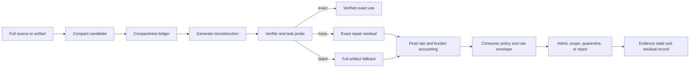

# Consolidation Destination Draft: Compact Generative Systems, Generate, Verify, Repair, and Residual Honesty

Last updated: 2026-06-29

Status: review-ready draft; human/external review not completed.

This is the first destination-chapter draft for the non-pilot compression
consolidation package. It is a review artifact only. It does not edit `book_structure.json`,
delete a chapter, change a URL, rewrite a rendered chapter, change source
mappings, change proof targets, change support states, authorize a merge, or
approve a reader artifact.

Destination continuity ID: `compact-generative-systems-and-residual-honesty`

Proposed displayed title: **Compact Generative Systems: Generate, Verify, Repair, and Residual Honesty**

Source chapters:

- `compact-generative-systems-and-residual-honesty`
- `generate-verify-repair-compression`
- `rankfold-neuralfold-and-artifact-compression`

Related fold-review chapter not merged by this draft:

- `semantic-representation-and-tree-structured-models`

## Review Purpose

The dry-run package proved that the source, proof, reader, and claim boundaries
can be reconciled in principle. This draft tests the harder question: whether
the destination reads as one chapter with one skeleton rather than three
compression chapters pasted together.

Reviewers should judge whether the combined chapter improves reader flow,
preserves the technical artifacts owned by the source chapters, and keeps the
support boundary sober. This draft is not evidence that the merge is correct.
It is the object to review before deciding whether to execute, revise, defer,
or reject the manifest merge.

## Non-Actions

- No manifest edit has been made.
- No source chapter has been deleted, retired, or redirected.
- No source note, external source, proof target, test result, or support state
  has changed.
- No chapter core claim is promoted above `argument`.
- No external comparator is treated as reproducing or validating ASI Stack
  compression, model-quality, runtime, memory, speed, or deployment behavior.
- No reader, EPUB, DOCX, PDF, audio, DOI, archive, or release artifact is
  approved by this draft.

## Preservation Ledger

| Surface | Preservation decision |
|---|---|
| Stable ID | Keep `compact-generative-systems-and-residual-honesty` if a future merge proceeds. |
| Folded source chapter | Treat `generate-verify-repair-compression` as preserved subclaims, sections, proof hooks, fixtures, and history, not silent deletion. |
| Conditional source chapter | Fold `rankfold-neuralfold-and-artifact-compression` only if review finds the destination preserves its concrete technique identity. Otherwise keep it standalone. |
| Excluded fold-review chapter | Keep `semantic-representation-and-tree-structured-models` standalone until a separate representation fold disposition exists. |
| Proposed merged core claim | Compact generative systems should store the smallest useful governed generator plus the cheapest exact or scoped residual, while preserving verification, fallback, consumer policy, and residual-burden records. |
| Claim label and support | `Design rationale` plus `argument`; no support-state change. |
| Corben/local source union | `cgs`, `rgs`, `bugbrain`, `simulation_scaling`, `rmi`, `project_theseus_whitepaper`, `bbvca_v9`, `bbvca_main`, `rankfold_neuralfold`, `rankfold_compressor`. |
| External comparator union | `ext_deep_compression_2015`, `ext_dreamcoder_2020`, `ext_information_bottleneck_2000`, `ext_knowledge_distillation_2015`, `ext_mdl_tutorial_2004`, `ext_codebleu_2020`, `ext_gptq_2022`, `ext_lora_2021`, `ext_qlora_2023`. |
| Lean modules | Preserve `AsiStackProofs.CompactGenerativeSystems`, `AsiStackProofs.GenerateVerifyRepair`, and `AsiStackProofs.ArtifactCompression`. |
| Lean proof tags | Preserve `lean:compression.cgs.operational_invariant`, `lean:compression.cgs.failure_blocks_promotion`, `lean:compression.gvr.operational_invariant`, `lean:compression.gvr.failure_blocks_promotion`, `lean:compression.artifacts.operational_invariant`, and `lean:compression.artifacts.failure_blocks_promotion`. |
| Fixture families | Preserve `compact_generative_record.valid.json`, `compression_receipt.valid.json`, and `compressed_artifact_record.valid.json`. |
| Handoff if merged | The destination should hand off directly to `fast-generation-architectures`; semantic representation and resource economics remain explicit side handoffs inside the mechanism. |

## Destination Chapter Draft

The draft below is intentionally written as one chapter skeleton. It collapses
the repeated status, problem, mechanism, test, and handoff cadence while
preserving the distinct compact-generator, generate/verify/repair, and
artifact-compression mechanisms.

### Chapter status

This proposed destination chapter would remain conceptual. Its core claim
would remain `Design rationale` with `argument` support. Existing source notes,
schema fixtures, and finite-record Lean theorems make the compression boundary
more inspectable, but they do not prove a deployed compression system, a
lossless codec, model-quality preservation, memory reduction, speedup,
artifact-utility preservation, or downstream runtime advantage.

The merge would combine three current record families:

- compact generative records, which ask whether a compact seed, rule system,
  generator, verifier, fallback, burden ledger, and residual channel make a
  representation honest enough to use;
- compression receipts, which ask whether generated reconstruction, bounded
  verification, exact repair, proxy-rate accounting, final-rate accounting,
  fallback, and consumer policy justify an exactness or usefulness claim;
- compressed artifact records, which ask whether a smaller artifact passes the
  task-specific probe, access-pattern gate, residual-coding requirement, and
  fallback policy before it can replace the full artifact for a scoped use.

All three record families would remain visible in the chapter's implementation
horizon, test plan, source crosswalk, and formalization hooks.

### Drafting guardrail

Compression is not evidence by itself. A small seed, a compressed tensor, a
short explanation, or a generated reconstruction can be useful, but none of
them becomes a stronger evidence object until the stack records what was
discarded, what was regenerated, what was verified, what was repaired, what
fallback remains available, what consumer is allowed to use the representation,
and what residual burden still exists.

The destination chapter should not ask readers to accept that compression has
been achieved. It should ask a narrower systems question: what records must a
governed stack maintain before it is allowed to treat a smaller representation
as useful, exact, lossy, task-scoped, or inadmissible?

### Human Reading Path

A smaller representation is attractive because it promises leverage. A few
rules can stand in for a table. A generator can rebuild a structure. A low-rank
form can stand in for a larger artifact. A compact model can answer faster or
run closer to the edge.

The danger is that the missing work does not disappear. It moves. It can move
into verification, repair, fallback, reviewer burden, metadata, interface
cost, lost edge cases, or a human's need to reconstruct what the compact object
failed to say.

This chapter is about making that movement visible. The ASI Stack can use
compact generators, generate/verify/repair receipts, and compressed artifacts
only when the burden ledger remains honest. A smaller object earns authority
for a use case by carrying its residuals, not by hiding them.

### Problem

Compact generators, exact repair receipts, and compressed artifacts need one
claim-accounting surface so useful compression does not hide residual burden.

The previous chapters route work through readiness gates and specialist cores.
Those routing decisions immediately create representation questions: should
the stack use the full artifact, a summary, a compressed tensor, a generated
candidate, a local core, a procedural memory, or a cheap preview? Each choice
can save resources. Each choice can also smuggle unmeasured burden into later
verification, human review, fallback, or downstream failures.

The compression layer owns that boundary. It does not merely ask whether a
representation is smaller. It asks what kind of smaller object it is, what it
can reconstruct, what it cannot reconstruct, how the residual is represented,
what verifier checked the claim, what consumer may rely on it, and what
fallback is still reachable when the compact form fails.

### Why existing approaches are insufficient

Seed-size, compression-ratio, and generated-reconstruction claims can hide
verification, repair, fallback, downstream utility, metadata, interface,
governance, and human-review costs.

A raw ratio can be true but irrelevant. A compact artifact might save storage
while damaging the rare cases that matter. A generated reconstruction might
look plausible while failing exact replay. A proxy rate during search might
look impressive until final serialization, repair residuals, and interface
costs erase the saving. A low-rank or quantized representation can be useful
for one task while becoming unsafe for audit, proof, benchmark, or exact
source preservation.

External comparators help position the chapter but do not prove it. Deep
Compression, distillation, GPTQ, QLoRA, LoRA, information bottleneck, MDL,
DreamCoder, and CodeBLEU provide vocabulary for pruning, quantization,
low-rank adaptation, learned abstractions, relevance-preserving compression,
description length, reusable programs, and artifact-quality metrics. The ASI
Stack destination chapter is not claiming those results are reproduced here.
It uses them as comparators while asking a governance question: what has to be
recorded before a compressed or generated representation can carry authority
inside a self-improving system?

### Core Claim

Compact generative systems should store the smallest useful governed generator
plus the cheapest exact or scoped residual, while preserving verification,
fallback, consumer policy, and residual-burden records.

Support boundary: this would remain an `argument` support claim. The source
corpus supports the architecture vocabulary and drafting lineage. The current
fixtures and Lean modules show that the repository can express small record
invariants and rejection cases. They do not show that a codec works, that an
artifact compressor preserves utility, that a generated reconstruction is
efficient, or that a deployed system can rely on these mechanisms.

The folded source claim from `generate-verify-repair-compression` should become
a preserved subclaim: exactness requires generated reconstruction plus
verified repair residual and fallback accounting. The folded source claim from
`rankfold-neuralfold-and-artifact-compression` should become either a
preserved implementation subclaim or remain a standalone chapter if review
finds that RankFold/NeuralFold still owns a distinct technique boundary.

### Mechanism

The destination mechanism has three lanes.

The first lane is the compactness ledger. It records the seed, rule system,
memory state, generator or decoder, verifier, verifier independence,
generation status, correction mechanism, residual channel, fallback path,
authority boundary, use envelope, burden ledger, evidence ledger, and
promotion blockers. It answers the question: what work did compactness move,
and who pays that cost?

The second lane is the generate/verify/repair receipt. It treats compression
as a transaction with candidate, verified-exact, verified-lossy,
repaired-exact, literal-fallback, and quarantined states. It separates
proxy-rate estimates from final serialized costs. It also separates generated
regions from exact repair residuals, so approximate generation cannot
masquerade as lossless compression.

The third lane is artifact admission. It treats compressed artifacts as
routed candidates rather than replacements for the full artifact. A compressed
artifact must name its task family, access pattern, admission state,
reconstruction contract, declared use envelope, codec parameters, metadata
costs, residual coding, probe plan, fallback trigger, decode determinism,
exact-replay status, consumer policy, utility tests, evidence refs, and
non-claims.

The important movement is from "smaller" to "authorized for a scoped use." A
compact representation can be preview-only, cold-archive-only, routing-only,
task-probe-passed, exact-replay-ready, fallback-dominant, or quarantined. The
chapter should not let one passing property promote the others.

### Interfaces

The destination chapter would sit at the intersection of routing, memory,
evidence, artifacts, and resource economics.

Routing uses compression records to decide whether a specialist core, compact
artifact, full artifact, or fallback should handle a task. The route must see
the declared use envelope and admission state, not just the ratio.

The Virtual Context ABI uses compact records when summaries, semantic pages,
or context cells are mounted. A mounted summary must carry its loss contract
and residual path so downstream readers know what it cannot support.

Artifact graphs store both compressed and full references. Replay logs should
make it clear when an accepted output came from a compressed form, a generated
repair, or an exact full source.

Evidence states prevent compression claims from becoming support-state claims.
A source-noted external paper can position the idea, a fixture can validate a
record shape, and a Lean theorem can check a finite invariant. None of those
alone proves utility, exactness, or deployment readiness.

Resource economics counts the total burden: seed, metadata, search,
verification, repair, fallback, memory pressure, interface cost, human review,
and downstream error. A smaller representation that makes those costs worse is
not a win.

Fast generation inherits accepted-output and verifier-cost accounting. A
speculative or draft generator can be fast only after accepted output, verifier
cost, fallback, and repair are counted separately from proposed output.

### Invariants

- Exactness claims require verification and repair accounting.
- Lossy claims must be labeled.
- Repair cost is counted before compression savings are claimed.
- Search bounds are explicit.
- Proxy rates do not survive as final rates unless serialization, metadata,
  repair, interface, and fallback costs are counted.
- Compressed artifacts require task probes or fallback.
- Consumer policy scopes use; preview, routing, proof, audit, benchmark,
  training, and exact replay cannot borrow each other's authority.
- Unresolved obligations remain residuals.
- The full artifact remains reachable unless exact replay or an explicit
  archival policy says otherwise.
- No compression record can promote a chapter claim without a separate
  evidence-transition record.

### Failure modes

Ratio laundering happens when a real size reduction is presented as evidence
of preserved utility, exactness, or deployment value.

Exactness theater happens when generated output looks correct but the verifier
is weak, skipped, or scoped to the wrong contract.

Repair hiding happens when the exact residual, metadata, or interface cost is
stored somewhere outside the receipt.

Proxy-rate drift happens when search-time or prototype compression numbers
remain in prose after final serialization erases the saving.

Probe overfitting happens when a compressed artifact passes a narrow probe and
is then used for audit, proof, benchmark, citation, or high-risk planning.

Fallback dishonesty happens when fallback is named but too slow, expensive,
missing, or operationally unavailable for the declared use.

Reviewer displacement happens when a machine compression claim moves the hard
work into human inspection while still narrating the system as efficient.

Evidence substitution happens when a compressed preview is cited as if it were
the preserved source artifact.

### Minimum Viable Implementation

The smallest honest implementation is not a universal compressor. It is a
three-record fixture and validation slice:

- one compact generative record that declares seed, generator, verifier,
  residual channel, fallback, burden ledger, use envelope, and non-claims;
- one compression receipt that declares reconstruction contract, generated
  regions, verification result, exact repair residual, proxy/final-rate status,
  fallback threshold, consumer policy, and non-claims;
- one compressed artifact record that declares task family, access pattern,
  admission state, ratio, metadata costs, residual coding, probe plan,
  fallback trigger, exact-replay status, consumer policy, utility fields, and
  non-claims.

The MVI should include at least four negative cases:

- a lossy representation that cannot be marked exact;
- a failed verification that blocks exactness promotion;
- a task probe that routes to fallback;
- a consumer-policy violation that blocks reuse of a preview or lossy artifact
  for exact, audit, proof, benchmark, or training use.

This MVI can justify better record discipline. It cannot justify compression
performance, model-quality preservation, or deployment claims.

### Beyond the State of the Art

The mature endpoint is a compression control plane. In that end state,
generators, exact repairs, residuals, compressed artifacts, semantic previews,
consumer policies, utility probes, exact replay, fallback, and governance
review participate in one audited representation market.

Each task asks for the cheapest representation that is lawful for that task.
The answer may be the full source, a verified exact reconstruction, a repaired
exact representation, a lossy preview, a low-rank artifact, a semantic page, a
specialist core, or a rejection. The decision is not based on ratio alone. It
is based on total burden, verifier quality, residual honesty, consumer policy,
replay need, and downstream risk.

This endpoint remains speculative architecture until public evidence exists:
codec correctness, artifact utility probes, reproduced external baselines,
negative controls, replay records, and accepted evidence-transition records.

### Codex test plan

The merged test plan should preserve all existing planned tests:

- S/R/Q/G/V/E loop consistency test;
- residual burden behavior test;
- downstream utility test;
- fallback behavior test;
- reconstruction quality test;
- repair-cost accounting test;
- bounded-search failure test;
- consumer-policy enforcement test;
- compression ratio test;
- probe-route fallback test;
- downstream utility preservation test;
- access-pattern admission test.

The current repository state supports record-shape validation and finite Lean
predicates only. The destination chapter should say that plainly.

### Formalization hooks

The destination chapter should keep all three formal lanes:

- `AsiStackProofs.CompactGenerativeSystems` for residual obligations and
  blocked exactness over compact records;
- `AsiStackProofs.GenerateVerifyRepair` for exact reconstruction and failed
  verification over compression receipts;
- `AsiStackProofs.ArtifactCompression` for task-probe fallback and residual or
  fallback metadata over compressed artifact records.

The merged chapter can import multiple proof modules. A table-of-contents
merge is not a theorem merge.

### Source crosswalk

The Corben/local source crosswalk should be organized by lane:

- compact-generator lineage: `cgs`, `rgs`, `bugbrain`,
  `simulation_scaling`, `rmi`, and `project_theseus_whitepaper`;
- generate/verify/repair lineage: `bbvca_v9`, `bbvca_main`, `cgs`, and
  `rankfold_neuralfold`;
- artifact-compression lineage: `rankfold_neuralfold`,
  `rankfold_compressor`, `bbvca_v9`, `cgs`, and `bugbrain`.

The external-source crosswalk should stay comparator-only:

- compression and model-compression comparators:
  `ext_deep_compression_2015`, `ext_knowledge_distillation_2015`,
  `ext_gptq_2022`, `ext_qlora_2023`, and `ext_lora_2021`;
- abstraction and representation comparators: `ext_dreamcoder_2020`,
  `ext_information_bottleneck_2000`, and `ext_mdl_tutorial_2004`;
- artifact-quality comparator: `ext_codebleu_2020`.

No listed external source is local reproduction evidence.

### Summary

The merged destination chapter would make compression a governance problem,
not a ratio story. Compact generation, generated reconstruction, exact repair,
and artifact compression all become different ways of asking whether a smaller
object can be trusted for a scoped use.

The answer is yes only when the receipt carries the missing work: verifier,
repair, fallback, burden ledger, consumer policy, and residuals. When those
records are missing, the correct result is not a bolder compression claim. It
is quarantine, fallback, or an explicit residual.

### Handoff

If this merge proceeds, the destination should hand off directly to
`fast-generation-architectures`. Fast generation inherits the same discipline:
proposed output is not accepted output, raw speed is not useful speed, and
verifier cost has to be counted.

The chapter should also preserve side handoffs:

- to `semantic-representation-and-tree-structured-models`, where the question
  shifts from bit-level or artifact-level reconstruction to grounding,
  hierarchy drift, and semantic utility;
- to `resource-economics-and-token-budgets`, where the total burden ledger
  becomes cost accounting;
- to `artifact-graphs-audit-logs-and-replay`, where compressed and full
  artifact references must remain replayable.

## Review Decision Surface

Reviewers should choose one of four outcomes:

| Decision | Meaning | Required follow-up |
|---|---|---|
| Execute full merge | The destination preserves CGS, GVR, and RankFold/NeuralFold better as one chapter. | Update manifest, outline, chapter prose, Appendix C, proof manifest, reader records, handoffs, URL policy, changelog, and validation records in one scoped merge. |
| Execute conservative merge | Fold only `generate-verify-repair-compression`; keep `rankfold-neuralfold-and-artifact-compression` standalone. | Update the destination to preserve GVR as a subclaim and repair handoffs while retaining RankFold as the technique chapter. |
| Revise | The one-skeleton destination is promising but loses clarity, proof routing, source mapping, or reader flow. | Revise this draft and rerun the review before any manifest edit. |
| Defer or reject | The current separate chapters remain clearer for this release or the merge loses a chapter-owning artifact. | Keep the current manifest, record the reason, and allow reader curation with an explicit duplicate-structure caveat. |

## Open Review Questions

- Does RankFold/NeuralFold still own a distinct technique, fixture family, and
  reader arc that should remain standalone?
- Does the destination chapter become too broad, or does the common compression
  ledger make the chapter deeper?
- Does excluding `semantic-representation-and-tree-structured-models` preserve
  a necessary representation-substrate boundary?
- Does the handoff to `fast-generation-architectures` remain clear after GVR
  is folded?
- Does the destination reduce repeated skeleton load while adding mechanism
  depth, negative-case clarity, external positioning, proof routing, and reader
  flow?

## Non-Claims

- This draft does not merge chapters.
- This draft does not change `book_structure.json`.
- This draft does not change Appendix C support states.
- This draft does not create source-derived, external-literature-backed,
  proof-derived, prototype-backed, synthetic-test-backed, or empirical support.
- This draft does not prove that a future merged chapter will be better.
- This draft does not approve reader, ebook, PDF, DOCX, audio, DOI, archive,
  or release artifacts.
- This draft does not validate any new compression, reconstruction, artifact,
  model-quality, speed, memory, or deployment result.
