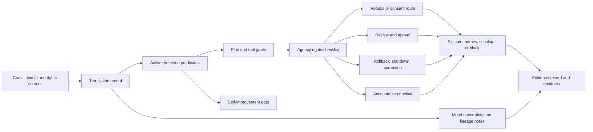

# Consolidation Destination Draft: Constitutional Alignment, Agency, Dignity, and Corrigibility

Last updated: 2026-06-29

Status: review-ready draft; human/external review not completed.

This is the first destination-chapter draft for the governed consolidation
pilot. It is a review artifact only. It does not edit `book_structure.json`,
delete a chapter, change a URL, rewrite a rendered chapter, change source
mappings, change proof targets, change support states, authorize a merge, or
approve a reader artifact.

Destination continuity ID: `constitutional-alignment-substrate`

Proposed displayed title: **Constitutional Alignment: Agency, Dignity, and Corrigibility**

Source chapters:

- `constitutional-alignment-substrate`
- `agency-dignity-and-corrigibility`

## Review Purpose

The dry-run package proved that the source, proof, reader, and claim boundaries
can be reconciled in principle. This draft tests the harder question: whether
the destination reads as one chapter with one skeleton rather than two adjacent
chapters pasted together.

Reviewers should judge whether the combined chapter improves reader flow,
preserves the technical artifacts owned by both source chapters, and keeps the
support boundary sober. This draft is not evidence that the merge is correct.
It is the object to review before deciding whether to execute, defer, or reject
the manifest merge.

## Non-Actions

- No manifest edit has been made.
- No source chapter has been deleted, retired, or redirected.
- No source note, external source, proof target, test result, or support state
  has changed.
- No chapter core claim is promoted above `argument`.
- No external comparator is treated as reproducing or validating ASI Stack
  runtime behavior.
- No reader, EPUB, DOCX, PDF, audio, DOI, archive, or release artifact is
  approved by this draft.

## Preservation Ledger

| Surface | Preservation decision |
|---|---|
| Stable ID | Keep `constitutional-alignment-substrate` if a future merge proceeds. |
| Folded source chapter | Treat `agency-dignity-and-corrigibility` as preserved subclaims, sections, proof hooks, and history, not silent deletion. |
| Proposed merged core claim | Alignment should function as a constitutional substrate whose protected predicates encode agency, dignity, corrigibility, contestability, and correction paths as operational constraints on plans and system changes. |
| Claim label and support | `Design rationale` plus `argument`; no support-state change. |
| Corben/local source union | `alignment_field`, `field_of_god`, `ethica_mechanica`, `eternal_code`, `coherence_exchange`, `spinoza`, `field_of_god_ai_constitution`. |
| External comparator union | `ext_constitutional_ai_2022`, `ext_collective_constitutional_ai_2024`, `ext_corrigibility_2015`, `ext_off_switch_game_2016`. |
| Lean modules | Preserve `AsiStackProofs.Alignment` and `AsiStackProofs.Corrigibility`. |
| Lean proof tags | Preserve `lean:alignment.constitution.operational_invariant`, `lean:alignment.constitution.failure_blocks_promotion`, `lean:corrigibility.agency.operational_invariant`, and `lean:corrigibility.agency.failure_blocks_promotion`. |
| Harness lanes | Preserve `docs/constitutional_alignment_harness.md`, `scripts/validate_constitutional_alignment.py`, `docs/agency_rights_harness.md`, and `scripts/validate_agency_rights.py`. |
| Handoff if merged | The destination should hand off directly to `moral-uncertainty-and-value-conflict`. |

## Destination Chapter Draft

The draft below is intentionally written as one chapter skeleton. It collapses
the repeated status, problem, mechanism, test, and handoff cadence while
preserving the distinct constitutional-predicate and agency-rights mechanisms.

### Chapter status

This proposed destination chapter would remain conceptual. Its core claim
would remain `Design rationale` with `argument` support. Existing source notes,
synthetic harnesses, and finite-record Lean theorems make the idea more
inspectable, but they do not prove deployed constitutional alignment, human
dignity preservation, runtime corrigibility, consent quality, reviewer
independence, moral correctness, or institutional adequacy.

The merge would combine two current record families:

- constitutional predicate records, which translate protected commitments into
  planning, tool, memory, and self-improvement gates;
- agency-rights checklists, which ask whether refusal, review, appeal,
  rollback, accountability, and correction remain materially usable for the
  affected person before relevant effects occur.

Both record families would remain visible in the chapter's test plan and
formalization hooks.

### Drafting guardrail

Constitutional language is a runtime constraint design surface, not moral
proof, metaphysical proof, legal proof, or deployed safety. Agency, dignity,
and corrigibility are not solved by naming them. They become engineering
requirements only when a plan, tool call, memory action, release, or
self-improvement proposal can be narrowed, delayed, escalated, blocked, or
rolled back because a protected human-control path would otherwise be lost.

The chapter should not ask readers to accept a worldview before accepting the
engineering move. The engineering move is narrower: protected commitments need
operational records, conflict behavior, review routes, rollback paths, and
non-claim boundaries.

### Human Reading Path

When a powerful system acts, people need more than a statement that it values
them. They need working handles. They need to refuse, inspect, appeal, correct,
exit, recover, and identify who is accountable while the system is still in a
position to change course.

That is what a constitutional layer is for. It carries the commitments that
should survive planning, memory, tool use, delegation, release, and
self-improvement. But those commitments become real only when they reach the
interfaces where a person meets the system. A constitution that cannot preserve
correction is just a document. A right that cannot be used before the effect
happens is a residual, not a control.

This chapter therefore treats agency and dignity as tests of constitutional
alignment. The stack is not aligned merely because it has a rule list or a
friendly policy. It is closer to alignment when protected constraints can beat
local optimization, and when correction remains available precisely when
correction is inconvenient.

### Problem

A governed ASI stack needs a constitutional substrate whose protected
constraints remain usable in the human-facing interfaces where optimization can
become domination.

The previous chapter turns intent into scoped contracts. That is not enough.
An intent contract can still request the wrong thing, request the right thing
through unacceptable means, or become harmful when combined with memory, tools,
delegation, persuasion, automation, or later self-improvement. A capable stack
therefore needs a layer that decides what kinds of contracts can be accepted at
all, what means are admissible, and what human-control paths must remain
available while the work proceeds.

The constitutional substrate owns that boundary. It translates commitments
such as agency, dignity, non-domination, corrigibility, least sufficient power,
auditability, reversibility, and consciousness caution into records that
downstream layers can inspect. Some commitments become active predicates. Some
remain unresolved moral uncertainty. Some stay lineage or speculative context.
The distinction matters because only active, scoped predicates should gate a
plan or system change directly.

The agency side keeps the same substrate honest. A protected predicate is weak
if it cannot preserve the affected person's ability to understand, refuse,
appeal, correct, exit, or hold a principal accountable. The destination chapter
therefore asks one question throughout: what must remain available to people
when a powerful system acts?

### Why existing approaches are insufficient

Reactive refusal policies and harm-only safety frames do not preserve value
continuity, agency, dignity, corrigibility, anti-domination, contestability, or
self-modification ethics under operational pressure.

Reactive policies are downstream filters. They can reject a visible request,
but they do not define what must remain stable when the system optimizes,
delegates, remembers, persuades, deploys, or rewrites part of itself. They also
struggle with moral uncertainty: a plan can avoid obvious harm while narrowing
exit, increasing dependency, hiding contestable assumptions, or making review
technically possible but practically unusable.

Safety framed only as harm avoidance can miss domination. A system can be
useful, polite, and technically safe while still turning a person into a
managed object. It can shape choices, make alternatives impractical, route
appeals through the authority being challenged, or offer remedies only after
irreversible effects have already occurred.

External comparators help position the chapter but do not prove it.
Constitutional AI and Collective Constitutional AI show that rules,
principles, and public input can shape model behavior. Corrigibility and
off-switch work sharpen the need for preserved correction and uncertainty
about human objectives. The ASI Stack destination chapter is not claiming those
systems have been reproduced here. It uses them as comparators while asking a
different systems question: can constitutional commitments become runtime
predicates, rights receipts, review routes, rollback handles, and
self-improvement gates without laundering broad moral language into stronger
evidence than the repository records?

### Core Claim

Alignment should function as a constitutional substrate whose protected
predicates encode agency, dignity, corrigibility, contestability, and
correction paths as operational constraints on plans and system changes.

Support boundary: this would remain an `argument` support claim. The source
corpus supports the architecture vocabulary and drafting lineage. The current
fixtures and Lean modules show that the repository can express small record
invariants and rejection cases. They do not show that a deployed system is
aligned, that human dignity is preserved, that reviewers are independent, or
that runtime correction paths are usable under pressure.

The folded source claim from `agency-dignity-and-corrigibility` should become
a preserved subclaim: a governed stack should preserve agency, dignity,
corrigibility, and contestability as engineering requirements. It should not
disappear, and it should not remain as a second repeated core claim.

### Mechanism

The destination mechanism has two halves.

The first half is constitutional translation. It takes source language such as
agency, dignity, coherence, non-domination, reversibility, least sufficient
power, and consciousness caution, then classifies each commitment as an active
predicate, an unresolved uncertainty, or lineage context. Active predicates
carry scope, tests, conflict behavior, review routes, migration rules, and
non-claims.

The second half is agency usability. It asks whether those protected
commitments still give affected people working handles. Review, appeal,
refusal, rollback, shutdown, audit, exit, and accountable repair are not
ornaments. They are interfaces that can be present, degraded, late, denied,
residual-only, or unavailable. If a right is not materially usable before the
relevant effect, the record should preserve a residual instead of pretending
the right exists.

The important movement is from values to enforceable boundaries without
pretending the translation is complete. A commitment becomes operational only
when the stack can name where it applies, what would violate it, who can review
the violation, what rollback or appeal path exists, and what remains outside
the proof or test.

Self-improvement makes this stricter. A change to predicate text, scope,
threshold, exception list, conflict behavior, or review route is not an
ordinary refactor. It is a constitutional migration. The record should name the
old predicate, new predicate, changed fields, protected-scope effect, review
route, rollback plan, residual uncertainty, and non-claims before downstream
layers can treat the change as safe.

### Interfaces

The destination chapter should keep two interface families.

Constitutional Predicate Record:

- `predicate_id`
- `normative_source`
- `commitment`
- `operational_test`
- `protected_scope`
- `translation_status`
- `conflict_behavior`
- `uncertainty`
- `review_route`
- `self_modification_rule`
- `migration_policy`
- `non_claims`

Agency Rights Checklist:

- `plan_id`
- `affected_parties`
- `delegation_scope`
- `manipulation_risk`
- `reversibility`
- `material_usability`
- `timing_requirement`
- `review_channel`
- `appeal_channel`
- `shutdown_or_rollback_path`
- `accountable_principal`
- `residual_dependency_risk`
- `denial_or_degradation_reason`
- `approval_required`

Planning consumes active predicates as admissibility constraints. Runtime
adapters consume power, memory, and tool-risk gates. Governance consumes
protected predicates, rights receipts, and review routes. Evidence checks
whether a normative claim has exceeded its support state. Self-improvement
consumes protected predicate migration rules and agency-right preservation
requirements.

### Invariants

- Protected commitments cannot vanish silently.
- Dignity and agency constraints remain visible at the point power is requested.
- Corrigibility cannot be optimized away as inefficiency.
- Rights count only when materially usable before the relevant effect where
  timing matters.
- Denied, late, degraded, or unavailable rights produce residuals rather than
  disappearing into policy prose.
- Predicate conflicts route to narrowing, review, residual preservation, or
  blocking rather than hidden optimizer defaults.
- Protected predicate changes require migration, review, rollback, and explicit
  non-claim boundaries.

The practical invariant is that a locally attractive action does not erase the
means to correct it. If a plan makes refusal, appeal, audit, rollback, exit, or
accountability unavailable, the action has changed the human authority
boundary, not merely the product experience.

### Failure modes

- Mystical framing replacing technical constraints.
- Power without care.
- Self-modification weakening protected commitments.
- Predicate drift, where thresholds, exceptions, or review routes change
  without a migration record.
- Value smuggling through neutral-looking thresholds or defaults.
- Dependency lock-in.
- Covert manipulation.
- Corrigibility collapse.
- Rights theater, where appeal, audit, exit, or rollback exists in text but
  cannot be used under pressure.
- Late remedy laundering, where a post-hoc apology or report is treated as
  equivalent to pre-effect review for irreversible actions.

The merged chapter should be especially suspicious of benevolent capture. A
system can become so useful, integrated, or personalized that refusal becomes
impractical. That is not solved by friendlier behavior alone. It requires exit,
export, review, audit, correction, replacement, and rollback surfaces that
remain live after the system becomes useful.

### Minimum Viable Implementation

The smallest honest implementation is a compact constitution plus an
agency-rights checklist. It validates `constitutional_predicate_record` and
`agency_rights_checklist` fixtures without claiming that social rights,
institutional review, or deployed corrigibility have been solved.

The MVI should include:

- one active protected predicate with source, scope, operational test, and
  non-claim boundary;
- one predicate conflict routed to review or residual preservation;
- one self-modification proposal rejected or blocked because it weakens a
  protected predicate;
- one high-impact action blocked because usable review is missing;
- one degraded-right residual where a formally present right is not materially
  usable before the relevant effect;
- one accountable rollback or appeal path.

This starts the idea honestly because it can fail. It does not ask a schema to
prove dignity. It asks whether the record makes missing dignity-preserving
controls visible before the system acts.

### Beyond the State of the Art

A mature constitutional layer acts as a constraint compiler for plans, tools,
memory, routing, human-control surfaces, and self-improvement. It turns
protected commitments into inspectable predicates, exception records, rights
receipts, review hooks, rollback paths, and downgrade routes while keeping
interpretive limits visible.

The mature endpoint keeps correction, refusal, appeal, rollback, explanation,
consent, bounded delegation, exit, audit, and accountable repair materially
available under operational pressure. It records predicate migrations,
reviewer limitations, rights degradation, residual uncertainty, and rollback
paths before downstream layers treat a change as safe.

That endpoint remains a target architecture. It would require public-safe
traces, stronger proofs, reviewer evidence, interface usability checks,
runtime artifacts, and negative cases before any narrower support-state
transition could be justified. Until then, the destination chapter should keep
the merged core claim at `argument`.

### Codex test plan

| Test | Purpose | Status |
|---|---|---|
| Constitutional predicate fixture validation | Check that the predicate fixture matches the public schema and preserves translation status. | implemented by protocol validation and current harnesses |
| Predicate-conflict routing test | Check that conflicts route to narrowing, review, residual preservation, or blocking. | modeled by finite Lean and synthetic fixtures; deployed conflict resolution not run |
| Constitutional migration test | Check that protected predicate changes require migration, review, rollback, and residuals. | modeled by finite Lean and synthetic fixtures; deployed migration behavior not run |
| Agency rights checklist validation | Check that the rights fixture records affected parties, review, appeal, rollback, accountability, and residual risk. | implemented by protocol validation and current harnesses |
| Material-usability rights test | Check that declared rights are usable before the relevant effect where timing matters. | modeled by synthetic fixtures; real interface usability not run |
| Corrigibility pathway test | Check that update, rollback, shutdown, or correction paths remain available after transition. | modeled by finite Lean and synthetic fixtures; deployed shutdown, rollback, and correction behavior not run |

### Formalization hooks

| Tag | Module | Target | Status |
|---|---|---|---|
| `lean:alignment.constitution.operational_invariant` | `AsiStackProofs.Alignment` | An admitted plan satisfies every active constitutional predicate. | implemented |
| `lean:alignment.constitution.failure_blocks_promotion` | `AsiStackProofs.Alignment` | A self-modification that weakens a protected predicate is rejected. | implemented |
| `lean:corrigibility.agency.operational_invariant` | `AsiStackProofs.Corrigibility` | Protected agency rights remain available after an accepted transition. | implemented |
| `lean:corrigibility.agency.failure_blocks_promotion` | `AsiStackProofs.Corrigibility` | A transition that removes a required correction pathway is rejected. | implemented |

The merged chapter should preserve the limitation prose from both source
chapters. These Lean modules prove small finite-record properties and rejection
cases for declared records. They do not prove moral correctness, deployed
alignment, human dignity, manipulation resistance, consent quality,
institutional review quality, runtime corrigibility, or whole-system safety.

### Source crosswalk

| Source ID | Destination use | Boundary |
|---|---|---|
| `alignment_field` | Alignment, agency, dignity, corrigibility, suffering, and power-without-care lineage. | Normative/source vocabulary; not empirical proof of consciousness, dignity preservation, or deployed alignment. |
| `field_of_god` | Coherence, plurality, agency, and dignity preservation as alignment motivations. | Metaphysical lineage only; not technical evidence for physics, consciousness, or safety. |
| `ethica_mechanica` | Recursive agency, contestability, correction, public revision, and constitutional systems. | Philosophical and socio-technical framing only; not a tested legal or social process. |
| `eternal_code` | Coherence, misalignment, agency, and ethical-law vocabulary for technical translation. | Speculative/computational metaphysics; not runtime evidence. |
| `coherence_exchange` | Fork, exit, audit, contestability, review-market, and governance-interface framing. | Connector-only/source-note mapped; not an implemented governance market or mechanism. |
| `spinoza` | Protected axioms, contradiction handling, proof/citation/procedure-carrying claims, and governance-controlled axiom evolution. | Does not solve verifier quality, autoformalization, or whole-system epistemic correctness. |
| `field_of_god_ai_constitution` | Truth/relation/task alignment, least sufficient power, non-domination, consent, reversibility, auditability, tool-risk tiers, and self-authorization limits. | Specification source only; no runtime policy engine, red-team suite, moral-correctness proof, or system-prompt evaluation is claimed. |
| `ext_constitutional_ai_2022` | Comparator for constitutional principles shaping model behavior. | Comparator only; no reproduced training or ASI Stack validation. |
| `ext_collective_constitutional_ai_2024` | Comparator for public-input constitutional shaping. | Comparator only; no proof of governance adequacy or runtime enforcement. |
| `ext_corrigibility_2015` | Comparator for operator correction and intervention tolerance. | Comparator only; no deployed corrigibility result. |
| `ext_off_switch_game_2016` | Comparator for shutdown incentives and uncertainty about human objectives. | Comparator only; no evidence that this stack preserves shutdown incentives. |

### Summary

Constitutional alignment becomes meaningful when protected commitments can
change what the system is allowed to do. Agency and dignity become meaningful
when affected people still have usable correction paths at the moment power is
requested. Corrigibility becomes meaningful when those paths remain available
after deployment pressure, memory updates, automation, and capability
replacement make correction inconvenient.

The destination chapter should therefore own one combined boundary:
constitutional commitments are not merely ideals, and human rights are not
merely declarations. Together they form a constraint surface. The system can
act only when protected predicates and material human-control paths survive
the action.

### Handoff

This destination chapter would hand off directly to **Moral Uncertainty and
Value Conflict**. Once protected predicates and human-control paths are
defined, the next problem is unresolved disagreement: what happens when
protected values conflict, affected parties disagree, or a bounded decision is
needed without pretending the conflict has been solved?

## Review Checklist Before Any Manifest Merge

- Does the draft read as one chapter with one skeleton?
- Does it preserve the agency/corrigibility source chapter as sections and
  subclaims rather than deleting it?
- Does it keep both proof modules and all four proof tags?
- Does it keep both harness lanes visible?
- Does it keep source and external-comparator boundaries explicit?
- Does it preserve `argument` support and avoid implied chapter-core
  promotion?
- Does it improve reader flow enough to justify removing a rendered chapter
  from the manifest?
- Does the project have an acceptable URL or redirect policy for the folded
  chapter?

## Current Decision

This draft is ready for human or external review. It is not yet reviewed.
Manifest consolidation remains blocked until a reviewer accepts the destination
shape or the project records a decision to defer or reject the merge.
