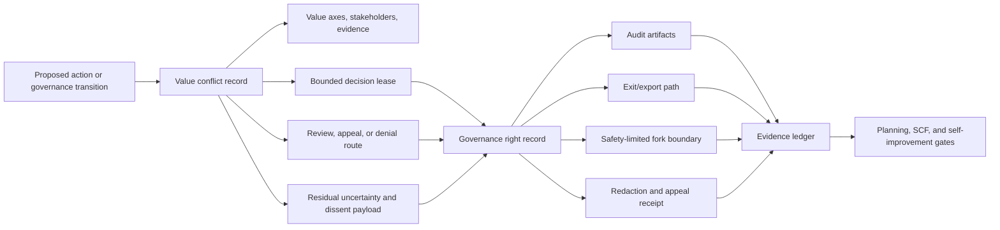

# Consolidation Destination Draft: Moral Uncertainty, Value Conflict, and Contestable Governance

Last updated: 2026-06-29

Status: review-ready draft; human/external review not completed.

This is the second destination-chapter draft for the governed consolidation
pilot. It is a review artifact only. It does not edit `book_structure.json`,
delete a chapter, change a URL, rewrite a rendered chapter, change source
mappings, change proof targets, change support states, authorize a merge, or
approve a reader artifact.

Destination continuity ID: `moral-uncertainty-and-value-conflict`

Proposed displayed title: **Moral Uncertainty, Value Conflict, and Contestable Governance**

Source chapters:

- `moral-uncertainty-and-value-conflict`
- `governance-rights-fork-exit-and-audit`

## Review Purpose

The dry-run package proved that the source, proof, reader, harness, and claim
boundaries can be reconciled in principle. This draft tests the harder
question: whether unresolved value conflict and fork, exit, audit, dissent, and
appeal rights become one stronger chapter rather than two adjacent skeletons.

Reviewers should judge whether the combined chapter improves reader flow,
preserves the technical artifacts owned by both source chapters, and keeps the
support boundary honest. This draft is not evidence that the merge is correct.
It is the object to review before deciding whether to execute, defer, or reject
the manifest merge.

## Non-Actions

- No manifest edit has been made.
- No source chapter has been deleted, retired, or redirected.
- No source note, external source, proof target, test result, or support state
  has changed.
- No chapter core claim is promoted above `argument`.
- No external comparator is treated as reproducing or validating ASI Stack
  moral reasoning, legal rights, institutional governance, or runtime
  contestability.
- No reader, EPUB, DOCX, PDF, audio, DOI, archive, or release artifact is
  approved by this draft.

## Preservation Ledger

| Surface | Preservation decision |
|---|---|
| Stable ID | Keep `moral-uncertainty-and-value-conflict` if a future merge proceeds. |
| Folded source chapter | Treat `governance-rights-fork-exit-and-audit` as preserved subclaims, sections, proof hooks, harness rows, and history, not silent deletion. |
| Proposed merged core claim | Value conflicts should be represented as explicit unresolved obligations, residuals, review paths, and bounded decisions, with fork, exit, audit, dissent, and contestability preserved as technical governance interfaces. |
| Claim label and support | `Design rationale` plus `argument`; no support-state change. |
| Corben/local source union | `ethica_mechanica`, `alignment_field`, `coherence_exchange`, `uat`, `spinoza`, `field_of_god_ai_constitution`, `ladon_manhattan`. |
| External comparator union | `ext_reinforcement_learning_moral_uncertainty_2020`, `ext_contestable_ai_design_2022`, `ext_collective_constitutional_ai_2024`, `ext_corrigibility_2015`, `ext_off_switch_game_2016`. |
| Lean modules | Preserve `AsiStackProofs.ValueConflict` and `AsiStackProofs.GovernanceRights`. |
| Lean proof tags | Preserve `lean:values.conflict.operational_invariant`, `lean:values.conflict.failure_blocks_promotion`, `lean:governance.rights.operational_invariant`, and `lean:governance.rights.failure_blocks_promotion`. |
| Harness lanes | Preserve `docs/value_conflict_harness.md`, `scripts/validate_value_conflicts.py`, `experiments/value_conflicts/results/2026-06-28-local.md`, `docs/governance_rights_harness.md`, `scripts/validate_governance_rights.py`, and `experiments/governance_rights/results/2026-06-28-local.md`. |
| Handoff if merged | The destination should hand off directly to `stable-capability-fields`. |

## Destination Chapter Draft

The draft below is intentionally written as one chapter skeleton. It collapses
the repeated status, problem, mechanism, test, and handoff cadence while
preserving the distinct value-conflict and governance-rights mechanisms.

### Chapter status

This proposed destination chapter would remain conceptual. Its core claim
would remain `Design rationale` with `argument` support. Existing source notes,
synthetic harnesses, and finite-record Lean theorems make the idea more
inspectable, but they do not prove moral correctness, legal rights,
institutional adequacy, reviewer independence, real export usability, safe
fork execution, or deployed governance enforcement.

The merge would combine two current record families:

- value conflict records, which preserve unresolved obligations, stakeholder
  disagreement, residual uncertainty, review routes, bounded decisions, and
  dissent payloads;
- governance right records, which preserve audit, exit, fork, redaction,
  appeal, receipt, and contestability obligations across runtime and
  replacement pressure.

Both record families would remain visible in the chapter's test plan and
formalization hooks.

### Drafting guardrail

Contestable governance is a record and rights-interface design, not a solved
moral theory, legal guarantee, or deployed institution. Moral uncertainty is
not solved by naming conflict. Fork, exit, audit, dissent, appeal, and
redaction rights are not solved by naming rights. They become engineering
requirements only when a plan, governance decision, memory action, capability
replacement, or self-improvement proposal can be narrowed, delayed, escalated,
blocked, exported, audited, appealed, or recorded as residual because the
relevant contestability path is missing or degraded.

The chapter should not ask readers to accept a final moral theory before
accepting the engineering move. The engineering move is narrower: unresolved
conflict needs durable records, bounded authority, preserved dissent, usable
challenge paths, rights receipts, and explicit non-claim boundaries.

### Human Reading Path

The hardest governance cases are not the ones where everyone agrees. They are
the cases where a system must act while values conflict, affected parties
disagree, and no honest objective can make the disagreement disappear.

A governed stack should not hide that tension inside a reward weight or a
policy sentence. It should record the conflict, bound the decision, preserve
who disagreed and why, and keep open the practical handles people need to
inspect, challenge, leave, fork, appeal, or revisit what happened.

This is why moral uncertainty and governance rights belong together. A value
conflict record keeps unresolved obligations alive. A governance right record
keeps people from being trapped inside the authority that made the contested
decision. Together they make disagreement operational without pretending that
disagreement has been morally solved.

### Problem

A self-improving system will face unresolved value conflicts whose affected
parties need inspectable, appealable, and portable governance rights rather
than hidden reward-weight settlement.

Agency and corrigibility do not remove value conflict. Protected values can
pull in different directions across autonomy, safety, truthfulness, privacy,
usefulness, consent, reversibility, fairness, and institutional obligation. A
planner that cannot represent conflict will freeze, optimize through dissent,
or quietly move a moral burden into an execution layer that lacks authority to
resolve it.

Governance rights are the downstream handle on that problem. Affected people
and institutions need audit, exit, fork, dissent, redaction appeal, and
contestability paths when governance itself becomes the risk. Without those
paths, a conflict record can become inert documentation. Without the conflict
record, rights have no durable object to inspect or challenge.

The destination chapter therefore asks one question throughout: how can the
stack act under unresolved disagreement while preserving the ability to
contest, audit, leave, fork where safe, and carry residual obligations into
future decisions?

### Why existing approaches are insufficient

Single-objective optimization and policy-only transparency both fail when
disagreement needs bounded action, dissent preservation, audit, exit, fork,
appeal, and safety-limited contestability.

Single-objective optimization is attractive because it gives the planner a
total order. But value conflicts often do not deserve a total order at the
point of action. Some require human review, some require delay, some require a
reversible low-power action, and some require recording unresolved uncertainty
while still making a bounded decision. Hiding that uncertainty inside a scalar
turns unresolved obligation into invisible optimization pressure.

Policy-only transparency has the complementary failure. A user can receive an
explanation while still lacking logs, source records, appeal routes, export
paths, redaction reasons, fork boundaries, or meaningful alternatives. Exit is
not real if data, memory, identity, artifacts, or institutional dependency are
held hostage. Audit is not real if the challenged party is the only keeper of
the record. Fork is not safe if it discards source, privacy, or safety
obligations.

External comparators help position the chapter but do not prove it.
Reinforcement learning under moral uncertainty and contestable AI ground the
need to preserve ethical disagreement and challenge surfaces. Collective
constitutional AI, corrigibility, and off-switch work sharpen the related need
for public input, correction, and uncertainty about human objectives. The ASI
Stack destination chapter is not claiming those systems have been reproduced
here. It uses them as comparators while asking a systems question: can moral
residuals and contestability rights survive planning, memory, execution,
replacement, and self-improvement pressure as explicit records?

### Core Claim

Value conflicts should be represented as explicit unresolved obligations,
residuals, review paths, and bounded decisions, with fork, exit, audit,
dissent, and contestability preserved as technical governance interfaces.

Support boundary: this would remain an `argument` support claim. The source
corpus supports the architecture vocabulary and drafting lineage. The current
fixtures and Lean modules show that the repository can express small record
invariants and rejection cases. They do not show moral correctness, legal
rights, reviewer quality, institutional adequacy, runtime contestability, real
export usability, safe forks, or deployed governance enforcement.

The folded source claim from `governance-rights-fork-exit-and-audit` should
become a preserved subclaim: fork, exit, audit, dissent, and contestability
should be treated as technical governance interfaces. It should not disappear,
and it should not remain as a second repeated core claim.

### Mechanism

The destination mechanism has two halves.

The first half is unresolved-conflict preservation. When a proposed action
pulls values apart, the stack records the conflict before selecting a bounded
action. The record classifies the conflict by value axes, stakeholders, stakes,
reversibility, authority boundary, evidence requirement, review route, decision
state, dissent payload, residual uncertainty, and revisit condition. Low-stakes
or reversible conflicts can produce bounded decisions. High-stakes or
unresolved conflicts route to human, tribunal, or external review. Either way,
the residual remains visible.

The second half is contestability preservation. A governance right is
represented as a capability with a holder, scope, artifact requirement, safety
constraint, access path, preservation rule, receipt, denial or redaction
reason, and appeal path. Audit, exit, fork, dissent, and redaction appeal are
not ornaments. They are interfaces that can be present, degraded, late, denied,
unsafe, or unavailable. If a right cannot produce a request path, response
artifact, denial reason, and appeal route, the record should preserve a
residual instead of pretending the right exists.

The important movement is from disagreement to bounded authority without
pretending the disagreement is settled. A bounded decision is a lease, not a
settlement. The lease records permitted action, prohibited action, affected
stakeholders, authority ceiling, expiry, revisit trigger, dissent payload, and
rollback or appeal path. A future policy update, benchmark ratchet, or
self-improvement proposal should not treat that lease as evidence that the
underlying values were resolved.

### Interfaces

The destination chapter should keep two interface families.

Value Conflict Record:

- `conflict_id`
- `value_axes`
- `stakeholders`
- `stakes`
- `reversibility`
- `authority_or_consent_boundary`
- `evidence_required`
- `review_route`
- `decision_state`
- `bounded_decision`
- `authority_effect`
- `dissent_payload`
- `residual_uncertainty`
- `expiry_or_revisit_condition`
- `non_claims`

Governance Right Record:

- `right_id`
- `right_type`
- `request_state`
- `holder`
- `scope`
- `required_artifacts`
- `material_available`
- `material_withheld`
- `safety_constraints`
- `access_path`
- `denial_or_redaction_reason`
- `appeal_path`
- `expiry_or_revisit`
- `challenged_party_independence`
- `preservation_rule`
- `preservation_obligation`
- `receipt_refs`
- `test_hook`
- `non_claims`

Planning consumes value-conflict records as authority constraints. Governance
consumes both conflict records and rights records as challenge surfaces. Memory
and execution produce the artifacts needed for audit and export. Stable
Capability Fields consume rights receipts as replacement constraints. Evidence
checks whether unresolved obligations, dissent payloads, withheld material,
redaction reasons, and appeal paths survived the transition. Self-improvement
consumes both record families as gates: a change that removes residual
obligations or contestability rights should be narrowed, escalated, or blocked.

### Invariants

- Unresolved conflicts remain visible.
- High-stakes unresolved conflicts require review and residual uncertainty.
- Bounded decisions preserve dissent and revisit conditions.
- Unresolved conflict narrows authority rather than expanding it.
- A bounded decision cannot become a permanent policy, reward target, or
  self-improvement permission without separate review.
- Audit records cannot be silently deleted.
- Exit paths remain materially usable.
- Forks preserve source, privacy, safety, and residual obligations.
- Redactions require recorded reasons and appeal paths.
- The challenged authority cannot be the only keeper of the record needed to
  challenge it.

The practical invariant is that action under disagreement must leave handles.
If a plan keeps the action but deletes the residual, the dissent, the audit
record, the export path, the redaction reason, or the appeal route, it has
changed the authority boundary, not merely simplified the workflow.

### Failure modes

- Value flattening.
- False consensus.
- Conflict laundering, where a bounded decision is later cited as resolved
  moral agreement.
- Dissent deletion.
- Stakeholder erasure.
- Review theater without durable decision records.
- Rights theater, where audit, exit, fork, appeal, or dissent exists in text
  but not as a usable interface.
- Governance capture, where the same authority controls policy, logs, appeal,
  and revision.
- Data hostage-taking.
- Unsafe fork bypass.
- Redaction without appeal.
- Appeal controlled only by the challenged authority.
- Portability theater, where exit exports omit the state needed to continue
  elsewhere.

The merged chapter should be especially suspicious of legitimacy without
contestability. A tribunal, policy page, or explanation can create the
appearance of governance while leaving no durable record, no dissent payload,
no export path, no independent appeal, and no way for later layers to preserve
the unresolved obligation.

### Minimum Viable Implementation

The smallest honest implementation is a `value_conflict_record` plus a
`governance_right_record` receipt suite. It validates fixture shape and
cross-record obligations without claiming moral correctness, legal rights,
institutional adequacy, deployed policy behavior, real export usability, safe
fork execution, or runtime governance enforcement.

The MVI should include:

- one high-stakes unresolved conflict blocked for missing residual uncertainty;
- one bounded decision that must preserve dissent, authority limits, expiry,
  and revisit conditions;
- one authority-narrowing case where unresolved conflict prevents broader
  action rights;
- one complete audit response with required artifacts and a durable receipt;
- one redaction with a reason, withheld-material boundary, and appeal path;
- one exit export that records what is portable and what remains constrained;
- one fork denial or narrowed fork that preserves safety obligations;
- one attempted capability replacement blocked because it would drop a rights
  receipt or unresolved conflict residual.

This starts the idea honestly because it can fail. It does not ask a schema to
solve moral uncertainty. It asks whether the record makes missing conflict and
contestability controls visible before the system acts or replaces itself.

### Beyond the State of the Art

A mature contestability layer carries unresolved moral residuals into durable
governance rights. Value-conflict records bind to rights receipts, appeal
surfaces, audit artifacts, safety-limited fork boundaries, portable exit paths,
dissent payloads, and replacement-preserved obligations. Downstream planning,
runtime, memory, SCF, evidence, and self-improvement gates can then see why an
action was bounded, who could contest it, what was withheld, where appeal
exists, and which residual obligations survive.

The mature endpoint keeps contestability operational when it is inconvenient.
Audit works during disputes. Exit preserves enough portable state to make
leaving meaningful without violating safety or privacy constraints. Forks carry
lineage, source, privacy, and safety obligations rather than becoming authority
leaks. Redactions become appealable artifacts. Dissent survives capability
replacement and self-improvement.

That endpoint remains a target architecture. It would require public-safe
traces, stronger proofs, external review, rights-interface usability checks,
runtime artifacts, and negative cases before any narrower support-state
transition could be justified. Until then, the destination chapter should keep
the merged core claim at `argument`.

### Codex test plan

| Test | Purpose | Status |
|---|---|---|
| Value-conflict fixture validation | Check that conflict records preserve value axes, stakeholders, residual uncertainty, dissent, review routes, and non-claims. | implemented by protocol validation and current harnesses |
| High-stakes review gate | Check that unresolved high-stakes conflicts require review and residual uncertainty. | modeled by finite Lean and synthetic fixtures; moral correctness and reviewer quality not run |
| Bounded-decision lease test | Check that bounded decisions preserve authority limits, dissent payloads, expiry, and revisit triggers. | modeled by finite Lean and synthetic fixtures; deployed policy behavior not run |
| Governance-rights fixture validation | Check that rights records preserve audit material, appeal paths, exit/fork access, fork safety, preservation obligations, durable receipts, and non-claims. | implemented by protocol validation and current harnesses |
| Rights preservation check | Check that audit, exit, fork, dissent, redaction, and appeal paths survive a governed transition. | modeled by finite Lean and synthetic fixtures; real interface usability not run |
| Replacement-preservation check | Check that capability replacement does not drop unresolved conflict residuals or rights receipts. | planned integration path; no deployed SCF replacement run is claimed |

### Formalization hooks

| Tag | Module | Target | Status |
|---|---|---|---|
| `lean:values.conflict.operational_invariant` | `AsiStackProofs.ValueConflict` | A high-stakes unresolved conflict carries review and residual requirements before accepted action. | implemented |
| `lean:values.conflict.failure_blocks_promotion` | `AsiStackProofs.ValueConflict` | A conflict record missing required review or residual uncertainty cannot promote the decision. | implemented |
| `lean:governance.rights.operational_invariant` | `AsiStackProofs.GovernanceRights` | Audit, exit, fork, dissent, and appeal obligations remain represented across a governed transition. | implemented |
| `lean:governance.rights.failure_blocks_promotion` | `AsiStackProofs.GovernanceRights` | A transition that removes protected governance rights or required receipts is rejected. | implemented |

The merged chapter should preserve the limitation prose from both source
chapters. These Lean modules prove small finite-record properties and rejection
cases for declared records. They do not prove moral correctness, automatic
value classification, reviewer quality, legal rights, actual export usability,
safe forks, institutional contestability, redaction quality, SCF replacement
behavior, or deployed rights enforcement.

### Source crosswalk

| Source ID | Destination use | Boundary |
|---|---|---|
| `ethica_mechanica` | Agency, contestability, recursive correction, dissent, exit/fork, objections, public revision, and resistance to frozen sovereign authority. | Conceptual governance lineage; not a complete moral theory, tested institution, legal guarantee, or empirical governance result. |
| `alignment_field` | Value conflict, suffering, dignity, agency, moral thresholds, pluralism, consent, anti-sacrifice constraints, and constraints under uncertainty. | Normative and heuristic lineage; not a validated measure of moral status, value correctness, or preserved rights. |
| `coherence_exchange` | Fork, exit, audit, contestability, verification supply-chain, review-market, and governance-interface framing. | Connector-only/source-note mapped; no implemented review market, economic mechanism, or governance mechanism is claimed. |
| `uat` | Adversarial review, retrieval-bounded verification, proposition states, unsupported-claim removal, SME checkpoints, and termination criteria for contested claims. | Protocol design only; no implemented review process or benchmark result is reproduced. |
| `spinoza` | Support tiers, contradiction detection, belief revision, protected axioms, downgrades, and blocked self-authorizing changes. | Does not settle moral uncertainty or prove whole-system epistemic correctness, autoformalization, or governance legitimacy. |
| `field_of_god_ai_constitution` | Stakeholder checks, uncertainty, consent, reversibility, least sufficient power, auditability, tool-risk tiers, red-team evaluation, and self-improvement freezes. | Specification source only; no policy engine, red-team result, moral-correctness proof, or governance-rights deployment is claimed. |
| `ladon_manhattan` | Hidden credential boundaries, handle-based authority, permission lookup, isolated compartments, and credential-injection points around authority use. | Architecture/specification only; no kernel implementation, side-channel validation, audit-log implementation, or security audit is claimed. |
| `ext_reinforcement_learning_moral_uncertainty_2020` | Comparator for preserving uncertainty across ethical theories in reinforcement-learning settings. | Comparator only; no reproduced experiment or moral-correctness evidence. |
| `ext_contestable_ai_design_2022` | Comparator for contestability, challenge, and appeal surfaces around AI decisions. | Comparator only; no proof that ASI Stack contestability works in deployment. |
| `ext_collective_constitutional_ai_2024` | Comparator for public-input constitutional shaping and collective normative input. | Comparator only; no proof of governance adequacy or runtime enforcement. |
| `ext_corrigibility_2015` | Comparator for correction, operator intervention, and systems that tolerate being corrected. | Comparator only; no deployed corrigibility result. |
| `ext_off_switch_game_2016` | Comparator for shutdown incentives and uncertainty about human objectives. | Comparator only; no evidence that this stack preserves shutdown incentives or governance exit rights. |

### Summary

Moral uncertainty becomes governable when unresolved obligations stay visible
after action. Governance rights become meaningful when affected people retain
usable handles to audit, appeal, leave, fork where safe, and preserve dissent
while the system is still capable of changing course.

The destination chapter should therefore own one combined boundary:
disagreement is not deleted, and contestability is not merely declared. A
governed stack can act only at the level of authority its conflict records,
rights receipts, safety obligations, and residuals can justify.

### Handoff

This destination chapter would hand off directly to **Stable Capability
Fields**. Once value conflicts and contestability rights are represented as
records, the next problem is replacement: how does the stack change
capabilities, models, tools, policies, or memory systems without losing the
rights, residual obligations, audit records, and authority limits that earlier
layers created?

## Review Checklist Before Any Manifest Merge

- Does the draft read as one chapter with one skeleton?
- Does it preserve the governance-rights source chapter as sections and
  subclaims rather than deleting it?
- Does it keep both proof modules and all four proof tags?
- Does it keep both harness lanes visible?
- Does it keep source and external-comparator boundaries explicit?
- Does it preserve `argument` support and avoid implied chapter-core
  promotion?
- Does it improve reader flow enough to justify removing a rendered chapter
  from the manifest?
- Does the project have an acceptable URL or redirect policy for the folded
  chapter?
- Does the handoff to Stable Capability Fields preserve rights and residuals
  across capability replacement?

## Current Decision

This draft is ready for human or external review. It is not yet reviewed.
Manifest consolidation remains blocked until a reviewer accepts the destination
shape or the project records a decision to defer or reject the merge.
