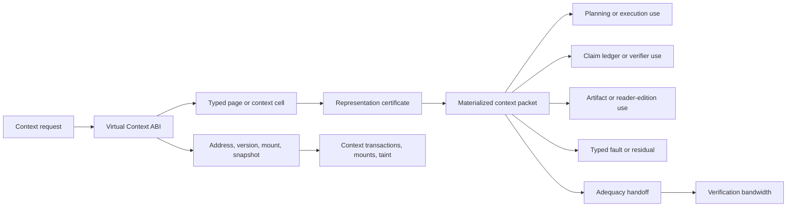

# Consolidation Destination Draft: The Virtual Context ABI, Typed Pages, Cells, and Certificates

Last updated: 2026-06-29

Status: review-ready draft; human/external review not completed.

This is the destination-chapter draft for the non-pilot static context ABI
consolidation package. It is a review artifact only. It does not edit
`book_structure.json`, delete a chapter, change a URL, rewrite a rendered
chapter, change source mappings, change proof targets, change support states,
authorize a merge, or approve a reader artifact.

Destination continuity ID: `virtual-context-abi`

Proposed displayed title: **The Virtual Context ABI: Typed Pages, Cells, and
Certificates**

Source chapters:

- `virtual-context-abi`
- `semantic-pages-context-cells-and-certificates`

Related chapters not merged by this draft:

- `context-transactions-snapshots-mounts-and-taint`
- `verification-bandwidth-and-context-adequacy`
- `claim-ledgers-and-belief-revision`

## Review Purpose

The dry-run package records how the source, proof, reader, fixture, and claim
boundaries can be reconciled in principle. This draft tests whether the
destination reads as one static memory-interface chapter rather than two
adjacent chapters repeating the context argument.

Reviewers should judge whether the combined chapter improves reader flow,
preserves the technical artifacts owned by both source chapters, and protects
the adjacent dynamic transaction and verification-bandwidth chapters. This
draft is not evidence that the merge is correct. It is the object to review
before deciding whether to execute, revise, defer, or reject the manifest
merge.

## Non-Actions

- No manifest edit has been made.
- No source chapter has been deleted, retired, or redirected.
- No source note, external source, proof target, test result, or support state
  has changed.
- No chapter core claim is promoted above `argument`.
- No external comparator is treated as reproducing or validating ASI Stack
  memory correctness, context compiler behavior, resolver behavior, summary
  fidelity, context adequacy, model performance, or deployment behavior.
- No reader, EPUB, DOCX, PDF, audio, DOI, archive, or release artifact is
  approved by this draft.

## Preservation Ledger

| Surface | Preservation decision |
|---|---|
| Stable ID | Keep `virtual-context-abi` if a future merge proceeds. |
| Folded source chapter | Treat `semantic-pages-context-cells-and-certificates` as preserved subclaims, sections, proof hooks, fixture/test rows, and history, not silent deletion. |
| Protected adjacent chapter | Keep `context-transactions-snapshots-mounts-and-taint` standalone as the dynamic transaction, snapshot, mount, taint, branch, and deletion-closure layer. |
| Protected adjacent chapter | Keep `verification-bandwidth-and-context-adequacy` standalone as the adequacy, verification-capacity, and mode-confusion layer. |
| Protected reasoning substrate | Keep `claim-ledgers-and-belief-revision` standalone as the durable claim identity and belief-revision ledger. |
| Proposed merged core claim | Virtual Context Memory should expose a Virtual Context ABI that materializes typed pages and context cells with stable addresses, versions, certificates, authority ceilings, loss/use contracts, adequacy states, residuals, and typed faults. |
| Claim label and support | `Design rationale` plus `argument`; no support-state change. |
| Corben/local source union | `vcm_public`, `context_engineer`, `verification_bandwidth`, `viea`, `vcm_editable`, `moecot`, `spinoza`. |
| External comparator union | `ext_alce_2023`, `ext_longbench_2023`, `ext_longllmlingua_2023`, `ext_lost_in_middle_2023`, `ext_memgpt_2023`, `ext_rag_2020`, `ext_ruler_2024`, `ext_self_rag_2023`. |
| Lean modules | Preserve `AsiStackProofs.VirtualContextABI` and `AsiStackProofs.ContextCertificates`. |
| Lean proof tags | Preserve `lean:vcm.abi.operational_invariant`, `lean:vcm.abi.failure_blocks_promotion`, `lean:vcm.certificates.operational_invariant`, and `lean:vcm.certificates.failure_blocks_promotion`. |
| Adjacent Lean hooks | Leave `AsiStackProofs.ContextTransactions`, `AsiStackProofs.VerificationBandwidth`, `lean:vcm.transactions.*`, and `lean:verification_bandwidth.adequacy.*` with their protected standalone chapters. |
| Fixture families | Preserve `context_abi_record`, `semantic_page_certificate`, `context_packet`, and related `experiments/context_admission_adequacy/` valid and expected-invalid fixtures. |
| Handoff if merged | The destination should receive the handoff from `cognitive-compilation-and-semantic-ir` and hand off directly to `context-transactions-snapshots-mounts-and-taint`. |

## Destination Chapter Draft

The draft below is intentionally written as one chapter skeleton. It collapses
the repeated status, problem, mechanism, test, and handoff cadence while
preserving the distinct ABI/addressability and semantic-certificate mechanisms.

### Chapter status

This proposed destination chapter would remain conceptual. Its core claim
would remain `Design rationale` with `argument` support. Existing source notes,
schema fixtures, a synthetic context admission/adequacy harness, and
finite-record Lean theorems make the static context boundary more inspectable,
but they do not prove resolver correctness, context compiler quality,
semantic-fidelity measurement, deployed memory-store behavior, verification
bandwidth, model-facing context performance, or runtime safety.

The merge would combine two current record families:

- context ABI records, which ask whether context requests, addresses, versions,
  mounts, snapshots, materialization states, authority labels, adequacy
  requirements, leases, residuals, source refs, and typed faults are explicit;
- semantic page certificate records, which ask whether typed context cells,
  source bindings, omissions, loss contracts, permitted uses, authority
  ceilings, revocation states, transaction refs, and artifact refs survive
  representation changes.

Both record families would remain visible in the chapter's implementation
horizon, test plan, source crosswalk, and formalization hooks.

### Drafting guardrail

A context ABI is not the same thing as a working memory system. It is the
record layer a governed stack needs before context resolver behavior, summary
truthfulness, deletion closure, transaction isolation, verification adequacy,
or model use can be tested honestly.

The destination chapter should not ask readers to believe that a long-context
model can use every loaded fact correctly. It should ask a narrower systems
question: when context is materialized for a planner, verifier, worker, claim
ledger, or reader edition, what typed object, address, version, certificate,
authority, loss, adequacy, lease, fault, and residual information must survive?

### Human Reading Path

A model can sound as if it remembers everything. A governed system has to be
able to say what it actually gave the model.

The difference is the context interface. Instead of dumping "relevant text"
into a prompt, the stack materializes typed context objects. Each object has an
address, a version, a source boundary, an authority label, a representation
type, a certificate, and a reason it is allowed to be used. A short summary, a
redacted instruction, an exact quote, a claim cell, and a reader-edition
paraphrase are not the same kind of object. They should not carry the same
permission or evidential weight.

This chapter is the static interface for that discipline. The next context
chapter handles transactions, snapshots, mounts, taint, and deletion over time.
The verification-bandwidth chapter then asks whether the admitted context is
strong enough for a particular claim.

### Problem

Long-horizon agents need a stable context interface whose addresses, versions,
materializations, typed pages, context cells, certificates, authority labels,
loss contracts, adequacy states, and faults remain inspectable across
planning, reasoning, execution, and audit.

Without that interface, memory becomes prose. A retrieved passage, old
conversation, compressed summary, redacted brief, policy excerpt, source
quote, and derived inference can all appear as plain tokens. The model can use
them, but the stack cannot later explain which object was supplied, which
version it came from, what was omitted, which authority ceiling applied, which
uses were permitted, whether the packet was adequate for the target claim, or
which fault should have blocked use.

The Virtual Context ABI owns the static shape of that interface. It says what
a context request can ask for, what a materialized packet must report, and how
typed pages, cells, and certificates travel into planning, execution, evidence,
and reader-facing artifacts.

### Why existing approaches are insufficient

Long context windows, retrieval systems, and summaries can move text close to a
model without defining stable addressability, representation authority, source
bindings, omission records, permitted uses, adequacy boundaries, or typed
failure behavior.

A retrieval result can be relevant and still be stale. A summary can be useful
and still omit the clause that matters. A redaction can be safe for a worker
and inadequate for a claim. A source can be allowed for orientation but not for
support-state promotion. A context packet can be syntactically well formed and
still be inadequate for the target question. If the interface does not expose
those distinctions, the system may treat all loaded text as if it had the same
authority and evidence weight.

External comparators help position the chapter but do not prove it.
Retrieval-augmented generation, long-context benchmarks, memory-augmented LLM
systems, citation-oriented generation, self-reflective retrieval, and prompt
compression literature all illuminate adjacent parts of the problem. The ASI
Stack destination chapter is not claiming those systems have been reproduced
here. It uses them as comparators while asking a systems question: what ABI
prevents context from becoming anonymous prompt mass?

### Core Claim

Virtual Context Memory should expose a Virtual Context ABI that materializes
typed pages and context cells with stable addresses, versions, certificates,
authority ceilings, loss/use contracts, adequacy states, residuals, and typed
faults.

Support boundary: this would remain an `argument` support claim. The source
corpus supports the architecture vocabulary and drafting lineage. The current
fixtures and Lean modules show that the repository can express record-shape
checks, synthetic negative cases, and small finite invariants. They do not show
that a VCM resolver is correct, that summary certificates are truthful in open
domains, that models use context reliably, or that a deployed memory system
enforces the ABI.

The folded source claim from
`semantic-pages-context-cells-and-certificates` should become a preserved
subclaim: context should be represented as typed semantic pages or cells with
evidence-carrying representation certificates that preserve source bindings,
omissions, authority ceilings, loss contracts, and permitted uses.

### Mechanism

The destination mechanism has four lanes.

The first lane is context addressing. A context request names the task, address
or address pattern, version requirement, mount scope, snapshot, representation
need, authority ceiling, adequacy target, consumer policy, lease, and fault
behavior. A materialization receipt then records what resolved, what failed,
what was omitted, which source refs were used, and which residuals remain.

The second lane is typed semantic structure. Context is not only text. It can
arrive as constraint cells, claim cells, decision cells, correction cells,
event cells, artifact cells, exact excerpts, lossy summaries, redactions,
abstractions, translations, or derived inferences. The type tells downstream
layers what kind of object they are holding before they treat it as evidence,
instruction, background, or executable constraint.

The third lane is representation certification. A certificate binds the cell
to source refs, omissions, loss contract, permitted uses, authority ceiling,
validity state, revocation state, transaction refs, artifact refs, and
residuals. A summary can be admitted as a planning brief without becoming
evidence for a claim. A redaction can be safe for execution without being
adequate for verification. A reader-edition paraphrase can be readable without
becoming a source quotation.

The fourth lane is typed fault and adequacy handoff. The ABI can report
missing, unsafe, unknown, conflicting, stale, revoked, unauthorized, or
unsatisfiable context rather than materializing best-effort prompt text. It can
also state whether a packet is admitted for use while leaving adequacy for a
target claim to the verification-bandwidth layer.

The important movement is from untyped prompt content to inspected context
objects. A planner, verifier, worker, or reader artifact receives a packet that
can explain itself.

### Interfaces

Planning requests context by task, address, authority, representation need,
and adequacy target. Planning should receive enough structure to know whether
context is a constraint, claim, decision, source excerpt, summary, or residual.

VCM materializes packets and cells. It owns the static address, version,
certificate, source-ref, authority, loss, use, lease, residual, and fault
fields.

Spinoza and claim ledgers consume claim and evidence cells. They can cite a
certificate, but the certificate itself does not settle the claim. The claim
ledger still owns support state, contradiction, revision, and promotion
decisions.

Execution consumes only permitted representations. A redacted execution packet
can guide a worker without exposing every source or granting authority beyond
its certificate.

Artifact graphs store certificate references when context-derived
representations become durable work products. That lets a later audit recover
which context object influenced an artifact.

Context transactions supply dynamic semantics. Snapshot consistency, branch
isolation, mount permissions, taint propagation, deletion closure, and
declassification stay with
`context-transactions-snapshots-mounts-and-taint`.

Verification bandwidth evaluates adequacy. A packet can be validly admitted
and still inadequate for a high-risk claim. That distinction stays with
`verification-bandwidth-and-context-adequacy`.

### Invariants

- Addresses and versions are stable.
- Source bindings survive representation changes.
- Authority labels survive summarization.
- Loss and permitted-use contracts are explicit.
- Derived cells point back to source bindings.
- Derived cells point to the transaction or artifact record that created the
  representation when that record exists.
- Context admission and context adequacy remain distinct.
- Mandatory context misses produce typed faults rather than best-effort
  packets.
- Summaries cannot increase the authority ceiling of their source cells.
- Revoked or stale certificates cannot be treated as current support.

### Failure modes

Flat transcript memory treats all prior text as one undifferentiated source of
truth.

Stale context lets an old version or revoked cell keep influencing work after
its validity changed.

Summary overconfidence lets a lossy representation appear stronger than the
source material it compressed.

Provenance loss severs a derived cell from the source bindings and omissions
that explain what it can support.

Authority escalation through compression lets a summary, redaction, or
paraphrase carry more permission than its source.

Unsafe fit happens when a packet is admitted because it is relevant but the
authority, clearance, loss, or adequacy record should have blocked use.

Adequacy laundering happens when a context packet adequate for orientation or
drafting is reused as if it were adequate for claim support.

### Minimum Viable Implementation

The minimum viable implementation is not a full memory system. It is a public
record surface that can represent the static ABI and reject a few dishonest
collapses.

The implementation should preserve:

- `schemas/context_abi_record.schema.json`;
- `schemas/semantic_page_certificate.schema.json`;
- `schemas/context_packet.schema.json`;
- `schemas/context_adequacy_record.schema.json`;
- `schemas/context_transaction_record.schema.json`;
- `experiments/context_admission_adequacy/fixtures/valid_local_check_public_context.json`;
- `experiments/context_admission_adequacy/fixtures/valid_admitted_but_inadequate.json`;
- `experiments/context_admission_adequacy/fixtures/valid_conflict_escalation.json`;
- `experiments/context_admission_adequacy/fixtures/invalid_admission_as_verification.json`;
- `experiments/context_admission_adequacy/fixtures/invalid_conflict_promoted.json`;
- `experiments/context_admission_adequacy/fixtures/invalid_stale_certificate_use.json`;
- `python3 scripts/validate_context_admission_adequacy.py`.

That MVI is useful because it tests the representation boundary. It does not
prove that a real resolver can find the right context, that summaries are
semantically faithful, that a model will use the packet correctly, or that a
memory store enforces transactions.

### Beyond the State of the Art

The mature version is a memory syscall layer for long-horizon AI work. It is
not a larger retrieval system. It is the interface by which planners,
compilers, workers, verifiers, claim ledgers, auditors, reader editions, and
later AI agents request and receive context with stable identities and
permissioned representations.

In that mature system, a model never receives anonymous "relevant context." It
receives a materialization receipt and typed cells. The receipt says what was
requested, which address and version resolved, what representation was built,
which authority labels survived, what was omitted, which uses are permitted,
when the lease expires, which certificate applies, whether the packet is only
admitted or also adequate for the target claim, and which fault or residual
remains.

The endpoint is a governed context fabric: exact source excerpts, summaries,
redactions, planning briefs, claim cells, contradiction pairs, reader
paraphrases, and execution packets can all be materialized from shared sources
without pretending they have the same authority or evidential role. The
architecture should make context safer by making its boundaries explicit. It
does not become validated until resolver behavior, certificate truthfulness,
transaction semantics, verification adequacy, and model-facing outcomes are
tested separately.

### Codex test plan

The destination should preserve the existing test plan without turning it into
a broader result:

- address/version stability test;
- admission versus adequacy test;
- conflict adequacy classification test;
- context fault behavior test;
- certificate completeness test;
- authority preservation test;
- summary fidelity boundary test;
- stale certificate rejection;
- admission-as-verification rejection;
- conflict-promotion rejection.

The current synthetic context admission/adequacy harness is a bounded
cross-record gate. It is not a deployed VCM resolver, memory store, summary
truthfulness evaluator, contradiction-rate benchmark, or model-facing context
experiment.

### Formalization hooks

The destination should preserve these implemented finite-record Lean hooks:

- `lean:vcm.abi.operational_invariant` in
  `AsiStackProofs.VirtualContextABI`;
- `lean:vcm.abi.failure_blocks_promotion` in
  `AsiStackProofs.VirtualContextABI`;
- `lean:vcm.certificates.operational_invariant` in
  `AsiStackProofs.ContextCertificates`;
- `lean:vcm.certificates.failure_blocks_promotion` in
  `AsiStackProofs.ContextCertificates`.

The proof hooks show finite-record invariants: resolved references require
matching address/version/snapshot bindings, mandatory misses become typed
faults, derived cells carry source/loss/use contracts, and summaries cannot
increase source authority ceilings. They do not prove open-domain source
selection, semantic fidelity, deployed memory behavior, or model use.

Adjacent proof hooks should remain with protected standalone chapters:

- `lean:vcm.transactions.operational_invariant`;
- `lean:vcm.transactions.failure_blocks_promotion`;
- `lean:verification_bandwidth.adequacy.operational_invariant`;
- `lean:verification_bandwidth.adequacy.failure_blocks_promotion`.

### Source crosswalk

Corben/local sources for the destination:

- `vcm_public`;
- `context_engineer`;
- `verification_bandwidth`;
- `viea`;
- `vcm_editable`;
- `moecot`;
- `spinoza`.

External comparators for positioning:

- `ext_alce_2023`;
- `ext_longbench_2023`;
- `ext_longllmlingua_2023`;
- `ext_lost_in_middle_2023`;
- `ext_memgpt_2023`;
- `ext_rag_2020`;
- `ext_ruler_2024`;
- `ext_self_rag_2023`.

No listed external source is local reproduction evidence. The destination
should use these records to orient readers around retrieval, long-context
benchmarks, memory-augmented LLMs, citation-oriented generation,
self-reflective retrieval, and prompt compression while preserving the
claim-support boundary.

### Repetition-removal ledger

This destination removes one repeated static-context skeleton. The current
chapters both explain why raw long context and ordinary retrieval are
insufficient; the destination says that once and then gives more room to the
interface details.

Preserved substructures:

- context address and version discipline;
- mount, snapshot, and materialization receipt fields;
- typed semantic pages and context cells;
- representation certificate fields;
- source refs, omissions, authority ceilings, and permitted uses;
- admission versus adequacy handoff;
- typed fault states;
- proof hooks for ABI resolution and certificate authority preservation;
- synthetic context admission/adequacy fixture routing.

Saved space should go to:

- clearer examples of exact excerpt, lossy summary, redaction, derived claim
  cell, and reader-edition paraphrase as different context objects;
- sharper explanation of why the transaction/taint chapter remains separate;
- sharper explanation of why verification bandwidth remains separate;
- explicit non-claims around summary fidelity and model behavior.

Reader-work disposition: curated-reader graduation for
`virtual-context-abi` and `semantic-pages-context-cells-and-certificates`
should pause until this draft is executed, explicitly deferred, or
rejected/retained. Local prose cleanup is fine when it does not entrench the
duplicate skeleton. Reader curation may continue on protected adjacent
chapters.

### Summary

The Virtual Context ABI is the static interface between durable memory and
model-visible context. It gives context a stable identity before the stack
uses it. A context packet should say where it came from, which version it
represents, what type of cell it is, what was omitted, which authority survived,
which uses are permitted, whether the packet is admitted or adequate, and which
fault or residual remains.

Typed pages and representation certificates are not an optional second idea.
They are what make the ABI meaningful. Without them, stable addresses can
still deliver anonymous prompt material. With them, the stack can distinguish
exact evidence from lossy summaries, redacted execution context, claim cells,
planning briefs, and reader paraphrases.

The boundary remains narrow. This chapter specifies the static context
interface. Transactional memory behavior, deletion closure, taint propagation,
verification bandwidth, and claim-ledger belief revision remain separate
chapters with their own proof and evidence lanes.

### Handoff

The next layer is dynamic context behavior. Once the stack has typed context
objects with addresses and certificates, it needs to explain how those objects
change over time: which events are committed, which snapshot is visible, which
mount is readable, which branch was used, which derivatives were created, how
taint propagates, and how deletion or declassification obligations close.

That is the job of `context-transactions-snapshots-mounts-and-taint`.

## Review Decision Surface

Possible review outcomes:

- Execute merge: accept `virtual-context-abi` as the continuity ID, fold
  `semantic-pages-context-cells-and-certificates`, preserve proof/source/test
  history, and update manifest, outline, Appendix C, reader surfaces, handoffs,
  URL policy, and validation in one controlled commit.
- Revise: keep the merge candidate open but require stronger destination prose,
  clearer protected-boundary handling, or more precise source/proof/test
  reconciliation before execution.
- Defer: keep both chapters for the current release and record that duplicate
  static context skeletons are accepted temporarily.
- Reject or retain: preserve both chapters because semantic pages/certificates
  still own a distinct chapter artifact, proof family, evidence lane, or reader
  throughline.

No chapter core claim is promoted above `argument` by any review outcome.

## Non-Claims

- This draft does not merge chapters.
- This draft does not change Appendix C support states.
- This draft does not create source-derived, external-literature-backed,
  proof-derived, prototype-backed, synthetic-test-backed, or empirical support.
- This draft does not approve any reader, EPUB, DOCX, PDF, audio, DOI, archive,
  or release artifact.
- This draft does not prove deployed memory correctness, summary fidelity,
  context compiler behavior, model performance, runtime behavior, or ASI
  capability.
