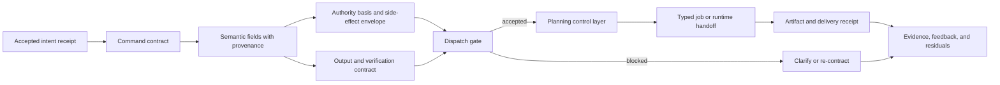

# Consolidation Destination Draft: Command Contracts From Intent To Executable Work

Last updated: 2026-06-29

Status: review-ready draft; human/external review not completed.

This is the destination-chapter draft for the non-pilot intent/contracts
consolidation package. It is a review artifact only. It does not edit `book_structure.json`,
delete a chapter, change a URL, rewrite a rendered chapter, change source
mappings, change proof targets, change support states, authorize a merge, or
approve a reader artifact.

Destination continuity ID: `intent-to-execution-contracts`

Proposed displayed title: **Command Contracts: From Intent to Executable Work**

Source chapters:

- `intent-to-execution-contracts`
- `command-contracts-and-semantic-interfaces`

Related chapter not merged by this draft:

- `human-intent-as-a-formal-input`

## Review Purpose

The dry-run package records how the source, proof, reader, fixture, and claim
boundaries can be reconciled in principle. This draft tests the harder
question: whether the destination reads as one chapter with one skeleton
rather than two adjacent chapters repeating the contract argument.

Reviewers should judge whether the combined chapter improves reader flow,
preserves the technical artifacts owned by both source chapters, and keeps the
support boundary sober. This draft is not evidence that the merge is correct.
It is the object to review before deciding whether to execute, revise, defer,
or reject the manifest merge.

## Non-Actions

- No manifest edit has been made.
- No source chapter has been deleted, retired, or redirected.
- No source note, external source, proof target, test result, or support state
  has changed.
- No chapter core claim is promoted above `argument`.
- No external comparator is treated as reproducing or validating ASI Stack
  parser correctness, semantic-interface safety, dispatcher behavior, approval
  enforcement, tool-effect enforcement, runtime execution, or deployment
  behavior.
- No reader, EPUB, DOCX, PDF, audio, DOI, archive, or release artifact is
  approved by this draft.

## Preservation Ledger

| Surface | Preservation decision |
|---|---|
| Stable ID | Keep `intent-to-execution-contracts` if a future merge proceeds. |
| Folded source chapter | Treat `command-contracts-and-semantic-interfaces` as preserved subclaims, sections, proof hooks, fixture/test rows, and history, not silent deletion. |
| Adjacent retained chapter | Keep `human-intent-as-a-formal-input` standalone as the intake, ambiguity, authority-extraction, bounded-default, re-contract, and stop-condition chapter. |
| Proposed merged core claim | Governed work should pass through explicit command contracts that bind intent, semantic interface fields, authority, artifacts, verification, failure behavior, execution receipts, and residuals before tools or runtimes act. |
| Claim label and support | `Design rationale` plus `argument`; no support-state change. |
| Corben/local source union | `viea`, `talos`, `software_magic_grimoire`, `genesiscode`, `moecot`, `cognitive_compilation`. |
| External comparator union | `ext_react_2022`, `ext_dafny_2010`. |
| Adjacent external comparators retained by Human Intent | `ext_goal_oriented_requirements_engineering_2001`, `ext_cooperative_inverse_rl_2016`, `ext_deep_rl_human_preferences_2017`. |
| Lean modules | Preserve `AsiStackProofs.IntentToExecution` and `AsiStackProofs.CommandContracts`. |
| Lean proof tags | Preserve `lean:intent_execution.contracts.operational_invariant`, `lean:intent_execution.contracts.failure_blocks_promotion`, `lean:command.semantic_interface.operational_invariant`, and `lean:command.semantic_interface.failure_blocks_promotion`. |
| Adjacent Lean hooks | Leave `AsiStackProofs.IntentContracts` and `lean:intent.contract.*` proof tags with `human-intent-as-a-formal-input`. |
| Fixture families | Preserve `intent_contract`, `command_contract`, `intent_execution_trace`, and the `experiments/plan_execution_contracts/` valid and expected-invalid fixtures. |
| Handoff if merged | The destination should receive the handoff from `human-intent-as-a-formal-input` and hand off directly to `planning-as-a-control-layer`. |

## Destination Chapter Draft

The draft below is intentionally written as one chapter skeleton. It collapses
the repeated status, problem, mechanism, test, and handoff cadence while
preserving the distinct execution-contract and semantic-interface mechanisms.

### Chapter status

This proposed destination chapter would remain conceptual. Its core claim
would remain `Design rationale` with `argument` support. Existing source notes,
schema fixtures, a synthetic plan-execution contract harness, and finite-record
Lean theorems make the contract boundary more inspectable, but they do not
prove parser correctness, semantic extraction quality, prompt-injection
resistance, approval enforcement, runtime dispatcher behavior, tool-effect
control, or deployed execution safety.

The merge would combine two current record families:

- intent-to-execution traces, which ask whether accepted intent, constraints,
  approvals, artifacts, handoffs, dispatch receipts, evidence updates,
  feedback, stop/fault states, and residuals remain linked from request to
  delivery;
- command contracts, which ask whether objective, context, constraints,
  procedure, output contract, verification, failure behavior, field provenance,
  field confidence, bounded defaults, authority basis, re-contract points, and
  dispatch blockers are explicit before planning or execution can proceed.

Both record families would remain visible in the chapter's implementation
horizon, test plan, source crosswalk, and formalization hooks.

### Drafting guardrail

A command contract is not the same thing as a working parser or a secure
dispatcher. It is the record a governed stack needs before parser quality,
planner handoff, runtime enforcement, approval behavior, and artifact
traceability can be tested honestly.

The destination chapter should not ask readers to believe that a model can
extract intent perfectly. It should ask a narrower systems question: once
intent has been accepted for work, what semantic fields, authority limits,
receipts, artifacts, verification paths, failure behavior, and residuals must
survive before tools or runtimes act?

### Human Reading Path

A person can ask for something in ordinary language. A system should not treat
that ordinary language as unlimited permission.

The first operational move is translation. The request becomes a contract that
separates what the person wants from what the system is allowed to do, what it
must produce, how success will be checked, what failure means, and when it has
to stop or ask again. The contract is not a bureaucratic form. It is the
boundary that prevents a helpful response from turning into an unauthorized
action.

This chapter starts where the Human Intent chapter hands off. The raw request
has been captured, ambiguity has been bounded or escalated, and authority has
been scoped. Now the stack needs a command object that planners, verifiers, job
runners, runtime adapters, evidence ledgers, and later AI agents can all read
without guessing.

### Problem

Accepted human intent needs a typed command contract whose semantics,
authority, artifacts, verification, failure behavior, and execution receipts
remain inspectable from intake through delivery.

The previous chapter keeps raw human intent from becoming unrestricted
execution authority. That does not yet make the work executable. The system
still needs to decide what the next unit of work means, which constraints are
binding, which context is informative rather than authoritative, which side
effects are allowed, which artifact must be produced, which verifier can accept
it, and what happens when the work fails.

The command-contract layer owns that translation. It turns accepted intent
into a semantic interface that downstream layers can inspect. Planning can
consume it without inventing authority. Execution can consume typed jobs
derived from it without treating a conversational answer as completed work.
Evidence can attach validation, feedback, and residuals to the thing that was
actually requested.

### Why existing approaches are insufficient

Prompt prose, model responses, and ad hoc task descriptions blur objective,
context, constraints, authority, output contract, verification, failure
behavior, artifact identity, and side-effect control.

A prompt can contain an objective, examples, background context, style
requests, hidden assumptions, previous conversation, retrieved text, and
instructions from several parties. Without a contract boundary, those
materials can override each other silently. A model may answer as though it
has completed work when it has only described work. A planner may infer a
tool permission because the means seems obvious. A runtime may execute an
effect because a downstream node was dispatched, even though the original
request never granted that authority.

External comparators help position the chapter but do not prove it. ReAct
shows the importance of interleaving reasoning and action, while Dafny
positions the value of explicit specifications and verification conditions.
The ASI Stack destination chapter is not claiming either system has been
reproduced here or that command contracts provide equivalent formal guarantees.
It uses them as comparators while asking a systems question: what semantic
record prevents a request, prompt, plan, job, artifact, and evidence update
from losing their shared meaning?

### Core Claim

Governed work should pass through explicit command contracts that bind intent,
semantic interface fields, authority, artifacts, verification, failure
behavior, execution receipts, and residuals before tools or runtimes act.

Support boundary: this would remain an `argument` support claim. The source
corpus supports the architecture vocabulary and drafting lineage. The current
fixtures and Lean modules show that the repository can express record-shape
checks, synthetic negative cases, and small finite invariants. They do not show
that a parser is correct, that a dispatcher enforces authority in the real
world, that a tool call is safe, or that a deployed runtime follows these
contracts.

The folded source claim from `command-contracts-and-semantic-interfaces`
should become a preserved subclaim: explicit semantic interfaces are required
for objective, context, constraints, procedure, output, verification, failure
behavior, field provenance, field confidence, authority basis, re-contract
points, and dispatch blockers.

### Mechanism

The destination mechanism has three lanes.

The first lane is intake-to-contract continuity. It receives an accepted intent
receipt from `human-intent-as-a-formal-input`, then records the command's
objective, constraints, authority envelope, allowed means, disallowed means,
acceptance criteria, stop conditions, evidence requirements, artifacts, and
clarification or re-contract triggers. It preserves the difference between
what a person expressed and what the system is authorized to do.

The second lane is semantic interface discipline. It gives each command field
provenance and confidence: confirmed, policy-imposed, source-derived,
defaulted, inferred, or missing. Context, examples, retrieved text, previous
conversation, and style notes can inform work, but they cannot override
explicit objective, constraints, authority, output contract, verification, or
failure behavior. Missing or inferred authority can support clarification or a
draft-only route. It cannot authorize side effects.

The third lane is execution traceability. It records handoff receipts,
dispatch receipts, job references, artifact references, verifier decisions,
feedback, residuals, stop/fault states, and non-claims. The point is not to
make execution automatic. The point is to ensure that when execution does
occur, the repository can tell which contract authorized it, which artifacts
resulted, which validators accepted them, and which residuals remain.

The important movement is from conversational request to executable unit
without treating the conversation as the authority source after a contract has
been accepted. The command contract is a semantic firewall: context can inform
the contract, but it does not become a hidden command channel.

### Interfaces

Human Intent intake supplies raw request context, confirmed assumptions,
bounded defaults, unauthorized means, required approvals, re-contract triggers,
review refs, and downstream contract refs. The destination must not absorb that
chapter. It depends on it.

The planning control layer consumes validated command contracts and produces
plan graphs, blocked states, dispatchable nodes, or residuals. Planning does
not get to invent authority when the contract is incomplete.

PlanForge and Cognitive Compilation lower command contracts into DAGs,
semantic atoms, target-specific instructions, validators, and repairable
artifacts. Their lowering steps must preserve authority, constraints, output
contracts, and failure behavior.

Labor OS and typed jobs consume only job records derived from accepted command
contracts. A job without required approval or dispatch receipt stays blocked.

Runtime adapters and tool permissions enforce the side-effect envelope. A tool
permission is not implied by usefulness; it has to be present in the contract
or granted by a later approval record.

Artifact graphs and evidence ledgers bind results back to the source contract.
The system should be able to ask what was requested, what was authorized, which
jobs ran, what artifacts were produced, which validators accepted them, and
which residuals remain.

### Invariants

- Contract constraints survive compilation.
- Side effects require explicit execution authority.
- Artifacts remain linked to source intent.
- Objective, context, constraints, procedure, output contract, verification,
  and failure behavior are visible before dispatch.
- Hidden, retrieved, or conflicting instructions cannot override explicit
  contract constraints.
- Field provenance and confidence remain visible to planning and verification.
- Inferred or defaulted authority cannot authorize side effects.
- Re-contracting is required when downstream work changes allowed means,
  authority ceiling, affected parties, evidence requirements, publication
  surface, or stop conditions.
- A missing dispatch receipt blocks execution.

### Failure modes

Response substitution happens when a fluent answer is treated as the artifact
or action the user requested.

Artifact identity loss happens when output exists but is no longer tied to the
contract, acceptance criteria, verifier, or residual record that should explain
why it counts.

Approval bypass happens when urgency, familiarity, prior trust, or likely
usefulness is treated as permission to act.

Semantic ambiguity happens when objective, context, procedure, output, or
failure behavior are all mixed in prose without field-level commitments.

Prompt or context override happens when retrieved text, examples, previous
conversation, or hidden instructions defeat the explicit contract.

Field laundering happens when vague prose is moved into a formal field without
becoming testable.

Authority inference happens when a likely means is treated as if the human
granted it.

### Minimum Viable Implementation

The smallest honest implementation is the existing synthetic plan-execution
contract harness plus its record families:

- an `intent_contract` record for accepted intent, authority, ambiguity, stop
  conditions, and evidence requirements;
- a `command_contract` record for semantic fields, field provenance, field
  confidence, bounded defaults, authority basis, output contract,
  verification, failure behavior, re-contract points, and dispatch blockers;
- an `intent_execution_trace` record for handoffs, dispatch receipts, jobs,
  artifacts, evidence deltas, feedback, residuals, and non-claims.

The MVI should keep at least these negative cases visible: dispatch without a
receipt, approval bypass, lost requirement, contract mismatch, and cycle in
the plan graph. Passing the harness validates synthetic record discipline. It
does not validate parser quality, prompt-injection defense, human approval
behavior, tool-effect enforcement, or runtime execution.

### Beyond the State of the Art

The mature endpoint is a command-contract operating spine for governed work.
Humans, planners, verifiers, job runners, policy layers, runtime adapters, and
future AI agents share one semantic control language before work becomes
executable.

In that end state, every serious request receives a durable intake object and
an explicit command contract. Every field carries provenance and confidence.
Every side-effect route has an authority basis. Every plan node can be traced
back to the contract it serves. Every job has a dispatch receipt. Every
artifact has an identity, verifier, delivery record, feedback state, and
residual ledger. The system can pause for missing context, missing approval,
missing verifier, budget exhaustion, contract mismatch, or stop-condition
activation without treating that pause as conversational failure.

This endpoint remains speculative architecture until a separate implementation
or evaluation lane produces public evidence: parser tests, dispatch
enforcement, approval-path checks, tool-effect controls, replayed vertical
traces, negative controls, and accepted evidence-transition records.

### Codex test plan

The merged test plan should preserve all existing tests and planned tests:

- Contract field completeness test;
- Constraint preservation test;
- Artifact traceability test;
- Command schema validation test;
- Failure-behavior declaration test;
- Prompt override scenario;
- Field-confidence audit;
- Authority-inference block test.

The current repository state supports synthetic plan-execution contract
validation and finite Lean predicates only. The destination chapter should say
that plainly.

### Formalization hooks

The destination chapter should keep both formal lanes:

- `AsiStackProofs.IntentToExecution` for parent-contract constraint
  preservation and approval-gated execution job transitions;
- `AsiStackProofs.CommandContracts` for required command fields and explicit
  constraint precedence over hidden or conflicting instructions.

The merged chapter should not take over `AsiStackProofs.IntentContracts`,
because raw intent intake remains a separate Part I chapter.

### Source crosswalk

The Corben/local source crosswalk should be organized by lane:

- intent-to-execution lineage: `viea`, `talos`,
  `software_magic_grimoire`, `genesiscode`, and `moecot`;
- semantic-interface lineage: `software_magic_grimoire`, `viea`,
  `genesiscode`, `cognitive_compilation`, and `talos`.

The external-source crosswalk should stay comparator-only:

- `ext_react_2022` for reasoning/action interleaving and action traces;
- `ext_dafny_2010` for specification and verification-condition discipline.

The adjacent human-intent chapter keeps its own comparator family:
`ext_goal_oriented_requirements_engineering_2001`,
`ext_cooperative_inverse_rl_2016`, and
`ext_deep_rl_human_preferences_2017`.

No listed external source is local reproduction evidence.

### Summary

The merged destination chapter would make executable work depend on explicit
semantic contracts rather than conversational momentum. A request can begin in
ordinary language, but tool use, runtime dispatch, artifact delivery, and
evidence updates need a contract object that preserves meaning, authority, and
failure behavior.

The contract is not a claim that parsing is solved. It is the artifact that
makes parser quality, planner handoff, approval enforcement, runtime behavior,
and artifact satisfaction testable later. When a field is missing, authority is
inferred, a receipt is absent, or a requirement is lost, the correct result is
not silent execution. It is clarification, re-contracting, a blocked dispatch,
or an explicit residual.

### Handoff

If this merge proceeds, the destination should receive the handoff from
`human-intent-as-a-formal-input` and hand off directly to
`planning-as-a-control-layer`.

The Human Intent chapter should remain focused on the moment before the
contract: raw request capture, ambiguity, authority extraction, bounded
defaults, re-contract triggers, and stop-condition preservation. Planning then
receives accepted command contracts and decides whether work is blocked,
reviewable, dispatchable, dispatched, replanned, or stopped.

## Review Decision Surface

Reviewers should choose one of four outcomes:

| Decision | Meaning | Required follow-up |
|---|---|---|
| Execute merge | The destination preserves intent-to-execution and semantic-interface content better as one chapter. | Update manifest, outline, chapter prose, Appendix C, proof manifest, reader records, handoffs, URL policy, changelog, and validation records in one scoped merge. |
| Revise | The one-skeleton destination is promising but loses clarity, proof routing, source mapping, or reader flow. | Revise this draft and rerun review before any manifest edit. |
| Defer | The merge remains plausible but should wait until a later release or reader pass. | Keep the current manifest, record the reason, and allow reader curation with an explicit duplicate-structure caveat. |
| Reject | The current separate chapters are stronger because each owns a distinct artifact boundary. | Keep both chapters and record the artifact, evidence, proof, or reader reason. |

## Open Review Questions

- Does `intent-to-execution-contracts` remain the right continuity ID?
- Does the destination preserve command-field semantics strongly enough after
  folding `command-contracts-and-semantic-interfaces`?
- Does `human-intent-as-a-formal-input` stay clearly focused on intake,
  ambiguity, authority extraction, bounded defaults, re-contract triggers, and
  stop conditions?
- Does the handoff to `planning-as-a-control-layer` remain clear after the
  command-contract source chapter is folded?
- Does the destination reduce repeated skeleton load while increasing
  mechanism depth, negative-case clarity, external positioning, proof routing,
  and reader flow?

## Non-Claims

- This draft does not merge chapters.
- This draft does not change `book_structure.json`.
- This draft does not change Appendix C support states.
- This draft does not create source-derived, external-literature-backed,
  proof-derived, prototype-backed, synthetic-test-backed, or empirical support.
- This draft does not prove that a future merged chapter will be better.
- This draft does not approve reader, ebook, PDF, DOCX, audio, DOI, archive,
  or release artifacts.
- This draft does not validate any new parser, semantic extractor, dispatcher,
  approval-enforcement layer, prompt-injection defense, runtime execution,
  tool-effect enforcement, or deployment result.
