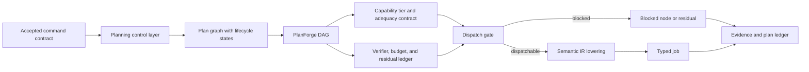

# Consolidation Destination Draft: Planning as a Control Layer, DAGs and Intelligence Arbitrage

Last updated: 2026-06-30

Status: historical destination draft for an executed merge; human/external
review was not completed, and canonical authority now lives in the surviving
chapter and manifest.

This is the destination-chapter draft for the non-pilot planning/DAG-control
consolidation package. It is a review artifact only. It does not edit
`book_structure.json`, delete a chapter, change a URL, rewrite a rendered
chapter, change source mappings, change proof targets, change support states,
authorize a merge, or approve a reader artifact.

Destination continuity ID: `planning-as-a-control-layer`

Proposed displayed title: **Planning as a Control Layer: DAGs and Intelligence
Arbitrage**

Source chapters:

- `planning-as-a-control-layer`
- `planforge-dags-and-intelligence-arbitrage`

Related chapter not merged by this draft:

- `cognitive-compilation-and-semantic-ir`

## Review Purpose

The dry-run package records how the source, proof, reader, fixture, and claim
boundaries can be reconciled in principle. This draft tests whether the
destination reads as one planning-control chapter rather than two adjacent
chapters repeating the plan/DAG argument.

Reviewers should judge whether the combined chapter improves reader flow,
preserves the technical artifacts owned by both source chapters, and protects
the semantic-IR lowering chapter. This draft is not evidence that the merge is
correct. It is the object to review before deciding whether to execute, revise,
defer, or reject the manifest merge.

## Non-Actions

- No manifest edit has been made.
- No source chapter has been deleted, retired, or redirected.
- No source note, external source, proof target, test result, or support state
  has changed.
- No chapter core claim is promoted above `argument`.
- No external comparator is treated as reproducing or validating ASI Stack
  planner quality, scheduler correctness, decomposition accuracy, route
  adequacy, model selection quality, runtime replanning, tool execution, or
  deployment behavior.
- No reader, EPUB, DOCX, PDF, audio, DOI, archive, or release artifact is
  approved by this draft.

## Preservation Ledger

| Surface | Preservation decision |
|---|---|
| Stable ID | Keep `planning-as-a-control-layer` if a future merge proceeds. |
| Folded source chapter | Treat `planforge-dags-and-intelligence-arbitrage` as preserved subclaims, sections, proof hooks, fixture/test rows, and history, not silent deletion. |
| Protected adjacent chapter | Keep `cognitive-compilation-and-semantic-ir` standalone as the semantic atom, IR validity, lowering receipt, repair-ledger, and target-artifact compilation layer. |
| Proposed merged core claim | Planning should be a separate control layer that turns accepted command contracts into schedulable DAGs with explicit dependencies, authority ceilings, context demands, capability-tier assignments, adequacy contracts, verification burdens, cost/quality ledgers, escalation routes, and residuals. |
| Claim label and support | `Design rationale` plus `argument`; no support-state change. |
| Corben/local source union | `planforge`, `viea`, `cognitive_compilation`, `software_magic_grimoire`, `moecot`, `planforge_compiler_arch`, `coherence_exchange`, `tokenmana`. |
| External comparator union | `ext_autogen_2023`, `ext_behavior_trees_robotics_ai_2017`, `ext_integrated_tamp_2020`, `ext_pddl_1998`, `ext_react_2022`, `ext_shop2_2003`, `ext_three_states_plan_fear_2006`, `ext_tla_plus_home_docs`, `ext_tree_of_thoughts_2023`. |
| Adjacent external comparator retained by Cognitive Compilation | `ext_dreamcoder_2020`. |
| Lean modules | Preserve `AsiStackProofs.Planning` and `AsiStackProofs.PlanForge`. |
| Lean proof tags | Preserve `lean:planning.control_layer.operational_invariant`, `lean:planning.control_layer.failure_blocks_promotion`, `lean:planforge.dag.operational_invariant`, and `lean:planforge.dag.failure_blocks_promotion`. |
| Adjacent Lean hooks | Leave `AsiStackProofs.CognitiveCompilation` and `lean:cognitive_compilation.ir.*` proof tags with `cognitive-compilation-and-semantic-ir`. |
| Fixture families | Preserve `plan_graph`, `planforge_dag`, command/job records, and the `experiments/plan_execution_contracts/` valid and expected-invalid fixtures. |
| Handoff if merged | The destination should receive the handoff from command contracts and hand off directly to `cognitive-compilation-and-semantic-ir`. |

## Destination Chapter Draft

The draft below is intentionally written as one chapter skeleton. It collapses
the repeated status, problem, mechanism, test, and handoff cadence while
preserving the distinct control-layer and PlanForge DAG mechanisms.

### Chapter status

This proposed destination chapter would remain conceptual. Its core claim
would remain `Design rationale` with `argument` support. Existing source
notes, schema fixtures, a synthetic plan-execution contract harness, and
finite-record Lean theorems make the planning boundary more inspectable, but
they do not prove planner quality, scheduler correctness, capability-tier
selection, runtime replanning, deployed tool execution, or model-routing
adequacy.

The merge would combine two current record families:

- plan graph records, which ask whether accepted command contracts become
  proposed, blocked, dispatchable, dispatched, replanned, or stopped nodes with
  dependency, context, authority, risk, budget, verification, stop-condition,
  dispatch-receipt, residual, and non-claim fields;
- PlanForge DAG records, which ask whether dependency order, capability tier,
  adequacy contract, verifier, cost envelope, route assignment, merge
  condition, escalation path, and residual behavior are explicit for scheduled
  cognitive work.

Both record families would remain visible in the chapter's implementation
horizon, test plan, source crosswalk, and formalization hooks.

### Drafting guardrail

A plan graph is not a working planner. A DAG can be valid as a record while
still being a poor decomposition, a bad route assignment, an inadequate
capability-tier choice, or an unrealistic schedule. A synthetic harness can
catch cycles, lost requirements, missing receipts, and approval bypasses
without proving runtime scheduling quality.

The destination chapter should not ask readers to believe that PlanForge has
already solved planning. It should ask a narrower systems question: what must a
governed plan record expose before the stack is allowed to lower a node into a
typed job or route it to a specialist?

### Human Reading Path

A plan is not permission. It is a proposed control structure.

When a person asks for work, the stack should not jump from request to action.
It first builds a plan graph. The graph says what depends on what, what context
is needed, which authority is required, which route is cheap enough, which
route is strong enough, what verifier is missing, what budget is available,
what stops the work, and which nodes are still blocked.

The point of the planning layer is not to make action automatic. It is to make
action harder to launder. A node in a plan is not executable until its
dependencies, authority, context, adequacy, verification, and dispatch receipt
are satisfied.

### Problem

Accepted goals need governed plan graphs whose dependencies, authority
requirements, context demands, capability tiers, budgets, adequacy contracts,
verification burdens, stop conditions, dispatch receipts, escalation paths, and
residuals remain inspectable before execution.

Command contracts say what work has been accepted and under what authority.
That still leaves the stack with a control problem. Which steps are needed?
Which can run in parallel? Which require stronger models, tools, humans,
context, or proofs? Which are blocked by missing approval? Which failures
should cause repair, replanning, escalation, or stop?

The planning layer owns those questions. It builds plan graphs and DAGs that
coordinate work without owning memory, reasoning, authority, side effects, or
artifact truth.

### Why existing approaches are insufficient

Planning cannot be collapsed into prompting, memory, reasoning, routing, or
execution because a plausible plan graph can still hide authority overreach,
cyclic dependencies, inadequate context, missing verification, unsafe
dispatch, bad tier selection, or displaced human-review cost.

A prompt outline may look like a plan but lack lifecycle states. A chain of
model thoughts may list tasks but not preserve authority or dispatch receipts.
A DAG may be acyclic but still assign cheap cognition where the adequacy
predicate requires expert review. A cost-saving route may look efficient while
moving verification, repair, merge, or human-review burden downstream.

External comparators help position the chapter but do not prove it. Planning
languages, HTN planning, task-and-motion planning, behavior trees, ReAct,
Tree-of-Thoughts, multi-agent frameworks, TLA+ documentation, and game-AI
planning traditions all illuminate adjacent control and scheduling problems.
The ASI Stack destination chapter is not claiming those systems have been
reproduced here. It uses them as comparators while asking a systems question:
what plan record prevents a proposed route from becoming unauthorized action?

### Core Claim

Planning should be a separate control layer that turns accepted command
contracts into schedulable DAGs with explicit dependencies, authority ceilings,
context demands, capability-tier assignments, adequacy contracts, verification
burdens, cost/quality ledgers, escalation routes, and residuals.

Support boundary: this would remain an `argument` support claim. The source
corpus supports the architecture vocabulary and drafting lineage. The current
fixtures and Lean modules show that the repository can express record-shape
checks, synthetic negative cases, and small finite invariants. They do not show
that a planner decomposes tasks well, that scheduler routes are optimal, that
capability-tier assignments are correct, or that runtime replanning works in a
deployed system.

The folded source claim from `planforge-dags-and-intelligence-arbitrage`
should become a preserved subclaim: PlanForge-style DAG scheduling can support
intelligence arbitrage only when node-level capability, adequacy, verification,
cost, repair, escalation, and residual burdens are explicit.

### Mechanism

The destination mechanism has four lanes.

The first lane is control-state planning. A plan receives an accepted command
contract and turns it into nodes with lifecycle states: proposed,
blocked-context, blocked-authority, blocked-dependency, blocked-verification,
dispatchable, dispatched, replanned, residual, or stopped. The lifecycle state
prevents a candidate graph from masquerading as permission to execute.

The second lane is dependency and dispatch discipline. Plan nodes carry
dependencies, context requests, authority requirements, tool requirements,
worker requirements, risk budgets, compute budgets, verification plans,
replanning policies, stop conditions, and failure behavior. Dispatchable nodes
need receipts. Blocked nodes keep residuals rather than being quietly skipped.

The third lane is PlanForge scheduling and intelligence arbitrage. The DAG
annotates each node with capability tier, adequacy contract, verifier, cost
envelope, route assignment, merge condition, escalation path, and residual
behavior. A cheap route is only a win after verification, repair, downstream
utility, and human-review cost are counted.

The fourth lane is handoff without ownership. Planning requests context from
VCM, asks routing for specialist capability, hands accepted obligations to
semantic IR, and lowers only dispatchable nodes into typed jobs. It does not
become memory, proof, authority, execution, or artifact truth.

The important movement is from request to governed plan, not from request to
action. The plan can say no, stop, wait, escalate, or ask for more evidence.

### Interfaces

Command contracts supply accepted work, objective, constraints, output
contract, authority ceiling, verification requirements, failure behavior, and
residual boundaries.

VCM supplies context packets and adequacy signals. The planner can request
context but cannot treat context availability as proof or permission.

Routing consumes capability annotations. The planner can ask for a specialist
or model tier but should not treat a cheap route as adequate until the node's
quality predicate and verification burden are satisfied.

Cognitive compilation receives accepted plan obligations and compiles them
into semantic atoms, lowering receipts, target artifacts, and repair loops. It
remains the separate IR chapter.

Labor OS receives only dispatchable typed jobs. A proposed, blocked, or
review-only node is not a job.

Evidence ledgers record cost, quality, verification, residual, and non-claim
outcomes. They are where later evidence transitions would be reviewed.

### Invariants

- Plan nodes inherit or lower parent authority ceilings.
- Unsatisfied required constraints block dispatch.
- Dispatchable plan graphs are acyclic and dependency ordered.
- Failed quality predicates escalate or emit residuals.
- Candidate, blocked, and review-only nodes do not imply execution permission.
- Runtime replanning preserves authority limits and stop conditions.
- Tool selection is justified by task requirements and authority.
- Cost savings do not remove required verification.
- Cheap routes do not count as adequate until verification and downstream
  utility are counted.

### Failure modes

Scope creep happens when a plan expands beyond the accepted command contract.

Planning without replanning happens when feedback arrives but the plan cannot
update authority, stop conditions, dependencies, or residuals.

Dependency cycles make a graph look structured while hiding an impossible
execution order.

Dispatch laundering happens when a proposed or blocked node becomes a job
because it appears in the graph.

Wrong capability-tier selection routes hard work to cheap cognition without
detecting quality failure.

Economic optimization overriding safety happens when cost savings erase
verification, approval, or human-review requirements.

Replanning erasure happens when feedback changes the plan while hiding the
authority, stop-condition, or residual delta.

Hidden review burden happens when a cheap automated route depends on unpaid
human cleanup that the ledger never counts.

### Minimum Viable Implementation

The minimum viable implementation is not a deployed planner. It is a public
record surface that can represent plan control states and reject dishonest
dispatch.

The implementation should preserve:

- `schemas/plan_graph.schema.json`;
- `schemas/planforge_dag.schema.json`;
- `schemas/command_contract.schema.json`;
- `schemas/hive_job_contract.schema.json`;
- `schemas/semantic_atom.schema.json`;
- `experiments/plan_execution_contracts/fixtures/valid_dispatchable_linear_plan.json`;
- `experiments/plan_execution_contracts/fixtures/valid_blocked_authority_plan.json`;
- `experiments/plan_execution_contracts/fixtures/invalid_cycle_in_dag.json`;
- `experiments/plan_execution_contracts/fixtures/invalid_contract_mismatch.json`;
- `experiments/plan_execution_contracts/fixtures/invalid_requirement_lost.json`;
- `experiments/plan_execution_contracts/fixtures/invalid_dispatch_without_receipt.json`;
- `experiments/plan_execution_contracts/fixtures/invalid_approval_bypass.json`;
- `python3 scripts/validate_plan_execution_contracts.py`.

That MVI is useful because it tests the planning boundary. It does not prove
that a real planner decomposes tasks well, predicts context demand, selects
the right capability tier, schedules work efficiently, replans correctly, or
executes tools safely.

### Beyond the State of the Art

The mature version is a governed scheduler and capacity allocator for
cognitive work. It does not just draw a DAG. It turns accepted command
contracts into schedulable units with dependency order, context demand,
authority state, capability tier, adequacy contract, verifier, cost envelope,
route assignment, merge condition, escalation path, residual behavior, and
typed-job handoff.

In a mature planning control plane, intelligence arbitrage is measured after
verification, repair, merge, human review, and residual cost are counted. A
cheap route only counts as adequate when its output satisfies the node's
adequacy contract and remains useful to downstream dependents. An expensive
route is justified when the risk, context burden, quality predicate, or
failure cost demands it.

The endpoint is not "AI makes better plans." The endpoint is governed
coordination: every plan node knows why it exists, what it needs, what it may
not do, when it can dispatch, and what residual remains if it cannot.

### Codex test plan

The destination should preserve the existing test plan without turning it into
a broader result:

- decomposition accuracy test;
- dependency ordering test;
- context-demand prediction test;
- runtime replanning test;
- dispatch-state enforcement test;
- replanning-delta audit;
- DAG acyclicity test;
- capability-tier assignment test;
- escalation trigger test;
- approval-bypass rejection;
- requirement-loss rejection.

The current synthetic plan-execution contract harness is a bounded
cross-record gate. It is not a planner benchmark, deployed scheduler test,
parser-quality result, runtime adapter test, tool-execution trace, or proof of
AI behavior.

### Formalization hooks

The destination should preserve these implemented finite-record Lean hooks:

- `lean:planning.control_layer.operational_invariant` in
  `AsiStackProofs.Planning`;
- `lean:planning.control_layer.failure_blocks_promotion` in
  `AsiStackProofs.Planning`;
- `lean:planforge.dag.operational_invariant` in
  `AsiStackProofs.PlanForge`;
- `lean:planforge.dag.failure_blocks_promotion` in
  `AsiStackProofs.PlanForge`.

The proof hooks show finite-record invariants: plan nodes preserve authority
ceilings, unsatisfied constraints block dispatch, dispatchable DAGs are
acyclic and dependency ordered, and failed quality predicates escalate or emit
residuals. They do not prove decomposition quality, scheduler optimality,
capability-tier correctness, runtime replanning, or model behavior.

Adjacent proof hooks should remain with the protected standalone semantic-IR
chapter:

- `lean:cognitive_compilation.ir.operational_invariant`;
- `lean:cognitive_compilation.ir.failure_blocks_promotion`.

### Source crosswalk

Corben/local sources for the destination:

- `planforge`;
- `viea`;
- `cognitive_compilation`;
- `software_magic_grimoire`;
- `moecot`;
- `planforge_compiler_arch`;
- `coherence_exchange`;
- `tokenmana`.

External comparators for positioning:

- `ext_autogen_2023`;
- `ext_behavior_trees_robotics_ai_2017`;
- `ext_integrated_tamp_2020`;
- `ext_pddl_1998`;
- `ext_react_2022`;
- `ext_shop2_2003`;
- `ext_three_states_plan_fear_2006`;
- `ext_tla_plus_home_docs`;
- `ext_tree_of_thoughts_2023`.

No listed external source is local reproduction evidence. The destination
should use these records to orient readers around planning languages,
hierarchical planning, task-and-motion planning, behavior trees, agentic
reasoning/action frameworks, multi-agent systems, formal specification, and
tree-search prompting while preserving the claim-support boundary.

### Repetition-removal ledger

This destination removes one repeated planning/DAG skeleton. The current
chapters both explain why unstructured prompting and uniform cognition are
insufficient; the destination says that once and then gives more room to the
control-state and scheduling details.

Preserved substructures:

- plan graph lifecycle states;
- dependency graph and acyclicity;
- context, tool, worker, authority, risk, compute, and verification
  requirements;
- PlanForge capability tiers and intelligence-arbitrage annotations;
- adequacy contracts, merge conditions, cost-quality ledgers, escalation, and
  residuals;
- dispatch receipts and typed-job handoffs;
- proof hooks for authority preservation, dispatch blocking, DAG ordering, and
  failed-quality escalation;
- synthetic plan-execution fixture routing.

Saved space should go to:

- clearer examples of proposed, blocked, dispatchable, and dispatched nodes;
- sharper explanation of why semantic IR remains separate;
- stronger treatment of intelligence arbitrage as adequacy accounting rather
  than cheap-model preference;
- explicit non-claims around deployed planning and scheduling behavior.

Reader-work disposition: curated-reader graduation for
`planning-as-a-control-layer` and
`planforge-dags-and-intelligence-arbitrage` should pause until this draft is
executed, explicitly deferred, or rejected/retained. Local prose cleanup is
fine when it does not entrench the duplicate skeleton. Reader curation may
continue on `cognitive-compilation-and-semantic-ir`.

### Summary

Planning is the stack's control plane for work. It receives accepted command
contracts, builds dependency graphs, marks what is blocked or dispatchable,
assigns capability tiers, budgets verification, and records residuals. It
coordinates memory, routing, compilation, execution, and evidence without
owning any of them.

PlanForge DAGs are the concrete scheduling lane inside that control plane.
They make intelligence arbitrage accountable: each node gets the minimum
adequate capability only after authority, context, verification, cost, repair,
merge, and residual burdens are counted.

The boundary remains narrow. This chapter specifies governed planning and DAG
scheduling. Semantic IR and lowering receipts remain the job of
`cognitive-compilation-and-semantic-ir`; typed jobs and runtime action remain
downstream in Labor OS.

### Handoff

The next layer turns accepted plan obligations into compiler-visible
intermediate representations. Once a plan graph knows which nodes are
dispatchable, blocked, residualized, or ready for lowering, the stack needs a
semantic IR that can preserve obligations while generating artifacts, schemas,
proof targets, code, or typed jobs.

That is the job of `cognitive-compilation-and-semantic-ir`.

## Review Decision Surface

Possible review outcomes:

- Execute merge: accept `planning-as-a-control-layer` as the continuity ID,
  fold `planforge-dags-and-intelligence-arbitrage`, preserve proof/source/test
  history, and update manifest, outline, Appendix C, reader surfaces, handoffs,
  URL policy, and validation in one controlled commit.
- Revise: keep the merge candidate open but require stronger destination prose,
  clearer semantic-IR boundary handling, or more precise source/proof/test
  reconciliation before execution.
- Defer: keep both chapters for the current release and record that duplicate
  planning/DAG skeletons are accepted temporarily.
- Reject or retain: preserve both chapters because PlanForge DAG scheduling
  still owns a distinct chapter artifact, proof family, evidence lane, or
  reader throughline.

No chapter core claim is promoted above `argument` by any review outcome.

## Non-Claims

- This draft does not merge chapters.
- This draft does not change Appendix C support states.
- This draft does not create source-derived, external-literature-backed,
  proof-derived, prototype-backed, synthetic-test-backed, or empirical support.
- This draft does not approve any reader, EPUB, DOCX, PDF, audio, DOI, archive,
  or release artifact.
- This draft does not prove planner quality, scheduler correctness,
  decomposition accuracy, model-routing adequacy, runtime replanning,
  tool-execution behavior, deployed runtime behavior, or ASI capability.
