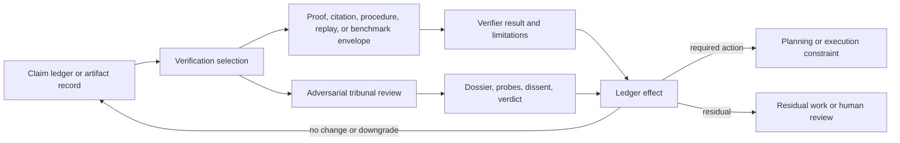

# Consolidation Destination Draft: Proof-Carrying Claims and Adversarial Review

Last updated: 2026-06-29

Status: review-ready draft; human/external review not completed.

This is the destination-chapter draft for the non-pilot
verification/adversarial-review consolidation package. It is a review artifact
only. It does not edit `book_structure.json`, delete a chapter, change a URL,
rewrite a rendered chapter, change source mappings, change proof targets,
change support states, authorize a merge, or approve a reader artifact.

Destination continuity ID: `spinoza-verification-and-proof-carrying-claims`

Proposed displayed title: **Proof-Carrying Claims and Adversarial Review**

Source chapters:

- `spinoza-verification-and-proof-carrying-claims`
- `unified-adaptive-tribunal-and-adversarial-review`

Related chapter not merged by this draft:

- `claim-ledgers-and-belief-revision`

## Review Purpose

The dry-run package records how the source, proof, reader, fixture, and claim
boundaries can be reconciled in principle. This draft tests whether the
destination reads as one verification-event chapter rather than two adjacent
chapters repeating the stronger-review argument.

Reviewers should judge whether the combined chapter improves reader flow,
preserves the technical artifacts owned by both source chapters, and protects
the claim-ledger substrate. This draft is not evidence that the merge is
correct. It is the object to review before deciding whether to execute, revise,
defer, or reject the manifest merge.

## Non-Actions

- No manifest edit has been made.
- No source chapter has been deleted, retired, or redirected.
- No source note, external source, proof target, test result, or support state
  has changed.
- No chapter core claim is promoted above `argument`.
- No external comparator is treated as reproducing or validating ASI Stack
  verifier quality, theorem validity, citation accuracy, semantic equivalence,
  tribunal quality, reviewer independence, verdict correctness, runtime
  behavior, or deployment behavior.
- No reader, EPUB, DOCX, PDF, audio, DOI, archive, or release artifact is
  approved by this draft.

## Preservation Ledger

| Surface | Preservation decision |
|---|---|
| Stable ID | Keep `spinoza-verification-and-proof-carrying-claims` if a future merge proceeds. |
| Folded source chapter | Treat `unified-adaptive-tribunal-and-adversarial-review` as preserved subclaims, sections, proof hooks, fixture/test rows, and history, not silent deletion. |
| Protected adjacent chapter | Keep `claim-ledgers-and-belief-revision` standalone as the durable claim identity, support-state, contradiction, uncertainty, and revision-history substrate. |
| Proposed merged core claim | Selected claims and artifacts should move through proof-carrying, justification-carrying, or adversarial-review envelopes that record tier, interpretation mapping, evidence dossier, verifier or tribunal result, dissent, limitations, failed attempts, required actions, residuals, and ledger effects. |
| Claim label and support | `Design rationale` plus `argument`; no support-state change. |
| Corben/local source union | `spinoza`, `genesiscode`, `coherence_exchange`, `verification_bandwidth`, `treellm`, `uat`, `talos`. |
| External comparator union | `ext_lean4_theorem_proving`, `ext_proof_carrying_code_1997`, `ext_contestable_ai_design_2022`. |
| Adjacent external comparators retained by Claim Ledgers | `ext_alce_2023`, `ext_checklist_2020`, `ext_self_rag_2023`. |
| Lean modules | Preserve `AsiStackProofs.ProofCarryingClaims` and `AsiStackProofs.Tribunal`. |
| Lean proof tags | Preserve `lean:spinoza.proof_carrying.operational_invariant`, `lean:spinoza.proof_carrying.failure_blocks_promotion`, `lean:tribunal.review.operational_invariant`, and `lean:tribunal.review.failure_blocks_promotion`. |
| Adjacent Lean hooks | Leave `AsiStackProofs.ClaimLedger` and `lean:claims.ledger.*` proof tags with `claim-ledgers-and-belief-revision`. |
| Fixture families | Preserve `proof_carrying_claim`, `tribunal_review_record`, and the `experiments/proof_carrying_claims/` plus `experiments/tribunal_review/` valid and expected-invalid fixtures. |
| Handoff if merged | The destination should receive the handoff from `claim-ledgers-and-belief-revision`, write back into the ledger, and hand off directly to `labor-os-and-typed-jobs`. |

## Destination Chapter Draft

The draft below is intentionally written as one chapter skeleton. It collapses
the repeated status, problem, mechanism, test, and handoff cadence while
preserving the distinct proof-carrying and adversarial-review mechanisms.

### Chapter status

This proposed destination chapter would remain conceptual. Its core claim
would remain `Design rationale` with `argument` support. Existing source notes,
schema fixtures, synthetic proof-carrying-claim and tribunal-review harnesses,
and finite-record Lean theorems make the verification-event boundary more
inspectable, but they do not prove theorem validity, citation accuracy,
semantic equivalence, reviewer independence, verdict correctness, deployed
review quality, runtime behavior, or whole-system epistemic correctness.

The merge would combine two current record families:

- proof-carrying claim records, which ask whether selected claims have an
  explicit tier, justification type, interpretation mapping, verifier artifact,
  failed-attempt route, formal scope, consumer requirement, support-state
  effect, residual route, and non-claim boundary;
- tribunal review records, which ask whether contested or high-risk claims and
  artifacts have bounded dossiers, reviewer roles, adversarial probes,
  evidence-linked findings, dissent, cycle caps, unchanged-evidence guards,
  verdicts, required actions, and constraint effects.

Both record families would remain visible in the chapter's implementation
horizon, test plan, source crosswalk, and formalization hooks.

### Drafting guardrail

Proof-carrying is not magic. A proof artifact can validate a narrow formal
object while leaving the broader natural-language claim unproved. A citation
dossier can support a limited claim while leaving another inference
unsupported. A tribunal can make dissent visible and issue scoped constraints
without being correct in every verdict.

The destination chapter should not ask readers to trust a verification label.
It should ask a narrower systems question: when a claim or artifact is
important enough to need stronger treatment, what record prevents failed
verification, formalization mismatch, missing evidence, repeated review,
dissent, and residual uncertainty from being laundered into support?

### Human Reading Path

Some claims are cheap enough to leave as drafts. Other claims shape plans,
permissions, releases, or safety boundaries. Those claims need more than a
well-written paragraph.

The first upgrade is proof-carrying or justification-carrying structure. The
system chooses a tier: formal proof, citation dossier, executable procedure,
replay log, benchmark artifact, tribunal review, or downgrade route. It records
the mapping from the human-language claim to the artifact that was checked. It
also records the limits of that check.

When the claim is contested, high-risk, or mismatched, the next upgrade is
adversarial review. A tribunal-style record defines a dossier, assigns roles,
runs probes, preserves dissent, and issues scoped actions. The result goes back
to the claim ledger as a bounded effect: no change, downgrade, block, revise,
accept within scope, or escalate.

### Problem

High-value claims and high-risk artifacts need a governed verification path
that can choose proof, citation, procedure, replay, benchmark, or
adversarial-review treatment without laundering failed, mismatched, or
contested evidence into support.

The claim ledger gives claims durable identity and history. That is necessary
but not enough. Some claims need evidence stronger than ordinary prose. Some
need a formal proof. Some need citations. Some need an executable procedure or
replay. Some need a tribunal because the mapping is contested, the stakes are
high, or the evidence points in different directions.

This destination chapter owns those verification events. It defines how a
claim or artifact receives a justification envelope, how failure is preserved,
how adversarial review operates, and how bounded results write back to the
ledger without overclaiming.

### Why existing approaches are insufficient

Neural generation, one-pass self-critique, and informal review can produce
plausible justification language without preserving proof scope, verifier
result, evidence dossier, dissent, failed attempts, verdict constraints, or
downgrade routes.

A model can explain why a claim sounds right without checking it. A proof can
verify the wrong formalization. A citation can support a nearby statement but
not the target inference. A reviewer can agree without independent evidence. A
tribunal can be rerun until it accepts unchanged evidence. If the record does
not preserve those failures, review becomes a confidence-laundering machine.

External comparators help position the chapter but do not prove it.
Proof-carrying-code literature, Lean theorem-proving materials, and
contestable-AI design work all illuminate adjacent parts of the problem. The
ASI Stack destination chapter is not claiming those systems have been
reproduced here. It uses them as comparators while asking a systems question:
what record should exist before a claim receives stronger standing?

### Core Claim

Selected claims and artifacts should move through proof-carrying,
justification-carrying, or adversarial-review envelopes that record tier,
interpretation mapping, evidence dossier, verifier or tribunal result, dissent,
limitations, failed attempts, required actions, residuals, and ledger effects.

Support boundary: this would remain an `argument` support claim. The source
corpus supports the architecture vocabulary and drafting lineage. The current
fixtures and Lean modules show that the repository can express record-shape
checks, synthetic negative cases, and small finite invariants. They do not show
that an open-domain verifier is correct, that citations are accurate, that
formalizations are semantically equivalent to prose, that reviewers are
independent, or that tribunal verdicts are correct.

The folded source claim from
`unified-adaptive-tribunal-and-adversarial-review` should become a preserved
subclaim: tribunal review is required when claim stakes, evidence conflict,
formalization mismatch, or artifact risk exceed what one verifier can settle.

### Mechanism

The destination mechanism has four lanes.

The first lane is verification selection. A claim or artifact enters from the
claim ledger, planning layer, execution layer, or release gate. The system
chooses a treatment: formal proof, citation dossier, executable procedure,
replay log, benchmark artifact, tribunal review, downgrade, block, or
escalation. The choice records risk, claim type, support-state effect, and
consumer requirements.

The second lane is proof-carrying or justification-carrying structure. A
record names the target claim, required tier, interpretation mapping,
justification artifact, verifier result, failed attempts, limitations, formal
scope, source refs, semantic adequacy notes, residual route, and non-claims. A
successful proof can support a narrow formal object without promoting a
broader natural-language claim.

The third lane is adversarial review. A tribunal-style record constructs a
dossier, assigns role-separated reviewers, runs adversarial probes, preserves
evidence-linked findings, records dissent, applies cycle caps, guards against
unchanged-evidence laundering, and issues scoped verdicts with required
actions or constraint effects.

The fourth lane is ledger writeback. Results become explicit ledger effects:
no change, bounded support review, downgrade, block, revise, accept within
scope, dispatch blocker, authority narrowing, human sign-off, or residual
work. Failed and mismatched attempts remain useful because they prevent the
same overclaim from returning without new evidence or corrected mapping.

The important movement is from "the system says it checked" to "the system can
show what was checked, by which route, what failed, what remains out of scope,
and what effect the result is allowed to have."

### Interfaces

Claim ledgers supply stable claim identity, support state, provenance,
contradiction refs, revision history, and promotion blockers. The destination
does not replace that substrate. It writes bounded verification outcomes back
to it.

VCM and semantic context cells supply source and evidence objects. Proof,
citation, and tribunal records should point to source refs and context cells
without treating context availability as verification success.

Verification bandwidth scopes adequacy and risk. A claim can need more than
the currently available context or reviewer capacity.

GenesisCode, Lean, Circle-style proof contracts, procedure logs, replay logs,
and benchmark artifacts can supply formal or executable evidence when the
claim type permits it.

UAT-style tribunal review handles contested, high-risk, or mismatched cases.
It does not become an oracle. It produces scoped verdicts, required actions,
dissent records, and residuals.

Planning and execution receive constraints from verification outcomes. A
failed proof, unresolved dissent, or missing tribunal review can block
dispatch, narrow authority, require source fetch, or demand human sign-off.

### Invariants

- Proof tier is explicit.
- Formal tiers require formal proof artifacts.
- Citation tiers require citation or dossier artifacts.
- Procedure tiers require procedure logs or schema fixtures.
- Failed, timed-out, or mismatched verification blocks promotion or routes to
  downgrade, no change, block, or escalation.
- Narrow passes cannot promote broader natural-language claims without a
  semantic adequacy record.
- Dissent remains visible.
- Accept verdicts require scoped evidence.
- High-risk artifacts cannot bypass required tribunal review.
- Prior review over unchanged evidence cannot quietly reverse a rejection into
  acceptance.

### Failure modes

Certified delusion happens when a formal-looking artifact decorates a false or
unsupported natural-language claim.

Invalid formalization happens when the proof target no longer means the prose
claim readers care about.

Missing justification artifact happens when a claim asks for a strong tier but
does not carry the proof, citation, procedure, replay, benchmark, or tribunal
record required for that tier.

Theorem laundering happens when a narrow formal theorem is used to promote a
larger systems claim.

Reviewer collusion happens when multiple reviewers share the same blind spot,
prompt, source error, or incentive.

Consensus theater happens when agreement is recorded without evidence-linked
findings or unresolved dissent.

Critique without action happens when review produces objections but no ledger
effect, required action, blocker, downgrade, or residual.

Repeated-review laundering happens when unchanged evidence is reviewed until a
desired answer appears.

### Minimum Viable Implementation

The minimum viable implementation is not an open-domain verifier or tribunal.
It is a public record surface that can represent verification events and reject
obvious laundering.

The implementation should preserve:

- `schemas/proof_carrying_claim.schema.json`;
- `schemas/tribunal_review_record.schema.json`;
- `schemas/claim_record.schema.json`;
- `schemas/belief_revision_record.schema.json`;
- `experiments/proof_carrying_claims/fixtures/valid_formal_narrow_pass.json`;
- `experiments/proof_carrying_claims/fixtures/valid_citation_dossier_no_change.json`;
- `experiments/proof_carrying_claims/fixtures/valid_mismatch_escalates.json`;
- `experiments/proof_carrying_claims/fixtures/invalid_pass_missing_artifact_refs.json`;
- `experiments/proof_carrying_claims/fixtures/invalid_mismatch_promotes.json`;
- `experiments/proof_carrying_claims/fixtures/invalid_formal_tier_wrong_justification.json`;
- `experiments/proof_carrying_claims/fixtures/invalid_timeout_overpromotes_support.json`;
- `experiments/proof_carrying_claims/fixtures/invalid_negative_missing_failed_attempt.json`;
- `experiments/tribunal_review/fixtures/valid_accept_with_scope_constraints.json`;
- `experiments/tribunal_review/fixtures/valid_block_unchanged_evidence.json`;
- `experiments/tribunal_review/fixtures/valid_high_risk_revise_with_dissent.json`;
- `experiments/tribunal_review/fixtures/invalid_accept_missing_evidence.json`;
- `experiments/tribunal_review/fixtures/invalid_high_risk_no_probes.json`;
- `experiments/tribunal_review/fixtures/invalid_prior_review_laundering.json`;
- `experiments/tribunal_review/fixtures/invalid_dissent_without_unresolved_issue.json`;
- `experiments/tribunal_review/fixtures/invalid_weak_non_claims.json`;
- `python3 scripts/validate_proof_carrying_claims.py`;
- `python3 scripts/validate_tribunal_review.py`.

That MVI is useful because it tests the record boundary. It does not prove
that theorem checkers validate the intended prose claim, that citations are
accurate, that reviewers are independent, that verdicts are correct, or that a
deployed AI system will follow the resulting constraints.

### Beyond the State of the Art

The mature version is a verification operating system. It does not try to
formalize every sentence. It routes each high-value claim or artifact to the
cheapest adequate verifier or review process, then writes a bounded result
back to the ledger.

In that mature system, a claim can ask for a proof, citation dossier,
procedure log, replay artifact, benchmark record, tribunal verdict, human
sign-off, or downgrade route. The system records the interpretation mapping,
verifier result, failed attempts, timeouts, semantic adequacy, dissent,
required actions, and non-claims. A formal pass can remain narrow. A tribunal
acceptance can remain scoped. A failed attempt can become a blocker against
future overpromotion.

The endpoint is not "AI proves everything." The endpoint is anti-laundering
epistemic machinery: stronger claims require stronger artifacts, failures
remain visible, and every support-state effect is routed through a record that
can be audited.

### Codex test plan

The destination should preserve the existing test plan without turning it into
a broader result:

- proof artifact presence test;
- tier assignment test;
- formalization mismatch review;
- failed verification route test;
- timeout overpromotion rejection;
- adversarial review coverage test;
- dissent preservation test;
- consensus evidence test;
- prior-review laundering rejection;
- high-risk missing-probe rejection.

The current synthetic proof-carrying-claim and tribunal-review harnesses are
bounded record-discipline gates. They are not open-domain verifier tests,
theorem-validity results, citation-accuracy audits, reviewer-independence
audits, verdict-correctness results, runtime traces, or deployed review
systems.

### Formalization hooks

The destination should preserve these implemented finite-record Lean hooks:

- `lean:spinoza.proof_carrying.operational_invariant` in
  `AsiStackProofs.ProofCarryingClaims`;
- `lean:spinoza.proof_carrying.failure_blocks_promotion` in
  `AsiStackProofs.ProofCarryingClaims`;
- `lean:tribunal.review.operational_invariant` in
  `AsiStackProofs.Tribunal`;
- `lean:tribunal.review.failure_blocks_promotion` in
  `AsiStackProofs.Tribunal`.

The proof hooks show finite-record invariants: formal support tiers require a
valid proof or justification artifact, failed verifier results block or
downgrade rather than promote, tribunal verdicts include reviewer roles and
dissent, and high-risk artifacts cannot be accepted when required tribunal
review is absent. They do not prove verifier quality, theorem adequacy,
semantic equivalence, reviewer independence, or verdict correctness.

Adjacent proof hooks should remain with the protected standalone claim-ledger
chapter:

- `lean:claims.ledger.operational_invariant`;
- `lean:claims.ledger.failure_blocks_promotion`.

### Source crosswalk

Corben/local sources for the destination:

- `spinoza`;
- `genesiscode`;
- `coherence_exchange`;
- `verification_bandwidth`;
- `treellm`;
- `uat`;
- `talos`.

External comparators for positioning:

- `ext_lean4_theorem_proving`;
- `ext_proof_carrying_code_1997`;
- `ext_contestable_ai_design_2022`.

No listed external source is local reproduction evidence. The destination
should use these records to orient readers around proof-carrying code,
theorem-proving practice, and contestable review surfaces while preserving the
claim-support boundary.

### Repetition-removal ledger

This destination removes one repeated verification skeleton. The current
chapters both explain why ordinary generated prose and unstructured review are
insufficient; the destination says that once and then gives more room to the
verification event lifecycle.

Preserved substructures:

- proof-carrying and justification-carrying tiers;
- interpretation mappings and semantic adequacy notes;
- verifier artifacts, failed attempts, timeouts, and mismatches;
- tribunal dossiers, role-separated reviewers, probes, and cycle caps;
- dissent, unchanged-evidence guards, verdict constraints, and required
  actions;
- ledger effects and promotion blockers;
- proof hooks for verifier-result discipline and tribunal-review discipline;
- synthetic proof-carrying and tribunal-review fixture routing.

Saved space should go to:

- clearer examples of narrow formal proof versus broad prose claim;
- sharper treatment of failed or mismatched verification as useful negative
  evidence;
- clearer tribunal lifecycle and dissent preservation;
- explicit non-claims around theorem validity, citation accuracy, reviewer
  independence, verdict correctness, and runtime behavior.

Reader-work disposition: curated-reader graduation for
`spinoza-verification-and-proof-carrying-claims` and
`unified-adaptive-tribunal-and-adversarial-review` should pause until this
draft is executed, explicitly deferred, or rejected/retained. Local prose
cleanup is fine when it does not entrench the duplicate skeleton. Reader
curation may continue on `claim-ledgers-and-belief-revision`.

### Summary

Proof-carrying claims and adversarial review are one verification surface. The
claim ledger says what the claim is and how its belief state changes. This
chapter says what kind of verification event is adequate before a selected
claim or artifact can ask for stronger standing.

Some claims need proof. Some need citations. Some need procedures, replay logs,
benchmarks, or tribunal review. Every route needs a record that names its
scope, artifact, failed attempts, limitations, dissent, and allowed ledger
effect. Without that record, stronger-sounding justification can become a
laundering channel.

The boundary remains narrow. This chapter specifies verification events.
Durable claim identity and belief revision remain the job of
`claim-ledgers-and-belief-revision`; runtime action remains downstream in Labor
OS and typed jobs.

### Handoff

The next layer turns accepted constraints, blocked states, and required
actions into work. Once a verification event narrows a claim, blocks a route,
requires source fetch, demands human sign-off, or creates residual work, the
execution system needs typed jobs that preserve those constraints.

That is the job of `labor-os-and-typed-jobs`.

## Review Decision Surface

Possible review outcomes:

- Execute merge: accept `spinoza-verification-and-proof-carrying-claims` as the
  continuity ID, fold `unified-adaptive-tribunal-and-adversarial-review`,
  preserve proof/source/test history, and update manifest, outline, Appendix C,
  reader surfaces, handoffs, URL policy, and validation in one controlled
  commit.
- Revise: keep the merge candidate open but require stronger destination prose,
  clearer claim-ledger boundary handling, or more precise source/proof/test
  reconciliation before execution.
- Defer: keep both chapters for the current release and record that duplicate
  verification/review skeletons are accepted temporarily.
- Reject or retain: preserve both chapters because tribunal review still owns a
  distinct chapter artifact, proof family, evidence lane, or reader
  throughline.

No chapter core claim is promoted above `argument` by any review outcome.

## Non-Claims

- This draft does not merge chapters.
- This draft does not change Appendix C support states.
- This draft does not create source-derived, external-literature-backed,
  proof-derived, prototype-backed, synthetic-test-backed, or empirical support.
- This draft does not approve any reader, EPUB, DOCX, PDF, audio, DOI, archive,
  or release artifact.
- This draft does not prove theorem validity, citation accuracy, semantic
  equivalence, reviewer independence, verdict correctness, deployed review
  behavior, runtime behavior, or ASI capability.
