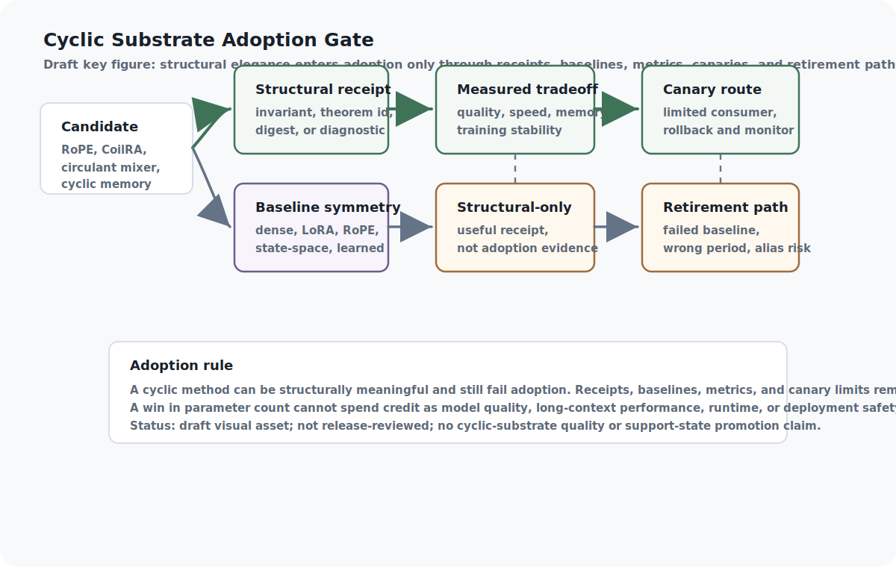

<!--
Curated reader manuscript draft.
chapter_id: coilra-multicoil-rope-and-cyclic-mixers
generated_baseline_ref: build/reader_edition/chapters/coilra-multicoil-rope-and-cyclic-mixers.qmd
live_source_ref: chapters/coilra-multicoil-rope-and-cyclic-mixers.qmd@fbd273622
This file is a reader-prose derivative only. Preserve claim meaning,
support-state boundaries, source boundaries, proof/test status,
implementation horizons, and release blockers.
-->

# CoilRA, MultiCoil RoPE, and Cyclic Mixers

Cyclic memory made residue, winding, freshness, coverage, and recurrence exits
inspectable without promoting retrieval or reasoning quality. CoilRA and
cyclic mixers take that same discipline into model mechanisms. A cyclic
adapter, RoPE receipt, circulant mixer, or phase feature may carry a useful
structural fact, but adoption still needs ordinary baselines, tradeoff
metrics, hardware notes, failure cases, and rollback.

Cyclic structure is seductive because it looks like order.

A phase bank can be exact. A RoPE receipt can distinguish positions inside its
declared model. A circulant mixer can expose a clean law. A block-cyclic route
can reduce parameters. A MultiCoil feature can make winding visible. Those are
real structural facts. They are also easy to overspend.

The discipline is simple: a cyclic substrate is allowed into
the architecture as a candidate, not as a victory. It may bring a structural
receipt, a parameter ledger, an alias diagnostic, or a cleaner evaluation
boundary. It does not bring better model quality, longer context, faster
runtime, lower memory, hardware efficiency, training stability, or deployment
readiness until the relevant workload proves that axis against ordinary
baselines.

The architecture can be friendly to cyclic methods without becoming credulous.
It only has to keep every ledger separate.

{#reader-fig-cyclic-substrate-adoption-gate fig-alt="Draft cyclic substrate adoption gate figure showing a cyclic candidate such as RoPE, CoilRA, a circulant mixer, or cyclic memory moving through structural receipts, baseline symmetry, measured tradeoffs, canary routing, and retirement paths."}

Figure boundary: this draft reader aid shows how cyclic substrates would earn
adoption. It is not release-reviewed art and does not prove model quality,
context-length improvement, hardware performance, transfer, or deployment.

## Problem

Model mechanisms can contain genuine cyclic or block-cyclic structure. Position
encodings, adapters, route heads, phase features, and mixers may all involve
residue classes, winding, recurrence, circulant convolution, relative phase,
or block-cyclic routes.

That structure can matter. It can make aliases visible. It can make position
contracts inspectable. It can reduce some parameters. It can expose where a
route has cyclic symmetry and where it does not. It can give the proof system a
small finite fact to check before a model experiment is even worth running.

The problem is adoption pressure. Once a substrate has elegant mathematics,
the surrounding system is tempted to treat elegance as performance. A lower
parameter count becomes a quality claim. A phase certificate becomes a
long-context claim. An exact finite model is read as if it described a
real-valued deployment. A circulant law is described like a speed result. A
structural receipt starts acting like a benchmark.

CoilRA, MultiCoil RoPE, RoPE position distinguishability, and cyclic mixers
need a lane that preserves their structural value while refusing that
overpromotion.

## Why Existing Approaches Are Insufficient

Ordinary model-adoption language mixes ledgers. A paper may report a smaller
adapter, a useful positional scheme, or a cleaner recurrence mechanism, then
the reader has to infer which axis actually improved: quality, latency, memory,
training behavior, parameter count, hardware friendliness, long-context
behavior, interpretability, or only the elegance of the mechanism.

For this architecture, that is too blurry. A substrate can win one ledger and
lose another. Parameter reduction may hurt quality. A cyclic shape may be hard
to run on available kernels. A receipt may be exact only for a discretized
phase-bank model. A numerical RoPE frontier may be diagnostic rather than a
proof. A route may exploit cyclic structure in one workload and fail under a
wrong-period or nonperiodic control.

The external comparator families make the adoption question more concrete.
RoFormer and RoPE supply the ordinary rotary-position baseline. LoRA supplies
the adapter baseline. Mamba supplies state-space sequence-substrate comparison.
RetNet supplies recurrence and attention tradeoff vocabulary. They are
positioning sources here. Their reported results are not reproduced in this
repository, and they do not validate CoilRA, MultiCoil RoPE, cyclic mixer
quality, speed, memory savings, training stability, hardware efficiency, or
deployment readiness.

The missing object is not another slogan about cyclic intelligence. It is a
tradeoff packet.

## Core Claim

CoilRA, MultiCoil RoPE, and cyclic mixers should be treated as optional
specialist substrates whose structural guarantees must be paired with dense,
LoRA, RoPE, learned, recurrent, or state-space baselines before adoption.

That claim remains a design rationale at `argument` support. The live chapter,
source notes, Appendix C row, proof hooks, and protocol fixture support
structural-contract discussion. They do not prove model improvement.

The rule is not anti-cyclic. It is anti-laundering. A cyclic substrate may be a
good idea, but it must say which axis it is asking the architecture to believe:
structural legality, alias visibility, parameter accounting, workload quality,
runtime, memory, training stability, context length, hardware fit, or transfer.
Only the axes with evidence may travel downstream.

## Mechanism

The mechanism is the Cyclic Mixer Evaluation Record.

The record starts with a substrate candidate: a cyclic adapter, MultiCoil phase
feature, RoPE certifier output, circulant mixer, block-cyclic route, or related
position/mixer mechanism. It asks the candidate to declare the structural
invariant it owns, the proof or receipt boundary it depends on, the alias and
load diagnostics it exposes, the parameters and hardware assumptions it costs,
the ordinary baselines it will face, the negative controls it can fail, and
the tradeoff packet needed before adoption.

That record prevents cross-ledger spending. A proof or receipt can support a
structural ledger entry. It cannot pay for quality. A parameter count can
support the resource ledger. It cannot pay for capability. A favorable workload
result can support the empirical ledger only inside the tested workload,
metric, baseline set, and hardware condition.

```{mermaid}
flowchart LR
  A["Cyclic substrate candidate"] --> B["Structural invariant"]
  B --> C["Proof or receipt boundary"]
  C --> D["Alias, load, and parameter diagnostics"]
  D --> E["Ordinary baselines and controls"]
  E --> F{"Tradeoff measured?"}
  F -- "yes" --> G["Canary adoption candidate"]
  F -- "no" --> H["Structural-only record"]
  G --> I["Readiness and fallback gate"]
  H --> I
  I --> J["Substrate decision record"]
```

**What the gate shows:** a cyclic proposal may be structurally admissible
without being empirically adopted. Missing baselines, missing tradeoffs,
hardware mismatch, wrong-period failure, alias risk, or quality loss keep the
candidate in diagnostic or research-only state.

The valuable thing is not that cyclic methods always win. The valuable thing is
that wins and losses become legible.

## Interfaces

The Cyclic Mixer Evaluation Record is the interface between substrate design
and architecture adoption.

At minimum, it needs an evaluation identity, substrate identity, workload
target, structural invariant, receipt references, proof or receipt boundary,
claim partition, alias diagnostics, load diagnostics, parameter accounting,
hardware-kernel notes, hardware refusal path, baseline references, baseline
matrix references, baseline-symmetry policy, negative controls, failure-case
references, resource costs, required metrics, metric status, tradeoff packet
reference, consumer policy, adoption state, adoption rationale, source
references, support-state effect, evidence references, and non-claims.

Different architecture layers consume different parts of the same record.
Semantic representation checks whether cyclic structure is actually present.
Routing uses cyclic features only inside declared evidence and authority
boundaries. Resource economics prices parameters, kernels, memory, latency,
and displaced costs. Proof contracts preserve structural receipts. Benchmark
ratchets decide whether a workload result is strong enough to affect adoption.
Readiness gates decide whether the substrate can enter canary state, fallback
state, research-only state, or retirement.

The record also gives consumers permission to reject attractive mechanisms.
Missing baselines block quality promotion. Missing hardware notes block
deployment scope. Missing winding blocks alias-sensitive claims. Missing
tradeoff metrics block adoption. Those rejections are part of the design.

## Invariants

Equivariance is not model quality. A structural symmetry can make a mechanism
cleaner without making a trained model better.

Parameter reduction is not adoption proof. A smaller component may still lose
quality, latency, memory, stability, or hardware fit.

Winding cannot disappear when residue is insufficient. If residue-only
diagnostics hide collisions, the substrate carries alias risk.

Hardware assumptions are first-class. Prime sizes, coprime structures, kernel
layouts, precision behavior, and memory movement can decide whether an elegant
shape is usable.

Exact finite receipts stay inside their model. A discretized phase-bank proof
is not automatically a full real-valued RoPE theorem, a long-context result,
or a model-quality result.

Baseline symmetry is mandatory. The cyclic candidate and the ordinary
baselines must face the same workload, metric, data condition, hardware notes,
fallback policy, and negative controls before a tradeoff can be called
favorable.

## Failure Modes

The first failure is mathematical overreach. The structure is true, but the
system speaks as though truth inside the structure proves performance outside
it.

The second failure is baseline asymmetry. The cyclic candidate receives tuned
conditions, theorem language, custom hardware assumptions, or careful
diagnostics while the dense, LoRA, RoPE, learned, recurrent, or state-space
baseline is treated as a weak target.

The third failure is parameter laundering. Fewer parameters are described as
progress even when quality, runtime, memory, stability, or hardware fit get
worse.

The fourth failure is alias blindness. Phase or position collisions remain
hidden because average metrics look acceptable.

The fifth failure is hardware denial. The chapter talks about a substrate as if
it were deployable while the required kernels, layouts, sizes, or precision
behavior are not available.

Each failure keeps the substrate from becoming a default route. A failed cyclic
candidate can still leave useful diagnostics or receipts, but it should not
become architecture by charm.

## Minimum Viable Implementation

The minimum viable implementation is a mixer and position-substrate experiment
matrix with structural proof references, ordinary baselines,
quality/runtime/memory/parameter metrics, alias and load diagnostics, hardware
notes, and explicit non-claims.

The repository already has a cyclic mixer evaluation fixture that validates the
shape of this record. It records the evaluation state, workload target,
structural invariant, receipt refs, proof or receipt boundary, claim
partitions, alias/load diagnostics, parameter accounting, hardware notes,
hardware refusal path, baselines, baseline matrix refs, baseline symmetry,
negative controls, failure cases, resource costs, metrics, tradeoff packet,
consumer policy, adoption state, source refs, support-state effect,
non-claims, and evidence references.

That fixture validates representation, not performance. It is not a RoPE
certifier run, sidecar regeneration, Circle contract-pack generation, cyclic
mixer benchmark, MLX experiment, hardware-kernel benchmark, downstream quality
evaluation, transfer consumer, or external Circle Lean build.

The concrete RoPE boundary surface is already checkable through the public
evidence-surface validator. In this lane, that validator preserves the
imported Circle RoPE receipt facts as diagnostic structural evidence: Circle commit `63b0f511`,
`CC-AI-CONTRACT-ROPE-001`, certifier `theorem_count 55`, ready digest
`fields=31 missing=0 theorems=75`, `evidence.exact_discrete_pass=true`,
`evidence.total_bank_collision_pair_count=0`, seven required theorem IDs,
fingerprints, and the ASI consumer-gate boundary. That surface does not rerun
Circle from this repository, vendor a contract pack, prove longer usable
context, prove model quality, prove speed, prove memory savings, prove
hardware efficiency, or promote the chapter core claim.

The concrete cyclic-mixer boundary now has the same shape. The Circle
cyclic-mixer receipt records Circle commit `63b0f511`,
`CC-AI-CONTRACT-MIXER-001`, and contract fingerprint
`b3e3e0cf420d9e8e79a28a55ef8322f9a214c8d5a957dd8b06e5e5373c684ea5`.
Its first recommendation, `MIXER-AUDIT-CIRCULANT-DENSE-PARITY`, records
dense-reference parity for one deterministic fixture: `max_abs_dense_delta=0`,
with theorem IDs `AIT-T0006`, `AIT-T0007`, `AIT-T0008`, and `AIT-T0009`.
Its second recommendation, `MIXER-AUDIT-BLOCK-CYCLIC-PARAMETER-BUDGET`,
records block-cyclic parameter accounting: `block_to_dense_ratio=0.0625`,
with theorem IDs `AIRA-T0001`, `AIRA-T0002`, and `AIRA-T0004`. The targeted
Circle checks are recorded as `3 passed in 2.49s` and `1 passed in 1.47s`.
That is useful structural evidence. It does not promote any chapter core claim,
does not create a support-state transition, and does not prove cyclic-mixer
model quality, does not prove runtime speed, memory scaling, hardware efficiency, training
stability, deployment readiness, transfer, benchmark performance, or ASI.

The next honest packet is small but concrete: one structural receipt accepted
for diagnostics, one quality-promotion request rejected for missing baselines,
one hardware mismatch that narrows deployment scope, one wrong-period or
nonperiodic negative control, and one canary route allowed only after
baseline-symmetric metrics exist.

## Beyond the State of the Art

The mature endpoint is a cyclic-substrate evaluation lane.

In that lane, phase, recurrence, residue/winding, relative position, circulant
structure, and block-cyclic structure are not assumed to be upgrades. They are
candidate mechanisms that enter with receipts, diagnostics, baselines,
hardware constraints, tradeoff packets, consumer policy, and fallback state.

At maturity, a cyclic substrate could become a specialist route only when the
record shows that its structural invariant is relevant to the workload, its
receipt boundary is understood, its alias and load diagnostics are acceptable,
its hardware costs are recorded, its ordinary baselines were treated fairly,
its negative controls did not expose a simpler explanation, and its tradeoff
packet supports the exact adoption state being requested.

The lane should also make failed candidates useful. A substrate can lose the
quality comparison and still teach the architecture where a receipt boundary,
alias diagnostic, or hardware assumption matters. A route can remain
research-only without being discarded. A structural receipt can support future
tests without becoming a hidden performance claim.

This remains beyond the current evidence state. Promotion beyond `argument`
needs baseline comparisons, attention-pattern tradeoff records, canary-route
traces, regression and fallback tests, hardware notes, and structural-versus-
capability reviews. Until then, cyclic mixers stay candidates.

## Proof And Test Boundary

The Lean hooks for this lane live in `AsiStackProofs.CyclicMixers`. They
prove narrow finite-record gates: a cyclic mixer claim must keep structural
invariants separate from quality, runtime, memory, and parameter claims, and a
cyclic substrate cannot be promoted without ordinary baselines and recorded
tradeoff metrics.

Those hooks do not prove CoilRA quality, MultiCoil RoPE quality, cyclic mixer
quality, context length, runtime, memory savings, hardware-kernel behavior,
parameter efficiency, training stability, or deployment readiness.

The implemented protocol fixture validates the evaluation-record shape. The
planned RoPE boundary test, cyclic mixer baseline matrix test,
residue/winding alias diagnostic, and parameter-quality-runtime separation
test still need actual commands, workloads, baselines, hardware notes, results,
and artifacts before they can support stronger claims.

## Source Boundary

The chapter uses CoilRA and MultiCoil RoPE material for adapter-block indices,
residue/winding, block-cyclic routes, multicoil phase, relative RoPE laws,
circulant mixers, parameter accounting, baselines, alias/load diagnostics, and
explicit non-claims. It uses the RoPE position certifier for exact or
discretized position-bookkeeping receipts, phase-bank collisions, bounded
prefix reports, theorem IDs, and numerical real-phase diagnostics as
non-proof. It uses the Circle AI Contract Suite for theorem-linked contract
family fields and consumer readiness language. It uses Theseus Circle Transfer
for transfer-boundary discipline and private/public result separation. It uses
Circle AI Architectures for the rule that cyclic structure matters only where
phase, recurrence, rotation, sparse cyclic mixing, circular memory, harmonic
structure, or geometry-aware structure is real.

RoFormer/RoPE, LoRA, Mamba, and RetNet are external comparators for ordinary
rotary position encoding, low-rank adaptation, state-space sequence substrates,
and recurrence/attention tradeoffs. They are positioning sources here, not
reproduced baselines.

None of these mappings proves a CoilRA quality result, RoPE context-length
result, cyclic mixer speed result, memory-savings result, training-stability
result, hardware-efficiency result, deployment-readiness result, or transfer
result.

## Summary

Cyclic structure can make a mechanism easier to inspect. That is enough reason
to study it. It is not enough reason to adopt it.

The architecture gives CoilRA, MultiCoil RoPE, and cyclic mixers a disciplined
lane: declare the structure, preserve the receipt boundary, expose aliases and
load, price the hardware, compare against ordinary baselines, attach negative
controls, and record the adoption state. If the candidate wins, the win is
scoped. If it loses, the loss is still informative.

The point is not to make cyclic ideas smaller. The point is to make them
usable without letting elegance outrun evidence.

## Handoff

Part III closes by making routing, compression, representation, resource, and
cyclic-substrate claims conditional on evidence. The next part turns that
discipline into executable specifications, Lean envelopes, benchmark ratchets,
implementation references, and release controls: the machinery that decides
which claims can harden and which must remain research-only. The handoff is
from candidate substrates to claim hardening: Part IV asks how the book turns
specification, proof, tests, benchmark pressure, and implementation references
into support-state decisions without losing the non-claims that kept Part III
honest.
