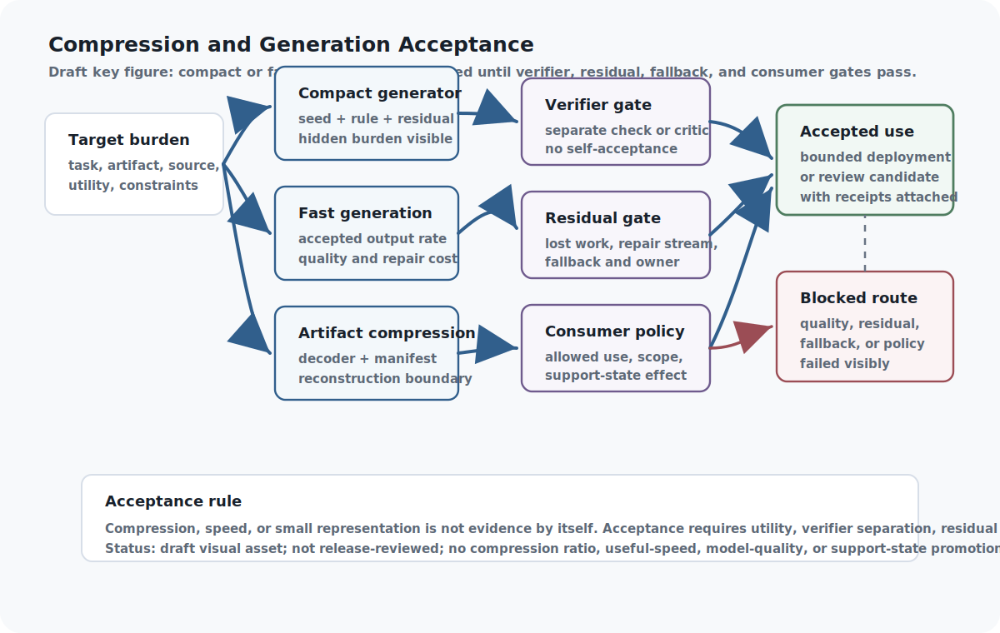

<!--
Curated reader manuscript draft.
chapter_id: compact-generative-systems-and-residual-honesty
generated_baseline_ref: build/reader_edition/chapters/compact-generative-systems-and-residual-honesty.qmd
live_source_ref: chapters/compact-generative-systems-and-residual-honesty.qmd@2a2dd4bad
This file is a reader-prose derivative only. Preserve claim meaning,
support-state boundaries, source boundaries, proof/test status,
implementation horizons, and release blockers.
-->

# Compact Generative Systems: Generate, Verify, Repair, and Residual Honesty

The hive chapter widened the stack's execution substrate: more devices, more
locality, more owned capacity, and more places where work can live. That makes
compactness attractive. A smaller representation may cost less to move, store,
verify, rerun, or route across a personal fabric. But the same pressure also
creates a new way to hide work. A compact object can make a system look
efficient while pushing reconstruction, verification, repair, fallback, or
human interpretation onto another layer.

Compactness is one of the most attractive ideas in the stack because it promises leverage: a small seed, rule, program, model, summary, graph, or generator that can stand in for something larger. It is also one of the easiest places to lie to ourselves. A representation can look small because it genuinely captures structure, or because it moved missing work into a verifier, a repair stream, a human reader, a fallback path, or a future debugging session.

The chapter's standard is therefore simple: small only counts after the remainder is named. A compact representation should say what must be reconstructed, verified, repaired, expanded, or refused, and it should carry the fallback and authority limits that decide who may rely on it.

That rule applies to ordinary compression and to semantic compression. A clean tree, graph, or semantic token can help the stack think, plan, retrieve, and explain only when its grounding, permitted use, residual uncertainty, consumer policy, and path back to fuller context remain visible.

Honest compactness is therefore a governance problem. The smaller object has to carry enough receipts to show when it is safe to use, when it needs a repair residual, and when the full artifact must return. A summary, seed, generator, semantic node, or repaired reconstruction should lower total cost without hiding the work it did not pay for.

That is the standard the stack applies here: compress only with reconstruction duties, verification duties, and visible residuals still attached for every use.

The local contribution is residual custody. Many chapters use records and
receipts; this one asks where the burden went. If a compact seed, generator,
summary, graph, or repaired artifact is smaller, the reader should still be
able to see the reconstruction cost, verification cost, repair channel,
fallback path, consumer policy, and owner of whatever burden remains. A small
representation that hides those costs is not efficient in the stack's sense.

The new residual-conservation fixture makes that rule concrete without
pretending to solve the whole problem. It accepts three honest residual
records: one visible residual that is accepted with an owner, one deferred
residual with a due condition, and one discharged residual with a receipt. It
rejects five dishonest controls: hidden burden after an apparent metric gain,
erased burden with no discharge, burden moved to no owner, a support-state
promotion attempt, and a zero-residual claim while work remains.

That is not a proof that all residuals can be found. It is a smaller and more
useful thing: a record-level boundary saying residual burden can be carried,
priced, deferred, or discharged, but it cannot simply disappear because the
compact route looks elegant.

The residual-ledger trace takes one step closer to the real book machinery. It
does not invent a new toy record. It reads the existing Resource flagship,
Resource workflow, Compact GVR, and Readiness/residual gate artifacts and asks
whether the residuals are still visible after those artifacts have already been
written. They are: seven deferred task-ticks remain named, displaced workflow
costs remain residualized, the compact receipt still carries its repair
residual, readiness escrow remains visible, and no-promotion decisions stay
attached.

That is still not proof that a deployed ledger exists. It is proof of a more
modest discipline: the current repository artifacts can be made to carry their
unpaid burdens forward instead of letting them vanish inside a success metric.

{#reader-fig-compression-and-generation-acceptance fig-alt="Draft compression and generation acceptance figure showing target burden flowing through compact generation, fast generation, and artifact compression paths before verifier, residual, fallback, and consumer-policy gates decide accepted use or blocked routes."}

Figure boundary: this draft reader aid compares compact generation, fast
generation, and artifact compression as acceptance-gated paths. It is not
release-reviewed art and does not prove compression ratios, task quality,
reconstruction utility, or model performance.

## Problem

The efficient-ASI thesis depends on compact structures, but compactness becomes dangerous when it hides the cost of generation, verification, correction, repair, fallback, semantic grounding, or human review. A small seed that requires unbounded search is not efficient. A generated reconstruction that skips exact repair is not exact. A fluent generator that loses edge cases is not honest. A tidy semantic graph that loses provenance or task limits is not grounded. A tiny controller that shifts work into invisible residuals is not governed.

CGS gives the book a vocabulary for this problem: seed, rule system, memory/state, residual/error, verification, and governance/generation interface. RGS adds the improvement loop: repeated successful behavior can become verified structure, but failures must stay in residual escrow and regressions must remain protected.

The question is not whether a system is small. It is whether the smaller structure preserves enough of the task boundary that the remaining work is bounded, visible, and payable. If verification, repair, fallback, grounding, hierarchy migration, consumer-policy review, or human interpretation grows faster than the representation shrinks, the compact core may be an accounting error rather than an efficiency gain.

## Why existing approaches are insufficient

Compression narratives often count the visible representation while ignoring the work needed to reconstruct or use it. A model can look compact by storing information in a generator, a prompt, a retrieval system, a human operator, a verifier, a repair stream, or a fallback path. If those burdens are not recorded, the architecture has not saved complexity. It has hidden it.

Semantic representation has the same trap in a more legible costume. Opaque token prediction does not expose concept hierarchy or source grounding, but a hand-built ontology, semantic graph, or tree token can hide uncertainty behind a clean path. Information Bottleneck (`ext_information_bottleneck_2000`) frames relevance-preserving compression, and LoRA (`ext_lora_2021`) shows low-rank adaptation as a structural comparator, but neither validates local TreeLLM behavior, semantic-node adequacy, or graph-grounding quality. A semantic representation is only useful when it preserves the constraints its consumer needs and records when it does not.

Compression and representation baselines make residual accounting non-optional. Deep Compression (`ext_deep_compression_2015`) names pruning, quantization, and coding; knowledge distillation (`ext_knowledge_distillation_2015`) names teacher/student behavior transfer; GPTQ (`ext_gptq_2022`) names post-training quantization; DreamCoder (`ext_dreamcoder_2020`) frames reusable abstraction learning; Information Bottleneck (`ext_information_bottleneck_2000`) separates relevance from compression; MDL (`ext_mdl_tutorial_2004`) makes model/data tradeoffs explicit; and CodeBLEU (`ext_codebleu_2020`) reminds artifact evaluation to include task-specific utility signals. Compact generative systems use those baselines to require residual, verifier, repair, and consumer-policy accounting, not to claim a local compression ratio or utility result.

Compactness also does not imply interpretability or safety. A compressed rule can be opaque. A generated output can be plausible but unverified. A local embedded system can be resource-aware but untested. A simulation can be definable but physically infeasible. The stack therefore treats compactness as a contract with residuals, not as an achievement by itself.

Another insufficiency is evaluator capture. A compact generator can appear efficient when it also decides whether its own outputs are adequate. Residual honesty requires an external or at least separately governed verifier whenever the generated result affects claims, tools, memory, or self-improvement.

## Core Claim

Compact generative systems should store the smallest useful governed generator plus the cheapest exact or scoped residual, while preserving verification, fallback, consumer policy, and residual-burden records (evidence boundary: architectural argument).
The source notes support discussion of compact seeds, residual burden, verification cost, repair streams, fallback, consumer policy, governance interfaces, hidden complexity debt, and ratcheting, but no CGS benchmark, codec, compression-rate experiment, proof of utility, or implementation has been run here.

Folded semantic-representation subclaim: semantic representations are task-scoped leases. Graph nodes, tree paths, and semantic tokens may carry work only when provenance, grounding, adequacy, interoperability, permitted use, residual uncertainty, supersession, and consumer policy are explicit.

## Mechanism

Compression begins before bytes. The ASI Stack first asks whether a smaller structure can generate, govern, predict, reconstruct, or coordinate a larger target without hiding the burden it fails to carry. CGS supplies the seed/rule/memory/residual/governance tuple, BBVCA supplies the stricter generate/verify/repair exactness receipt, RGS and RMI supply ratchet pressure, BugBrain and Simulation Scaling keep local resource limits visible, and Project Theseus keeps the evidence-before-growth discipline attached to implementation work.

After the runtime reference records what was routed, executed, replayed, and left residual, compact generation asks whether any part of that burden can be represented by a smaller lawful structure. The answer is useful only when the record still exposes the generation cost, verification cost, correction channel, fallback path, and authority boundary.

A Compact Generative Record names what is compact, what is generated, whether generation ran, how it is corrected, how it is verified, whether verification ran, which verifier separation is required, what residuals remain, whether fallback was tested or used, whether residual burden is bounded, what use envelope is allowed, which burdens and costs are being counted, and who is allowed to use, promote, retire, or fall back from it. It treats compactness as a claim with costs, not as an aesthetic preference.

```{mermaid}
flowchart LR
A["Target system or task family"] --> B["Compact seed"]
B --> C["Rule system + memory state"]
C --> D["Generator / decoder / controller"]
D --> E["Verifier or critic"]
E --> F{"Adequate for use?"}
F -- "yes" --> G["Governed interface"]
F -- "no" --> H["Residual channel + correction"]
H --> I["Fallback or ratchet pressure"]
G --> J["Evidence + cost ledger"]
I --> J
J --> K["Residual burden audit"]
```

**Reading the residual burden loop:** Compactness is useful only when the generator, verifier, residual channel, fallback path, and cost ledger remain visible together. The residual burden audit is the guard against treating a small seed or elegant rule system as if it had carried every hidden cost.

A compact generative system should answer five questions:

- What target is the compact core supposed to generate, control, predict, or govern?
- What seed, rule system, and memory/state are doing the work?
- What verification contract decides whether the generated result is adequate?
- What residual channel preserves failures, omissions, and correction burden?
- What governance interface and authority boundary decide permitted use, fallback, promotion, and retirement?
- What burden ledger and cost-accounting entries make reconstruction, decision, governance, review, fallback, and residual costs visible?

The raw LLM fits this frame as a compressed generative engine, not as the whole intelligence. It can generate across many targets, but the stack still needs routing, verification, residuals, authority, and evidence around its outputs.

A compact-system receipt separates three burdens: reconstruction burden, decision burden, and governance burden. Reconstruction burden is the cost of producing a usable artifact from the compact seed. Decision burden is the cost of knowing whether the artifact is adequate. Governance burden is the cost of approvals, non-claims, fallback, retirement, and residual review.

Generate/verify/repair is the stricter receipt lane. It starts with a reconstruction contract, a public law family or generator, and an artifact-specific seed. The generator produces candidate regions. Verification compares those regions to the declared target. Mismatches become exact repair residuals, declared loss, literal fallback, quarantine, or negative rate evidence. Exactness belongs to the full receipt, not to the generator alone.

```{mermaid}
flowchart LR
A["Reconstruction contract"] --> B["Generator or public law family"]
A --> C["Artifact-specific seed"]
B --> D["Generate candidate"]
C --> D
D --> E{"Verification passes?"}
E -- "yes" --> F["Verified generated region"]
E -- "repair" --> G["Exact repair residual"]
E -- "no" --> H["Literal fallback or quarantine"]
F --> I["Final rate and burden ledger"]
G --> I
H --> I
I --> J["Consumer policy"]
J --> K["Admit, scope, or reject"]
```

**Reading the receipt lane:** Generated reconstruction is useful only when verification, repair, fallback, final-rate accounting, and consumer policy stay attached. A mismatch is not a defect to hide; it becomes a repair stream, declared loss, literal fallback, quarantine, or negative evidence for that representation.

### Compression receipt states

Compression receipts move through states because exactness is not a feeling produced by an elegant generator. A candidate receipt means a generator, seed, or law family has been proposed but not verified, so it belongs only in search and analysis. Verified exact is stronger: decode plus recorded repair equals the target under the declared reconstruction contract. Verified lossy is different again; loss has been declared and accepted only inside a bounded use envelope such as preview, drafting, routing, or another loss-tolerant task.

Repaired exact is the honest middle case. The generator did useful work, but exactness depends on a recorded residual, and that repair stream has to be counted with the metadata and interface costs. Literal fallback is not failure to hide. It means compression was not cheaper, verification failed, or the literal artifact was the right route, so the receipt becomes negative evidence for this method on this target.

Quarantine is the hard stop. If search, verification, decode, consumer policy, or rate accounting violates the contract, the representation is blocked from downstream use except debugging. These states are evidence states for a representation, not claims about universal compression. They let the system preserve failed experiments without turning them into codec success stories.

### Semantic Representation Leasing

Semantic representation is the same burden-accounting problem at the level of meaning. TreeLLM proposes traversable semantic graphs and path-derived tokens; Spinoza supplies proof, citation, and belief-state pressure; Verification Bandwidth warns that compressed semantic units can drop constraints needed for checking; Cognitive Compilation supplies typed semantic IR; and the Circle/Coil sources remain optional-substrate guardrails. None of those sources makes a local semantic graph adequate by itself.

A Semantic Node Record is a scoped representation lease, not a canonical ontology verdict. It can be used for retrieval, planning, compilation, compression, claim review, or explanation only inside its grounding state, permitted uses, consumer policy, and adequacy limits. If a task needs constraints the node no longer carries, the route should fall back to richer source context, record a context-adequacy residual, or quarantine the node.

```{mermaid}
flowchart LR
A["Source or task evidence"] --> B["Semantic node"]
B --> C["Provenance + relation refs"]
B --> D["Grounding state + residual uncertainty"]
C --> E{"Adequate for consumer?"}
D --> E
E -- "yes" --> F["VCM page / claim graph / IR atom / explanation"]
E -- "no" --> G["Fallback, residual, or quarantine"]
F --> H["Version and supersession ledger"]
G --> H
```

**Reading the semantic lease gate:** A semantic node earns task-local use only when provenance, grounding, relation structure, residual uncertainty, and consumer policy are visible. If the node is not adequate for that consumer, the system falls back or records a residual instead of treating the graph as source authority.

Semantic-node lifecycle states should include proposed, grounded, adequate-for-task, interoperable, superseded, stale, and quarantined. Those states let a semantic graph remain editable without becoming forgetful. Updating a hierarchy should preserve old references or record supersession because downstream claims, plans, or explanations may still depend on the earlier meaning.

The three gates are grounding, adequacy, and interoperability. Grounding asks what source or artifact supports the node. Adequacy asks whether the node preserves enough constraints for the current task. Interoperability asks whether the node can be consumed by VCM, Spinoza, planning, cognitive compilation, compression, or human explanation without hidden translation loss. A semantic representation should not be promoted because one gate passed while the others remain untested.

## Interfaces

Compact generators are exposed through the Compact Generative Record.

Minimum fields:

- `system_id`
- `target_system`
- `compact_seed`
- `rule_system`
- `memory_state`
- `generation_status`
- `residual_channel`
- `correction_mechanism`
- `verification_contract`
- `verification_status`
- `verifier_independence`
- `governance_interface`
- `authority_boundary`
- `use_envelope`
- `burden_ledger`
- `cost_accounting`
- `generative_leverage`
- `hidden_complexity_risks`
- `fallback_path`
- `fallback_status`
- `residual_burden_status`
- `promotion_state`
- `promotion_blockers`
- `retirement_condition`
- `support_state_effect`
- `source_refs`
- `evidence_refs`
- `non_claims`

Routing uses the record to decide whether a compact core is adequate for a task. VCM and semantic pages use it to mark loss and omissions. Evidence layers use it to check downstream utility. Procedural memory uses it to decide whether repeated generated behavior should become a verified tool.

Use envelopes belong on the compact-system record. A compact core can be acceptable for drafting, search, simulation, or candidate generation while being unacceptable for final claims, irreversible actions, or autonomous promotion. The same seed can have different authority at different risk tiers.

Residual-cost ownership belongs on the same record. A compact system may shift effort to verifiers, repair streams, fallback storage, human reviewers, or future runs. If those burdens are not attached to the record, compactness becomes a local win that exports cost to the rest of the stack.

Compression receipts add the stricter reconstruction interface:

- `artifact_id`
- `receipt_state`
- `reconstruction_contract`
- `public_law_family`
- `seed`
- `search_bound`
- `generated_regions`
- `verification_result`
- `repair_residual`
- `fallback_threshold`
- `interface_costs`
- `consumer_policy`
- `use_permissions`
- `proxy_rate_status`
- `final_serialization_status`
- `rate_accounting`
- `support_state_effect`
- `evidence_refs`
- `non_claims`

The consumer policy is load-bearing. A receipt that is acceptable for routing preview may be forbidden for proof input, audit, citation, exact replay, benchmark construction, or training. The same generated reconstruction can therefore be useful and inadmissible at the same time, depending on the consumer.

Semantic representation adds the Semantic Node Record as a companion interface:

- `node_id`
- `concept_label`
- `provenance_refs`
- `parent_refs`
- `child_refs`
- `relation_refs`
- `tokenization_contract`
- `grounding_state`
- `version`
- `supersedes`
- `residual_uncertainty`
- `permitted_uses`
- `evaluation_refs`
- `consumer_policy`
- `support_state_effect`
- `non_claims`

Consumer policies are explicit. VCM needs adequacy state, source coverage, and loss contracts. Spinoza and claim ledgers need provenance, support tier, defeaters, and downgrade paths. Planning needs permitted uses, residual uncertainty, and authority limits. Cognitive compilation needs typed inputs, outputs, constraints, and repair behavior. Compression needs utility and fallback records. Human explanation needs visible non-claims.

## Invariants

- Lossy claims are labeled.
- Residual burden is visible.
- Fallback exists when compact generation fails.
- Verification cost is counted as part of the representation.
- Verification precedes exactness claims.
- Repair, metadata, interface, and fallback costs are counted before compression savings are claimed.
- Consumer use is scoped to the reconstruction contract and declared loss.
- Negative rate results are preserved instead of rewritten as narrative success.
- Compactness does not promote support state without evidence.
- Semantic nodes are grounded or labeled speculative.
- Hierarchy changes are versioned.
- Graph updates preserve prior references or record supersession.
- Shared semantic graphs remain indexes and working representations, not independent source authorities.
- Consumer use is scoped by grounding, adequacy, interoperability, permitted uses, and residual uncertainty.

Compactness is not the invariant; accountability is. A compact representation may be useful, but only after generation, verification, correction, and governance costs are visible enough to compare with alternatives.

Verifier separation keeps compactness from becoming self-certification. The compact system can propose, regenerate, compress, or repair, but it cannot be the sole authority for promoting its own adequacy when the result affects evidence state, runtime authority, or replacement.

Residual honesty also requires retaining the expensive reference path when the compact path becomes the default.

The residual-conservation fixture gives the chapter its sharpest version of
that invariant. A visible metric may improve while total burden gets worse, so
the record must say where the remainder went. If it was accepted, someone owns
it. If it was deferred, a due condition travels with it. If it was discharged,
a receipt closes it. If it is hidden, erased, moved without an owner, or used
to promote a stronger claim, the fixture rejects it.

## Failure modes

- False lossless claims.
- Hidden residual complexity.
- Compactness that damages utility.
- False explainability.
- Canonical graph capture, where the semantic graph becomes an unreviewed authority source.
- Hierarchy drift and stale consumer mappings.
- Semantic laundering, where a clean path explanation is cited instead of the source, proof, or test it was meant to index.
- Unbounded search.
- Verification skipped.
- Repair larger than original data.
- Consumer-policy leakage, where a lossy or preview representation is reused for exact, audit, proof, benchmark, citation, or training work.
- Proxy-rate drift, where search-time savings survive in prose after final serialization erases them.
- Degenerate governance where the compact core evaluates its own adequacy.
- Recursive instability when compact structures modify the system that defines their success.

False lossless claims should be downgraded. Hidden residuals should be escrowed. Utility damage should trigger fallback or quarantine. Self-evaluation should be blocked when evaluator independence matters. Recursive modification should be routed through SCF replacement and readiness gates.

Residual displacement is the compact-system failure that most resembles success. The system appears compact because it moves missing detail into human interpretation, future debugging, hidden retrieval, or undocumented verifier assumptions. The residual channel should name the displacement rather than letting it look like efficiency.

## Minimum Viable Implementation

Compactness should first appear as a compact generative record and fixture. That artifact is not evidence that a compact core works. It makes the burden visible: target, seed, rules, memory, generation status, residuals, correction mechanism, verification contract/status, verifier independence, governance, authority boundary, use envelope, burden ledger, cost accounting, leverage, hidden complexity, fallback path/status, residual-burden status, promotion blockers/state, retirement condition, source refs, support-state effect, evidence references, and non-claims.

The repository fixtures validate that this public contract can be represented consistently. They also give later experiments a stable place to attach metrics: rate, reconstruction fidelity, verification cost, residual volume, utility, latency, and fallback frequency.

`AsiStackProofs.CompactGenerativeSystems` adds bounded residual-honesty and exactness predicates, compact-admission route checks, and a finite bridge to the Compact GVR synthetic slice. The Lean bridge proves only the modeled fixture relation: the selected compact receipt is eligible, the three controls are ineligible, and the selected modeled byte count is below the literal baseline. The remaining engineering burden is still explicit: a real codec, generator, independent verifier, downstream utility test, corpus, and fallback harness must exist before compact-core behavior can carry stronger evidence.

The implemented Compact GVR slice gives the reader one concrete, bounded example without turning it into a codec claim. `python3 scripts/validate_compact_gvr_slice.py` recomputes five public-safe synthetic receipt records: a 368-byte literal baseline, a 78-byte exact repeat-generator-plus-repair receipt, and three rejected controls for lossy exactness, negative-rate/no-fallback accounting, and bounded-search overrun. The slice moves only the subordinate claim `compact-generative-systems.compact_gvr_receipt_slice` to `synthetic-test-backed`; the chapter core claim remains at `argument`.

The implemented residual-conservation fixture gives a second concrete example
without turning it into a deployed residual ledger. `python3
scripts/validate_residual_honesty_conservation.py` recomputes three honest
synthetic residual records and five dishonest controls, then checks the finite
Lean bridge in `AsiStackProofs.CompactGenerativeSystems`. The fixture records
residual movement; it does not prove all residuals are discoverable, does not
prove safety, and does not promote the chapter core claim.

The implemented residual-ledger trace adds a repository-level example without
changing that boundary. `python3 scripts/validate_residual_ledger_trace.py`
reads already committed Resource, Compact GVR, and Readiness artifacts and
writes `experiments/residual_ledger_trace/results/2026-07-03-local.json`.
It records four trace entries showing that residualized deferrals, displaced
costs, repair residuals, readiness escrow, rejected hidden burdens, and
no-promotion decisions remain attached across artifact boundaries. It is not
proof that a deployed ledger exists.

The folded generate/verify/repair lane adds the compression receipt. The bounded slice now shows the shape of that receipt discipline: exactness belongs to generator plus repair plus verification, not to the generator alone; negative-rate and missing-fallback cases stay as negative evidence; bounded-search failures do not become success stories; and consumer scope remains attached to the receipt. That slice is still not a codec benchmark. Its evidential scope is the public record's distinction among exactness, declared loss, repair, fallback, quarantine, and consumer scope.

A broader compact-core comparison still remains open beyond the implemented GVR receipt slice: one compact seed with bounded reconstruction cost, one lossy seed that must remain non-exact, one generator failure routed to fallback, one residual displaced into human review, and one promotion blocked because the verifier is not independent. That later comparison would test compact-system behavior, not just receipt accounting.

The folded semantic-representation slice adds the semantic node record. The repository fixture validates provenance, hierarchy, relation references, tokenization contract, grounding state, versioning, supersession, residual uncertainty, permitted uses, evaluation references, support-state effect, and non-claims. It does not show that a semantic graph works. The first stronger test should use a small grounded domain with source passages, artifact nodes, semantic nodes, and claim records, then deliberately update the hierarchy, remove or supersede a source, and check whether downstream consumers notice the change.

## Beyond the State of the Art

Compact generative systems earn their place as a burden-accounting layer for compression and generation. It lets the stack use compact seeds, generators, procedures, learned representations, and local cores only when their reconstruction, decision, verification, fallback, governance, and residual costs are explicit.

Compactness becomes useful only when the generator, verifier, fallback, governance burden, reconstruction burden, decision burden, and residual burden are all counted. A mature compact record would bind the target, seed, rule system, memory state, generator, correction mechanism, verifier, residual channel, fallback path, authority boundary, use envelope, burden ledger, cost accounting, promotion state, and retirement condition before the stack trusts a compact core. It would make compact generation a governed accounting surface rather than a slogan for smaller artifacts.

The mature layer would report reconstruction burden, decision burden, governance burden, verification status, verifier independence, fallback status, residual-burden status, downstream utility, latency, cost, residual volume, and hidden-complexity risk as separate evidence fields. Routing would use compact-core readiness and use envelopes; VCM and semantic pages would label loss, taint, and omissions; procedural memory would turn repeated generated behavior into verified tools; generate-verify-repair would record exact remainders; readiness gates would decide promotion or quarantine. Repeated successes could become tool candidates, but failed generations would become residual pressure, lossy seeds would stay scoped to safe uses, non-independent verifiers would block promotion, and utility-damaging cores would retire or route to fallback.

The compact-generation boundary is still a design claim. The compactness claim stays at `argument` until exactness records, verifier outputs, reconstruction tests, residual-burden accounts, lossy-ablation cases, and fallback traces show which information compact generation preserved and which obligations it left behind.

At the mature end state, the compact-generative-systems layer becomes a compression control plane. Each task asks for the cheapest lawful representation: full source, compact seed, generated reconstruction, repaired exact receipt, lossy preview, semantic page, specialist core, or rejection. The answer is based on total burden, verifier quality, residual honesty, consumer policy, replay need, downstream risk, and support-state limits, not on ratio alone. Until public codec, utility, rate, and replay evidence exists, that endpoint remains target architecture.

At the semantic layer, the mature endpoint is representation leasing. Graph nodes, tree paths, and semantic tokens become task-scoped meaning objects whose provenance, grounding, adequacy, interoperability, supersession, permitted use, consumer policy, and residual uncertainty travel with every use. A node can be useful for routing while forbidden for proof, citation, audit, or claim support. Stale nodes become migration debt, not invisible graph drift. Quarantined nodes remain available for debugging but not operational use. Until grounded-node records, hierarchy-update histories, supersession trails, retrieval/grounding benchmarks, and semantic-lease tests exist, the semantic-leasing endpoint remains a design target.

## Summary

Compact systems are useful when they generate, reconstruct, or represent more value than their hidden burdens cost. Residual-honest accounting therefore keeps seed, rule system, memory, generation, verification, repair, semantic grounding, residuals, governance, fallback, consumer policy, and evidence in the same record.

Residual honesty is what keeps compactness from becoming a trick. It lets a compact core be promoted only when its remaining burden is visible and acceptable for the task. The same rule applies to compression that claims reconstruction: generation is allowed to be clever only when verification, repair, final-rate accounting, and consumer policy pay the exact or scoped remainder.

The bridge is narrow but useful: compact systems can reduce burden, but exact reconstruction needs a stricter receipt that says precisely what the generator failed to carry, what was repaired, when fallback won, and which consumers may rely on the result. Semantic leasing applies the same rule to meaning: a clean node or path can carry work only when the lost context, grounding limits, permitted uses, and supersession path stay visible.

Compactness has to survive total-cost accounting. If the seed is smaller but the hidden verification, repair, review, or authority cost grows without a record, the stack has not become more efficient.

## Handoff

Compact generation and generate/verify/repair receipts expose the cost of reconstructing stored artifacts; the same accounting applies when the system generates output over time. Fast Generation Architectures moves from compact representation to accelerated inference and drafting. It asks which generation mode is allowed, what verifier accepts, what fallback costs, and whether speed still improves the governed task after rejected output, repair, and accepted-output costs are counted.

RankFold, NeuralFold, and Artifact Compression remains standalone after the conservative merge because it owns the technique-facing artifact and tensor-compression lane. It inherits the compact-system residual-honesty, semantic-leasing, and consumer-policy requirements while asking a different question: when may a compressed artifact stand in for a full artifact for a specific task?

The former Semantic Representation and Tree-Structured Models material is now
a named representation-leasing section inside Compact Generative Systems
rather than a second rendered skeleton. Its restoration condition is
unchanged: it should become standalone again only if a public-safe semantic
graph, TreeLLM, hierarchy-revision, representation-utility, or external-review
evidence lane makes semantic representation chapter-owning again.

Part III has now moved from selection to qualification, from qualification to
substrate, and from substrate to burden accounting. The next two chapters push
that burden accounting into speed and artifact compression, where the stack
has to decide whether faster generation and smaller artifacts still help after
all rejected outputs, repairs, exact remainders, and consumer-policy limits are
counted.
