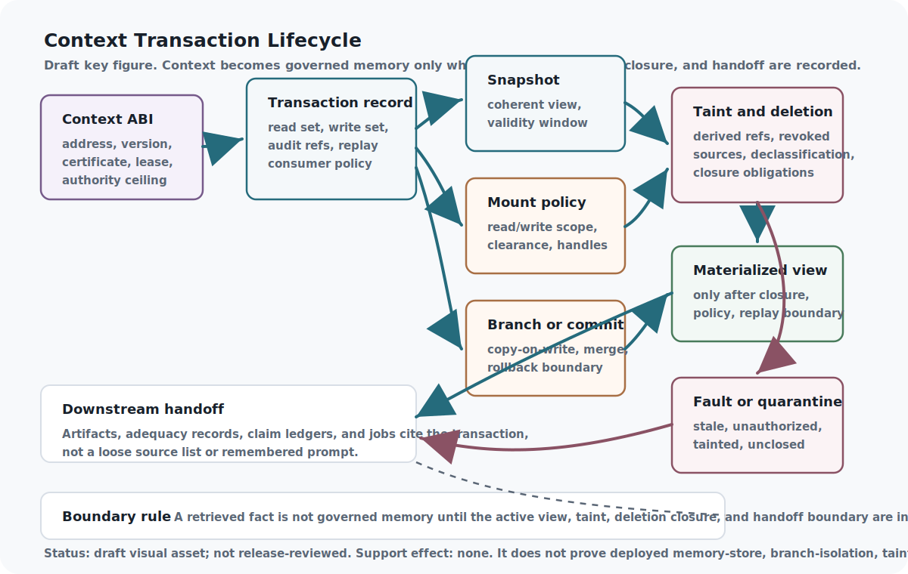

<!--
Curated reader manuscript draft.
chapter_id: context-transactions-snapshots-mounts-and-taint
generated_baseline_ref: build/reader_edition/chapters/context-transactions-snapshots-mounts-and-taint.qmd
live_source_ref: chapters/context-transactions-snapshots-mounts-and-taint.qmd@0840248da
This file is a reader-prose derivative only. Preserve claim meaning,
support-state boundaries, source boundaries, proof/test status,
implementation horizons, and release blockers.
-->

# Context Transactions, Snapshots, Mounts, and Taint

Memory is not safe just because it is relevant.

An AI system can retrieve the right note, cite the right file, and still use
the wrong memory state. The note may come from an old branch. The file may
have been revoked. A summary may carry private material after the source was
deleted. A cached packet may mix fresh evidence with stale instructions. A
tool call may inherit context that was meant only for a sealed task.

This chapter names the runtime layer that prevents those failures from
becoming ordinary memory. Context transactions make a context view accountable:
what was mounted, what snapshot was read, what branch was used, what taint
propagated, what deletion obligations survived, what faults appeared, and
which downstream artifact inherited the result.

The analogy is version control, but for cognitive state. A serious software
project does not only ask whether a line of code is useful. It asks which
commit it came from, which branch changed it, whether the merge was allowed,
and whether a later build used it. Governed AI memory needs the same kind of
history. Without it, every summary and cached context packet can become a
quiet authority leak.

The previous chapter gave context an interface. This chapter gives context a
history. An address tells the stack what object it requested; a transaction
tells the stack which state of that object actually shaped the work.

{#reader-fig-context-transaction-lifecycle fig-alt="Draft context transaction lifecycle figure showing context ABI records, certificates, transaction records, snapshots, mount policies, branch or commit decisions, taint and deletion closure, materialized views, faults, quarantine, downstream artifact, adequacy, claim-ledger, and job handoff boundaries."}

Figure boundary: this draft reader aid shows the intended memory lifecycle.
It is not release-reviewed art and does not prove retrieval quality, runtime
store behavior, deletion closure, taint enforcement, or context adequacy.

## Problem

Typed context cells still need runtime semantics.

The previous context chapters describe stable addresses, semantic pages,
certificates, provenance, loss records, and authority ceilings. Those are
necessary, but they do not by themselves say which memory view a worker
actually consumed. A cell can be well labeled and still be read from the wrong
snapshot, copied across an unauthorized mount, merged from an experimental
branch, or derived from material that should no longer appear.

The problem is state. Long-running systems need coherent snapshots, mounted
views, copy-on-write branches, taint labels, deletion closure, contradiction
records, and replay boundaries. They need to know when a view is materializable
and when it must fault.

The central question is not only "is this context relevant?" It is "is this
context view valid for this task, this authority, this moment, and this
downstream use?"

## Why Retrieval Is Not Enough

Retrieval finds candidates. It does not guarantee a coherent memory view.

A retrieval store can return plausible neighbors while hiding the state
questions that matter most. Did the worker see an old version or a committed
one? Was a private mount visible? Did a tainted source get summarized into a
clean-looking paragraph? Did a deleted source survive inside an embedding or
derived note? Did an experimental branch accidentally update committed memory?

External memory and long-context work helps orient the issue. RAG makes
retrieval explicit. MemGPT frames virtual memory control. Lost in the Middle,
LongBench, RULER, and LongLLMLingua make context-window and compression
limits visible. This chapter adds a different requirement around those
mechanisms: the system must treat context as stateful, versioned, mounted,
tainted, and replayable before it treats the result as working memory. Those
external systems are comparators, not evidence that this repository has run
their evaluations.

Context memory therefore needs database-like discipline without pretending
that semantic memory is a database table. Context objects are lossy, task
relative, authority bearing, and often derived. That makes transaction
semantics more important, not less.

The transaction is what lets the system say no to a fluent but invalid memory
blend. Relevance gets a candidate into view; transaction semantics decide
whether that view is coherent enough to use.

## Core Claim

VCM should use transactional memory semantics: immutable events, versioned
pages, snapshots, mounts, taint, temporal validity, and deletion closure. In
the live book, this claim remains a design rationale at `argument` support.

VCM public v1 supplies the main transaction vocabulary: immutable versions,
snapshots, revocation, invalidation, protected compilation, and audit records.
Ladon and Context Engineer add need-to-know pressure, opaque handles,
sensitive compartments, clearance labels, Digital SCIF lifecycle ideas, and
sanitized commits. Black Hole Context Manager adds practical memory-budget
patterns: chunks, entropy, mass, goal drift, freezing, eviction, and critical
context preservation. Editable VCM refines mounts, snapshots,
materializations, planner-guided paging, protected compilation, and governed
memory vocabulary.

That support is architectural. The repository validates record shapes, checks
a synthetic deletion-closure gate inside the context admission/adequacy
harness, and builds finite Lean predicates for snapshot reads and taint
propagation. It has not implemented a transactional memory store. It has not
run read-your-writes, branch-isolation, mount-visibility, replay, poisoning,
side-channel, or VCM conformance tests.

## Mechanism

A context transaction is the receipt for a memory view.

```{mermaid}
flowchart LR
  Event["Immutable memory event"] --> Page["Versioned page"]
  Page --> Mount["Mount policy"]
  Mount --> Snapshot["Pinned snapshot"]
  Snapshot --> Use["Read, write, or derive"]
  Use --> Branch{"Branch or commit?"}
  Branch -- "branch" --> COW["Copy-on-write branch"]
  Branch -- "commit" --> Commit["Committed event"]
  COW --> Closure["Taint and deletion closure"]
  Commit --> Closure
  Use --> Closure
  Closure --> Check{"Closure satisfied?"}
  Check -- "yes" --> View["Materializable view"]
  Check -- "no" --> Fault["Typed fault or quarantine"]
  View --> Artifact["Downstream artifact or claim"]
  Fault --> Route["Repair, declassify, delete, or review"]
```

The transaction begins with immutable events and versioned pages. A task then
receives a mounted view over a pinned snapshot. The view may read, write, or
derive context. If the system experiments, it should branch copy-on-write
rather than mutate committed memory. If it commits, the new event joins the
memory history.

Taint and deletion closure run across both paths. A sensitive source should
taint the derivative unless declassification is authorized. A deleted or
revoked source should close over summaries, embeddings, cached packets, and
derived notes or cause a fault. A contradiction should become an evidence
record, not disappear under a newer summary.

The crucial separation is view construction versus view use. View construction
names the snapshot, mounts, permissions, branch policy, and materialization
state. View use names the cells actually read, derivatives created, taint
labels propagated, deletion obligations triggered, contradictions recorded,
and artifacts that inherited the context. That difference lets later reviewers
ask not merely what sources existed, but what memory state actually shaped the
work.

## A Simple Memory Incident

Consider a research agent asked to update a chapter after a source changes.
The source has a committed version, a draft correction, an old summary in a
cache, and a private reviewer note mounted for a separate task. A flat memory
system may retrieve all four because they look relevant. The answer may even
sound better because it blends them.

The transaction layer asks different questions. Which snapshot is the chapter
allowed to read? Is the draft correction committed or only branched? Is the
cached summary stale after the source change? Is the reviewer note mounted for
this task, or is it sealed to another authority context? If the answer cites
the source, did it cite the committed text, the draft correction, or the old
summary? If the private note influenced the rewrite, did that taint propagate
into the downstream artifact?

In the governed version, the update either receives a coherent view or a
fault. A committed source update can materialize. A draft branch can remain
copy-on-write until merge review. A stale summary can be invalidated. A
private reviewer note can stay outside the mount. A derivative that still
carries private or revoked material can be quarantined until deletion closure
or declassification is recorded.

That behavior is not just caution. It is how the system knows what happened
after the chapter changes. A later reviewer should be able to say: this edit
read snapshot `S`, mounted views `M`, inherited taint `T`, rejected stale
summary `R`, and produced artifact `A` under replay boundary `B`. Without that
transaction receipt, the edit is only a plausible answer with a lost memory
state.

## Interfaces

The main interface is the Context Transaction Record.

A useful record names:

- `transaction_id`
- `transaction_state`
- `transaction_validity_state`
- `operation`
- `snapshot_id`
- `snapshot_boundary`
- `mounts`
- `mount_policy`
- `read_set`
- `write_set`
- `branch_policy`
- `isolation_state`
- `taint_labels`
- `taint_propagation`
- `deletion_obligations`
- `rollback_or_deletion_closure`
- `declassification_refs`
- `derivative_refs`
- `contradiction_refs`
- `materialization_state`
- `closure_state`
- `faults`
- `context_abi_refs`
- `source_refs`
- `audit_refs`
- `consumer_policy`
- `verification_refs`
- `promotion_blockers`
- `replay_boundary`
- `support_state_effect`
- `non_claims`

Planning consumes the record as a consistent view. Security uses it to carry
mounts, handles, taint, and declassification decisions. Evidence systems use
it to preserve contradictions, supersession, invalidation, and deletion
closure. Artifact graphs use it to recover the exact context state that fed a
plan, proof attempt, tool call, chapter draft, release note, or claim.

Failed materialization should be an ordinary result. If a compiler cannot
prove mount visibility, snapshot coherence, taint propagation, or deletion
closure, it should emit a typed fault. Silent best-effort memory is the
dangerous fallback.

## Invariants

Snapshots must be coherent. A task should not unknowingly read a blend of old
and new memory states.

Taint must propagate unless declassification is explicit. Sensitive, suspect,
private, revoked, or unsupported source material should not become clean
because it was summarized.

Deletion closure must be enforced or faulted. Deleted or revoked material
cannot safely reappear through derived summaries, embeddings, artifacts, or
cached packets unless a policy says exactly what remains permitted.

Branch containment must protect committed memory. Experiments, alternate
plans, speculative repairs, and draft summaries can branch, but they should
not mutate committed memory without merge authority and residual review.

Materialization state must be explicit before a context view feeds a durable
artifact, job, release, or claim.

## Failure Modes

Memory poisoning occurs when malicious, stale, irrelevant, or over-weighted
chunks enter memory and later look like ordinary context.

Snapshot fiction occurs when the system behaves as if it read one coherent
view while its output actually blends stale pages, live edits, unauthorized
mounts, and lossy summaries.

Context laundering occurs when a sensitive or unsupported source is copied,
embedded, cached, or summarized until the original restriction disappears.

Deletion resurrection occurs when removed material survives in a derivative
and later returns as if it were a fresh source.

Branch leakage occurs when experimental context becomes committed memory
without merge review.

These are not minor retrieval imperfections. They are memory-state failures.
The system should either produce a coherent transaction record or refuse to
materialize the view.

## Minimum Viable Implementation

The minimum viable implementation is a `context_transaction_record` schema,
valid and invalid fixtures, finite proof predicates, and a small synthetic
harness around deletion closure and transaction references.

The current repository has part of that minimum. Protocol validation checks
the public record shape. `scripts/validate_context_admission_adequacy.py`
checks synthetic context ABI, packet, semantic-page certificate, transaction,
and adequacy scenarios, including deletion-closure and transaction-reference
gates. `AsiStackProofs.ContextTransactions` proves finite predicates for a
valid snapshot read exposing a committed event in its declared view and for a
tainted source tainting a derivative unless declassification is authorized.

Those artifacts support record discipline. They do not prove deployed memory
behavior. The next honest implementation slice would be a tiny memory-store
fixture set: one coherent snapshot read, one branch that cannot merge because
taint remains, one deleted source whose derivative blocks materialization, one
unauthorized mount fault, one declassification record that preserves residual
risk, and one artifact graph node that records the replay boundary.

## Beyond the State of the Art

The mature endpoint is a transactional memory substrate for AI context.

In that endpoint, every materialized context view can explain itself. It can
show which immutable events were visible, which branch was used, which mounts
were readable or writable, which cells were actually read, which derivatives
were created, which taint labels propagated, which deletion obligations closed,
which contradictions were recorded, and why the view was allowed to feed a
job, artifact, claim, or release.

The product-level version would include an event store, versioned pages,
pinned snapshots, copy-on-write branches, merge policies, mount isolation,
taint propagation, declassification records, deletion-closure checks,
revocation handling, replay tools, and artifact graph integration. It would
also make failure cheap and visible: a view that cannot satisfy its memory
contract faults before it becomes working context.

That endpoint remains unimplemented here. The live claim stays at `argument`
until memory-store behavior, mount visibility, branch isolation, deletion
closure, taint propagation, replay, and poisoning-resistance tests exist and
are recorded.

## Evidence Boundary

This chapter argues for a memory-state contract. It does not claim that the
contract has been deployed.

The current evidence consists of source synthesis, a public transaction record
schema, fixtures, a synthetic deletion-closure gate, and finite Lean
predicates. That is enough to show the intended control surface. It is not
enough to claim a working VCM resolver, context compiler, memory store,
Digital SCIF implementation, side-channel defense, context-manager benchmark,
or production taint/deletion behavior.

This boundary matters because the chapter is about preventing context
laundering. The text should not launder its own architectural argument into an
implementation result.

## Summary

Context transactions make memory state accountable. They record snapshots,
mounts, branches, taint, deletion closure, faults, materializations, and
downstream inheritance so later work can see which memory view actually shaped
an artifact or claim.

The lesson is that relevant memory is not enough. A system also needs to know
whether the view was coherent, authorized, current, replayable, and safe to
carry forward. If it cannot say that, the right output is a typed fault or
quarantine, not a confident answer.

## Handoff

A valid memory operation is not the same as adequate evidence.

Context transactions tell the system which memory state it used and whether
that state was coherent, authorized, taint-aware, deletion-aware, and
replayable. The next chapter, Verification Bandwidth and Context Adequacy,
asks a different question: even with a valid memory view, did the system have
enough checking capacity to support the claim it is about to make?
