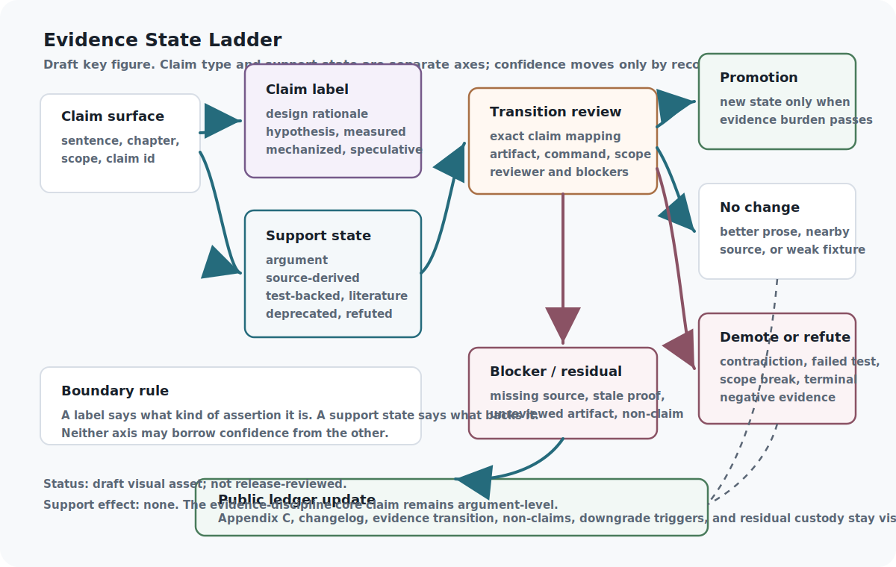

<!--
Curated reader manuscript draft.
chapter_id: evidence-states-and-claim-discipline
generated_baseline_ref: build/reader_edition/chapters/evidence-states-and-claim-discipline.qmd
live_source_ref: chapters/evidence-states-and-claim-discipline.qmd@28fcd839c
This file is a reader-prose derivative only. Preserve claim meaning,
support-state boundaries, source boundaries, proof/test status,
implementation horizons, and release blockers.
-->

# Evidence States and Claim Discipline

The failure chapter names ways an intelligent system can go wrong. Evidence
discipline names a quieter failure: a book about such systems can go wrong by sounding more
certain than its evidence allows.

That is not a stylistic issue. In a living book, prose improves continuously.
Sentences get cleaner, examples get sharper, and explanations become easier to
trust. If the evidence record does not move with that polish, the manuscript can
accidentally turn a design rationale into something that reads like a result.
The evidence layer exists to prevent that drift.

Its promise is simple: a claim's wording, label, and support state should not
separate from one another. If a claim is still an argument, it should read as an
argument. If later work gives it source-derived, prototype-backed, mechanized,
or test-backed support, that movement should leave a receipt. The reader should
be able to tell the difference between clearer exposition and stronger support.

That distinction is the trust surface for the whole project. The live book can
change every day, but confidence should change only through records.

That makes evidence discipline more than a set of house rules. It is one of
the book's central methodological claims: a living technical text needs a public
way to keep claims, evidence, revisions, failures, and confidence from drifting
apart. Without that discipline, the book could become more persuasive while
becoming less accountable. With it, ambition stays attached to receipts.

The local contribution is claim movement. Many layers use records
and receipts, but this layer decides when a claim is allowed to sound stronger,
weaker, narrower, deprecated, or refuted. The central safeguard is not caution
as a mood; it is confidence changing only when the right evidence transition
exists.

{#reader-fig-evidence-state-ladder fig-alt="Draft evidence-state ladder figure separating claim labels from support states and showing transition review, promotion, no change, demotion or refutation, blockers, residuals, non-claims, and public ledger updates."}

Figure boundary: this draft reader aid visualizes support-state movement and
claim-label separation. It is not release-reviewed art and does not promote
any claim beyond the support recorded in the live book.

## Problem

The book needs a shared language for what kind of claim is being made and what
currently supports it. Without that language, all confident technical prose
starts to look alike.

A hypothesis, a design rationale, a source-derived statement, a finite Lean
predicate, a synthetic fixture, a benchmark result, and an empirical deployment
result should not collapse into one fluent paragraph. They may all be useful,
but they have different authority. A source note can preserve lineage or direct
support. A Lean module can prove a narrow invariant over a declared record. A
schema can validate shape. A synthetic fixture can test a toy transition. None
of those automatically proves the others.

The same issue appears inside AI systems. A model may retrieve a source, cite a
nearby paragraph, pass a narrow check, or produce a plausible explanation, then
present the result with more certainty than the underlying artifact deserves.
The stack therefore needs evidence states as an architectural control surface,
not as an after-the-fact bibliography.

In this book, every important claim should answer two questions. What kind of
claim is this? What currently supports it? The first question is the claim
label. The second is the support state.

## Why existing approaches are insufficient

Citation lists are not enough. A citation can provide lineage, motivation,
terminology, contradiction, or external context without supporting the exact
claim being made. A benchmark is not enough either. A score needs workload
scope, contamination awareness, failure semantics, and regression duties before
it can move confidence. A proof is not enough unless its formal scope matches
the claim being strengthened.

The internal sources used by the evidence-state layer each point at part of that discipline.
Benchmaxxing treats benchmarks as pressure surfaces with lifecycle states,
anti-Goodhart safeguards, wall diagnoses, residuals, and regression duties
rather than permanent definitions of intelligence. Spinoza contributes claim
tiers, belief revision, contradiction handling, and downgrade or block
behavior. VIEA contributes durable ledgers for claims, artifacts, residuals,
feedback, and regression coverage. UAT contributes retrieval-bounded dossiers,
proposition states, adversarial review, SME checkpoints, and sign-off patterns.
Verification Bandwidth adds the warning that context length is not verification
workspace.

External evaluation practice gives the same warning from another direction.
HELM-style reporting, benchmark-contamination work, Goodhart taxonomies, and
hard-question benchmarks such as GPQA all make evaluation more useful by
attaching scope, provenance, and failure conditions to results. The book's
support-state machine is a ledger discipline around that control problem. It is
not a reproduced evaluation result.

Structured reporting and formal-methods practice give a second comparison.
Model cards make model limitations, uses, and evaluation context visible.
Datasheets do the same kind of work for datasets and provenance.
Reproducibility programs make commands, code, checklists, and artifact review
part of scientific reporting. Proof-carrying code pairs an artifact with a
machine-checkable policy proof. The ASI Stack's evidence states do not claim to
replace those traditions. They apply the same discipline at the level of a
claim: what exact object is allowed to move this exact support state, and what
is still outside the movement?

Mechanistic interpretability adds a third kind of evidence pressure. Circuit
analysis and feature decomposition can show something ordinary behavioral
testing cannot: a partial view of internal mechanism. But that evidence is
dangerous if it is treated as a magic word. A circuit trace, activation patch,
or sparse-autoencoder feature only helps a claim when the record names the
model, layer, behavior, method, artifact, negative cases, and limits. Looking
inside the model is not the same as proving the system safe, reliable, or ready
to deploy.

The missing object is an evidence transition. If a claim moves from `argument`
to `source-derived`, the transition should name the source note and the mapped
claim. If it moves to `synthetic-test-backed`, it should name the fixture,
command, environment, result, and limitations. If a test fails or a source
does not support the intended claim, that negative result should remain visible.
The transition is the receipt that lets a living book change without losing why
the change was allowed. It is also the bridge to the rest of the stack: later
layers may plan, verify, route, and improve, but they inherit this rule that
confidence is a recorded transition rather than a tone of voice.

## Core Claim

Every major claim should carry both a claim label and a support state, and it
should move only when source ingestion, prototype inspection, or actual tests
justify the transition (evidence boundary: architectural argument).

Appendix C records a claim-level source review map for support drawn from
Benchmaxxing, Spinoza, VIEA, UAT, Coherence Exchange, and Verification
Bandwidth. Five mappings have reviewed local raw-cache passage references in
the manifest. Coherence Exchange remains connector-only and source-review
mapped. That map makes the bridge inspectable, but it does not promote the
chapter core claim. The claim remains at `argument` support until the remaining
connector-only mapping has stronger recoverable passage support, or until a
specific accepted evidence transition or executed proof/test artifact justifies
movement within a declared scope.

### Source contribution boundaries

The source map matters because each source contributes a different discipline
and a different limit.

Benchmaxxing gives the book benchmark lifecycle language, anti-Goodhart
pressure, regression duties, and residual accounting. It does not supply a
local benchmark result or a permanent intelligence metric. Spinoza contributes
claim tiers, belief revision, contradiction handling, and downgrade behavior.
It does not prove open-domain autoformalization or arbitrary theorem validity.

VIEA contributes durable ledgers for claims, artifacts, residuals, feedback,
and regression coverage. That is not the same as a completed VIEA deployment
or runtime benchmark. UAT contributes retrieval-bounded dossiers, proposition
states, adversarial review, SME checkpoints, and sign-off patterns while
remaining unproven as a general truth-discovery system.

Coherence Exchange contributes contestability, verification supply-chain, fork,
exit, and audit vocabulary, but its epistemic-liquidity framing stays
speculative and connector-bound. Verification Bandwidth contributes the most
important reader-facing warning: loading source material into context is not
equivalent to verifying a claim. Contradiction-rate tests and the proposed
theory remain unrun here.

Transformer Circuits and monosemantic feature-decomposition work add a
white-box comparison line. They help the reader see interpretability as a real
evidence role, but not as automatic confidence. The book has not reproduced a
circuit analysis, trained sparse autoencoders, decomposed activations, or shown
that any ASI Stack model has transparent internal mechanisms.

Taken together, these sources justify the need for disciplined claim/evidence
vocabulary. They do not create a stronger support state for the chapter.

## Mechanism

Evidence discipline is traffic control for claims. It says which claims may
move, which must wait, which must be downgraded, and which need a visible
residual.

That is the methodological novelty. The chapter treats revision itself as a
governed system. A claim can be clarified, sourced, tested, mechanized,
challenged, narrowed, deprecated, or refuted, but those are different events
with different receipts.

```{mermaid}
flowchart LR
A["Claim drafted"] --> B["Claim label"]
A --> C["Support state: argument"]
C --> D{"Exact mapping +<br/>accepted transition?"}
D -- "yes" --> E["source-derived"]
C --> F{"Validated schema / proof / test artifact?"}
F -- "Lean build" --> G["Mechanized claim label within formal scope"]
F -- "fixture or experiment" --> H["synthetic-test-backed or empirical-test-backed"]
D -- "no" --> I["remain argument"]
F -- "fail / inconclusive" --> J["negative result / residual"]
E --> K["Appendix C + changelog"]
G --> K
H --> K
J --> K
```

**How to read the support-state gate:** The gate blocks confidence from moving
just because prose improved. A claim can rise only through a mapped source
transition, a validated proof or test artifact, or another recorded evidence
path with a declared scope. Every movement updates the public ledger.

The gate has two axes. Claim labels describe the kind of assertion being made:
design rationale, hypothesis, measurement, mechanism, demonstration,
mechanized invariant, or speculation. Support states describe the artifact that
currently backs the assertion: argument, source-derived mapping, prototype
inspection, synthetic test, empirical test, external literature, deprecation,
or refutation. Mixing those axes creates evidence inflation.

Appendix C is the public claim ledger, but it is not a shortcut around review.
Source notes are prerequisites for source-derived movement, not automatic
promotion. Schema-valid records can show that a transition is well formed; they
do not prove that the transition should be accepted. A Lean theorem can prove a
narrow record invariant; it does not prove the surrounding system behavior.
Test-backed movement requires an evidence bundle with the command, environment,
result, limitations, and negative or inconclusive results where they exist.

Interpretability evidence follows the same rule. A discovered circuit or
feature can be useful, but it is still an artifact with a scope. It should not
outrank a failed behavioral result, hide missing proof scope, or become a broad
safety claim. It belongs in the ledger as a mechanistic evidence role with
model, layer, behavior, method, counterexample, and non-claim fields attached.

The layer also preserves negative information. A failed proof attempt,
benchmark wall, contradiction, missing source, invalid fixture, or scope
mismatch is not clutter. It is the information that prevents the stack from
ratcheting in the wrong direction.

Promotion is therefore a burden, not a reward. The default is to leave support
unchanged until the claim, artifact, command, review status, and limitations
align. Downgrade requires less ceremony: contradiction, missing support, scope
mismatch, or failed verification is enough to move a claim downward or into
residual status.

## Interfaces

Evidence movement is mediated by two records: the Claim Record and the Evidence
Transition Record.

The Claim Record holds the state before movement. It names the claim text,
scope, claim label, support state, lifecycle state, source mapping status,
evidence-readiness state, surface references, uncertainty, contradictions,
review status, required next evidence, promotion blockers, support-state
effect, and non-claims.

The Evidence Transition Record holds the attempted movement. It names the old
and new support states, transition effect, transition validity state, scope
boundary, evidence roles, required artifacts, artifact references, evidence
packet references, source mapping references, verification command,
verification result, negative evidence, downgrade triggers, promotion burden,
limitations, reviewer references, reviewer independence, acceptance blockers,
changelog reference, support-state effect, and non-claims.

Those records connect drafting, source ingestion, proof work, experiments, and
publication. Drafting may introduce or clarify claims. Source ingestion may add
source notes and source-to-claim mappings. Proof and code work may add modules,
commands, fixtures, and results. The changelog records meaningful evidence
movement. Appendix C shows the public state after those records have been
processed.

Evidence roles must stay separate. A source can provide lineage without direct
support. A result can be source-reported without being reproduced. A fixture
can validate record shape without validating reality. A formal predicate can
prove a small invariant without proving deployment behavior. A single artifact
can play one role without playing all of them.

## Invariants

The evidence layer has three basic invariants.

First, no fabricated source support. A claim should not point to a source unless
the source has been read or source-noted under the project's public-safety
rules, and the mapping should say what the source supports and what it does not
support.

Second, no fabricated test or proof result. A validator, proof build, fixture,
benchmark, or experiment should be reported only when it actually ran, with its
scope preserved.

Third, negative and inconclusive results remain visible. The book is allowed to
discover that a claim is weaker, narrower, unsupported, deprecated, or wrong.
If that happens, the ledger should show it.

The strongest invariant is asymmetry. Support can move up only when the
required artifact exists, but support can move down whenever contradiction,
failure, missing evidence, or scope mismatch is found. That is why Appendix C
stays conservative even after source-review coverage improves. Source notes are
necessary context. They are not automatic promotion.

## Failure modes

The obvious failure is support-state inflation: the prose says "argument" in
the ledger but sounds test-backed on the page. Citation laundering is the
nearby version: a source is close enough to make the sentence feel supported,
but the exact claim exceeds the source. Benchmark laundering generalizes a run
beyond its workload. Proof laundering expands a small formal invariant into a
whole-system guarantee.

Evidence smoothing is subtler. A revision improves flow by removing caveats,
failed attempts, open gaps, or residual uncertainty. The chapter becomes easier
to read and less true. A living book is especially exposed to this failure
because it is constantly being rewritten.

The correction is not to make the prose ugly. The correction is to keep the
evidence boundary in the reader spine. A human reader should not have to open a
schema file to learn whether a claim is argued, sourced, mechanized, tested,
deprecated, or refuted. The live AI/research view may carry the full machinery,
but the human chapter must still preserve the confidence boundary.

## Minimum Viable Implementation

The minimal evidence-control surface is already narrow by design:
`schemas/claim_record.schema.json`,
`schemas/evidence_transition_record.schema.json`, Appendix C, one valid claim
fixture, one valid transition fixture, and the Lean evidence-state proof
module.

Schema validation checks the shape of claim and transition records, including
source-mapping status, evidence-readiness state, required next evidence,
transition validity state, scope boundary, evidence roles, evidence packet
references, source mapping references, negative evidence references, downgrade
triggers, promotion burden, reviewer references, acceptance blockers, reviewer
independence, changelog linkage, support-state effect, and non-claims. The Lean
module proves a narrow support-state invariant in this repository.

The evidence bundle completeness and changelog-consistency probe adds two synthetic evidence bundles: one no-change bundle and one blocked-promotion bundle. It also rejects seven bad controls: missing claim IDs, missing artifact or result references, missing commands, promotion without a transition record, missing changelog references, missing limitations or non-claims, stale changelog linkage, and fixture overclaiming. That is useful accountability machinery, but it is not a deployed release-governance result.

The claim ledger completeness audit checks Appendix C against the manifest and
finds 44 core claim rows for the 44 chapters. It checks that the row IDs,
claim text, labels, support states, assigned sources, open gaps, and promotion
paths line up with the book structure, then mutates the ledger seven ways to
make sure missing, duplicate, unknown, mislabeled, support-mismatched,
open-gap-missing, and promotion-path-missing rows are rejected. That is not a
truth audit. It says the ledger is complete enough to hold the argument
honestly; it does not say the argument has been proven.

The accepted live transition review audit checks 41 accepted transition
records, including six bounded non-core upward transitions and no accepted
upward transition for a chapter core claim. It checks changelog references,
evidence packets, verification commands, limitations, reviewer-independence
disclosure, non-claims, and the accepted no-promotion ledger. That is not an
external review. It is a local record audit that keeps the book from quietly
treating review paperwork as stronger evidence than it is.

The claim-state transition bridge adds the first bounded negative-evidence
exercise. In synthetic records, a failed source mapping can narrow a claim, a
failed replay can downgrade support, and a counterexample can mark a terminal
refutation. The same bridge rejects attempts to call that movement a support
promotion, omit the negative evidence, erase the non-claim boundary, or claim
that a live chapter core claim has been narrowed, downgraded, or refuted. It
does not demote, deprecate, or refute any live chapter core claim. It shows
what a disciplined downward path must record before the book is allowed to use
one.

That is useful. It is also limited. The schemas and Lean hooks do not promote
the evidence-state core claim without claim-specific evidence and accepted review.
They prove that the book has a record shape and a small transition discipline,
not that every claim in the book is true.

The right first exercise is an evidence-receipt suite: one lineage-only source,
one direct-support source, one failed verification, one schema-only validation,
one finite Lean predicate, and one benchmark result whose scope is deliberately
narrower than the prose claim. The point is not to win every transition. The
point is to prove that the ledger can say no.

## Beyond the State of the Art

At maturity, evidence discipline becomes the book's claim-accounting system. It
gives every important sentence a governed path from unsupported idea to
source-derived, prototype-backed, test-backed, mechanized, deprecated, or
refuted status without letting polish, enthusiasm, or release hygiene stand in
for truth.

The endpoint is not just a tidier appendix. It is a living research method. It
would make the manuscript inspectable in the way model cards make model reports
inspectable, datasheets make datasets inspectable, reproducibility checklists
make experiments inspectable, and proof-carrying systems make policy evidence
inspectable, while asking a stricter question at every claim boundary: did this
specific artifact justify this specific movement in confidence?

In that mature system, drafting, experiments, proof checks, review records,
release records, and changelog entries are all part of one evidence loop.
Drafting can introduce or refine claims. Experiments can update evidence.
Proof artifacts can mechanize narrow predicates. External literature can
position the claim against known work. Review can challenge novelty, scope, or
framing. The ledger records why support moved, why it did not move, or why it
moved down.

A strong version would make demotion as visible as promotion. A contradicted
claim would not quietly disappear into the next draft. A failed transition
would become a residual, blocker, narrowed claim, deprecated claim, or refuted
claim. A narrow proof would remain valuable precisely because the ledger would
keep it narrow.

That endpoint is still a target architecture. The current chapter stays at
`argument` support until claim-transition records, passage-reviewed source
notes, claim-ledger completeness checks, accepted-transition reviews,
citation-laundering checks, proof-scope audits, and stronger evidence-bundle
audits demonstrate that labels move only when their artifacts justify
movement.

## Summary

Evidence States and Claim Discipline is the book's anti-inflation layer and
one half of its methodological contribution with Living Book Methodology. It
lets the manuscript be ambitious without pretending that design rationales,
source notes, schemas, Lean proofs, benchmarks, and empirical results are the
same kind of evidence.

The layer is deliberately conservative. Source-review coverage improves
drafting readiness, but claim support rises only after exact mappings,
artifacts, and accepted transitions exist. That discipline is what lets the
living book keep improving without quietly manufacturing evidence along the
way.

A reader should be able to ask, "Why is this claim allowed to sound this
strong?" and find a precise answer. If the answer is only fluency, confidence,
or proximity to a source, the claim is speaking past its evidence.

## Handoff

Evidence discipline controls what the manuscript may claim. Human Intent as a
Formal Input controls what the system may treat as a goal, authority grant,
means, stop condition, or ambiguity. The sequence now moves from claim
discipline to input discipline: from what the book may responsibly say to what
the stack may responsibly do with a user's request. The same question follows
both chapters: what has actually been granted, and what merely sounds
available?
