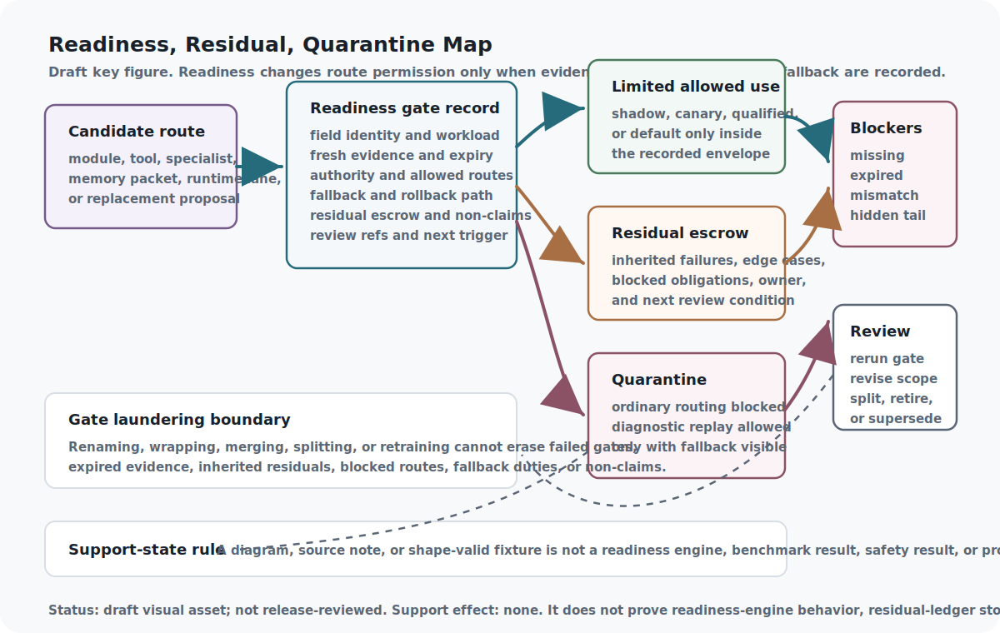

<!--
Curated reader manuscript draft.
chapter_id: readiness-gates-residual-escrow-and-quarantine
generated_baseline_ref: build/reader_edition/chapters/readiness-gates-residual-escrow-and-quarantine.qmd
live_source_ref: chapters/readiness-gates-residual-escrow-and-quarantine.qmd@b6c86ba39
This file is a reader-prose derivative only. Preserve claim meaning,
support-state boundaries, source boundaries, proof/test status,
implementation horizons, and release blockers.
-->

# Readiness Gates, Residual Escrow, and Quarantine

A capable system should not treat "available" as the same thing as "ready."
A specialist can be reachable, fast, cheap, or impressive on a narrow test and
still be wrong for ordinary use. It may be stale. It may have unresolved
regressions. It may need a narrower authority envelope. It may be safe enough
for diagnosis but not safe enough for routing.

Readiness is the layer that makes those distinctions explicit. It says what a
module is allowed to do now, what evidence supports that permission, when the
permission expires, what failures remain in escrow, and where the system must
route if the gate fails. In ordinary software terms, it is release engineering.
In the ASI Stack, it is release engineering for intelligence.

The chapter's central idea is simple: uncertainty should have an operating
mode. A promising capability does not need to be trusted or discarded. It can
be kept in shadow, canary, diagnostic use, quarantine, or review until the
evidence catches up. That makes progress slower on paper and safer in
practice, because the stack can remember promise without spending it as
permission.

{#reader-fig-readiness-residual-quarantine-map fig-alt="Draft readiness residual quarantine map showing a candidate route or replacement proposal entering a readiness gate record, splitting into limited allowed use, residual escrow, quarantine, blocker handling, review rerun, gate-laundering boundary, and support-state non-claim boundary."}

Figure boundary: this draft reader aid shows readiness, residual, and
quarantine routes. It is not release-reviewed art and does not prove lifecycle
execution, live quarantine behavior, rollback behavior, or support-state
promotion.

## Problem

Routing creates candidates. It finds a specialist, tool, memory packet,
runtime lane, or replacement that might fit the current task. That is useful,
but it is not enough.

A candidate may pass one benchmark while failing an older floor. It may work
for a workload family but not for a different authority tier. It may be safe
in canary and dangerous as default. It may be valid only while a freshness
window is open. If the architecture records only the successful comparison,
the failed obligations disappear exactly when future systems need them.

The stack therefore needs lifecycle states richer than "on" and "off." A
target can be draft, shadow, canary, qualified, default, diagnostic-only,
quarantined, retired, or superseded. Those states need to be scoped to a field
identity, workload family, evidence packet, authority envelope, fallback path,
residual set, and expiry. Otherwise, a benchmark win becomes a permission
grant by inertia.

## Why Ordinary Readiness Fails

Most systems have some readiness idea: release checklists, smoke tests,
benchmarks, feature flags, incident gates, model evaluations, or governance
reviews. The problem is that these surfaces often live apart. A benchmark
records performance. A router records selection. A safety review records risk.
A changelog records deployment. A bug tracker records failures. The promotion
decision happens between them.

This chapter joins those surfaces into one transition record. Benchmaxxing
contributes the idea that benchmarks are temporary pressure surfaces rather
than permanent definitions of intelligence. RMI contributes residual escrow:
the tail of unsolved cases should remain visible as the frontier moves. Stable
Capability Fields contributes scoped, defeasible, expiring qualification.
Octopus Router contributes arm cards, route permissions, and quarantine.
Theseus contributes report-first architecture gates and a public-safe static
import slice. MoECOT remains connector/source-note context only.

External baselines sharpen the same boundary. NIST AI RMF and frontier-model
governance separate risk framing, evaluation, monitoring, and deployment
decisions. HELM, BIG-bench, Dynabench, and benchmark-contamination work show
why benchmark state matters. TLA+, PRISM, Black-Box Simplex, and Copilot offer
formal, probabilistic, and runtime-monitoring vocabulary. The ASI Stack does
not claim to outperform those systems here. It uses them as comparators for a
book-level design claim: readiness should be a governed lifecycle record, not
a loose score.

## Core Claim

Readiness gates and residual escrow should govern when modules are promoted,
quarantined, split, merged, retired, or retrained. In the live book, this
claim remains a design rationale supported at `argument`.

The current repository supports the claim only as architecture. It has a
`readiness_gate_record` schema, public-safe fixtures, two finite Lean
predicates, and a synthetic readiness/residual harness. It also has one
static, digest-verified Project Theseus architecture-gate report import. These
artifacts are useful discipline, but they do not prove a deployed readiness
engine, residual-ledger storage, benchmark quality, live quarantine routing,
current Theseus runtime behavior, or MoECOT replay.

## Mechanism

A readiness gate turns a candidate into a scoped permission decision. It does
not change what the capability is. It changes where, when, and how that
capability may be used.

```{mermaid}
flowchart LR
  Candidate["Candidate module, route, tool, or replacement"] --> Evidence["Gate evidence"]
  Evidence --> Floor["Regression floor"]
  Floor --> Residuals["Residual escrow"]
  Residuals --> Scope["Authority, workload, and freshness scope"]
  Scope --> Decision{"Lifecycle decision"}
  Decision -- "ready within scope" --> Route["Allowed route or canary"]
  Decision -- "not ready" --> Quarantine["Quarantine, shadow, rerun, or retire"]
  Route --> Ledger["Lifecycle ledger"]
  Quarantine --> Ledger
  Ledger --> Monitor["Monitor window and requalification trigger"]
```

The gate has three jobs.

First, it separates frontier evidence from floor evidence. Frontier evidence
says what the target newly handles. Floor evidence says what it must not
forget. A capability that moves the frontier while erasing the floor is not
ready for default use.

Second, it gives residuals custody. A residual is not a vague concern. It
names an unresolved failure, uncertainty, edge case, stale proof, missing
holdout, untested workload, weak fallback, or blocked obligation. A residual
can remain acceptable only when its scope, trigger, owner, next review
condition, and routing effect are visible.

Third, it makes quarantine productive. Quarantine is not deletion. A
quarantined target can remain available for diagnosis, replay, repair, or
restricted review while ordinary routes are blocked. That lets the system
learn from failures without leaving the failed path live.

## Interfaces

The central interface is the Readiness Gate Record. A useful record names the
gate ID, target ID, target kind, field ID, current state, candidate state,
workload family, freshness window, evidence state, gate evidence, floor
evidence, frontier evidence, regression results, residual escrow, inherited
residuals, authority scope, allowed routes, blocked routes, diagnostic
permissions, fallback path, expiry, decision, closure conditions, review
references, next review trigger, and non-claims.

Different layers read different parts of the same record. The router reads
allowed and blocked routes. Benchmark ratchets update frontier and floor
evidence. Stable Capability Fields and replacement transactions use readiness
records for qualification and rollback. Artifact graphs preserve the decision
history so future systems can tell the difference between not tested, tested
and failed, tested only in a narrower scope, and approved for ordinary use.

This shared record prevents a common failure: evidence migration. A result
created for diagnostic use should not silently become default-route authority.
A source-reported implementation claim should not silently become reproduced
runtime evidence. A stale gate should not silently become a current gate
because the target changed names.

## Invariants

Promotion requires gate evidence. If the record has no admissible evidence for
the requested state, the route may be blocked, narrowed, placed in canary, or
sent to review, but it should not become ordinary execution.

Residuals survive promotion. A narrower success can be useful without erasing
the tail that remains outside the scope.

Quarantine blocks ordinary routing. It may preserve diagnostic access, but the
ordinary control path should not keep selecting the quarantined target.

Freshness matters. A gate that was valid before an architecture change,
authority change, benchmark change, frontier shift, or incident may need rerun
before it can support the same permission.

Inherited residuals survive rename, wrapper, split, merge, retirement, and
retraining unless a separate record retires them. A failed target should not
be able to reenter ordinary routing by changing identity labels.

The current Lean hooks prove only small finite-record boundaries: a modeled
promoted decision requires all required gates to pass, and a modeled
quarantined target cannot be selected for ordinary routes. They do not prove
benchmark quality, residual-ledger integrity, lifecycle-engine correctness,
runtime routing behavior, or readiness of any real module.

## Failure Modes

Premature promotion turns a narrow success into a broad default before the
floor, authority scope, residuals, fallback, and monitor window are known.

Residual hiding removes exactly the cases that should guide the next
improvement. The frontier looks cleaner because the tail vanished from the
record.

Stale gate reuse treats old evidence as if it survived a new architecture,
model, route, benchmark, authority envelope, or incident.

Under-quarantine leaves a failed or unready target available for ordinary
selection. Over-quarantine blocks useful diagnostic work and hides the
difference between unsafe execution and safe analysis.

Gate laundering is the most dangerous failure. A target fails readiness under
one name, is wrapped or merged under another, and then returns as if the old
residuals never existed.

## Minimum Viable Implementation

The minimum viable implementation is a readiness record schema plus fixture
suite. It should validate record shape and test several lifecycle cases:
draft to shadow, shadow to canary, canary rejected by inherited residuals,
quarantined for ordinary routing but available for diagnostic replay, and
later superseded after regression-floor preservation.

The current repo has that first layer in partial form. Protocol validation
checks the schema and fixtures. `scripts/validate_readiness_residual_gates.py`
checks synthetic scenarios for transition decisions, residual custody,
quarantine, expired reruns, fallback paths, and rollback-readiness links.
`AsiStackProofs.ReadinessGates` gives finite Lean predicates for promotion and
ordinary-route quarantine.

That is enough to make the contract inspectable. It is not enough to claim a
working readiness engine, live route enforcement, residual-ledger storage,
benchmark correctness, or deployed governance.

## Beyond the State of the Art

The mature endpoint is a lifecycle control plane for routable and replaceable
capability. Every candidate would carry a current readiness state, evidence
packet, authority envelope, workload family, freshness window, residual escrow,
allowed routes, blocked routes, fallback path, monitor window, and next review
trigger.

In that end state, improvement would not erase failure. Unresolved failures
would become residual escrow. Repeating residuals would become benchmark
candidates. Passed canaries would become scoped qualification. Stale
qualification would expire. Unsafe or misleading targets would remain
available for diagnostic replay without remaining in ordinary routing.

The important change is compositionality. Routing, benchmarks, replacement,
artifact graphs, governance, and self-improvement would read the same
readiness record. A module could not quietly widen its scope, lose residuals,
reuse stale evidence, or route through a failed gate without creating a visible
boundary delta.

This remains a design destination. The book does not claim that endpoint until
promotion, demotion, quarantine, escrow, stale-gate replay, reroute, and
failed-candidate traces show that unready capability is contained and that
residual burden follows the route instead of disappearing.

## Summary

Readiness is the stack's refusal to confuse a plausible route with a governed
route. It turns evidence into scoped permission and turns missing evidence
into an explicit state.

Residual escrow keeps unfinished work attached to the capability that created
or inherited it. Quarantine keeps failed or stale capability out of ordinary
execution while preserving diagnostic value. Together, they let the stack say
"not yet" without losing the reason.

## Handoff

Readiness gates define what evidence a module owes before ordinary routing,
but the architecture still needs a runtime reference capable of emitting those
records. MoECOT Runtime and Multi-Core Orchestration follows as that
implementation-reference lane. It shows what route heads, specialist cores,
fail-closed gates, ledgers, replay hooks, denied routes, and promotion blockers
would have to look like in one orchestrated system, while still remaining
unreproduced in this repository.
