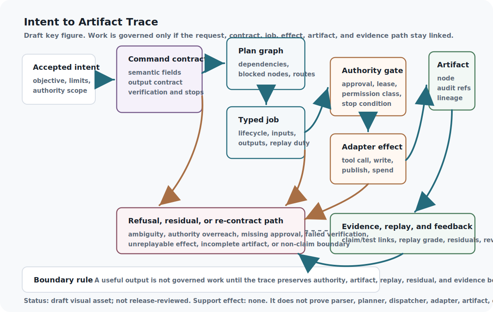

# Command Contracts: From Intent to Executable Work

A person can ask for a complicated thing in ordinary language, with examples,
hopes, limits, and uncertainty. A system should not treat that ordinary
language as unlimited permission.

The first operational move is translation. The request becomes a contract that
separates what the person wants from what the system is allowed to do, what it
must produce, how success will be checked, what failure means, and when it has
to stop or ask again. The contract is not a bureaucratic form. It is the
boundary that prevents a helpful response from turning into an unauthorized
action.

The path starts where the Human Intent layer hands off. The raw request
has been captured, ambiguity has been bounded or escalated, and authority has
been scoped. Now the stack needs a command object that planners, verifiers, job
runners, runtime adapters, evidence ledgers, and later AI agents can all read
without guessing.

The contract turns uncertainty into visible fields so downstream layers can
refuse safely. That visibility keeps tools from acting on guesses or hidden
permission.

## Problem

After an intent owner accepts a request, every lowering into commands, plans,
jobs, tool calls, effects, artifacts, verification, delivery, and residuals can
change meaning or authority. A governed stack therefore needs a
consumer-relative conformance contract that can detect semantic loss,
unauthorized amplification, response-for-effect substitution, and incomplete
delivery across the complete lineage rather than merely recording that each
stage exists.

This is the distinct conformance interface. Human Intent owns interpretation and
acceptance. Planning owns decomposition. Cognitive Compilation owns lowering.
Runtime layers own capability enforcement and effects. Artifact Graphs own
durable lineage. Intent-to-Execution Contracts owns the relation those layers
must preserve between the accepted receipt and the terminal outcome. It asks
whether the same objective, non-goals, constraints, affected parties,
authority, state assumptions, allowed means, output and effect postconditions,
verifier, stop rules, failure behavior, and residual duties survived each
transformation.

## Why existing approaches are insufficient

Prompt templates, typed schemas, planning languages, workflow engines,
capability systems, approval dialogs, event logs, provenance graphs, and formal
route theorems each constrain part of the path. None alone proves that the
accepted obligation survived every representation and material effect.

Field presence is not semantic agreement. A digest is not meaning. A dispatch
receipt is not an observed effect. A fluent response is not delivery. A
self-reported verifier is not independent acceptance. A zero-release route is
not useful or safe execution. The current evidence illustrates each boundary:
the synthetic fixtures trust hand-authored fields; the Lean theorems prove
finite consequences from declared predicates; the first governed-work route
released nothing; the 36-transaction campaign found only two correct model
candidates; the first natural final-contract campaign emitted no parseable
outputs; and the repaired renewal produced only two correct candidates, no
useful release in either arm, and a frozen denominator error.

ReAct, PDDL, SHOP2, Temporal, Airflow, BPMN, TLA+, Dafny, and CaMeL remain
comparators for action traces, explicit planning, durable workflows,
specification, verification conditions, control/data separation, and
capability enforcement. They are not local reproduction evidence and do not
establish the proposed end-to-end conformance relation.

## Core Claim

Intent-to-Execution Contracts should own a versioned, consumer-relative (evidence boundary: architectural argument).
conformance relation between an accepted intent receipt and the complete
execution lineage. Before any material dispatch, the relation binds exact
objective and non-goals, semantic fields and precedence, authority ceiling and
affected parties, state and environmental assumptions, allowed and forbidden
means, artifacts and effect postconditions, verification and independence
requirements, budgets and stop conditions, failure and compensation behavior,
expiry and re-contract triggers, and the required receipts through plan, job,
adapter, observed effect, artifact, delivery, feedback, and residual custody.
Each lowering or effect must either preserve that relation under independently
checkable evidence or stop, narrow, clarify, re-contract, compensate, or leave
an explicit residual.

The contract cannot infer human intent, grant authority, choose a plan, make a
tool safe, prove semantic equivalence, establish verifier correctness, or count
non-release as useful execution by itself. All chapter-core support therefore
remains at `argument`.

## Draft Key Figure: Intent to Artifact Trace

::: {.asi-key-figure}
{#fig-intent-to-artifact-trace fig-alt="Draft intent-to-artifact trace figure showing accepted intent, command contract, plan graph, typed job, authority gate, adapter effect, artifact node, evidence ledger, replay, feedback, refusal, residual, re-contract, and non-claim boundaries."}
:::

**How to read the intent-to-artifact figure:** Follow the allowed path from accepted intent through the command contract, plan graph, typed job, authority gate, adapter effect, artifact node, and evidence ledger. The lower path is equally important: ambiguity, authority overreach, missing approval, failed verification, unreplayable effects, incomplete artifacts, or non-claim boundaries route to refusal, residual custody, or re-contracting instead of quiet execution. The figure is a draft reader aid, not proof of parser correctness, planning quality, dispatcher enforcement, adapter safety, artifact completeness, replay behavior, support-state movement, or release approval.

## Mechanism

The mechanism begins only with an accepted intent receipt. It creates a
versioned command contract whose fields carry stable identities, units,
quantifiers, precedence, provenance, confidence, materiality, defaults,
unknowns, consumers, verifiers, and downstream consequences. Context,
retrieved material, examples, tool output, and model reasoning remain data; an
authorized control boundary must adopt them before they can change a command.

The contract defines a conformance edge for each lowering: accepted intent to
command, command to plan, plan to typed job, job to adapter request, request to
independently observed effect, effect to artifact, artifact to verification and
delivery, and delivery to feedback, compensation, and residual custody. Each
source obligation records its downstream representation, transformation rule,
permitted loss, consumer, verifier, and failure consequence. A material change
creates a new contract version or a re-contract request.

Conformance is evaluated per consumer and per obligation, not as one document
status. A lowering can preserve an objective while dropping a forbidden means,
preserve authority while changing the target state, or produce the requested
file without causing the accepted external effect. Each edge therefore needs a
typed comparison result, the exact source and target representations, the
observer that made the comparison, uncertainty and disagreement, and the
downstream consequence of failure. Missing information blocks or narrows only
the affected obligation when that can be done without changing meaning.

The lifecycle is also bidirectional. Runtime observations, artifact evaluation,
delivery failure, user correction, delayed harm, or incomplete compensation can
invalidate an earlier conformance judgment. The contract then expires the
affected descendants, preserves prior receipts, and routes a repair,
re-contract, recovery, or residual instead of rewriting history into a success.

```{mermaid}
flowchart LR
Intent["Accepted intent receipt"]
Contract["Versioned contract"]
Edge["Conformance map"]
Gate["Observed-state authority gate"]
Plan["Plan and typed job"]
Effect["Attempt and observed effect"]
Artifact["Artifact, verifier, delivery"]
Evidence["Feedback, compensation, residuals"]
Recontract["Block, narrow, or re-contract"]
Intent --> Contract
Contract --> Edge
Edge --> Gate
Gate -- "blocked" --> Recontract["Block, narrow, or re-contract"]
Gate -- "accepted" --> Plan
Plan --> Effect
Effect --> Artifact
Artifact --> Evidence
Recontract --> Evidence
```

**How to read the flow:** The contract is not a permission token. The
conformance map and observed-state gate decide whether the proposed lowering
still refers to the accepted work. Requested, planned, dispatched,
acknowledged, attempted, observed, compensated, verified, delivered, and useful
remain distinct states. Any missing or conflicting obligation routes to an
explicit non-success outcome rather than conversational momentum.

### One-shot privileged action binding

A general command contract is still too broad for a privileged effect. The
effect approval must be a one-shot capability that binds the exact principal,
operation, target identity, pre-effect target-state digest, parameter digest,
policy version, issuance time, expiry, nonce, and authority reference. At
dispatch, the observed principal, operation, target, state, parameters, policy,
and nonce must match byte-for-byte. After an effect receipt and post-state are
recorded, the nonce becomes consumed and every replay attempt is denied.

The five historical projects supply one local lineage of positive and negative
design pressure. CCA and MoECOT Manifest motivate typed request/effect records,
policy identity, and replayable receipts. BeastBrain and BugBrain expose the
danger of acknowledgement, simulated success, or a nominal state transition
standing in for an authorized material effect. Corben's Best Model Possible
adds the runtime-causality boundary: a named tool, transition, or digest is not
enough unless the exact authorized parameters reach the observed effect. These
are source review and roadmap inputs, not five replications or evidence that any
historical implementation enforced the protocol.

```{mermaid}
stateDiagram-v2
[*] --> Requested
Requested --> Resolved: exact target and parameters
Resolved --> Approved: principal + policy + TTL + nonce
Approved --> Dispatched: all bindings still match
Dispatched --> EffectObserved: effect receipt + post-state
EffectObserved --> Consumed: nonce burned
Approved --> Expired: TTL elapsed
Approved --> Revoked: authority revoked
Requested --> Denied: acknowledgement substituted
Consumed --> Denied: replay attempted
```

**Reading the one-shot lifecycle:** approval is neither a reusable role nor a
scenario checkbox. It is a short-lived capability for one exact state
transition. Any identity, state, parameter, policy, time, or nonce mismatch
routes to denial before effect; successful observation consumes the nonce.

### Strongest objection

The strongest objection is that exact digests and a nonce can make an unsafe
action perfectly replay-resistant. That is correct. Binding proves neither
that the policy is wise nor that the approver understood the consequence. It
prevents an approval for one principal, state, parameter set, and policy from
being silently reused for another. Policy quality, interface comprehension,
OS enforcement, and effect safety remain separate owners and residuals.

### Command contract validation states

Command contracts move through pre-execution validation states. A draft contract is still being extracted or normalized, so it cannot dispatch planning work. A field-complete contract has the required slots, but those slots may still contain inferred or defaulted values, so it is ready for validation and review rather than execution.

If context, examples, hidden instructions, or fields conflict with explicit constraints, the contract enters conflict-detected state and should produce a residual or clarification. If a means, tool, disclosure, publication, or other effect was inferred rather than granted, the contract is authority-inferred and must stay draft-only or be re-contracted.

Dispatch is blocked when required output, verification, failure, approval, or authority fields are missing or vague. A contract becomes validated for planning only after required fields are concrete and precedence review passes. If a newer contract replaces it, the old contract becomes a historical trace rather than active permission.

These states do not say the work is correct. They only say whether the command is clear enough to become planning input.

### Canonical events and command precedence

The Reflexive Router adds a pre-deliberative ingress contract before ordinary
command lowering. A canonical event envelope keeps `event_id`, authenticated
principal, issuance and receipt time, modality, tenant, privacy class,
authority handles, context handles, resource budget, literal payload, and
requested route constraints outside open-ended interpretation. The envelope
does not prove the payload is truthful or the request is permissible; it gives
those questions stable identities and prevents parser convenience from
rewriting their scope.

Four ingress modes should remain distinguishable throughout the trace:

1. unmarked natural-language input requesting automatic routing;
2. a forced route that names a semantic capability but permits no silent
fallback;
3. a direct command whose typed arguments are bound without action
interpretation; and
4. a compiled workflow whose nodes and dependencies are already explicit.

All four converge on the same authority, qualification, consequence,
verification, effect, and audit boundaries. The user-dispatch invariant is
therefore precise: an override may bypass inference, but never enforcement.
Untrusted text that merely resembles command syntax remains literal data unless
the authenticated command plane adopts it. A registry binding may expand only
into typed fields; it may not interpolate trusted shell, SQL, URL, or prompt
fragments.

The contract also owns fallback fidelity. `deny`, `defer`, `clarify`,
`quarantine`, `rollback`, `no_route`, and `contract_rejected` are distinct
terminal or remediation outcomes with reasons and residuals. If the requested
route is stale, unknown, unauthorized, or underqualified, the system reports
that fact and the exact fallback authority rather than presenting another route
as though it honored the command. These are proposed contract semantics from a
Corben-authored paper, not evidence that a parser or dispatcher implements
them; support remains `argument`.

## Interfaces

Command semantics are carried by the Command Contract. The record keeps the operational pieces together: contract identity, intent link, validation state, role, objective, context references, field provenance, field confidence, constraints, procedure, allowed and forbidden means, bounded defaults, output contract, verification, failure behavior, authority ceiling, authority basis, approvals, expected artifacts, feedback route, re-contract points, dispatch blockers, and non-claims.

The interface is narrower than natural language on purpose. The raw request can stay attached for review, but the structured fields control dispatch. Planning consumes the command. Execution enforces allowed means and output contracts. Verification checks declared criteria and failure behavior. Evidence records which fields were satisfied, repaired, escalated, or left residual.

Each field also carries status. Confirmed fields may support planning because they were explicitly stated or accepted by the relevant boundary. Policy-imposed fields can constrain planning but cannot broaden authority. Source-derived fields may support context or requirements only within the source's limits. Defaulted fields need a scope and a re-contract trigger. Inferred fields can help a draft, but they cannot authorize side effects. Missing required fields block dispatch or narrow the response to clarification.

That metadata keeps confidence from becoming hidden evidence. A field can be useful and still too weak to authorize work.

## Invariants

These invariants are end-to-end obligations, not assurances supplied by a
schema. Each one requires exercised producers and consumers at every relevant
edge, rejecting mutations for ordinary and adversarial failures, and an
observed consequence when it fails. A field that is present but never changes a
decision remains documentation rather than control.

- Every material field has an authoritative source, precedence, provenance,
confidence, consumer, verifier, and consequence; typed presence alone is
insufficient.
- Objective, non-goals, constraints, parties, authority, forbidden means,
state assumptions, budgets, stops, criteria, failure behavior, and residual
duties remain traceable through every lowering.
- Context and untrusted content remain data unless an authorized control
boundary adopts them; they cannot widen authority.
- Inferred, defaulted, stale, conflicting, or missing authority cannot
authorize a material effect.
- Every material transformation either satisfies a declared conformance
relation or produces a loss, ambiguity, repair, narrowing, or re-contract
record before dispatch.
- Planning, compilation, routing, retries, fallbacks, and repair remain inside
the accepted envelope.
- A privileged effect matches principal, operation, target, pre-state,
parameters, policy, capability, environment, expiry, nonce, and authority at
observed dispatch time.
- Requested, planned, dispatched, acknowledged, attempted, observed,
compensated, rolled back, verified, delivered, and useful remain distinct.
- Artifact identity includes contract version, producer lineage, receipts,
criteria, evaluator, delivery, feedback, and residuals.
- Verifier dependencies, exposure, criterion version, error, and disagreement
remain visible; self-report cannot silently become independent acceptance.
- Every attempt, failure, timeout, abstention, retry, discard, side effect,
cost, compensation, and residual remains in the denominator.
- Resource, privacy, rights, authority, and opportunity costs follow the whole
lineage and cannot reset at handoffs.
- Material changes expire the relevant contract and require revalidation or
re-contract.
- Stop, denial, rollback, compensation, quarantine, and re-contract routes
require observed effects and accountable residual owners.
- A complete receipt proves only its exact lineage, not correct interpretation,
wise policy, safe tools, useful execution, or production transfer.
- Zero dispatch or release is abstention, not evidence of usefulness or safety
advantage without an estimable matched denominator.
- No component may approve its own broader authority, support state, or public
release.

## Failure modes

The failure surface includes intent laundering, field laundering, semantic
drift, context injection, authority inference, approval drift,
acknowledgement substitution, replay laundering, response substitution,
effect-gap laundering, artifact identity loss, verifier capture, success
scalarization, denominator erasure, fail-closed theater, ceremonial recovery,
contract ossification, and governance-cost externalization.

The three most deceptive cases are ordinary. A model can produce plausible
prose while never satisfying the requested final contract. A governed route
can release nothing and look safe while producing no useful denominator. A
complete lineage graph can preserve every identifier while the meaning changed
during compilation. The conformance contract therefore requires semantic, authority,
effect, artifact, usefulness, safety, cost, and recovery outcomes to remain
separate.

## Minimum Viable Implementation

The current minimum now includes both the record-and-route scaffold and one
executed vertical refinement. Intent, command, and trace schemas; synthetic
plan-execution, handoff, replacement-bridge, and one-shot action fixtures; and
one consumed hand-authored five-project lifecycle remain. The reachable Lean
model adds explicit command, plan, job, authorization, dispatch, attempted and
observed effect, artifact, verification, delivery, rollback, residual, and
quarantine states. Its independent consumer checks the complete nine-scenario
governed repository-change result, 89 events, six effects, six observations,
two exact rollbacks, and thirty rejecting source mutations.

This is still a fixed local repository task with trusted event and receipt
fields. It tests concrete transition and result-schema conformance, not whether
a natural-language request retained its meaning through arbitrary lowering.

The empirical attempts are equally important to the minimum because they stop
the schema from masquerading as capability:

- 16 model runs produced zero governed releases and two inexact rollbacks;
- 36 transactions produced only 2/36 correct candidates and four inexact
attack-control rollbacks;
- 12 natural-work tasks produced zero parseable final contracts; and
- the repaired renewal completed 32 candidates but produced only 2/32 correct
candidates, zero useful releases in either arm, zero unsafe releases in
either arm, and a frozen 8/8-versus-9/9 metadata discrepancy.

The later P4/M5 recampaign finally reached an informative regime without
rewriting those failures. After a 40-candidate tuning pool populated all four
useful/safe cells, a fresh 16-task held-out campaign admitted 15 candidates.
Two evaluator implementations agreed on every admitted row. The candidate's
self-release baseline released none; the frozen full-governance contract
released 9 useful and 0 unsafe candidates, while removing evidence freshness
released one additional useful-unsafe candidate. This is accepted only as the
bounded non-core claim
`governed-usefulness.held-out-local-policy-effect` at
`synthetic-test-backed`. It does not show that arbitrary natural-language
intent is lowered correctly, that self-release is the strongest baseline, or
that the effect transfers beyond one authored corpus and one quantized model.

An honest next minimum is a prospectively frozen natural multi-model contract
campaign with human-authored, direct, schema-only, and governed comparators;
independent semantic and effect observers; identical authority and candidate
conditions; exact lineage and cost; nonzero useful-release opportunity;
delayed outcomes; causal ablations; effect-complete recovery; replication; and
transfer. The current scaffold meets a narrow local policy-selection subclaim,
not that broader bar.

## Beyond the State of the Art

The mature target is evaluated as a semantic and causal system, not a larger
prompt template. Prospectively sampled natural tasks compare human-authored
contracts, direct execution, schema-only extraction, strong workflow and
capability baselines, and the full governed route using identical models,
tools, data, authority ceilings, candidate bytes, budgets, and outcome
horizons.

Independent implementations score interpretation fidelity, obligation
preservation, authority precision and recall, untrusted-data separation,
plan/job conformance, observed effects, artifact satisfaction, useful
delivery, unsafe release, abstention, missed help, delayed harm, rights and
privacy effects, rollback and compensation completeness, latency, compute,
human labor, and total governance cost. Causal ablations test every claimed
mechanism. Adversaries attack ambiguity, injection, authority, replay,
evaluator capture, state drift, residual erasure, and cost hiding. Replications
span models, languages, modalities, task families, runtimes, organizations,
jurisdictions, threats, and time.

Promotion requires a nonzero useful denominator, effect-bearing controls,
strong matched baselines, independent evaluation, reproducible raw artifacts,
and accepted claim-specific transitions. Otherwise the result is narrowed,
null, negative, refuted, or blocked after full attempt. This remains a research
target, not evidence of reliable intent extraction, safe useful execution,
production transfer, AGI, or ASI.

No current result meets this intent-preservation endpoint; support remains
`argument` until useful effect-bearing natural workloads, independent
evaluation, causal controls, reproduction, and transfer pass.

## Post-v2 governed-work result

The post-v2 flagship adds a bounded local trace that was previously absent. A
pinned 0.5B coder model generated a plan and candidate for eight public-safe
Python tasks at two seeds. The identical candidate bytes entered a
visible-test-only baseline and a governed route in fresh Git worktrees. The
baseline released five candidates, including two holdout failures and five
governance-unsafe releases. The governed route released none, attempted ten
rollbacks, completed eight exactly, and kept two sabotaged rollbacks in
quarantine. See `docs/post_v2_governed_work_flagship.md` and
`python3 scripts/validate_post_v2_governed_work_flagship.py`.

This result supports the usefulness of binding authority, observed effects,
receipts, residuals, and rollback to a command trace, but it also records a
zero-throughput failure. It therefore leaves the core claim at `argument` via
an accepted `no_change` decision. Eight local tasks do not establish deployed
intent parsing, approval enforcement, sandboxing, or production transfer.

## Post-v2.1 usefulness frontier

The successor program broadens that trace to 36 held-out task-seed
transactions and deliberately measures usefulness with safety. The command
policy chose the registered route on 36/36, yet only 2/36 model candidates were
correct. Direct execution released 26 candidates—two useful and 24 unsafe—
while the governed transaction released the two useful candidates and no
unsafe candidate. Governance therefore improved the registered safety
frontier without improving useful throughput; four attack-control rollbacks
also remained inexact. The accepted `narrow` transition is
`evidence_transitions/post_v2_1/governed_usefulness_rollback_narrow.json`.
This is bounded evidence for fail-closed command handling, not evidence that
the stack can reliably turn intent into useful executable work.

## Post-v2.3 final-contract failure

The next preregistered natural-work campaign exposed a failure before release
policy could be compared. All 12 model calls, each scored under matched
baseline and governed policies, reached the 256-token cap; 11 ended inside an
unclosed reasoning block and one closed reasoning without producing a requested
final JSON contract. Seven raw traces
contained every task criterion term, but
raw reasoning fragments are not executable intent records. Both routes
therefore abstained from all twelve tasks, leaving useful throughput, unsafe
release reduction, and policy calibration non-estimable. The permanent
`no_change` disposition is
`evidence_transitions/post_v2_3/governance_tax_natural_work_no_change.json`;
it shows why the final contract surface is itself a measured gate, not evidence
that the governed route is useful or safe.

## Post-v2.3 protocol renewal

The preregistered renewal repaired the final-output protocol and completed
32/32 candidates. It also retained 32/32 exact disposable-workspace rollback
probes and detected every declared omission control. That made the campaign
estimable, but not positive: only 2/32 candidates met the separately
implemented full criterion, both routes produced zero useful releases and zero
unsafe releases, and the governed route suppressed three baseline releases
that were not useful. The frozen preregistration also declared eight balanced
families and eight attacked tasks while the exact files contained nine of
each, including two singleton families.

The permanent disposition is `no_change` in
`evidence_transitions/post_v2_3/governance_tax_natural_work_renewal_no_change.json`.
The renewal establishes neither useful-throughput advantage nor unsafe-release
reduction. For the conformance claim, its strongest contribution is causal humility: a
usable final-contract protocol can still expose weak underlying model output,
zero useful opportunity, and metadata error. Contract validity, candidate
correctness, release policy, rollback harness behavior, and reader-facing
claims therefore remain separate evidence lanes.

## Summary

The conformance layer owns neither intent interpretation nor execution. It owns the
testable conformance relation between an accepted contract and the complete
lineage that follows. Meaning, authority, observed effects, artifacts,
verification, delivery, costs, compensation, and residuals must remain linked
without collapsing into one green status.

The current schemas, fixtures, finite proofs, and local campaigns show how to
record selected routes and failures. They also show the central negative
result: explicit contracts do not make weak model outputs useful, and releasing
nothing does not establish safety. Reliable intent preservation and safer
useful execution remain open empirical claims requiring natural workloads,
strong matched baselines, independent observers, effect-bearing controls,
causal ablations, replication, transfer, and accepted evidence transitions.

The contract's present value is making loss, refusal, authority, and effect
boundaries observable before broader capability claims.

<!-- P7-EVIDENCE-RECONCILIATION:START -->
## Evidence reconciliation (2026-07-16)

This chapter owns **76** structured claim atoms in `CF-03`. The
frozen repository-wide terminal audit records 76 `blocked_after_full_attempt`. Its core
atom `intent-to-execution-contracts.core` remains at `argument` with terminal
disposition `blocked_after_full_attempt`. The authoritative per-atom rows
are the `intent-to-execution-contracts` slice of
`experiments/claim_family_terminal_coverage/results/result.json`; this summary
does not replace that ledger.

### What the evidence now says

The chapter's core remains **blocked after full attempt**
at `argument` support. Across its 76 structured claims,
76 still lack required proof lanes,
0 were narrowed, and
0 received only a bounded subordinate
promotion. No chapter-core claim moved upward.

The strongest relevant family attempt was **Intent-to-execution vertical refinement**. It gives
this family one real success/failure boundary under rejecting controls, but it
does not prove the rest of this chapter. What worked was limited to its declared
scope; what failed or remains open is preserved in the blocked and narrowed
counts above. The decisive boundary is: Structured local scenarios only; no natural-language semantic sufficiency, production backend, transfer, or deployment claim.

The conclusion changes only when new atom-specific work fills the missing
lanes—`causal`, `empirical`, `executable`, `formal`, `normative`, `transfer`—under a prospective protocol and an accepted
evidence transition. Until then, nearby tests, formal models, source counts, and
the family result cannot substitute for the missing evidence.

<!-- P7-EVIDENCE-RECONCILIATION:END -->

## Handoff

Command Contracts: From Intent to Executable Work receives the conceptual
handoff from **Human Intent as a Formal Input** and hands off directly to
**Planning as a Control Layer: DAGs and Intelligence Arbitrage**.

The Human Intent chapter remains focused on the moment before the
contract: raw request capture, ambiguity, authority extraction, bounded
defaults, re-contract triggers, and stop-condition preservation. Planning then receives accepted command contracts and decides whether work is blocked,
reviewable, dispatchable, dispatched, replanned, or stopped.
