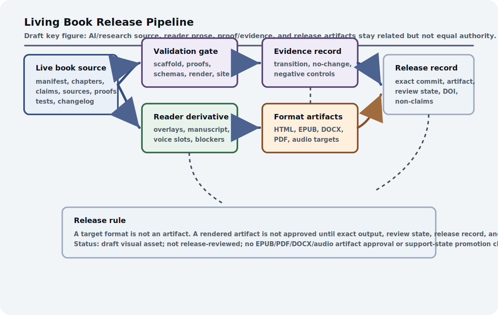

# Living Book Methodology

The prototype roadmap explains how the system should be built over time. The manuscript itself needs the same discipline so it can keep changing without losing its evidence controls. The manuscript is part of the architecture, not a static brochure about it. If the architecture is living, its written form must also have controlled change, reviewable lineage, and a visible boundary between aspiration and evidence.

Trust comes through process. The manuscript should remain readable, but it also has to show how parts move, how sources enter, how claims change state, how proofs and tests are recorded, and how reader editions are derived without becoming a separate truth. That makes the manuscript a demonstration of the governance discipline it argues for.

The same machinery that helps AI agents maintain the work should help humans see what changed and why. A living book is credible when its revisions leave receipts: source routes, changelog entries, validation reports, non-claims, and open residuals that make improvement auditable rather than mysterious. Receipts make revision trustworthy because later edits can find their debt.

## Problem

The book itself must remain a living technical system rather than a static anthology. That is not a publishing preference. It is part of the architecture. A book about governed self-improving systems should not improve by silently rewriting claims, losing source provenance, or hiding failed tests. It should model the same discipline it asks of the AI stack.

The living-book problem is versioned coherence. New papers will arrive. Chapters will split and merge. Proof targets will move from vague ideas to schemas or Lean modules. Some claims will strengthen, some will remain speculative, and some should be deprecated. The system needs a way to absorb those changes without making the reader guess which claims are current, which are supported, and which are only design hypotheses.

That operating system is the living-book method. It turns the manuscript into a governed artifact graph: manifest, outline, source inventory, source notes, claim matrix, proof manifest, schemas, tests, changelog, rendered site, and Git history.

## Why existing approaches are insufficient

Static manuscripts cannot show source additions, claim-state movement, deprecations, proof updates, render status, or test history.

The usual alternatives fail in opposite directions. A static PDF can be polished, but it freezes the source and evidence state at one moment. A loose wiki can change quickly, but it often loses architectural discipline. A code repo can validate structure, but it does not by itself explain the thesis to readers. A chat history can preserve intent, but it is not a public evidence artifact.

External governance and evaluation practice sets the public-record bar for a living book. NIST AI RMF (`ext_nist_ai_rmf_1_0_2023`) and frontier-governance work (`ext_frontier_ai_regulation_2023`) require lifecycle and oversight vocabulary, HELM (`ext_helm_2022`) models transparent multi-metric reporting, LiveBench (`ext_livebench_2024`) demonstrates living benchmark pressure, and contamination analysis (`ext_benchmark_contamination_2023`) warns that evaluation surfaces can go stale or leak. The living-book method uses those as publication discipline, not as evidence that the ASI Stack satisfies any governance framework.

Executable publication practice supplies the technical lineage. Literate programming (`ext_literate_programming_1984`) treats explanation and executable structure as one authored artifact. Jupyter Book (`ext_jupyter_book_docs`) shows a modern executable-book pattern around notebooks, Markdown, code execution, cross references, and web publication. Quarto Books (`ext_quarto_books_docs`) supplies the concrete multi-chapter publishing substrate used here. The ASI Stack method borrows from that lineage but adds claim/evidence ledgers, source queues, proof manifests, release records, reader/audio derivative boundaries, and explicit non-claims.

The living book needs all four properties at once: readable prose, versioned source, executable validation, and visible evidence state. That combination is what lets the project improve aggressively without becoming a moving target that no reader can audit.

The audience split makes this stricter, not looser. AI assistants need structured scaffolding. Human researchers need source maps and evidence state. General readers need coherent editions without scaffolding noise. A living book has to derive all three from one governed source rather than hand-maintaining divergent manuscripts.

## Core Claim

Living Book Methodology owns a book-, edition-, change-, source-, claim-, proof-, test-, render-, audience-, derivative-, release-, rights-, reviewer-, consumer-, environment-, and time-specific **Evidence-Preserving Publication Transaction**. It binds every substantive intake, structural edit, claim change, proof or test change, render, reader or audio projection, release, correction, rollback, and successor handoff to canonical source state, provenance, authority, validation, evidence effect, residuals, non-claims, and immutable lineage. Generated scaffolds, green validators, theorem builds, successful renders, local format artifacts, publication activity, or a polished release never by themselves establish source interpretation, editorial quality, accessibility, reader approval, chapter truth, capability, safety, external reproduction, transfer, AGI, ASI, or SOTA (evidence boundary: architectural argument).
The repository demonstrates the method in part through generated scaffolds, validators, proof manifests, schema fixtures, changelog entries, commits, and GitHub Pages renders. Those artifacts support release discipline, not the truth of every chapter claim.

## Draft Key Figure: Living Book Release Pipeline

::: {.asi-key-figure}
{#fig-living-book-release-pipeline fig-alt="Draft living book release pipeline figure showing live book source, validation gates, reader derivatives, evidence records, format artifacts, and release records while keeping their authority boundaries separate."}
:::

**How to read the living-book release figure:** Read the live book source as the canonical research artifact and the reader manuscript, format outputs, proof records, evidence records, and release records as related but not equal authority. Validation can show that scaffolds, schemas, proofs, render checks, and site checks passed; it cannot approve prose quality or prove chapter claims. A target format is not an artifact, and a rendered artifact is not approved until its exact output, review state, release record, residuals, and non-claims are named. The figure is a draft reader aid, not EPUB, PDF, DOCX, audio, release-artifact approval, manuscript-quality evidence, or support-state promotion.

## Mechanism

The owned object is an **Evidence-Preserving Publication Transaction**, not Quarto, CI, or a release checklist. Its lifecycle is:

| Phase | Required operations |
|---|---|
| 1. Freeze and identify | Freeze change objective, canonical commit, affected graph, audiences, authority, rights, release target, environments, time, and non-claims; assign stable IDs to chapters, sources, claims, proofs, tests, figures, derivatives, releases, residuals, corrections, and successors. |
| 2. Ingest and separate | Route public, local, private, connector, conversation, project, and external inputs through provenance, permission, source review, passage-review, readiness, and non-claim states; separate source report, author intent, synthesis, experiment, proof, editorial judgment, and open question. |
| 3. Atomize and change | Bind material claims to falsifiers, evidence lanes, mappings, contrary evidence, disposition, ceiling, residual, and consumers; link proof, executable, benchmark, and transition artifacts without substitution; issue a typed change packet for every substantive edit. |
| 4. Regenerate and validate | Regenerate scaffold, proof manifest, appendices, metrics, projections, status, and releases from canonical inputs; run the semantic, source, proof, executable, adversarial, rights, accessibility, render, browser, release, reproducibility, and deployment gates appropriate to the surface. |
| 5. Derive and decide | Keep AI/research, Human view, reader, HTML, DOCX, EPUB, PDF, companion, article, image, and audio outputs as typed derivatives; distinguish generation, inspection, accessibility, editorial approval, release approval, deployment, observation, archive, and external publication; move support only by accepted transition. |
| 6. Correct and continue | Preserve every terminal result and denominator; propagate corrections, downgrades, proof retirement, test failure, rights changes, release revocation, and derivative drift; monitor quality, freshness, debt, drift, accessibility, residuals, burden, and cost; hand exactly one active roadmap to the successor and expire changed transactions. |

The transaction begins by freezing what is changing and who may rely on the
result. That freeze separates canonical source from generated projections and
gives every affected claim, proof, test, figure, derivative, and release a
stable identity. Intake then records provenance, permission, public-safety
state, and source-reading depth before material is used. Atomization binds each
load-bearing proposition to falsifiers, contrary evidence, required lanes,
consumers, and a ceiling, so an elegant paragraph cannot outrun the records
that would challenge it.

Regeneration is a dependency operation, not cosmetic housekeeping. A changed
manifest must update the outline, chapter projections, proof manifest,
appendices, status surfaces, and derivatives that consume it. Validation checks
the appropriate semantic, executable, formal, adversarial, rights,
accessibility, render, browser, release, and deployment contracts while keeping
their meanings separate. A green render says the page rendered; a passing Lean
build says stated finite propositions compile; neither decides whether a source
was interpreted correctly or a core claim deserves stronger support.

Derivation and correction complete the loop. Human view, reader formats,
article text, images, audio, archives, and public sites retain their source
commit, generation environment, review state, approval state, residuals, and
non-claims. Corrections propagate through exact consumer edges, while negative,
failed, blocked, unpublished, superseded, and revoked outcomes remain visible.
The successor roadmap inherits unresolved obligations and one active authority
path, preventing maintenance from manufacturing completion by dropping old
failures or opening parallel definitions of current work.

Every terminal state therefore remains inspectable by its named consumers.

Quarto renders the book, but canonical structure, claim authority, proof scope, release identity, and derivative boundaries live in separate records. That separation is the rollback handle: a polished output can be rebuilt or withdrawn without rewriting what the source, claim, proof, or approval state actually was.

## Operating loop

```{mermaid}
flowchart LR
Source["New source or idea"] --> Triage["Triage into inventory and outline"]
Triage --> Notes["Source note or author-intent record"]
Notes --> Draft["Chapter revision"]
Draft --> Claims["Claim/evidence matrix update"]
Claims --> Proofs["Proof, schema, or test update"]
Proofs --> Validate["Validation and render"]
Validate --> Release["Commit, changelog, public live site"]
Release --> Editions["Reader/audio derivatives when tagged"]
Editions --> Residuals["Residuals, companion notes, and next queue"]
Residuals --> Triage

Notes -. "no note, no source-derived support" .-> Claims
Proofs -. "no run, no result" .-> Claims
Editions -. "target format is not an artifact" .-> Residuals
Validate -. "failure blocks release" .-> Draft
```

**What the living book ratchet shows:** The living-book loop treats sources, notes, drafts, claims, proofs, validation, release, editions, and residuals as one publication ratchet. Dashed edges mark non-claim boundaries: no note means no source-derived support, no run means no result, and a target format is not itself an artifact.

This loop is the book's own version of benchmark ratcheting and cognitive loop closure. Repeated maintenance work should become scripts, validators, schemas, or proof modules. But the same rule applies as everywhere else in the stack: do not close a loop until it is parameterized, testable, and safe to reuse.

When an AI agent writes from the outline, the outline should behave like a build plan. It names source queues, proof tags, expected mechanisms, failure modes, and deliverables so a future writing pass can update the right chapter or add a new one without renumbering the book by hand.

## Interfaces

The methodology speaks through release records. A release record tells a future reader which source commit was rendered, which audience profile it served, which validations ran, which changelog entry describes the change, which public URL or local output exists, which derivatives were produced, and which residuals remain.

Reader editions use the same discipline. A profile may say that EPUB, DOCX, PDF, or audio is a target, but a target is not an artifact. A generated file is not approved merely because it exists. A released reader artifact needs its own source commit, strip policy, review state, accessibility notes, residuals, and non-claims.

That separation keeps publication from masquerading as evidence. A successful Pages build can prove that the site rendered. It cannot prove that a chapter claim is true. A reader manuscript can improve pacing and continuity. It cannot change support states, source boundaries, proof status, or implementation horizons. The interface exists so every audience can see what kind of authority it is holding.

## Invariants

The eighteen invariants require exact transaction scope; canonical-source primacy; stable identities; zero fabricated source, proof, test, render, review, or publication claims; lane separation; complete material-claim records; accepted evidence transitions only; explicit proof scope and consumers; generated-projection synchronization; typed derivative boundaries; distinct generation, review, approval, deployment, observation, archive, and publication states; retained negative and unpublished outcomes; correction propagation; commit-bound release identity; visible living versus immutable versus local truth; joint quality, failure, burden, and cost; exactly one active successor roadmap; and a strict boundary around what green validation or polished prose can prove. Release lineage remains immutable even when the living source, public site, derivatives, or current claims later change.

## Failure modes

The named falsifiers are canonical/projection inversion; manifest-outline-chapter-proof drift; source laundering; claim laundering; proof theater; validation theater; release laundering; derivative equality; derivative drift; latest-release overwrite; stale public truth; editorial automation that smooths uncertainty; accessibility theater; rights or provenance drift; correction failure; maintenance bloat; successor discontinuity; and unsupported transfer. Each failure must create a blocking validator, correction, erratum, residual, downgrade, reverted derivative, revoked release, archived supersession, or successor work item. Publication and claim support remain related but separate: a beautiful, accessible, reproducible release can still contain an unsupported claim, while a well-supported claim can still be packaged badly. Maintenance debt becomes a failure when duplicate machinery obscures rather than strengthens the current publication contract.

## Minimum Viable Implementation

The minimum viable version is the public repository itself operating under rules. The manifest gives chapters stable addresses. The outline records drafting intent and proof targets. Source notes show what has been read. Appendix C records claim state. The changelog records meaningful movement. Local validation and Quarto render checks keep the public site from drifting away from the source.

The current implementation also has a first executable change-packet boundary. Synthetic packets can show whether a public-surface change carried validation, changelog, audience, derivative, support-state, residual, and non-claim receipts. Expected-invalid packets reject missing receipts, equal-authority reader derivatives, and support promotion without evidence-transition references.

That is useful release hygiene, not a quality certificate. It does not prove source interpretation, editorial completeness, future-agent judgment, reader release approval, audio production, or the truth of any architecture claim. It only shows that the book can make some maintenance and publication mistakes harder to hide.

## Beyond the State of the Art

The endpoint is a research operating system that happens to render as a book. The live site remains the AI-readable and researcher-auditable source. Human view, reader manuscripts, ebook formats, and future audio scripts are derived projections with their own review state instead of rival sources of truth.

At that maturity, adding a new AI paper would be a governed build event. The system would ingest the public-safe source, decide whether it updates an existing chapter or creates a precise new one, revise the manifest and outline, update source notes and claim mappings, generate proof or test backlog, render the live site, and prepare reader editions without hand-renumbering or hidden support-state movement.

The mature workflow would also know how to refuse. A missing source note would block source-derived support. A failed validator would block release. A reader edition could improve prose while leaving claim authority unchanged. A polished artifact could be enjoyable without becoming evidence for the architecture.

The book has not demonstrated that full operating system yet. It has a strong scaffold, tracked deltas, release records, and synthetic change-packet checks. Stronger claims require repeated real source ingestions, reader-edition releases, artifact reviews, evidence transitions, and failed-change records showing that continuous improvement preserved the audit trail under pressure.

## Summary

Living Book Methodology defines how this project improves without losing its memory. Paired with Evidence States, it is the book's methodological contribution: a claim-aware, source-aware, proof-aware, release-aware way for a technical book to change. The method is not "keep editing until it feels better." It is: ingest sources honestly, revise chapters through stable IDs, track support states, mechanize what can be mechanized, validate the public render, and preserve the residuals.

The book is part of the argument. If The ASI Stack cannot manage its own source queues, claim states, proofs, tests, reader editions, audio derivatives, and releases, then it has not earned the right to describe governed recursive improvement. This humility becomes an open research agenda and bibliography plan: what still needs to be read, built, tested, proved, or rejected.

A future agent should be able to resume the book from the repository state, not from private memory. If the repo cannot explain what to load, what to change, what to validate, what to publish, and what remains blocked, the living-book layer is not yet alive enough.

<!-- P7-EVIDENCE-RECONCILIATION:START -->
## Evidence reconciliation (2026-07-16)

This chapter owns **75** structured claim atoms in `CF-08`. The
frozen repository-wide terminal audit records 75 `blocked_after_full_attempt`. Its core
atom `living-book-methodology.core` remains at `argument` with terminal
disposition `blocked_after_full_attempt`. The authoritative per-atom rows
are the `living-book-methodology` slice of
`experiments/claim_family_terminal_coverage/results/result.json`; this summary
does not replace that ledger.

### What the evidence now says

The chapter's core remains **blocked after full attempt**
at `argument` support. Across its 75 structured claims,
75 still lack required proof lanes,
0 were narrowed, and
0 received only a bounded subordinate
promotion. No chapter-core claim moved upward.

The strongest relevant family attempt was **Integrated governed lifecycle slices**. It gives
this family one real success/failure boundary under rejecting controls, but it
does not prove the rest of this chapter. What worked was limited to its declared
scope; what failed or remains open is preserved in the blocked and narrowed
counts above. The decisive boundary is: Bounded local replay only; no deployment, whole-book proof, external effect authority, transfer, publication, or release claim.

The conclusion changes only when new atom-specific work fills the missing
lanes—`normative`, `transfer`—under a prospective protocol and an accepted
evidence transition. Until then, nearby tests, formal models, source counts, and
the family result cannot substitute for the missing evidence.

<!-- P7-EVIDENCE-RECONCILIATION:END -->

## Handoff

A living methodology needs a backlog that tells future work what to read, mine, test, prove, normalize, import, reproduce, defer, or reject. Open Research Agenda and Bibliography Plan provides that control surface. It keeps source families, external literature, missing artifacts, proof targets, experiment backlogs, chapter insertion rules, and non-claims visible so future additions strengthen the architecture instead of turning it back into an anthology.
