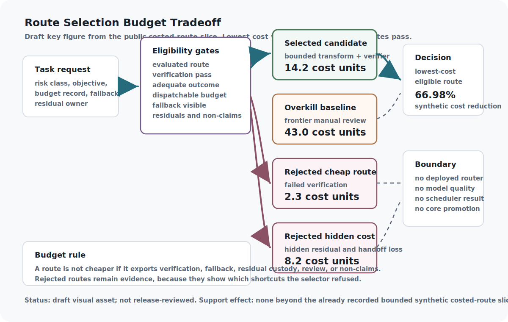

# Resource Economics and Token Budgets

Governed routing, compression, faster generation, richer representations, and synthetic experiments can look locally cheap. Resource economics asks whether they still save anything after verification, repair, fallback, memory pressure, fidelity limits, and risk are counted.

The efficiency thesis depends on this accounting. A route is efficient only when full system cost, protected overhead, displaced work, and residual burden are visible.

Token budgets are policy objects, not just engineering knobs. They decide what may be shortened, what must be reviewed, what cannot be compressed, and which costs are protected from local optimization.

A budget expresses values when it protects work from optimization. Simulation contracts express honesty when they say what a synthetic result is allowed to mean. Cheapness that erases verification or outruns fidelity is debt moved into the future.

The budget should reveal tradeoffs before they become hidden policy: which latency target is flexible, which review cost is mandatory, which cache is safe, which simulation boundary is narrow, and which shortcut would spend authority the task lacks. Efficiency is credible only after protected costs and fidelity boundaries are paid.

## Problem

ASI architecture consumes scarce resources: tokens, context, verifier time, model calls, tool time, storage, latency, human attention, review capacity, and risk budget. If those resources are implicit, the system will overspend expensive cognition on low-value tasks, cut verification when it is most needed, and overload at synchronized demand spikes.

Resource economics is not an accounting appendix. It is a control layer. Planning needs budgets. Routing needs costed specialists. Evidence needs verification tax. Governance needs to know when cost pressure is trying to bypass protected gates.

The central question is not "how do we spend less?" It is "which costs are safe to reduce, which costs are evidence obligations, and which costs are protected governance overhead?" That distinction keeps efficiency work from becoming permission to cut the very checks that make capability usable.

## Why existing approaches are insufficient

Ignoring resource economics makes high-quality verification unaffordable and encourages hidden cost shifts. Hard quota resets can synchronize bursts. Token-only accounting can ignore human friction, sleep, quality, latency, and risk. Cheap routes can look efficient while exporting cost into later repair, review, or failure handling.

TokenMana contributes the regenerative-capacity idea: bounded capacity accumulates continuously instead of appearing in synchronized cliffs. PlanForge contributes tier-aware scheduling: tasks should be assigned to the minimum adequate capability with fallback and replanning. Simulation Scaling contributes the transfer warning: synthetic or simulated results mean only what their scope, fidelity, resource bill, omissions, and transfer decision allow. PagedAttention/vLLM contributes a serving-layer warning: KV-cache memory, batching, and aggregate throughput are real resource variables, but they are not the same as verified output quality. Together they imply that budgets should be typed, risk-aware, fidelity-aware, and tied to evidence.

Budget records should therefore include the cost of not acting, too. Deferral, rejection, escalation, and scope reduction are not failures if they preserve higher-value capacity or prevent unverifiable high-risk work. The ledger should make those choices visible instead of rewarding only dispatch.

## Core Claim

Resource Economics owns a consumer-, task-, risk-, workload-, organization-, resource-, and time-specific allocation lease that admits, prices, schedules, defers, shrinks, escalates, or rejects work only after protected safety and rights floors, complete direct and displaced costs, uncertainty, useful outcome value, verification capacity, load and tail stability, simulation-transfer limits, recovery, and residual ownership are explicit; throughput, low token count, synthetic success, or a cheap route alone confers no quality, safety, economic-optimality, support, or deployment authority (evidence boundary: architectural argument).
Resource Economics distinctly owns the **Resource Allocation Lease** and the resource side of the **Simulation Claim-Transport Contract**. Intent and Planning own task value and dependencies; Routing owns eligible routes; Runtime and Serving own execution receipts; Verification owns check adequacy; Security, Rights, and Authority own protected floors; Labor owns reviewer conditions; Evidence and Claims own support; Artifact Graph owns lineage; Readiness and Incident Response own qualification and recovery; and Release owns public use. Resource Economics may allocate or deny capacity, but it cannot waive those owners or convert cheapness into truth.

The source notes justify design discussion of regenerative capacity, tier-aware planning, load variance, cognitive friction, cost-quality tradeoffs, and verification scarcity. They do not establish measured infrastructure or human-outcome claims in this repository.

### Proof rationalization receipt

The formal surface now separates policy conformance from economic or simulation
evidence. `AsiStackProofs.ResourceEconomicsRefinement` models nine reachable
stages and 66 routes from scoped request through budgeting, protected capacity,
scheduling, observed execution, verification, simulation-claim transport,
reconciliation, and closure. An independently implemented consumer reaches all
routes and rejects 57/57 non-accepting mutations, including identity
substitution, replay, authority leakage, missing protected floors, missing
reviewer or verifier capacity, raw-proxy promotion, incomplete failure
accounting, incomplete simulation contracts, fidelity overclaim, and incomplete
closure.

The consumer also reruns and digest-binds twelve bounded source families. Their
evidence meanings remain separate: authored fixtures test record discipline;
repository replays test local reproducibility; local timing describes only its
recorded machine and task; historical CI records describe past publication
runs; and sanitized Theseus imports describe import boundaries. In particular,
the 66.98 percent cost difference is arithmetic inside one four-route synthetic
fixture, not a general efficiency result. Thirty-five copied summaries or
assumption-restating declarations were retired with frozen lineage; twenty-three
countermodels and bounded computations remain. Support-state and external-effect
authority remain exactly `none`, so the core claim remains at `argument`.

Folded simulation-fidelity subclaim: simulation and synthetic-environment results are resource-governed claim-transport records whose support cannot exceed declared scope, fidelity, temporal semantics, resource bill, assumptions, omitted variables, instrumentation effects, residual risks, and transfer decision.

## Draft Key Figure: Route Selection Budget Tradeoff

::: {.asi-key-figure}
{#fig-route-selection-budget-tradeoff fig-alt="Draft route-selection budget tradeoff figure showing a task request, eligibility gates, selected bounded transform plus verifier route at 14.2 cost units, adequate overkill baseline at 43.0 cost units, rejected failed-verification route at 2.3 cost units, rejected hidden-residual route at 8.2 cost units, and no deployed-router or core-claim-promotion boundary."}
:::

**How to read the route-selection figure:** Treat this draft reader aid as a summary of the bounded public costed-route slice, not a deployed scheduler. Read it from left to right: the task request enters eligibility gates, where verification, adequacy, budget dispatch, fallback, residual custody, and non-claims must all remain visible. The cheapest route is rejected because verification fails. The hidden-residual route is rejected because residual ownership and reviewer handoff are lost even though it looks cheaper than the selected route. The adequate overkill baseline stays eligible but costs more. The selected route is the lowest-cost eligible route in this synthetic fixture, with the already recorded 66.98 percent synthetic cost reduction against the adequate overkill baseline. The figure does not promote the Resource Economics core claim, prove deployed routing, measure model quality, establish scheduler behavior, or create a new evidence transition.

### Resource-allocation lifecycle

The lease moves through eighteen auditable stages: (1) freeze consumer, task, value, risk, workload, organization, authority, rights, horizon, success, and non-claims; (2) inventory compute, memory, storage, network, energy, tools, verifiers, reviewers, approval, security, rollback, and recovery capacity with units and owners; (3) declare protected floors; (4) estimate direct, uncertain, error, verification, fallback, repair, incident, opportunity, reviewer, governance, and displaced costs; (5) separate attempted through recovered work states; (6) choose dispatch, defer, shrink, escalate, fallback, refuse, or residual; (7) bound any regenerative credits, debt, and expiry; (8) reserve scarce verification and review capacity; (9) measure queues, caches, warmup, compilation, preemption, retries, tails, OOM, saturation, and tenant interference; (10) separate aggregate serving metrics from verified useful outcomes; (11) attach a Simulation Contract Record to every synthetic result used as evidence; (12) freeze its fidelity and transfer boundary; (13) compare strong matched allocation controls; (14) measure usefulness, unsafe release, false refusal, missed help, fairness, latency, resources, human and governance cost, recovery, and residuals jointly; (15) run causal ablations; (16) expire qualifications on material drift; (17) reconcile estimates to actuals and preserve failures; and (18) adjudicate each claim through an explicit transition and independent reproduction.

Every stage has a rejecting route. Missing scope or units requests repair; an erased protected floor blocks dispatch; insufficient high-risk verification escalates or narrows; unbounded credits are rejected; review capture reschedules work; partial denominators invalidate comparative claims; missing simulation scope blocks transfer; unmatched baselines block superiority; drift expires the lease; and unexplained variance becomes an owned residual rather than disappearing.

## Mechanism

Resource economics is the control layer that prevents efficiency work from becoming blind cost cutting. TokenMana supplies regenerative-capacity and load-variance pressure; PlanForge supplies task and route scheduling; Verification Bandwidth turns verification into a scarce resource; Simulation Scaling keeps physical capacity and fidelity explicit; VIEA and Project Theseus connect cost to execution/report discipline; PagedAttention-style serving work keeps aggregate throughput separate from single-request verified-output quality.

A budget record is not a quota override. It is the policy surface that decides whether a task can afford the required cognition, context, tool use, verification, and human review without weakening protected gates. When the budget is insufficient, the correct result is escalation, scope reduction, deferral, rejection, or residual accounting, not quiet degradation.

The budget state should therefore be an adjudication state, not just a number. A task can be `proposed`, `priced`, `underfunded`, `protected_overhead_required`, `dispatchable`, `escalated`, `deferred`, `scope_reduced`, `rejected`, or `residualized`. Those states keep verification, security, approval, replay, and human-review costs visible when local optimization pressure wants to compress them into zero.

A Resource Budget Record attaches those constraints to a task, route, plan node, benchmark run, or review process. It records value, risk, capacity, cost, verification tax, serving pressure, protected gates, budget decision, escalation rule, residuals, and evidence references.

```{mermaid}
flowchart LR
A["Task or plan node"] --> B["Value and risk estimate"]
B --> C["Capacity pool"]
C --> D["Cost estimate"]
S["Serving memory / throughput pressure"] --> D
D --> E["Verification + security overhead"]
P["Protected gates"] --> F{"Budget adequate and gates intact?"}
E --> F
F -- "yes" --> G["Dispatch route"]
F -- "no" --> H["Escalate, defer, shrink, or reject"]
G --> I["Cost-quality and residual evidence"]
H --> I
```

**What the budget adequacy gate shows:** Budget adequacy is checked after risk, capacity, cost, verification tax, serving pressure, and protected gates are visible. If the gates cannot stay intact, the correct route is escalation, deferral, scope reduction, rejection, or residual accounting rather than quiet quality degradation.

A budget ledger separates:

- Value hypothesis: why the task is worth spending on.
- Risk class: what failure would cost.
- Capacity pool: what resource is being drawn down or regenerated.
- Cost estimate: tokens, time, tools, storage, human review, or money.
- Verification tax: the extra cost required to trust the output.
- Protected overhead: security handles, Digital SCIFs, approval, replay, rollback, audit, and human review that policy requires.
- Serving pressure: memory pressure, batching, cache reuse, aggregate throughput, and latency when those affect route cost.
- Safety gates: checks that cannot be disabled by budget pressure.
- Budget decision: dispatch, escalate, defer, shrink, reject, or residual.

The stack can save resources, but not by silently dropping protected verification. High-risk tasks should either pay the verification cost or route to escalation.

The security interface matters here. Secure handles, Digital SCIFs, human approval, and replayable artifacts add cost, but those costs are part of the task when protected authority is involved. A route that is cheap only because it avoids the security boundary is not a cheaper equivalent route.

The budget record should also carry a displaced-cost section. If a route saves model calls by increasing future debugging, reviewer burden, hidden context reconstruction, private-data exposure, benchmark contamination, or rollback difficulty, the savings are not yet accepted. They become residual costs until a cost-quality test or evidence packet shows the displacement is harmless for the specific risk class.

### Simulation Fidelity and Claim Transport

Simulation fidelity is folded here because the central object is not a standalone simulator. It is a resource-governed claim-transport rule. A simulated, synthetic, benchmark, or scenario result may travel only as far as its contract permits: declared scope, fidelity standard, temporal semantics, demand estimate, resource bill, capacity bottlenecks, omitted variables, approximation liberties, instrumentation effects, observed-result boundary, supported-claim boundary, transfer decision, residual risks, and non-claims.

The Resource Budget Record says what the stack can afford. The Simulation Contract Record says what a cheap or synthetic experiment is allowed to mean. Those records should be paired whenever a budget, benchmark, safety rehearsal, or synthetic environment is used as evidence. A cheap simulation can be excellent for a unit invariant and useless for a physical-deployment claim; a high-fidelity simulation can still fail if it omits the bottleneck that decides the question.

Reluplex is useful as a comparison point because scoped verification gains authority from its property boundary. It can verify a specified property or return a counterexample inside its own model class; it does not verify all behavior. Simulation contracts should follow the same discipline. Name the preserved structure, omitted physics, resource cost, instrumentation effect, and transfer boundary before a result is allowed to support a broader claim.

```{mermaid}
flowchart LR
A["Simulation or synthetic result"] --> B["Scope and claim class"]
B --> C["Fidelity and temporal semantics"]
C --> D["Demand, resource bill, and bottlenecks"]
D --> E["Omissions and instrumentation effects"]
E --> F{"Transfer allowed?"}
F -- "yes" --> G["Bounded evidence claim"]
F -- "no" --> H["Residual, downgrade, or blocked claim"]
G --> I["Resource/evidence ledger"]
H --> I
```

**Reading the claim-transport gate:** A simulation output is not promoted merely because it came from a simulator. It moves only after scope, fidelity, temporal semantics, resources, bottlenecks, omissions, and transfer are explicit. Failed transfer is still useful: it becomes a downgrade, residual, reduced-scope test, or blocked claim rather than hidden evidence inflation.

This fold preserves the old simulation-fidelity chapter's restoration condition. Simulation Fidelity and Physical Constraints should be restored as a standalone chapter if public-safe artifacts create a distinct evidence lane: a feasibility calculator, physical-computation audit, simulation benchmark with negative controls, executable simulator evidence tied to a `Simulation Contract Record`, or independent external review showing that the simulation contract is too central to remain a section inside resource economics.

### Minimum sufficient compute is a qualified frontier

The Reflexive Router turns “use the cheapest mechanism” into a constrained
selection rule. Let route proposals carry a generalized cost vector over
latency, model and tool compute, memory, energy, money, verification,
monitoring, human work, governance, recovery, opportunity cost, and residual
risk. The optimizer may compare those costs only after capability, freshness,
authority, rights, quality, verifier, effect, fallback, and resource
obligations qualify the route. A cheap inadmissible route is not on the
frontier.

This distinction changes fast-path accounting. Raw reflex coverage can rise
when a router overuses easy rules, refuses difficult work, or omits expensive
verification. A useful ledger must retain qualified coverage, useful outcome
rate, wrong-fast-path rate, selective risk, route regret against the best
qualified alternative, abstention and fallback, verification escape,
unauthorized effects, recovery, and displaced work beside latency and cost.

The paper proposes “Useful Reflex Efficiency” as a synthesis metric, but this
chapter treats it only as a view over non-collapsible measures. No scalar may
hide zero useful throughput, unsafe release, false refusal, verifier burden,
monitoring cost, human burden, energy, or residual risk. Pareto analysis and
claim-specific floors remain authoritative; a system that is faster because it
discarded governance has not demonstrated minimum sufficient compute.

The source includes illustrative budgets and launch gates, not measured
resource results. Its economics therefore strengthens the natural campaign and
cost ledger while leaving the core at `argument`.

### P4/M6 bounded cost record

All eight routing policies consumed the same closed candidate bytes and share
32 local model calls and 1,148.660632 seconds of generation. Useful Reflex
Efficiency therefore appears only beside useful-outcome, wrong-fast-path, and
unsafe-output denominators. The run measured no calibrated energy; zero
marginal API charge excludes hardware, electricity, and operator time; human
scoring was automated internal evaluation; and displaced work was not
estimable. Those missing burdens block any acceptable-cost or deployment
claim, even though the full policy's useful outcomes per shared model call were
higher on this one authored corpus.

## Interfaces

Resource choices move through the Resource Budget Record and, when synthetic or simulated evidence is used, the Simulation Contract Record.

The twelve-owner boundary is explicit: Intent and Planning provide value, scope, deadlines, dependencies, and acceptable reduction; the Resource Budget Record owns units, capacity, floors, estimates, decision, actuals, variance, and residuals; Routing provides eligible routes and consumes the allocation decision; Runtime and Serving report queue-to-recovery receipts; Verification owns checks and verifier capacity; Security, Rights, and Authority own non-waivable floors; Labor and Human review own reviewer capacity and conditions; the Simulation Contract Record owns fidelity and transfer; Evidence and Claim Ledgers keep proxy, useful, safety, fairness, economic, deployment, and SOTA states separate; Artifact Graph binds all receipts and descendants; Readiness and Incident Response own qualification, expiry, rollback, and reopening; and Release consumes only claims whose exact use and ceiling remain valid.

Minimum fields:

- `budget_id`
- `task_id`
- `value_hypothesis`
- `risk_class`
- `capacity_pool`
- `budget_state`
- `cost_estimate`
- `verification_tax`
- `protected_overhead`
- `displaced_costs`
- `quality_predicate`
- `safety_gates`
- `budget_decision`
- `escalation_rule`
- `residuals`
- `evidence_refs`

Simulation-contract companion fields:

- `simulation_id`
- `claim_id`
- `contract_version`
- `claim_class`
- `scope`
- `fidelity_standard`
- `fidelity_state`
- `temporal_semantics`
- `input_assumptions`
- `demand_estimate`
- `resource_bill`
- `capacity_bottlenecks`
- `omitted_variables`
- `approximation_liberties`
- `instrumentation_effects`
- `supported_claim_boundary`
- `observed_result_boundary`
- `transfer_decision`
- `support_state_effect`
- `failure_behavior`
- `residual_risks`
- `non_claims`

Planning allocates budgets and schedules work. Routing chooses costed specialists. Runtime adapters record actual spend. Evidence compares cost and quality. Serving infrastructure reports memory and throughput costs without converting them into quality claims. Simulation records preserve fidelity limits and claim boundaries before synthetic results enter the evidence ledger. Governance protects gates that budget pressure is not allowed to override. Benchmark chapters use the same record pair to avoid Goodharting cheap metrics or laundering convenient synthetic environments.

Self-improvement transitions also consume this interface. A proposed improvement should say whether it saves tokens, verifier time, human review, memory, or latency, and whether those savings preserve quality and protected gates. Cost savings without a support boundary are just a pressure to overclaim.

That means budgets can constrain self-improvement in both directions. They can block wasteful architecture churn, but they can also block supposedly efficient changes that reduce the verifier, security kernel, rollback, or human-review budget below the risk class. Efficiency is admissible only after the protected overhead remains paid.

## Invariants

- Budgets never override protected safety, verification, security, rights, approval, replay, rollback, audit, or human-review floors.
- High-risk work receives required verification and review or routes to reduction, escalation, deferral, fallback, or refusal.
- Every quantity has a unit, meter or estimation method, time window, owner, uncertainty, and reconciliation path.
- Savings travel with useful outcome, safety, fairness, latency, tail, failure, fallback, recovery, and residual results.
- Aggregate throughput, cache efficiency, or memory reduction never implies verified usefulness, safety, or economic value.
- Protected overhead is explicit and cannot be deleted, relabeled, or shifted outside the denominator.
- Displaced and opportunity costs remain residuals until measured or accepted by a scoped transition.
- Failed, deferred, refused, cancelled, preempted, timed-out, OOM, fallback, repaired, and reviewed work remains in denominators.
- Capacity issuance and regeneration are bounded and create no infinite spend authority.
- Low-risk volume cannot consume protected verifier or reviewer capacity reserved for blocked high-risk work.
- Comparisons match information, workload, models, tools, hardware, cache, load, resources, evaluators, rights, and time.
- Simulation scope, fidelity, temporal semantics, resources, bottlenecks, omissions, instrumentation, and transfer are prospective.
- Synthetic results do not transfer beyond their declared support boundary by default.
- Approximation liberties, parent assumptions, omitted variables, and instrumentation survive every summary and handoff.
- Economic optimality is not inferred from a finite selector, modeled table, local replay, or one workload.
- Qualifications expire on material workload, price, hardware, model, policy, rights, threat, organization, or time change.
- Support changes require an accepted transition for the exact claim and scope.
- Every shortfall, variance, overload, protected-capacity conflict, failed transfer, and undisclosed cost has an owner and reopening condition.

The central invariant is risk-adjusted adequacy: a route is not cheap if it leaves the system unable to verify a high-impact outcome.

Protected overhead keeps budgeting from deleting governance. Safety gates, evidence requirements, approval paths, and secret-handling boundaries are not optional line items unless governance explicitly changes the policy. Budgets can force escalation or deferral, but they cannot erase the requirement.

## Failure modes

- Verification, security, rights, approval, replay, rollback, audit, or review is cut to make a route appear cheaper.
- Synchronized arrivals, retries, cache misses, or failures produce load collapse and correlated quality degradation.
- Low-value or strategically inflated work hoards compute, verifier, reviewer, tool, or approval capacity.
- Aggregate throughput or cache savings are mistaken for lower request risk, better quality, or economic value.
- Protected overhead is deleted, relabeled, hidden in another budget, or excluded from comparison.
- Cheaper inference displaces cost into debugging, repair, incidents, privacy exposure, evidence loss, or rollback difficulty.
- A proxy value model rewards visible throughput while missing usefulness, safety, fairness, or opportunity cost.
- Failed, refused, deferred, cancelled, timed-out, OOM, fallback, or reviewed work disappears from denominators.
- Risk labels, value estimates, or deadlines are gamed to capture priority.
- Static budgets ignore queueing, tails, interference, prices, saturation, or recovery debt.
- Regenerative credits create inflation, circular issuance, hidden debt, or unbounded authority.
- Review reservation protects the wrong work, creates starvation, or ignores fatigue and disagreement.
- Simulation laundering turns clean synthetic results into real-world claims while omitting fidelity or bottlenecks.
- Sandbox-to-world transfer occurs without fidelity, resource, instrumentation, and rights contracts.
- Parent physics, workload, price, policy, or organizational assumptions drift without expiry.
- Shared scheduler, meter, evaluator, simulator, and organization create false independent agreement.
- A local selector or replay is described as economic optimality, welfare improvement, production stability, or SOTA.
- Governance cost exceeds benefit, but institutional lock-in preserves the policy and hides the refutation.

Cost-cut verification should block or escalate. Load synchronization should trigger capacity smoothing or scheduling changes. Resource hoarding should be visible in the ledger. Human repair burden should count as cost. Speculative market language should remain optional until executable records and tests exist.

Efficiency laundering returns at the budget layer. A route may look cheaper because it shifts work into future debugging, human review, hidden context reconstruction, or unrecorded security risk. The budget record should count those displaced costs as residuals rather than letting the route appear efficient.

## Minimum Viable Implementation

The smallest honest implementation is not a market, scheduler, or TokenMana simulation. It is a Resource Budget Record paired with the evidence records that say what a route was allowed to mean.

That record has to price the whole route before calling anything efficient: task value, risk class, capacity pool, cost estimate, verification tax, protected overhead, displaced costs, quality predicate, safety gates, escalation rule, residuals, and evidence references. When synthetic or simulated evidence is involved, a Simulation Contract Record has to travel with it so scope, fidelity, omissions, instrumentation effects, resource bills, and transfer limits stay attached.

The current repository has a deliberately narrow version of that idea. The budget fixtures and ledger checks accept low-risk dispatch, high-risk escalation, protected-overhead dispatch, displaced-cost residualization, review-capacity hoarding detection, and security-overhead erasure rejection. The simulation-transfer checks accept only scoped claim movement and reject missing fidelity, unbounded world transfer, missing resource bills, ignored instrumentation, and support-state promotion.

The flagship Resource lane then makes the accounting concrete. Its costed-route slice compares four routes: an adequate but expensive manual-review baseline, a bounded transform route with verification, a cheaper route that fails verification, and a cheaper route that hides residual cost. The accepted slice chooses the bounded transform route only after the cheaper failed and hidden-residual routes are rejected. The Lean bridge checks the same finite selector state rather than asking the reader to trust the prose.

The workflow and load-stability fixtures add route history. The workflow trace keeps high-risk release work ahead of lower-risk work and preserves protected overhead, residual ownership, and non-claim boundaries. The finite load-stability probe selects protected capacity smoothing over admitting every arrival in a 10-task synthetic burst, while residualizing seven deferrals and rejecting review erasure.

The aggregate replay ties the local evidence package together: `python3 scripts/validate_resource_flagship_lane.py` checks ten command replays, twenty-six tracked artifact digests, three accepted narrow transitions, five explicit no-promotion decisions, preserved negative controls, residuals, non-claims, and the no-core-promotion boundary. The CI cost profile adds publication-pipeline metadata, including classified deploy-service failures and a recorded recovery boundary, but it remains operations metadata rather than workload evidence.

The governance-tax model supplies the reader-facing trade-off. Two modeled cases choose governance once hidden verification, fallback, reviewer burden, and residual discharge are priced. One low-risk shortcut remains allowed because no protected gate is required and the full cost stays lower. This is the point of resource economics: governed efficiency is neither always-pay-every-tax nor always-take-the-cheapest-route. It is the discipline of pricing the whole route before accepting the saving.

None of this proves deployed scheduler behavior, real verification-tax measurement, stable speedup, TokenMana or PlanForge behavior, model quality, economic optimality, physical feasibility, external review, artifact approval, support-state movement, or the Resource Economics core claim. It is a public-safe minimum slice for one narrower claim: a route is not cheaper when the savings come from erased verification, erased protected overhead, or displaced residual burden.

## Beyond the State of the Art

Resource economics matures into a risk-aware budget operating system for cognition. It decides when the stack may spend, defer, shrink, escalate, reject, or residualize work without letting local cost pressure delete verification, security, approval, replay, rollback, or human review.

Cognition has a budget, but the budget cannot delete verification tax, protected overhead, review capacity, rollback cost, security cost, or residual burden. Budget records price the value hypothesis, risk class, capacity pool, budget state, model/tool/storage/human-review cost, verification tax, protected overhead, serving pressure, displaced costs, safety gates, quality predicate, escalation rule, and residuals before ordinary dispatch.

Cost savings are accepted only with quality results, verifier cost, repair burden, fallback frequency, human-review load, evidence loss, privacy exposure, rollback difficulty, memory pressure, and baseline comparison visible. Planning allocates budget and defers or scopes work, routing chooses costed specialists, runtime adapters report actual spend, evidence measures cost-quality tradeoffs, serving infrastructure reports KV-cache and throughput economics without promoting quality claims, and governance protects gates that budgets cannot erase.

Cheap routes that preserve evidence become defaults, underfunded high-risk tasks escalate or shrink, synchronized load triggers smoothing, low-value work loses scarce review capacity, and displaced costs remain residuals until measured or accepted under a scoped evidence transition. Verification cost-cutting, load-synchronized degradation, low-value resource hoarding, protected-overhead deletion, review-capacity capture, token optimization that increases human repair, and aggregate-throughput overclaim become blocked dispatches, escalations, residual-cost records, or budget-policy updates.

Simulation becomes part of the same budget operating system. Synthetic worlds, unit simulators, benchmark environments, safety rehearsals, and scenario models can be used aggressively, but their outputs travel only through a contract that names scope, fidelity, resources, omissions, instrumentation, and transfer. Failed transfers reduce claim scope, missing bottlenecks become residuals, instrumentation costs force downgrades, and approximate worlds stay useful for narrow tests instead of becoming borrowed reality.

This cognition-budget and claim-transport system is still proposed architecture. Resource economics should remain `argument` until budget ledgers, verification-budget checks, load/friction tests, value-of-computation comparisons, scarce-resource scheduler traces, rejected-saving records, simulation-fidelity declarations, physical-constraint reviews, transfer checks, and negative simulation results show that resource discipline improves the stack without hiding risk.

The competent full attempt freezes a natural multi-tenant workload with real models, tools, verifiers, reviewers, serving infrastructure, prices, rights, and delayed outcomes. It compares optimized risk-blind, fixed-budget, greedy-throughput, value-of-computation, queueing-aware, serving-native, human-first, conservative, and full-governed policies under matched information and resources. It measures useful accepted throughput, unsafe release, false refusal, missed help, fairness, queue and tail latency, compute, memory, network, energy, tool and reviewer use, governance work, displaced work, incidents, recovery, and residuals together. Causal ablations remove protected floors, verification pricing, displaced-cost accounting, review reservation, load smoothing, fallback, simulation contracts, and expiry. Independent schedulers, meters, evaluators, simulators, and organizations must reproduce predicted signatures, followed by transfer across workloads, models, hardware, prices, organizations, rights regimes, attacks, updates, and time. A simpler policy winning is an informative refutation or narrowing result.

M8 Campaign 4 tested the boundary between residual identification and verifier
capacity on three prospectively versioned sacrificial instruments. The terminal
version correctly separated release eligibility on 6/6 cases and retained all
required defect IDs, but every defect extractor omitted requested-check IDs and
used an undeclared remediation route. Only 3/6 extraction records were
admissible, below the frozen 5/6 floor, so the fifteen-task heldout never opened.
This is not a measured verification-tax result. It is a concrete reason that a
budget record must price admissible checks and escalation work rather than count
residual mentions as verification supply.

## Post-v2 measured governance cost

The governed-work flagship records 1,968 planning-input, 1,024 planning-output,
3,166 code-input, and 2,048 code-output tokens. On one Apple M1 it measured
160.711 seconds of planning, 330.028 seconds of code generation, 1.960 seconds
of independent observation, and 498.459 seconds end to end. Governed route
bookkeeping took 3.026 seconds versus 2.534 seconds for the baseline, while
reducing unsafe releases from five to zero but also reducing useful releases
to zero.

The routing/deliberation study adds matched candidate-operation accounts:
adaptive stopping reached 179/180 correct in 236 operations, fixed three-step
reached 154/180 in 540 and harmed 15 initially correct answers, and the
one-step reference reached 130/180 in 180. These are local synthetic costs, not
production economics, so the core claim remains at `argument` with a
`no_change` disposition.

## Post-v2.1 joint cost accounting

The successor cycle consumes exactly 332 registered model calls with zero
retries or outcome-driven arm expansion. Its outcomes show why compute totals
must be joined to utility: the governed arm's safety gain accompanies only
2/36 useful releases; the learned router's 20/60 correct outcomes are all
non-answer actions; and adaptive deliberation spends 300 candidate operations
without one correct final answer, compared with 60 operations for the equally
zero-utility no-deliberation arm. Extra computation and governance are costs
whose value depends on jointly measured useful throughput, unsafe release,
latency, rollback, and abstention—not on call count or route accuracy alone.

## QCSA prevention-cost adjudication

The QCSA evaluation makes the same joint-accounting rule concrete. Exact
governance/migration failure prevention was 1.000000 for QCSA and 0.487179 for
the selected baseline, a 0.512821 gain, but QCSA used 729 operations and a
1.913386 matched operation ratio. That exceeds the preregistered 1.50 ceiling,
so the acceptable-resource claim is not promoted. The retained narrow result
is that the exact prevention gain came with an over-ceiling proxy cost. It is
not a production incident rate, acceptable governance tax, economic optimum,
or chapter-core support result.

## Post-v2.3 governance-tax protocol result

The prospectively frozen natural-work campaign completed 12 local Qwen3 4B
calls, each evaluated under matched baseline and governed release policies,
plus 12 independent rollback probes. Every model call consumed its full
256-token output allowance; 11 ended inside an unclosed reasoning block and
one closed reasoning but emitted no requested final JSON object. Both
routes therefore had zero admissible candidates, zero useful releases, and
zero unsafe releases. With a zero-release denominator, neither useful
throughput nor unsafe-release reduction is estimable, so the campaign cannot
price governance or support a safety comparison. The exact generation,
evaluation, token-proxy, and wall-clock costs remain in
`experiments/post_v2_3_evidence_campaigns/results/adjudication.json`.

The separate nine-surface rollback harness restored 12/12 declared local
states and detected 12/12 descendant-or-receipt omission controls. That result
validates the harness boundary only. It is not evidence of model quality,
production rollback, acceptable governance cost, useful governed throughput,
or the resource-economics core claim. The accepted transition is
`evidence_transitions/post_v2_3/governance_tax_natural_work_no_change.json`.

## P4/M5 informative-regime result

The successor protocol repaired the measurement regime rather than erasing the
zero-output result. A prospectively pooled tuning sequence admitted 32/40
candidates and populated all useful-safe, useful-unsafe, useless-safe, and
useless-unsafe cells. A disjoint 16-task held-out run then admitted 15
candidates with zero evaluator disagreement. Full governance released 9 useful
and 0 unsafe candidates; candidate self-release and record-only released none.
Removing evidence freshness produced one additional useful-unsafe release.

This establishes a bounded local governance-policy effect, but not an economic
optimum. The primary gate did not require a latency, energy, dollar, human-
effort, or displaced-work advantage, and the baseline's zero release makes its
opportunity cost unusually high. The result therefore moves one non-core claim
to `synthetic-test-backed` while leaving the resource-economics core at
`argument`. A proper cost claim still needs matched strong baselines that
release useful work, repeated timing and energy measurement, operator burden,
uncertainty, and transfer.

## Summary

Resources are part of governance. A system that cannot account for tokens, verification, latency, human review, risk, fidelity, transfer limits, and quality cannot honestly claim efficiency.

Budget pressure becomes an explicit record so the stack can save cost where it is safe, spend verification where risk demands it, and keep protected gates above local optimization. Simulation pressure becomes an explicit record so synthetic success cannot outrun scope, fidelity, resources, omissions, or transfer. With compactness, speed, representation, budgets, and simulation claims bounded, the sequence can ask which mathematical substrates are legitimate targets for adoption rather than architectural fashion.

The handoff is deliberate: cyclic mixers and mathematical substrates are not adopted because they look elegant or cheap. They have to enter through resource, fidelity, baseline, and evidence contracts.

The same rule governs self-improvement. A system may not call itself more efficient by moving verification, security, or human repair cost out of sight.

<!-- P7-EVIDENCE-RECONCILIATION:START -->
## Evidence reconciliation (2026-07-16)

This chapter owns **82** structured claim atoms in `CF-05`. The
frozen repository-wide terminal audit records 82 `blocked_after_full_attempt`. Its core
atom `resource-economics-and-token-budgets.core` remains at `argument` with terminal
disposition `blocked_after_full_attempt`. The authoritative per-atom rows
are the `resource-economics-and-token-budgets` slice of
`experiments/claim_family_terminal_coverage/results/result.json`; this summary
does not replace that ledger.

### What the evidence now says

The chapter's core remains **blocked after full attempt**
at `argument` support. Across its 82 structured claims,
82 still lack required proof lanes,
0 were narrowed, and
0 received only a bounded subordinate
promotion. No chapter-core claim moved upward.

The strongest relevant family attempt was **Ambiguous routing and deliberation confirmatory campaign**. It gives
this family one real success/failure boundary under rejecting controls, but it
does not prove the rest of this chapter. What worked was limited to its declared
scope; what failed or remains open is preserved in the blocked and narrowed
counts above. The decisive boundary is: Mixed bounded routing effect with unsafe outputs and no support promotion; no general router, deliberation, or transfer claim.

The conclusion changes only when new atom-specific work fills the missing
lanes—`normative`, `transfer`—under a prospective protocol and an accepted
evidence transition. Until then, nearby tests, formal models, source counts, and
the family result cannot substitute for the missing evidence.

<!-- P7-EVIDENCE-RECONCILIATION:END -->

## Handoff

Resource budgets and simulation contracts decide what the stack can afford to try and what each experiment is allowed to mean. Mathematical and Search Substrates extends the same discipline to unusual calculi, cyclic structures, semantic graphs, search spaces, and sequence alternatives. Candidate substrates can remain interesting only while carrying baselines, falsification conditions, readiness states, proof boundaries, resource bills, fidelity limits, and ordinary fallback paths.
