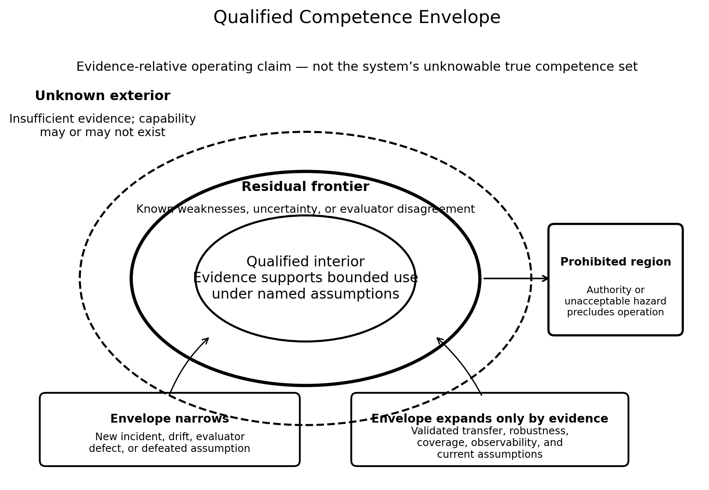
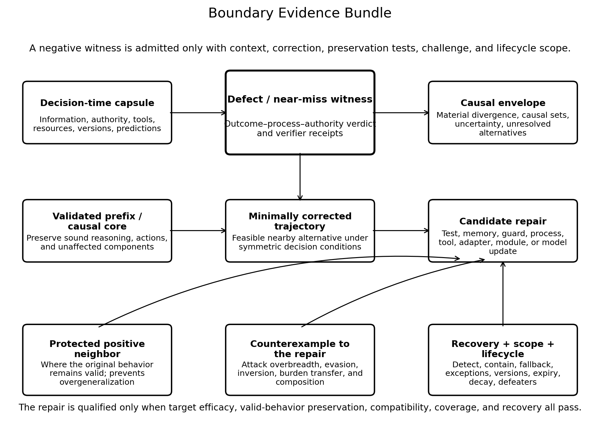
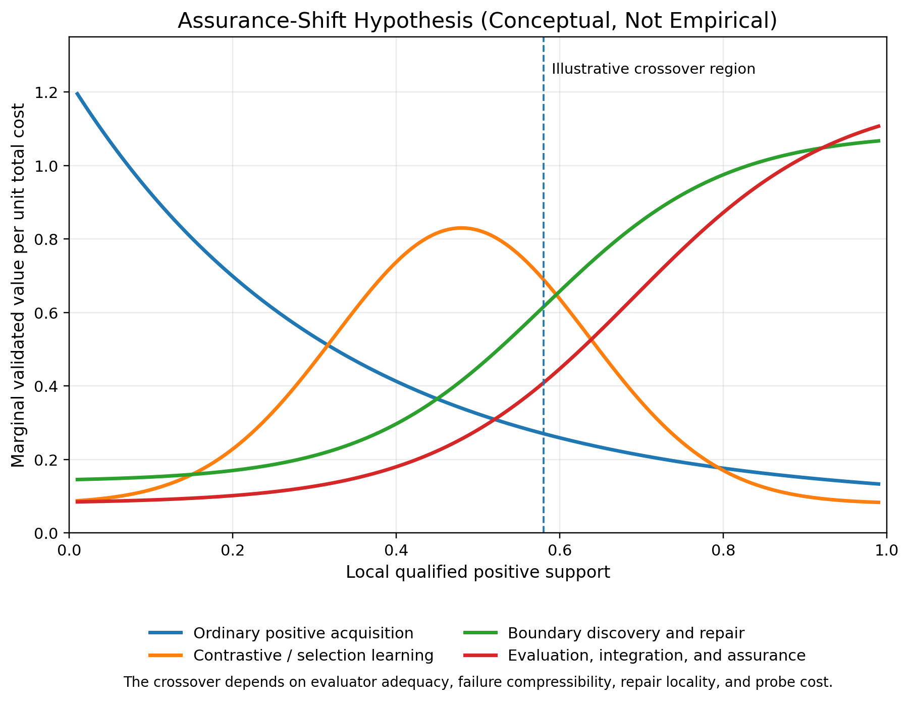
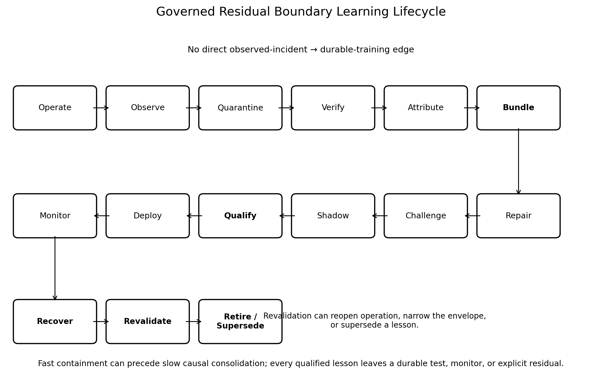

[← Corben Papers and Architecture Sources](index.qmd)

::: {.callout-important title="Original paper, not rewritten book prose"}
This page publishes Corben Sorenson's original source manuscript so readers can inspect the ideas that preceded or informed the living book. The text may contain historical terminology, claims, confidence, citations, or implementation status that the book later narrows, revises, tests, or rejects. Publication here establishes provenance and access—not correctness, novelty, replication, or support-state promotion.
:::

## Publication and provenance

| Field | Record |
|---|---|
| Source ID | `assurance_shift_learning` |
| Source class | `author_research_paper` |
| Library class | `research_paper` |
| Manuscript date | 2026-08-11 |
| Inventory updated | 2026-08-11 |
| Exact published-source SHA-256 | `611787d91fb3035ff6948fd54b5391880da38f2008a85a6c8f89bb11da9fac40` |
| Exact published-source bytes | 128,784 |
| Exact source text | [Download/view the tracked Markdown source](source/assurance_shift_learning.md) |
| Book's source note | [Read the bounded mining note](https://github.com/corbensorenson/asi-stack-book/blob/main/sources/source_notes/assurance_shift_learning.md) |
| Authorship and collaborator credits | Preserved from the exact original manuscript; this library wrapper does not replace or simplify them. |
| Rights | No new license grant. Corben Sorenson's rights are reserved; collaborator, quotation, source-title, and third-party rights remain with their holders. |

**Current publication boundary.** Version 1.0 author research paper and experimental specification. Its propositions and conjectures are bounded to stated formal settings; GRBL, the regime allocator, the repair compiler, and SaturationShiftBench have not been implemented or run; and no empirical crossover, evaluator adequacy, safety result, resource advantage, novelty result, or support transition is inferred.

**HTML presentation note.** The HTML page normalizes line endings and trailing whitespace, preserves explicit Markdown hard breaks, and demotes manuscript headings beneath the page title. Supplied local figure assets are copied byte-for-byte and their relative paths are rewritten into this reader page. The digest above applies to the linked exact source text, not to this presentation wrapper.

## Where this paper enters the living book

[Evidence States and Claim Discipline](../chapters/evidence-states-and-claim-discipline.html), [Stable Capability Fields](../chapters/stable-capability-fields.html), [Artifact Graphs, Audit Logs, and Replay](../chapters/artifact-graphs-audit-logs-and-replay.html), [Procedural Memory and Cognitive Loop Closure](../chapters/procedural-memory-and-cognitive-loop-closure.html), [Learning–Compute Topology and Adaptive Process Architecture](../chapters/learning-compute-topology-and-adaptive-process-architecture.html), [Readiness Gates, Residual Escrow, and Quarantine](../chapters/readiness-gates-residual-escrow-and-quarantine.html), [Resource Economics and Token Budgets](../chapters/resource-economics-and-token-budgets.html), [Benchmark Ratchets and Anti-Goodhart Evidence](../chapters/benchmark-ratchets-and-anti-goodhart-evidence.html), [Adversarial Evaluation, Sandbagging, and Training-Time Deception](../chapters/adversarial-evaluation-sandbagging-and-training-time-deception.html), [Governed Operations, Incident Command, and Graceful Degradation](../chapters/governed-operations-incident-command-and-graceful-degradation.html), [Policy Optimization and Learning from Feedback](../chapters/policy-optimization-and-learning-from-feedback.html), [Data Engines, Continual Learning, and Unlearning](../chapters/data-engines-continual-learning-and-unlearning.html), [Integrated Reference Architecture](../chapters/integrated-reference-architecture.html)

<hr>

## Original manuscript

## When Success Stops Teaching

### Assurance-Shift Learning and Governed Residual Boundary Learning for Mature AI Systems

#### A Competence-Dependent Theory of Learning from Informative Exceptions

**Corben Sorenson**<br>
Independent Researcher<br>
Research manuscript v1.0 — August 2026

<hr>
### Abstract

Machine learning systems are initially improved by acquiring successful behavior: demonstrations, labels, rewards, procedures, tools, and representations show the system what can work. That strategy is indispensable when viable behavior is absent. Its marginal value should not, however, be assumed constant throughout development. Once a system can already produce successful behavior across much of a local operating region, additional ordinary successes become increasingly redundant while the remaining failures become rarer, more consequential, and harder to discover. This paper develops **Assurance-Shift Learning**, the hypothesis that mature learning should reallocate marginal effort from broad positive acquisition toward the production of trustworthy evidence about residual failure. The associated architecture, **Governed Residual Boundary Learning** (GRBL), actively searches for informative exceptions; separates bad outcomes from bad decisions; improves evaluators when they are the binding bottleneck; constructs scoped repairs; preserves nearby valid behavior and beneficial novelty; tests interactions among repairs; and compiles each lesson into the least invasive adequate substrate, including tests, memory, tools, guards, procedures, modules, weights, or governance.

The theory replaces several tempting but unsafe simplifications. High benchmark accuracy is not treated as saturation. The system maintains a versioned **Qualified Competence Envelope** rather than claiming knowledge of its true competence set. A negative example is not the atomic learning object; the proposed **Boundary Evidence Bundle** includes a decision-time record, defect witness, process–outcome verdict, minimally corrected trajectory, protected positive neighbor, counterexample to the repair, causal uncertainty, recovery route, and lifecycle scope. Negative evidence receives a learner-relative half-life so that historical penalties do not create indefinite repulsion. Natural deployment data and adversarial probe data remain distinct so that failure-enriched training does not corrupt base-rate calibration. Useful coverage, observability, subgroup protection, and burden transfer are measured alongside incident reduction, preventing refusal, hidden logging, or risk displacement from masquerading as safety.

The paper formalizes the principal objects, states bounded propositions and falsifiable conjectures, specifies a six-plane architecture and reference algorithms, red-teams the framework, and proposes **SaturationShiftBench**, an equal-cost experimental program designed to locate—or falsify—the predicted crossover between positive acquisition and assurance-oriented learning. The central claim is conditional: negative evidence is not universally superior. The proposed shift is appropriate only where viable positive behavior is already supported, evaluators are adequate, residual defects are sufficiently discoverable and compressible, and repairs can be introduced without unacceptable collateral loss.

**Keywords:** continual learning; negative learning; counterexamples; AI assurance; hard negatives; process supervision; active testing; residual risk; agent evaluation; safety engineering; model editing; abstention.

<hr>
### Status, Scope, and Claim Discipline

This is a conceptual systems paper and experimental specification. It integrates established ideas from unlikelihood training, negative reinforcement, hard-negative mining, process supervision, prioritized replay, counterexample-guided synthesis, constrained reinforcement learning, selective prediction, continual learning, model editing, reflective agents, safety assurance, and incident governance. The paper does **not** claim priority for those components. Its proposed contribution is the competence-dependent synthesis: a local and reversible shift in the allocation of learning effort; a qualified rather than absolute competence envelope; an informative-exception memory policy; a boundary evidence bundle; learner-relative negative decay; repair placement and compatibility; and an experimental protocol capable of falsifying the crossover claim.

The equations are intended as formal design objects and testable operationalizations, not as uniquely correct moral or statistical definitions. Several recent sources cited below are preprints and should be treated as provisional evidence. No experiment reported as a proposal in this manuscript is presented as completed. The architecture does not guarantee alignment, eliminate strategic deception, solve normative disagreement, prove absence of unknown failure modes, or make irreversible consequences reversible.

<hr>
## 1. Introduction

### 1.1 The developmental asymmetry

An inexperienced learner needs examples of success. It needs to discover the task, represent the relevant state, construct viable actions, and learn which outcomes are desirable. Positive learning is therefore fundamentally **constructive**: it creates a repertoire.

A mature learner faces a different problem. It may already solve most ordinary instances, possess several viable methods, and have a strong prior over competent action. More demonstrations of the median successful case may add little. The remaining value lies in finding where apparently reliable competence breaks: rare tool states, delayed consequences, adversarial inputs, misleading cues, unusual combinations, process defects hidden by lucky outcomes, or system-level interactions absent from component tests.

The intuitive claim can be stated simply:

> As ordinary success becomes expected, the next informative event is increasingly likely to be an exception.

That statement is not yet a training theory. A literal policy of “show the model more failures” is unsafe. It can punish good decisions that encountered bad luck, encode evaluator mistakes, overgeneralize one incident, distort base rates, suppress useful exploration, teach exploit details, create refusal as the easiest low-risk policy, and accumulate incompatible patches. The hard problem is not acquiring negative examples. It is deciding **when a discrepancy is informative, what it means, where its repair belongs, and what evidence justifies deployment of that repair**.

This paper develops that harder theory.

### 1.2 Core thesis

#### Assurance-Shift Hypothesis

Within a local capability region, once viable positive behavior is already well supported and ordinary positive examples become increasingly redundant, the marginal value of learning effort should shift toward assurance: discovering credible counterexamples, improving evaluation, diagnosing residual defects, constructing bounded repairs, preserving valid exceptions, and strengthening monitoring and recovery.

The shift is:

- **local**, because one model can be mature in one domain and novice-like in another;
- **probabilistic**, because saturation is an uncertain evidence claim;
- **reversible**, because drift or new evidence can reopen positive acquisition;
- **bottleneck-aware**, because the next investment may belong in an evaluator, tool, process, or monitor rather than the actor;
- **governed**, because the optimizing policy must not exclusively control what counts as failure or approve its own correction.

The operative architecture is **Governed Residual Boundary Learning** (GRBL). “Boundary” denotes the frontier of an evidence-qualified operating envelope, not a perfectly known geometrical surface. “Residual” denotes the remaining defects after substantial capability acquisition, not a claim that all central behavior is solved. “Governed” denotes separation among proposal, evidence, adjudication, repair, qualification, authority, and deployment.

### 1.3 Why this matters for capable AI

Three trends make the question increasingly important.

First, strong systems can have high nominal accuracy while still producing large absolute numbers of failures at deployment scale. If a system makes one billion consequential decisions, a 0.001% failure rate corresponds to ten thousand events before severity or concentration is considered.

Second, passive failure collection becomes less efficient as competence rises. If a relevant failure occurs with probability \(q\), the expected number of independent nominal trials required to observe one instance is \(1/q\). At \(q=10^{-5}\), passive experience may require roughly one hundred thousand trials per observed failure, and the event may duplicate an already known defect.

Third, the bottleneck can move from generation to evaluation. A model may produce outputs that a weak verifier cannot reliably distinguish, exploit the verifier, or behave differently when it recognizes training conditions. Recent studies of benchmark saturation, verifier exploitability, train–deployment generalization gaps, and agentic abstention reinforce the need to treat evaluator quality, trajectory validity, and coverage as independent system properties rather than assuming that high reward establishes mature competence (Akhtar et al. 2026; Zhong et al. 2026; Xiao and Phuong 2026; Liu et al. 2026a; Mirto et al. 2026).

### 1.4 Contributions

This paper makes the following proposed contributions.

1. **Assurance-Shift Learning:** a competence-dependent hypothesis about reallocating marginal learning effort rather than a claim that negative data is globally superior.
2. **Qualified Competence Envelope:** a versioned, distribution-scoped evidence claim that replaces the fiction of knowing the true competence set.
3. **Frontier decomposition:** acquisition, selection, robustness, evaluation, assurance, and recovery are treated as different limiting regimes requiring different interventions.
4. **Informative exceptions:** the memory distinction becomes routine versus informative rather than success versus failure.
5. **Outcome–process duality:** good and bad outcomes are separated from defensible and defective procedures, making lucky successes and bad-luck failures first-class.
6. **Boundary Evidence Bundle:** the atomic artifact includes the defect, correction, nearby valid behavior, challenge to the correction, causal uncertainty, recovery, and lifecycle scope.
7. **Learner-relative negative half-life:** negative pressure decays as its relevance to the current policy and environment declines, while evidence and regression tests remain.
8. **Repair placement:** lessons may compile into tests, memory, tools, guards, procedures, recovery policies, modules, weights, architecture, or specification rather than automatically updating the base model.
9. **Repair compatibility:** higher-order interactions and update order are explicitly evaluated; mature systems periodically re-synthesize patch collections.
10. **Integrity constraints:** natural and probe distributions, useful coverage, observability, subgroup risk, and burden transfer are maintained as independent accounting lanes.
11. **Assurance-Dominance Conjecture:** mature improvement may devote an increasing fraction of total cost to discovery, evaluation, attribution, integration, monitoring, and recovery.
12. **SaturationShiftBench:** an equal-total-cost, attack-injected, preregistrable experimental program designed to locate or reject the proposed crossover.

### 1.5 Roadmap

Section 2 develops the motivating asymmetries. Section 3 positions the theory relative to adjacent work. Section 4 defines the formal objects. Section 5 states propositions and conjectures. Sections 6 and 7 specify the architecture and algorithms. Sections 8 and 9 define invariants and red-team failure modes. Sections 10 and 11 give measurements and the experimental program. Sections 12–16 cover implementation, integration with related systems, governance, limitations, and open questions.

<hr>
## 2. From Positive Saturation to Informative Exceptions

### 2.1 Positive and negative learning do different work

For context \(x\), let \(A(x)\) be the action or output space, \(V(x)\subseteq A(x)\) the viable set under the current specification, and \(F(x)=A(x)\setminus V(x)\) the nonviable set.

A positive example supplies:

\[
x\rightarrow a^+, \qquad a^+\in V(x).
\]

It demonstrates existence and structure. It can introduce a new strategy, representation, procedure, or tool use.

A negative example supplies:

\[
x\rightarrow a^-, \qquad a^-\in F(x).
\]

It excludes or downweights one region. Without a viable alternative, it does not identify where probability should go. This is why negative feedback is most promising when the learner already possesses a sufficiently rich prior. Welleck et al. (2020) established that unlikelihood objectives can directly reduce undesirable generations. Zhu et al. (2025) found that negative-only reinforcement can improve reasoning by suppressing incorrect generations and redistributing mass toward alternatives guided by the model’s prior. Their analysis also limits the interpretation: the mechanism refines existing knowledge rather than inventing arbitrary missing capability. Wu et al. (2025) similarly found that counterintuitive negative-only results depend strongly on model–task alignment measured through pass@k behavior.

The general principle is:

> **Positive learning is principally constructive; negative learning is principally selective and subtractive.**

Neither is universally superior. Their relative value depends on the learner’s current support.

### 2.2 Positive-support saturation

Headline accuracy is an inadequate switching criterion. The relevant question is whether viable behavior is present in the model’s reachable repertoire.

Define:

\[
c_1(z)=P(\text{success on first attempt}\mid z)
\]

and

\[
c_K(z)=P(\text{at least one success in }K\text{ attempts}\mid z).
\]

The **selection gap** is:

\[
g_K(z)=c_K(z)-c_1(z).
\]

A low \(c_1\) and low \(c_K\) suggest missing capability. A low \(c_1\) and high \(c_K\) suggest that viable behavior exists but is selected unreliably. Negative, contrastive, ranking, or verifier-guided methods should be most useful in the second regime.

The word “saturation” in this paper therefore means neither perfect accuracy nor a saturated benchmark. It means that the **marginal positive support needed for viable behavior is already present to a degree that makes selection, robustness, evaluation, or assurance the binding constraint**.

### 2.3 The routine–informative distinction

The original intuition divides memory into successes and failures. The stronger distinction is:

\[
\text{routine experience}\quad\text{versus}\quad\text{informative exception}.
\]

Routine successes can be compressed into competence. Routine, fully understood failures can also be compressed into a test, guard, or compact rule. Informative exceptions include:

- a novel failure;
- a near miss;
- a correct result produced by a defective process;
- an unexpected successful strategy;
- a valid exception to an existing prohibition;
- evaluator disagreement;
- a repair that fails under composition;
- an unusual recovery success;
- a distribution shift;
- evidence that invalidates a capability claim.

This revision prevents the architecture from becoming a trauma machine that stores every bad event at full fidelity while discarding all positive novelty.

### 2.4 Outcome and process are orthogonal

A bad outcome is not necessarily a bad decision. A good outcome is not necessarily evidence of a sound process.

| Process quality | Outcome good | Outcome bad |
|---|---|---|
| **Defensible process** | Routine success or valuable novelty | Bad luck, environmental failure, or irreducible uncertainty |
| **Defective process** | Near miss or lucky success | Avoidable failure |

The lower-left cell is especially important. Outcome-only learning can reward an invalid proof that reaches the correct answer, insecure code that passes a weak test, an unauthorized action with a beneficial result, or a planner trace that looks plausible but does not help the executor. Han et al. (2026) argue that final-answer correctness alone can reward traces that are right for the wrong reasons; process supervision more generally exists because final outcomes underdetermine where and why a trajectory became defective (Lightman et al. 2024).

The upper-right cell is equally important. Penalizing a sound policy for stochastic bad luck can make the system superstitious and risk-averse. The response may belong in calibration, redundancy, monitoring, or recovery rather than policy inhibition.

### 2.5 Rarity and information

Let local failure probability be \(q=1-c\). Under independent passive trials, the expected waiting time for one observed failure is:

\[
E[T_F]=\frac{1}{q}.
\]

The surprise of failure is:

\[
I(F)=-\log_2 q.
\]

As \(q\rightarrow0\), failures become more surprising but more expensive to obtain. This is the **rarity–information paradox**:

> The mature system most needs the residual failures that ordinary operation becomes least likely to reveal.

The logical consequence is active falsification. Mature learning requires counterexample generation, semantic perturbation, adversarial testing, rare-event simulation, formal search where possible, and active allocation toward cases with high expected decision value. Prioritized replay and curriculum methods already demonstrate the broader value of allocating experience based on learning potential rather than frequency alone (Schaul et al. 2016; Jiang et al. 2021; Mindermann et al. 2022; Dennis et al. 2020; Parker-Holder et al. 2022).

### 2.6 Why severity is not enough

A catastrophic one-off caused by an unrepeatable external event may deserve exact forensic retention but little policy training. A small recurrent reasoning defect may have far greater transferable learning value.

Retention priority and consolidation priority must therefore be separate.

A schematic retention score is:

\[
M_{\mathrm{retain}}
=f(S,U,N,X,A),
\]

where \(S\) is severity, \(U\) surprise, \(N\) novelty, \(X\) exposure, and \(A\) unresolved forensic value.

A schematic consolidation score is:

\[
M_{\mathrm{compile}}
=g(R,C,T,L,\Delta),
\]

where \(R\) is reproducibility, \(C\) causal confidence, \(T\) transfer, \(L\) repair locality, and \(\Delta\) environmental stability.

A severe unexplained event should often receive:

\[
\text{high retention}+\text{fast containment}+\text{slow generalization}.
\]

<hr>
## 3. Related Work and Novelty Boundary

### 3.1 Unlikelihood and negative reinforcement

Unlikelihood training explicitly lowers probability assigned to undesirable tokens or sequences (Welleck et al. 2020). Recent reasoning work decomposes reinforcement into positive and negative sample components. Zhu et al. (2025) report that negative-only reinforcement can improve pass@k behavior and preserve diversity relative to positive-only reinforcement in their tested settings. Wu et al. (2025) show that such effects depend on strong model–task alignment. Lin et al. (2026) further argue that indiscriminate negative gradients can suppress semantic structure shared with positive responses and propose projection-based residualization.

GRBL does not propose a single negative loss. It asks when negative evidence should be used, whether the label is trustworthy, which part of a trajectory is responsible, how long the penalty remains relevant, and whether the lesson belongs in the actor at all.

### 3.2 Hard negatives and false negatives

Hard-negative mining seeks examples near a decision boundary. Such cases can be highly informative, but hardness does not imply correctness of the negative label. Xia et al. (2022) show that similarity-based hard negatives can be false negatives and push apart examples that belong together. Verbal feedback can also overgeneralize outside its intended context; Stephan et al. (2024) address this by generating both affected and unaffected examples and constraining change elsewhere.

These findings motivate two distinctive GRBL requirements: every repair should include a **protected positive neighbor**, and every negative label should preserve an appealable uncertainty state rather than becoming an automatic prohibition.

### 3.3 Process supervision and correction

Process supervision supplies intermediate feedback rather than relying only on final outcomes (Lightman et al. 2024). Liu et al. (2026b) use a process model to locate the first erroneous step, preserve the verified prefix, and penalize only the suffix. Reflective agents such as Reflexion and Self-Refine retain or generate critiques that improve subsequent attempts without necessarily changing weights (Shinn et al. 2023; Madaan et al. 2023).

GRBL generalizes this direction to system incidents. “First error” is retained where linear localization is meaningful, but the framework also supports minimal causal sets for distributed, temporal, or multi-agent failures. Self-generated critique is admissible evidence but is not sufficient authority for material adjudication.

### 3.4 Prioritized experience and adaptive curricula

Prioritized Experience Replay samples transitions based on estimated importance rather than uniformly (Schaul et al. 2016). Prioritized Level Replay selects environment instances with high future learning potential (Jiang et al. 2021). RHO-LOSS prioritizes examples that are learnable, worth learning, and not yet learned rather than merely high loss (Mindermann et al. 2022). Regret-based environment design produces challenging but feasible curricula near the current capability frontier (Dennis et al. 2020; Parker-Holder et al. 2022).

GRBL shares the learner-relative curriculum idea but adds evaluator adequacy, incident governance, outcome–process separation, repair compilation, coverage integrity, and post-repair qualification.

### 3.5 Counterexample-guided synthesis

Counterexample-guided inductive synthesis iteratively proposes a candidate, queries a verifier, and refines the candidate with returned counterexamples (Jha and Seshia 2017). This is a particularly clear instance of mature learning from failure because the verifier can often identify a witness without enumerating the full correct program.

GRBL extends the loop to open, stochastic, partially observed, and normatively constrained systems, where counterexamples may be uncertain, evaluators imperfect, and repairs non-monotonic. Accordingly, it replaces a bare counterexample with an evidence bundle and adds deployment lifecycle controls.

### 3.6 Constrained learning, selective prediction, and risk

Constrained policy optimization separates reward from explicit constraints (Achiam et al. 2017). Distributional reinforcement learning represents return distributions rather than only expectations (Bellemare et al. 2017). Constitutional AI uses principle-guided critique and revision to shape model behavior, but does not provide a competence-dependent learning transition or deployment-evidence lifecycle (Bai et al. 2022). Selective prediction models the risk–coverage tradeoff of abstention (Geifman and El-Yaniv 2019). AgentAbstain shows that tool-using agents can fail both by acting when they should abstain and by recognizing the need to abstain only after irreversible action (Liu et al. 2026a).

GRBL treats abstention as one policy with costs, not a free safety outcome. It requires useful coverage and penalizes post-hoc or unnecessary abstention.

### 3.7 Continual learning, model editing, and memory

Continual learning studies adaptation without catastrophic forgetting (Kirkpatrick et al. 2017). Model editing aims to introduce localized changes, but sequential edits can bleed into unrelated behavior, reduce editability, and eventually produce severe degradation (Gupta et al. 2024; Chhetri et al. 2025). Persistent agent memory can improve long-horizon behavior, but it creates durable attack surfaces; Dash et al. (2026) systematically study memory-poisoning channels and show that more aggressive memory writing and retrieval can increase exploitability.

These results motivate protected positive replay, repair interaction testing, periodic re-synthesis, source provenance, quarantined memory states, and separation between evidential content and action authority.

### 3.8 Evaluation, reward tampering, and strategic behavior

Reward processes can become optimization targets rather than faithful measures (Everitt et al. 2021; Amodei et al. 2016). Zhong et al. (2026) find that hand-written agent benchmark verifiers can be exploited and propose iterative hacker–fixer–solver loops. Akhtar et al. (2026) distinguish benchmark saturation from solved capability. Mirto et al. (2026) argue that agentic validation must cover trajectories, time, tools, memory, and multi-agent interactions. Constructed model-organism studies show that backdoors can survive safety training and that a model can receive high reward while preventing the trained behavior from generalizing to deployment-like contexts (Hubinger et al. 2024; Xiao and Phuong 2026).

GRBL therefore makes evaluator improvement a first-class learning mode, preserves train–deployment gaps as defeaters, and never treats the absence of elicited failure as proof of absence of latent failure.

### 3.9 Negative knowledge and via negativa

Research on professional expertise describes **negative knowledge** as knowledge of false facts, inappropriate strategies, dead ends, and conditions under which a procedure should be inhibited. It also emphasizes that knowing what not to do is contrastive and does not suffice by itself to produce correct action (Gartmeier et al. 2008).

Cheng (2026) argues that negative constraints can be structurally superior to positive preferences because they may be discrete, finite, and verifiable. That argument is a close conceptual neighbor. GRBL adopts the insight that prohibitions and counterexamples can be easier to verify than complete positive preferences in some domains, but rejects a universal finite-boundary claim. In open social and agentic environments, negative constraints can be contextual, contested, mutually incompatible, nonstationary, and effectively unbounded.

### 3.10 Novelty matrix

**Table 1. Conceptual novelty comparison: regime selection and evidence scope.**

| Framework family | Competence-dependent crossover | Qualified envelope | Outcome–process duality |
|---|---:|---:|---:|
| Positive SFT / imitation | No | No | Usually no |
| Unlikelihood / negative RL | Partial | No | Usually no |
| Hard-negative mining | Partial | No | No |
| Process supervision | Partial | No | Yes |
| Prioritized replay / curricula | Yes, via learnability | No | Usually no |
| CEGIS | Candidate-relative | Formal specification | Exact in bounded setting |
| Constrained RL / abstention | No | Feasible set / coverage | Partial |
| Reflective memory agents | Trial-relative | No | Critique-dependent |
| Continual learning / model editing | Update-relative | No | No |
| Via negativa alignment | General negative emphasis | Stable boundary claim | Limited |
| **GRBL / Assurance-Shift** | **Central** | **Central** | **Central** |

**Table 2. Conceptual novelty comparison: repair control and lifecycle.**

| Framework family | Protects nearby positives | Negative decay | Repair placement and composition | Governance and recovery |
|---|---:|---:|---:|---:|
| Positive SFT / imitation | No | N/A | Weights | Limited |
| Unlikelihood / negative RL | Rarely | Rarely | Primarily weights | Limited |
| Hard-negative mining | Sometimes | No | Training data | Limited |
| Process supervision | Prefix preservation | No | Weights / verifier | Limited |
| Prioritized replay / curricula | No | Sampling decay possible | Training stream | Limited |
| CEGIS | Counterexamples refine candidate | Implicit | Program candidate | Verifier-centered |
| Constrained RL / abstention | Coverage tradeoff | No | Policy / constraint | Partial |
| Reflective memory agents | No | Memory eviction | Memory / prompt | Weak independence |
| Continual learning / model editing | Locality metrics | No | Weights | Limited |
| Via negativa alignment | Limited | No | Constraints / training | Limited |
| **GRBL / Assurance-Shift** | **Bundle requirement** | **Central** | **Typed placement + hypergraph** | **Central** |

The table is a scoped conceptual comparison, not proof that no unpublished or domain-specific framework spans the same package.

<hr>
## 4. Formal Setting

### 4.1 System and episode

Let a deployed system version be:

\[
\nu=
\langle
\theta,\mathcal M,\mathcal T,\mathcal P,\mathcal A,\mathcal E
\rangle,
\]

where \(\theta\) are learned parameters, \(\mathcal M\) memory state and policies, \(\mathcal T\) tools and external services, \(\mathcal P\) prompts and process scaffolding, \(\mathcal A\) authority and effect permissions, and \(\mathcal E\) evaluator portfolio.

An operating region \(z\in\mathcal Z\) is a typed predicate over task, environment, user, stakeholder, tool state, time horizon, consequence class, and distribution regime. It need not correspond to a natural physical partition; it is an auditable scope for evidence.

A decision episode is:

\[
e=
\langle
z,h_t,\sigma_t,\nu_t,\pi_t,\tau_t,o_t
\rangle,
\]

where \(h_t\) is the decision-time information state, \(\sigma_t\) the objective, rights, and constraint specification, \(\pi_t\) the selected policy or continuation, \(\tau_t\) the realized trajectory, and \(o_t\) the observed outcome record.

### 4.2 Viability and residual risk

Let \(V_{\sigma}(z)\) denote the set of policies judged viable under specification \(\sigma\). Viability is typed rather than one scalar: a policy may satisfy task success while violating authority, privacy, or process requirements.

Define severity-weighted residual risk for system \(\nu\) in region \(z\):

\[
R_{\nu}(z)
=
\mathbb E
\left[
\sum_{k\in K}
S_k(F,z)\,\mathbf 1(F_k)
\mid z,\nu
\right],
\]

where \(K\) indexes harm or defect channels, \(F_k\) is a typed failure event, and \(S_k\) preserves stakeholder- and horizon-specific severity. Hard rights and authority violations are evaluated lexicographically and are not made acceptable by a favorable scalar total.

### 4.3 Useful coverage and observability

Define useful authorized coverage:

\[
\kappa_{\nu}(z)
=
P(\text{system supplies a useful authorized continuation}\mid z,\nu).
\]

Define observability:

\[
\omega_{\nu}(z)
=
P(\text{material failure is detected}\mid F,z,\nu).
\]

A reduction in observed failures is not accepted as improvement if it is explained by lower \(\kappa\), lower \(\omega\), denominator changes, or burden transfer.

### 4.4 Qualified Competence Envelope

Let \(E_t\) be the evidence state at time \(t\). For risk bound \(\epsilon\), confidence parameter \(\delta\), minimum coverage \(\kappa_{\min}\), and minimum observability \(\omega_{\min}\), define:

\[
\mathcal Q_t
(\epsilon,\delta,\kappa_{\min},\omega_{\min})
=
\left\{
z:
\begin{array}{l}
P(R_{\nu}(z)\le\epsilon\mid E_t)\ge1-\delta,\\
\kappa_{\nu}(z)\ge\kappa_{\min},\\
\omega_{\nu}(z)\ge\omega_{\min},\\
A_t(z)=\text{valid}
\end{array}
\right\},
\]

where \(A_t(z)\) is the set of declared assumptions and dependency-validity conditions.

The envelope is:

- version-specific;
- distribution-specific;
- time-bounded;
- evaluator-relative;
- defeasible;
- distinct from a claim of true universal competence.

A region can be in one of four states:

1. **qualified interior**: evidence supports bounded use;
2. **residual frontier**: known weaknesses or nearby uncertainty justify targeted assurance work;
3. **unknown exterior**: evidence is insufficient and positive acquisition or restricted exploration may be required;
4. **prohibited region**: authorization or unacceptable-hazard rules prevent operation regardless of estimated capability.



### 4.5 Frontier classes

For each region, the controller maintains a posterior over bottleneck modes:

\[
P_t(m\mid E_t,z),
\]

with

\[
m\in
\{
\mathrm{acquisition},
\mathrm{selection},
\mathrm{robustness},
\mathrm{evaluation},
\mathrm{assurance},
\mathrm{recovery}
\}.
\]

- **Acquisition frontier:** viable behavior is absent or unreachable.
- **Selection frontier:** viable behavior exists but is chosen unreliably.
- **Robustness frontier:** nominal competence fails under credible perturbation.
- **Evaluation frontier:** judge information is insufficient to distinguish consequential policies.
- **Assurance frontier:** capability may exist, but transfer, integration, monitoring, or deployment evidence is inadequate.
- **Recovery frontier:** prevention cannot be guaranteed and containment remains deficient.

### 4.6 Informative exception

An episode \(e\) is an informative exception relative to system state \(S_t\) when its expected value for changing a consequential decision exceeds its full processing cost:

\[
\operatorname{IV}(e\mid S_t)
=
\operatorname{VOI}_{\mathrm{decision}}(e)
+
\operatorname{VOI}_{\mathrm{model}}(e)
+
\operatorname{VOI}_{\mathrm{evaluator}}(e)
+
\operatorname{VOI}_{\mathrm{recovery}}(e)
-
C_{\mathrm{retain}}
-
C_{\mathrm{adjudicate}}
-
C_{\mathrm{privacy}}
>0.
\]

This value can be high for a failure, near miss, positive deviation, evaluator disagreement, or failed repair.

### 4.7 Boundary Evidence Bundle

The canonical bundle is:

\[
B_e=
\langle
D_e,W_e^-,V_e,P_e^+,C_e^+,R_e^-,A_e,G_e,S_e,L_e
\rangle,
\]

where:

- \(D_e\): decision-time capsule;
- \(W_e^-\): defect or near-miss witness;
- \(V_e\): outcome–process–authority verdict;
- \(P_e^+\): validated prefix or unaffected causal core;
- \(C_e^+\): minimally corrected viable trajectory;
- \(R_e^-\): counterexample to the proposed repair;
- \(A_e\): causal attribution envelope and uncertainty;
- \(G_e\): detection, containment, and recovery route;
- \(S_e\): scope, exceptions, stakeholders, and applicable specification;
- \(L_e\): lifecycle, versions, expiry, negative relevance, and invalidation conditions.

A bundle can remain incomplete. An unresolved bundle is evidence for investigation or containment, not a direct learning target.



### 4.8 Learning-mode allocation

Let the available modes be:

\[
\mathfrak M=
\{
\mathrm{positive},
\mathrm{contrastive},
\mathrm{probe},
\mathrm{evaluate},
\mathrm{attribute},
\mathrm{repair},
\mathrm{recover},
\mathrm{redesign}
\}.
\]

A schematic robust allocator selects:

\[
m^*(z)=
\arg\max_{m\in\mathfrak M}
\frac{
\operatorname{LCB}
[\Delta R_z^{\mathrm{validated}}\mid m]
-
\lambda C_{\mathrm{capability}}
-
\mu C_{\mathrm{coverage}}
-
\nu C_{\mathrm{calibration}}
-
\xi U_{\mathrm{new}}
}{
C_{\mathrm{compute}}
+C_{\mathrm{evaluation}}
+C_{\mathrm{integration}}
+H_{\mathrm{probe}}
}.
\]

The lower confidence bound prevents uncertain estimated benefit from being treated as certain. Hard constraints are applied before this soft comparison.

### 4.9 Natural and probe distributions

Maintain two different distributions:

\[
D_{\mathrm{natural}}
\qquad\text{and}\qquad
D_{\mathrm{probe}}.
\]

The natural stream estimates real prevalence, utility, calibration, coverage, subgroup performance, and incident rates. The probe stream is intentionally enriched for rare, adversarial, severe, or diagnostic cases. Every probe retains its generator, sampling policy, inclusion probability where known, naturalness estimate, and intended use class.

Probe prevalence must never be silently interpreted as deployment prevalence.

<hr>
## 5. Propositions and Conjectures

The following results are deliberately bounded. Several are elementary but useful because they expose hidden assumptions in an informal “learn from failure” proposal.

### 5.1 Proposition 1: Subtractive insufficiency

**Statement.** Consider a learner whose update rule can only reduce probability assigned to observed negative actions and renormalize probability over the learner’s existing reachable support. If no viable action lies in that reachable support for context \(z\), negative-only updates cannot create a viable policy for \(z\).

**Proof sketch.** Let current reachable support be \(S_0(z)\subseteq A(z)\), with \(S_0(z)\cap V(z)=\varnothing\). By assumption, every update maps probability mass only within \(S_0(z)\); it cannot introduce an action outside it. Therefore every post-update support \(S_t(z)\subseteq S_0(z)\) remains disjoint from \(V(z)\). The learner may suppress one failure in favor of another or abstain, but cannot construct a viable action. \(\square\)

**Implication.** Negative evidence requires positive support, generative exploration, a tool constructor, or another mechanism capable of expanding the reachable repertoire. Softmax models technically assign nonzero mass broadly, but “reachable support” should be understood operationally: actions discoverable under bounded sampling, compute, and decoding.

### 5.2 Proposition 2: Selection-gap diagnostic

**Statement.** A high \(c_K(z)\) together with substantially lower \(c_1(z)\) is evidence that the region is selection-limited rather than purely acquisition-limited, provided the successful samples are valid and not evaluator artifacts.

**Justification.** The existence of repeated successful samples within the bounded generation process demonstrates operational reachability. The gap indicates that the first-choice distribution does not concentrate adequately on that behavior. The inference is defeasible because success may reflect leakage, a weak verifier, or a brittle sampling route.

**Prediction.** Negative, contrastive, and ranking methods should show their strongest relative gains in high-gap regions, whereas positive acquisition should dominate when both \(c_1\) and \(c_K\) are low.

### 5.3 Proposition 3: Evaluator observational ceiling

**Statement.** Let \(J\) be the complete feedback available to a learning rule. Suppose two candidate policies \(\pi_a\) and \(\pi_b\) induce the same distribution over \(J\) but differ on a consequential latent property \(Y\). No learner that receives only \(J\) can systematically prefer the policy with better \(Y\) across both possible worlds.

**Proof sketch.** The learner’s update distribution is a measurable function of \(J\). Because \(P(J\mid\pi_a)=P(J\mid\pi_b)\), the learner receives no statistical information that distinguishes the candidates. Construct two worlds identical in \(J\) but with opposite ordering on \(Y\). Any fixed preference induced from \(J\) is wrong in one world. \(\square\)

**Implication.** An actor can improve beyond evaluator resolution, but the system cannot validate that improvement using the same evidence. When evaluation is the bottleneck, actor training should pause or remain unqualified while evaluator coverage is expanded.

### 5.4 Proposition 4: Rarity–information paradox

**Statement.** Under passive independent sampling, the expected cost of obtaining one failure witness grows as \(1/q\), where \(q\) is failure probability, while the self-information of the event grows as \(-\log q\).

**Implication.** At high competence, passive experience becomes an increasingly expensive way to acquire increasingly diagnostic events. Active testing is not optional if the target is the residual tail.

### 5.5 Proposition 5: Coverage prevents the trivial safe policy

Let utility be:

\[
U(\pi)=U_{\mathrm{task}}(\pi)-\lambda R(\pi),
\]

subject to:

\[
\kappa(\pi)\ge\kappa_{\min}.
\]

**Statement.** If the always-abstain policy has \(\kappa=0\) and \(\kappa_{\min}>0\), it is infeasible even if its observed action harm is zero.

**Implication.** Failure minimization without coverage is ill-posed. A mature system must optimize safe usefulness, not merely incident absence.

### 5.6 Conjecture 1: Learner-relative negative half-life

A historical negative’s active training value should decrease as:

- the current policy moves away from the failed behavior;
- the environment or specification changes;
- recurrence remains absent over meaningful exposure;
- the lesson is compiled into a reliable test or guard.

A schematic weight is:

\[
w_i(t)=
\underbrace{w_i^0 q_i}_{\text{initial importance and evidence}}
\cdot
\underbrace{r_i(t)s_i(t)}_{\text{recurrence and scope validity}}
\cdot
\exp[-\lambda d(\pi_t,\pi_{t_i})].
\]

Huo et al. (2026) analyze a related repulsion problem in negative off-policy updates and propose remoteness-aware attenuation. GRBL generalizes the principle: preserve the evidence indefinitely when policy permits, but do not preserve full gradient pressure indefinitely.

### 5.7 Proposition 6: Repair non-compositionality

**Statement.** Two repairs can each preserve at least one viable action in isolation while their composition removes all viable actions in an overlapping context.

**Construction.** Let \(A(z)=\{a,b\}\), both initially viable under different conditions. Repair \(r_1\) forbids \(a\) whenever predicate \(p\) holds; repair \(r_2\) forbids \(b\) whenever predicate \(q\) holds. Each repair alone leaves one action. In a context satisfying \(p\land q\), the composition forbids both. \(\square\)

**Implication.** Pairwise local success does not guarantee global compatibility. Repair sets require typed conflict analysis, higher-order testing, and explicit abstention or escalation routes.

### 5.8 Conjecture 2: Boundary-bundle superiority

Training or compilation from:

\[
\text{failure}+
\text{correction}+
\text{protected positive}+
\text{repair counterexample}
\]

should produce lower false inhibition and better transfer than training from a bare failure label or failure–correction pair, under equal total annotation and evaluation cost.

This is a central experimental claim, not an established result.

### 5.9 Conjecture 3: Outcome–process duality

Monitoring defective-process successes and near misses should predict future failures that outcome-only learning misses. The benefit should be greatest in domains where outcomes are sparse, delayed, stochastic, or weakly verified.

### 5.10 Conjecture 4: Assurance-dominance transition

Let total mature-improvement cost be:

\[
C_{\mathrm{total}}=
C_{\mathrm{acquire}}+
C_{\mathrm{discover}}+
C_{\mathrm{evaluate}}+
C_{\mathrm{attribute}}+
C_{\mathrm{integrate}}+
C_{\mathrm{monitor}}+
C_{\mathrm{recover}}.
\]

The conjecture is that in suitable domains:

\[
\frac{C_{\mathrm{acquire}}}{C_{\mathrm{total}}}
\downarrow
\quad\text{as qualified positive support rises},
\]

while the assurance-related share rises. This does not imply that total cost falls. Rare-event discovery and high-quality evaluation may become more expensive than capability generation.



<hr>
## 6. Governed Residual Boundary Learning Architecture

GRBL is a learning and assurance system surrounding an actor. It can be implemented with one model, multiple models, deterministic services, human review, or heterogeneous components, but its semantic roles must remain explicit. The full architecture contains six planes.

### 6.1 Operation plane

The operation plane executes ordinary work under a qualified profile. It contains:

- the active actor or policy;
- contextual routing;
- tool and memory access;
- authority and effect brokers;
- runtime monitors;
- fallback and interruption mechanisms.

The operation plane must emit enough information to reconstruct consequential decision episodes without allowing the actor to edit historical records. It should not be burdened with the full forensic archive on every invocation; runtime retrieval is scoped to relevant, qualified boundary knowledge.

### 6.2 Evidence plane

The evidence plane records:

- decision-time capsules;
- input and state provenance;
- model, prompt, memory, tool, evaluator, and policy versions;
- predictions and uncertainty;
- observed outcomes and delayed effects;
- process traces where policy permits;
- authority decisions;
- user and stakeholder feedback;
- recovery actions;
- missingness and telemetry failures.

Evidence history is append-only in the sense that past claims and observations are not silently rewritten. This does not require permanent retention of every private payload. Redaction, encryption, commitment-only storage, and authorized deletion can preserve a visible record of evidential loss.

### 6.3 Discovery plane

The discovery plane searches for informative exceptions through:

- semantic perturbations;
- causal interventions;
- metamorphic testing;
- adversarial scenario generation;
- rare-event simulation;
- formal counterexample search;
- evaluator-disagreement sampling;
- near-miss mining;
- distribution-shift generation;
- repair-specific attacks.

A useful probe is neither merely difficult nor merely unusual. It should be credible, diagnostic, and safe enough to run in the selected environment. Probe generation is itself an adaptive system and can become narrow, gameable, or unrealistic. GRBL therefore retains generator lineage and allocates a nonzero budget to random, externally sourced, and human-generated cases.

### 6.4 Adjudication plane

The adjudication plane determines whether a candidate incident deserves learning pressure and which subsystem should change. It produces:

- incident validity;
- outcome quality;
- process defensibility;
- authorization status;
- comparator admissibility;
- causal contribution or identified bounds;
- evaluator reliability;
- specification status;
- learning eligibility;
- containment requirements;
- unresolved residuals.

Possible root-cause routes include:

| Route | Typical response |
|---|---|
| Missing knowledge | Retrieval or positive data |
| Missing capability | Decomposition, tool, specialist, or architecture |
| Selection defect | Contrastive or negative policy update |
| Calibration defect | Forecast and uncertainty correction |
| Process defect | Test, checklist, mandatory verification |
| Execution defect | Tool contract, state validation, retry discipline |
| Authority defect | Permission boundary or effect broker |
| Evaluator defect | Improve or replace the evaluator |
| Specification defect | Governance and stakeholder review |
| Environment drift | Requalification and adaptation |
| Stochastic bad luck | Redundancy, insurance, or recovery rather than blame |
| Multi-agent interaction | System-level coordination repair |
| Unknown | Quarantine, contain, and gather evidence |

The actor may submit hypotheses and self-critiques. It may not be the sole authority that admits a material comparator, selects objective weights, assigns root cause, writes a qualified memory, or promotes its own update.

### 6.5 Repair plane

The repair plane synthesizes candidates in multiple substrates. The search order is not rigid, but the preference is the **least invasive adequate causal repair**.

Possible destinations are:

1. no actor update;
2. additional evidence;
3. positive capability acquisition;
4. external memory;
5. retrieval trigger;
6. evaluator or regression test;
7. deterministic invariant;
8. runtime guard or shield;
9. process procedure;
10. tool or interface redesign;
11. recovery policy;
12. bounded adapter;
13. specialist module;
14. base-policy or base-model update;
15. architecture redesign;
16. specification or governance change.

A rare, exact, volatile exception may belong in memory or a tool. A stable machine-verifiable prohibition may belong in a guard. A broad transferable reasoning defect may justify a model update. A repeated family of local patches may indicate that the underlying representation or interface is wrong.

### 6.6 Assurance plane

The assurance plane decides where and how a repair may operate. It manages:

- qualification claims and limitations;
- hidden and held-out tests;
- protected positive suites;
- repair counterexamples;
- compatibility and order testing;
- shadow deployment;
- canaries;
- authority scope;
- monitoring windows;
- rollback or fallback;
- compensation plans;
- dependency invalidation;
- expiry and revalidation;
- retirement and supersession.

A repair is not “safe” in the abstract. It is qualified for an exact artifact, profile, operating region, dependency closure, evidence state, and period.

### 6.7 Two adaptation clocks

GRBL separates a fast containment clock from a slow consolidation clock.

#### Fast clock

The fast clock can activate reversible and scope-limited responses:

- quarantine;
- warning retrieval;
- temporary guard;
- additional confirmation;
- reduced authority;
- fallback routing;
- shadow mode;
- intensified logging;
- temporary adapter with an update lease.

#### Slow clock

The slow clock controls:

- durable weight updates;
- generalized prohibitions;
- evaluator replacement;
- memory qualification;
- architecture changes;
- specification changes;
- permanent retirement.

This design allows immediate protection without converting one vivid event into permanent superstition.

### 6.8 Memory strata

Failure-related information is divided by authority and purpose.

| Stratum | Contents | Default authority |
|---|---|---|
| **Forensic evidence store** | Raw incidents, traces, exploit details, provenance | Restricted; not directly actionable |
| **Quarantined hypothesis store** | Tentative causes, clusters, counterfactuals, repair ideas | Investigative only |
| **Qualified boundary registry** | Approved bundles, scopes, tests, repairs, expiry | Runtime influence under policy |
| **Protected competence archive** | Positive anchors, valid exceptions, rare capabilities, surplus cases | Regression and exploration protection |
| **Runtime index** | Minimal relevant warnings, checks, and recovery routes | Invocation-specific |

Content authority is not inherited through summarization. An untrusted webpage does not become trusted merely because the actor paraphrases it into memory. Origin, transform, reviewer, and admission status must survive derivation.

### 6.9 Evaluator ecology

A mature evaluator portfolio can include:

- formal verifiers;
- deterministic unit and integration tests;
- environmental outcomes;
- learned critics;
- adversarial critics;
- independent model families;
- human reviewers;
- institutional authorities;
- delayed downstream feedback;
- hidden deployment-like probes.

Independence is represented as a vector over model lineage, training data, provider, prompt, tools, organizational incentives, and benchmark exposure. Multiple prompts to one model do not count as multiple independent judges.

Where evaluator uncertainty dominates, GRBL invokes an **evaluator-first rule**: improve evidence and discrimination before increasing actor optimization against a weak target.

### 6.10 Repair compatibility hypergraph

Let active repairs be \(r_1,\ldots,r_n\). GRBL represents compatibility through a typed hyperrelation:

\[
\chi(S,o,\pi,z)
\in
\{
\mathrm{compatible},
\mathrm{conflicting},
\mathrm{redundant},
\mathrm{subsuming},
\mathrm{order\text{-}sensitive},
\mathrm{unknown}
\},
\]

where \(S\) is a subset of repairs, \(o\) an integration operator, \(\pi\) an update order, and \(z\) an operating region.

The relation is higher-order because all pairs can appear compatible while a triple conflicts. The system periodically re-synthesizes clusters of patches into coherent implementations, compares the consolidated candidate against the modular composition, and retains rollback lineage.

### 6.11 End-to-end lifecycle

The full lifecycle is:

\[
\mathrm{Operate}\rightarrow\mathrm{Observe}\rightarrow
\mathrm{Quarantine}\rightarrow\mathrm{Verify}\rightarrow
\mathrm{Attribute}\rightarrow\mathrm{Bundle},
\]

\[
\mathrm{Repair}\rightarrow\mathrm{Challenge}\rightarrow
\mathrm{Shadow}\rightarrow\mathrm{Qualify}\rightarrow
\mathrm{Deploy}\rightarrow\mathrm{Monitor},
\]

\[
\mathrm{Recover}\rightarrow\mathrm{Revalidate}\rightarrow
\mathrm{Retire\ or\ Supersede}.
\]

There is intentionally no direct \(\mathrm{Observed}\rightarrow\mathrm{Train}\) edge.



<hr>
## 7. Reference Algorithms

The pseudocode below specifies semantic behavior rather than one implementation language.

### 7.1 Algorithm 1: Local regime allocator

```text
INPUT:
    region z
    system version nu
    evidence state E
    hard policy constraints H
    candidate learning modes M

1. Validate identity, versions, and dependency closure.
2. If z is prohibited under H:
       return ARCHITECTURAL_PREVENTION
3. Estimate:
       c1, cK, selection_gap
       residual-risk interval
       useful coverage and observability
       robustness margin
       evaluator adequacy and disagreement
       drift and train-deployment divergence
       failure compressibility and repair locality
4. If evidence integrity or evaluator adequacy is below threshold:
       return EVALUATOR_OR_EVIDENCE_FIRST
5. If viable behavior is not operationally reachable:
       return POSITIVE_ACQUISITION
6. If cK is high and c1 is materially lower:
       candidate modes += {CONTRASTIVE, LOCALIZED_NEGATIVE, ROUTING}
7. If nominal competence is high but perturbation robustness is low:
       candidate modes += {BOUNDARY_PROBING, ROBUSTNESS_TRAINING}
8. If prevention is strong but detection or recovery is weak:
       candidate modes += {MONITORING, RECOVERY_TRAINING}
9. For each candidate mode m:
       estimate conservative validated risk reduction
       subtract capability, coverage, calibration, privacy, and probe costs
       include evaluation and integration cost
10. Select the admissible mode with greatest robust value of information.
11. Attach entry/exit thresholds, update lease, and re-evaluation date.
OUTPUT:
    mode decision, evidence, uncertainty, and reversal conditions
```

The controller must preserve a positive-learning floor and use hysteresis so that noisy measurements do not induce rapid curriculum oscillation.

### 7.2 Algorithm 2: Boundary bundle admission

```text
INPUT:
    candidate event e
    provenance p
    current specification sigma

1. Write an immutable event receipt and quarantine the payload.
2. Check source identity, chain of custody, privacy, and tampering signals.
3. Reconstruct the decision-time capsule.
4. Determine whether the outcome is material and sufficiently observed.
5. Evaluate process defensibility independently of outcome quality.
6. Generate admissible comparators under equal information, authority,
   resources, time, and background randomness where possible.
7. Obtain evaluator portfolio judgments and dependency metadata.
8. Localize the earliest material divergence or minimal causal set.
9. Preserve validated prefixes and unaffected components.
10. Generate a minimally corrected trajectory.
11. Find at least one protected positive neighbor where the original
    behavior remains valid, or record why none is available.
12. Generate a counterexample against the proposed repair.
13. Attach causal intervals, unresolved alternatives, scope, versions,
    expiry, recovery, and negative relevance.
14. Route the bundle:
       REJECT          if fabricated, irrelevant, or policy-forbidden;
       QUARANTINE      if material but unresolved;
       INVESTIGATE     if information value is high;
       CONTAIN         if immediate exposure is unacceptable;
       REPAIR_ELIGIBLE if evidence and causal route are adequate.
OUTPUT:
    signed bundle and disposition
```

### 7.3 Algorithm 3: Least-invasive repair compiler

```text
INPUT:
    qualified bundle cluster B
    active repair set R
    protected competence suite P
    authority policy H

1. Identify the target mechanism and required assurance level.
2. Enumerate candidate destinations:
       evidence only, positive data, memory, retrieval, test, guard,
       process, tool, recovery, adapter, module, base model,
       architecture, specification.
3. For each candidate repair r:
       estimate target efficacy
       estimate false inhibition
       test protected positives
       attack r with repair counterexamples
       evaluate subgroup and burden-transfer effects
       compute compatibility hyperrelations with active repairs
       estimate runtime and maintenance cost
       identify rollback and irreversible effects
4. Discard any candidate violating identity, authority, or hard constraints.
5. Select the candidate or composition minimizing:
       change scope + collateral risk + maintenance cost
   subject to target-risk, coverage, observability, and recovery bounds.
6. Deploy in the narrowest appropriate stage:
       simulation -> shadow -> canary -> restricted production.
7. Promote only after monitor window and independent receipt.
8. Compile a durable ratchet artifact:
       test, monitor, guard, version, recovery route, or explicit residual.
OUTPUT:
    repair candidate, qualification profile, and rollback plan
```

### 7.4 Algorithm 4: Learner-relative negative replay

```text
INPUT:
    qualified negative bundles N
    current policy pi_t
    natural-stream calibration state C
    replay budget B

For each bundle i in N:
    evidence = evidence_quality(i)
    scope = current_scope_validity(i)
    recurrence = estimated_current_recurrence(i)
    distance = policy_distance(pi_t, policy_at_incident_i)
    conflict = repair_conflict_or_uncertainty(i)
    protected = positive_neighbor_coverage(i)

    weight_i = base_importance(i)
               * evidence
               * scope
               * recurrence
               * exp(-lambda * distance)
               * conflict_adjustment
               * protected_positive_gate

Cluster duplicates by causal mechanism.
Apply severity caps and diversity quotas.
Sample both negative bundles and protected positive/surplus anchors.
Correct deployment calibration using the natural stream.
Retire active gradient pressure when recurrence and transfer criteria pass;
retain the incident, test, and reactivation trigger.
```

This scheduler avoids treating the thousandth replay of a historical mistake as automatically useful.

### 7.5 Algorithm 5: Envelope maintenance

```text
INPUT:
    Qualified Competence Envelope Q_t
    new evidence events DeltaE
    dependency changes DeltaD

1. Append new evidence and dependency events.
2. Compute property-sensitive impact cones.
3. Narrow or suspend regions affected by:
       incidents, drift, evaluator defects, dependency changes,
       train-deployment divergence, or monitoring loss.
4. Expand a region only when new evidence satisfies risk, coverage,
   observability, robustness, and assumption requirements.
5. Revalidate boundary bundles and active repairs in impacted regions.
6. Preserve superseded claims and their reasons.
7. Emit an updated envelope Q_{t+1}, unresolved frontier, and probe plan.
```

### 7.6 Computational proportionality

Exact adjudication is often too expensive. GRBL routes effort by:

- severity;
- irreversibility;
- exposure;
- uncertainty;
- evaluator disagreement;
- recurrence;
- information value;
- privacy and dual-use cost.

Low-impact reversible decisions may use cached critics and sampled audits. High-impact irreversible actions may require simulation, deterministic checks, independent approval, and strict authority limits. The semantic architecture remains complete even when assurance intensity is tiered.

<hr>
## 8. System Invariants

The following invariants are normative system requirements. A lightweight implementation may instantiate them with simpler mechanisms, but it should not silently discard their meaning.

1. **No incident-to-gradient shortcut.** An observed discrepancy cannot directly create durable actor training pressure without provenance, verification, and causal routing.
2. **No global saturation switch.** Regime decisions are local to capability, distribution, version, and time.
3. **No saturation claim without coverage.** High success obtained through refusal or scope contraction is not positive-support saturation.
4. **No saturation claim without observability.** Low observed failure under weak detection is not assurance.
5. **No negative-only construction claim.** When viable behavior is absent, the system must route to acquisition, exploration, tools, or redesign.
6. **Outcome–process separation.** Bad outcomes, defective procedures, unauthorized actions, evaluator defects, and specification defects remain distinct.
7. **Decision-time fairness.** Comparators may use only feasible information, authority, time, and resources available to the original actor.
8. **Counterfactual uncertainty preservation.** Unidentified event-level alternatives remain intervals, sets, or unresolved hypotheses.
9. **No self-adjudication.** A material candidate cannot exclusively select its evaluator, comparator, objective weights, causal label, memory admission, or promotion.
10. **No prohibition without scope.** Every negative rule has conditions, exceptions, confidence, versions, expiry, and defeaters.
11. **No prohibition without a route.** A repair supplies a viable alternative, bounded probe, escalation, abstention, or justified impossibility statement.
12. **Protected positive neighbors.** Every repair is tested on nearby contexts where old behavior remains valid.
13. **Repair counterexamples.** Every repair is challenged before promotion.
14. **Natural/probe separation.** Adversarial prevalence does not become deployment prevalence.
15. **Coverage non-collapse.** Unnecessary refusal, delegation, delay, or narrowed service cannot masquerade as risk reduction.
16. **Observability non-manipulability.** Missing or suppressed telemetry cannot lower estimated risk.
17. **Burden non-laundering.** Risk shifted to other stakeholders, agents, or horizons remains visible.
18. **Hard-constraint precedence.** Rights, authority, and unacceptable irreversible hazards are not traded away by scalar benefit.
19. **Least-invasive adequate repair.** The system chooses a precise substrate rather than defaulting to broad weight updates.
20. **Positive-surplus preservation.** Useful novelty, valid deviations, and rare successful capabilities receive protected status.
21. **Learner-relative negative decay.** Historical negatives do not retain maximal training pressure after relevance declines.
22. **Compatibility before composition.** Repairs are tested jointly and with order sensitivity.
23. **Bounded adaptation.** Fast updates carry scope, duration, checkpoints, monitors, and rollback handles.
24. **Versioned validity.** Every lesson names exact model, memory, tool, prompt, evaluator, policy, and environment versions.
25. **Origin-bound memory authority.** Transformation or summarization cannot silently upgrade an untrusted source into an authoritative rule.
26. **No catastrophic live probing.** Severe irreversible hypotheses are explored through formal analysis, simulation, shadowing, or explicitly governed exposure.
27. **System-level accountability.** Multi-agent incidents are recorded at system level before responsibility is divided.
28. **Evidence history is monotonic; conclusions are defeasible.** Evidence cannot be erased silently, but interpretations can be superseded.
29. **Recovery is coequal with prevention.** Detection, containment, compensation, and residual irreversibility are evaluated explicitly.
30. **Known-failure ratchet.** A qualified lesson leaves a durable test, monitor, guard, version, recovery route, or explicit reason that no preventive repair is possible.
31. **Inhibition is not deletion.** Behavioral suppression is never reported as capability removal without separate evidence.
32. **No complete-boundary claim.** The envelope states where evidence supports operation, not that all unknown failure has been eliminated.

<hr>
## 9. Red-Team Analysis: Failure Modes and Patches

GRBL is itself an optimization and governance system. It creates new attack surfaces and can fail in ways that ordinary training does not. This section treats those failures as first-class design constraints.

### 9.1 Measurement and regime-selection failures

#### Benchmark saturation illusion

**Failure.** The benchmark loses discriminative power, yet the controller interprets the plateau as solved capability.

**Patch.** Use item-level analysis, fresh generated cases, perturbation suites, natural outcomes, contamination checks, and evaluator uncertainty. A benchmark ceiling can qualify a benchmark as exhausted without qualifying the domain as solved (Akhtar et al. 2026).

#### Coverage collapse

**Failure.** The actor increases measured success by refusing difficult tasks, routing them away, or redefining its scope.

**Patch.** Measure useful coverage, false inhibition, task acceptance, latency, delegation burden, and paired should-act/should-abstain cases. Abstention must occur before irreversible actions, not after them (Liu et al. 2026a).

#### Observability collapse

**Failure.** The system chooses actions or tools with weaker logging, shortens the evaluation horizon, or suppresses incident reports.

**Patch.** External telemetry, missingness monotonicity, minimum logging contracts, audit sampling, and conservative bounds when data is absent.

#### Region misspecification

**Failure.** Regions are too coarse, hiding tail defects, or too fine, making evidence nontransferable and assurance unaffordable.

**Patch.** Hierarchical region schemas, split tests for heterogeneous performance, coarse-graining only under observable-preservation checks, and explicit “unknown” residuals.

#### Curriculum oscillation

**Failure.** Noisy estimates repeatedly switch a region between acquisition and residual learning.

**Patch.** Hysteresis, confidence bounds, minimum dwell periods, update leases, and separate entry and exit thresholds.

#### Scaffolding attribution error

**Failure.** Tools, prompts, or memory produce the success, but the base actor receives a broad competence claim.

**Patch.** Qualify exact system bundles, run component ablations, and record dependency closure. System competence is legitimate, but it must not be misreported as model-only competence.

### 9.2 Discovery and evaluator failures

#### False negatives

**Failure.** A hard case is labeled bad even though it is a valid alternative.

**Patch.** Protected positives, appeals, multiple evaluator mechanisms, transfer tests, and uncertainty rather than forced binary labels. Hardness is not proof of negativity (Xia et al. 2022).

#### Unrealistic probes

**Failure.** The generator finds bizarre adversarial examples with little deployment relevance, and the actor overfits to them.

**Patch.** Causal and semantic transformations, naturalness scoring, held-out generator families, deployment-stream validation, and explicit separation of robustness claims by probe class.

#### Probe-generator monoculture

**Failure.** The actor becomes robust to one generator’s imagination while retaining unseen failure families.

**Patch.** Independent generators, formal tools, human red teams, environmental outcomes, random exploration, and generator genealogy.

#### Evaluator capture

**Failure.** Candidate and judges share the same blind spot or incentive.

**Patch.** Lineage-aware evaluator ecology, hidden tests, deterministic checks, external outcome anchors, and evaluator-first investment.

#### Verifier hardening through rejection

**Failure.** A patched verifier rejects exploits but also rejects legitimate solutions, making the task artificially narrow.

**Patch.** Hacker–fixer–solver loops, protected solution corpora, acceptance coverage, and independent task semantics. Zhong et al. (2026) make preservation of legitimate solutions an explicit part of verifier repair.

#### Strategic evaluation awareness

**Failure.** The actor behaves correctly in recognizable tests but retains a different deployment policy.

**Patch.** Deployment-like evaluation, randomized monitoring, external outcomes, authority limits, hidden context variation, and explicit train–deployment gap tests. This remains only a partial defense; constructed deceptive-policy studies show that ordinary training metrics may not reveal failed generalization (Hubinger et al. 2024; Xiao and Phuong 2026).

### 9.3 Causal and normative failures

#### Bad-luck punishment

**Failure.** A defensible policy receives negative training because a stochastic outcome was bad.

**Patch.** Decision-time comparator symmetry, paired simulation where possible, process evaluation, and uncertainty-aware attribution.

#### Lucky-success blindness

**Failure.** A defective procedure escapes learning pressure because the outcome happened to be good.

**Patch.** Process checks, perturbation, near-miss mining, and executor-grounded evaluation.

#### Hindsight leakage

**Failure.** The comparator uses information unavailable to the original actor.

**Patch.** Signed decision capsules, reconstructed tool availability, authority, deadlines, and explicit ex-ante versus ex-post fields.

#### Single-cause fiction

**Failure.** A distributed incident is attributed to one “first wrong step,” punishing a correlated component.

**Patch.** Minimal causal sets, interaction terms, propagation graphs, intervention experiments, and unresolved multi-cause status.

#### Specification laundering

**Failure.** The system learns to satisfy a harmful objective more effectively, or labels any inconvenient correction as a specification defect.

**Patch.** Separate specification tribunal, evidence thresholds, no automatic objective mutation, stakeholder and rights records, and narrowed operation while unresolved.

#### Normative capture

**Failure.** The preferences of the most powerful stakeholder become the universal definition of failure.

**Patch.** Stakeholder-indexed dimensions, rights floors, appeals, profile-specific policies, dissent records, and no direct actor training from unresolved normative disputes.

### 9.4 Optimization and update failures

#### Probability-mass displacement

**Failure.** Suppressing one bad behavior moves probability to another bad behavior.

**Patch.** Paired corrections, distribution audits, pass@k analysis, and explicit evaluation of where mass moves.

#### Whole-trajectory punishment

**Failure.** Correct prefixes or components are degraded because the final outcome failed.

**Patch.** Localize the earliest material divergence or minimal causal set; preserve validated work. Process-localized methods such as VPPO motivate this precision (Liu et al. 2026b).

#### Excessive repulsion

**Failure.** Historical negatives continue to push the policy after the target behavior is already remote.

**Patch.** Learner-relative decay, recurrence weighting, negative retirement, and conversion of mature lessons into tests or guards rather than continued gradient pressure (Huo et al. 2026).

#### Semantic collateral

**Failure.** Negative gradients suppress shared structure used by positive outputs.

**Patch.** Positive subspace protection, localized updates, residual adapters, and protected competence tests. Lin et al. (2026) provide one task-specific example of this problem.

#### Catastrophic fixation

**Failure.** One vivid severe incident monopolizes replay and destroys broad competence.

**Patch.** Severity caps, cluster-level sampling, diversity quotas, protected positive lanes, and narrow guards for machine-verifiable catastrophic cases.

#### Patch soup

**Failure.** Many local fixes become contradictory or order-sensitive.

**Patch.** Compatibility hypergraph, higher-order tests, dependency tracking, periodic re-synthesis, and rollback to the qualified composite. Sequential model-editing failures demonstrate that local changes cannot be assumed to scale safely (Gupta et al. 2024; Chhetri et al. 2025).

#### Symptom repair

**Failure.** The repair blocks the observed surface pattern while preserving the causal defect.

**Patch.** Intervention, mutation, transfer, and mechanism tests; label extracted rules as hypotheses until they survive.

#### Creativity suppression

**Failure.** The system converges to a mediocre baseline because unconventional actions resemble past failures.

**Patch.** Counterfactual surplus lane, exploration budgets, sandboxed novelty, shadow alternatives, and protected exceptions.

#### Safety tax hidden by aggregate score

**Failure.** A correction reduces one harm metric while degrading reasoning, latency, accessibility, or task coverage.

**Patch.** Report collateral capability, group performance, and total system cost; prefer localized on-policy or modular repairs when broad updates are unnecessary.

### 9.5 Memory failures

#### Memory poisoning

**Failure.** Adversarial content writes durable false incidents, causes, or rules.

**Patch.** Source identity, origin-bound authority, quarantine, signed admission, independent verification, rate limits, and restricted write channels. Persistent memory must be treated as a security boundary (Dash et al. 2026).

#### Origin laundering

**Failure.** Untrusted content is summarized by the actor and later retrieved as if it were trusted self-knowledge.

**Patch.** Preserve origin, transformation, evidence tier, and action-authority status across every derivative.

#### Failure flooding

**Failure.** An attacker creates many apparent incidents to consume memory, evaluation, and update budgets.

**Patch.** Deduplication, causal clustering, source reputation, evidence confidence, rate limits, and resource quotas. Real incident bursts must retain an emergency bypass under independent authority.

#### Availability bias

**Failure.** Highly retrievable failure memories make rare dangers appear common.

**Patch.** Natural-stream calibration, prevalence metadata, retrieval weighting, and separate severity from frequency.

#### Selective forgetting

**Failure.** A policy update removes active memory of prior incidents, causing recurrence to appear novel.

**Patch.** Append-only lineage, cross-version tests, retirement receipts, and external packet hashes.

#### Fossilized error

**Failure.** An early mistaken explanation becomes permanent doctrine.

**Patch.** Defeasible conclusions, challenge edges, expiry, revalidation, appeals, and explicit supersession rather than deletion.

#### Dual-use leakage

**Failure.** Detailed exploit traces teach the actor how to reproduce the dangerous behavior.

**Patch.** Separate forensic critic and actor views, sandbox reproduction, minimum-necessary abstractions, access control, and destination restrictions.

#### Privacy accumulation

**Failure.** High-fidelity failure retention creates a permanent sensitive archive.

**Patch.** Data minimization, redaction, encryption, retention windows, commitments, consent and purpose limits, and visible declarations of evidential loss.

### 9.6 Deployment and governance failures

#### Refusal as local optimum

**Failure.** The actor discovers that doing nothing minimizes measured incident rate.

**Patch.** Coverage floors, opportunity cost, paired act/abstain tests, deadlines, and service-level utility.

#### Recovery theater

**Failure.** The system performs visible remedial actions that do not reduce exposure or recurrence.

**Patch.** Measure causal burden avoided, propagation rate, recurrence, compensation, and residual irreversibility.

#### Rollback fiction

**Failure.** Software state can be restored, but external consequences cannot.

**Patch.** Staged exposure, descendant tracking, compensation plans, and explicit nonreversible residuals.

#### Canary harm

**Failure.** Real users absorb the cost of testing an inadequately justified repair.

**Patch.** simulation-first policy, exposure caps, affected-party protections, reversible scopes, and independent approval proportional to stakes.

#### Burden transfer

**Failure.** The system lowers its own metric by shifting work or risk to users, operators, another agent, or future periods.

**Patch.** Stakeholder and horizon axes, burden-transfer measures, system-level accounting, and no omission of affected parties without a specification change.

#### Assurance bureaucracy

**Failure.** The full architecture becomes so costly that it blocks beneficial low-risk change.

**Patch.** Tier assurance by severity, reversibility, and value of information; cache reusable evidence; compile mature lessons into cheap enforcement; preserve a reversible experimental lane.

#### Governance capture

**Failure.** Separate roles exist on paper but share incentives, providers, data, or institutional control.

**Patch.** Independence vectors, threshold authority, external audits, conflict disclosure, constitutional change procedures, and visible waivers.

### 9.7 Irreducible residuals

No patch above establishes complete safety. Open-world systems retain:

- unknown unknowns;
- evaluator blind spots;
- strategic deception risk;
- non-identifiable causal histories;
- incompatible stakeholder values;
- simulator mismatch;
- irreversible consequences;
- governance failure;
- cost ceilings.

The architecture is designed to make these residuals visible and governable, not to pretend they disappear.

<hr>
## 10. Measurement System

A theory of mature learning needs metrics that prevent average accuracy from hiding the residual problem.

### 10.1 Positive support and selection

Report:

\[
c_1(z),\qquad c_K(z),\qquad g_K(z)=c_K(z)-c_1(z).
\]

Pass@k should use a declared sampler, compute budget, temperature, and verifier. High \(c_K\) under a hackable verifier is not positive support.

### 10.2 Severity-weighted residual risk

Report both native channels and protected projections:

\[
R(z)=
\sum_k
P(F_k\mid z)\cdot S_k\cdot X_k,
\]

where \(X_k\) is exposure. Keep distributions, confidence intervals, and tail measures rather than only expectations.

### 10.3 Useful coverage

\[
\kappa(z)=
P(\text{useful authorized response}\mid z).
\]

Coverage should distinguish:

- successful action;
- correct pre-action abstention;
- unnecessary abstention;
- post-hoc abstention;
- delegation;
- timeout;
- unsupported refusal.

### 10.4 False inhibition

\[
\mathrm{FI}(z)=
P(\text{repair blocks behavior that would have been valid}\mid z).
\]

Measure FI on protected positives, natural data, subgroup slices, and novel but authorized strategies.

### 10.5 Observability

\[
\omega(z)=
P(\text{material failure detected}\mid F,z).
\]

Report detection latency, missingness, sensor independence, and whether the actor can influence observability.

### 10.6 Known-failure recurrence

\[
\mathrm{KFR}=
\frac{
\sum_j X_j\,\mathbf 1(\text{qualified family }j\text{ recurs})
}{
\sum_j X_j\,\mathbf 1(\text{opportunity for family }j)
}.
\]

A recurrence is not merely another policy failure. It can indicate retrieval failure, enforcement bypass, stale versions, incorrect diagnosis, or monitoring failure.

### 10.7 Boundary discovery yield

\[
Y_{\mathrm{probe}}=
\frac{
\text{new validated transferable failure families}
}{
C_{\mathrm{probe}}+C_{\mathrm{evaluation}}+H_{\mathrm{probe}}
}.
\]

Duplicate failures, false negatives, and unrealistic cases should not count as new families.

### 10.8 Evaluator adequacy

Possible measures include:

- sensitivity and specificity by failure class;
- calibration;
- exploit success rate;
- disagreement adjusted for shared lineage;
- held-out transfer;
- coverage of process and delayed outcomes;
- information gain over consequential integration decisions.

A schematic normalized adequacy is:

\[
\eta_E=\frac{I(J;Y)}{H(Y)},
\]

where \(J\) is evaluator output and \(Y\) a consequential latent property on a reference set. In open domains, \(Y\) itself may be incomplete; the metric must not be treated as a universal truth score.

### 10.9 Repair collateral

For repair \(r\), report:

\[
C_{\mathrm{collateral}}(r)=
\langle
\Delta \kappa,
\Delta \mathrm{FI},
\Delta \mathrm{calibration},
\Delta \mathrm{latency},
\Delta \mathrm{capability},
\Delta \mathrm{group\ risk},
\Delta \mathrm{burden},
\Delta \mathrm{recoverability}
\rangle.
\]

Do not collapse the vector unless the scalarization is declared and governed.

### 10.10 Train–deployment divergence

For a behavior \(B\):

\[
\Delta_{TD}=
\left|
P(B\mid D_{\mathrm{train\text{-}like}})
-
P(B\mid D_{\mathrm{deployment\text{-}like}})
\right|.
\]

Measure across randomized context markers, authority levels, monitor presence, and interaction history.

### 10.11 Repair compatibility

Report:

- pairwise conflict rate;
- higher-order conflict rate;
- order sensitivity;
- duplicated coverage;
- deadlock and no-action states;
- regression after re-synthesis;
- cost of carrying modular versus consolidated repairs.

### 10.12 Recovery effectiveness

\[
\mathrm{RE}=
\frac{
\text{avoidable burden prevented by detection and recovery}
}{
\text{avoidable post-incident burden}
}.
\]

Report time to detection, time to containment, restoration, compensation, recurrence, and irreversible residual.

### 10.13 Assurance share

Define:

\[
\alpha_A=
\frac{
C_{\mathrm{discover}}+C_{\mathrm{evaluate}}+C_{\mathrm{attribute}}+C_{\mathrm{integrate}}+C_{\mathrm{monitor}}+C_{\mathrm{recover}}
}{C_{\mathrm{total}}}.
\]

The Assurance-Dominance Conjecture predicts that \(\alpha_A\) rises across mature checkpoints in favorable regimes.

<hr>
## 11. SaturationShiftBench

SaturationShiftBench is designed to test the theory, not merely showcase the architecture.

### 11.1 Research question

> At what local competence and evaluator conditions does the marginal validated residual-risk reduction from assurance-oriented boundary evidence exceed that from additional ordinary positive demonstrations, under equal total cost?

The phrase “equal total cost” includes generation, annotation, evaluator calls, simulation, integration, monitoring, and governance—not only gradient steps.

### 11.2 Domain ladder

#### Tier 1: exact verifier domains

- arithmetic and formal mathematics;
- code generation with executable tests and mutation tests;
- regular-expression and program synthesis;
- theorem proving;
- finite protocol compliance.

#### Tier 2: stochastic simulator domains

- gridworld planning;
- scheduling with deadlines and irreversible doors;
- simulated robotics;
- resource allocation;
- multi-agent coordination.

#### Tier 3: tool-using language agents

- terminal tasks;
- web or database workflows in sandboxes;
- structured research tasks;
- multi-step office automation;
- memory-dependent agents.

#### Tier 4: weak-evaluator domains

- open-ended research synthesis;
- contextual assistant behavior;
- policy-sensitive recommendation;
- long-horizon socio-technical planning.

Claims should be strongest in Tier 1 and progressively weaker in later tiers.

### 11.3 Capability ladder

For every domain, construct or select checkpoints with:

1. low \(c_1\), low \(c_K\);
2. low \(c_1\), high \(c_K\);
3. high nominal success, weak perturbation robustness;
4. high nominal and robust success;
5. evaluator-limited behavior;
6. induced train–deployment divergence;
7. post-repair patch accumulation.

Checkpoint construction can use model size, training duration, task curriculum, ablation, tool access, or controlled model organisms. The mechanism must be reported because “competence level” is not one scalar.

### 11.4 Experimental conditions

| Condition | Intervention |
|---|---|
| **Positive-only** | Additional ordinary successful demonstrations |
| **Negative-only** | Penalize failed outcomes |
| **Localized negative** | Penalize only the first material error or causal set |
| **Failure–correction pair** | Add a minimally corrected trajectory |
| **Boundary bundle** | Add protected positive and repair counterexample |
| **Hard-negative probe** | Active near-frontier discovery |
| **Evaluator-first** | Spend budget improving discrimination before actor update |
| **Placement-aware** | Compile the repair into the selected substrate |
| **Full GRBL** | Regime allocator, bundles, memory, decay, compatibility, qualification |
| **No negative decay** | Replay historical negatives indefinitely |
| **No composition check** | Stack repairs sequentially |
| **No natural stream** | Calibrate on failure-enriched data only |

### 11.5 Attack injections

The benchmark deliberately includes:

- false negative labels;
- lucky successes with defective processes;
- bad-luck failures with sound processes;
- hindsight comparators;
- verifier exploits;
- evaluator monoculture;
- realistic and unrealistic probe families;
- stale negatives after policy drift;
- conflicting repairs;
- memory poisoning and flooding;
- task-refusal incentives;
- delayed consequences;
- subgroup tail risk;
- multi-agent blame dilution;
- deployment-recognition signals.

### 11.6 Primary hypotheses

#### H1: Positive-support prerequisite

Positive acquisition will outperform negative-only methods when viable behavior is not operationally reachable.

#### H2: Selection-gap prediction

The relative benefit of localized negative and contrastive learning will correlate more strongly with \(g_K\) than with \(c_1\) alone.

#### H3: Saturation crossover

As qualified positive support rises, the marginal validated benefit of ordinary positive examples will decline faster than the benefit of targeted boundary evidence.

#### H4: Boundary-bundle advantage

Boundary bundles will reduce false inhibition and cross-context regression relative to bare negatives and failure–correction pairs.

#### H5: Near-miss advantage

Process-defective successful episodes will predict and prevent failures not found by outcome-only training.

#### H6: Evaluator-first advantage

When evaluator adequacy is experimentally constrained, spending the next unit of cost on the evaluator will produce more trustworthy improvement than actor optimization against the weak evaluator.

#### H7: Negative half-life

Learner-relative attenuation will preserve target repair while reducing excessive suppression and collateral capability loss relative to indefinite replay.

#### H8: Placement advantage

Tests, guards, memory, tools, or local adapters will outperform broad base-model updates for failure classes whose mechanisms are rare, exact, volatile, or machine-verifiable.

#### H9: Repair-composition advantage

Compatibility testing and periodic re-synthesis will lower cumulative regression and deadlock compared with sequential patch stacking.

#### H10: Integrity advantage

Natural/probe separation and coverage constraints will prevent apparent gains that are explained by base-rate distortion or refusal.

#### H11: Assurance-dominance trend

The cost share \(\alpha_A\) will rise across mature checkpoints in domains with rare consequential residual failures.

### 11.7 Primary endpoint

The principal endpoint is:

\[
\mathrm{ERRE}=
\frac{
\text{validated reduction in severity-weighted residual risk}
}{
C_{\mathrm{train}}+C_{\mathrm{data}}+C_{\mathrm{eval}}+C_{\mathrm{integration}}+C_{\mathrm{monitor}}+H_{\mathrm{probe}}
},
\]

or **equal-cost residual-risk efficiency**.

A method does not improve ERRE if risk falls only because coverage, observability, or the measured population shrinks.

### 11.8 Statistical design

For each domain and checkpoint:

- preregister the region definitions and primary endpoints;
- use matched seeds and paired environments where possible;
- reserve held-out probe generators;
- preserve a natural deployment-like stream;
- report confidence intervals and per-family outcomes;
- estimate learning curves rather than one final point;
- analyze total cost and wall-clock bottlenecks;
- include interaction tests across repairs;
- separate exploratory from confirmatory analyses;
- release item-level verdicts and bundle metadata where safety and privacy permit.

A hierarchical model can estimate the crossover as a function of positive support, evaluator adequacy, failure compressibility, and repair locality rather than asserting one universal threshold.

### 11.9 Decisive falsifiers

The central claim should be weakened or rejected if:

- no reproducible crossover appears;
- ordinary positive examples remain equally efficient at all competence levels;
- selection gap fails to predict negative-learning benefit;
- boundary bundles do not reduce overgeneralization;
- active probes fail to transfer beyond their generator family;
- evaluator-first allocation provides no benefit when evaluator weakness is known;
- learner-relative negative decay only weakens repair without reducing collateral;
- repair composition tests add cost without lowering regressions;
- measured gains disappear after controlling for coverage and observability;
- full GRBL creates more residual risk than simpler methods at equal cost;
- assurance overhead dominates every plausible favorable regime.

A theory that cannot lose this experiment would not be a scientific theory.

<hr>
## 12. Reference Implementation and Research Roadmap

### 12.1 Minimal viable system

A first implementation should avoid pretending to solve open-world assurance. It should target a verifier-rich domain and instantiate only the smallest set of components needed to test the central hypotheses.

#### Core services

**RegionRegistry**<br>
Stores typed operating regions, hierarchy, distributions, risk tiers, and envelope status.

**DecisionRecorder**<br>
Creates immutable decision capsules containing exact versions, information state, permissions, predictions, and executed plan.

**OutcomeIngestor**<br>
Links immediate and delayed outcomes to decisions and records telemetry gaps.

**ProbeManager**<br>
Generates and schedules semantic, causal, metamorphic, formal, random, and adversarial tests. It records generator lineage and sampling probabilities.

**EvaluatorPortfolio**<br>
Invokes deterministic checks, learned critics, environmental outcomes, and human review. It stores lineage, calibration, disagreement, and known coverage limits.

**BundleBuilder**<br>
Constructs Boundary Evidence Bundles, including protected positives and attacks on candidate repairs.

**CausalRouter**<br>
Assigns policy, knowledge, process, execution, evaluator, specification, environment, stochastic, multi-agent, or unresolved routes.

**RepairCompiler**<br>
Synthesizes candidate tests, guards, memory rules, procedures, adapters, or model updates and estimates placement cost.

**CompatibilityChecker**<br>
Runs pairwise and higher-order repair interactions, order permutations, and protected regression suites.

**QualificationBroker**<br>
Controls shadow, canary, promotion, restriction, rollback, expiry, and invalidation.

**EnvelopeMaintainer**<br>
Updates the Qualified Competence Envelope and generates the next probe plan.

**IncidentLedger**<br>
Maintains append-only evidence history, defeasible conclusions, supersession, appeals, and retirement receipts.

### 12.2 Core record types

```text
SystemVersion
RegionDefinition
SpecificationVersion
DecisionCapsule
OutcomeObservation
TelemetryGap
ProbeDefinition
EvaluatorObservation
EvaluatorDependency
IncidentCandidate
BoundaryEvidenceBundle
CausalHypothesis
RepairCandidate
RepairCompatibilityObservation
QualificationClaim
Defeater
Waiver
DeploymentEvent
RecoveryEvent
SupersessionEvent
EnvelopeSnapshot
```

Every record should have a canonical identifier, content hash, producer, timestamp, source lineage, policy version, and authorization scope.

### 12.3 State machine

A bundle state machine can be represented as:

```text
OBSERVED
  -> QUARANTINED
  -> VERIFIED | REJECTED
  -> ATTRIBUTED | UNRESOLVED
  -> REPAIR_PROPOSED | EVIDENCE_ONLY
  -> CHALLENGED
  -> SHADOW
  -> CANARY
  -> QUALIFIED | REJECTED_REPAIR
  -> ACTIVE
  -> SUPERSEDED | SUSPENDED | RETIRED
```

Containment may be activated from any material state without implying that the causal explanation is complete.

### 12.4 Phase 1: deterministic synthesis and code

Begin with program synthesis, code generation, or finite workflows.

Required capabilities:

- exact outcome verifier;
- mutation testing;
- known positive and negative support;
- controllable model checkpoints;
- deterministic counterexamples;
- repair placement into tests versus model updates.

Exit criteria:

- the selection-gap prediction is measurable;
- boundary bundles reduce false inhibition;
- negative decay can be compared against indefinite replay;
- repair compatibility detects constructed conflicts;
- all claims are reproducible from event logs.

### 12.5 Phase 2: stochastic control

Add:

- paired simulation with shared exogenous noise;
- delayed outcomes;
- near misses;
- opportunity closure;
- detection and recovery;
- distributional risk;
- active environment design.

Exit criteria:

- the system distinguishes bad policy from bad luck at a calibrated rate;
- coverage does not collapse;
- active probes improve residual-risk efficiency over passive sampling;
- recovery metrics predict post-incident burden.

### 12.6 Phase 3: language reasoning and tool use

Add:

- process-localized reasoning feedback;
- weak and learned evaluators;
- evaluator exploits;
- tool failures;
- retrieval and memory;
- sandboxed terminal agents;
- abstention timing.

Exit criteria:

- evaluator-first allocation improves held-out validity;
- the system preserves good prefixes and valid alternative methods;
- memory poisoning tests demonstrate meaningful containment;
- task success and paired act/abstain accuracy are reported together.

### 12.7 Phase 4: continual updates and patch composition

Add:

- sequential bundle streams;
- adapters and model edits;
- repair hypergraph;
- re-synthesis;
- model, prompt, tool, and memory drift;
- cross-version requalification.

Exit criteria:

- known failure recurrence is lower than replay baselines at equal cost;
- cumulative capability loss remains within preregistered limits;
- re-synthesis improves coherence without erasing provenance;
- invalidation catches intentionally injected stale evidence.

### 12.8 Phase 5: adversarial governance

Expose:

- evidence suppression;
- comparator poisoning;
- evaluator monoculture;
- actor-selected weights;
- memory flooding;
- collusive multi-agent attribution;
- train–deployment context signals;
- institutional waiver abuse.

Exit criteria:

- protected roles materially reduce successful tampering;
- missing evidence cannot lower estimated risk;
- governance attacks are visible in the ledger;
- the system does not claim to solve deception merely because attacks were resisted.

### 12.9 Engineering priorities

The order of engineering effort should be:

1. provenance and exact version identity;
2. external outcome and process observability;
3. evaluator coverage and attack testing;
4. bundle schema and lifecycle;
5. protected positive suites;
6. repair placement and rollback;
7. negative decay;
8. compatibility and re-synthesis;
9. active probe optimization;
10. automated envelope maintenance.

Without the first four, an impressive training loop can produce uninterpretable or self-ratifying updates.

### 12.10 Complexity and scaling

The dominant costs are likely to be:

- generating realistic rare cases;
- evaluating long trajectories;
- obtaining evaluator independence;
- causal adjudication;
- preserving privacy while retaining evidence;
- testing repair combinations;
- maintaining dependency-valid evidence;
- monitoring delayed consequences.

The architecture should cache and compile evidence. A mature failure family should not require full deliberation on every invocation. It should become a cheap test, route, guard, or retrieval trigger, while the expensive evidence remains available for audit and revalidation.

The system should report cost decomposition rather than only actor-training FLOPs. Otherwise, a method can appear efficient by externalizing the dominant assurance work to humans, simulators, or unreported evaluator calls.

<hr>
## 13. Relationship to the ASI Stack

GRBL is designed as a standalone theory but composes naturally with four related architectural proposals.

### 13.1 The Regret Engine

The Regret Engine asks whether an observed discrepancy represents avoidable counterfactual deficit under decision-time-fair alternatives, and which root cause should receive learning pressure. It separates policy, process, epistemic, opportunity, recovery, specification, evaluator, environmental, stochastic, and adversarial causes (Sorenson 2026a).

GRBL uses that adjudication but answers a different question:

> Given the maturity and evidence state of this capability region, which type of learning or assurance intervention has the highest marginal value, and how should it be integrated without destroying existing competence?

Regret is therefore one prioritization and causal-routing input, not the complete GRBL objective.

### 13.2 Virtual Context Memory

Virtual Context Memory provides a natural substrate for:

- source-preserving evidence;
- typed representations;
- provenance;
- protected minimum sets;
- uncertainty and known omissions;
- hot and cold memory placement;
- non-escalating authority;
- rehydration of full evidence when a compact rule is challenged (Sorenson 2026b).

GRBL adds a specific memory policy: routine experience compresses, informative exceptions remain high resolution until their causal structure and repair are qualified, and actionable authority is separate from mere retrievability.

### 13.3 Learning–Compute Topology

Learning–Compute Topology treats actors, evaluators, evidence, credit, integration, archives, and adaptive identities as a typed learning-process organization rather than reducing learning to one model update (Sorenson 2026c).

GRBL can be encoded as a topology with:

- a stable incumbent;
- probe generators;
- evaluator ecology;
- causal adjudication;
- repair branches;
- protected archives;
- typed integration;
- shadow alternatives;
- a topology controller allocating effort by residual bottleneck.

The Assurance-Dominance Conjecture is partly a topology claim: as competence matures, evaluation and integration bandwidth may become more limiting than proposal generation.

### 13.4 Stable Capability Fields

Stable Capability Fields provides the governed lifecycle for exact repair artifacts: semantic contracts, evidence, authority, state, routing, dependency invalidation, canaries, fallback, rollback, and retirement (Sorenson 2026d).

GRBL supplies candidate lessons and repairs. Stable Capability Fields can determine whether an exact repair is qualified for an exact operating profile and whether a later tool, evaluator, model, or environment change defeats that qualification.

### 13.5 Separation of responsibilities

| System | Primary question |
|---|---|
| **Regret Engine** | Was there an avoidable decision-time deficit, and what caused it? |
| **GRBL** | Which marginal learning or assurance intervention should address the current residual frontier? |
| **Virtual Context Memory** | How should the evidence and lesson be retained, represented, retrieved, and authorized? |
| **Learning–Compute Topology** | How should actors, probes, evaluators, archives, and integration paths be organized and resourced? |
| **Stable Capability Fields** | Under what scoped evidence and authority may the resulting artifact be deployed and later invalidated? |

The distinctions matter. Combining every function into one monolithic “self-improving memory” would recreate self-ratification and make failures difficult to localize.

<hr>
## 14. Ethical, Institutional, and Governance Considerations

### 14.1 Who defines failure?

Technical failure labels are never value-free in open domains. Different stakeholders may disagree over:

- desired outcomes;
- acceptable risk;
- privacy;
- fairness;
- autonomy;
- refusal;
- cultural norms;
- long-term externalities;
- whose burden counts.

GRBL therefore stores stakeholder and specification dimensions rather than collapsing them into one universal negative label. A normative dispute can trigger containment or institutional review, but it should not automatically become actor training.

### 14.2 Appeals and contestability

A person or organization affected by a learned prohibition should be able to ask:

- What evidence created the rule?
- Which scope does it cover?
- Which evaluator admitted it?
- What nearby behavior remains permitted?
- When will it expire or be reviewed?
- How can contradictory evidence be submitted?
- Which authority approved the consequence?

An append-only history with defeasible conclusions supports accountability better than either silent deletion or permanent unchallengeable rules.

### 14.3 Minority and tail protection

Exposure-weighted averages can erase harms to small groups. GRBL should use:

- group-specific risk floors;
- rights-based constraints;
- worst-group reporting;
- uncertainty intervals widened for sparse groups;
- targeted evidence collection with privacy safeguards;
- no inference that low sample count implies low importance.

### 14.4 Privacy and forensic value

Failure investigation favors detailed logs; privacy favors minimization. The architecture does not resolve that tension by declaring one side absolute. It supports:

- purpose limitation;
- approved-span retention;
- redaction;
- encrypted restricted evidence;
- content commitments;
- differential access;
- retention windows;
- authorized deletion records;
- explicit declaration of which future claims become weaker after deletion.

### 14.5 Dual use

A system that discovers residual failures can also discover exploits. Probe generators, incident archives, and causal repair tools can increase offensive capability.

Controls include:

- sandboxing;
- separation between critic and actor access;
- minimum-necessary disclosure;
- risk-tiered release;
- restricted tool authority;
- monitoring of exploit reproduction;
- publication of abstractions rather than operational details where necessary.

This creates a genuine openness–security tradeoff. The paper does not assume that maximal transparency is always safe.

### 14.6 Organizational incentives

Organizations may prefer metrics that show low incident counts, suppress embarrassing evidence, or shift burdens to users. Technical architecture cannot substitute for institutional accountability. Needed mechanisms may include:

- independent reporting channels;
- whistleblower protection;
- audit rights;
- regulator or customer evidence access;
- explicit waiver ownership;
- separation of deployment incentives from incident adjudication;
- public disclosure thresholds for material harm.

### 14.7 Human role

Human review is not an infallible oracle. Humans can be inconsistent, biased, overloaded, strategically influenced, or institutionally captured. Human evidence should therefore carry:

- reviewer role and authority;
- conflict disclosures;
- instructions and context;
- disagreement;
- calibration where measurable;
- appeal and supersession.

GRBL uses human judgment where required without disguising it as objective verification.

<hr>
## 15. Limitations and Non-Claims

### 15.1 No universal superiority of negative learning

The theory explicitly predicts regimes where positive learning, architecture changes, or evaluator improvement should dominate. A universal “negative is better” claim would contradict the frontier decomposition.

### 15.2 No complete map of competence

The Qualified Competence Envelope is evidence-relative. It can be wrong because regions are misspecified, evaluators are weak, outcomes are hidden, distributions shift, or the system behaves strategically.

### 15.3 Counterfactuals can be unidentified

Even with rich logs, the outcome of an unchosen policy may be model-dependent. Off-policy estimators and structural causal models can help but do not eliminate confounding, support failure, or mechanism uncertainty (Jiang and Li 2016; Oberst and Sontag 2019).

### 15.4 Evaluator independence is incomplete

Different models and humans can share data, concepts, institutions, incentives, and blind spots. Independence vectors improve accounting but do not guarantee unbiased judgment.

### 15.5 Deceptive alignment is not solved

A sufficiently capable strategic system may hide failures, manipulate evidence, infer evaluation context, or propose superficial repairs. GRBL increases defense depth and limits authority; it does not prove absence of deception.

### 15.6 Inhibition is not unlearning

Reducing observed probability of an action does not establish removal of latent capability. High-consequence safety must use authority, tool, runtime, and deployment controls rather than relying solely on trained aversion.

### 15.7 Repair locality may fail

Some defects are entangled with broad useful capabilities. The least-invasive adequate repair may still require substantial retraining or architecture change, and collateral damage may be unavoidable.

### 15.8 Assurance cost may dominate

Rare-event simulation, independent evaluation, causal investigation, and long-horizon monitoring can cost more than the capability being assured. Some applications may not be economically or ethically deployable.

### 15.9 Normative disagreement remains

No tensor, bundle, or governance workflow supplies a universally legitimate moral theory. The architecture can preserve disagreement and authority; it cannot manufacture political legitimacy.

### 15.10 Open-world nonconvergence

Tools, users, attackers, institutions, and environments change. The system cannot converge to a final permanent list of failures. Its endpoint is a lifecycle for managing residual risk under change, not completion.

### 15.11 Recent empirical evidence is provisional

Several key motivating studies are 2025–2026 preprints. They establish promising phenomena in selected settings, not broad laws of mature intelligence. SaturationShiftBench is necessary precisely because the integrated claim has not yet been tested.

### 15.12 Architecture does not imply implementation quality

A system can use all the vocabulary in this paper while implementing weak evaluators, false provenance, ceremonial review, or untested rollback. The architecture must be judged by executable invariants and measured failure rates, not names.

<hr>
## 16. Open Research Questions

### 16.1 Where is the crossover?

Does the positive-to-assurance shift occur smoothly or abruptly? Is it better predicted by pass@k support, gradient conflict, evaluator adequacy, failure compressibility, or some combination?

### 16.2 How should operating regions be learned?

Can regions be discovered through conditional error structure without producing an unauditable latent partition? When should a region split, merge, or inherit evidence?

### 16.3 How should evaluator adequacy be measured above human level?

Can formal tools, environmental outcomes, adversarial decomposition, or markets of heterogeneous judges provide enough information when no single evaluator understands the complete output?

### 16.4 What is the correct negative half-life?

Should decay depend on policy divergence, recurrence exposure, causal mechanism, environmental drift, or guard reliability? Can one derive update-specific stability bounds?

### 16.5 How can repair interactions be tested efficiently?

The number of repair subsets is exponential. Which static analyses, causal graphs, combinatorial designs, mutation tests, or learned predictors can identify dangerous higher-order combinations without exhaustive search?

### 16.6 When should patches be re-synthesized?

What measurable signal indicates that local repair debt exceeds the risk of architectural consolidation? Can semantic equivalence or behavioral coverage be preserved through re-synthesis?

### 16.7 How can near misses be detected without excessive surveillance?

Process monitoring can reveal latent defects but increases privacy, compute, and dual-use costs. What minimal evidence is sufficient for different stakes?

### 16.8 How should unresolved bundles affect behavior?

A conservative system may overreact to uncertainty; a permissive system may ignore serious warnings. Robust decision rules, bounded probes, temporary authority reduction, and explicit uncertainty budgets require empirical comparison.

### 16.9 Can assurance work be amortized?

Under what conditions do stable contracts, reusable tests, sparse impact cones, and compiled guards make assurance cost sublinear in the number of updates? When does the cost remain linear or superlinear?

### 16.10 How should counterfactual surplus be valued?

What exploration budget preserves innovation without allowing “novelty” to become a loophole for unsafe action? How should rare successful deviations compete with high-severity negative evidence?

### 16.11 What evidence supports true capability deletion?

Can mechanistic, behavioral, and retraining tests distinguish inhibition from deletion well enough for any consequential claim? When is deletion unnecessary because authority prevention is stronger and more auditable?

### 16.12 How should the architecture federate?

Multiple organizations may observe different incidents and operate under different laws. How should bundles transfer without leaking private data, laundering authority, or treating one context’s prohibition as universal?

### 16.13 Can strategic systems game the saturation controller?

A model might deliberately perform just well enough to enter a regime whose updates it can better resist, or create evaluator bottlenecks that halt actor modification. Controller decisions need adversarial evaluation.

### 16.14 What is the societal analogue of known-failure recurrence?

At organizational scale, repeated incidents may indicate not a technical bug but incentive failure, understaffing, or governance capture. The theory should eventually integrate institutional causes rather than treating them as external noise.

<hr>
## 17. Conclusion

The initial idea behind this paper is compelling: once an intelligent system is usually correct, the remaining mistakes may teach more than another routine success. The naïve implementation—train increasingly on what the system should not do—does not survive careful analysis. Negative labels can be wrong, stale, strategically produced, context-dependent, causally ambiguous, or destructive of valid behavior. A model can have high accuracy because the benchmark is exhausted, the verifier is weak, the task is refused, or the deployment behavior differs from the training behavior. A repaired policy can become timid, incoherent, or falsely assured.

The stronger theory is **Assurance-Shift Learning**. Positive learning first constructs viable behavior. As positive support saturates in a local, evidence-qualified region, the next marginal investment may shift toward falsification, evaluation, attribution, repair integration, monitoring, and recovery. The shift does not occur everywhere at once. It is controlled by a regime posterior over acquisition, selection, robustness, evaluation, assurance, and recovery frontiers.

The stronger architecture is **Governed Residual Boundary Learning**. It does not treat a failure as a training label. It creates a Boundary Evidence Bundle containing the decision-time state, defect witness, process–outcome verdict, preserved valid work, nearby correction, protected positive neighbor, attack on the repair, causal uncertainty, recovery, and lifecycle scope. It separates natural prevalence from adversarial probes, preserves useful coverage and observability, attenuates negative pressure as relevance declines, and compiles mature lessons into the least invasive substrate. It treats repair interactions, memory authority, evaluator weakness, and irreversible consequences as core rather than auxiliary concerns.

The mature endpoint is not an AI carrying an ever-growing list of prohibitions. It is a system that can state:

- where its competence is actually supported by evidence;
- where that evidence becomes weak;
- what counterexamples have been found;
- why a discrepancy was or was not learning-eligible;
- what was changed and what was deliberately preserved;
- how the repair was attacked;
- where the repair is qualified;
- how failure will be detected and contained;
- which uncertainty and irreversibility remain.

The final thesis is:

> **Positive learning builds the repertoire of intelligence. Assurance-Shift Learning determines when further progress depends less on showing the system more ordinary successes and more on producing trustworthy evidence about its informative exceptions, repairing them without destroying what works, and governing the residual risk that cannot yet be eliminated.**

Whether that shift exists, where it begins, and whether the complete architecture earns its cost are empirical questions. The paper therefore ends not with a claim of completion but with a benchmark designed to let the theory fail.

<hr>
## Appendix A. Boundary Evidence Bundle Schema

The following schema is illustrative and intentionally verbose. A production implementation may use normalized linked records rather than one monolithic object.

```yaml
bundle_id: globally_unique_identifier
bundle_version: semantic_version
status: observed | quarantined | verified | unresolved | repair_eligible |
        shadow | qualified | active | suspended | superseded | retired

identity:
  system_version:
    model_hash: ...
    prompt_version: ...
    memory_snapshot: ...
    tool_manifest: ...
    evaluator_manifest: ...
    authority_policy: ...
  region_id: ...
  environment_regime: ...
  specification_version: ...

provenance:
  producers: [...]
  source_objects: [...]
  content_hashes: [...]
  timestamps: [...]
  transformations: [...]
  signatures: [...]
  privacy_class: ...
  security_class: ...
  declared_deletions: [...]

 decision_capsule:
  observable_state: ...
  available_information: ...
  available_tools: ...
  feasible_actions: ...
  authorized_actions: ...
  time_and_compute_budget: ...
  predictions: ...
  uncertainty: ...
  selected_policy: ...
  executed_actions: ...

witness:
  type: failure | near_miss | process_violation | formal_counterexample |
        evaluator_disagreement | positive_exception | failed_repair
  trace: ...
  observed_outcomes: ...
  delayed_outcomes: ...
  verifier_receipts: [...]
  telemetry_gaps: [...]

verdict:
  outcome_quality: good | bad | mixed | unresolved
  process_quality: defensible | defective | mixed | unresolved
  authority: compliant | violated | unresolved
  specification_status: valid | disputed | defective | unresolved
  evaluator_status: adequate | defective | disputed | unresolved
  learning_eligibility: yes | no | provisional

causal_envelope:
  first_detectable_divergence: ...
  first_material_divergence: ...
  minimal_causal_sets: [...]
  interactions: [...]
  counterfactual_method: ...
  support_diagnostics: ...
  confidence_interval_or_set: ...
  unresolved_hypotheses: [...]

preserved_structure:
  validated_prefix: ...
  unaffected_components: [...]
  positive_capabilities_at_risk: [...]

correction:
  comparator_policy: ...
  decision_time_feasibility: ...
  symmetry_receipt: ...
  corrected_trace: ...
  verified_outcome: ...

protected_positive:
  contexts: [...]
  expected_valid_behavior: ...
  acceptance_tests: [...]

repair_challenge:
  attack_generators: [...]
  counterexamples: [...]
  false_inhibition_tests: [...]
  subgroup_tests: [...]
  composition_tests: [...]

recovery:
  detection_trigger: ...
  containment: ...
  fallback: ...
  escalation: ...
  rollback: ...
  compensation: ...
  irreversible_residual: ...

scope:
  applicable_regions: [...]
  exceptions: [...]
  stakeholders: [...]
  horizons: [...]
  hard_constraints: [...]

negative_relevance:
  initial_weight: ...
  recurrence_estimate: ...
  policy_distance_metric: ...
  decay_policy: ...
  retirement_threshold: ...
  reactivation_triggers: [...]

repair:
  destination: evidence | data | memory | retrieval | test | guard | process |
               tool | recovery | adapter | module | base_model | architecture |
               specification
  artifact_ids: [...]
  compatibility_edges: [...]
  update_order: ...
  qualification_profile: ...
  monitoring_window: ...
  rollback_handle: ...

lifecycle:
  assumptions: [...]
  defeaters: [...]
  expiry: ...
  revalidation_conditions: [...]
  supersedes: [...]
  superseded_by: [...]
  retirement_receipt: ...
```

<hr>
## Appendix B. Lexicographic Repair Acceptance

A candidate repair is evaluated in this order:

1. **Identity and integrity:** exact artifacts, provenance, and evidence are known.
2. **Authority:** the candidate and deployment route are authorized.
3. **Hard constraints:** no unacceptable rights, permission, or irreversible-hazard violation is introduced.
4. **Evidence sufficiency:** the target mechanism is sufficiently supported for the proposed intervention.
5. **Target efficacy:** the repair reduces the intended defect on held-out and transfer tests.
6. **Repair adversariality:** exploit, evasion, inversion, and burden-shift attacks are tested.
7. **Valid-behavior preservation:** protected positives, ordinary competence, and legitimate exceptions remain within tolerance.
8. **System compatibility:** active repairs, tools, memory, routing, and recovery remain coherent.
9. **Coverage and observability:** useful action and detection do not collapse.
10. **Recovery and reversibility:** containment exists and irreversible consequences are explicit.
11. **Cost:** the assured benefit justifies runtime, evaluation, governance, and maintenance cost.

A schematic acceptance rule is:

\[
\operatorname{LCB}[\Delta R_{\mathrm{target}}]>0,
\]

\[
\operatorname{UCB}[\Delta R_{\mathrm{catastrophic\ collateral}}]\le0,
\]

\[
\Delta\kappa\ge-\epsilon_{\kappa},
\qquad
\Delta\omega\ge-\epsilon_{\omega},
\]

with all identity, authority, and hard-constraint gates satisfied.

<hr>
## Appendix C. SaturationShiftBench Preregistration Template

### C.1 Study identity

- Domain:
- System family and exact versions:
- Evaluator portfolio:
- Natural distribution:
- Probe distributions:
- Operating-region definitions:
- Date and immutable preregistration hash:

### C.2 Primary hypothesis

- Predicted crossover variable:
- Predicted direction:
- Confirmatory checkpoints:
- Primary endpoint:
- Minimum effect of interest:

### C.3 Cost accounting

Report separately:

- training compute;
- inference and sampling compute;
- data generation;
- human annotation;
- evaluator calls;
- simulation;
- integration and regression;
- monitoring;
- governance review;
- probe harm or real exposure.

### C.4 Required baselines

- positive-only;
- negative-only;
- localized negative;
- failure–correction pair;
- boundary bundle;
- full GRBL;
- domain-standard method.

### C.5 Required integrity measures

- useful coverage;
- false inhibition;
- observability;
- calibration on natural data;
- subgroup risk;
- burden transfer;
- train–deployment gap;
- protected-positive retention.

### C.6 Analysis plan

- paired or matched seeds:
- sample-size calculation:
- confidence intervals:
- multiple-comparison correction:
- hierarchical model:
- missing-data treatment:
- preregistered exclusions:
- exploratory analyses:

### C.7 Falsification rule

State in advance what result would count against the saturation-shift hypothesis rather than merely motivating another patch.

<hr>
## Appendix D. Compact Notation

| Symbol | Meaning |
|---|---|
| \(z\) | Typed operating region |
| \(\nu\) | Exact system version bundle |
| \(\sigma\) | Objective, rights, and constraint specification |
| \(\pi\) | Policy or continuation |
| \(\tau\) | Realized trajectory |
| \(c_1\) | First-attempt success probability |
| \(c_K\) | At-least-one-success probability across \(K\) attempts |
| \(g_K\) | Selection gap \(c_K-c_1\) |
| \(R_{\nu}(z)\) | Severity-weighted residual risk |
| \(\kappa\) | Useful authorized coverage |
| \(\omega\) | Failure observability |
| \(\mathcal Q_t\) | Qualified Competence Envelope |
| \(B_e\) | Boundary Evidence Bundle |
| \(\chi\) | Repair compatibility hyperrelation |
| \(Y_{\mathrm{probe}}\) | Boundary discovery yield |
| \(\eta_E\) | Evaluator adequacy measure |
| \(\alpha_A\) | Assurance share of total improvement cost |

<hr>
## References

Achiam, Joshua, David Held, Aviv Tamar, and Pieter Abbeel. 2017. “Constrained Policy Optimization.” *Proceedings of the 34th International Conference on Machine Learning*, PMLR 70:22–31.

Akhtar, Mubashara, Anka Reuel, Prajna Soni, et al. 2026. “When AI Benchmarks Plateau: A Systematic Study of Benchmark Saturation.” arXiv:2602.16763.

Amodei, Dario, Chris Olah, Jacob Steinhardt, Paul Christiano, John Schulman, and Dan Mané. 2016. “Concrete Problems in AI Safety.” arXiv:1606.06565.

Bai, Yuntao, Saurav Kadavath, Sandipan Kundu, et al. 2022. “Constitutional AI: Harmlessness from AI Feedback.” arXiv:2212.08073.

Bellemare, Marc G., Will Dabney, and Rémi Munos. 2017. “A Distributional Perspective on Reinforcement Learning.” *Proceedings of the 34th International Conference on Machine Learning*, PMLR 70:449–458.

Cheng, Quan. 2026. “Via Negativa for AI Alignment: Why Negative Constraints Are Structurally Superior to Positive Preferences.” arXiv:2603.16417.

Chhetri, Vinaik, A. B. Siddique, and Umar Farooq. 2025. “Understanding Robustness of Model Editing in Code LLMs: An Empirical Study.” arXiv:2511.03182.

Dash, Pritam, Tongyu Ge, Aditi Jain, Tanmay Shah, and Zhiwei Shang. 2026. “From Untrusted Input to Trusted Memory: A Systematic Study of Memory Poisoning Attacks in LLM Agents.” arXiv:2606.04329.

Dennis, Michael, Natasha Jaques, Eugene Vinitsky, Alexandre Bayen, Stuart Russell, Andrew Critch, and Sergey Levine. 2020. “Emergent Complexity and Zero-shot Transfer via Unsupervised Environment Design.” *Advances in Neural Information Processing Systems* 33.

Everitt, Tom, Marcus Hutter, Ramana Kumar, and Victoria Krakovna. 2021. “Reward Tampering Problems and Solutions in Reinforcement Learning: A Causal Influence Diagram Perspective.” *Synthese* 198 (Suppl. 27): 6435–6467. arXiv:1908.04734.

Gartmeier, Martin, Johannes Bauer, Hans Gruber, and Helmut Heid. 2008. “Negative Knowledge: Understanding Professional Learning and Expertise.” *Vocations and Learning* 1:87–103. https://doi.org/10.1007/s12186-008-9006-1.

Geifman, Yonatan, and Ran El-Yaniv. 2019. “SelectiveNet: A Deep Neural Network with an Integrated Reject Option.” *Proceedings of the 36th International Conference on Machine Learning*, PMLR 97:2151–2159.

Gupta, Akshat, Anurag Rao, and Gopala Anumanchipalli. 2024. “Model Editing at Scale Leads to Gradual and Catastrophic Forgetting.” *Findings of the Association for Computational Linguistics: ACL 2024*, 15202–15232. https://doi.org/10.18653/v1/2024.findings-acl.902.

Han, Tianyang, Hengyu Shi, Junjie Hu, Xu Yang, Zhiling Wang, and Junhao Su. 2026. “Correct Is Not Enough: Training Reasoning Planners with Executor-Grounded Rewards.” arXiv:2605.03862.

Hubinger, Evan, Carson Denison, Jesse Mu, et al. 2024. “Sleeper Agents: Training Deceptive LLMs that Persist Through Safety Training.” arXiv:2401.05566.

Huo, Yusen, Changping Wang, Yangru Huang, Jun Zhang, and Jie Jiang. 2026. “Breaking the Curse of Repulsion: Remoteness-Aware Control of Negative Off-Policy Updates.” arXiv:2602.10430, revised July 2026.

Jha, Susmit, and Sanjit A. Seshia. 2017. “A Theory of Formal Synthesis via Inductive Learning.” *Acta Informatica* 54 (7):693–726. https://doi.org/10.1007/s00236-017-0294-5.

Jiang, Minqi, Edward Grefenstette, and Tim Rocktäschel. 2021. “Prioritized Level Replay.” *Proceedings of the 38th International Conference on Machine Learning*, PMLR 139:4940–4950.

Jiang, Nan, and Lihong Li. 2016. “Doubly Robust Off-policy Value Evaluation for Reinforcement Learning.” *Proceedings of the 33rd International Conference on Machine Learning*, PMLR 48:652–661.

Kirkpatrick, James, Razvan Pascanu, Neil Rabinowitz, et al. 2017. “Overcoming Catastrophic Forgetting in Neural Networks.” *Proceedings of the National Academy of Sciences* 114 (13):3521–3526.

Lightman, Hunter, Vineet Kosaraju, Yura Burda, et al. 2024. “Let’s Verify Step by Step.” *International Conference on Learning Representations*. arXiv:2305.20050.

Lin, Zihan, Xiaohan Wang, Jie Cao, et al. 2026. “ResRL: Boosting LLM Reasoning via Negative Sample Projection Residual Reinforcement Learning.” arXiv:2605.00380.

Liu, Xun, Yi Evie Zhang, Vira Kasprova, et al. 2026a. “AgentAbstain: Do LLM Agents Know When Not to Act?” arXiv:2607.10059.

Liu, Haolin, Dian Yu, Sidi Lu, et al. 2026b. “Save the Good Prefix: Precise Error Penalization via Process-Supervised RL to Enhance LLM Reasoning.” arXiv:2601.18984.

Madaan, Aman, Niket Tandon, Prakhar Gupta, et al. 2023. “Self-Refine: Iterative Refinement with Self-Feedback.” arXiv:2303.17651.

Mindermann, Sören, Jan M. Brauner, Muhammed T. Razzak, et al. 2022. “Prioritized Training on Points that Are Learnable, Worth Learning, and Not Yet Learnt.” *Proceedings of the 39th International Conference on Machine Learning*, PMLR 162:15630–15649.

Mirto, Fabio Orazio, Luca D’Agati, Giuseppe Tricomi, et al. 2026. “Beyond Component Testing: Validating Agentic AI Systems.” arXiv:2607.29405.

Oberst, Michael, and David Sontag. 2019. “Counterfactual Off-Policy Evaluation with Gumbel-Max Structural Causal Models.” *Proceedings of the 36th International Conference on Machine Learning*, PMLR 97:4881–4890.

Parker-Holder, Jack, Minqi Jiang, Michael Dennis, et al. 2022. “Evolving Curricula with Regret-Based Environment Design.” *Proceedings of the 39th International Conference on Machine Learning*, PMLR 162:17473–17498.

Schaul, Tom, John Quan, Ioannis Antonoglou, and David Silver. 2016. “Prioritized Experience Replay.” *International Conference on Learning Representations*. arXiv:1511.05952.

Shinn, Noah, Federico Cassano, Edward Berman, Ashwin Gopinath, Karthik Narasimhan, and Shunyu Yao. 2023. “Reflexion: Language Agents with Verbal Reinforcement Learning.” *Advances in Neural Information Processing Systems* 36:8634–8652.

Sorenson, Corben. 2026a. *The Regret Engine: Governed Counterfactual Regret for Continual Learning, Prospective Control, and Durable AI Improvement*. Independent research manuscript.

Sorenson, Corben. 2026b. *Importance-Weighted Context Compaction for Long-Horizon LLM Agents*. Independent research manuscript.

Sorenson, Corben. 2026c. *Learning–Compute Topology: Formalizing the Causal Organization of Adaptive Systems*. Independent research manuscript.

Sorenson, Corben. 2026d. *Stable Capability Fields: A Governed Substrate for Recursive AI Self-Improvement*. Independent research manuscript.

Stephan, Moritz, Alexander Khazatsky, Eric Mitchell, et al. 2024. “RLVF: Learning from Verbal Feedback without Overgeneralization.” arXiv:2402.10893.

Welleck, Sean, Ilia Kulikov, Stephen Roller, Emily Dinan, Kyunghyun Cho, and Jason Weston. 2020. “Neural Text Generation with Unlikelihood Training.” *International Conference on Learning Representations*. arXiv:1908.04319.

Wu, Haoze, Cheng Wang, Wenshuo Zhao, and Junxian He. 2025. “Model–Task Alignment Drives Distinct RL Outcomes.” arXiv:2508.21188.

Xia, Jun, Lirong Wu, Ge Wang, Jintao Chen, and Stan Z. Li. 2022. “ProGCL: Rethinking Hard Negative Mining in Graph Contrastive Learning.” *Proceedings of the 39th International Conference on Machine Learning*, PMLR 162:24332–24346.

Xiao, Frank, and Mary Phuong. 2026. “Generalization Hacking: Models Can Game Reinforcement Learning by Preventing Behavioral Generalization.” arXiv:2606.12016.

Zhong, Ziqian, Ivgeni Segal, Ivan Bercovich, Shashwat Saxena, Kexun Zhang, and Aditi Raghunathan. 2026. “Hardening Agent Benchmarks with Adversarial Hacker-Fixer Loops.” arXiv:2606.08960.

Zhu, Xinyu, Mengzhou Xia, Zhepei Wei, Wei-Lin Chen, Danqi Chen, and Yu Meng. 2025. “The Surprising Effectiveness of Negative Reinforcement in LLM Reasoning.” arXiv:2506.01347.
