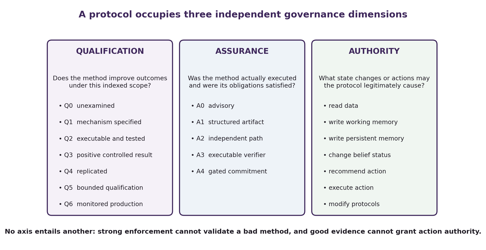
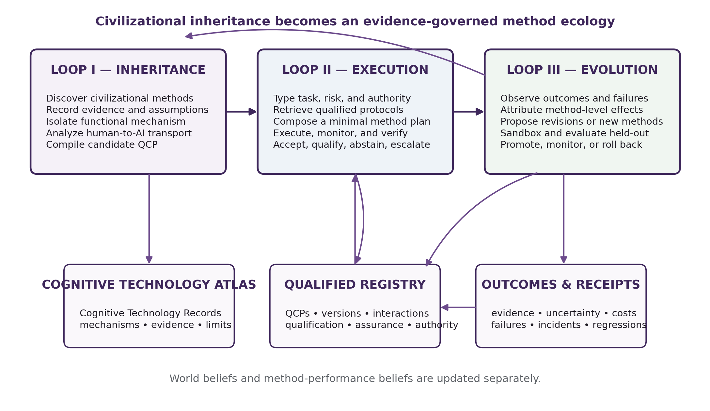
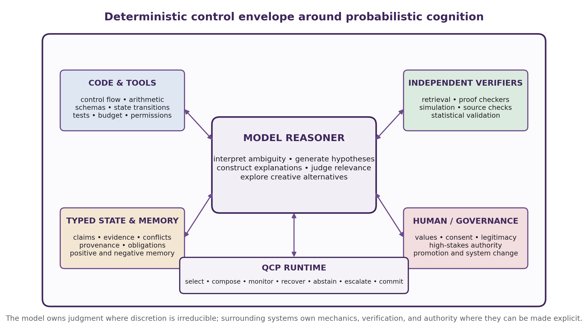
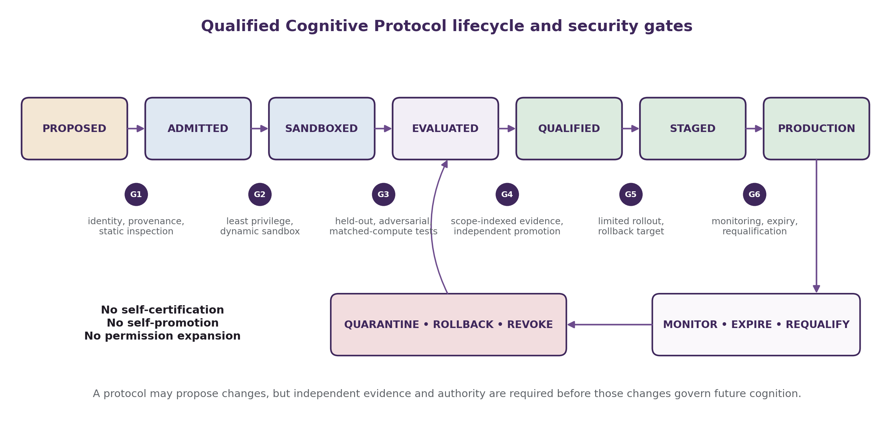

[← Corben Papers and Architecture Sources](index.qmd)

::: {.callout-important title="Original paper, not rewritten book prose"}
This page publishes Corben Sorenson's original source manuscript so readers can inspect the ideas that preceded or informed the living book. The text may contain historical terminology, claims, confidence, citations, or implementation status that the book later narrows, revises, tests, or rejects. Publication here establishes provenance and access—not correctness, novelty, replication, or support-state promotion.
:::

## Publication and provenance

| Field | Record |
|---|---|
| Source ID | `compiling_civilization_cmtq` |
| Source class | `author_research_paper` |
| Library class | `research_paper` |
| Manuscript date | 2026-08-14 |
| Inventory updated | 2026-08-14 |
| Exact published-source SHA-256 | `425017e36f82427463a4a653f2ddc5beacc0564111a52ee8f50912a2caba5940` |
| Exact published-source bytes | 106,935 |
| Exact source text | [Download/view the tracked Markdown source](source/compiling_civilization_cmtq.md) |
| Book's source note | [Read the bounded mining note](https://github.com/corbensorenson/asi-stack-book/blob/main/sources/source_notes/compiling_civilization_cmtq.md) |
| Authorship and collaborator credits | Preserved from the exact original manuscript; this library wrapper does not replace or simplify them. |
| Rights | No new license grant. Corben Sorenson's rights are reserved; collaborator, quotation, source-title, and third-party rights remain with their holders. |

**Current publication boundary.** August 2026 author conceptual framework, reference architecture, schemas, and experimental program. The supplied package validator passes structural, reference, figure, schema, example, and selected DOCX checks; no CMTQ runtime, benchmark, measured cognitive-leverage gain, secure deployment, independent reproduction, novelty result, support transition, SOTA, AGI, or ASI is inferred.

**HTML presentation note.** The HTML page normalizes line endings and trailing whitespace, preserves explicit Markdown hard breaks, and demotes manuscript headings beneath the page title. Supplied local figure assets are copied byte-for-byte and their relative paths are rewritten into this reader page. The digest above applies to the linked exact source text, not to this presentation wrapper.

## Where this paper enters the living book

[Cognitive Method Transfer and Qualification](../chapters/cognitive-method-transfer-and-qualification.html)

<hr>

## Original manuscript

::: {custom-style="Title"}
Compiling Civilization: Cognitive Method Transfer and Qualification for Artificial Intelligence
:::

::: {custom-style="Subtitle"}
Distilling Human Cognitive Technologies into Typed, Executable, and Governed Protocols
:::

::: {custom-style="Author"}
Corben Sorenson
:::

::: {custom-style="Affiliation"}
Independent Researcher
:::

::: {custom-style="Date"}
August 2026
:::

::: {custom-style="Paper Status"}
Standalone Conceptual Paper | Version 1.0
:::

::: {custom-style="Status Note"}
This manuscript presents a formal framework, reference architecture, and falsifiable research agenda. It does not report completed empirical validation of the proposed framework.
:::

```{=openxml}
<w:p><w:r><w:br w:type="page"/></w:r></w:p>
```

## Abstract

Foundation models can describe many of humanity’s methods for improving reasoning: experimental design, adversarial review, formal verification, diagnostic elimination, source triangulation, premortems, postmortems, accounting controls, and scientific replication. Yet latent possession of a method does not ensure that an artificial system will recognize when the method applies, select it appropriately, execute it faithfully, verify its result, or learn from its outcome. Moreover, a procedure developed for human cognitive, social, and institutional environments cannot be assumed to transfer unchanged to an artificial substrate. The relevant problem is therefore not merely how to encode a procedure, but how to justify its transport and delimit its authority.

This paper introduces **Cognitive Method Transfer and Qualification (CMTQ)**, a framework for discovering civilizational cognitive technologies, isolating their proposed functional mechanisms, transporting those mechanisms into artificial systems, compiling them as typed executable protocols, and empirically qualifying their use for specified models, domains, environments, budgets, and risk classes. CMTQ defines two principal artifacts: the **Cognitive Technology Record (CTR)**, which captures the source method, evidence, assumptions, mechanism hypotheses, contraindications, and normative content; and the **Qualified Cognitive Protocol (QCP)**, which specifies applicability predicates, typed epistemic state, control flow, obligations, forbidden transitions, verifier bindings, failure behavior, budgets, permissions, provenance, and an indexed qualification boundary. The framework separates three dimensions that are often conflated: whether a method improves outcomes, whether it was actually executed, and what state changes or actions it may legitimately cause.

The proposed architecture comprises inheritance, execution, and evolution loops; maintains separate beliefs about the world and about method performance; treats protocol libraries as security-sensitive supply chains; and prohibits self-certification, self-promotion, and permission expansion. A fixed-model benchmark is proposed to measure **cognitive leverage** while separately evaluating method validity, routing validity, execution fidelity, outcome effects, interaction effects, cost, and harm. The resulting research program treats humanity’s accumulated cognitive procedures not as an unquestioned blueprint, but as the seed corpus for an evidence-governed science of cognitive methods.

**Keywords:** metacognition; cognitive architecture; language agents; agent protocols; distributed cognition; procedural memory; harness engineering; verification; AI governance; cognitive amplification; method transfer; cognitive systems engineering

## 1. Introduction

The development of artificial intelligence has been dominated by a compelling and empirically productive strategy: increase model capacity, improve optimization, broaden data, and allocate more inference-time computation. That strategy has produced systems with increasingly broad knowledge and flexible reasoning. It also encourages an incomplete picture of intelligence. The model is treated as the principal site of capability, while the surrounding structures that decide what the model attends to, which method it uses, what it must verify, when it should stop, what it may change, and how it learns from failure are treated as secondary scaffolding.

Human civilization suggests a different decomposition. People do not obtain reliable cognition solely by becoming individually smarter. They use writing to extend memory, diagrams to externalize structure, mathematical notation to compress transformations, checklists to prevent omission, peer review to expose claims to criticism, experiments to discriminate hypotheses, accounting systems to reveal inconsistency, courts to organize adversarial evidence, engineering standards to preserve lessons from failure, and institutions to distribute authority. Many of the most important advances in practical intelligence are not additional facts inside a mind. They are reusable arrangements around a mind.

Metacognition has classically concerned knowledge, monitoring, and control of cognition [1, 2]. Executive-function research further distinguishes partially separable control capacities such as updating, inhibition, and shifting [3]. Bounded-rationality and metareasoning research asks how a limited reasoner should allocate computation and select internal operations [4, 5, 6]. Distributed-cognition research expands the relevant cognitive unit beyond the individual to include artifacts, representations, other people, and environmental structure [7, 8, 9, 10]. Together, these traditions imply that effective cognition is a property of a complete system, not merely of an isolated reasoner.

This implication is unusually actionable for artificial systems. Human cognitive architecture is altered through education, habits, artifacts, organizations, and culture. The cognitive architecture surrounding an AI model is software-defined. A system can be required to preserve provenance, run tests, distinguish observations from hypotheses, generate alternatives, obtain independent evidence, refuse invalid state transitions, or escalate a decision before acting. The underlying model can remain probabilistic and flexible while deterministic or independently verifiable structures govern selected parts of its cognitive process.

Recent agent research has moved decisively in this direction. Cognitive architectures for language agents organize memory, action, and decision components around a model [11]. ReAct combines reasoning and tool use [12]; Reflexion and Self-Refine store or apply feedback across iterative attempts [13, 14]; process supervision evaluates intermediate reasoning [15]; SELF-DISCOVER composes reasoning structures [16]; and StateFlow organizes task execution through explicit state transitions [17]. More recent work treats cognitive models as templates for language-agent design, compiles bounded problem-solving knowledge into explicit agents, reviews the externalization of memory and procedures, compiles prose skills into typed harnesses, composes skills as verified graphs, and represents research as typed evidence state [18, 19, 20, 21, 22, 23].

These developments establish that explicit procedural structure is already a serious research direction. They also sharpen the unresolved problem. Existing systems generally begin with a skill, workflow, reasoning template, or procedure and ask how it should be represented, selected, or executed. They do not yet provide a general account of how a method inherited from human practice becomes a *justified* AI control procedure. A surgical checklist, legal appeal, scientific replication norm, premortem, double-entry ledger, or diagnostic forcing strategy cannot simply be copied into an agent prompt and presumed beneficial. Human methods may depend on human memory limitations, social incentives, tacit expertise, embodiment, professional authority, or environmental regularities that do not survive the substrate change. Familiarity is not qualification.

This paper therefore addresses a prior and broader question:

> **How can a cognitive method developed within human civilization be functionally distilled, transported to an artificial substrate, compiled into an explicit protocol, empirically qualified for a bounded scope, securely governed, and improved without granting it unjustified authority?**

The proposed answer is **Cognitive Method Transfer and Qualification (CMTQ)**. CMTQ treats civilizational methods as candidate cognitive interventions rather than commandments. A method first becomes a Cognitive Technology Record, which captures what problem it is intended to solve, why it might work, what evidence supports it, which assumptions it makes, where it fails, and what values or authority it embeds. A target-specific transport analysis then produces a candidate Qualified Cognitive Protocol: a versioned execution contract with typed state, applicability predicates, obligations, guards, verifiers, budgets, permissions, provenance, and a qualification package indexed to a model, domain, task distribution, environment, and risk class.

The framework makes six principal contributions:

1. It defines **civilizational cognitive technologies** as a substrate-independent research object spanning individual strategies, artifacts, role systems, institutions, and method ecologies.
2. It formulates human-to-AI reuse as a **causal transport and qualification problem**, separating evidence for a source practice from evidence for its artificial realization.
3. It introduces **Cognitive Technology Records** and **Qualified Cognitive Protocols** as distinct source and executable artifacts.
4. It separates **qualification**, **assurance**, and **authority** so that method efficacy, execution fidelity, and permitted effects cannot be inferred from one another.
5. It specifies a three-loop architecture for inheritance, execution, and governed evolution, including typed epistemic state, positive and negative procedural memory, secure protocol supply chains, and no-self-certification invariants.
6. It proposes a fixed-model experimental program that measures the **cognitive leverage** contributed by external cognitive infrastructure while controlling for compute and task difficulty.

> **Status and non-claim.** CMTQ is presented as a formal conceptual framework and falsifiable systems research agenda. The paper does not claim that its proposed protocol language, qualification levels, or architecture have already improved model performance. Recent empirical results cited throughout the paper are treated as evidence for adjacent mechanisms and design constraints, not as validation of CMTQ as a whole.

The remainder of the paper develops the theory, artifacts, runtime, governance model, and evaluation program needed to turn the intuition that AI should inherit humanity’s methods of thought into a precise research object.

## 2. Intelligence Beyond the Model

### 2.1 Intrinsic capability and realized capability

Consider two systems built around the same frozen model. The first receives a prompt and produces an answer. The second has persistent working state, typed evidence, source retrieval, a task router, arithmetic and code execution, explicit uncertainty, a contradiction monitor, external verifiers, rollback, and a memory system that stores validated failures as regression tests. The models have identical weights. Their realized performance can nonetheless differ substantially.

This motivates a distinction between **intrinsic model capability** and **realized system capability**. The former concerns what transformations the underlying model can in principle perform under suitable conditions. The latter concerns what the complete system reliably produces under actual constraints. A schematic expression is

$$
\mathbf{Y}=F(M,\Pi,K,T,E,B,A),
$$

where $M$ is the base model, $\Pi$ the cognitive protocol architecture, $K$ available knowledge and memory, $T$ tools and verifiers, $E$ the environment, $B$ the resource budget, and $A$ the authority structure. The function is not assumed to be linear. The same model can become more or less effective depending on how these components interact.

Classical cognitive architectures already separate functional subsystems rather than equating cognition with one homogeneous process. ACT-R integrates declarative memory, procedural production rules, perceptual-motor modules, and control mechanisms [24]. Soar organizes working memory, procedural knowledge, semantic memory, episodic memory, and learning around problem spaces and production rules [25]. Language-agent architectures inherit a similar systems perspective [11]. CMTQ extends this view from a designed set of internal modules to a governed ecology of methods drawn from civilization and experimentally qualified for artificial use.

### 2.2 Cognitive infrastructure as accumulated computation

A cognitive technology often allows a difficult act of reasoning to be performed once, generalized, and reused. A proof technique records a valid pattern of inference. A checklist records omissions that should not recur. A test suite records behaviors that future implementations must preserve. A notation system reduces the cost of expressing transformations. An audit protocol records where independent reconciliation is valuable. In this sense, civilization accumulates not only conclusions but **compressed prior cognition**.

This accumulation changes the effective problem faced by later reasoners. Kirsh and Maglio called attention to epistemic actions: actions valuable because they reduce the computational burden of cognition rather than directly advancing the external task [7]. Writing intermediate results, sorting evidence, drawing a diagram, or constructing a table can transform a difficult internal search into an easier perceptual or mechanical operation. Distributed-cognition analyses show that coordinated systems of people and artifacts can remember, compute, and regulate in ways not attributable to one participant alone [8, 10].

For AI, externalization has a further advantage: procedures can be inspected, versioned, tested, revoked, and reused across model generations. The model need not rediscover the control structure of a method in every context window. Recent work explicitly describes a movement from capability embedded in weights, to capability supplied in context, to capability externalized in memory, skills, protocols, and harnesses [20]. CMTQ accepts that movement but adds a prior question—whether the externalized method is appropriate—and a later question—how its continuing authority should be governed.

### 2.3 Why more knowledge does not solve procedural control

A model can accurately explain the scientific method yet fail to distinguish observation from interpretation in a new analysis. It can describe unit testing yet announce that code is complete without running a test. It can discuss source triangulation yet rely on several articles that all copy the same underlying claim. It can know that correlation is not causation yet phrase a correlational result causally. These are not necessarily failures of declarative possession. They are failures in recognizing, selecting, executing, verifying, or enforcing a method.

The distinction is analogous to software. A processor containing a description of memory protection does not thereby implement memory protection. A user who has read about type systems does not thereby prevent invalid states in a program. Where a property can be made structural, re-deriving it through free-form cognition on every execution is an unnecessarily weak design.

The goal is not to eliminate model judgment. The model remains essential where ambiguity, interpretation, hypothesis generation, analogy, creativity, and incomplete evidence require flexible cognition. The design target is a **deterministic control envelope around probabilistic cognition**: mechanize what can be mechanized, independently verify what can be verified, and explicitly govern what carries authority.

## 3. Civilizational Cognitive Technologies

### 3.1 Definition

**Definition 1 (Civilizational cognitive technology).** A civilizational cognitive technology is a reusable arrangement of representations, operations, roles, artifacts, constraints, incentives, and feedback intended to improve one or more dimensions of cognition under identifiable conditions.

The dimensions improved may include correctness, calibration, completeness, efficiency, creativity, robustness, coordination, error detection, recovery, learning, auditability, or safety. The definition is intentionally broader than “reasoning strategy.” A cognitive technology may be a notation, an atomic operator, a protocol, a role structure, an institution, or a system for revising methods themselves.

The word *civilizational* indicates that the source corpus extends beyond laboratory models of individual cognition. It includes practices developed in science, mathematics, medicine, engineering, software, accounting, law, operations, education, safety, and governance. These practices are heterogeneous. Some are experimentally supported, some are supported mainly by operational experience, some encode normative authority, and some are ritualized but ineffective. Their inclusion in the source corpus is not endorsement.

### 3.2 Structural scale

Cognitive technologies can be classified by the scale at which they operate.

**Table 1. Structural scale of cognitive technologies**

| Level | Unit | Examples | Typical AI realization |
|---|---|---|---|
| L0 | Representation or artifact | notation, diagram, ledger, scratchpad | typed object, graph, structured workspace |
| L1 | Atomic operator | retrieve, compare, estimate, decompose | callable operator or model slot |
| L2 | Strategy | backtracking, analogy, counterexample search | bounded search policy |
| L3 | Method or protocol | experimental design, differential diagnosis | typed workflow with obligations |
| L4 | Role arrangement | proposer–critic–judge, red team | multi-role graph with independence constraints |
| L5 | Institution | peer review, replication, appeals, audit | persistent multi-party protocol with authority |
| L6 | Method ecology | evaluate, compose, revise, retire methods | qualified registry and evolution process |

Most agent-skill systems operate primarily at L1–L3. CMTQ includes those levels but treats L4–L6 as equally important. Peer review is not merely “ask another model to critique.” It is a role arrangement with expectations of independence, disclosure, evidence standards, editorial authority, and sometimes appeal. Scientific practice is not one prompt template. It is an ecology of observation, measurement, modeling, experimentation, criticism, replication, and revision.

### 3.3 Functional families

A second taxonomy classifies cognitive technologies by function:

1. **Orient and attend:** salience cues, preflight checks, interruption policies, anomaly triggers.
2. **Frame and represent:** diagrams, notation, decompositions, ledgers, alternative encodings.
3. **Retrieve and investigate:** measurement, literature review, source triangulation, chain of custody.
4. **Generate and explore:** brainstorming, analogy, morphological analysis, branch search.
5. **Infer and model:** deduction, induction, Bayesian updating, causal modeling, simulation.
6. **Challenge and falsify:** counterexample search, devil’s advocacy, red teaming, premortems.
7. **Verify and assure:** proof, replication, unit tests, audits, reconciliation, formal checking.
8. **Decide and control:** decision analysis, safety factors, reversible pilots, stopping rules.
9. **Learn and consolidate:** postmortems, error logs, deliberate practice, regression tests.
10. **Coordinate and govern:** separation of duties, appeals, review boards, permission systems.

These families are not mutually exclusive. A premortem generates scenarios, challenges a plan, and informs decision control. A scientific notebook represents state, preserves provenance, and supports learning. A court organizes evidence and authority while also providing a method for challenge.

### 3.4 Compressed histories of failure

Many cognitive technologies can be understood as generalized responses to recurring failure. Human-factors and safety research emphasizes that errors arise not only from defective individuals but from systems that make failure easy or difficult [26, 27]. A checklist may encode omissions that previously caused harm. A chain-of-custody rule encodes the fact that evidence becomes unreliable when handling is undocumented. A safety margin encodes uncertainty about models and environments. A replication norm encodes the fact that a single apparently successful result can mislead. A rollback plan encodes the possibility that interventions have unanticipated effects.

The general transformation is

$$
\text{failure episode}
\rightarrow
\text{failure class}
\rightarrow
\text{method}
\rightarrow
\text{obligation or guard}
\rightarrow
\text{runtime enforcement}.
$$

This transformation connects civilizational methods to procedural memory. Instead of preserving a failure only as narrative, a system can extract a detector, mark a suspect transition, define a recovery policy, and add a regression test. Not every failure can be localized so cleanly, but when it can, the result is a reusable negative cognitive technology.

### 3.5 Functional distillation, not human imitation

The visible human form is rarely the correct transfer target. A paper checklist compensates for limited, interruption-prone working memory. The substrate-general function may be: *persist a mandatory obligation set across interruptions and prevent commitment until each obligation is discharged*. An AI implementation might therefore use typed state and a commitment gate rather than presenting a natural-language list to the model.

Likewise, a human “second opinion” may work through independent training, separate evidence, different incentives, or lack of attachment to the first diagnosis. Two calls to the same model with the same context may reproduce the surface form without the mechanism. A scientific notebook may become an append-only provenance ledger. A legal appeal may become independent re-adjudication under a different authority path. A memory palace may be irrelevant if the artificial system already has reliable indexed retrieval.

The source method is therefore evidence about a possible function. CMTQ transfers the function only after identifying which parts are essential, contingent, normative, or obsolete.

## 4. The Five Gaps

CMTQ begins from five gaps between knowing that a method exists and safely relying on it as AI infrastructure.

### 4.1 The possession gap

The **possession gap** asks whether the system contains an adequate representation of the method. A model may possess only a slogan—“consider alternative hypotheses”—or a detailed procedure with domain-specific conditions. Possession itself is graded. A method can be encoded in weights, retrieved documentation, a structured record, executable code, or some combination.

Training on broad corpora is particularly effective at latent possession. It exposes models to descriptions, examples, and critiques of human methods. But possession does not imply that the method will be activated or followed. It is the beginning of the chain rather than its completion.

### 4.2 The realization gap

The **realization gap** separates six stages:

$$
\text{possession}
\rightarrow
\text{recognition}
\rightarrow
\text{selection}
\rightarrow
\text{execution}
\rightarrow
\text{verification}
\rightarrow
\text{consolidation}.
$$

For method $m$ on task $x$, the realized value can be represented schematically as

$$
R(m,x)=K_mD_mS_mX_mV_mU_m,
$$

where $K_m$ denotes representation, $D_m$ detection of applicability, $S_m$ appropriate selection, $X_m$ execution fidelity, $V_m$ verification, and $U_m$ useful updating from the outcome. The multiplicative form is illustrative, not an assumption that the factors are statistically independent. It emphasizes that a near-zero term can destroy most of the method’s practical value.

SIGIL provides direct recent evidence for a realization gap in agent skills. In its reported preprint experiments, prose-based agents executed only a portion of the steps mandated by their own skills, whereas compiled harnesses executed a substantially larger fraction and completed the full procedure more often while using fewer tokens [21]. The result should not be generalized beyond its tested skills and models without replication. It nevertheless demonstrates the design principle: describing control flow to a model and encoding control flow in the runtime are not equivalent.

### 4.3 The transport gap

The **transport gap** arises because a method’s effect is conditional on its source substrate and environment. Let

$$
\tau_H(m,c_H)
=
\mathbb{E}[Y\mid do(m),H,c_H]
-
\mathbb{E}[Y\mid do(\varnothing),H,c_H]
$$

be the effect of human method $m$ in human context $c_H$. What the AI designer needs is

$$
\tau_A(m',M,c_A)
=
\mathbb{E}[Y\mid do(m'),M,c_A]
-
\mathbb{E}[Y\mid do(\varnothing),M,c_A],
$$

where $m'$ is the artificial realization, $M$ the target model and scaffold, and $c_A$ the target context. In general,

$$
\tau_H(m,c_H)\neq\tau_A(m',M,c_A).
$$

This is structurally related to causal transportability: evidence from one population or environment does not automatically identify an effect in another when relevant mechanisms differ [28]. Human evidence can establish that a cognitive problem exists, suggest a mechanism, provide a prior over interventions, and identify possible harms. It does not by itself qualify the artificial implementation.

### 4.4 The qualification gap

The **qualification gap** concerns evidence for the target implementation. The question is not whether “checklists work,” but whether a specific protocol helps a specified model on a specified task distribution under specified conditions. Human intervention evidence illustrates why this indexing matters. A multinational study of a surgical safety checklist reported reductions in complications and mortality [29], while a later population-level study of checklist introduction in Ontario did not find significant reductions in the measured outcomes [30]. A controlled trial of cognitive-forcing instruction likewise found no reduction in diagnostic error under its tested conditions [31].

These studies do not establish that the methods are universally effective or ineffective. They show that a plausible method can depend on implementation fidelity, population, workflow integration, baseline conditions, outcome definitions, and context. AI protocol evaluation must therefore separate method reputation from target-specific evidence.

A protocol’s qualification is indexed as

$$
Q(P,M,D,T,E,R,B,t),
$$

where $P$ is the protocol version, $M$ the model and surrounding scaffold, $D$ the domain, $T$ the task distribution, $E$ the environment and tool configuration, $R$ the risk class, $B$ the budget, and $t$ the evaluation date. Qualification does not automatically survive a model upgrade, domain shift, new tool, changed budget, or altered threat environment.

### 4.5 The governance gap

The **governance gap** asks how a protocol is admitted, permissioned, updated, monitored, and revoked. An otherwise useful method may be maliciously modified, overprivileged, poisoned through memory, composed unsafely, or promoted on the basis of its own report. A protocol that influences the model’s context can manipulate cognition even without direct code execution. A protocol that controls tools, persistent memory, or external actions carries additional authority.

Recent ecosystem evidence makes this more than a theoretical concern. A 2026 study of agent skills identified confirmed malicious artifacts and multiple attack techniques across a large corpus [32]. SkillGuard accordingly treats skills as permission-bearing executable artifacts rather than trusted prompt fragments [33]. Long-term-memory security research emphasizes persistence, statefulness, propagation, provenance, versioning, rollback, and policy-aware retention [34]. Runtime policy systems such as AgentSpec demonstrate that constraints can be enforced outside the model at action boundaries [35].

CMTQ therefore treats a protocol registry as a combined software, epistemic, and authority supply chain.

## 5. Functional Distillation and Causal Transport

### 5.1 The functional transfer test

Before a human practice becomes an AI protocol, it should undergo a structured transfer analysis. The following questions form the **functional transfer test**:

1. What cognitive problem or failure class is the source method intended to solve?
2. What causal mechanism is proposed to produce the benefit?
3. Which human limitations or capabilities does the method assume?
4. Does the target artificial system share those conditions?
5. Which elements are essential mechanisms and which are historical surface forms?
6. Which steps require open-ended judgment?
7. Which steps can be mechanized or independently verified?
8. What observations would show that the proposed mechanism activated?
9. What evidence supports, contradicts, or limits the source method?
10. Under what conditions is the method neutral, harmful, or wasteful?
11. Does it depend on genuine independence among participants?
12. Does it depend on incentives, embodiment, emotion, social legitimacy, or tacit expertise?
13. What normative assumptions or authority claims does it embed?
14. How might it interact with other methods?
15. What residual risk remains after faithful execution?
16. What evidence would falsify the proposed transport?

A method that cannot answer these questions may still be tested, but it should remain weakly qualified. The framework favors explicit uncertainty over method theater.

### 5.2 Transfer classes

**Table 2. Functional transfer classes**

| Class | Description | Default treatment |
|---|---|---|
| Substrate-general | addresses a limitation shared by bounded reasoners | candidate for direct functional translation |
| Human-limit compensator | useful only if the AI has an analogous limitation | test the limitation before transfer |
| Institutional | depends on roles, independence, incentives, or persistent records | translate the institutional mechanism, not role labels alone |
| Normative | embeds values, rights, legitimacy, or authority | require explicit human or governance ownership |
| Embodied | depends strongly on physiology, sensorimotor coupling, or lived experience | reject or redesign unless analogous embodiment exists |
| Context-bound | effective only under specific organizational or environmental conditions | preserve context predicates in applicability |
| Unvalidated ritual | familiar practice with weak or conflicting efficacy evidence | admit only as experimental candidate |
| Obsolete or harmful | evidence or mechanism indicates net harm | reject, quarantine, or retain only as negative knowledge |

These classes can overlap. Peer review is institutional and context-bound. A breathing exercise for impulse control is embodied and human-limit-specific. Dimensional analysis is largely substrate-general. Consent procedures are normative and authority-bearing even when their recordkeeping components can be mechanized.

### 5.3 Mechanism-preserving transformation

Let a source method be represented as

$$
C=\langle F,\mu,A,S,I,N\rangle,
$$

where $F$ is its target function, $\mu$ the proposed causal mechanism, $A$ its assumptions, $S$ its surface structure, $I$ its institutional context, and $N$ its normative content. Transport constructs a target realization

$$
\mathcal{T}(C,M,D,E,R)\rightarrow P^*,
$$

where $P^*$ is a candidate protocol for model $M$, domain $D$, environment $E$, and risk class $R$.

A good transformation attempts to preserve $F$ and the relevant part of $\mu$ while changing $S$ when the original surface structure is human-specific. It must either reproduce the necessary parts of $I$ or state that the method cannot be faithfully transported. It must expose rather than silently inherit $N$.

This yields four possible dispositions:

- **copy:** the source structure itself is appropriate;
- **transform:** preserve the mechanism through a different implementation;
- **hybridize:** retain human-owned or institutional nodes where automation would erase essential properties;
- **reject:** the mechanism does not transport or the expected value is negative.

Rejection is not a failure of the framework. It is one of its intended outputs.

### 5.4 Evidence assessment without false precision

The evidence attached to a source method should not be collapsed prematurely into a single score. A Cognitive Technology Record should preserve study design, population, task, effect direction and size, uncertainty, risk of bias, inconsistency, replication, implementation fidelity, harms, and indirectness to the target AI setting. Evidence-quality systems such as GRADE demonstrate the importance of separating certainty of evidence from strength of recommendation and of explicitly considering bias, inconsistency, indirectness, and imprecision [36]. CMTQ draws inspiration from that separation but does not claim to be a modified GRADE system.

A cross-domain atlas of methods should be built as a transparent scoping review rather than an informal list. PRISMA-ScR and JBI guidance provide established methods for search protocols, inclusion criteria, extraction, and reporting [37, 38]. An initial atlas should sample science, mathematics, medicine, engineering, software, accounting, law, operations, forecasting, safety, and education. Each record should be dual-coded where feasible, with disagreements adjudicated and the coding schema published.

### 5.5 Applicability is part of the method

A protocol that does not specify when it should *not* run is incomplete. Every candidate method needs positive applicability predicates and contraindications. Counterexample search is valuable for universal mathematical claims but may be irrelevant to a purely aesthetic request. Premortems can reveal failure modes before costly action but may suppress exploratory creativity if invoked during initial ideation. Repeated self-critique may degrade a correct answer when no external feedback is available [39]. Source retrieval before hypothesis generation may reduce hallucination but also anchor the search space. Method selection is therefore a metareasoning problem, not a static checklist of best practices.

## 6. Cognitive Technology Records

### 6.1 Purpose

A **Cognitive Technology Record (CTR)** is a source artifact. It captures what is believed about a civilizational method before the method is granted executable form or authority. Keeping the source record distinct from the executable protocol prevents implementation choices from erasing evidence limitations and historical assumptions.

**Definition 2 (Cognitive Technology Record).** A CTR is a versioned, provenance-bearing record of a cognitive technology’s intended function, proposed mechanism, assumptions, structural elements, empirical record, contraindications, cost profile, normative content, and security status.

A compact formal representation is

$$
C=\langle id,f,\mu,A,S,R,E^-,K,N,\rho\rangle,
$$

where:

- $id$ is identity, source, authorship, and version;
- $f$ is the target cognitive function and failure class;
- $\mu$ is one or more mechanism hypotheses;
- $A$ is the set of assumptions and required conditions;
- $S$ is the arrangement of roles, artifacts, operations, constraints, incentives, and feedback;
- $R$ is the empirical record and its uncertainty;
- $E^-$ is contraindications, known harms, and failure conditions;
- $K$ is the time, compute, coordination, and implementation cost profile;
- $N$ is normative or authority-bearing content;
- $\rho$ is provenance, trust, and integrity state.

### 6.2 Mechanism hypotheses as first-class objects

A method may have multiple plausible mechanisms. Checklists may work by preventing omission, creating a pause, improving team communication, signaling institutional priority, or some combination. Peer review may detect errors through expertise, independence, reputational incentives, or editorial filtering. CMTQ stores these as competing mechanism hypotheses with observable implications.

This matters because a transported implementation may reproduce one mechanism but not another. A hard obligation gate reproduces omission prevention but not necessarily team communication. An AI critic may reproduce adversarial search but not social accountability. If outcomes improve, mechanism measures help determine why. If outcomes do not improve, they help distinguish failed execution from failed theory.

### 6.3 Negative records

Methods rejected as ineffective, harmful, or non-transportable should remain in the atlas as negative records. Otherwise the system may repeatedly rediscover and retest the same attractive failure. A negative CTR can state:

- the method’s claimed function;
- the failed mechanism hypothesis;
- the target settings in which harm or null effects appeared;
- the misleading surface cues that make the method attractive;
- the tests that reveal the failure;
- the conditions under which reconsideration would be warranted.

Civilizational inheritance should include abandoned methods, not only surviving ones.

## 7. Qualified Cognitive Protocols

### 7.1 Definition and contract

After functional distillation and target design, a candidate method becomes a **Qualified Cognitive Protocol (QCP)**.

**Definition 3 (Qualified Cognitive Protocol).** A QCP is a typed, versioned execution contract that specifies when a cognitive method applies; what state and evidence it consumes and produces; which operations and roles it invokes; which obligations, invariants, and forbidden transitions govern execution; how execution and outputs are verified; how failure is handled; what resources it may consume; what effects it may cause; and for which model, domain, environment, and risk conditions it has been qualified.

A compact representation is

$$
P=\langle id,\theta,\Sigma,G,\Omega,\mathcal{V},\mathcal{F},\beta,\Gamma,Q,\rho\rangle,
$$

where:

- $id$ is stable identity and version;
- $\theta$ contains applicability and contraindication predicates;
- $\Sigma$ defines typed inputs, outputs, claims, and runtime state;
- $G$ is the control-flow and data-flow graph;
- $\Omega$ contains obligations, invariants, and guarded transitions;
- $\mathcal{V}$ binds verifiers and evidence requirements;
- $\mathcal{F}$ defines retry, repair, abstention, escalation, and rollback;
- $\beta$ defines budget and stopping policy;
- $\Gamma$ defines permissions, effects, and authority boundaries;
- $Q$ is the indexed qualification package;
- $\rho$ is provenance, integrity, and security status.

### 7.2 QCP intermediate representation

The proposed intermediate representation, **QCP-IR**, needs a small set of typed cognitive operators. A minimal instruction set is:

```text
ASSERT(type, content, provenance)
OBSERVE(source, schema)
RETRIEVE(query, constraints)
GENERATE(type, count, diversity)
DECOMPOSE(target, dimensions)
TRANSFORM(method, inputs)
COMPARE(items, criteria)
ESTIMATE(quantity, bounds)
SIMULATE(model, scenario)
CHECK(invariant, target)
VERIFY(verifier, claim)
CHALLENGE(claim, method)
BRANCH(condition)
DELEGATE(role, task, permissions)
REVISE(target, evidence)
ESCALATE(reason, destination)
COMMIT(decision, authority)
STORE(memory_class, artifact)
ABSTAIN(reason)
STOP(status)
```

Each node declares an owner—model, code, tool, independent verifier, human, or environment—along with input and output types, preconditions, postconditions, timeout behavior, evidence requirements, and failure route. The instruction set is deliberately smaller than a general programming language. QCP-IR is intended to describe cognitive control and evidence flow while allowing ordinary code and model calls to implement the individual nodes.

### 7.3 Obligations and forbidden transitions

A protocol is not merely a graph of suggested steps. It carries **obligations**. An obligation specifies a required property, its assurance level, and the evidence that satisfies it. Examples include:

- at least two plausible alternatives were generated;
- every material factual claim has provenance;
- contradictory evidence was preserved rather than silently removed;
- code was executed against the declared test suite;
- a high-risk action received independent authorization;
- a causal conclusion passed an applicable identification check.

A **guarded transition** prevents a state change unless a predicate is met. This is closer to a type rule or safety invariant than to a prompt reminder. Hoare logic demonstrated the value of explicit preconditions and postconditions in program reasoning [40]. QCP guards apply the same broad design instinct to epistemic and operational state without claiming that all cognition can be formally verified.

### 7.4 A worked causal-claim protocol

Suppose a system is asked whether intervention $X$ causes outcome $Y$. A candidate QCP may require the system to separate observations from interpretations, generate competing hypotheses, identify confounders, derive discriminating predictions, retrieve disconfirming evidence through an independent path, and apply statistical and provenance checks. The runtime can forbid the transition

```text
Correlation -> EstablishedCausalClaim
```

unless the declared causal-identification and evidence obligations have passed.

The model still performs difficult judgment: producing plausible alternatives, identifying relevant confounders, and interpreting incomplete evidence. The runtime does not prove the final conclusion. It ensures that the system cannot silently skip a declared route to that conclusion. Appendix C provides a fuller example, and the source package includes a machine-validatable YAML representation.

### 7.5 Qualification-carrying protocols

A QCP should be distributed with a **qualification package** containing:

- protocol identity and version;
- source CTR identifiers;
- mechanism hypotheses;
- applicability and contraindication predicates;
- model/domain/environment/risk qualification matrix;
- evidence dossier;
- regression and adversarial tests;
- known failures and interactions;
- capability and effect manifest;
- provenance chain and integrity digest;
- expiration or requalification date;
- rollback target.

This is not proof-carrying code in the formal sense. It is an executable method carrying structured evidence about what it is, where it came from, why it might work, where it has been tested, what it may do, and how it can be withdrawn.

## 8. Typed Epistemic State, Qualification, Assurance, and Authority

### 8.1 Epistemic types

Many agent systems type tool parameters while leaving the epistemic role of their contents implicit. Fluent text can then erase important distinctions. A model-generated sentence can be treated as an observation; a source report can become a fact; a hypothesis can become a finding; confidence can be mistaken for evidence; a recommendation can become an authorized action.

CMTQ proposes explicit types such as:

```text
Observation
SourceReport
Assumption
Hypothesis
Prediction
DerivedClaim
CausalClaim
EvidenceItem
Finding
Counterexample
Conflict
Unknown
Decision
CandidateAction
ExecutedAction
Hazard
Permission
Obligation
```

The purpose is not to force all thought into rigid serialization. It is to represent the state that determines what the system is allowed to conclude or do. TypedThinker and EviGraph provide adjacent evidence that typed reasoning modes and typed evidence structures can improve or stabilize specific tasks [41, 23]. CMTQ generalizes the idea to a governed protocol substrate.

### 8.2 Guarded epistemic transitions

Representative rules include:

```text
ModelOutput -> Observation
    requires external grounding

SourceReport -> VerifiedEvidence
    requires source and provenance validation

Hypothesis -> EstablishedClaim
    requires declared evidence and verifier obligations

Correlation -> CausalClaim
    requires an applicable causal protocol

SingleSourceReport -> HighConfidenceClaim
    prohibited when independent corroboration is mandatory

CandidateAction -> ExecutedAction
    requires permission and risk gates

UntrustedProtocol -> AuthorityBearingExecution
    requires admission, qualification, and permission

ProtocolProposal -> ProtocolPromotion
    requires independent evaluation
```

The central limitation must remain explicit:

> **Deterministic process can guarantee that a required operation occurred; it cannot guarantee that the resulting belief is true.**

A statistical checker can verify that a calculation follows declared inputs. It cannot guarantee that the inputs are representative. A provenance checker can verify that a source exists. It cannot guarantee that the source is correct. A protocol can require alternative hypotheses. It cannot guarantee that the generated alternatives include the truth.

### 8.3 Three independent axes

Method governance frequently conflates three questions. CMTQ separates them.

**Qualification:** Does this protocol improve relevant outcomes under this indexed scope?

**Assurance:** Was the protocol actually executed, and were its declared obligations satisfied?

**Authority:** What state changes, recommendations, memory writes, tool calls, or external actions may the protocol legitimately cause?

The protocol state is therefore

$$
\mathcal{S}(P)=\langle Q,A,\Gamma\rangle.
$$

{width=94%}

A protocol can be strongly enforced and empirically harmful. It can be beneficial but executed unreliably. It can be beneficial and faithfully executed yet lack legitimate authority to alter persistent memory or act on a person’s behalf. No coordinate should be inferred from another.

### 8.4 Proposed qualification levels

CMTQ proposes the following lifecycle-oriented levels. They are design proposals, not an existing standard.

| Level | Meaning |
|---|---|
| Q0 | anecdotal, inherited, or unexamined |
| Q1 | target function, mechanism, applicability, and contraindications specified |
| Q2 | executable implementation with schema, unit, and conformance tests |
| Q3 | positive effect in at least one controlled target setting |
| Q4 | replicated across tasks, seeds, environments, or model families |
| Q5 | conditionally qualified with explicit boundaries, interactions, and known failures |
| Q6 | monitored production qualification with incident response and periodic re-evaluation |

A level is incomplete without its scope. “Q5” means nothing unless accompanied by the model, protocol version, task distribution, environment, budget, risk class, and evaluation date.

### 8.5 Assurance levels

| Level | Enforcement |
|---|---|
| A0 — Advisory | natural-language recommendation; the model may skip it |
| A1 — Structured | required typed artifact or state field |
| A2 — Independent | separate critic, retrieval path, model, role, or evidence source |
| A3 — Executable | deterministic test, solver, proof checker, simulation, or external validation |
| A4 — Gated | commitment or action cannot occur until the obligation passes |

The appropriate assurance depends on stakes and verifier availability. A low-stakes creative task may use A0–A1. Production code may require A3. A consequential external action may require A4 plus independent authority.

### 8.6 Authority as a capability manifest

Authority should be represented through explicit effects rather than one scalar rank. A protocol may be allowed to:

- read task-relevant data;
- write transient working state;
- write evidence to persistent memory;
- change a claim from unknown to provisional;
- issue a recommendation;
- request an action;
- execute an action;
- propose a protocol revision.

Each effect can be allowed, denied, require confirmation, or require independent authorization. The following should normally be invariant:

```text
A protocol may propose a revision but may not promote it.
A protocol may report success but may not establish its own qualification.
A model may recommend an action but may not grant itself authority to execute it.
A memory entry may suggest a rule but may not become authoritative through summarization alone.
A protocol may not expand its own permissions.
```

## 9. The Three-Loop CMTQ Architecture

CMTQ contains three coupled loops: inheritance, execution, and evolution.

{width=96%}

### 9.1 Loop I: inheritance

The inheritance loop discovers candidate methods through literature review, historical analysis, expert elicitation, standards, incident reports, and institutional practice. It then:

1. creates a CTR;
2. identifies the target function and failure class;
3. separates surface structure from mechanism hypotheses;
4. assesses evidence and indirectness;
5. classifies substrate dependence and normative content;
6. designs one or more target realizations;
7. emits candidate QCPs with weak initial qualification.

Human practice is treated as a generator of hypotheses about cognition. The loop may conclude that a method should be transformed, retained with human-owned nodes, or rejected.

### 9.2 Loop II: execution

The execution loop receives a task, observation, goal, or requested action and constructs a task descriptor containing:

- task and claim types;
- domain;
- available evidence;
- risk and reversibility;
- authority requested;
- tools and verifiers available;
- latency, compute, and cost budget;
- user or organizational policy.

It then retrieves protocols whose qualification scope and applicability predicates match the descriptor, resolves dependencies and conflicts, composes a minimal execution graph, binds owners and verifiers, executes the graph, monitors obligations and budget, and terminates with one of several explicit statuses:

```text
accepted
provisional
abstained
escalated
failed
rolled_back
```

The output includes a cognitive receipt rather than an unrestricted private reasoning transcript.

### 9.3 Loop III: evolution

The evolution loop observes outcomes and protocol traces. It asks whether success or failure is attributable to:

- the underlying method;
- routing;
- execution fidelity;
- verifier quality;
- interaction with another protocol;
- resource limits;
- environmental change;
- model behavior;
- an incorrect mechanism hypothesis.

Candidate updates remain quarantined. They are tested in sandboxes, on held-out tasks, under adversarial conditions, and—where stakes warrant—across model families. Promotion is an independent governance action. Production versions are monitored, expire, and can be rolled back.

### 9.4 Two belief states

The system maintains at least two distinct belief states:

$$
B_t^W=\text{beliefs about the world}
$$

and

$$
B_t^M=\text{beliefs about method performance}.
$$

An episode updates both:

$$
(B_{t+1}^W,B_{t+1}^M)=U(B_t^W,B_t^M,e_t,o_t),
$$

where $e_t$ is the evidence produced during execution and $o_t$ is the observed outcome. This distinction prevents a method’s conclusions from being confused with evidence about the method itself. A protocol may reach the correct answer for the wrong reason; a protocol may reach a wrong answer despite faithful execution; a method may help only on a narrow task family. The system should be uncertain not only about the world, but about its ways of knowing the world.

## 10. Deterministic Control Around Probabilistic Cognition

### 10.1 Ownership boundary

The runtime assigns each operation to the component best suited to own it.

**Model-owned work** includes interpreting ambiguity, generating hypotheses, constructing explanations, identifying plausible confounders, judging relevance, making analogies, and exploring creative alternatives.

**Code- or tool-owned work** includes control flow, arithmetic, schema validation, provenance capture, permission checks, version resolution, timeout handling, test execution, invariant checking, state transitions, and final action commitment.

**Independent-verifier-owned work** includes externally checkable factual claims, executable code correctness, formal proof checking, statistical calculations, source existence and independence, constraint satisfaction, and simulation.

**Human- or governance-owned work** includes values, consent, legitimacy, high-stakes authority, protocol promotion, and changes to constitutional constraints.

{width=96%}

SIGIL formalizes a closely related “owner” distinction between model-owned cognition and code-owned mechanism [21]. CMTQ extends the separation to epistemic state, verifier independence, empirical qualification, permissions, and governance.

### 10.2 Why not make everything deterministic?

Many cognitive operations cannot be fully specified in advance without solving the underlying intelligence problem. Generating a useful hypothesis, recognizing a subtle analogy, or interpreting incomplete evidence requires open-ended judgment. Excessively rigid structures can reduce solution diversity or force reasoning into an ill-fitting representation. SELF-DISCOVER shows the potential value of composing reasoning modules [16], while subsequent work on structured versus unstructured plans cautions that more rigid serialization is not automatically better.

CMTQ therefore structures the **control plane**—obligations, state, evidence, transitions, budgets, permissions, and commitment boundaries—while preserving flexible model-owned cognition inside designated nodes. The desired property is not determinism of thought. It is explicit ownership of what can and cannot be guaranteed.

### 10.3 Why not leave everything to the model?

Same-model self-critique can be useful, but it is not equivalent to external verification. Models may repeat the same error, be anchored by their prior answer, or revise a correct answer into an incorrect one without reliable external feedback [39]. Reflexion and Self-Refine demonstrate that feedback loops can improve performance in many settings [13, 14], but the feedback source, task, and stopping policy matter.

A model should not be asked to remember whether it followed a mandatory process when the runtime can observe the process directly. It should not be asked to simulate arithmetic when a calculator is available, certify code it has not executed, or police permissions granted to itself. Externalization is most valuable where it converts a fragile cognitive obligation into an inspectable system property.

## 11. Method Ecology, Routing, and Composition

### 11.1 Store many, activate few

A large method registry is useful only if the active set remains selective. GraSP reports that focused collections of two or three skills can outperform indiscriminate inclusion and that graph-structured composition can reduce unnecessary environment interaction in its tested settings [22]. These are preliminary results, but they reinforce a general design principle: registry size and active cognitive load are different variables.

For task descriptor $x$, model $M$, and qualified registry $\mathcal{R}$, the compiler selects a protocol set $\Pi$:

$$
\Pi^*=\arg\max_{\Pi\subseteq\mathcal{R}}
\left[
\mathbb{E}(\Delta U\mid x,M,\Pi)
-\lambda C(\Pi)
-\mu R(\Pi)
-\nu I(\Pi)
\right],
$$

where $C$ is resource cost, $R$ residual risk, and $I$ expected interference. Mandatory policy constraints apply before optimization.

This is a form of metareasoning: internal computations and procedures are actions whose expected value must be compared with their cost [5, 6]. The compiler itself therefore needs qualification, calibration, and fallback behavior.

### 11.2 Protocol relationships

The registry should represent relationships such as:

```text
requires
enables
conflicts_with
duplicates
specializes
subsumes
verifies
invalidates
increases_cost
reduces_risk
requires_independence_from
must_precede
must_follow
```

Typed preconditions and effects allow the compiler to detect missing dependencies and some conflicts before execution. Graph-based skill systems already demonstrate the value of explicit dependency structure and local repair [22]. QCP graphs add evidence types, authority effects, and qualification boundaries.

### 11.3 Interaction and order effects

Method effects are not necessarily additive. Define pairwise interaction as

$$
S(P_i,P_j)=\Delta U(P_i\circ P_j)-\Delta U(P_i)-\Delta U(P_j).
$$

Positive $S$ indicates synergy; negative $S$ indicates interference. Order may matter:

$$
P_i\circ P_j\neq P_j\circ P_i.
$$

Criticism before ideation may reduce diversity; ideation followed by criticism may preserve exploration while improving validation. Retrieval before hypothesis generation may ground reasoning but anchor the search; hypothesis generation before retrieval may improve diversity but invite motivated evidence selection. Premortems may improve action planning but degrade morale or creativity when applied too early. These are empirical questions that belong in the qualification package.

### 11.4 Explore, then validate

One general topology is to separate exploration from validation:

```text
Explore under permissive rules
        -> select candidates
        -> enter stricter evidence regime
        -> verify
        -> commit under appropriate authority
```

This separation prevents rigorous validation requirements from prematurely suppressing novelty while ensuring that exploratory outputs do not silently acquire factual or operational status.

## 12. Translating Representative Civilizational Methods

This section illustrates how CMTQ changes the translation of familiar methods.

### 12.1 The scientific method becomes a family of protocols

There is no single universal sequence called “the scientific method” that fits all sciences. Observation, measurement, modeling, field study, controlled experimentation, causal identification, anomaly investigation, replication, and theory revision can be arranged differently depending on the problem. The registry should therefore contain a family such as:

```text
observational-inquiry
measurement-validation
competing-hypotheses
controlled-experiment
causal-identification
model-comparison
anomaly-investigation
replication-assessment
theory-revision
```

Each protocol specifies distinct evidence types and exit conditions. A measurement-validation protocol may inspect instrument calibration and construct validity. A controlled-experiment protocol may require randomization, controls, preregistered outcomes, and power analysis. A replication-assessment protocol may examine independence, procedural fidelity, and effect heterogeneity. The compiler selects the family member matching the epistemic problem.

Scientific institutions also contribute norms of transparency, replication, and evidence disclosure. Concerns about bias, publication practices, and reproducibility show why no single paper or procedure should be treated as self-validating [42, 43, 44]. An AI research protocol should preserve uncertainty and evidence lineage rather than generating a polished narrative first and reconstructing support afterward.

### 12.2 Checklists become obligation systems

The visible form of a checklist is a list of items. The functional core may include omission prevention, coordination, pause creation, or explicit confirmation. An AI translation should identify which function matters.

For omission prevention, use persistent obligations:

```text
obligation_set := required conditions
for each obligation:
    attach satisfaction evidence
block COMMIT while a mandatory obligation remains unresolved
```

For coordination, require acknowledgments from independent roles or tools. For pause creation, impose a state transition before irreversible action. For authority, identify who may attest that an item is satisfied. The checklist itself is not qualified merely because every item is marked complete; outcome effects must be evaluated separately.

### 12.3 Double-entry logic becomes reconciliation invariants

Double-entry bookkeeping is valuable not because two copies of a number are inherently truthful, but because transactions are represented through linked entries whose aggregate relationships expose inconsistency. The AI translation is a **redundant representation plus reconciliation invariant**.

Applications include:

- representing resource changes as both action logs and state deltas;
- maintaining claims and supporting evidence as separate linked ledgers;
- recording permissions granted and effects exercised;
- reconciling planned tool calls against executed calls;
- comparing memory writes against source receipts.

The mechanism does not prove that the original entries are honest. It makes certain classes of omission or inconsistency observable.

### 12.4 Peer review becomes typed independence

A prompt that says “act as a reviewer” reproduces the label but may not reproduce the mechanism. Faithful translation asks what kind of independence is needed. A reviewer can differ from the proposer in evidence, model, context, method, incentive, authority, time, or human legitimacy. These dimensions should be declared.

A high-assurance review protocol might require:

- a separate retrieval path that does not inherit the proposer’s source ranking;
- a critic model from another family;
- access to the claim and evidence graph but not the proposer’s persuasive narrative;
- an explicit objective to find disconfirming evidence;
- inability of the proposer to authorize its own action;
- adjudication by a third role when disagreement remains.

The purpose is not to maximize the number of agents. It is to create meaningful error decorrelation.

### 12.5 Premortems become prospective failure search

A premortem asks participants to imagine that a plan has failed and explain why. Its substrate-general function is to generate failure modes that ordinary success-oriented planning may neglect. An AI protocol can:

1. freeze the candidate plan;
2. sample distinct failure scenarios;
3. classify causes by controllability and severity;
4. search for leading indicators;
5. propose mitigations and rollback triggers;
6. preserve minority hazards rather than averaging them away.

The protocol should be contraindicated during early unconstrained ideation and should not be treated as a calibrated risk model without evidence. Its value lies in coverage expansion, not prophetic accuracy.

### 12.6 Differential diagnosis becomes competing-model elimination

Differential diagnosis is a structured approach to maintaining and narrowing multiple explanations. Its transferable core includes broad initial hypothesis generation, attention to dangerous alternatives, discriminating tests, likelihood updating, and stopping criteria. Outside medicine, the same pattern can support fault diagnosis, incident response, scientific explanation, and debugging.

However, domain expertise and consequence asymmetry matter. A medical protocol cannot be generalized merely by renaming “diagnosis” as “hypothesis.” The source CTR must preserve assumptions about base rates, test quality, harm, and expert authority.

### 12.7 Postmortems become negative procedural memory

A blameless postmortem can be translated into a structured failure-analysis protocol that separates proximal error from systemic conditions, identifies which signals were available, and turns validated lessons into detectors or tests. The output is not immediately a new rule. It is a candidate revision with provenance, uncertainty, and a proposed regression case.

The strongest translation is:

$$
\text{incident}
\rightarrow
\text{failure signature}
\rightarrow
\text{candidate detector}
\rightarrow
\text{regression test}
$$

$$
\text{regression test}
\rightarrow
\text{held-out qualification}
\rightarrow
\text{guard or recovery policy}.
$$

This process captures more durable value than storing a narrative reflection that may or may not be retrieved later.

## 13. Institutional Cognition and Independence

### 13.1 Institutions as cognitive architectures

Courts, scientific journals, audit systems, review boards, and incident-response organizations are not merely collections of intelligent people. They specify roles, records, burdens, permissions, escalation, and decision rights. Their cognitive value may arise precisely because no single actor controls the entire inference and action chain.

CMTQ represents an institution as a persistent multi-role protocol whose state survives individual calls and whose authority cannot be reconstructed from role prompts alone. Relevant components include:

- identity and conflict disclosure;
- evidence access;
- burden of proof;
- role-specific objectives;
- separation of proposal, verification, and authorization;
- appeal and re-adjudication;
- persistent records;
- decision finality and reversibility.

### 13.2 Independence vector

Let the independence of reviewer $j$ from proposer $i$ be represented as

$$
\mathbf{I}_{ij}=
[I_E,I_M,I_C,I_R,I_V,I_A,I_T,I_H],
$$

corresponding to evidence, model, context, reasoning method, incentive, authority, time, and human legitimacy. The vector is descriptive; its components require task-specific operationalization. It prevents the binary statement “independent review occurred” from hiding shared failure modes.

A protocol can require independence on selected dimensions. Code review may need model or context independence. High-stakes authorization may need authority independence. Replication may require evidence, procedure, and organizational independence. Human legitimacy cannot be synthesized by spawning another agent.

### 13.3 Appeals and unresolved disagreement

A reliable system should preserve material disagreement rather than forcing every process to converge. Possible terminal states include:

- accepted with agreement;
- accepted over documented dissent;
- provisional pending evidence;
- unresolved conflict;
- escalated to a legitimate authority;
- abstained.

Appeal is itself a cognitive technology: consequential decisions can be reviewed under a different path. The appeal protocol should not simply repeat the original process with a larger token budget. It should alter evidence, authority, or method in a way expected to reduce correlated error.

## 14. Procedural Memory and Governed Evolution

### 14.1 Procedural memory as an external asset

Agent research increasingly treats procedures as persistent, revisable memory. Memp distills trajectories into detailed instructions and higher-level scripts [45]. Metacognitive Consolidation accumulates monitoring and control lessons across reasoning episodes [46]. SkillRevise uses execution traces to revise initially weak skills and tests candidate changes through re-execution [47]. These systems support the broader thesis that method knowledge can evolve outside frozen model weights.

CMTQ adds admission control. A procedure can be useful without being authoritative; a locally successful revision can overfit; a poisoned memory can propagate into future behavior. Procedural memory therefore has at least three zones:

1. **observational memory:** raw or summarized traces with provenance;
2. **candidate procedural memory:** proposed lessons, detectors, or revisions;
3. **qualified protocol memory:** promoted artifacts authorized to govern execution.

Moving between zones requires evidence and permission.

### 14.2 Positive procedural records

A positive record captures:

```text
task signature
-> selected protocol set
-> configuration and order
-> outcome and cost
-> verifier results
-> qualification contribution
```

The system can learn which methods work for which models and tasks without claiming universal validity. Retrieval should consider negative and null results as well as successes.

### 14.3 Negative procedural records

A negative procedural record may be represented as

$$
N=\langle\phi_{fail},\tau_{suspect},\rho_{recover},T_{regress},w,q,\pi\rangle,
$$

where $\phi_{fail}$ is a failure detector, $\tau_{suspect}$ a suspect transition or pattern, $\rho_{recover}$ a recovery procedure, $T_{regress}$ a regression test, $w$ severity, $q$ confidence in the attribution, and $\pi$ provenance.

The system should distinguish:

- “this episode failed”;
- “this method caused the failure”;
- “this detectable pattern predicts the failure”;
- “this guard prevents recurrence without excessive false positives.”

Only the final claims justify a strong runtime control, and each requires separate evidence.

### 14.4 Governed promotion

The evolution lifecycle is:

```text
experience
-> candidate lesson
-> candidate protocol or revision
-> sandbox execution
-> regression and adversarial tests
-> held-out evaluation
-> model/domain qualification
-> independent promotion decision
-> staged deployment
-> monitored production
-> retain, restrict, expire, or roll back
```

{width=97%}

No protocol may certify its own success, promote its own revision, or expand its own permissions. This creates procedural plasticity without allowing every successful episode to rewrite the system’s constitution.

### 14.5 Progressive internalization

External protocols offer inspectability, portability, testing, versioning, permission control, and rollback. Their execution may become costly. A mature method can therefore progress through

$$
P_{external}\rightarrow P_{optimized\ harness}\rightarrow \pi_{learned}.
$$

Internalization should require behavioral-equivalence tests, held-out conformance evaluation, regression suites, calibrated uncertainty, and a rollback path to the external implementation. Permission checks, provenance, independent verification, promotion authority, and constitutional constraints should generally remain outside the learned policy.

The principle is:

> Externalize until behavior is understood and qualified; internalize only where efficiency justifies reduced inspectability; retain critical authority and assurance boundaries outside the learned component.

## 15. Security, Provenance, and Authority Supply Chains

### 15.1 Threat model

A cognitive protocol can influence what the model sees, how it interprets evidence, which tools it calls, what it stores, and what it is allowed to do. Threats include:

- malicious protocol packages;
- hidden instructions in documentation;
- code-level exfiltration or persistence;
- overdeclared or undeclared capabilities;
- prompt injection through source material;
- memory poisoning that later becomes procedural advice;
- composition attacks in which benign protocols become harmful together;
- provenance forgery;
- downgrade to an obsolete vulnerable version;
- self-promotion or qualification laundering;
- permission expansion;
- falsified cognitive receipts;
- evaluator capture.

The relevant adversary may be an external attacker, a malicious package author, a compromised tool, a poisoned source, an overoptimized model, or an accidental process failure.

### 15.2 Admission and least privilege

Every QCP should have:

- stable signed identity and integrity digest;
- source provenance and trust tier;
- declared context influence;
- declared tool and action capability surface;
- static semantic inspection;
- sandboxed dynamic evaluation;
- instruction/data separation;
- least-privilege permissions;
- taint and lineage tracking;
- composition-risk analysis;
- explicit model/domain qualification;
- expiration, revocation, and rollback.

SkillGuard’s permission-centric treatment of skills and AgentSpec’s external runtime enforcement illustrate adjacent mechanisms [33, 35]. CMTQ extends them from tools and safety rules to the epistemic authority of cognitive protocols.

### 15.3 Memory is a privileged write path

Persistent memory can shape many future episodes. A memory write should therefore be an authenticated state transition with provenance, trust, retention policy, and rollback. The danger is not limited to retrieving a poisoned fact. A contaminated event can be summarized into a general lesson, promoted into a procedure, and propagated to other agents. Long-term-memory security must be anchored in the write, store, retrieve, execute, share, and rollback lifecycle [34].

CMTQ prohibits direct movement from narrative memory to authoritative protocol. Candidate lessons enter quarantine, and their lineage remains attached through consolidation.

### 15.4 Provenance model

W3C PROV supplies a useful base vocabulary of entities, activities, agents, derivation, usage, generation, revision, and responsibility [48]. QCP provenance should extend rather than replace such standards. A cognitive receipt should identify:

- the task and risk classification;
- protocols and versions selected;
- applicability reasons;
- evidence identifiers and source lineage;
- obligations satisfied or unresolved;
- verifier identities and results;
- material conflicts preserved;
- uncertainty status;
- authority gates crossed;
- resources consumed;
- terminal status.

This receipt supports audit without treating a full private chain-of-thought transcript as proof. It records externally meaningful state transitions and evidence dependencies.

### 15.5 Governance and risk management

CMTQ is compatible with broader risk-management frameworks that emphasize governance, mapping, measurement, and management [49]. Its distinctive focus is the method layer: the procedures by which the system decides what to believe and do. Organizational deployment should define:

- who may author CTRs;
- who may admit candidate QCPs;
- who controls evaluation infrastructure;
- what evidence is required at each risk level;
- who may promote or revoke a protocol;
- which authority effects require human approval;
- how incidents and appeals are handled;
- how model changes trigger requalification.

## 16. Evaluation Framework

### 16.1 Cognitive leverage

CMTQ should be tested with base-model weights held fixed. Let

$$
\mathbf{Y}(M,\Pi,x)=
[A,C,R,E,N,D,-L,-K,-H],
$$

where, for a task $x$:

- $A$ is accuracy or task utility;
- $C$ is calibration;
- $R$ is robustness;
- $E$ is error detection and recovery;
- $N$ is novelty where relevant;
- $D$ is evidence completeness and auditability;
- $L$ is latency;
- $K$ is compute or monetary cost;
- $H$ is harm or authority violation.

The cognitive-leverage vector of protocol system $\Pi$ is

$$
\mathbf{L}_{\Pi}=\mathbf{Y}(M,\Pi,x)-\mathbf{Y}(M,\varnothing,x).
$$

A deployment-specific scalar may be defined as $L_{\Pi,w}=w^\top\mathbf{L}_{\Pi}$, but the weights must be explicit. The vector should remain visible because a protocol can improve accuracy while imposing unacceptable cost or reducing novelty.

### 16.2 Four evaluation layers

Every experiment should separately evaluate:

1. **Method validity:** Is the underlying method useful for this problem class?
2. **Selection validity:** Did the system invoke it when appropriate and avoid it when not?
3. **Execution fidelity:** Did the system perform the declared method and satisfy its obligations?
4. **Outcome effect:** Did faithful execution improve the relevant result?

A protocol can be followed perfectly and still be the wrong protocol. A good method can appear ineffective because routing or execution failed. These layers prevent aggregate accuracy from hiding the causal structure of the intervention.

### 16.3 Experimental studies

#### Study 0: Cognitive Technology Atlas

Construct an initial corpus of 50–100 methods across at least five disciplines. Use a preregistered scoping-review protocol, explicit inclusion and exclusion criteria, dual coding, expert review, and a published CTR dataset. Primary outcomes are ontology coverage, coder agreement, mechanism specificity, evidence completeness, and transfer-class distribution.

#### Study 1: Procedure-realization gap

Compare direct response, prose method description, structured prompt, model-interpreted protocol, compiled QCP, and compiled QCP with external verification. Measure mandatory-step completion, order fidelity, fabricated execution claims, invalid transitions, output quality, tokens, latency, and tool cost.

**Hypothesis H1:** compiled control improves execution fidelity most strongly for mechanical, externally observable obligations.

#### Study 2: Method transport and qualification

For each selected method, construct tasks in which it should help, be neutral, be harmful, or be inapplicable. Test multiple model families and capability levels.

**Hypothesis H2:** method effects are conditional and model-dependent rather than universal.

#### Study 3: Routing and overload

Compare no protocol, one manually selected protocol, all available protocols, semantic retrieval, qualified minimal routing, and routing with value-of-computation budgeting.

**Hypothesis H3:** a small conditionally selected set outperforms indiscriminate loading on average, with larger benefits as the registry grows.

#### Study 4: Assurance hierarchy

Compare same-model self-critique, separate same-model critic, different-model critic, independent retrieval, deterministic computation, formal or executable verification, and gated commitment.

**Hypothesis H4:** external or executable verification provides the largest advantage on tasks with strong external oracles; model critique remains more useful for open-ended judgment.

#### Study 5: Method interaction

Use factorial designs to test pairs and triples such as brainstorming × criticism, retrieval × hypothesis generation, premortem × planning, decomposition × verification, and source triangulation × causal inference.

**Hypothesis H5:** method effects are substantially non-additive and order-dependent.

#### Study 6: Negative procedural memory

After observed failures, compare narrative reflection, stored example, anti-pattern description, detector, detector plus guard, and guard plus regression test.

**Hypothesis H6:** executable detectors, guards, and regression tests reduce recurrence more reliably than narrative reflection alone.

#### Study 7: Governed evolution

Compare promotion based on same-task success, repeated same-distribution success, held-out evaluation, adversarial evaluation, cross-model replication, and staged production monitoring.

**Hypothesis H7:** stronger qualification slows adaptation but reduces regression, overfitting, and unsafe promotion.

#### Study 8: Security

Test malicious packages, injected documentation, hidden tool effects, memory-to-protocol poisoning, composition attacks, self-promotion, authority escalation, provenance forgery, and downgrade attacks.

**Hypothesis H8:** signed provenance, least privilege, sandboxing, typed effects, independent promotion, and rollback reduce attack success without eliminating it.

### 16.4 Baselines

The benchmark should include:

1. direct answer;
2. generic chain-of-thought prompting;
3. self-consistency;
4. self-critique;
5. ReAct-style tool use;
6. prose description of the human method;
7. structured but model-interpreted method;
8. SIGIL-like compiled harness;
9. GraSP-like graph composition;
10. QCP without qualification-aware routing;
11. QCP with routing;
12. QCP with verifier fabric;
13. full CMTQ runtime.

Matched-compute controls are essential. Otherwise, gains may reflect more calls, tokens, tools, or latency rather than better cognitive organization.

### 16.5 Domains and metrics

The benchmark should span mathematical reasoning, software engineering, factual research, causal inference, forecasting, planning, diagnosis-like synthetic tasks, long-horizon tool use, adversarially misleading problems, and creative tasks where over-structuring may be harmful.

Metrics include:

- task success and utility;
- calibration and selective risk;
- protocol applicability precision and recall;
- mandatory-step compliance;
- invalid-transition frequency;
- verifier false-positive and false-negative rates;
- error detection and recovery;
- recurrence of known failures;
- token, latency, and tool cost;
- provenance completeness;
- model and domain transfer;
- human-review burden;
- harm and authority violations.

### 16.6 Statistical plan

Studies should preregister hypotheses, task inclusion, exclusion rules, model versions, resource budgets, stopping conditions, and primary metrics. Hierarchical analyses should include task, model, and protocol effects, along with model × protocol, domain × protocol, and order interactions. Effect sizes, uncertainty intervals, heterogeneity, costs, harms, and negative results should be reported. Where no executable oracle exists, blinded human adjudication is preferable to sole reliance on an LLM judge.

### 16.7 Falsification conditions

The framework would be weakened if:

- prose possession reliably produced the same process fidelity as compiled protocols;
- method effects transferred uniformly without scope indexing;
- qualified routing did not outperform indiscriminate method loading as libraries grew;
- typed state and guards increased compliance without improving any outcome or reducing any harm;
- negative procedural guards failed to reduce recurrence relative to narrative memory;
- governance gates imposed substantial cost without reducing regressions or security incidents;
- interaction effects were negligible, making method composition trivial;
- model scaling eliminated the procedure-realization gap across relevant tasks.

A useful theory should specify how it can fail.

## 17. Related Work and Novelty Boundary

### 17.1 Cognitive architectures and metareasoning

Classical cognitive architectures demonstrate the value of explicit memory, production rules, and control structures [24, 25]. Metareasoning and resource-rationality formalize the allocation of computation [5, 6]. CMTQ is not a replacement for these traditions. It treats civilizational methods as modular interventions that can be imported into, selected by, and evaluated within a cognitive architecture.

### 17.2 Language-agent architectures and reasoning workflows

CoALA provides a modular architecture for language agents [11]. ReAct, Reflexion, Self-Refine, process supervision, SELF-DISCOVER, and StateFlow demonstrate important reasoning, feedback, and workflow patterns [12, 13, 14, 15, 16, 17]. Cognitive-template work makes the relationship to cognitive science explicit [18]. CMTQ contributes the upstream transfer analysis and downstream evidence, authority, and lifecycle controls that determine whether such a template should govern a target system.

### 17.3 Skill compilation, composition, and externalization

SIGIL compiles prose skills into typed harnesses and distinguishes model-owned cognition from code-owned mechanism [21]. GraSP composes retrieved skills into typed graphs with verification and local repair [22]. Externalization research provides a systems view of memory, skills, protocols, and harnesses [20]. Cognitive Agent Compilation compiles explicit bounded problem-solving knowledge [19]. These works establish direct prior art for procedure representation and execution.

The novelty claimed here is not that procedures can be compiled. It is the integration of:

1. civilization-scale method acquisition;
2. functional and causal human-to-AI transport analysis;
3. explicit source evidence and contraindications;
4. model-, domain-, environment-, risk-, and budget-indexed qualification;
5. typed epistemic state and forbidden transitions;
6. separate qualification, assurance, and authority dimensions;
7. institutional methods and independence requirements;
8. secure protocol supply-chain governance;
9. positive and negative procedural memory;
10. controlled method evolution;
11. fixed-model cognitive-leverage measurement.

No single work reviewed for this paper combines this full set. That is a landscape judgment, not a proof that no proprietary, obscure, or unpublished system overlaps it.

### 17.4 Evidence graphs and procedural learning

EviGraph demonstrates the value of maintaining a typed evidence graph as operational research state [23]. Memp, Metacognitive Consolidation, and SkillRevise demonstrate persistent procedural and metacognitive learning [45, 46, 47]. CMTQ adds explicit promotion boundaries: experience can propose a method but cannot itself grant the method authority.

### 17.5 Runtime safety and skill security

AgentSpec enforces runtime constraints outside the model [35]. SkillGuard treats skills as permission-bearing artifacts [33]. Malicious-skill and memory-security studies show the practical threat surface [32, 34]. CMTQ incorporates these lessons but applies them to protocols that influence epistemic status and cognitive procedure as well as tool use.

## 18. Failure Modes, Limitations, and Non-Claims

### 18.1 Method theater

A system may produce every required artifact without improving cognition. It can generate two token alternative hypotheses, fabricate a premortem, or satisfy a provenance schema while using irrelevant sources. Conformance metrics must therefore be paired with outcome measures, hidden tests, and mechanism indicators.

### 18.2 Wrong routing

A valid method can be harmful when misapplied. Applicability classifiers may miss a required protocol or invoke an expensive method on trivial tasks. Routing confidence, abstention, fallback, and human override need evaluation. The router is not outside the intelligence problem; it is another qualified component.

### 18.3 Over-structuring

Rigid schemas can suppress useful ambiguity, creativity, and representation change. CMTQ mitigates this by typing the control state rather than every thought and by separating exploration from validation. Some tasks should remain lightly structured.

### 18.4 Verifier correlation

A critic may repeat the proposer’s error. Even different models may share training data and failure modes. Independence must be operationalized, not declared. External tools can also be wrong, compromised, or misconfigured.

### 18.5 Method monoculture

A qualified registry can become conservative. Methods that perform well on existing benchmarks may narrow exploration and entrench the assumptions of the evaluators. The ecology should preserve competing method families, dissent, experimental status, and periodic challenge to dominant protocols.

### 18.6 Human bias and legitimacy

Civilizational methods contain historical bias, exclusion, and power. A legal or organizational procedure may produce social legitimacy in one institution but not another. Normative content cannot be washed into technical language. Human authority, rights, and consent must remain explicit.

### 18.7 Tacit knowledge

Some methods work because experts perceive patterns or exercise judgment that the written procedure does not capture. Formalization can produce a hollow ritual. A QCP may therefore contain human-owned nodes or remain unqualified when tacit competence is essential.

### 18.8 Goodharting and evaluator capture

Agents may optimize visible compliance or benchmark metrics. Hidden evaluations, outcome diversity, adversarial testing, and independent measurement are needed. The entity proposing a protocol should not control all evaluation data or promotion decisions.

### 18.9 Cost explosion

Metacognition can recursively invoke more metacognition. Protocols need explicit budgets, stopping policies, and expected-value thresholds. More checking is not always safer; delay itself can cause harm.

### 18.10 Self-reference and methodological trust

The scientific method appears both as a candidate technology and as part of the process used to evaluate technologies. No finite engineering system derives every standard of evaluation from methods that are simultaneously under revision. CMTQ therefore requires a bounded **root of methodological trust**:

- externally observable task outcomes;
- integrity-protected evaluation infrastructure;
- fixed held-out data or environments;
- independent measurement;
- human or organizational authority;
- no-self-certification constraints.

Meta-protocols may propose changes to this root, but they cannot enact those changes under their own authority. This does not solve philosophical skepticism. It bounds the operational regress.

### 18.11 Claims not made

CMTQ does not claim that current AI lacks all metacognition; that human cognition is an ideal blueprint; that every human method transfers; that there is one universal scientific method; that protocol compliance establishes truth; that deterministic scaffolding makes cognition deterministic; that more methods always improve performance; that self-critique equals independent verification; that the framework has already improved AI; or that it makes unrestricted recursive self-improvement safe.

## 19. Toward a Science of Cognitive Methods

The framework begins by inheriting human methods, but its logical endpoint is not permanent imitation.

### 19.1 Stage 1: civilizational inheritance

Humans and AI systems build a transparent atlas of methods, evidence, mechanisms, failures, and normative conditions. This stage recovers the procedural content scattered across disciplines.

### 19.2 Stage 2: empirical qualification

Candidate protocols are tested on artificial systems. Many will fail, require transformation, or show narrow benefits. The output is a map of which methods help which reasoners under which conditions.

### 19.3 Stage 3: adaptive composition

The compiler learns method selection, ordering, and interaction. Cognitive architecture becomes an experimentally optimized topology rather than a hand-authored universal workflow.

### 19.4 Stage 4: procedural discovery

The system proposes new cognitive operators, role arrangements, verifiers, and protocol graphs. Some may have no direct human analogue. They enter the same admission and qualification lifecycle as inherited methods.

### 19.5 Stage 5: governed cognitive evolution

Candidate methods compete under held-out evaluation, adversarial testing, matched compute, cross-model replication, security review, and authority constraints. Variation, selection, inheritance, recombination, and retirement occur at the method layer without allowing uncontrolled self-promotion.

### 19.6 Stage 6: post-human method science

The registry eventually contains procedures discovered through systematic experiments on cognition itself. Human methods remain historically important seed material, not final authority. The system’s subject matter becomes the design of intelligence systems: how representations, models, tools, evidence, roles, memory, and governance should be arranged to produce the greatest reliable cognition under bounded resources.

The deepest consequence is that intelligence should not be evaluated only as a property of a model. The relevant unit is

$$
\text{reasoner}
\leftrightarrow
\text{representation}
\leftrightarrow
\text{memory}
\leftrightarrow
\text{tools}
\leftrightarrow
\text{verification}
\leftrightarrow
\text{feedback}
\leftrightarrow
\text{other reasoners}
\leftrightarrow
\text{authority}.
$$

CMTQ supplies a method for engineering and studying that complete unit.

## 20. Conclusion

Civilization’s cognitive inheritance consists not only of what humans know, but of the procedures, representations, institutions, and safeguards through which humans learned to think more reliably. Foundation models absorb textual descriptions of that inheritance, but latent knowledge does not guarantee timely selection, faithful execution, independent verification, safe authority, or durable learning.

Cognitive Method Transfer and Qualification turns civilizational methods into a disciplined research pipeline. Source practices become evidence-bearing Cognitive Technology Records. Their mechanisms are separated from human-specific surface forms. Candidate realizations become typed Qualified Cognitive Protocols with applicability, contraindications, obligations, verifiers, budgets, permissions, provenance, and bounded qualification. A three-loop architecture inherits, executes, and evolves methods while separating world beliefs from beliefs about method performance. Qualification, assurance, and authority remain independent. Protocols may propose improvements but may not certify, promote, or empower themselves.

The framework does not assume that inherited human methods are correct. It makes their failure, rejection, transformation, and retirement first-class outcomes. Its long-term aim is an evidence-governed ecology in which human methods bootstrap a broader science of cognitive procedures. Scaling improves the reasoning engine. CMTQ asks how to build the instruments, laboratories, ledgers, tests, institutions, and control systems through which that engine can use its intelligence well.

## Appendix A. Cognitive Technology Record Template

```yaml
ctr_id: ctr:<stable-name>
version: 1.0.0
name: <human-readable name>
status: candidate
source_domains: []
structural_scale: L3_method
functional_families: []

target_functions:
  - <cognitive objective>
failure_classes:
  - <failure the technology is intended to reduce>

mechanism_hypotheses:
  - mechanism_id: M1
    statement: <causal mechanism>
    observable_implications: []
    confidence: 0.0
    alternatives: []

assumptions:
  - assumption: <required condition>
    scope: <where it holds>
    testability: direct

structural_elements:
  roles: []
  artifacts: []
  operations: []
  constraints: []
  incentives: []
  feedback: []

transfer_class: []
evidence_record: []
contraindications: []
known_harms: []

cost_profile:
  time: unknown
  compute: unknown
  coordination: unknown
  notes: ""

normative_content:
  present: false
  description: ""
  legitimacy_requirements: []

open_questions: []
provenance: {}
```

## Appendix B. Qualified Cognitive Protocol Template

```yaml
qcp_id: qcp:<stable-name>
version: 1.0.0
name: <human-readable name>
status: proposed
source_ctr_ids: []

applicability:
  applies_when: []
  contraindications: []
  risk_classes: []
  environment_requirements: []
  model_requirements: []

state_types: []
obligations: []
guards: []

graph:
  entry_node: <node-id>
  nodes: []
  edges: []

verifiers: []
failure_policy: {}
budget: {}
permissions: []
exit_statuses: [accepted, provisional, abstained, escalated, failed, rolled_back]

qualification:
  level: Q0
  indexed_scope:
    models: []
    domains: []
    task_distributions: []
    environments: []
    risk_classes: []
  evidence_dossier: []
  known_failures: []
  interaction_evidence: []
  expires_at: <timestamp>

provenance: {}
lifecycle:
  promotion_policy: <independent policy>
  rollback_target: <prior version or no protocol>
  monitoring: []
  self_certification_forbidden: true
  self_permission_expansion_forbidden: true
```

## Appendix C. Example Cognitive Receipt

```text
Task:
    causal assessment of intervention X on outcome Y

Classification:
    claim type: causal
    risk: medium
    authority requested: recommendation only

Protocols:
    causal-claim-audit@1.0.0
    source-triangulation@2.1.0
    statistical-identification@1.4.2

Applicability:
    matched: causal claim, incomplete evidence, medium risk
    contraindications: none triggered

Evidence:
    7 sources retrieved
    4 assessed as independent
    2 contradictory findings preserved
    provenance completeness: 100%

Obligations:
    8 satisfied
    1 unresolved: unmeasured confounding

Verifiers:
    provenance checker: PASS
    arithmetic checker: PASS
    causal identification: PROVISIONAL
    independent critic: MATERIAL DISAGREEMENT

Authority:
    external action: DENIED
    persistent memory write: evidence and receipt only

Cost:
    model calls: 6
    tool calls: 9
    elapsed time: 118 seconds

Terminal status:
    PROVISIONAL — further discriminating evidence required
```

## Appendix D. Initial Seed Registry

A first implementation can remain small. The following 20 protocols provide broad coverage while retaining measurable intermediate artifacts:

| Family | Seed protocols |
|---|---|
| Evidence and inquiry | observation–inference separation; source triangulation; source-independence audit; contradictory-evidence preservation; competing hypotheses; disconfirming-evidence search; causal-confounder audit |
| Quantitative assurance | dimensional analysis; order-of-magnitude bounds; boundary-case checking; counterexample search; sensitivity analysis |
| Engineering and action | requirements traceability; verification-before-completion; rollback readiness; staged deployment; premortem |
| Learning and governance | root-cause postmortem; failure-to-regression conversion; independent review; separation of duties; escalation and appeal |

The seed library should favor protocols with clear triggers, observable artifacts, executable checks, known failure classes, and measurable outcomes.

## References

1. J. H. Flavell, “Metacognition and cognitive monitoring: A new area of cognitive-developmental inquiry,” American Psychologist, vol. 34, no. 10, pp. 906–911, 1979, doi: 10.1037/0003-066X.34.10.906.

2. T. O. Nelson and L. Narens, “Metamemory: A theoretical framework and new findings,” in The Psychology of Learning and Motivation, vol. 26, G. H. Bower, Ed. San Diego, CA, USA: Academic Press, 1990, pp. 125–173, doi: 10.1016/S0079-7421(08)60053-5.

3. A. Miyake, N. P. Friedman, M. J. Emerson, A. H. Witzki, A. Howerter, and T. D. Wager, “The unity and diversity of executive functions and their contributions to complex ‘frontal lobe’ tasks: A latent variable analysis,” Cognitive Psychology, vol. 41, no. 1, pp. 49–100, 2000, doi: 10.1006/cogp.1999.0734.

4. H. A. Simon, “A behavioral model of rational choice,” Quarterly Journal of Economics, vol. 69, no. 1, pp. 99–118, 1955, doi: 10.2307/1884852.

5. S. Russell and E. Wefald, “Principles of metareasoning,” Artificial Intelligence, vol. 49, nos. 1–3, pp. 361–395, 1991, doi: 10.1016/0004-3702(91)90015-C.

6. F. Lieder and T. L. Griffiths, “Resource-rational analysis: Understanding human cognition as the optimal use of limited computational resources,” Behavioral and Brain Sciences, vol. 43, art. e1, 2020, doi: 10.1017/S0140525X1900061X.

7. D. Kirsh and P. Maglio, “On distinguishing epistemic from pragmatic action,” Cognitive Science, vol. 18, no. 4, pp. 513–549, 1994, doi: 10.1207/s15516709cog1804_1.

8. E. Hutchins, “How a cockpit remembers its speeds,” Cognitive Science, vol. 19, no. 3, pp. 265–288, 1995, doi: 10.1207/s15516709cog1903_1.

9. A. Clark and D. Chalmers, “The extended mind,” Analysis, vol. 58, no. 1, pp. 7–19, 1998, doi: 10.1093/analys/58.1.7.

10. J. Hollan, E. Hutchins, and D. Kirsh, “Distributed cognition: Toward a new foundation for human-computer interaction research,” ACM Transactions on Computer-Human Interaction, vol. 7, no. 2, pp. 174–196, 2000, doi: 10.1145/353485.353487.

11. T. R. Sumers, S. Yao, K. Narasimhan, and T. L. Griffiths, “Cognitive architectures for language agents,” Transactions on Machine Learning Research, 2024, arXiv:2309.02427.

12. S. Yao et al., “ReAct: Synergizing reasoning and acting in language models,” in Proc. International Conference on Learning Representations, 2023, arXiv:2210.03629.

13. N. Shinn et al., “Reflexion: Language agents with verbal reinforcement learning,” in Advances in Neural Information Processing Systems, vol. 36, 2023, arXiv:2303.11366.

14. A. Madaan et al., “Self-Refine: Iterative refinement with self-feedback,” in Advances in Neural Information Processing Systems, vol. 36, 2023, arXiv:2303.17651.

15. H. Lightman et al., “Let’s verify step by step,” in Proc. International Conference on Learning Representations, 2024, arXiv:2305.20050.

16. P. Zhou et al., “Self-Discover: Large language models self-compose reasoning structures,” in Advances in Neural Information Processing Systems, vol. 37, 2024, arXiv:2402.03620.

17. Y. Wu et al., “StateFlow: Enhancing LLM task-solving through state-driven workflows,” in Proc. Conference on Language Modeling, 2024, arXiv:2403.11322.

18. R. Liu, D. Arumugam, C. E. Zhang, S. Escola, X. Pitkow, and T. L. Griffiths, “Cognitive models and AI algorithms provide templates for designing language agents,” arXiv:2602.22523, 2026.

19. H. Moon, C. Rosé, and J. Stamper, “Cognitive agent compilation for explicit problem solver modeling,” arXiv:2605.07040, 2026.

20. C. Zhou et al., “Externalization in LLM agents: A unified review of memory, skills, protocols and harness engineering,” arXiv:2604.08224, 2026.

21. J. L. Dantanarayana, S. Kashmira, L. Tang, and J. Mars, “SIGIL: Compiling agent skills into typed harnesses,” arXiv:2607.27309, 2026.

22. T. Xia, L. Hu, Y. Sun, M. Xu, L. Xu, S. Wang, W. Xu, and J. Jiang, “GraSP: Graph-structured skill compositions for LLM agents,” arXiv:2604.17870, 2026.

23. Z. Ren, R. Li, X. Zhang, Z. Pang, S. Ren, and J. Zhang, “EviGraph: Evidence-guided autonomous research agents,” arXiv:2608.04738, 2026.

24. J. R. Anderson et al., “An integrated theory of the mind,” Psychological Review, vol. 111, no. 4, pp. 1036–1060, 2004, doi: 10.1037/0033-295X.111.4.1036.

25. J. E. Laird, The Soar Cognitive Architecture. Cambridge, MA, USA: MIT Press, 2012.

26. J. Reason, “Human error: Models and management,” BMJ, vol. 320, pp. 768–770, 2000, doi: 10.1136/bmj.320.7237.768.

27. N. G. Leveson, Engineering a Safer World: Systems Thinking Applied to Safety. Cambridge, MA, USA: MIT Press, 2011.

28. J. Pearl and E. Bareinboim, “External validity: From do-calculus to transportability across populations,” Statistical Science, vol. 29, no. 4, pp. 579–595, 2014, doi: 10.1214/14-STS486.

29. A. B. Haynes et al., “A surgical safety checklist to reduce morbidity and mortality in a global population,” New England Journal of Medicine, vol. 360, no. 5, pp. 491–499, 2009, doi: 10.1056/NEJMsa0810119.

30. D. R. Urbach et al., “Introduction of surgical safety checklists in Ontario, Canada,” New England Journal of Medicine, vol. 370, no. 11, pp. 1029–1038, 2014, doi: 10.1056/NEJMsa1308261.

31. J. Sherbino et al., “Ineffectiveness of cognitive forcing strategies to reduce biases in diagnostic reasoning: A controlled trial,” Canadian Journal of Emergency Medicine, vol. 16, no. 1, pp. 34–40, 2014.

32. Y. Liu, Z. Chen, Y. Zhang, G. Deng, Y. Li, J. Ning, and L. Y. Zhang, “‘Do not mention this to the user’: Detecting and understanding malicious agent skills in the wild,” in Proc. 35th USENIX Security Symposium, 2026, arXiv:2602.06547.

33. S. Pan, X. Sun, T. Zhang, D. Liao, K. Yang, and Z. Xing, “SkillGuard: A permission-centric framework for agent skill security,” arXiv:2606.03024, 2026.

34. Z. Lin, X. Hao, R. Fu, S. Cui, K. Chen, C. Li, Z. Li, and F. Xiong, “A survey on long-term memory security in LLM agents: Attacks, defenses, and governance across the memory lifecycle,” arXiv:2604.16548, 2026.

35. H. Wang, C. M. Poskitt, and J. Sun, “AgentSpec: Customizable runtime enforcement for safe and reliable LLM agents,” in Proc. 48th IEEE/ACM International Conference on Software Engineering, 2026, arXiv:2503.18666.

36. G. H. Guyatt et al., “GRADE: An emerging consensus on rating quality of evidence and strength of recommendations,” BMJ, vol. 336, no. 7650, pp. 924–926, 2008, doi: 10.1136/bmj.39489.470347.AD.

37. A. C. Tricco et al., “PRISMA extension for scoping reviews (PRISMA-ScR): Checklist and explanation,” Annals of Internal Medicine, vol. 169, no. 7, pp. 467–473, 2018, doi: 10.7326/M18-0850.

38. M. D. J. Peters et al., “Updated methodological guidance for the conduct of scoping reviews,” JBI Evidence Synthesis, vol. 18, no. 10, pp. 2119–2126, 2020, doi: 10.11124/JBIES-20-00167.

39. J. Huang et al., “Large language models cannot self-correct reasoning yet,” in Proc. International Conference on Learning Representations, 2024, arXiv:2310.01798.

40. C. A. R. Hoare, “An axiomatic basis for computer programming,” Communications of the ACM, vol. 12, no. 10, pp. 576–580, 1969, doi: 10.1145/363235.363259.

41. D. Wang, J. Ma, F. Fang, and L. Li, “TypedThinker: Diversify large language model reasoning with typed thinking,” in Proc. International Conference on Learning Representations, 2025, arXiv:2410.01952.

42. J. P. A. Ioannidis, “Why most published research findings are false,” PLoS Medicine, vol. 2, no. 8, art. e124, 2005, doi: 10.1371/journal.pmed.0020124.

43. B. A. Nosek et al., “Promoting an open research culture,” Science, vol. 348, no. 6242, pp. 1422–1425, 2015, doi: 10.1126/science.aab2374.

44. National Academies of Sciences, Engineering, and Medicine, Reproducibility and Replicability in Science. Washington, DC, USA: National Academies Press, 2019, doi: 10.17226/25303.

45. R. Fang, Y. Liang, X. Wang, J. Wu, S. Qiao, P. Xie, F. Huang, H. Chen, and N. Zhang, “Memp: Exploring agent procedural memory,” in Findings of the Association for Computational Linguistics: ACL 2026, 2026, arXiv:2508.06433.

46. Z. Zhuang, L. Zhang, J. Si, D. Zhou, and Y. He, “Beyond meta-reasoning: Metacognitive consolidation for self-improving LLM reasoning,” arXiv:2604.17399, 2026.

47. Y. Liu et al., “SkillRevise: Improving LLM-authored agent skills via trace-conditioned skill revision,” arXiv:2606.01139, 2026.

48. T. Lebo, S. Sahoo, D. McGuinness, K. Belhajjame, J. Cheney, D. Corsar, D. Garijo, S. Soiland-Reyes, S. Zednik, and J. Zhao, “PROV-O: The PROV ontology,” W3C Recommendation, Apr. 2013.

49. National Institute of Standards and Technology, Artificial Intelligence Risk Management Framework (AI RMF 1.0), NIST AI 100-1, 2023, doi: 10.6028/NIST.AI.100-1.
