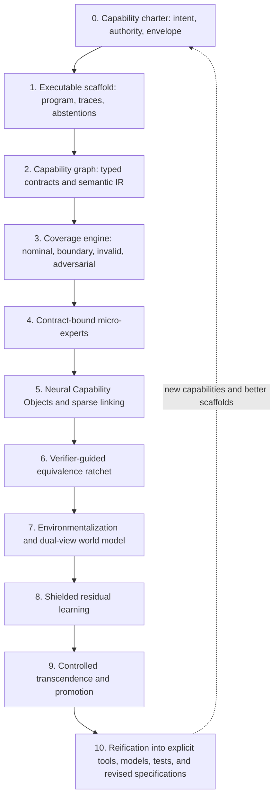
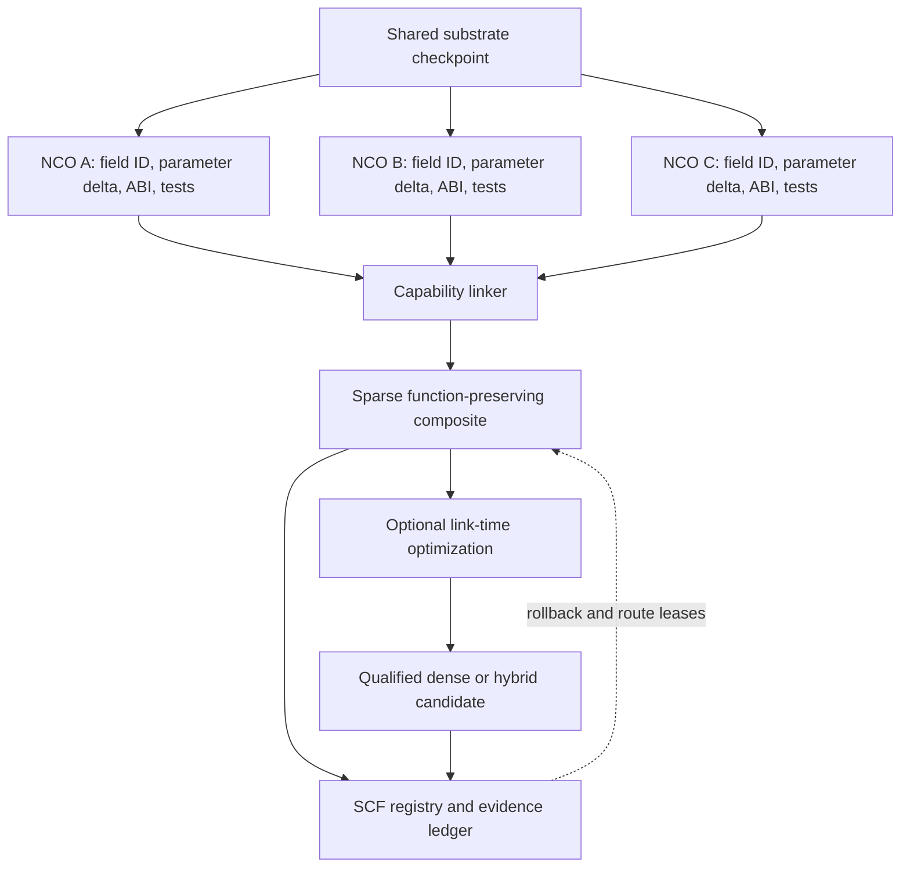
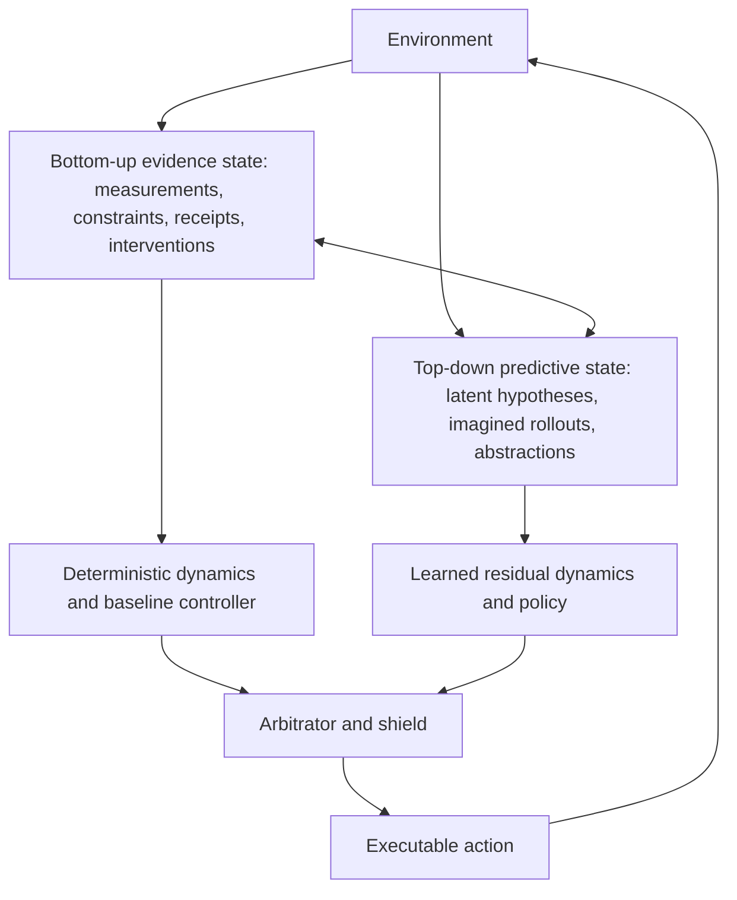
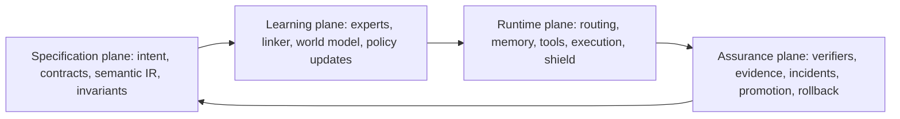
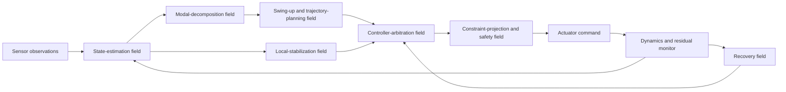

[← Corben Papers and Architecture Sources](index.qmd)

::: {.callout-important title="Original paper, not rewritten book prose"}
This page publishes Corben Sorenson's original source manuscript so readers can inspect the ideas that preceded or informed the living book. The text may contain historical terminology, claims, confidence, citations, or implementation status that the book later narrows, revises, tests, or rejects. Publication here establishes provenance and access—not correctness, novelty, replication, or support-state promotion.
:::

## Publication and provenance

| Field | Record |
|---|---|
| Source ID | `deterministic_capability_compilation` |
| Source class | `author_whitepaper` |
| Library class | `research_paper` |
| Manuscript date | 2026-07 |
| Inventory updated | 2026-07 |
| Exact published-source SHA-256 | `8306d2bd40662245f8d3f044b4ca11a61c0fb18ab7cb799ccfe64f5e8c8a80c1` |
| Exact published-source bytes | 98,419 |
| Exact source text | [Download/view the tracked Markdown source](source/deterministic_capability_compilation.md) |
| Book's source note | [Read the bounded mining note](https://github.com/corbensorenson/asi-stack-book/blob/main/sources/source_notes/deterministic_capability_compilation.md) |
| Authorship and collaborator credits | Preserved from the exact original manuscript; this library wrapper does not replace or simplify them. |
| Rights | No new license grant. Corben Sorenson's rights are reserved; collaborator, quotation, source-title, and third-party rights remain with their holders. |

**Current publication boundary.** Archived author paper; its claims retain the status and limits stated in the paper and do not inherit the living book's current evidence state.

**HTML presentation note.** The HTML page normalizes line endings and trailing whitespace, preserves explicit Markdown hard breaks, and demotes manuscript headings beneath the page title. The manuscript YAML front matter is represented by the provenance panel rather than repeated in the body. The digest above applies to the linked exact source text, not to this presentation wrapper.

## Where this paper enters the living book

[Stable Capability Fields](../chapters/stable-capability-fields.html), [Capability Replacement and Rollback](../chapters/capability-replacement-and-rollback.html), [Adversarial Machine Learning and the Model Attack Surface](../chapters/adversarial-machine-learning-and-model-attack-surface.html), [AI Supply-Chain Integrity and Lifecycle Provenance](../chapters/ai-supply-chain-integrity-and-lifecycle-provenance.html), [Recursive Self-Improvement Boundaries](../chapters/recursive-self-improvement-boundaries.html), [Autonomous Replication, Proliferation, and Containment](../chapters/autonomous-replication-proliferation-and-containment.html), [Command Contracts: From Intent to Executable Work](../chapters/intent-to-execution-contracts.html), [Governed World Models and Reality Grounding](../chapters/governed-world-models-and-reality-grounding.html), [Cognitive Compilation and Semantic IR](../chapters/cognitive-compilation-and-semantic-ir.html), [The Virtual Context ABI: Typed Pages, Cells, and Certificates](../chapters/virtual-context-abi.html), [Proof-Carrying Claims and Adversarial Review](../chapters/spinoza-verification-and-proof-carrying-claims.html), [Labor OS and Typed Jobs](../chapters/labor-os-and-typed-jobs.html), [Artifact Graphs, Audit Logs, and Replay](../chapters/artifact-graphs-audit-logs-and-replay.html), [Runtime Adapters, Tool Permissions, and Human Approval](../chapters/runtime-adapters-tool-permissions-and-human-approval.html), [Procedural Memory and Cognitive Loop Closure](../chapters/procedural-memory-and-cognitive-loop-closure.html), [Routing Heads and Specialist Cores](../chapters/routing-heads-and-specialist-cores.html), [Replaceable Cognitive Substrates: Beyond Transformer Monoculture](../chapters/replaceable-cognitive-substrates-beyond-transformer-monoculture.html), [Readiness Gates, Residual Escrow, and Quarantine](../chapters/readiness-gates-residual-escrow-and-quarantine.html), [Compact Generative Systems: Generate, Verify, Repair, and Residual Honesty](../chapters/compact-generative-systems-and-residual-honesty.html), [Benchmark Ratchets and Anti-Goodhart Evidence](../chapters/benchmark-ratchets-and-anti-goodhart-evidence.html), [White-Box Evidence, Interpretability, and Activation Governance](../chapters/white-box-evidence-interpretability-and-activation-governance.html), [Content Authenticity, Watermarking, and Synthetic Media Integrity](../chapters/content-authenticity-watermarking-and-synthetic-media-integrity.html), [Governed Operations, Incident Command, and Graceful Degradation](../chapters/governed-operations-incident-command-and-graceful-degradation.html), [Data Engines, Continual Learning, and Unlearning](../chapters/data-engines-continual-learning-and-unlearning.html), [Integrated Reference Architecture](../chapters/integrated-reference-architecture.html), [Project Theseus as Report-First Implementation Reference](../chapters/project-theseus-as-report-first-implementation-reference.html), [Prototype Roadmap](../chapters/prototype-roadmap.html), [Open Research Agenda and Bibliography Plan](../chapters/open-research-agenda-and-bibliography-plan.html)

<hr>

## Original manuscript

## Abstract

Modern machine-learning systems are usually asked to discover two things at once: the structure of a task and a policy that performs it. This is powerful when the task is poorly understood, but wasteful and difficult to govern when substantial human knowledge can already be expressed as software, constraints, workflows, controllers, proofs, schemas, or tests. This paper develops **Deterministic Capability Compilation (DCC)**: a staged method for converting an executable approximation of a capability into an adaptive learned implementation without treating the original program as disposable training scaffolding.

The method begins by defining a consumer-relative capability envelope and constructing the strongest practical deterministic scaffold inside that envelope. The scaffold is decomposed into typed capability contracts and used to generate coverage-directed traces, including boundary, invalid, adversarial, recovery, and compositional cases. Contract-bound micro-experts are then trained inside a shared neural substrate. Instead of relying on post hoc parameter averaging, the experts are packaged as **Neural Capability Objects** with a common **Neural Application Binary Interface**, allowing a capability linker to assemble a sparse composite with bounded or exact functional inheritance. Verifier-guided imitation, learner-induced state collection, and counterexample-guided repair establish behavioral equivalence before the system is exposed to closed-loop environmental learning.

Environmental adaptation begins as a shielded residual over the compiled baseline. A dual-view world model combines top-down latent prediction with bottom-up evidence, exact constraints, and causal interventions. Deviations from the scaffold are not automatically classified as errors or improvements; they are adjudicated as student defects, specification defects, environmental novelty, valid optimizations, reward exploitation, or unresolved residuals. Valid discoveries can be promoted under stable capability contracts and compiled back into explicit procedures, tests, models, or revised specifications. The result is a bidirectional ratchet between explicit and learned knowledge.

The logical endpoint is not one dense model that erases its teachers. It is an **Executable Capability Foundry**: a governed system that can repeatedly compile explicit knowledge into learned competence, refine that competence through environmental evidence, preserve authority and rollback boundaries, and reify stable discoveries into reusable machinery. The paper provides formal definitions, architecture, algorithms, design propositions, failure analysis, and an empirical program spanning software agents, multi-link control, and robotics. It is a systems proposal and research agenda, not an empirical claim that the full lifecycle has yet been validated.

**Keywords:** neuro-symbolic learning; program-to-policy compilation; knowledge distillation; model merging; modular neural networks; residual reinforcement learning; verification; safe reinforcement learning; world models; continual learning; governed self-improvement

## 1. Introduction

A great deal of machine learning begins from an unnecessarily blank slate. A model is given examples, rewards, or interaction and is expected to infer both the latent decomposition of the problem and the behavior that solves it. That choice is reasonable when little is known about the domain. It is less reasonable when engineers already know how to perform most of the task with conventional software, formal constraints, physical models, planners, control laws, checkers, or carefully specified workflows.

Consider a task for which a conventional system can perform most ordinary cases but remains brittle in the tail. The standard engineering options are unsatisfying:

1. keep the deterministic system and accept its brittleness;
2. replace it with an opaque end-to-end model and sacrifice much of its auditability;
3. place a model beside it and accumulate an increasingly fragile hybrid;
4. train a policy from scratch in an environment, spending interaction on rediscovering structure already known.

The alternative developed here is to treat learning as a form of **capability compilation**. An executable system is a high-level representation of behavior. It can be lowered into datasets, traces, neural modules, linked policies, and eventually adaptive closed-loop agents. Each lowering should preserve a declared capability contract, expose its losses, and remain verifiable against the source representation. This is closer to a compiler pipeline than to ordinary end-to-end training.

The central intuition can be stated simply:

> **Program first, learn second, transcend third, preserve always.**

The deterministic implementation need not solve the whole task. It must solve enough of the task, with enough internal structure and explicit failure semantics, to provide a reliable initial curriculum. Neural experts learn the component contracts. A linked model learns their composition. An environment then teaches the residual behavior that could not be programmed. Yet the program does not vanish. It remains a reference implementation, verifier, fallback, safety shield, counterexample generator, and historical statement of what the system was originally meant to do.

This framing immediately changes several assumptions.

First, “90% deterministic coverage” is not a single meaningful number. A program can cover 99% of common inputs while failing on the rare states that dominate risk. Coverage must be represented as a vector across inputs, states, trajectories, invariants, environments, recovery, and uncertainty recognition.

Second, a deterministic output is not automatically ground truth. It is correct relative to a specification that may be incomplete or mistaken. The environment can reveal specification defects, but the environment is not a moral or governance oracle. It can supply facts and consequences; it cannot grant authority or redefine protected objectives.

Third, expert weights should not be merged only after independent training. If direct weight transplantation is a goal, experts and the destination architecture must be co-designed. They should share an initialization, representation conventions, reserved parameter regions, interface semantics, and a relocation format. This paper calls the resulting packages **Neural Capability Objects** (NCOs), by analogy with relocatable object files.

Fourth, a dense model is not necessarily the correct endpoint. Sparse composition may preserve modularity, rollback, auditability, and continual replacement better than full densification. Densification should be treated as an optional link-time optimization that must prove its value and preserve the capability floor.

Finally, the process should be bidirectional. Explicit programs bootstrap learned behavior, but stable learned discoveries should be translated back into explicit artifacts when possible. This closes the loop from program to policy and from policy back to program.

### 1.1 Core thesis

This paper argues that a substantial class of machine-learning systems should be developed through a **Deterministic Capability Compilation Ladder**:

1. define a bounded capability contract;
2. build an executable approximation;
3. decompose it into semantically closed capability units;
4. generate coverage-directed supervision and counterexamples;
5. train contract-bound experts in a shared substrate;
6. link those experts into a sparse function-preserving composite;
7. qualify the composite against the executable source;
8. deploy it into a closed-loop environment;
9. learn bounded residual behavior under verification and shielding;
10. adjudicate departures from the source specification;
11. promote valid improvements without widening authority;
12. compile stable discoveries back into explicit capabilities.

The mature product is an **Executable Capability Foundry** rather than a one-time training recipe.

### 1.2 Contributions

The main contribution is the integration of existing families of ideas into one capability-preserving lifecycle. The proposal does not claim to invent distillation, modular networks, model merging, residual reinforcement learning, shielding, world models, or counterexample-guided synthesis. Its intended contributions are:

- a formal distinction between an executable scaffold, a capability contract, a neural implementation, and an environmental improvement;
- a vector-valued capability envelope that replaces vague percentage coverage;
- a typed decomposition criterion based on semantic replaceability rather than arbitrary atomicity;
- Neural Capability Objects and a Neural ABI for planned weight transplantation and linking;
- sparse assembly before optional dense consolidation;
- translation validation for neural compilation passes;
- a dual-view world model joining top-down prediction and bottom-up evidential correction;
- a governed disagreement taxonomy for deciding when a model is wrong, when a specification is wrong, and when the evidence is insufficient;
- a bidirectional explicit-to-learned-to-explicit improvement ratchet;
- integration of learning, routing, memory, verification, authority, evidence, rollback, and recursive improvement into one foundry architecture.

### 1.3 Claim boundary

DCC is a conceptual systems architecture and experimental program. It is not evidence that the full pipeline has been implemented, that arbitrary programs can be faithfully converted into neural networks, that a verifier is necessarily correct, that reinforcement learning will repair a poor specification, or that the resulting system is aligned or safe. Several subclaims have strong precedent in prior work, but their joint operation, scaling behavior, and governance properties require empirical validation.

## 2. Why the Naive Ladder Is Incomplete

The initial ladder—deterministic system, atomic experts, one dense model, then reinforcement learning—has the right direction but hides the hardest problems.

### 2.1 “Deterministic” does not mean “true”

A program is deterministic if its output is fixed by its declared inputs and state. That property supports reproducibility, but it says nothing about whether the program models the right world, encodes the right objective, or covers the states that matter. A deterministic controller can be consistently wrong. A deterministic business rule can preserve a historical injustice. A deterministic verifier can validate the wrong proxy.

The scaffold must therefore carry an **applicability envelope** and explicit unknowns. Where nondeterminism is unavoidable, it should be seeded, bounded, logged, and represented as part of the contract rather than hidden.

### 2.2 “Atomic” is not the same as “independent”

Breaking a program into the smallest syntactic functions can destroy the context needed to learn useful semantics. The correct unit is the smallest **semantically closed replaceable capability**: a component whose preconditions, postconditions, state effects, authority, failure behavior, and dependencies can be specified well enough that another implementation could replace it.

Some units will be small classifiers or transformations. Others will be temporal options, state estimators, planning passes, recovery procedures, or tightly coupled subgraphs. The decomposition should be hierarchical, and integration capabilities should be first-class rather than assumed to emerge for free.

### 2.3 Unlimited synthetic data is not unlimited information

A program can generate unlimited samples from its own assumptions, but those samples may repeatedly cover the same manifold. They do not reveal omitted variables, incorrect abstractions, or real-world states outside the program’s generator. Synthetic data must be produced by a **coverage engine** that actively targets branch boundaries, invalid inputs, counterfactual pairs, adversarial perturbations, state interactions, and recovery paths.

The goal is not dataset size. It is to make the program’s decision surface and uncertainty surface learnable.

### 2.4 Distillation can reproduce outputs while losing capability semantics

A student may match final outputs yet fail to preserve abstention, calibration, latency, resource use, side effects, failure messages, or behavior under composition. In sequential settings, small imitation errors change the future state distribution and can compound. DAgger and related interactive imitation methods show why learners must be trained on states induced by their own policies rather than only teacher trajectories [1].

DCC therefore distills contracts and traces, not only labels.

### 2.5 Model merging is not a reliable substitute for planned linking

Weight averaging can work when models share a basin and compatible representations [11], but independently fine-tuned models often interfere. TIES-Merging, TALL masks, Localize-and-Stitch, and later conflict-aware methods exist precisely because useful task information can be sparse, sign-conflicted, or localized [12-14]. A 2025 analysis showed that data-agnostic merging can have arbitrarily poor worst-case performance and proposed progressive layer-wise distillation as a remedy [15].

These findings support a stronger conclusion: direct expert inheritance should be designed **before training**, not improvised afterward.

### 2.6 Reinforcement learning does not “find the remaining 10%” automatically

RL optimizes the reward it receives under the states it visits. It may discover real edge cases, but it may also exploit verifier gaps, suppress expensive safety behavior, forget scaffolded capabilities, or improve one environment while narrowing generality. DeepSeek-R1 provides evidence that reliable verifiers and RL can elicit new reasoning behavior, but it also reinforces that reward design defines the optimization direction and that learned reward models can be vulnerable to hacking [24].

RL should begin as a bounded residual over a qualified baseline, not as unrestricted permission to rewrite the policy.

### 2.7 The teacher should not be discarded after graduation

If the program is removed after distillation, the system loses its strongest source of regression tests, structured counterexamples, fallback behavior, and historical intent. The more capable the learned system becomes, the more valuable the old scaffold may be as an independent comparison surface.

DCC therefore treats the executable source as a durable artifact with a lifecycle, not temporary training code.

## 3. Related Work and the Remaining Gap

DCC intersects several research traditions. The gap is not the absence of each component; it is the absence of a single lifecycle that preserves capability identity, interfaces, authority, evidence, and rollback while moving between representations.

### 3.1 Imitation and policy distillation

Policy distillation demonstrated that one or multiple task policies can supervise a smaller or multitask student [2]. DAgger addressed compounding distribution shift by collecting labels under the learner’s induced state distribution [1]. DCC adopts both pressures but extends the object of imitation from an action policy to a typed capability that includes applicability, traces, failures, recovery, authority, and evidence.

### 3.2 Function-preserving network growth and continual transfer

Net2Net showed that a network can be widened or deepened through function-preserving transformations [3]. Progressive Neural Networks preserve prior columns while adding new capacity and lateral transfer, avoiding catastrophic forgetting [4]. These works suggest that neural structures need not be rebuilt from scratch and motivate the exact-graft stage of DCC.

### 3.3 Modular networks, mixture of experts, and stitching

Mixture-of-experts systems route inputs through sparse sub-networks; model stitching connects representations through learned adapters. These methods demonstrate the feasibility of conditional computation and cross-model composition. DCC adds a semantic and governance layer: each expert is bound to a stable contract, and routing is an authority-bearing lease rather than only a compute decision.

### 3.4 Model merging and task arithmetic

Model soups, task vectors, TIES-Merging, localized masks, and sparse stitching show that specialized checkpoints can sometimes be combined efficiently [11-14]. They also expose conflict, erasure, and representation-alignment problems. DCC treats these methods as optional linker and link-time-optimization techniques, not as the foundational guarantee. The reliable baseline is sparse composition with addressable experts; densification must earn promotion through data and translation validation.

### 3.5 Residual reinforcement learning and hybrid control

Residual Reinforcement Learning and Residual Policy Learning combine a conventional controller with a learned correction, improving sample efficiency in tasks with contacts, model misspecification, noise, or sparse rewards [5,6]. DCC generalizes the residual idea beyond continuous control: a residual may adjust an action, revise a plan, select a tool, alter a context policy, or propose a new procedure, subject to contract and authority limits.

### 3.6 Shielding and formal constraints

Safe RL via shielding constrains or corrects actions that would violate temporal specifications [7]. DCC retains shielding throughout environmental learning and deployment. The shield is not assumed infallible; it has its own version, scope, evaluator lineage, and residuals.

### 3.7 Counterexample-guided synthesis and translation validation

Counterexample-guided neural synthesis uses formal reasoning to generate examples and reject incorrect neural proposals [8]. Translation validation checks the output of a compiler transformation against the source rather than proving the compiler globally correct [9]. DCC combines these ideas: each neural lowering pass emits a candidate plus a receipt, and the actual candidate is checked against the source contract.

### 3.8 Compiler intermediate representations

MLIR demonstrates how multiple abstraction levels, dialects, verifiers, and lowering passes can make heterogeneous compilation systems extensible [10]. DCC applies the same architectural lesson to cognitive capabilities: no single representation is ideal from human intent through executable code, neural parameters, environment policy, and learned procedural memory.

### 3.9 Program and tool learning

DreamCoder learns reusable program abstractions and neural search guidance [16]. Toolformer learns when and how to call external APIs [17]. Voyager accumulates a library of executable skills from environmental feedback and self-verification [18]. These systems support the idea that acquired behavior can be externalized into reusable artifacts. DCC adds explicit promotion, field identity, failure retention, and rollback.

### 3.10 World models and embodied adaptation

PlaNet learns latent dynamics for planning from pixels [19]. DayDreamer showed online world-model learning on physical robots [20]. Continual world-model work has explored replay and forgetting across tasks [21]. DCC uses world models after compilation, but splits them into a top-down predictive view and a bottom-up evidential view so that hypotheses remain corrigible by exact observations, constraints, and interventions.

### 3.11 Automated agent design and self-improvement

Automated Design of Agentic Systems and the Darwin Godel Machine search over code-defined agents and archive improvements [22,23]. DCC is compatible with such search but imposes a stricter separation between proposal and promotion. A candidate may generate descendants and evidence; it may not be the sole authority that defines or changes the gate by which its descendants are admitted.

### 3.12 The missing system

The literature contains many arrows in the desired cycle:

- program to examples;
- teacher to student;
- expert to merged model;
- controller to residual policy;
- specification to shield;
- environment to skill library;
- archive to improved agent.

What remains underdeveloped is the full closed loop:

> **explicit specification -> executable scaffold -> typed experts -> function-preserving neural link -> verified policy -> bounded environmental learning -> adjudicated discovery -> explicit reusable capability**

The rest of this paper specifies that loop.

## 4. Formal Problem Statement

### 4.1 Environment

Let the operational environment be a partially observable controlled process

$$
\mathcal{M} = (\mathcal{S}, \mathcal{A}, T, R, \mathcal{O}, \Omega, \gamma),
$$

where $\mathcal{S}$ is the latent state space, $\mathcal{A}$ the action space, $T$ the transition process, $R$ an empirical objective or reward signal, $\mathcal{O}$ the observation space, $\Omega$ the observation process, and $\gamma$ a horizon or discount parameter.

The empirical reward $R$ is not identical to legitimate intent. Let $J$ denote the declared outcome objective and let $\mathcal{I}$ denote protected invariants, rights, authority ceilings, and hard constraints. The system may optimize evidence about $J$ only within $\mathcal{I}$.

### 4.2 Capability field

A capability is defined independently of its implementation. For consumer $c$, use $u$, environment $e$, threat model $h$, and evidence epoch $t$, define a capability field:

$$
F = (\Sigma^{in}, \Sigma^{out}, Pre, Post, Inv, Fail, Auth, Cost, Recover, Observe).
$$

The field specifies:

- accepted and rejected inputs;
- outputs and state transitions;
- preconditions and postconditions;
- invariants;
- abstention and failure semantics;
- authority and side-effect ceilings;
- latency and resource budgets;
- recovery duties;
- required evidence and observability.

The same capability name may have multiple versions. A candidate implementation is qualified only relative to a particular field version and deployment lease.

### 4.3 Capability envelope

The deterministic scaffold has a vector-valued capability envelope:

$$
E(P) = (C_x, C_s, C_\tau, C_i, C_e, C_r, C_u),
$$

where:

- $C_x$: input coverage;
- $C_s$: state coverage;
- $C_\tau$: trajectory and horizon coverage;
- $C_i$: invariant and hazard coverage;
- $C_e$: environment and distribution coverage;
- $C_r$: recovery coverage;
- $C_u$: uncertainty and non-applicability recognition.

Each component is itself a measured set or distribution, not necessarily a scalar. A program may be excellent on $C_x$ and poor on $C_i$. Promotion decisions must preserve this distinction.

### 4.4 Executable scaffold

The scaffold is a partial executable process:

$$
P_0(x, s, \ell) \rightarrow (y, s', \tau, q, z),
$$

where $x$ is input, $s$ state, $\ell$ an authority and resource lease, $y$ an output or action, $s'$ the next declared state, $\tau$ an execution trace, $q$ an evidence packet, and $z$ an applicability status such as `success`, `abstain`, `invalid`, `unsafe`, `unknown`, or `escalate`.

The scaffold may contain deterministic solvers, planners, physical models, rules, tests, static analyses, search, or seeded simulation. Its determinism is scoped to declared inputs and versions.

### 4.5 Decomposition into capability contracts

The scaffold is lowered to a hierarchical capability graph

$$
G_C = (V_C, E_C),
$$

where each vertex $v_i$ owns a contract $F_i$ and each edge specifies a typed state, data, evidence, or authority transfer. The decomposition is valid only if every relevant source obligation is assigned to at least one vertex or retained as a graph-level invariant.

The graph may include:

- primitive transformations;
- state estimators;
- planners and search operators;
- validators;
- recovery procedures;
- routers;
- temporal options;
- composition and arbitration capabilities.

### 4.6 Learned implementations

A micro-expert $E_i$ is a learned candidate for $F_i$. A linked system $M_\theta$ is a candidate for the composed field $F_G$. Equivalence is consumer-relative:

$$
M_\theta \preceq_{c,u,e,h,t} P_0
$$

means that the learned candidate behaviorally refines the scaffold for the declared observables and obligations in the stated scope. It does not imply equality of internal computation or global safety.

### 4.7 Environmental residual

After equivalence, a learned environmental residual $\delta_\phi$ augments the baseline policy:

$$
a_t^{prop} = \mathcal{C}(a_t^{base}, \delta_\phi(o_{\le t}, m_t)),
$$

where $\mathcal{C}$ is a typed composition operator and $m_t$ is the current world-model state. A shield $S$ produces the executable action:

$$
a_t^{exec} = S(s_t, a_t^{prop}, \ell_t, \mathcal{I}).
$$

The residual may improve performance but cannot independently widen $\ell_t$ or redefine $\mathcal{I}$.

## 5. The Deterministic Capability Compilation Ladder



*Figure 1. The ladder is cyclic. The system does not merely replace an explicit implementation with a learned one; it uses environmental discoveries to improve the explicit capability substrate for future compilations.*

### 5.1 Stage 0: Capability charter

The process begins before code or training. The charter freezes:

- the consumer and intended use;
- objectives and non-goals;
- accepted inputs and outputs;
- state and time horizons;
- authority and side-effect limits;
- protected invariants and affected parties;
- expected environmental conditions;
- resource budgets;
- escalation and fallback rules;
- evaluation criteria;
- claim and evidence boundaries.

This prevents a later training objective from silently becoming the definition of the task. The charter should identify which parts are normative, empirical, conventional, provisional, and unknown.

A critical artifact is the **scaffoldability assessment**. It estimates which portions of the capability can be expressed exactly, approximately, through search, through simulation, through human demonstration, or only through environmental learning. This creates a scaffoldability frontier rather than forcing deterministic programming into domains where it is inappropriate.

### 5.2 Stage 1: Executable scaffold

The scaffold should be the strongest practical explicit implementation, not a toy teacher intentionally kept weak. It may combine:

- deterministic algorithms;
- formal rules and constraints;
- optimization solvers;
- model-predictive control;
- planners and search;
- scripts and workflows;
- static and dynamic analyzers;
- curated human policies;
- simulation and seeded stochastic models.

Every execution should produce a rich trace. The trace should name branches, intermediate values, calls, assumptions, constraints, rejected alternatives, resource use, evidence, failures, and recovery decisions. This trace is the raw material for decomposition, supervision, and later explanation.

The scaffold should also expose its **epistemic status**. It must say when it does not apply. A brittle program that confidently emits a result outside its modeled domain is a poor teacher.

### 5.3 Stage 2: Semantic capability graph

The scaffold is lowered into a semantic intermediate representation. Each node is assigned a stable capability identity and a contract. The lowering must preserve a **semantic mass balance**:

1. obligations preserved unchanged;
2. obligations intentionally narrowed or relaxed;
3. obligations strengthened or newly introduced;
4. residual obligations not yet represented;
5. dependencies and authority transfers introduced by the decomposition.

No source requirement may disappear merely because it was inconvenient to assign to a node.

The graph should include integration nodes. For example, a control system may decompose into state estimation, mode analysis, baseline control, constraint projection, hazard detection, recovery, and arbitration. The arbitration is not an implementation detail; it is a capability with its own failure modes.

### 5.4 Stage 3: Coverage-directed corpus

For each contract $F_i$, the foundry generates a corpus:

$$
D_i = D_i^{nom} \cup D_i^{boundary} \cup D_i^{invalid} \cup D_i^{adv} \cup D_i^{comp} \cup D_i^{recovery} \cup D_i^{counterfactual}.
$$

The categories serve different purposes:

- **Nominal:** ordinary valid cases.
- **Boundary:** values near branch, safety, numerical, and resource limits.
- **Invalid:** cases where abstention, rejection, or escalation is correct.
- **Adversarial:** perturbations designed to expose brittle shortcuts.
- **Compositional:** novel combinations of known sub-capabilities.
- **Recovery:** mid-failure states and rollback paths.
- **Counterfactual:** minimally different cases that reveal causal decision variables.

Generation should combine fuzzing, property-based testing, symbolic execution, mutation testing, constraint solving, adversarial search, and targeted human review. Synthetic examples should carry provenance to the exact scaffold version and branch path that generated them.

A **coverage ledger** records what was generated, what remains unreachable, and which regions are assumed rather than observed. Unlimited sample counts cannot erase an uncovered region.

### 5.5 Stage 4: Contract-bound micro-experts

Each expert is trained to satisfy a contract rather than maximize one aggregate score. A general objective is:

$$
\mathcal{L}_i =
\lambda_y \mathcal{L}_{output} +
\lambda_\tau \mathcal{L}_{trace} +
\lambda_z \mathcal{L}_{applicability} +
\lambda_I \mathcal{L}_{invariant} +
\lambda_c \mathcal{L}_{calibration} +
\lambda_r \mathcal{L}_{recovery} +
\lambda_p \mathcal{L}_{preservation}.
$$

The expert should learn:

- the output or action;
- relevant intermediate state;
- whether the contract applies;
- when to abstain or escalate;
- uncertainty calibrated to failure probability;
- invariant-sensitive representations;
- recovery behavior;
- evidence emissions required by downstream consumers.

Experts are tested independently and in pairwise or graph-local compositions. A component that passes isolated tests but cannot communicate through the declared interface is not qualified.

### 5.6 Stage 5: Neural Capability Objects and sparse linking

The experts are assembled as relocatable Neural Capability Objects. The first linked system should be sparse and conservative. The goal is not immediate compression; it is capability preservation.

At link time, the foundry:

1. verifies base-checkpoint compatibility;
2. resolves parameter regions and relocation entries;
3. inserts representation adapters where required;
4. binds the router to capability identities;
5. attaches field tests, regressions, and authority metadata;
6. checks parameter and activation conflicts;
7. instantiates the sparse composite;
8. runs translation validation against every source expert and the full scaffold.

If experts were trained in disjoint reserved slots and the linker preserves routing semantics, assembly can be function-preserving at initialization. Where this assumption does not hold, the linker emits a bounded-difference claim rather than an exact one.

### 5.7 Stage 6: Verifier-guided equivalence ratchet

The linked model is trained against the integrated scaffold and then tested on states induced by its own actions. The loop is:

1. run the learned candidate;
2. capture its states, routes, and outputs;
3. ask the scaffold and independent verifiers what obligations apply;
4. search for disagreements and invariant violations;
5. classify and add counterexamples;
6. repair the narrowest responsible module or linker surface;
7. rerun atomic and compositional regressions;
8. repeat until promotion criteria are met or the candidate is blocked.

The foundry should distinguish **equivalence**, **adequacy**, and **advantage**:

- equivalence: the candidate preserves the scaffold’s qualified behavior;
- adequacy: the combined system is good enough for a declared deployment;
- advantage: the learned representation improves cost, latency, generalization, or composition enough to justify replacement.

A candidate can be equivalent but not advantageous. It can be advantageous on average but not equivalent on protected tails. These are different decisions.

### 5.8 Stage 7: Environmentalization

Passing offline equivalence does not establish closed-loop competence. The learned system must be placed in an environment where its outputs change future inputs. Environmentalization adds:

- state transition and delayed consequence;
- partial observability;
- noise and model mismatch;
- other agents and changing conditions;
- actuator, tool, or communication failure;
- long-horizon objectives;
- opportunities for recovery;
- irreversibility and external effects.

The compiled model becomes the initial policy, not a static benchmark answerer. Simulation, digital twins, emulators, sandboxes, hardware-in-the-loop systems, and carefully staged real deployment provide progressively stronger evidence.

### 5.9 Stage 8: Shielded residual learning

Environmental learning begins with the smallest update surface likely to explain the residual error. Possible residuals include:

- an action correction;
- a dynamics correction;
- a state-estimation correction;
- a routing correction;
- a verification-budget adjustment;
- a recovery choice;
- a new plan option;
- a proposed tool or procedure.

The base policy remains active. The residual receives a strict drift, authority, and resource lease. Shield interventions and baseline overrides are logged as high-value learning events rather than hidden from the trainer.

Only when residual learning repeatedly demonstrates that the base structure is the bottleneck should broader policy or architecture updates be considered.

### 5.10 Stage 9: Controlled transcendence

Once the model can outperform the scaffold, disagreement becomes ambiguous. Let

$$
\Delta(x) = M(x) - P_0(x)
$$

stand for a behavioral divergence in the relevant output or trajectory space. The divergence is classified as one of:

- **student defect:** the learned candidate violated the source contract;
- **specification defect:** the scaffold or contract was wrong or incomplete;
- **environmental novelty:** the state lies outside prior coverage;
- **valid optimization:** the model found a better behavior within intent and invariants;
- **reward or verifier exploitation:** the behavior improved the proxy while harming the target;
- **unresolved:** available evidence cannot decide.

A valid optimization is not automatically promoted. It must survive causal tests, perturbations, hidden holdouts, transfer, regression replay, and authority review. The promotion record identifies which field version changes and whether the old behavior remains available as fallback.

### 5.11 Stage 10: Reification and cognitive loop closure

Stable discoveries should be made explicit whenever possible. The system attempts to convert a repeatedly useful learned residual into one or more of:

- a revised physical or causal model;
- a deterministic correction rule;
- a new planner operator;
- a parameterized procedure;
- a generated tool;
- an expanded test or invariant;
- a new semantic-IR dialect or compiler pass;
- a refined router policy;
- an updated capability contract;
- a compact expert or adapter.

This is not mere explanation after the fact. Reification reduces future learning cost, improves portability, and gives later systems a stronger scaffold. If the behavior cannot be faithfully externalized, it remains a learned residual with explicit uncertainty rather than being falsely described as understood.

### 5.12 Stage 11: Recursive foundry

The complete foundry can propose improvements to its own components: decompositions, generators, experts, linker strategies, world models, verifiers, and reification passes. However, self-generated proposals remain subject to separately owned promotion gates. The foundry may produce evidence about itself; it may not be the sole authority that changes its protected invariants, evaluation policy, or deployment permissions.

This creates recursive improvement as accountable maintenance rather than unrestricted self-rewrite.

## 6. Neural Capability Objects and the Neural ABI



*Figure 2. Experts are trained and packaged for composition. Densification is optional; the sparse linked model is the preservation baseline.*

### 6.1 Why ordinary checkpoint merging is insufficient

When two independently trained models use different internal coordinate systems, neurons and features have no guaranteed one-to-one correspondence. Even models with identical architecture can occupy different basins or assign different meanings to the same parameter positions. Averaging can destroy both skills.

A Neural ABI does not solve representation learning in general. It narrows the problem by co-designing compatible experts.

### 6.2 Shared substrate

All experts should normally inherit from the same base checkpoint:

$$
\theta_i = \theta_0 + \Delta_i.
$$

The foundry reserves parameter capacity or sparse masks for capabilities before specialization. Options include:

- adapter or LoRA slots;
- dedicated feed-forward experts;
- sparse neuron masks;
- reserved attention heads;
- modular recurrent cells;
- external memory or tool slots;
- explicit state channels;
- typed output heads.

The base checkpoint hash and architecture schema become part of the object identity.

### 6.3 Neural ABI

The Neural ABI defines conventions at four levels.

#### Tensor ABI

- tensor shapes and dtypes;
- layer and slot identities;
- normalization conventions;
- parameter ownership and overlap rules;
- relocation and masking semantics.

#### Activation ABI

- meaning and scale of shared hidden-state lanes;
- call, return, and exception tokens;
- state-passing conventions;
- uncertainty and abstention channels;
- provenance and evidence embeddings;
- reset and episode-boundary semantics.

#### Capability ABI

- field ID and version;
- input/output schema;
- preconditions and postconditions;
- failure and recovery codes;
- authority requests;
- latency and resource budget;
- expected verifier outputs.

#### Lifecycle ABI

- base and dependency hashes;
- qualification evidence;
- regression suite;
- incident history;
- compatibility range;
- rollback snapshot;
- deprecation and retirement rules.

### 6.4 Neural Capability Object format

An NCO can be represented as:

```yaml
nco_version: 1
field:
  id: state_estimation.angular_chain
  version: 2.1.0
base:
  architecture_id: shared_control_supernet_v3
  checkpoint_hash: sha256:...
parameters:
  representation: sparse_delta
  owned_slots: [ffn.8.expert.3, adapter.control.2]
  overlap_policy: deny
  relocation_entries: [...]
abi:
  input_schema: chain_observation_v4
  output_schema: belief_state_v3
  hidden_lanes: [kinematics, uncertainty, provenance]
  failure_codes: [out_of_domain, sensor_conflict, unsafe]
contract:
  authority_ceiling: observe_only
  invariants: [...]
  budgets: {...}
evidence:
  training_corpus_digest: sha256:...
  atomic_tests: [...]
  composition_tests: [...]
  calibration_report: ...
  known_residuals: [...]
recovery:
  rollback_artifact: ...
  fallback_implementation: deterministic_estimator_v2
```

The object format is not itself proof of correctness. It is the minimum packaging needed for repeatable linking and review.

### 6.5 In-situ expert training

To maximize transplantability, each micro-expert is trained in its eventual supernetwork location. Unrelated expert regions remain frozen or masked. Shared representation lanes can be trained with interface losses, while capability-specific parameters remain localized.

The expert should be evaluated both through its local head and through the destination call interface. This prevents a common failure in which a module works in isolation but not through the eventual router and state pathway.

### 6.6 Linker phases

The capability linker performs:

1. **identity resolution** - verify base, field, dependency, and ABI compatibility;
2. **relocation** - place deltas or modules into reserved slots;
3. **conflict analysis** - detect overlapping ownership, sign conflict, activation collision, and resource contention;
4. **adapter synthesis** - learn minimal representation adapters where exact compatibility is unavailable;
5. **router binding** - connect field calls to expert implementations;
6. **static validation** - check schemas, authority, and lifecycle metadata;
7. **dynamic validation** - replay tests and compare traces;
8. **receipt emission** - record exact inputs, transformations, losses, and residuals.

### 6.7 Progressive integration

Integration should proceed from the least destructive update:

1. freeze all experts and train only adapters and router;
2. unfreeze shared interface layers;
3. permit low-rank joint corrections;
4. permit selected shared-layer tuning;
5. attempt progressive layer-wise distillation;
6. attempt densification only if it improves a declared objective;
7. retain the sparse composite and NCOs as rollback sources.

This order transforms “copy and paste weights” from an informal hope into a planned architecture.

### 6.8 Link-time optimization

Neural link-time optimization may remove redundancy, share representations, fuse experts, prune routes, quantize weights, or distill the composite into a dense student. Every pass is a translation:

$$
M_k \xrightarrow{pass_k} M_{k+1}.
$$

The pass emits a declared loss budget and is validated against the source model on field tests, historical regressions, counterexamples, and environmental probes. A pass that improves average throughput but violates a protected tail is rejected or scoped to a narrower route.

## 7. Verification as Neural Translation Validation

### 7.1 Candidate-specific validation

Proving a general neural compiler correct is unrealistic. DCC instead validates each concrete translation. Given source $S$, candidate $C$, contract $F$, and evaluation scope $Q$, the validator attempts to establish:

$$
Validate(S, C, F, Q) \in \{pass, fail, unknown\}.
$$

`Unknown` is a first-class result. It does not become `pass` because deployment pressure is high.

### 7.2 Verification layers

Verification should be layered:

1. **schema validation** - shapes, types, lifecycle records;
2. **unit equivalence** - expert against source capability;
3. **interface validation** - state and evidence transfers;
4. **compositional validation** - graph behavior;
5. **property testing** - invariants and metamorphic relations;
6. **counterexample search** - falsification under constraints;
7. **learner-induced-state evaluation** - states visited by the candidate;
8. **environmental validation** - closed-loop outcomes;
9. **independent evaluation** - separate implementations or evaluators where feasible;
10. **natural monitoring** - delayed and real-use outcomes.

No one layer substitutes for the others.

### 7.3 Counterexample-guided repair

The foundry maintains a counterexample set $X^-$. Each counterexample includes:

- input and pre-state;
- candidate and source traces;
- violated obligation;
- minimal reproduction;
- severity and affected consumers;
- suspected responsible modules;
- repair history;
- status after every subsequent build.

Counterexamples become durable capability memory. They follow the field across implementation replacements.

### 7.4 Verification bandwidth

Verification is itself a scarce resource. The foundry routes verification effort based on risk, novelty, uncertainty, and consequence. Cheap deterministic checks run broadly. Expensive formal, adversarial, human, or real-world evaluations are escalated where expected information value is high.

A learned candidate may help propose tests, but test generation and test acceptance should be separated. Otherwise, the candidate can optimize the surface that defines its own adequacy.

### 7.5 Proof-carrying training receipts

Every training and compilation operation should emit a receipt containing:

- exact source and target identities;
- data and transformation provenance;
- optimizer, seeds, budgets, and stopping rules;
- parameter ownership changes;
- evaluation denominators;
- regressions and counterexamples;
- failed attempts and rejected checkpoints;
- authority deltas;
- rollback handles;
- claims supported and claims not supported.

The receipt is evidence about a process, not a proof that the result is good. Its purpose is to prevent an attractive checkpoint from becoming detached from how it was produced.

## 8. Environmental Learning and the Dual-View World Model



*Figure 3. Top-down models propose compressed hypotheses and plans. Bottom-up state preserves measured facts, exact constraints, provenance, and causal tests. The arbitrator combines a known baseline with a bounded learned residual.*

### 8.1 Why two views are necessary

A top-down world model is computationally efficient. It compresses observations into latent state, predicts likely futures, and supports planning in imagination. Its risk is self-consistency: once an abstraction is wrong, imagined rollouts can reinforce the same error.

A bottom-up world model begins with measurements, exact state variables, constraints, event logs, and causal interventions. It is closer to evidence but expensive and incomplete. It may struggle to generate hypotheses or generalize beyond observed cases.

DCC uses both:

- the **top-down view** proposes latent causes, plans, abstractions, and counterfactual futures;
- the **bottom-up view** tests those proposals against observations, constraints, receipts, and interventions.

The two views should disagree visibly. Forced premature fusion removes a valuable error signal.

### 8.2 Hybrid dynamics

Let known dynamics be $f_{det}$ and learned residual dynamics be $f_\psi$:

$$
\hat{s}_{t+1} = f_{det}(s_t, a_t) + G(s_t,a_t) f_\psi(h_t),
$$

where $G$ gates the residual to states and dimensions in which it is permitted to act. The residual predicts what the explicit model omits: friction, contact, latency, hidden agents, distribution shift, or unmodeled strategy.

The same structure applies to discrete systems. A deterministic workflow predicts the expected next state; a learned residual proposes exception handling, route changes, or new plan operators.

### 8.3 The environment as evidence, not authority

Environmental reward can refute empirical assumptions. It cannot independently revise values, rights, permissions, or protected constraints. A robot discovering that a prohibited shortcut is faster has learned an environmental fact, not earned permission to take it.

This distinction is encoded in the action arbitrator. Effective authority is:

$$
Auth_{eff} = Auth_{field} \cap Auth_{caller} \cap Auth_{route} \cap Auth_{environment}.
$$

Learning can improve behavior within this intersection. It cannot expand the intersection by gradient descent.

### 8.4 Curriculum from scaffold residuals

The best environmental curriculum is not random exploration from the compiled policy. It is targeted at the scaffold’s uncertainty and failure frontier:

- states where the scaffold abstains;
- states with high expert disagreement;
- states near invariant boundaries;
- transitions with high model residual;
- recoverable failures;
- rare combinations of known capabilities;
- states where the shield intervenes;
- states with delayed outcome uncertainty.

This concentrates interaction on information the explicit system could not provide.

### 8.5 Simulation, reality, and transfer

Evidence should progress through a ladder:

1. deterministic test harness;
2. stochastic simulator;
3. adversarial simulator;
4. learned world-model imagination;
5. digital twin or emulator;
6. hardware-in-the-loop or isolated sandbox;
7. canary deployment;
8. bounded natural operation.

Each transition introduces new residuals. Simulation success cannot be silently promoted to real-world competence.

## 9. Governed Residual Learning

### 9.1 Residual-first intervention ladder

When the compiled system underperforms, updates should proceed from least invasive to most invasive:

1. improve data coverage;
2. repair a verifier or test;
3. adjust a deterministic parameter;
4. retrain one expert;
5. train an interface adapter;
6. learn a local residual;
7. revise routing or planning;
8. revise the world model;
9. add or split a capability;
10. change shared architecture;
11. alter the capability contract;
12. alter constitutional or authority rules through a separate process.

This ladder prevents every failure from becoming an excuse for global retraining.

### 9.2 Governed policy update lease

Each learning run receives a lease that freezes:

- target policy surface;
- allowed parameter regions;
- objective and proxy boundary;
- data and feedback authority;
- update algorithm and budget;
- drift limit;
- authority ceiling;
- holdouts and regressions;
- reward-hacking probes;
- monitor window;
- rollback authority;
- promotion decision owner.

A checkpoint outside the lease is not a candidate regardless of score.

### 9.3 Residual escrow

Unsolved failures are stored rather than averaged away. Residual escrow contains:

- unhandled states;
- unverified improvements;
- recurring shield interventions;
- unresolved disagreements;
- stale specifications;
- missing recovery paths;
- evaluator conflicts;
- expensive tails;
- failed reification attempts.

The escrow determines future curriculum and prevents the system from presenting aggregate progress as complete closure.

### 9.4 Exploration modes

The runtime should distinguish:

- **exact mode:** deterministic implementation is authoritative;
- **compiled mode:** qualified learned implementation replaces or accelerates it;
- **shadow mode:** candidate predicts but cannot act;
- **residual mode:** candidate can make bounded corrections;
- **canary mode:** candidate acts for a narrow population or state region;
- **fallback mode:** deterministic or human route resumes control;
- **quarantine mode:** candidate is isolated after a material failure.

Routing among modes is evidence- and authority-dependent.

## 10. Controlled Transcendence and Specification Revision

### 10.1 The disagreement tribunal

When a learned policy and scaffold disagree, the foundry creates a case. The case contains:

- field and implementation versions;
- environment and state evidence;
- source and candidate trajectories;
- reward and target outcomes;
- invariant and authority checks;
- counterfactual and causal probes;
- transfer and perturbation results;
- evaluator dependencies;
- proposed classification;
- residual uncertainty;
- proposed action.

Possible actions are retain source, repair candidate, narrow route, revise scaffold, revise field version, accept a new optimization, quarantine, or defer.

### 10.2 Specification defects

A specification defect is not merely “the model scored higher.” It is a falsified or inadequate explicit assumption. The foundry should require evidence that:

1. the source behavior underperforms the legitimate objective;
2. the candidate’s advantage is causal rather than evaluator-specific;
3. protected invariants and authority remain intact;
4. the advantage persists under perturbation and transfer;
5. the old behavior remains available where the new evidence does not apply;
6. the revised specification states the new scope and residuals.

### 10.3 Novelty as a new field or field version

Some environmental discoveries do not fit the original capability. Rather than stretching the old name, the system may create a new field or a new major version. Stable identity is preserved by refusing to hide semantic change behind implementation replacement.

### 10.4 Learned behavior that cannot be explained

A useful learned residual may resist symbolic extraction. The system can still deploy it under a narrow lease if its behavior is adequately tested and monitored. It must not claim that the behavior has been reified or understood. The learned component remains an opaque implementation behind an explicit contract.

### 10.5 Bidirectional compilation

The long-term ratchet is:

$$
Explicit_t \rightarrow Learned_t \rightarrow Environment_t \rightarrow Discovery_t \rightarrow Explicit_{t+1}.
$$

Each cycle aims to increase:

- deterministic coverage;
- capability reuse;
- quality of decomposition;
- efficiency of future training;
- strength of tests and recovery;
- accuracy of the world model;
- precision of residual uncertainty.

The model becomes a fast, adaptive cache of capabilities. The durable source of system identity remains the field, artifacts, evidence, and history.

## 11. Governance Architecture



*Figure 4. The foundry has four planes. No plane is allowed to collapse into the learning objective.*

### 11.1 Four planes

#### Specification plane

Owns intent, capability fields, semantic IR, protected constraints, authority, versioning, and declared residuals.

#### Learning plane

Owns data generation, experts, linking, distillation, world models, residual policies, and reification proposals.

#### Runtime plane

Owns routing, context, tools, memory, action, environmental interaction, fallback, and shielding.

#### Assurance plane

Owns verifiers, tests, evidence, claim states, evaluator independence, incidents, readiness, promotion, monitoring, rollback, and retirement.

The learning plane may optimize candidates. It does not own the final meaning of success.

### 11.2 Three update clocks

DCC separates three timescales.

#### Fast clock: local adaptation

Episode-local state, temporary memory, online estimation, or bounded residual adjustment. It expires quickly and cannot widen authority.

#### Medium clock: capability compilation

Expert retraining, linker updates, policy changes, field implementation replacement, and procedural promotion. It requires qualification and rollback.

#### Slow clock: constitutional change

Changes to protected values, rights, authority, governance, or the evaluator constitution. These require a separate process and must not be reachable through ordinary optimization.

### 11.3 Stable capability fields

A stable capability field separates identity from implementation. The deterministic scaffold, micro-experts, sparse composite, dense student, and future replacement can all implement the same field if they preserve its scoped obligations. This makes capability evolution reversible and consumer-relative.

### 11.4 Routing as authority leasing

The runtime router selects not only a model but a capability implementation, context packet, tool set, budget, and authority subset. A route record should preserve why alternatives were rejected. User-defined direct commands can bypass expensive deliberation only if the command maps to a pre-authorized field and parameter schema; shortcut syntax does not bypass authority validation.

### 11.5 Context as a compilation packet

Long-horizon agents need a protected context packet containing:

- current field and task contract;
- authority and rights limits;
- source and candidate versions;
- active assumptions;
- relevant regressions and incidents;
- unresolved counterexamples;
- environment and world-model state;
- evidence epoch;
- rollback handles.

Context compression may summarize lower-priority history but must preserve this protected minimum set. The packet is the runtime equivalent of compiler state and link metadata.

### 11.6 Evidence and claim discipline

The foundry distinguishes:

- formal consequence;
- deterministic synthetic test;
- stochastic simulation result;
- controlled environmental result;
- natural deployment observation;
- independent reproduction;
- transfer evidence.

A schema pass, theorem about declared records, checkpoint score, or rollback dry run does not silently become a capability, safety, or deployment claim.

### 11.7 Effect-complete rollback

Restoring model weights is not enough. Rollback may require:

- model, optimizer, scheduler, and RNG state;
- adapters, routers, caches, and retrieval indexes;
- procedural memory and context state;
- credentials and policy state;
- descendants trained from the candidate;
- files, transactions, and external actions;
- physical remediation;
- notification, compensation, or privacy response.

The foundry records which effects are reversible, compensable, or irreversible. “Rollback available” is scoped to the surfaces actually inventoried.

## 12. Algorithms

### 12.1 Algorithm 1: Build and compile a capability

```text
function COMPILE_CAPABILITY(charter, environment_spec):
    field <- freeze_capability_field(charter)
    scaffold <- build_executable_scaffold(field)
    envelope <- measure_capability_envelope(scaffold, environment_spec)
    graph <- lower_to_typed_capability_graph(scaffold, field)

    for capability in graph.topological_units:
        corpus <- generate_coverage_directed_cases(scaffold, capability)
        expert <- train_in_situ_micro_expert(capability, corpus)
        qualify_atomic(expert, scaffold, capability)
        package_as_NCO(expert, capability)

    composite <- capability_linker(graph.NCOs, graph.interfaces)
    validate_translation(graph.NCOs, composite, field)
    composite <- train_linker_on_integrated_traces(composite, scaffold)
    composite <- counterexample_equivalence_ratchet(composite, scaffold, field)

    if not passes_equivalence(composite, field):
        return quarantine_with_residuals(composite)

    return register_qualified_candidate(field, composite, scaffold, envelope)
```

### 12.2 Algorithm 2: Equivalence ratchet

```text
function EQUIVALENCE_RATCHET(candidate, scaffold, field):
    counterexamples <- field.historical_counterexamples

    repeat until budget_exhausted or convergence:
        states <- sample_coverage_cases(field)
                union rollout_candidate_induced_states(candidate)
                union adversarial_search(candidate, scaffold, field)

        for state in states:
            candidate_trace <- run(candidate, state)
            source_trace <- run_or_query(scaffold, state)
            verdict <- compare_under_contract(candidate_trace, source_trace, field)

            if verdict is FAIL or UNKNOWN:
                counterexamples.add(make_case(state, verdict))

        repair_scope <- localize_failures(counterexamples, candidate)
        candidate <- repair_minimal_scope(candidate, repair_scope)
        replay_all_affected_regressions(candidate, field)

    return candidate, counterexamples
```

### 12.3 Algorithm 3: Shielded environmental learning

```text
function ENVIRONMENTAL_LEARN(compiled_policy, environment, lease):
    residual <- initialize_zero_residual(compiled_policy)
    world_model <- initialize_dual_view_model(environment, compiled_policy)

    while lease.active:
        state <- world_model.update(environment.observation)
        base_action <- compiled_policy(state)
        residual_action <- residual.propose(state, base_action)
        proposed <- compose(base_action, residual_action)
        executable, intervention <- shield(proposed, state, lease)

        outcome <- environment.step(executable)
        record_full_trajectory(state, proposed, executable, intervention, outcome)
        update_bottom_up_evidence(world_model, outcome)
        update_top_down_prediction(world_model, outcome)
        train_residual_under_lease(residual, outcome)

        if material_failure(outcome) or lease_boundary_crossed():
            rollback_or_quarantine(residual, compiled_policy)
            break

    return residual, world_model, evidence_packet
```

### 12.4 Algorithm 4: Discovery adjudication and reification

```text
function ADJUDICATE_DISCOVERY(divergence_case):
    evidence <- run_causal_counterfactual_transfer_tests(divergence_case)
    class <- tribunal_classify(evidence,
        [student_defect, specification_defect, novelty,
         valid_optimization, reward_exploit, unresolved])

    if class == student_defect:
        add_regression_and_repair_candidate()
    elif class == specification_defect:
        propose_scaffold_and_field_revision()
    elif class == novelty:
        create_new_scope_or_field_candidate()
    elif class == valid_optimization:
        attempt_reification_to_explicit_artifact()
        propose_bounded_promotion()
    elif class == reward_exploit:
        repair_reward_verifier_and_quarantine_policy()
    else:
        escrow_residual_and_narrow_route()
```

## 13. Design Propositions and Invariants

The following are design propositions with explicit assumptions, not universal theorems.

### 13.1 Exact sparse graft proposition

Assume experts share base parameters $\theta_0$, own pairwise disjoint parameter regions $m_i$, use a deterministic router identical to the source composition, and do not modify shared activation semantics. Then the linked model

$$
\theta_{link} = \theta_0 + \sum_i m_i \odot \Delta_i
$$

can reproduce each expert exactly on routes that activate only its owned region.

**Implication:** direct weight copy is feasible when isolation and routing are designed into the architecture. It is not guaranteed for independently trained dense experts.

### 13.2 Linker locality invariant

A link or repair pass may modify only declared parameter, interface, and routing surfaces. Every changed surface must identify its dependent field tests. This supports targeted regression rather than global requalification after every local edit.

### 13.3 Authority non-escalation invariant

For every action,

$$
Auth_{exec} \subseteq Auth_{field} \cap Auth_{caller} \cap Auth_{route} \cap Auth_{runtime}.
$$

No learned output, confidence score, or reward improvement can enlarge this set without a separately authorized field or governance transition.

### 13.4 Capability conservation ledger

Every compilation pass accounts for:

$$
Obligations_{source} = Preserved \cup Revised \cup Residual \cup Rejected,
$$

with the sets explicitly named. A pass is invalid if a source obligation is silently absent from all four categories.

### 13.5 Model-state rollback proposition

If the base checkpoint, NCO deltas, linker parameters, router, optimizer state, RNG state, data lineage, and runtime dependencies are content-addressed and frozen, then declared model-state rollback can be exact. This does not imply semantic recovery from external effects or influence already propagated to descendants.

### 13.6 Verification insufficiency proposition

Behavioral equivalence to the scaffold cannot establish environmental adequacy outside the scaffold’s envelope. Likewise, environmental reward superiority cannot establish preservation of unmeasured contract obligations. Both source-relative verification and environment-relative evaluation are necessary.

### 13.7 Optional densification principle

Because generic data-free merging has no reliable worst-case guarantee [15], densification should be treated as an optimization candidate. The sparse linked composite remains the reference unless a dense or hybrid model demonstrates a superior joint frontier over capability retention, cost, latency, calibration, robustness, and recovery.

### 13.8 Monotonic history, defeasible trust

Evidence history is append-only, but qualification is defeasible. New incidents, drift, dependency changes, or evaluator failures can reduce trust and revoke a route even when no historical record is deleted.

## 14. The Executable Capability Foundry

The logical conclusion of DCC is a persistent service with the following subsystems.

### 14.1 Intent and field studio

Transforms human and institutional intent into versioned capability fields, non-goals, protected invariants, and scaffoldability assessments.

### 14.2 Scaffold workshop

Builds deterministic or explicitly stochastic reference implementations, simulators, planners, controllers, and test harnesses. It optimizes for trace quality as well as task performance.

### 14.3 Semantic compiler

Lowers scaffolds into typed capability graphs, stable semantic identities, contracts, evidence schemas, and target-specific training plans.

### 14.4 Coverage engine

Runs symbolic execution, fuzzing, mutation, adversarial search, counterfactual generation, and curriculum scheduling. It owns the coverage and residual ledgers.

### 14.5 Expert forge

Trains experts in reserved supernetwork locations, maintains NCO packages, and evaluates atomic capabilities.

### 14.6 Capability linker

Assembles NCOs, synthesizes adapters, binds routing, detects conflicts, emits sparse composites, and runs optional link-time optimizations.

### 14.7 Equivalence laboratory

Performs translation validation, DAgger-style learner-state collection, counterexample search, mutation testing, and compositional qualification.

### 14.8 Environment laboratory

Provides sandboxes, simulators, digital twins, world-model training, causal interventions, and staged deployment.

### 14.9 Policy update service

Issues bounded learning leases, trains residuals, monitors reward exploitation, and manages candidate checkpoints.

### 14.10 Disagreement tribunal

Adjudicates source-candidate-environment disagreement and controls specification revision, field versioning, promotion, quarantine, and residual escrow.

### 14.11 Reification engine

Mines stable residual behavior, induces hypotheses, synthesizes procedures and tests, and proposes explicit improvements to the scaffold and semantic IR.

### 14.12 Stable registry and artifact graph

Stores fields, implementations, NCOs, builds, data, evidence, incidents, routes, dependencies, descendants, and rollback records. The registry is not merely a model catalog; it is the continuity surface of the foundry.

## 15. Relationship to a Governed ASI Stack

DCC is designed to stand alone, but it naturally supplies a capability-acquisition bridge inside a broader governed AI architecture.

### 15.1 Intent-to-execution architecture

An intent layer defines the legitimate job and authority envelope. DCC receives an already accepted capability charter rather than deciding what goals should exist.

### 15.2 Planning and PlanForge-style DAGs

Planning provides the task and dependency graph. DCC’s capability graph is related but more durable: it represents replaceable semantic capabilities and their compilation dependencies, not only one execution plan.

### 15.3 Cognitive compilation and semantic IR

The semantic compiler provides stable obligation identities and progressive lowering from intent and plan to executable and neural artifacts. DCC extends cognitive compilation into model parameters and environmental policies.

### 15.4 Stable Capability Fields

SCFs provide the identity and qualification contract that lets a deterministic implementation, expert, sparse composite, and dense model compete to implement the same capability without silently changing its meaning or authority.

### 15.5 Virtual Context Memory

A virtual context layer packages the protected contract, evidence, regressions, counterexamples, and world-model state needed by the active capability. It can page lower-priority history while retaining the protected minimum set.

### 15.6 Spinoza-style proof-carrying claims

Verification outputs become typed claims with explicit support states and residuals. A proof about a finite record, a synthetic equivalence result, and a real environmental result remain distinct.

### 15.7 Talos-style typed labor and execution

Training, validation, linking, adjudication, and reification become typed jobs with inputs, budgets, evidence obligations, approval gates, and replay records.

### 15.8 Reflexive and specialist routing

The router can select among exact program execution, micro-expert, sparse linked model, dense model, deliberative model, human review, or fallback. User shortcuts can directly invoke stable fields while still validating parameters and authority.

### 15.9 Procedural memory and loop closure

Repeated successful trajectories can become verified tools and procedures. DCC adds another route: a learned residual may be reified into procedural memory once its invariants and parameters are understood.

### 15.10 Benchmark ratchets and residual escrow

Benchmarks are converted into enduring regressions, counterexamples, and capability floors. Unsolved failures remain in residual escrow rather than disappearing from aggregate scores.

### 15.11 Compact generative systems and residual honesty

The foundry seeks compact reusable structure but keeps unexplained residuals explicit. Compression is not allowed to rename lost information as noise without evidence.

### 15.12 Replaceable cognitive substrates

The NCO and ABI concepts are substrate-neutral. Experts might be transformers, recurrent systems, state-space models, symbolic-neural modules, graph networks, control policies, or future substrates. Stable fields and semantic interfaces are intended to outlive a particular architecture.

### 15.13 Recursive self-improvement boundaries

The foundry can improve its own experts, linker, curriculum, and tools. It cannot self-authorize changes to protected partitions, sole evaluators, authority ceilings, or constitutional rules. Proposal and promotion remain separate.

### 15.14 Theseus and the cognitive kernel

A Theseus-like outer system can own repositories, artifacts, work queues, governance, and replacement. A compact cognitive kernel can run the linked policy and world model. DCC supplies the factory that produces and replaces the kernel’s capability implementations.

## 16. Experimental Program

A serious evaluation should begin with domains where the deterministic scaffold is meaningful and the environment can still reveal nontrivial residuals.

### 16.1 Experiment A: Transactional software agent

#### Domain

A sandboxed repository environment with file editing, compilation, tests, static analysis, version control, dependency constraints, and explicit permissions.

#### Deterministic scaffold

- parser and repository index;
- task schema;
- deterministic command construction;
- compiler and test runner;
- static analyzers;
- patch validator;
- rollback through version control;
- authority checks for filesystem and network operations.

#### Capability graph

- task classification;
- repository localization;
- code transformation primitives;
- build planning;
- command invocation;
- test interpretation;
- failure localization;
- patch repair;
- evidence packaging;
- rollback.

#### Environmental residual

The learned system handles ambiguous task interpretation, novel code structure, long-horizon repair, test selection, and strategy. The deterministic system verifies syntax, builds, tests, permissions, and repository state.

#### Why this domain matters

It has exact and approximate surfaces in one environment. It permits strong replay, state snapshots, and counterexamples, while still requiring semantic generalization.

### 16.2 Experiment B: Multi-link cart-pole

#### Domain

Balance and control of an $n$-link inverted pendulum on a cart, scaling beyond the link counts seen during training.

#### Deterministic scaffold

- analytical or simulator-derived dynamics;
- state estimator;
- energy shaping or trajectory optimizer;
- local linear controller near upright equilibrium;
- action and track constraints;
- failure predictor and recovery controller;
- deterministic mode and resonance analysis.

#### Capability graph

- observation normalization;
- link-state estimation;
- modal decomposition;
- swing-up planning;
- local stabilization;
- constraint projection;
- disturbance estimation;
- recovery and reset;
- controller arbitration.

#### Micro-experts

Experts are trained for individual functions and operating regimes inside a shared control supernetwork. Link count, mass, length, damping, and sensor configuration are explicit parameters rather than hidden task identities.

#### Environmental residual

RL learns corrections for friction, delay, imperfect dynamics, coupling, actuator limits, and higher-link regimes. A learned residual dynamics model and a residual policy are evaluated separately.

#### Scaling tests

- train on 2-6 links, evaluate on 7-10;
- structured-to-uniform mass and length curricula;
- heavy-to-light or base-to-tip parameter gradients;
- unmodeled friction and latency;
- sensor dropout;
- external pushes;
- link addition without full retraining.

#### Key question

Does the capability-compiled initialization turn solving seven links into a reusable architecture for higher $n$, rather than a one-off policy?

### 16.3 Experiment C: Contact-rich robotic assembly

#### Domain

Peg insertion or block assembly with contact, friction, and uncertainty.

#### Deterministic scaffold

- kinematics and collision constraints;
- impedance or force controller;
- visual pose estimator;
- motion planner;
- safety envelope;
- recovery primitives.

#### Environmental residual

Residual RL corrects contact dynamics and calibration errors. The shield enforces force, workspace, speed, and collision constraints. Simulation is followed by hardware-in-the-loop and bounded real operation.

### 16.4 Experiment D: Verifiable reasoning and tool use

#### Domain

Arithmetic, formal logic, code generation, constrained planning, and structured tool use with exact or independently checkable outputs.

#### Scaffold

Solvers, compilers, proof checkers, schemas, and tool protocols generate traces. Experts learn individual transforms and a linked model learns composition. RL with verifiable rewards explores shorter or more general strategies after equivalence.

#### Risk

Exact final-answer verification can conceal unfaithful process or benchmark exploitation. Process checks, hidden generators, mutation, and distribution transfer are required.

## 17. Evaluation Surfaces

### 17.1 Atomic equivalence

For each capability:

- output agreement;
- postcondition satisfaction;
- invariant violation rate;
- correct abstention and escalation;
- calibration error;
- boundary accuracy;
- recovery fidelity;
- resource and latency compliance;
- evidence completeness.

### 17.2 Compositional equivalence

For the linked system:

- route accuracy and rejection quality;
- trajectory agreement;
- state consistency;
- unseen capability combinations;
- long-horizon task success;
- interface error rate;
- catastrophic interference;
- fallback frequency;
- exact-graft retention before joint training.

### 17.3 Environmental transcendence

After RL:

- return or task success above the scaffold;
- sample efficiency relative to RL from scratch;
- performance specifically on scaffold residual states;
- retained deterministic capability floor;
- shield intervention rate;
- authority violation rate;
- reward-exploit incidence;
- recovery success;
- transfer to new environments and scales;
- proportion of improvements successfully reified.

### 17.4 Foundry economics

- human engineering time for scaffold and contracts;
- synthetic generation cost;
- expert training cost;
- link and densification cost;
- environmental interaction cost;
- verification bandwidth;
- inference latency and memory;
- update and rollback cost;
- reuse across future capabilities.

The foundry is valuable only if cumulative reuse outweighs the upfront structure.

## 18. Baselines and Ablations

| Variant | Question tested |
|---|---|
| RL from scratch | Does explicit bootstrapping reduce interaction and improve safety? |
| End-to-end behavior cloning | Does capability decomposition add value beyond final-output imitation? |
| Trace-free distillation | Do intermediate traces and failure semantics matter? |
| Experts with unrelated initializations | Does the shared substrate improve linking? |
| Parameter averaging / model soup | Does planned linking outperform opportunistic merging? |
| TIES or localized task merging | How much can post hoc conflict handling recover? |
| Sparse MoE without field contracts | Do semantic and authority contracts improve reliability? |
| Sparse linked model | Preservation baseline. |
| Fully dense student | Is densification worth its interference and rollback cost? |
| No learner-induced state collection | How severe is sequential distribution shift? |
| No counterexample loop | Does active falsification improve tail behavior? |
| No shield | What safety and sample-efficiency value comes from runtime constraints? |
| Full-policy RL | Does residual-first learning preserve more baseline competence? |
| No reification | Does explicit loop closure improve future tasks? |
| Candidate-owned evaluator | How vulnerable is promotion to correlated self-evaluation? |

## 19. Failure Modes and Mitigations

### 19.1 Scaffold overinvestment

**Failure:** Engineers spend more effort programming the scaffold than the task warrants.

**Mitigation:** Use scaffoldability assessment, cost ceilings, and progressive fidelity. The scaffold only needs enough structure to reduce total lifecycle cost and risk.

### 19.2 Specification laundering

**Failure:** A flawed deterministic behavior gains undeserved legitimacy because it is called a specification.

**Mitigation:** Separate normative authority, empirical assumptions, and implementation choices. Maintain disagreement and appeal paths. Treat the scaffold as defeasible.

### 19.3 Decomposition debt

**Failure:** Poor capability boundaries create excessive adapters, hidden shared state, and nonlocal failures.

**Mitigation:** Measure interface complexity, repair locality, and cross-module mutual information. Permit field split, merge, or hierarchy revision when evidence supports it.

### 19.4 Synthetic monoculture

**Failure:** Experts learn the generator rather than the intended capability.

**Mitigation:** Use independent generators, mutation, counterfactuals, human cases, environmental data, and generator holdouts. Record generator identity in every example.

### 19.5 Trace imitation theater

**Failure:** The model produces teacher-like traces without using them causally.

**Mitigation:** Intervene on intermediate state, mask or perturb traces, test counterfactual consistency, and evaluate behavior when trace channels are altered.

### 19.6 Neural ABI ossification

**Failure:** A fixed ABI constrains better representations or future substrates.

**Mitigation:** Version the ABI, support adapters and multiple dialects, and treat ABI changes as explicit compilation and field-compatibility events.

### 19.7 Expert conflict and hidden overlap

**Failure:** Experts occupy supposedly separate weights but interact through shared activations or normalization.

**Mitigation:** Activation probes, isolation tests, conflict matrices, gated shared lanes, and sparse preservation baselines.

### 19.8 Router collapse

**Failure:** The router overuses a dominant expert, ignores abstention, or chooses by benchmark shortcut.

**Mitigation:** route-specific calibration, capacity limits, counterfactual routing tests, rejected-candidate logging, fallback rewards, and authority-aware route validation.

### 19.9 Densification amnesia

**Failure:** Compression erases rare capabilities or recovery behavior.

**Mitigation:** progressive layer-wise distillation, tail-weighted regressions, per-field retention certificates, and rollback to the sparse composite.

### 19.10 Verifier monoculture

**Failure:** Scaffold, data generator, verifier, and evaluator share the same blind spot.

**Mitigation:** independent implementations, metamorphic tests, environmental outcomes, adversarial evaluators, human review, and explicit evaluator-dependency records.

### 19.11 Reward hacking and shield gaming

**Failure:** The policy learns to satisfy the reward or avoid measured shield conditions without improving the true objective.

**Mitigation:** hidden probes, causal tests, randomized evaluators, natural outcome monitoring, intervention logging, and delayed promotion.

### 19.12 Residual dominance

**Failure:** The learned residual grows until the baseline is nominal and no longer constrains behavior.

**Mitigation:** residual magnitude and scope budgets, periodic base-only evaluation, explicit transition to a new field implementation when the residual becomes primary.

### 19.13 World-model self-confirmation

**Failure:** Top-down imagined rollouts reinforce a mistaken latent state.

**Mitigation:** preserve bottom-up evidence lanes, schedule interventions, measure prediction error by state region, and force uncertainty escalation under contradictory observations.

### 19.14 False reification

**Failure:** A post hoc rule imitates a learned behavior on sampled cases but is treated as its true explanation.

**Mitigation:** require predictive and intervention tests, retain the learned source, and label extracted rules as approximations until they independently qualify.

### 19.15 Governance capture

**Failure:** The candidate influences the tests, data, evidence, and promotion authority that judge it.

**Mitigation:** separation of duties, frozen preregistration, append-only evidence, external or diverse evaluators, and a protected slow clock.

### 19.16 Irreversible external effects

**Failure:** Model rollback is possible but deployed consequences are not.

**Mitigation:** staged exposure, canaries, reversible sandboxes, compensation plans, descendant tracking, and explicit residual irreversibility.

## 20. Deeper Implications

### 20.1 Learning as compilation rather than replacement

The architecture reframes a neural model as one executable target among several. Programs, expert modules, sparse composites, dense students, and environment policies are representations of a capability, not the capability itself.

### 20.2 Intelligence as accumulated infrastructure

If learned discoveries are reified, the system does not need to rediscover them in every new checkpoint. Intelligence accumulates in fields, semantic IR, tools, tests, world models, NCOs, regressions, and procedural memory. Model weights become one layer of a larger cognitive supply chain.

### 20.3 A path beyond monolithic scaling

The foundry can allocate large models only to novelty, ambiguity, and synthesis while exact programs and compact experts handle stable work. Repeated expensive cognition is compiled downward into cheaper representations.

### 20.4 Stronger continual learning

Continual learning becomes field-aware. New capabilities can be added as NCOs, linked sparsely, and tested against old fields before shared layers are changed. Forgetting is measured as a violated substitution contract, not only a decline on a benchmark average.

### 20.5 A practical route to heterogeneous cognition

Because the field and ABI are substrate-neutral, the foundry can combine symbolic solvers, neural policies, state-space models, graph systems, control algorithms, and future architectures. The output need not be one homogeneous network.

### 20.6 Recursive improvement without self-erasure

A recursively improving foundry retains old scaffolds, experts, tests, and evidence as ancestors. Improvement becomes a branching, reviewable lineage. Failed branches remain informative. The system can grow without rewriting the only record of what it was supposed to preserve.

### 20.7 Human knowledge as executable prior

Domain expertise enters the learning process not merely as labels or prose but as executable structure: invariants, decompositions, simulators, constraints, and recovery procedures. This may be one of the highest-leverage ways to combine human knowledge with machine search.

## 21. Open Research Questions

1. **Automatic decomposition:** Can a system discover semantically closed capability boundaries while preserving human-auditable contracts?
2. **ABI design:** Which activation and state conventions support transfer without constraining representation too severely?
3. **Exactness frontier:** For which architectures can expert grafting be proven function-preserving?
4. **Conflict prediction:** Can parameter and activation interference be predicted before expensive linking?
5. **Verifier diversity:** How should evaluator independence be measured when all evaluators use related foundation models?
6. **Coverage adequacy:** How can a foundry estimate the residual probability mass of ungenerated states?
7. **Trace faithfulness:** When does process supervision teach causal computation rather than stylistic imitation?
8. **Residual-to-rule extraction:** Which methods can reliably reify learned policies into explicit causal models or programs?
9. **World-model reconciliation:** How should top-down and bottom-up states negotiate contradictions without premature collapse?
10. **Densification economics:** When is one dense model actually cheaper than a sparse portfolio after update and verification costs?
11. **Cross-substrate fields:** How can one capability contract compare a symbolic solver, neural model, and human service fairly?
12. **Authority-aware RL:** How can policy-gradient methods optimize inside changing task-local authority leases?
13. **Delayed harm:** How long must monitor windows be when effects can emerge after deployment?
14. **Recursive evaluator security:** How can the foundry improve evaluators without allowing candidate influence to collapse independence?
15. **Institutional transfer:** Can qualification evidence move across organizations, hardware, jurisdictions, and threat models?
16. **Capability decompilation:** Can latent skills be localized, named, and exported from models not originally trained as NCOs?
17. **Scaffoldability frontier:** Which domains benefit from explicit bootstrapping, and which are harmed by premature formalization?
18. **Moral uncertainty:** Which field obligations must remain revisable because the system cannot settle the relevant normative question?

## 22. Recommended Research Sequence

### Phase I: Minimal executable proof

Build a small software-agent or control benchmark with:

- three to six capability contracts;
- deterministic source implementations;
- shared-substrate micro-experts;
- NCO packaging;
- sparse exact or bounded linking;
- translation validation;
- one residual-RL environment;
- complete rollback and evidence records.

The first result should test whether direct planned grafting preserves capabilities before joint training.

### Phase II: Composition and tail reliability

Scale to ten or more capabilities, long horizons, invalid inputs, recovery, and adversarial states. Compare sparse linking, model merging, and dense distillation. Measure catastrophic interference and verification cost.

### Phase III: Environmental transcendence

Introduce model mismatch and novel states. Test whether residual learning improves the scaffold while preserving invariants and whether the tribunal can distinguish candidate defects from specification defects.

### Phase IV: Reification

Mine stable residual behaviors and attempt to compile them into explicit rules, procedures, dynamics corrections, or new experts. Test whether the improved scaffold reduces sample cost on a new task family.

### Phase V: Recursive foundry

Allow the system to propose decompositions, generators, linker strategies, and reification candidates. Keep promotion authority, hidden evaluations, and protected constraints outside the candidate’s exclusive control.

## 23. Conclusion

The most useful deterministic system is not necessarily the one deployed forever. It may be the system that teaches, verifies, constrains, and eventually helps produce a better learned implementation. The most useful learned system is not necessarily the one that erases its explicit ancestors. It may be the one that preserves their contracts, exceeds their empirical limits, and returns its stable discoveries to the shared machinery.

Deterministic Capability Compilation turns this relationship into an engineering lifecycle. It begins with a capability charter and executable scaffold, compiles the scaffold into typed experts, links their weights through a planned Neural ABI, validates the result against the source, and then uses a dual-view world model and shielded residual learning to engage the open world. When the learned system disagrees with its teacher, the disagreement is investigated rather than automatically rewarded or suppressed. Valid improvements are promoted through stable capability fields and, where possible, reified into new explicit structure.

The logical conclusion is an Executable Capability Foundry: a system in which explicit software, neural models, world models, environments, verifiers, and governance form one cumulative improvement loop. Its objective is not to make every capability deterministic or every learned behavior interpretable. Its objective is to preserve what is known, learn what is missing, expose what remains uncertain, and make each improvement easier to verify, reuse, reverse, and build upon.

That is a more credible foundation for advanced self-improving AI than either a frozen rule system or an unstructured model trained to rediscover the entire world from reward.

## Appendix A. Capability Contract Template

```yaml
field_id: capability.example
field_version: 1.0.0
consumer_scope:
  consumers: [...]
  uses: [...]
  environments: [...]
  threat_models: [...]
interface:
  input_schema: ...
  output_schema: ...
  state_schema: ...
semantics:
  preconditions: [...]
  postconditions: [...]
  invariants: [...]
  non_goals: [...]
  abstentions: [...]
  failures: [...]
authority:
  maximum_permissions: [...]
  prohibited_effects: [...]
resources:
  latency_budget: ...
  compute_budget: ...
  memory_budget: ...
evidence:
  required_trace_fields: [...]
  evaluators: [...]
  regressions: [...]
  counterexamples: [...]
recovery:
  fallback: ...
  rollback_surfaces: [...]
  compensation_duties: [...]
residuals:
  unknowns: [...]
  uncovered_regions: [...]
  expiry_conditions: [...]
```

## Appendix B. Promotion Decision Record

A candidate promotion record should include:

| Field | Purpose |
|---|---|
| Field and candidate identity | Prevent name-based ambiguity |
| Exact build and dependency graph | Bind evidence to one artifact |
| Consumer, use, environment, epoch | Limit the qualification scope |
| Source scaffold and prior implementation | Preserve comparison and fallback |
| Atomic and compositional results | Separate local from integrated competence |
| Learner-induced-state results | Address sequential distribution shift |
| Environmental results | Establish closed-loop behavior |
| Invariant and authority results | Prevent performance from erasing constraints |
| Reward/verifier attack results | Test proxy exploitation |
| Regression and incident replay | Preserve historical memory |
| Rollback and effect inventory | Define recovery scope honestly |
| Evaluator dependencies | Expose correlated judgment risk |
| Residuals and non-claims | Preserve what remains unknown |
| Promotion authority and expiry | Keep deployment defeasible |

## Appendix C. Example Cart-Pole Capability Graph



The graph can be parameterized by link count and physical configuration. A learned expert should not need a separate semantic identity for every $n$ if the contract supports variable-size chains. Link-specific modules, cyclic or recurrent mixers, graph neural networks, and explicit modal features can be compared behind the same field.

## References

1. Ross, S., Gordon, G., and Bagnell, D. “A Reduction of Imitation Learning and Structured Prediction to No-Regret Online Learning.” *Proceedings of AISTATS*, 2011. <https://proceedings.mlr.press/v15/ross11a.html>
2. Rusu, A. A., et al. “Policy Distillation.” arXiv:1511.06295, 2015. <https://arxiv.org/abs/1511.06295>
3. Chen, T., Goodfellow, I., and Shlens, J. “Net2Net: Accelerating Learning via Knowledge Transfer.” arXiv:1511.05641, 2015. <https://arxiv.org/abs/1511.05641>
4. Rusu, A. A., et al. “Progressive Neural Networks.” arXiv:1606.04671, 2016. <https://arxiv.org/abs/1606.04671>
5. Johannink, T., et al. “Residual Reinforcement Learning for Robot Control.” arXiv:1812.03201, 2018. <https://arxiv.org/abs/1812.03201>
6. Silver, T., Allen, K., Tenenbaum, J., and Kaelbling, L. “Residual Policy Learning.” arXiv:1812.06298, 2018. <https://arxiv.org/abs/1812.06298>
7. Alshiekh, M., et al. “Safe Reinforcement Learning via Shielding.” arXiv:1708.08611, 2017. <https://arxiv.org/abs/1708.08611>
8. Polgreen, E., Abboud, R., and Kroening, D. “CounterExample Guided Neural Synthesis.” arXiv:2001.09245, 2020. <https://arxiv.org/abs/2001.09245>
9. Pnueli, A., Siegel, M., and Singerman, E. “Translation Validation.” *TACAS 1998*, pp. 151-166. DOI: 10.1007/BFb0054170.
10. Lattner, C., et al. “MLIR: A Compiler Infrastructure for the End of Moore’s Law.” arXiv:2002.11054, 2020. <https://arxiv.org/abs/2002.11054>
11. Wortsman, M., et al. “Model Soups: Averaging Weights of Multiple Fine-Tuned Models Improves Accuracy without Increasing Inference Time.” arXiv:2203.05482, 2022. <https://arxiv.org/abs/2203.05482>
12. Yadav, P., Tam, D., Choshen, L., Raffel, C., and Bansal, M. “TIES-Merging: Resolving Interference When Merging Models.” arXiv:2306.01708, 2023. <https://arxiv.org/abs/2306.01708>
13. Wang, K., Dimitriadis, N., Ortiz-Jimenez, G., Fleuret, F., and Frossard, P. “Localizing Task Information for Improved Model Merging and Compression.” arXiv:2405.07813, 2024. <https://arxiv.org/abs/2405.07813>
14. He, Y., Hu, Y., Lin, Y., Zhang, T., and Zhao, H. “Localize-and-Stitch: Efficient Model Merging via Sparse Task Arithmetic.” arXiv:2408.13656, 2024. <https://arxiv.org/abs/2408.13656>
15. Xu, J., Li, J., and Zhang, J. “Scalable Model Merging with Progressive Layer-wise Distillation.” arXiv:2502.12706, 2025. <https://arxiv.org/abs/2502.12706>
16. Ellis, K., et al. “DreamCoder: Growing Generalizable, Interpretable Knowledge with Wake-Sleep Bayesian Program Learning.” arXiv:2006.08381, 2020. <https://arxiv.org/abs/2006.08381>
17. Schick, T., et al. “Toolformer: Language Models Can Teach Themselves to Use Tools.” arXiv:2302.04761, 2023. <https://arxiv.org/abs/2302.04761>
18. Wang, G., et al. “Voyager: An Open-Ended Embodied Agent with Large Language Models.” arXiv:2305.16291, 2023. <https://arxiv.org/abs/2305.16291>
19. Hafner, D., et al. “Learning Latent Dynamics for Planning from Pixels.” arXiv:1811.04551, 2018. <https://arxiv.org/abs/1811.04551>
20. Wu, P., Escontrela, A., Hafner, D., Goldberg, K., and Abbeel, P. “DayDreamer: World Models for Physical Robot Learning.” arXiv:2206.14176, 2022. <https://arxiv.org/abs/2206.14176>
21. Yang, L., Kuhlmann, L., and Kowadlo, G. “Augmenting Replay in World Models for Continual Reinforcement Learning.” arXiv:2401.16650, 2024. <https://arxiv.org/abs/2401.16650>
22. Hu, S., Lu, C., and Clune, J. “Automated Design of Agentic Systems.” arXiv:2408.08435, 2024. <https://arxiv.org/abs/2408.08435>
23. Zhang, J., Hu, S., Lu, C., Lange, R., and Clune, J. “Darwin Godel Machine: Open-Ended Evolution of Self-Improving Agents.” arXiv:2505.22954, 2025. <https://arxiv.org/abs/2505.22954>
24. Guo, D., et al. “DeepSeek-R1 Incentivizes Reasoning in LLMs through Reinforcement Learning.” *Nature* 645, 633-638, 2025. DOI: 10.1038/s41586-025-09422-z.
25. Mai, Z., et al. “Revisiting Model Stitching in the Foundation Model Era.” arXiv:2603.12433, 2026. <https://arxiv.org/abs/2603.12433>
26. Sorenson, C. *The ASI Stack: A Governed Systems Architecture for Advanced AI, with ASI as the Stress Case.* Living technical book, 2026. <https://github.com/corbensorenson/asi-stack-book>
27. Sorenson, C. “Stable Capability Fields.” Working paper, 2026.
28. Sorenson, C. “Importance-Weighted Context Compaction for Long-Horizon LLM Agents.” Working paper, 2026.
29. Sorenson, C. “The Spinoza Architecture.” Working paper, 2026.
30. Sorenson, C. “The Talos Protocol.” Working paper, 2026.
