[← Corben Papers and Architecture Sources](index.qmd)

::: {.callout-important title="Original paper, not rewritten book prose"}
This page publishes Corben Sorenson's original source manuscript so readers can inspect the ideas that preceded or informed the living book. The text may contain historical terminology, claims, confidence, citations, or implementation status that the book later narrows, revises, tests, or rejects. Publication here establishes provenance and access—not correctness, novelty, replication, or support-state promotion.
:::

## Publication and provenance

| Field | Record |
|---|---|
| Source ID | `learning_compute_topology` |
| Source class | `author_research_paper` |
| Library class | `research_paper` |
| Manuscript date | 2026-08-09 |
| Inventory updated | 2026-08-09 |
| Exact published-source SHA-256 | `4fd869f01f4c0782e6e2f1d657b6c84e87ced82e652126aae395123a04fac712` |
| Exact published-source bytes | 129,274 |
| Exact source text | [Download/view the tracked Markdown source](source/learning_compute_topology.md) |
| Book's source note | [Read the bounded mining note](https://github.com/corbensorenson/asi-stack-book/blob/main/sources/source_notes/learning_compute_topology.md) |
| Authorship and collaborator credits | Preserved from the exact original manuscript; this library wrapper does not replace or simplify them. |
| Rights | No new license grant. Corben Sorenson's rights are reserved; collaborator, quotation, source-title, and third-party rights remain with their holders. |

**Current publication boundary.** Version 1.0 author research paper with a bundled reference implementation and reproducibility package. Its formal results are bounded to the stated models; its implementation checks finite IR behavior; its diagrams are toy or analytical; and its proposed architectures, empirical predictions, safety claims, scaling claims, and novelty claims remain unvalidated until independently tested.

**HTML presentation note.** The HTML page normalizes line endings and trailing whitespace, preserves explicit Markdown hard breaks, and demotes manuscript headings beneath the page title. Supplied local figure assets are copied byte-for-byte and their relative paths are rewritten into this reader page. The digest above applies to the linked exact source text, not to this presentation wrapper.

## Where this paper enters the living book

[Open-Ended Improvement Engines](../chapters/open-ended-improvement-engines.html), [Multi-Agent Dynamics, Collective Intelligence, and Systemic Risk](../chapters/multi-agent-dynamics-collective-intelligence-and-systemic-risk.html), [Routing Heads and Specialist Cores](../chapters/routing-heads-and-specialist-cores.html), [Replaceable Cognitive Substrates: Beyond Transformer Monoculture](../chapters/replaceable-cognitive-substrates-beyond-transformer-monoculture.html), [Governed Model Training, Distributed Optimization, and Scaling](../chapters/governed-model-training-distributed-optimization-and-scaling.html), [Learning–Compute Topology and Adaptive Process Architecture](../chapters/learning-compute-topology-and-adaptive-process-architecture.html), [Resource Economics and Token Budgets](../chapters/resource-economics-and-token-budgets.html), [Adversarial Evaluation, Sandbagging, and Training-Time Deception](../chapters/adversarial-evaluation-sandbagging-and-training-time-deception.html), [Policy Optimization and Learning from Feedback](../chapters/policy-optimization-and-learning-from-feedback.html), [Data Engines, Continual Learning, and Unlearning](../chapters/data-engines-continual-learning-and-unlearning.html), [Integrated Reference Architecture](../chapters/integrated-reference-architecture.html)

<hr>

## Original manuscript

## Learning–Compute Topology: Formalizing the Causal Organization of Adaptive Systems

**Corben Sorenson**<br>
Independent Researcher<br>
Research manuscript v1.0 — August 2026

### Abstract

Machine learning is usually described as a model optimized through a repeated training loop, while distributed-systems research separately determines how that loop is executed on hardware. This decomposition hides a broader design variable: the causal organization of learning itself. Modern systems may maintain multiple adaptive identities, route heterogeneous evidence, use learned or adversarial evaluators, assign credit through nontrivial pathways, exchange knowledge, preserve archives, integrate branches through semantically different operators, and alter their own organization over time. We introduce **Learning–Compute Topology (LCT)**, a framework for describing and studying these systems as typed, open, stochastic, dynamically rewritable adaptive processes together with their physical realizations. LCT distinguishes learning-process topology from execution and physical compute topology; defines adaptive state, adaptive identity, evidence, judgement, credit, integration, authority, and multiscale resolution; introduces the LCT intermediate representation and Learning Causal Normal Form; and states equivalence and compiler contracts between semantic learning processes and compute mappings. Six foundational propositions establish that serial and parallel composition are not causally complete, copying alone creates option capacity rather than information, a bounded class of explicit-state learning systems admits trace-faithful representation, exact coarse-graining is possible under interface sufficiency, evaluator information limits reliable candidate selection, and fixed-capacity integration limits exact capability retention. A seventh staged-pipeline result unifies evaluation and integration as semantic information cuts. We encode representative mechanisms spanning gradient optimization, federated and decentralized learning, populations, model integration, meta-learning, actor–learner systems, adversarial learning, self-play, and open-ended coevolution. A reference validator, normalizer, compiler, simulator, canonical encodings, and analytical phase diagrams accompany the manuscript. The framework further derives adaptive identity resolution, multiplex semantic channels, higher-order integration planning, adaptive knowledge placement, reversibility-weighted commitment, branch salvage, and topology-conditioned scaling. These results do not establish a universally optimal topology; they define a falsifiable research program for discovering when different organizations of learning are appropriate.

**Keywords:** learning systems; distributed machine learning; adaptive systems; process calculus; learning topology; compute topology; meta-learning; population-based learning.

## Contents

<!-- LCT_STATIC_TOC_START -->
- [Status, scope, and claim discipline](#status-scope-and-claim-discipline)
- [1. Introduction](#introduction)
- [2. From a training loop to an adaptive process](#from-a-training-loop-to-an-adaptive-process)
- [3. Related work and novelty boundary](#related-work-and-novelty-boundary)
- [4. Ontology and standardized terminology](#ontology-and-standardized-terminology)
- [5. Formal model of Learning–Compute Topology](#formal-model-of-learningcompute-topology)
- [6. Learning Causal Normal Form](#learning-causal-normal-form)
- [7. Foundational propositions](#foundational-propositions)
- [8. Learning topology and compute realization](#learning-topology-and-compute-realization)
- [9. Canonical encodings of existing learning mechanisms](#canonical-encodings-of-existing-learning-mechanisms)
- [10. Measurements for a topology science](#measurements-for-a-topology-science)
- [11. Derived consequences and underexplored topologies](#derived-consequences-and-underexplored-topologies)
- [12. Adaptive Branch–Validate–Integrate as a generated topology](#adaptive-branchvalidateintegrate-as-a-generated-topology)
- [13. Reference implementation and compiler model](#reference-implementation-and-compiler-model)
- [14. Analytical and toy phase diagrams](#analytical-and-toy-phase-diagrams)
- [15. Experimental and falsification program](#experimental-and-falsification-program)
- [16. Safety, authority, and topology-specific attack surfaces](#safety-authority-and-topology-specific-attack-surfaces)
- [17. Limitations and threats to validity](#limitations-and-threats-to-validity)
- [18. Discussion](#discussion)
- [19. Conclusion](#conclusion)
- [Appendix A. Glossary](#appendix-a.-glossary)
- [Appendix B. Operator reference](#appendix-b.-operator-reference)
- [Appendix C. LCT-IR concrete sketch](#appendix-c.-lct-ir-concrete-sketch)
- [Appendix D. Claim-to-evidence map](#appendix-d.-claim-to-evidence-map)
- [Appendix E. Artifact and reproducibility statement](#appendix-e.-artifact-and-reproducibility-statement)
- [References](#references)
<!-- LCT_STATIC_TOC_END -->


## Status, scope, and claim discipline

This manuscript is a foundational theory and systems paper. It contains four kinds of claims, which are deliberately kept separate.

1. **Formal results.** Propositions are proved within explicitly stated finite or information-theoretic models. They should not be read as universal convergence theorems for arbitrary neural systems.
2. **Implemented mechanisms.** The accompanying reference implementation validates and normalizes a bounded LCT-IR subset, compiles it to an abstract execution graph, and schedules that graph on a toy compute topology.
3. **Analytical and simulated demonstrations.** The phase diagrams are hypothesis-generating models with complete source data. They are not measurements from frontier training runs.
4. **Conjectures and design principles.** Derived consequences such as adaptive identity resolution and topology-conditioned scaling are formulated so that future experiments can support, refine, or falsify them.

The paper therefore makes a strong conceptual claim but a conservative empirical one: the causal organization of learning is an important scientific object that is not adequately captured by model architecture, optimizer name, device count, or a single communication graph. The artifact package contains the manuscript, bibliography, figures, data, formal specifications, canonical encodings, source code, tests, and reproducibility notes.

## 1. Introduction

The conventional abstraction of machine learning is a loop:

$$
\theta_t \xrightarrow{\text{data, loss, update}} \theta_{t+1}.
$$

That abstraction is extraordinarily useful, but it also hides assumptions. It suggests one canonical adaptive state, one stream of evidence, one evaluator, one credit path, one update rule, and one continuing lineage. Even when thousands of accelerators participate, standard synchronous training often still produces one canonical successor state. The computation is massively parallel; the model-level learning history remains largely a single path.

Many important systems no longer fit this picture cleanly. Federated learning creates locally adapting client states before aggregation [1]. Local SGD and DiLoCo permit extended local trajectories between synchronizations [2], [3]. Population-based training creates, evaluates, copies, mutates, and retires persistent alternatives [4]. MAP-Elites preserves diverse high-performing solutions rather than selecting one winner [5]. Branch-Train-Merge trains specialists that can later be averaged, ensembled, or otherwise integrated [6]. Actor–learner systems may have many evidence-generating actors but only one or a few adaptive learner identities [7]. Self-play leagues make other policies part of the evaluation and curriculum topology [8], [9]. POET evolves both agents and environments and transfers solutions across pairings [10]. Recent systems co-adapt agent capability and communication structure [11], co-evolve agents and evaluators [12], and organize evaluation-driven scientific search [13].

These systems differ in more than optimization rule or hardware layout. They differ in:

- what persistent adaptive states exist;
- which states count as independently learning identities;
- which evidence reaches which identity;
- who evaluates whom;
- how judgement becomes credit;
- how alternatives are created, preserved, integrated, or destroyed;
- where learned information is retained;
- who may alter the organization;
- and how the resulting semantic process is realized on physical compute.

We call the typed causal organization of these elements a **learning-process topology**. We call the organization of processors, memories, interconnects, storage, placement, and scheduling a **compute-realization topology**. The science of their distinction, interaction, transformation, and joint optimization is **Learning–Compute Topology (LCT)**.

The central thesis is:

> **Model architecture imposes an inductive bias over representable functions. Learning-process topology imposes an inductive bias over adaptive histories: which alternatives can be explored, evaluated, preserved, transferred, integrated, or destroyed. Compute topology determines how faithfully, quickly, reliably, and economically that semantic process can be realized.**

This framing turns familiar methods into points in a larger design space. Sequential optimization is a single-lineage path. Data-parallel SGD has broad evidence and execution parallelism but usually one model-level adaptive identity. Federated averaging periodically forks a global state into local adaptive identities and merges their descendants. An ensemble preserves plurality into deployment. A model soup fuses fine-tuned descendants into one parameter state [14]. Distillation transfers behavior from one or more teachers into a student [15]. MAML creates task-adapted descendants whose outcomes assign meta-credit to a shared ancestor [16]. A GAN is a recurrently coupled pair of adaptive identities [17]. These mechanisms may share graph silhouettes while having different semantics, or share learning semantics while having different compute realizations.

### 1.1 Contributions

This paper makes the following contributions.

1. It defines a standardized ontology for adaptive state, adaptive identity, evidence, judgement, credit, artifacts, resources, authority, integration, and resolution.
2. It shows formally that serial and parallel composition, although foundational, do not generate all finite causal learning structures.
3. It introduces a typed, open, stochastic, dynamically rewritable hypergraph model for learning processes.
4. It specifies **LCT-IR**, an intermediate representation with explicit identity, state versioning, evidence partitions, integration semantics, authority, costs, and realization guarantees.
5. It defines **Learning Causal Normal Form (LCNF)** for comparing mechanisms after irrelevant implementation detail is contracted.
6. It establishes six foundational propositions and a staged semantic-cut result.
7. It separates semantic learning topology, execution topology, and physical compute topology through a compiler contract and defines realization leakage.
8. It presents a hierarchy of equivalence relations and a measurement system for causal, adaptive, epistemic, evaluator, commitment, and deployment width.
9. It canonically classifies thirty representative learning mechanisms and provides nine executable encodings.
10. It derives new research directions: adaptive identity resolution, typed multiplex synchronization, higher-order integration planning, adaptive knowledge placement, reversibility-weighted commitment, salvage-before-retirement, anchored evaluator ecologies, and topology-conditioned scaling.
11. It presents an extended **Adaptive Branch–Validate–Integrate (ABVI)** reference topology as one generated instance of the calculus, not as a universal solution.
12. It provides an executable validator, normalizer, compiler, simulator, source data, and reproducible analytical phase diagrams.

### 1.2 What the paper does not claim

LCT is not the first use of graphs in machine learning. Stochastic computation graphs formalize stochastic dependencies and gradient estimators [18]. Categorical learning frameworks formalize compositional learners and bidirectional processes [19], [20], [21]. Event structures and open-system formalisms provide mature theories of causality, conflict, and composition [22], [23]. Distributed optimization frameworks represent broad optimizer families [24], [25]. Systems such as DistIR and Alpa optimize distributed execution plans [26], [27].

The proposed advance is the integration of those kinds of machinery into a learning-specific process science that treats adaptive identity, evidence, evaluation, credit, integration, archives, authority, topology rewrite, normal form, and physical realization as parts of one analyzable object. The paper also does not claim that ABVI, branching, or adaptive topology is universally superior. A core LCT hypothesis is precisely that no fixed topology dominates across all task, evaluator, evidence, substrate, and budget regimes.

## 2. From a training loop to an adaptive process

### 2.1 Serial and parallel are relations, not final categories

A natural first classification distinguishes sequential learning, parallel exploration, and mixtures of the two. That intuition is useful, but the terminology must be made precise.

**Sequential composition** means that one event or process causally depends on another:

$$
P;Q.
$$

**Parallel composition** means that two compatible processes have no causal dependency at the selected resolution:

$$
P\otimes Q.
$$

These are local composition operators. They are not an exhaustive global taxonomy. Repeated serial and parallel composition generates only series-parallel partial orders. A four-event selective-synchronization pattern already lies outside that class:

$$
a\prec b,\qquad c\prec b,\qquad c\prec d,
$$

with no additional nonreflexive order relations. Event $b$ waits for both $a$ and $c$, while $d$ depends on $c$ but not $a$. This is the classic induced $N$ obstruction for finite series-parallel posets [28]. General learning processes therefore need port-level wiring, selective synchronization, conflict, feedback, and dynamic rewrite in addition to serial and parallel composition.

### 2.2 The overloaded word “parallel”

Several distinct properties are often called parallelism.

| Kind | Question answered |
|---|---|
| Physical parallelism | How many devices or cores operate at the same time? |
| Causal concurrency | Which events lack a dependency relation? |
| Evidence parallelism | How many data, trajectory, or environment streams are sampled? |
| Proposal parallelism | How many candidate changes are considered? |
| Adaptive-state parallelism | How many independently writable adaptive states coexist? |
| Epistemic parallelism | How many behaviorally distinct hypotheses remain active? |
| Commitment parallelism | How many alternatives remain recoverable for future continuation? |
| Evaluator parallelism | How many effectively independent judging processes contribute information? |
| Deployment parallelism | How many learned components remain active at inference? |

A system can have enormous physical and evidence parallelism while retaining approximately one adaptive identity. Conversely, one processor can time-multiplex several epistemically distinct lineages. Raw device count, replica count, and branch count therefore cannot substitute for a learning-topology description.

### 2.3 Model architecture versus process architecture

A model architecture constrains a representational family:

$$
\mathcal A_{\text{model}}\longrightarrow\mathcal F_{\text{representable}}.
$$

A learning-process topology constrains a distribution over adaptive histories:

$$
\mathcal T_{\text{learn}}
\longrightarrow
\mathbb P_{\mathcal T}
\left(H_{0:T}\mid \text{task, evidence, evaluator, budget}\right).
$$

A single-lineage path favors immediate commitment and local continuity. Persistent islands favor delayed consensus and specialization. An archive preserves option value and stepping stones. A league makes the population itself part of the curriculum. An evaluator ecology increases judgement diversity while adding cost and governance complexity. These are **process inductive biases**.

### 2.4 One graph is not enough

Even “learning topology” is not one undifferentiated graph. A realistic system contains overlapping semantic planes:

- model or module topology;
- adaptive-identity and lineage topology;
- evidence topology;
- judgement and evaluation topology;
- credit topology;
- state-transfer topology;
- artifact and memory topology;
- control topology;
- authority and provenance topology;
- execution topology;
- physical compute topology.

Figure 1 shows the compiler boundary between the semantic learning process, its executable causal graph, and the physical substrate.

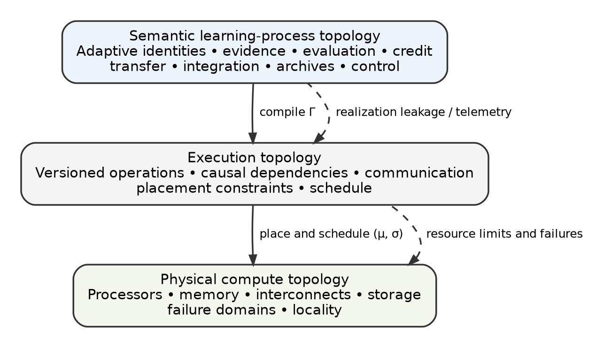{width=84%}

The same nodes may participate in several planes, but the edges need not coincide. Raw private evidence may remain local; validated counterexamples may propagate globally; parameter updates may synchronize within compatible islands; evaluator answers may be concealed from candidates; control messages may require authority. Figure 2 illustrates this multiplex organization.

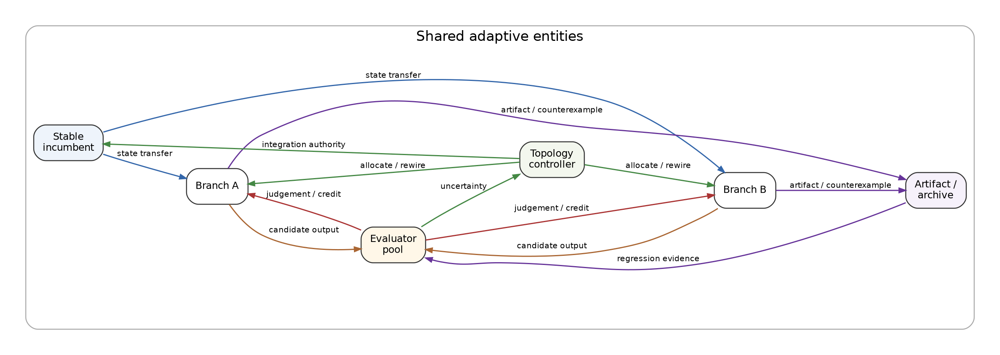{width=95%}

## 3. Related work and novelty boundary

LCT touches several mature research areas. Its novelty depends on respecting those boundaries rather than renaming their results.

### 3.1 Computation graphs and compositional learning

Stochastic computation graphs provide a principled way to represent deterministic and stochastic operations and derive gradient estimators [18]. They are a foundation for reasoning about stochastic dependencies, but their central object is a computation and its gradient estimator rather than the lifecycle of multiple persistent adaptive identities, integration alternatives, archives, authority, and physical realization.

Categorical approaches provide powerful compositional semantics. Backprop as Functor models supervised learners compositionally [19]. Parametric lenses connect architectures, optimizers, losses, and gradient learning [20]. Categorical cybernetics extends bidirectional compositional processes to reinforcement-learning families [21]. LCT draws on the same aspiration to make learning systems compositional, but targets an operational intermediate representation in which populations, evaluators, resources, lifecycle operations, and deployment choices are explicit.

### 3.2 Concurrency and open systems

Event structures distinguish causality, concurrency, conflict, and enabling [22]. Open-system and structured-cospan perspectives provide rigorous ways to compose systems through interfaces [23]. These theories supply essential mathematical tools. LCT does not claim to invent them. Its contribution is a learning-specific ontology, normal form, cost semantics, identity discipline, compiler boundary, and empirical program built with such tools.

### 3.3 Distributed optimization and federated learning

Distributed optimization has already developed graph-based unifications. Huang et al. jointly model sample-induced and communication topology for decentralized SGD [24]. Birch SGD uses weighted computation trees to represent local and asynchronous SGD families [25]. Federated-learning systems distinguish application roles and channels from deployment [29], and peer-to-peer federated work distinguishes learning topology from packet-routing topology [30]. These are close precedents for LCT terminology.

Their intended scope, however, is usually an optimizer or federated protocol family. LCT must also distinguish parameter merging from distillation and composition, represent adversarial or coevolving evaluators, preserve alternatives and archives, model graph rewriting, and state what learning semantics a compute mapping preserves.

### 3.4 Distributed execution compilers

DistIR represents and simulates distributed neural-network execution [26]. Alpa searches combinations of inter- and intra-operator parallelism [27]. These systems demonstrate that a high-level computation can be separated from its physical plan. LCT inserts a semantic learning-process layer above this boundary. Changing an all-reduce tree may be an execution optimization; increasing local adaptation steps, dropping a branch, exposing a new dataset, or replacing an ensemble with parameter averaging changes learning semantics.

### 3.5 Populations, archives, modularity, and open-endedness

Population-based training maintains and mutates a population while reallocating resources [4]. MAP-Elites explicitly preserves quality-diverse solutions [5]. Branch-Train-Merge trains experts independently and then combines them [6]. Go-Explore preserves discovered states so exploration can resume from promising points [31]. POET coevolves agents and environments with cross-environment transfer [10]. PSRO and AlphaStar-style leagues make opponent populations and matchmaking part of learning [8], [9]. Mixture-of-experts architectures preserve specialized components behind routing [32]. Distillation and model soups provide different integration operators [15], [14].

LCT treats these as distinct process programs built from reusable semantic operators. This makes it possible to compare where plurality is created, how long it persists, what information is exchanged, and how it is resolved.

### 3.6 Recent work that narrows the novelty claim

Several 2026 systems occupy especially nearby territory.

TacoMAS adapts multi-agent capability rapidly and topology more slowly during test-time execution [11]. The Red Queen Gödel Machine coevolves agents and evaluators under controlled utility changes [12]. SimpleTES structures evaluator queries across scientific discovery trajectories and reuses evaluated histories [13]. MERIT partitions heterogeneous instruction-tuning data using gradient conflict before decentralized training and merging [33]. TwistedMerge shows that pairwise alignability does not guarantee globally consistent model alignment and develops higher-order diagnostics [34]. CRDTMergeState demonstrates that common model-merging strategies fail commutativity, associativity, and idempotency and must be wrapped in a deterministic contribution layer for strong eventual consistency [35]. XALPHA retains structured discovery memory and negative feedback across research cycles [36]. Active testing allocates limited evaluation budget through approximate Neyman allocation [37].

These works mean that LCT should not claim to be the first adaptive topology, the first evaluator evolution, the first conflict-directed split, the first structured discovery loop, or the first observation that merge order and higher-order consistency matter. The stronger claim is integrative:

> **Adaptive identity resolution, multiplex semantic channels, evidence and evaluator allocation, higher-order integration planning, knowledge placement, reversibility, semantic capacity, authority, and physical realization are independent but coupled variables in one learning-process optimization problem.**

### 3.7 Capability-matrix conclusion

The accompanying novelty matrix codes nineteen representative frameworks across eighteen capabilities. No reviewed framework centrally spans the entire stack: persistent adaptive identity and lineage; evidence, judgement, and credit topology; typed integration; conflict; graph rewrite; archives; multiscale coarse-graining; cost; authority and provenance; compute compilation; equivalence and normal form; topology synthesis; online topology control; and phase-regime theory. This is a scoped primary-source review, not proof that no obscure formalism overlaps. The full matrix and coding protocol are included in the supplement.

## 4. Ontology and standardized terminology

### 4.1 Adaptive state

A state variable is **adaptive at resolution $\rho$** when:

1. it persists across at least two relevant learning events;
2. its transition is conditioned by evidence, experience, outcome, or evaluation; and
3. intervening on it can change future behavior or future learning.

Adaptive state can include:

$$
A=(\theta,\omega,M,D,E,R,\Phi,\ldots),
$$

where $\theta$ denotes model parameters, $\omega$ optimizer state, $M$ memory or replay, $D$ curriculum or data-selection state, $E$ an evaluator or critic, $R$ an archive or capability registry, and $\Phi$ a topology-control policy.

Weights are therefore one form of adaptive state, not its definition.

### 4.2 Adaptive identity

An **adaptive identity** is a versioned bundle of adaptive state with independently controlled writes, persistent lineage, a declared lifecycle, and the ability to diverge from other identities.

A physical replica is not automatically a distinct learner. At a declared resolution, a candidate qualifies as an independently learning identity when it satisfies four tests:

| Test | Operational question |
|---|---|
| Identity | Is the state independently versioned and addressable? |
| Divergence | Can differentiated evidence or dynamics change it independently? |
| Persistence | Can the difference survive beyond a transient calculation? |
| Consequence | Can the difference affect selection, transfer, deployment, or later learning? |

A tensor shard normally fails this test at model resolution. A federated client conducting local updates passes. An MoE expert may pass at expert resolution while the routed composition remains one model-level identity.

### 4.3 Evidence, judgement, credit, and adaptation

LCT separates a chain that is often collapsed in diagrams:

$$
\text{evidence}\rightarrow\text{observation}\rightarrow\text{judgement}\rightarrow\text{credit}\rightarrow\text{adaptation}.
$$

- **Evidence** is a data item, trajectory, environment interaction, demonstration, test case, or artifact presented to a process.
- **Observation** is a prediction, trajectory, measurement, or behavior produced from state and evidence.
- **Judgement** is a loss, reward, preference, validity result, fitness value, or qualitative assessment.
- **Credit** assigns responsibility for a judgement to an adaptive identity, state component, decision, or topology action.
- **Adaptation** changes persistent state.

A team can receive one judgement while distributing credit differently among members. A reward model can judge an output while an RL algorithm transforms that judgement into policy credit. A formal verifier can produce a binary judgement with no direct gradient. This separation is required for causal analysis.

### 4.4 Artifacts, resources, control, and authority

An **artifact** is persistent information produced by learning but not necessarily stored in model parameters: code, proofs, tests, counterexamples, datasets, tools, summaries, capability manifests, or compatibility evidence.

A **resource** is a consumed or allocated quantity such as compute, memory, bandwidth, evaluator calls, human attention, storage, or energy.

A **control state** governs routing, scheduling, allocation, lifecycle, or topology rewrite.

An **authority state** grants permission to read, write, fork, merge, reveal, rewire, or deploy. Authority is modeled separately from capability: a branch may be able to propose a core modification without being authorized to apply it.

### 4.5 Resolution contract

There is no absolute unit called “the learner.” LCT declarations include a resolution contract:

$$
\rho=(u,\Delta t,p,\mathcal O,\epsilon),
$$

where $u$ identifies the adaptive unit, $\Delta t$ the temporal grain, $p$ the persistence rule, $\mathcal O$ the observables to preserve, and $\epsilon$ the tolerated distortion under coarse-graining.

A system may be studied at parameter, module, model, population, or learner–evaluator-ecosystem resolution. Claims about topology are invalid if they silently switch resolution.

### 4.6 Structural relations

LCT distinguishes:

- **causality:** one event must precede another;
- **compatible concurrency:** events lack a causal dependency and can coexist;
- **selective synchronization:** an event waits for a selected subset of outputs;
- **conflict:** alternatives cannot all occur in one realized trace;
- **feedback:** recurring components influence later versions of one another;
- **rewrite:** identities, edges, permissions, or operators are created, removed, or changed.

Conflict is not the same as resource contention. Two branches that share one GPU may execute sequentially without being semantically exclusive. Two branches where choosing one destroys the other are semantically in conflict.

### 4.7 Fork versus decomposition

A **fork** creates alternative descendants:

$$
\operatorname{Fork}(A)\rightarrow(A_1,\ldots,A_n).
$$

A **decomposition** partitions responsibility while preserving a composite function:

$$
\operatorname{Decompose}(A)\rightarrow(A^{(1)},\ldots,A^{(n)},R),
$$

where the router or composer $R$ satisfies, at decomposition time,

$$
R(A^{(1)},\ldots,A^{(n)})\approx A
$$

on declared observables. Forked descendants are alternative futures and may replace the parent. Decomposed parts may be incomplete in isolation. Figure 3 illustrates the distinction.

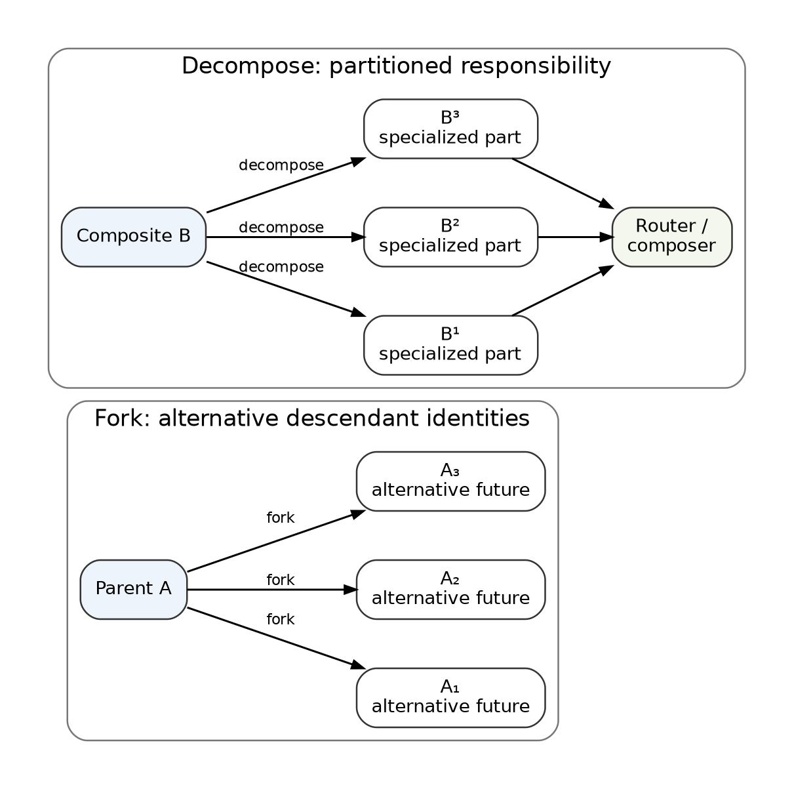{width=86%}

This distinction becomes important when the system changes what counts as one learner.

### 4.8 Identity arity and integration semantics

The lifecycle shape of an operation can be summarized by identity arity:

$$
0\rightarrow n,\quad 1\rightarrow1,\quad 1\rightarrow n,\quad n\rightarrow1,\quad n\rightarrow n,\quad n\rightarrow m,\quad n\rightarrow0.
$$

Arity is insufficient by itself. Selection, parameter merging, gradient aggregation, distillation, consensus, and compression can all be many-to-one while preserving different information and deployment structures. Every many-to-one operation must therefore declare its semantic subtype.

## 5. Formal model of Learning–Compute Topology

### 5.1 The learning-process object

At resolution $\rho$, an LCT process is represented as:

$$
\mathfrak L_{\rho}
=
(G,\tau,X,K,\#,\Phi,c,\alpha,\mathcal O),
$$

where:

- $G=(V,H)$ is a directed open hypergraph of stores, interfaces, and events;
- $\tau$ assigns types to stores, ports, events, and channels;
- $X$ associates state spaces with stores;
- $K$ assigns deterministic or stochastic transition kernels to events;
- $\#$ is a conflict relation over mutually exclusive events or choices;
- $\Phi$ is a set or policy of permitted graph rewrites;
- $c$ records work, memory, communication, latency, evaluation, storage, energy, and other costs;
- $\alpha$ records authority and provenance constraints;
- $\mathcal O$ declares externally relevant observables.

A realized step is:

$$
(G_t,x_t)\xrightarrow{e_t,r_t}(G_{t+1},x_{t+1}),
$$

where $e_t$ is an event and $r_t$ is an optional topology rewrite. Learning therefore consists of state dynamics on a graph and graph dynamics conditioned on state.

### 5.2 Typed stochastic hyperedges

An event may consume and produce several typed stores:

$$
o:
A^m\times I^n\times J^p\times Q^q\times R^r
\leadsto
A^{m'}\times I^{n'}\times J^{p'}\times Q^{q'}\times R^{r'},
$$

where $A$ denotes adaptive state, $I$ evidence or information, $J$ judgement, $Q$ credit, and $R$ resources. Hyperedges are required because one environment interaction may jointly affect several agents, one evaluation may judge a group, and several states may contribute to one integrated successor.

### 5.3 Topology, geometry, dynamics, semantics, schedule, and substrate

Connectivity alone does not describe a learning mechanism. The full scientific object separates:

1. **topology** - what may influence what;
2. **operational geometry** - delay, capacity, fidelity, trust, similarity, compatibility, and frequency;
3. **dynamics** - local transition rules such as SGD, Bayesian updating, mutation, or distillation;
4. **semantics** - what stores, messages, and joins mean;
5. **schedule** - which enabled events execute and when;
6. **substrate** - processors, memory, interconnects, storage, and failure domains.

Two mechanisms can have the same unweighted topology but different dynamics. Two joins can have the same shape but mean gradient addition and ensemble composition. Two identical semantic processes can have different schedules and physical costs.

### 5.4 Template, active topology, trace, and counterfactual space

LCT distinguishes four objects.

- The **template topology** describes recurring allowed relations and may contain cycles.
- The **active topology** describes identities and edges present at a particular time.
- The **realized trace** is a versioned causal history and is acyclic when time is explicit.
- The **counterfactual rewrite space** contains branches and structural actions that were available but not taken.

A GAN template is cyclic, but its time-unrolled trace is:

$$
G_0\rightarrow D_1\rightarrow G_1\rightarrow D_2\rightarrow\cdots.
$$

Counterfactual rewrite space is required for topological regret: the system may later discover that a pruned branch or rejected integration plan would have been valuable.

### 5.5 Multiplex semantic topology

Let $k$ index semantic channel types. The process contains a family:

$$
\mathbf G_t=
\{G_t^{\mathrm{evidence}},G_t^{\mathrm{judgement}},G_t^{\mathrm{credit}},G_t^{\mathrm{state}},G_t^{\mathrm{artifact}},G_t^{\mathrm{control}},G_t^{\mathrm{authority}}\}.
$$

Each layer may have distinct edges, direction, cadence, visibility, and permissions. A single graph is optimal for every channel only if the channel-specific objectives share a common optimizer. If

$$
\bigcap_k \arg\min_G J_k(G)=\varnothing,
$$

then forcing one shared graph creates an avoidable compromise, aside from the overhead of maintaining separate layers.

### 5.6 LCT-IR store classes

The LCT intermediate representation uses the following core storage classes:

```text
adaptive<T>   evidence<T>    judgement<T>
credit<T>     artifact<T>    resource<T>
control<T>    authority<T>   static<T>
```

Adaptive stores declare identity and version. Evidence stores declare partitions such as training, validation, held-out, private, public, or generated. Capacity, provenance, authorities, and metadata can be attached to any store.

### 5.7 Canonical operators

The core operator library is:

```text
instantiate  observe        evaluate       assign_credit
update       fork           decompose      aggregate
synchronize select          merge          distill
compose      transfer       externalize    archive
restore      retire         route          allocate
rewire       checkpoint     emit           pure
```

`decompose` and `externalize` are v0.2 additions motivated by adaptive identity resolution and knowledge placement. `salvage` is defined as a standard macro over observation, emission, transfer, evaluator update, archive, and retirement rather than an irreducible primitive.

### 5.8 Core type and effect rules

An LCT-IR conforming program obeys at least the following rules.

1. **Explicit adaptive identity.** Every adaptive store has an identity and version.
2. **Single writer per version.** Concurrent writes must target distinct versions or be mediated by an explicit integration operator.
3. **No implicit adaptive copying.** Independently writable descendants require `fork` or `decompose` semantics.
4. **Typed many-to-one integration.** Multiple adaptive inputs cannot produce one adaptive output through an untyped join.
5. **Evaluation-credit separation.** `evaluate` produces judgement; `assign_credit` produces identity-directed credit.
6. **Evidence partition integrity.** Held-out or test evidence cannot influence adaptation without an explicit declared protocol change.
7. **Identity preservation versus composition.** `merge` produces a fused identity; `compose` preserves components behind a larger system.
8. **Delayed feedback.** Cycles require versioning or explicit delay.
9. **Authority closure.** Sensitive writes and topology rewrites require declared authority tokens.
10. **Opacity discipline.** Opaque kernels may hide stateless numerical work but not relevant adaptive transitions.
11. **Semantic rewrite declaration.** Any change that can alter adaptive traces must be represented as a learning-semantic rewrite.
12. **Realization guarantee.** Compute mappings declare exact, approximate, distributional, bounded-staleness, behavioral, or best-effort guarantees.
13. **Reversibility declaration.** Identity-destroying or integration events declare rollback state and recovery class.
14. **Knowledge destination declaration.** Accepted discoveries declare their retained substrate when it is not implied by the operator.

### 5.9 Conformance levels

LCT-IR implementations may support increasing levels:

- **A: descriptive** - typed static representation;
- **B: normalizable** - deterministic LCNF extraction;
- **C: executable** - operational semantics and traces;
- **D: verifiable** - equivalence, authority, and compiler checks;
- **E: synthesizable** - search or online control over topology programs.

The accompanying prototype implements a bounded subset of levels A-C and selected checks from D.

## 6. Learning Causal Normal Form

### 6.1 Purpose

A universal representation is scientifically weak if every algorithm can be hidden inside one node. LCNF is a structure-preserving normalization target that exposes the adaptive causal skeleton while contracting irrelevant stateless detail.

### 6.2 Normalization procedure

Given a resolution contract, normalization performs these passes:

1. fix the adaptive unit, temporal grain, observables, and tolerance;
2. discover persistent adaptive state;
3. version every adaptive write;
4. separate evidence, judgement, credit, and update;
5. normalize identity creation, decomposition, selection, integration, archive, restoration, and retirement;
6. expose integration semantics;
7. extract guards and conflict;
8. unroll or delay feedback;
9. externalize graph rewrites;
10. contract irrelevant pure computations;
11. infer dependencies from reads and writes;
12. remove redundant transitive edges;
13. detach compute realization;
14. assign canonical labels and a deterministic hash.

### 6.3 LCNF invariants

LCNF preserves, at the declared resolution:

- adaptive identities and lineage;
- event type and relevant transition semantics;
- causal order, compatible concurrency, and conflict;
- evidence partition provenance;
- judgement and credit paths;
- integration operator identity;
- rewrite history;
- declared cost, authority, provenance, and observables.

It does not promise to preserve every floating-point operation or implementation-specific tensor partition unless those are declared observables.

### 6.4 Equivalence hierarchy

Different questions require different equivalence relations.

| Equivalence | What must be preserved |
|---|---|
| Structural | typed adaptive incidence structure |
| Lineage | identity creation and ancestry |
| Trace | allowed labeled causal histories |
| Stochastic | distribution over declared outcomes |
| Behavioral | outputs on a specified intervention or test family |
| Learning | adaptive-history distribution at a declared resolution |
| Execution | operation dependencies and schedule constraints |
| Resource | work, span, memory, communication, or energy class |
| Deployment | retained inference system |
| Authority | permissions and trust boundaries |

Ring and tree all-reduce can be learning-equivalent but execution-distinct. An ensemble and a model soup can share a fork silhouette but differ in deployment and integration semantics. A distilled student may be behaviorally close to its teachers but not lineage-equivalent.

### 6.5 Coarse-graining

A projection

$$
\pi_{\rho\rightarrow\rho'}:\mathfrak L_\rho\rightarrow\mathfrak L_{\rho'}
$$

may contract a subgraph into a macro-event only when its exposed interface is sufficient for declared external observables. Exact and approximate conditions are formalized in Proposition 4. This makes “one learner versus many” an empirically testable interface claim.

### 6.6 Canonical examples

Figure 4 compares normalized process structures. Sequential SGD has one versioned adaptive identity. Synchronous data-parallel SGD branches evidence and credit computations but aggregates them into one update. Federated averaging creates independently adapting client identities and then performs an explicit parameter/state integration.

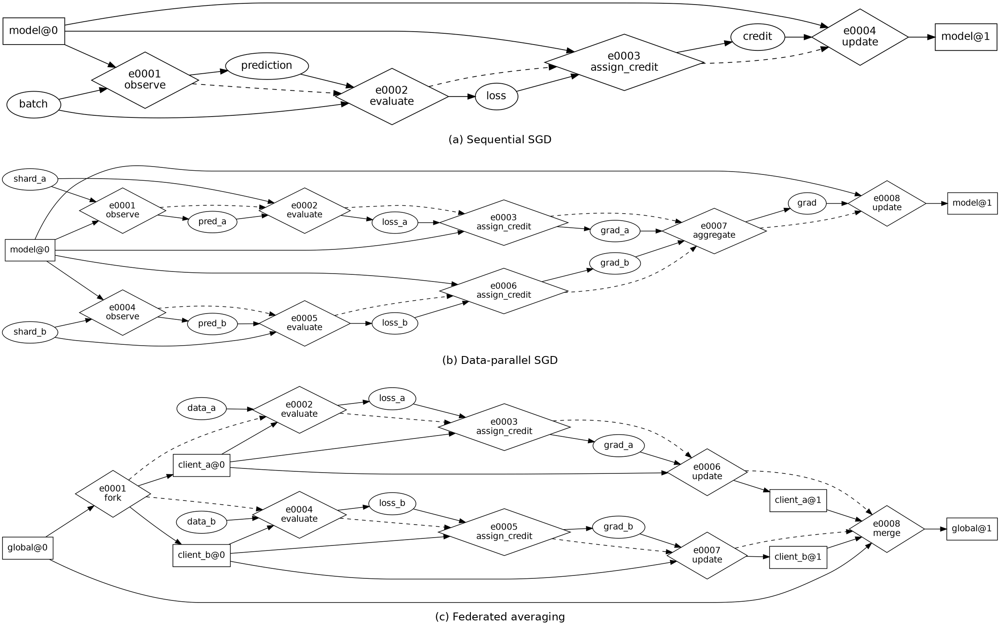{width=100%}

MAML has a superficially similar fork-join shape to federated averaging, but the join is meta-credit rather than parameter averaging. An ensemble preserves descendants behind a composition operator; a model soup merges them. The normal form is useful precisely because it distinguishes these cases.

## 7. Foundational propositions

The following statements are intentionally narrower than the full research vision. They establish a formal nucleus without claiming a complete theory of arbitrary continuous-time or self-referential adaptive systems.

### 7.1 Proposition 1: serial and parallel composition are not causally complete

**Statement.** Let series-parallel learning processes be the smallest class of finite event partial orders containing the singleton event and closed under:

1. serial composition $P;Q$, which places every event of $P$ before every event of $Q$; and
2. parallel composition $P\otimes Q$, which adds no cross-component order relation.

There exists a four-event learning dependency structure that cannot be generated by these two operations.

**Witness.** Let $N=\{a,b,c,d\}$ have exactly:

$$
a\prec b,\qquad c\prec b,\qquad c\prec d.
$$

Interpret $a$ as an experimental result, $c$ as a shared evaluator or dataset becoming available, $b$ as an integration event waiting for both, and $d$ as another event using $c$ without waiting for $a$.

**Proof.** Every non-singleton series-parallel partial order has a nontrivial top-level serial or parallel decomposition. The undirected comparability graph of $N$ has edges $a-b$, $b-c$, and $c-d$, so it is connected. Therefore $N$ cannot be a nontrivial parallel composition, because a parallel composition has no comparability edges across components. The incomparability graph has edges $a-c$, $a-d$, and $b-d$, and is also connected. Therefore $N$ cannot be a nontrivial serial composition, because a serial composition makes every cross-component pair comparable. Thus $N$ admits neither top-level decomposition and is not series-parallel. $\square$

This is the established induced-$N$ obstruction for finite series-parallel posets [28]. Its LCT consequence is that general training processes need selective synchronization or general typed wiring.

### 7.2 Proposition 2: forking creates option capacity, not information

**Statement.** Let $Y$ be an unknown target property, $S_0$ a parent adaptive state, and descendants

$$
S_i=f_i(S_0,R_i),\qquad i=1,\ldots,B,
$$

where branch randomness $R_{1:B}$ is conditionally independent of $Y$ given $S_0$:

$$
Y\perp R_{1:B}\mid S_0.
$$

Before any branch receives differentiated evidence correlated with $Y$,

$$
I(Y;S_1,\ldots,S_B\mid S_0)=0.
$$

**Proof.** Given $S_0$, descendants are measurable functions only of $R_{1:B}$. The conditional Markov structure and data-processing inequality give

$$
I(Y;S_{1:B}\mid S_0)
\le I(Y;R_{1:B}\mid S_0)=0.
$$

Mutual information is nonnegative, so equality holds. $\square$

For exact deterministic copies, the result is immediate. Copying creates the capacity to perform differentiated experiments, but information arrives from the differentiated evidence, objective, environment, evaluator, architecture, or controller action. The result does not apply when branch construction itself uses information about $Y$; in that case the information came through the controller.

### 7.3 Proposition 3: trace-faithful representation for a bounded explicit-state class

Define a **finite explicit-state learning system** by:

1. finitely many typed persistent stores $X=X_1\times\cdots\times X_n$;
2. finitely many event schemas;
3. finite read sets, write sets, guards, and stochastic transition kernels;
4. explicit identity creation, integration, decomposition, and deletion actions;
5. finite conflict constraints and graph-rewrite actions;
6. additive event-cost attributes;
7. declared external observables $\mathcal O$.

Hidden adaptive state inside opaque events is excluded.

**Statement.** Every system in this class has an LCT-IR encoding whose time-unrolled LCNF preserves the labeled causal trace set, the probability distribution over declared observable traces, adaptive lineage, conflict choices, and additive attributed costs.

**Construction.** Create a typed state node for every persistent store. For every transition instance, create an event hyperedge; connect read versions as inputs; create fresh versions for written adaptive stores; expose judgement, credit, artifacts, and resources as typed outputs; encode mutual exclusion with conflict sets; encode structural mutation as graph-rewrite events; and copy the original transition kernel and cost attributes.

**Proof sketch.** The one-step transition distribution of each constructed event equals the original kernel by construction. Initial states are identical. Assuming equality of observable trace distributions through step $t$, applying corresponding enabled kernels preserves equality at $t+1$. Induction yields equality for every finite trace length. Explicit versioning and copied labels preserve lineage and additive costs. $\square$

The proposition is not a claim about unrestricted self-reference, continuous-time systems, hidden runtime state, or numerical differences introduced during physical execution. Its purpose is to establish nontrivial representational adequacy under an opacity discipline.

### 7.4 Proposition 4: exact coarse-graining under interface sufficiency

Let a learning subgraph have internal history $H_t$, external state $X_t$, exposed interface state $Z_t$, and future declared external observables $Y_{t:T}$.

**Statement.** If

$$
Y_{t:T}\perp H_t\mid(Z_t,X_t)
$$

and a macro-event uses the exact induced interface transition kernel

$$
K_Z(z_{t+1}\mid z_t,x_t),
$$

then replacing the internal subgraph by the macro-event preserves the joint distribution of all future declared external observables.

**Proof.** Interface sufficiency yields

$$
P(Y_{t:T}\mid H_t,Z_t,X_t)
=
P(Y_{t:T}\mid Z_t,X_t).
$$

Marginalizing the internal transition sequence produces $K_Z$. Replacement leaves the distribution over the next interface and external state unchanged. Recursion preserves the future observable distribution. $\square$

If a macro-kernel differs by at most $\epsilon$ in total variation at each invocation, a finite-horizon bound of order $T\epsilon$ follows by standard coupling or triangle arguments; tighter bounds require contraction or mixing assumptions.

### 7.5 Proposition 5: evaluator-information lower bound

Let $J\in\{1,\ldots,B\}$ identify the truly best candidate, with a uniform prior. Let $Z$ be all evaluator evidence, $\widehat J(Z)$ the selected candidate, and $P_e=P(\widehat J\ne J)$.

**Statement.** With base-two logarithms,

$$
P_e
\ge
1-
\frac{I(J;Z)+1}{\log_2 B}.
$$

**Proof.** Fano's inequality gives [38]

$$
H(J\mid Z)
\le h_2(P_e)+P_e\log_2(B-1)
\le 1+P_e\log_2 B.
$$

Because $H(J)=\log_2 B$ and $I(J;Z)=H(J)-H(J\mid Z)$, rearrangement yields the result. $\square$

The theorem concerns evaluator information, not evaluator count. Duplicate or correlated judges can provide little additional information. Candidate generation, evaluation, and integration are separate scaling dimensions.

### 7.6 Proposition 6: integration-capacity lower bound

Let $X$ encode operationally tested capability information distributed across branches, and let $Z$ be an integrated state with effective capacity at most $C$ bits:

$$
H(Z)\le C.
$$

**Exact statement.** If every capability encoded by $X$ can be recovered exactly from $Z$, then

$$
C\ge H(X).
$$

**Proof.** Exact recoverability means $H(X\mid Z)=0$. Therefore

$$
H(X)=I(X;Z)\le H(Z)\le C.
$$

Hence $C\ge H(X)$. $\square$

**Lossy statement.** Under a declared distortion measure and expected distortion at most $d$, rate-distortion theory gives [38]

$$
C\ge I(X;Z)\ge R_X(d).
$$

A fixed-capacity fused state cannot universally preserve an arbitrary collection of independent and incompatible branch capabilities. The system must use additional capacity, external memory, routed modular composition, compatibility assumptions, or accept distortion and forgetting. Operationally, $X$ must be defined through a finite test or intervention family or a description-length model; real-valued parameters are not treated as physically infinite-capacity objects.

### 7.7 Proposition 7: semantic-cut bound for a staged learning pipeline

The preceding evaluator and integration results are special cases of a broader staged information bound.

Let $E$ denote task-relevant experience, $A_0$ the initial adaptive state, and $Z_1,\ldots,Z_m,A_T$ successive sufficient channel states for discovery, communication, judgement, credit, and integration. Assume that, conditioned on $A_0$, they form a Markov chain with no undeclared side channel:

$$
E\rightarrow Z_1\rightarrow\cdots\rightarrow Z_m\rightarrow A_T.
$$

Then repeated data processing gives

$$
I(E;A_T\mid A_0)
\le
\min_i I(Z_{i-1};Z_i\mid A_0),
$$

where $Z_0=E$. If each semantic channel has an information-capacity upper bound $C_i$, then

$$
I(E;A_T\mid A_0)\le \min_i C_i.
$$

**Proof.** Apply the conditional data-processing inequality to every prefix and suffix of the Markov chain. $\square$

This **Semantic Cut Principle** is exact only under the stated staged no-side-channel model. General networks require a suitable network-information or cut-set formulation. Nevertheless, it identifies a testable systems consequence: increasing candidate generation cannot improve retained learning when evaluation, credit, communication, or integration is the active bottleneck.

### 7.8 Open theorem program

The immediate theorem backlog is:

- compiler correctness under exact and approximate realization;
- general semantic min-cut bounds for multiplex networks;
- effective-width bounds under behaviorally defined similarity;
- approximate coarse-graining under mixing;
- no universally dominant fixed topology under bounded budgets;
- topology-controller regret with switching and carrying costs;
- higher-order integration consistency under operator-specific compatibility;
- sufficient conditions for adaptive identity refinement and coarsening.

## 8. Learning topology and compute realization

### 8.1 Three-stage mapping

LCT separates:

$$
\boxed{
\mathfrak L
\xrightarrow{\Gamma}
\mathfrak X
\xrightarrow{\mu,\sigma}
\mathfrak C
}
$$

where $\mathfrak L$ is the semantic learning-process topology, $\Gamma$ compiles it into executable operations $\mathfrak X$, and $(\mu,\sigma)$ place, route, and schedule those operations on physical compute $\mathfrak C$.

Logical branch count and processor count are not equal. One accelerator can time-multiplex many branches. Many accelerators can cooperate on one adaptive identity. Compute topology constrains the feasible rate, residency, fidelity, latency, reliability, and cost of a learning topology rather than its abstract finite expressibility.

### 8.2 Feasible realization set

For a physical substrate $\mathfrak C$, multidimensional budget $B$, allowable semantic distortion $\epsilon$, and failure risk $\delta$, define:

$$
\mathfrak F(\mathfrak C,B,\epsilon,\delta)
=
\left\{
\mathfrak L:
\exists\Gamma,\mu,\sigma
\text{ such that }
C\le B,
\ d_{\mathcal O}\le\epsilon,
\ P(\text{failure})\le\delta
\right\}.
$$

The metric $d_{\mathcal O}$ is defined over declared observables and may measure exact state equality, trace distance, distributional divergence, bounded staleness, or behavioral difference.

### 8.3 Work, span, communication, evidence, and evaluation

Let $W$ be total work, $S$ the longest causal chain, $P_{\mathrm{eff}}$ effective processing capacity, $T_{\mathrm{comm}}$ a communication lower bound, $T_{\mathrm{eval}}$ an evaluation lower bound, and $T_{\mathrm{evidence}}$ a data or environment-generation lower bound. Then a schematic runtime bound is:

$$
T\ge
\max\left(
\frac{W}{P_{\mathrm{eff}}},
S,
T_{\mathrm{comm}},
T_{\mathrm{eval}},
T_{\mathrm{evidence}}
\right).
$$

For a physical network cut $U$,

$$
T_{\mathrm{comm}}
\ge
\max_U
\frac{\operatorname{traffic}_{\mathfrak X}(U)}
{\operatorname{bandwidth}_{\mathfrak C}(\mu(U))}.
$$

Learning systems add bottlenecks beyond ordinary parallel computing: evaluator calls, human review, environment generation, compatibility testing, archive retrieval, and validation of integration.

### 8.4 Realization leakage

A compute realization exhibits **realization leakage** when placement or scheduling changes the distribution of adaptive histories rather than only runtime. Sources include:

- stale parameter reads;
- asynchronous update order;
- reduced precision or compressed communication;
- dropped messages;
- branch starvation;
- data locality;
- correlated device failure;
- unequal branch lifetime;
- checkpoint loss;
- nondeterministic aggregation.

A compiler should declare a guarantee class:

1. exact;
2. floating-point approximate;
3. distributionally equivalent;
4. bounded-staleness;
5. behaviorally equivalent on declared observables;
6. best-effort asynchronous.

The contract is:

$$
d_{\mathcal O}
\left(
\llbracket\mathfrak L\rrbracket,
\llbracket\mu,\sigma,\Gamma(\mathfrak L)\rrbracket
\right)
\le\epsilon.
$$

### 8.5 Semantic firewall

LCT separates two controllers.

A **semantic topology controller** may alter adaptive identities, evidence routing, evaluators, credit paths, integration operators, archives, and synchronization semantics.

A **compute planner** may alter device placement, tensor sharding, communication routes, memory placement, collective implementation, and equivalent schedules.

Replacing a ring all-reduce with a tree can be a compute rewrite. Increasing local steps before synchronization changes the learning process. Moving a branch to another device is a compute rewrite; dropping it is a learning event. Quantizing communication is an approximate compute rewrite only under an explicit distortion contract.

The boundary is a **semantic firewall**: execution optimization cannot silently rewrite learning semantics, and the semantic controller cannot bypass authority or validation requirements.

### 8.6 Process superoptimization versus topology synthesis

LCT exposes two distinct optimization problems.

**Semantics-preserving process optimization:**

$$
\mathfrak L_{\mathrm{exec}}^*
=
\arg\min_{\mathfrak L'\sim_{\mathcal O}\mathfrak L}
C(\mathfrak L').
$$

Examples include delayed fork, copy-on-write adaptive state, shared evidence caching, communication batching, and safe event reordering.

**Semantics-changing topology synthesis:**

$$
\mathfrak L_{\mathrm{learn}}^*
=
\arg\max_{\mathfrak L}
\left[U(\mathfrak L)-C(\mathfrak L)\right].
$$

This search may change identity partition, branching, evidence, evaluators, integration, or archives. The two optimizers must not be conflated.

## 9. Canonical encodings of existing learning mechanisms

The coverage study contains thirty mechanisms. Table 1 summarizes representative cases at model or population resolution.

**Table 1. Representative learning mechanisms in LCT normal form.**

| Mechanism | Adaptive-identity topology | Evidence and judgement | Integration or retention |
|---|---|---|---|
| SGD / Adam | one versioned identity path | minibatch loss and gradient credit | identity-preserving update |
| Synchronous data-parallel SGD | one canonical identity; replicated reads | parallel evidence and gradients | gradient aggregation, one update |
| Tensor / pipeline parallelism | one partitioned identity | ordinary training stream | primarily execution partitioning |
| Asynchronous parameter server | nominal shared identity with stale versions | worker streams and gradients | asynchronous versioned writes |
| Federated averaging | global parent plus local client identities | private client evidence | weighted parameter/state merge |
| Local SGD / DiLoCo | temporarily independent islands | partitioned streams | periodic synchronization or merge |
| Gossip SGD | persistent peer identities | local evidence | pairwise consensus or mixing |
| Ensemble | persistent population | independent or bootstrapped evidence | decision-level composition |
| Boosting | serially created components | residual-weighted evidence | growing composition |
| Evolution strategy | often ephemeral proposals | fitness evaluation | distribution or parent update |
| Genetic algorithm | persistent population | fitness and selection | mutation, recombination, survival |
| PBT | persistent population | task evaluation | copy, mutate, retire, reallocate |
| MAP-Elites | niche-indexed archive | fitness plus behavior descriptor | persistent quality-diverse repertoire |
| Model soup | fine-tuned descendants | validation selection | parameter merge |
| Distillation | teacher and student identities | teacher behavior as evidence | student update; sources may persist |
| Mixture of experts | composite model with adaptive experts | routed token evidence | identity-preserving composition |
| MAML | shared meta-identity and task descendants | post-adaptation task judgement | meta-credit to ancestor |
| Hyperband | outer candidate population | multi-fidelity evaluation | resource allocation and pruning |
| IMPALA | one learner plus many policy actors | distributed trajectories | central learner update |
| GAN | two recurrently coupled identities | adversarial judgements | alternating or simultaneous updates |
| Self-play league | persistent policy population | endogenous opponent evidence | matchmaking, branching, freezing |
| POET | agent-environment populations | coevolving tasks and outcomes | transfer across pairings |
| Continual replay | learner plus persistent evidence archive | current and replay evidence | update with retention mechanism |

### 9.1 Distinctions recovered by LCNF

#### Data parallelism is not automatically adaptive plurality

Synchronous workers may calculate separate gradients, but if they read the same model version and aggregate before one update, the model-level topology has one canonical successor. The broad dimension is evidence and execution, not persistent adaptive identity.

#### Federated averaging is not merely distributed SGD execution

Local clients conduct independently consequential updates on private evidence before parameter integration [1]. The synchronization interval changes both systems cost and adaptive divergence; DiLoCo deliberately exploits this coupling under weak connectivity [3].

#### Ensembles, soups, and distillation are different joins

An ensemble retains multiple identities into deployment. A model soup merges parameters [14]. Distillation transfers behavior into a student [15]. Calling all three “model combination” loses deployment width, lineage, capacity, and reversibility.

#### MAML and federated averaging share a silhouette but not credit semantics

Both can appear as a shared state spawning task-local descendants and later joining. FedAvg merges descendants. MAML uses their post-adaptation performance to assign meta-credit to the ancestor [16].

#### IMPALA has a wide evidence topology and a narrow learner topology

Many actors generate trajectories from policy copies, potentially with staleness, while the learner updates the central policy [7]. Counting actors as independently learning policies would misclassify the mechanism.

#### Adversarial and coevolutionary systems make evaluation adaptive

GANs, self-play, and POET violate a static-evaluator assumption. The systems producing evidence and judgement change with the learner. Recent agent systems extend this to explicit evaluator evolution [12].

### 9.2 Coverage as a falsification test

The formalism should be rejected or revised if an existing mechanism cannot be encoded without:

- hiding consequential adaptive state in an opaque node;
- inventing a mechanism-specific primitive;
- flattening real concurrency or conflict;
- erasing lineage or integration semantics;
- or distorting asymptotic work, communication, memory, or evaluation requirements.

The current executable suite contains nine complete encodings: sequential SGD, synchronous data-parallel SGD, federated averaging, PBT, MAML, GAN training, IMPALA, POET, and ABVI. The supplement contains the full thirty-mechanism matrix.

## 10. Measurements for a topology science

A scientific framework needs quantities that expose differences hidden by optimizer labels and device counts.

### 10.1 Widths

Let the selected resolution and time window be fixed.

- **Causal width** is the size of an antichain or the number of mutually compatible enabled events.
- **Adaptive width** is the number of independently writable adaptive identities.
- **Epistemic width** is the effective number of behaviorally or strategically distinct hypotheses.
- **Commitment width** is the number of alternatives that remain recoverable for future continuation.
- **Evaluator width** is the effective number of independent judgement mechanisms.
- **Deployment width** is the number of adaptive components retained at inference.

These can differ sharply. An archive can increase commitment width without consuming active training compute. A data-parallel job can have high causal width and adaptive width near one. An ensemble preserves deployment width; a merge contracts it.

### 10.2 Effective breadth

Raw population size overstates exploration when branches are redundant. Given a positive semidefinite similarity matrix over branch behaviors, strategies, updates, or representations, let normalized eigenvalues be $\lambda_i$. A spectral effective breadth is:

$$
B_{\mathrm{eff}}
=
\exp\left(-\sum_i\lambda_i\log\lambda_i\right).
$$

This follows the effective-diversity logic of Vendi-family metrics [39]. Different kernels give different quantities:

$$
B_{\mathrm{behavior}},\quad
B_{\mathrm{strategy}},\quad
B_{\mathrm{update}},\quad
B_{\mathrm{evidence}},\quad
B_{\mathrm{evaluator}}.
$$

A population can be parameter-diverse but behaviorally redundant, or parameter-near but functionally different in a critical region.

### 10.3 Learning bandwidth

For a partition $U\rightarrow V$, define a task-conditioned adaptive influence rate:

$$
\mathcal B_{U\rightarrow V}
=
\frac{I(E_U;A_V^{t+\Delta t}\mid A_V^t,E_V)}{\Delta t}.
$$

This measures useful influence on adaptive state rather than bytes transmitted. A high-bandwidth physical link can have low learning bandwidth if messages are redundant, ignored, or destroyed by integration.

### 10.4 Integration retention

For an integration operator $o$ applied to sources $S_1,\ldots,S_n$, let $U_j$ be capability tests with weights $w_j$. A practical retention score is:

$$
\rho_o
=
\frac{\sum_j w_j U_j(o(S_{1:n}))}
{\sum_j w_j\max_i U_j(S_i)}.
$$

The denominator approximates the tested capability union available before integration. Retention must be reported with capacity, latency, and source-preservation costs; an ensemble and a compressed fused state should not be compared on accuracy alone.

### 10.5 Topological regret

Let $\Omega_t$ be the set of alternatives recoverable at time $t$. A topology action may create, retain, or destroy options. A counterfactual regret quantity is:

$$
R_T^{\mathrm{topo}}
=
\sum_{t=1}^{T}
U(a_t^*)
-
\sum_{t=1}^{T}U(a_t)
-
C_{\mathrm{switch}}
-
C_{\mathrm{carry}},
$$

where $a_t^*$ is an accessible counterfactual topology action. Exact counterfactual utility is usually unobservable; archives, shadow branches, randomized interventions, and causal models provide estimators.

### 10.6 Dimensionless control coordinates

The following are proposed empirical coordinates, not universal constants.

**Evaluation adequacy:**

$$
\eta_E=\frac{I(J;Z)}{H(J)}.
$$

**Integration adequacy:**

$$
\eta_I=\frac{C_{\mathrm{available}}}{R_X(d)}.
$$

**Diversity efficiency:**

$$
\eta_B=\frac{B_{\mathrm{effective}}}{B_{\mathrm{raw}}}.
$$

**Learning-compute mismatch:**

$$
\chi_{LC}
=
\max_U
\frac{\operatorname{required\ semantic\ traffic}(U)}
{\operatorname{physical\ cut\ capacity}(\mu(U))}.
$$

**Commitment retention:**

$$
\kappa
=
\frac{\text{recoverable decision-relevant alternatives}}
{\text{alternatives generated}}.
$$

**Refinement pressure:**

$$
\pi_R
=
\frac{V_{\mathrm{exposed\ distinctions}}}{C_{\mathrm{refine}}}.
$$

**Channel-specific synchronization value:**

$$
\pi_{S,k}
=
\frac{\text{expected transfer and staleness benefit}}
{\text{communication, homogenization, and identifiability cost}}.
$$

These coordinates are intended to organize phase diagrams and controller policies rather than serve as assumed laws.

## 11. Derived consequences and underexplored topologies

The formalism is useful only if it yields consequences that are not obvious from one named training method. This section “shakes the tree”: it combines the ontology, propositions, and compiler boundary to derive new research objects.

### 11.1 Retained learning is a capacity-matched pipeline

Candidate generation is often treated as the main scaling axis. Proposition 5 and Proposition 6 imply a different picture. Useful learning must pass through at least three separable capacities:

$$
C_D=\text{discovery or candidate capacity},
$$

$$
C_E=\text{evaluation and credit capacity},
$$

$$
C_I=\text{integration and retained-capability capacity}.
$$

In a staged model,

$$
\dot I_{\mathrm{retained}}
\lesssim
\min(C_D,C_E,C_I).
$$

This creates at least three regimes.

1. **Discovery-limited:** evaluators and integrators are idle; generating more diverse candidates has high marginal value.
2. **Evaluation-limited:** candidates accumulate faster than the system can distinguish them; additional branching creates backlog, stale decisions, or proxy exploitation.
3. **Integration-limited:** useful branches are identified but cannot be safely retained in the available core, module, memory, or deployment capacity.

The controller should allocate the next unit of compute to the semantic bottleneck with the largest expected marginal increase in retained utility. SimpleTES already demonstrates that the organization of evaluator-driven search matters [13], and active testing demonstrates that evaluator budget can be allocated strategically [37]. LCT generalizes evaluation allocation into a full retained-learning flow problem that also includes credit and integration.

A further safety implication follows. Search breadth under a misspecified evaluator can amplify Goodhart effects because a larger candidate set samples more extreme proxy values [40], [41], [42]. When judgement is the bottleneck, branching the evaluators, tests, or independent anchors may be more valuable than branching candidates.

### 11.2 Adaptive identity resolution

The resolution contract is not only descriptive. It can become an adaptive decision.

Let $P_t$ partition learning responsibilities into adaptive identities. A topology controller can refine the partition through decomposition or coarsen it through recombination. A schematic objective is:

$$
P_t^*
=
\arg\max_P
\left[
\operatorname{PositiveTransfer}(P)
-
\operatorname{Interference}(P)
-
\lambda\operatorname{CoordinationCost}(P)
-
\mu\operatorname{DuplicationCost}(P)
\right].
$$

At first order, task or capability gradients $g_i$ and $g_j$ provide one local signal: $g_i^\top g_j<0$ suggests interference, while positive alignment suggests shared learning may be beneficial. MERIT demonstrates a concrete conflict-aware split-train-merge instance for heterogeneous instruction tuning [33]. LCT extends the decision beyond dataset partitions and parameter blocks to arbitrary adaptive identities: models, modules, memories, evaluators, curricula, or agents.

The derived principle is:

> **What counts as one learner should change when the balance between positive transfer, interference, coordination, and duplication changes.**

This is **Adaptive Causal Refinement (ACR)**. Refine a region when its current macro-interface ceases to be sufficient for relevant predictions or interventions; coarse-grain it when internal distinctions no longer improve decisions enough to justify their cost.

A practical refinement trigger can combine:

- residual error attributable to a macro-node;
- conflicting gradients or credit assignments;
- evaluator disagreement localized to a subsystem;
- nonstationarity hidden by aggregation;
- failed causal predictions under intervention;
- projected value of exposed distinctions divided by refinement cost.

Figure 12 in Section 14.5 gives an analytical refinement-phase diagram.

### 11.3 Typed multiplex synchronization

One communication graph and one synchronization clock are generally inappropriate for all semantic channels.

A newly validated capability delta may require slow compatibility testing and restricted core-write authority. A catastrophic counterexample may need immediate propagation to every evaluator and regression suite. Raw private evidence may be immobile. Reusable artifacts may be cached broadly. Experimental hypotheses may remain isolated.

This yields the **Semantic Layer Decoupling Principle**:

> Distinct learning signals should not be forced to share topology, cadence, visibility, or authority unless their operational objectives are aligned.

A typed synchronization policy chooses, for each channel $k$:

$$
(G_k,\tau_k,o_k,a_k),
$$

where $G_k$ is the graph, $\tau_k$ the cadence, $o_k$ the transfer or integration operator, and $a_k$ the authority policy.

A risk-asymmetric system may have a slow capability-admission path and a fast hazard-propagation path:

```text
capability delta -> validation -> compatibility -> integration
hazard discovery -> global regression ledger -> quarantine / routing change
```

This organization resembles an immune system more than an ordinary optimizer.

### 11.4 Higher-order compatibility and the integration forest

Pairwise compatibility is not enough. It can be true that every pair of branches passes a compatibility test while a triple fails. Compatibility can also depend on the integration operator and order. Recent work shows that pairwise alignability need not imply global consistency [34], and common neural merge strategies generally lack algebraic properties such as associativity and commutativity [35].

The appropriate object is an operator-indexed compatibility hyperrelation:

$$
\chi(S,o,\pi,\rho)
\in
\{\text{pass},\text{fail},\text{unknown}\},
$$

where $S$ is a subset of branches, $o$ an integration operator, $\pi$ an order or schedule, and $\rho$ the resolution of the test.

Integration is then a program or forest, not one join. Leaves are branches; internal nodes are typed operations such as merge, distill, compose, select, or externalize; multiple roots are allowed. Every internal result can be revalidated.

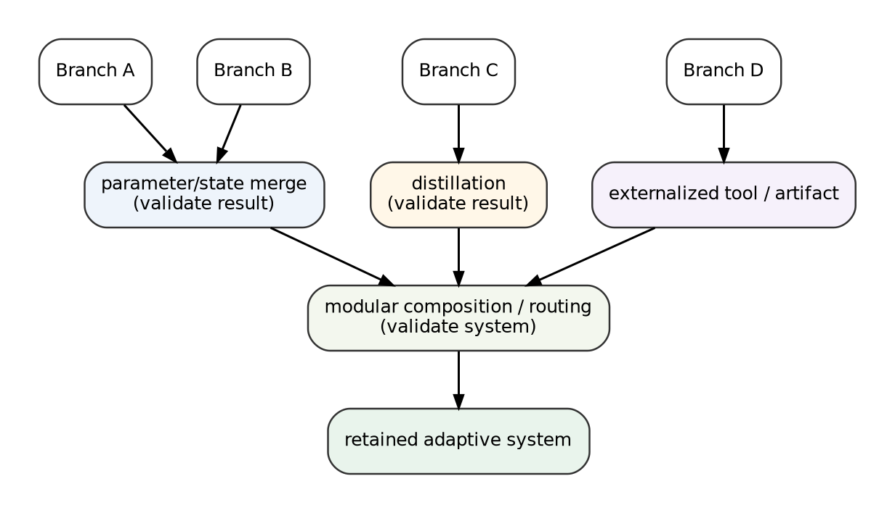{width=78%}

The optimization problem is:

$$
\mathcal F^*
=
\arg\max_{\mathcal F}
\left[
U(\operatorname{Execute}(\mathcal F))
-
C(\mathcal F)
-
R(\mathcal F)
\right].
$$

This yields a strong hypothesis:

> **Integration order, operator assignment, retained source states, and validation depth are learnable topological variables rather than post-training implementation details.**

### 11.5 Reversible integration lattice and commitment annealing

Integration operators differ in how much future optionality they destroy.

A rough partial order of increasing commitment is:

```text
keep branches separate
    -> route or ensemble
    -> distill while retaining sources
    -> merge while retaining checkpoints
    -> committed fusion
    -> source retirement and deletion
```

The order is not total because cost, capacity, and behavioral preservation differ. Let $\Omega_t$ be the recoverable decision-relevant alternatives. Define commitment loss:

$$
\kappa(a)
=
V(\Omega_t)-V(\Omega_{t+1}).
$$

Then:

> **The evidence threshold for a topology action should increase with the option value that action irreversibly destroys.**

This is the **Reversibility-Weighted Commitment Principle**. Uncertain capabilities should first be composed or shadow-deployed; destructive fusion should require stronger and more diverse evidence; source states should remain available until delayed regression has passed; nonstationary regimes should retain greater commitment width.

### 11.6 Adaptive knowledge placement

Proposition 6 implies that useful discoveries should not all be forced into one parameter state. A learned item can be retained as:

1. core parameters;
2. an adapter or module;
3. a routed specialist;
4. external memory;
5. a callable tool or program;
6. an evaluator, test, or constraint;
7. an archived alternative.

For learned item $k$ and destination $d$, a placement rule can optimize:

$$
d^*(k)
=
\arg\max_d
\left[
V_{kd}
-
C_{kd}^{\mathrm{write}}
-
f_k C_{kd}^{\mathrm{read}}
-
R_{kd}^{\mathrm{interference}}
-
R_{kd}^{\mathrm{staleness}}
+
V_{kd}^{\mathrm{audit}}
\right],
$$

where $f_k$ is expected use frequency.

Frequent, general, stable, compatible capabilities may be internalized. Frequent but incompatible capabilities may remain modular. Rare, exact, or rapidly changing knowledge may be better as tools or memory. Failure patterns may belong in evaluators and regression suites rather than the policy itself. Uncertain future value belongs in an archive.

This produces a memory-hierarchy view of learning: hot universal knowledge is internal, specialized knowledge is modular, cold or volatile knowledge is external, and uncertain knowledge is preserved as an option.

### 11.7 Salvage before retirement

A branch with poor deployment fitness can still produce valuable information:

- counterexamples and hard negatives;
- regions to avoid;
- evaluator failure evidence;
- compatibility constraints;
- reusable code or tools;
- topology-controller training data;
- evidence that a curriculum or hypothesis is false.

Systems such as XALPHA already preserve structured feedback from failed discovery attempts [36]. LCT generalizes this into a branch-lifecycle rule:

> **Before retiring an adaptive identity, extract its deployment value, information value, evaluator value, artifact value, and option value.**

Branch value is therefore vector-valued:

$$
V(B_i)=
V_{\mathrm{deployment}}+
V_{\mathrm{information}}+
V_{\mathrm{evaluation}}+
V_{\mathrm{artifact}}+
V_{\mathrm{option}}-C_i.
$$

`salvage` is a macro that emits artifacts, transfers counterexamples, updates evaluators, records compatibility evidence, and then archives or retires the identity.

### 11.8 Anchored evaluator ecologies

An evaluator population can itself drift, collude, overfit, or become gameable. Raw evaluator count overstates effective independence when judges share ancestry, training data, architecture, or prompts.

An **anchored evaluator ecology** contains:

- task-specific learned evaluators;
- adversarial evaluators;
- formal or deterministic checks where available;
- held-out environments;
- human or external anchor samples;
- evaluator genealogy and correlation tracking;
- asymmetric information boundaries that prevent candidates from directly observing every test.

Evaluator evolution can be useful [12], but fully closed coevolution risks circular validation. Anchors provide an external reference, while adversaries expose blind spots. The next evaluation should be allocated to the candidate-evaluator pair with the greatest expected reduction in consequential decision uncertainty.

### 11.9 Causally identifiable topology experiments

A topology controller needs credit for structural decisions. If branch count, evaluator pool, synchronization, resource allocation, and integration all change simultaneously, the controller cannot determine which change caused improvement.

LCT therefore suggests **causally identifiable topology experiments**:

- matched branch interventions;
- temporary isolation of one topology change;
- randomized or staggered graph rewrites;
- shadow counterfactual branches;
- delayed synchronization to preserve treatment contrast;
- logged authority, evidence, and integration histories.

There is a tradeoff between rapid synchronization and structural identifiability. Immediate sharing can homogenize treatment and control branches before their effects can be measured. Topology learning may therefore require intentionally preserving some temporary separation.

### 11.10 Topology-conditioned scaling

Conventional scaling curves usually hold the learning process approximately fixed. LCT treats each fixed-topology curve as one slice of a larger surface:

$$
U(C,\mathcal T),
$$

where $C$ is total budget and $\mathcal T$ is learning-process topology. The topology-conditioned frontier is:

$$
U^*(C)
=
\max_{\mathcal T\in\mathfrak F(C)}U(C,\mathcal T).
$$

The preferred topology can change with scale:

- low budgets favor a single lineage because branching overhead dominates;
- candidate-limited regimes favor greater exploratory breadth;
- evaluation-limited regimes favor evaluator depth, diversity, or active testing;
- integration-limited regimes favor modularity, externalization, or greater retained capacity;
- coordination-limited regimes favor islands and artifact transfer.

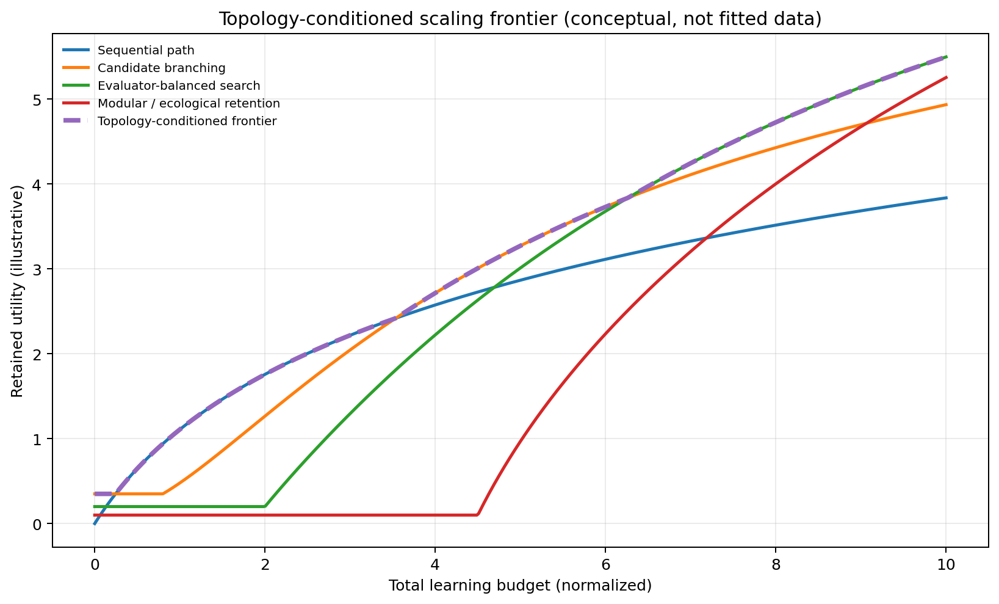{width=86%}

If total budget is partitioned as

$$
C=C_D+C_E+C_I+C_C,
$$

for discovery, evaluation, integration, and coordination, an interior optimum should approximately equalize marginal retained-utility gains:

$$
\frac{\partial U}{\partial C_D}
\approx
\frac{\partial U}{\partial C_E}
\approx
\frac{\partial U}{\partial C_I}
\approx
\frac{\partial U}{\partial C_C}.
$$

This is a controller target, not an assumed smooth law.

### 11.11 Morphology conjecture

The combined principles suggest a recurring architecture under heterogeneous tasks, imperfect evaluators, finite communication, and nontrivial integration interference.

**LCT Morphology Conjecture.** High-performing systems in that regime will tend toward learning-process topologies that are:

- hierarchical and multiscale;
- dense locally among compatible identities and sparse globally;
- multiplex across semantic channels;
- modular where fusion causes interference;
- asymmetric between stable incumbents and experimental branches;
- reversible while uncertainty is high;
- increasingly committed as validation accumulates;
- archive-backed under nonstationarity;
- and capacity-matched across discovery, evaluation, credit, and integration.

This is not a theorem. It is a compact empirical hypothesis generated by the theory.

## 12. Adaptive Branch–Validate–Integrate as a generated topology

ABVI is a reference architecture derived from LCT, not the definition of LCT and not a universal training algorithm.

### 12.1 Components

An extended ABVI system contains:

1. a stable incumbent or shared base;
2. a topology controller monitoring progress, uncertainty, interference, evaluator adequacy, integration adequacy, and option value;
3. adaptive identity refinement through forking or decomposition;
4. deliberately differentiated branches, modules, objectives, evidence, environments, or optimizers;
5. an anchored evaluator ecology;
6. active candidate-evaluator allocation;
7. validation bundles with provenance and limitations;
8. an operator-indexed compatibility hyperrelation;
9. a typed integration forest;
10. adaptive knowledge placement;
11. branch salvage, archives, and shadow counterfactuals;
12. a semantic firewall and compute compiler.

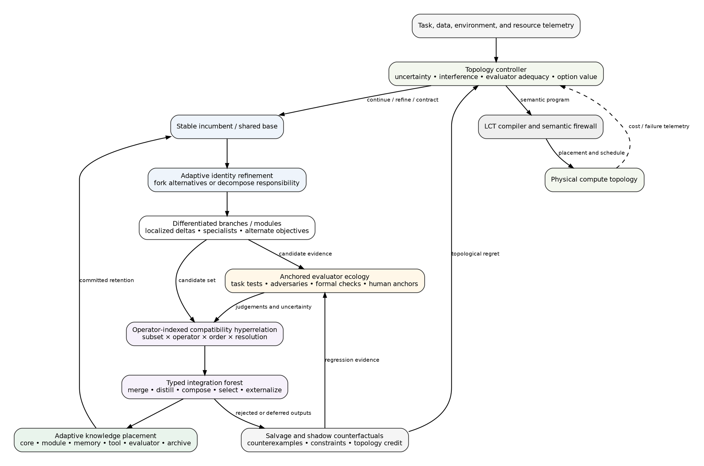{width=94%}

### 12.2 Localized epistemic branching

Full model copies are an expensive way to explore uncertainty that may be localized. Let $U_t$ be an uncertain subspace or module set and $P_{U_t}$ its projection. Branches can be:

$$
\theta_i
=
\theta_{\mathrm{incumbent}}+P_{U_t}\delta_i.
$$

This shares stable capability, increases effective breadth per unit memory, improves causal attribution, and makes integration operate on small deltas. Branch directions should be chosen to span nonredundant uncertainty or conflict directions rather than merely different random seeds.

### 12.3 Trigger policy

ABVI expands topology when one or more conditions hold:

- learning progress plateaus;
- evaluator disagreement rises;
- gradient or credit conflict localizes;
- unexplained failure recurs;
- distribution shift is detected;
- uncertainty about an irreversible decision is high;
- the estimated value of information from branching exceeds its full carrying and validation cost.

A schematic condition is:

$$
\operatorname{VOI}_{\mathrm{branch}}
>
C_{\mathrm{train}}+C_{\mathrm{eval}}+C_{\mathrm{coord}}+C_{\mathrm{integrate}}+C_{\mathrm{delay}}.
$$

Topology contracts when branches converge, become redundant, or cost more than their option value.

### 12.4 Designed differentiation

A branch should declare its source of differentiation:

- evidence partition;
- random seed or exploration policy;
- objective;
- evaluator;
- environment or curriculum;
- architecture or module boundary;
- optimizer;
- memory state;
- historical lineage.

This permits effective-breadth auditing and avoids spending compute on clones.

### 12.5 Candidate-evaluator allocation

Let candidates be $B_i$, evaluators $E_j$, and observations $S_{ij}=E_j(B_i)$. ABVI need not evaluate every pair. It selects pairs to maximize expected reduction in uncertainty over consequential integration decisions, subject to cost and information boundaries.

The allocation model should account for evaluator genealogy and correlation. Ten copies of one judge should not count as evaluator width ten.

### 12.6 Validation bundles

A branch proposal returns:

$$
P_i=(\Delta_i,T_i,R_i,C_i,E_i,V_i),
$$

where:

- $\Delta_i$ is the learned change or artifact;
- $T_i$ is the test set and outcomes;
- $R_i$ is provenance and training history;
- $C_i$ is compatibility evidence;
- $E_i$ is evaluator evidence and uncertainty;
- $V_i$ is known limitations, residual risks, and reversibility information.

“Validation” is used rather than “verification” unless the bundle contains a formal certificate.

### 12.7 Integration policy

For candidate subset $S$, operator $o$, order $\pi$, and resolution $\rho$, ABVI queries $\chi(S,o,\pi,\rho)$. Possible routes are:

- **merge** for highly compatible state changes under capacity pressure;
- **distill** for behavior transfer across architectures or partially compatible sources;
- **compose** for complementary capabilities that should retain identity;
- **externalize** for exact, rare, volatile, or easily invoked knowledge;
- **select** when only one alternative should remain active;
- **continue** when evidence is insufficient;
- **archive** when future option value is positive;
- **retire after salvage** when remaining value is negative.

No global merge is attempted merely because all pairwise tests pass.

### 12.8 Shadow branches and topological regret

Important rejected alternatives can continue at lower fidelity, frequency, or capacity. Shadow branches estimate premature-pruning regret and detect when changed conditions make an archived path valuable. Their cost is included in controller accounting.

### 12.9 Pseudocode

```text
initialize incumbent, evaluator anchors, archive, controller
repeat:
    observe learning and realization telemetry
    estimate discovery, evaluation, credit, and integration bottlenecks
    decide whether to continue, fork, decompose, coarsen, or revive

    if topology expands:
        generate deliberately differentiated branches or modules
        allocate candidate-evaluator tests by expected decision information
        collect validation bundles and evaluator uncertainty
        construct operator-indexed compatibility hyperrelation
        search a typed integration forest under capacity and reversibility constraints
        place accepted knowledge in core, modules, memory, tools, tests, or archive
        salvage useful outputs from rejected branches
        retain selected shadow counterfactuals

    update topology-controller credit from matched interventions and delayed outcomes
    compile the semantic program to compute under an explicit realization guarantee
until stopping or deployment criterion
```

### 12.10 Predicted regime and failure regime

ABVI should be most useful when:

- the objective is multimodal, deceptive, or nonstationary;
- uncertainty and interference can often be localized;
- evaluators are imperfect but partly independent;
- branch compatibility varies;
- integration and future option value matter.

It should lose to simpler sequential training when:

- the objective is smooth and locally informative;
- one evaluator is reliable;
- branches are redundant;
- integration is known to be safe;
- branch, validation, and control overhead dominate.

A universal superiority claim would contradict LCT’s central phase-regime thesis.

## 13. Reference implementation and compiler model

The artifact includes a deliberately small executable model. It is not a production distributed-training system. Its purpose is to test whether the definitions can be made operational and whether canonical distinctions survive translation into code.

### 13.1 Pipeline

The implemented pipeline is:

$$
\text{LCT-IR}
\rightarrow
\text{semantic validation}
\rightarrow
\text{LCNF}
\rightarrow
\text{execution dependency graph}
\rightarrow
\text{compute placement and schedule}.
$$

The command-line interface supports:

```text
lct validate program.json
lct normalize program.json
lct compile program.json
```

### 13.2 Validator

The validator checks:

- known stores, events, identities, and dependencies;
- operator-specific input and output types;
- single-writer state versions;
- explicit forking and typed many-to-one integration;
- evidence-partition boundaries;
- authority requirements;
- hidden adaptive state in opaque events;
- conflict-set validity;
- instantaneous causal cycles;
- compute-device and link consistency.

The current executable code implements the v0.1 core operator set. The manuscript’s v0.2 additions (`decompose`, `externalize`, reversibility, higher-order compatibility, and knowledge destination) are specified in the paper and supplement as extensions; they are not all compiled by the current reference runtime.

### 13.3 Normalizer

The normalizer creates adaptive state versions, infers dependencies, performs transitive reduction, detaches physical placement, generates canonical identifiers, and emits JSON and Graphviz representations. Canonical hashes allow normalized encodings to be compared and regression-tested.

### 13.4 Abstract compiler and scheduler

The compiler maps events to eligible abstract devices through a greedy earliest-finish scheduler. Communication cost is estimated from declared bytes, link bandwidth, and latency. Event duration combines work divided by device speed with declared latency and transfer time. The model is intentionally simple; it exists to expose the semantic-execution boundary, not to compete with systems such as Alpa [27].

### 13.5 Demonstration schedules

Table 2 reports three toy schedules on the included abstract substrate. Units are dimensionless and should not be interpreted as hardware benchmarks.

**Table 2. Demonstration schedules on the abstract LCT compute substrate.**

| Program | Work units | Makespan | Summed communication time | Model-level adaptive interpretation |
|---|---:|---:|---:|---|
| Sequential SGD | 86 | 0.7167 | 0.0000 | one adaptive identity path |
| Data-parallel SGD | 88 | 0.5420 | 0.0820 | one adaptive identity; parallel evidence and credit |
| Federated-averaging round | 92 | 1.1237 | 0.9327 | local adaptive identities followed by merge |

The example is deliberately small but demonstrates the intended separation. Data parallelism improves makespan without creating persistent model-level plurality. Federated averaging changes the learning topology and incurs communication for semantic state integration.

### 13.6 Validation status

At manuscript generation time:

- eleven unit tests pass;
- nine parameterized example subtests pass;
- nine complete JSON examples pass the reference semantic checker;
- normalized outputs and schedules are included;
- the source phase-diagram data are preserved alongside figures.

### 13.7 Current implementation limits

The prototype does not yet include:

- stochastic-kernel execution beyond declared metadata;
- continuous-time processes;
- a production placement optimizer;
- automatic extraction from arbitrary training code;
- formal equivalence checking beyond structural normalization;
- v0.2 adaptive identity decomposition and integration-forest execution;
- learned topology synthesis;
- real neural training workloads.

These omissions are explicit to prevent the artifact from being presented as empirical validation of the full theory.

## 14. Analytical and toy phase diagrams

This section presents six reproducible diagrams. The first three use toy simulations or analytical utility functions; the final three are analytical design maps. All boundaries and raw grids are included in CSV form. They are not fitted empirical laws.

### 14.1 Search topology versus landscape and evaluator quality

The first model compares sequential local search, ephemeral fork-select, persistent islands, and ABVI under matched evaluator-call budgets and normalized topology carrying penalties. The axes vary landscape ruggedness or multimodality and evaluator error.

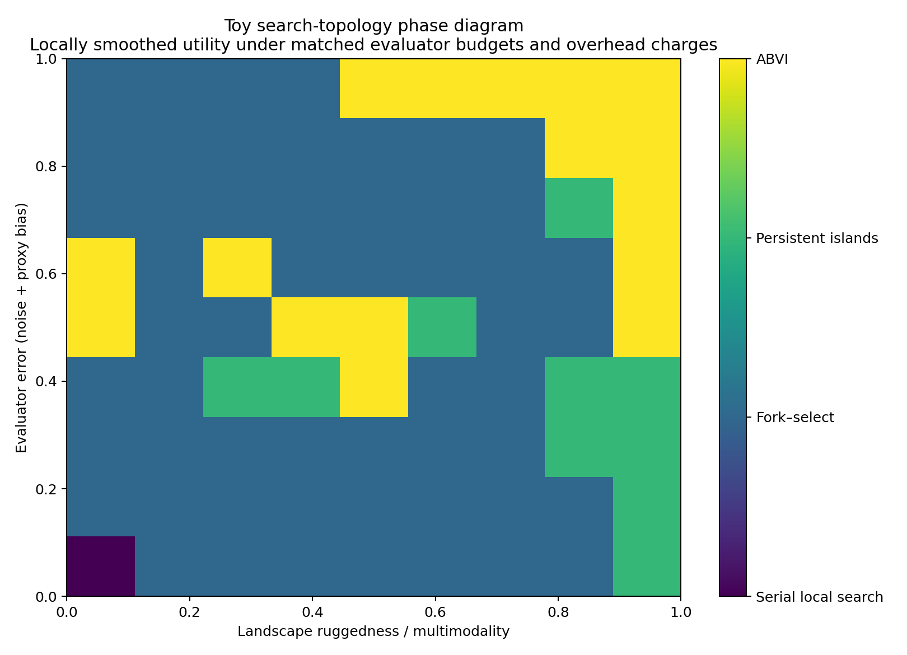{width=88%}

The qualitative hypothesis is that reliable evaluators and multimodal objectives increase the value of persistent or adaptive branching, whereas evaluator error reduces the value of breadth and can favor simpler commitment. The exact cell boundaries have no claim to universality.

### 14.2 Synchronization versus data heterogeneity and communication cost

A second model varies client-objective heterogeneity and communication cost while choosing the number of local steps between synchronizations.

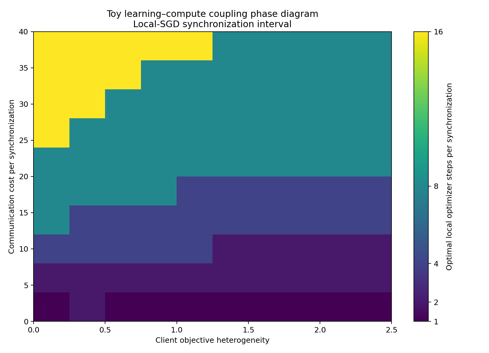{width=88%}

The diagram encodes a familiar but important LCT lesson: frequent synchronization can suppress drift but incur communication and homogenization; sparse synchronization can preserve local adaptation but increase incompatibility. The best interval is a joint property of evidence topology and compute geometry.

### 14.3 Integration operator versus incompatibility and deployment capacity

A third analytical model compares parameter merging, distillation, modular composition, and selection as branch incompatibility and deployment-capacity multiplier vary.

{width=88%}

This diagram operationalizes Proposition 6: integration choice should depend on compatibility, capacity, and tolerated distortion, not a default preference for one fused model.

### 14.4 Retained-learning bottleneck regimes

Define normalized capacities:

$$
\rho_E=\frac{C_E}{C_D},\qquad
\rho_I=\frac{C_I}{C_D}.
$$

The analytical map classifies evaluation-limited, integration-limited, discovery-limited, and mixed regimes.

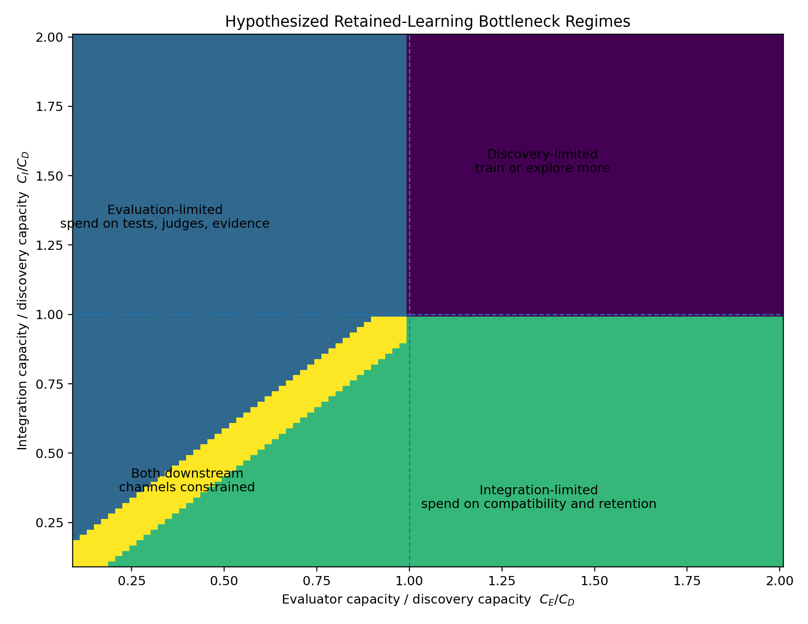{width=90%}

The map suggests a directly testable resource-allocation policy: scale the active semantic bottleneck rather than candidate generation by default.

### 14.5 Adaptive causal refinement

The ACR map varies interface insufficiency and the value-to-cost ratio of exposing finer distinctions.

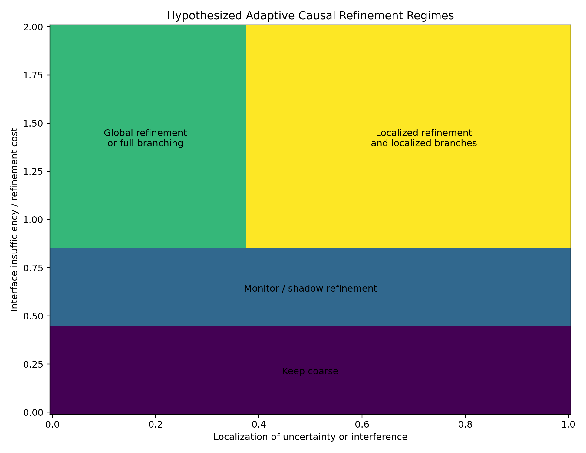{width=90%}

The proposed policy is analogous to adaptive mesh refinement: open only those process regions whose coarse interface is no longer sufficient, then contract them after stable interface behavior is reestablished.

### 14.6 Reversible integration

The final analytical map varies compatibility confidence and future option value.

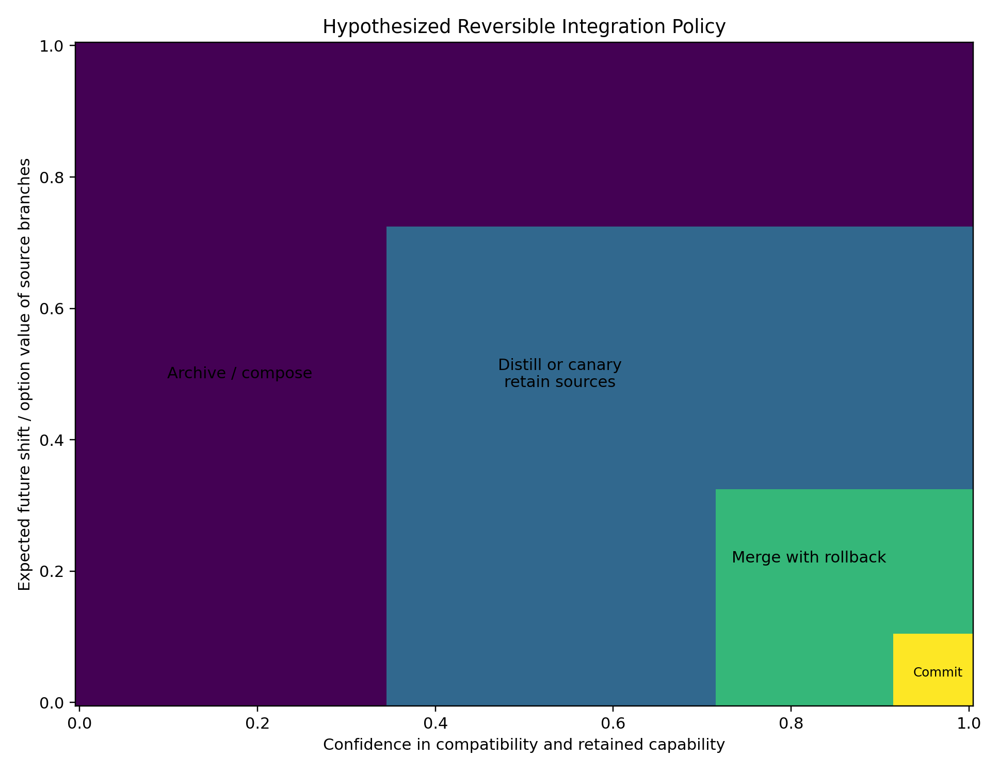{width=90%}

This map illustrates commitment annealing rather than a fixed integration operator.

### 14.7 Interpretation discipline

The diagrams serve three purposes:

1. they make qualitative hypotheses precise enough to test;
2. they show how LCT variables can define regime maps;
3. they supply target behavior for future topology controllers.

They do not establish that the chosen utility functions describe neural training at scale. The manuscript’s empirical agenda is to replace these analytical boundaries with measured phase diagrams under controlled workloads.

## 15. Experimental and falsification program

The appropriate test of LCT is not whether one proposed topology wins on average. It is whether the framework predicts when different topologies become preferable, supports faithful encodings, and generates useful designs not copied from a named method.

### 15.1 Task axes

Experiments should independently vary:

- smooth versus rugged objectives;
- unimodal versus multimodal search;
- honest versus deceptive proxy objectives;
- stationary versus nonstationary distributions;
- homogeneous versus heterogeneous evidence;
- compatible versus interfering capabilities;
- reliable versus noisy or biased evaluators;
- cheap versus expensive communication;
- cheap versus expensive high-fidelity evaluation;
- low versus high branch-recreation cost;
- low versus high integration capacity.

### 15.2 Compute substrates

At minimum, compare:

- one accelerator with time-multiplexed branches;
- a tightly connected multi-accelerator node;
- hierarchical node and rack topology;
- weakly connected islands;
- heterogeneous and preemptible devices;
- federated clients with private evidence;
- evaluation-limited environments.

### 15.3 Budget accounting

Every topology comparison must price:

- training work;
- evaluator work and human attention;
- communication;
- memory residency;
- storage and archive maintenance;
- controller overhead;
- integration testing;
- wall-clock delay;
- failure and rollback cost.

Without this accounting, a population can appear better simply because it consumed more total experiment and evaluation budget.

### 15.4 Core experiments

#### Experiment 1: same learning topology, different compute topology

Hold the semantic LCT program fixed and vary placement, collective implementation, schedule, precision, and failure pattern. Measure runtime, communication, staleness, and semantic distortion. This tests the compiler boundary.

#### Experiment 2: same compute topology, different learning topology

Hold hardware and total budget fixed. Compare a single path, fork-select, persistent islands, core-satellite learning, quality-diversity archives, evaluator ecologies, and adaptive control. This tests whether process topology explains outcomes beyond raw compute.

#### Experiment 3: same graph silhouette, different semantics

Use identical fork-join structures with selection, gradient aggregation, parameter merging, distillation, and composition. Measure lineage, capability retention, deployment cost, and reversibility. This tests the need for typed joins.

#### Experiment 4: effective breadth

Use equal raw branch counts with identical seeds and evidence, random-seed variation, differentiated evidence, differentiated objectives, and deliberate behavioral diversity. Test whether effective breadth predicts exploration value better than population size.

#### Experiment 5: evaluator-channel scaling

Hold candidate width fixed and vary one evaluator, duplicated correlated evaluators, independent evaluators, adversarial evaluators, and formal checks. Measure selection error, Goodhart exploitation, and information per evaluator cost.

#### Experiment 6: higher-order integration

Train branch sets with designed pairwise and higher-order interactions. Compare flat global merge, random binary merge trees, similarity-ordered trees, pairwise compatibility graphs, operator-indexed compatibility hyperrelations, and mixed integration forests. Test whether pairwise safety fails under higher-order composition and whether operator order matters.

#### Experiment 7: adaptive identity resolution

Use multitask environments whose relationships shift from compatible to interfering and back. Compare a monolithic learner, fixed independent learners, fixed MoE, one static conflict-based split, and dynamic decomposition/coarsening. Measure transfer, interference, coordination cost, and recovery.

#### Experiment 8: semantic bottleneck matching

Under fixed total compute, vary allocation to candidates, evaluators, compatibility testing, and integration. Compare candidate-only scaling, fixed ratios, and a bottleneck-aware controller. Test the retained-learning phase predictions.

#### Experiment 9: adaptive knowledge placement

Create capabilities varying in use frequency, latency sensitivity, update rate, compatibility, and verifiability. Compare all-internal, all-tool, fixed hybrid, and adaptive placement policies.

#### Experiment 10: salvage before retirement

Compare populations that discard rejected branches with populations that extract counterexamples, evaluator corrections, compatibility constraints, artifacts, and topology-control data. Hold branch survival rates constant.

#### Experiment 11: multiplex synchronization

Compare one communication topology for all information with separate graphs and clocks for parameter updates, counterexamples, validated artifacts, evaluator judgements, and control messages. Test whether typed multiplex routing preserves specialization while spreading hazards rapidly.

#### Experiment 12: reversible integration under shift

Compare immediate merge and source deletion, permanent composition, one-shot distillation, and staged reversible integration. Introduce an unannounced distribution shift and measure cumulative utility, recovery, rollback latency, and carrying cost.

### 15.5 Phase-diagram objective

The target result is:

$$
\mathcal T^*
=f(\text{task},\text{evidence},\text{evaluator},\text{nonstationarity},\text{substrate},\text{budget}).
$$

Rather than reporting one winner, experiments should estimate boundaries between regimes and their uncertainty.

### 15.6 Framework falsification criteria

LCT should be revised or rejected if any of the following persist.

#### Primitive-set failure

An important mechanism cannot be faithfully represented without a bespoke primitive or opaque adaptive node.

#### Canonicality failure

Independent encoders produce radically different normal forms under the same resolution contract and normalization rules.

#### Equivalence failure

The framework declares two mechanisms equivalent on specified observables, but controlled interventions produce systematic unexplained differences.

#### Cost-model failure

Execution and compute annotations repeatedly fail to predict work, communication, memory, staleness, or throughput even after appropriate calibration.

#### Predictive failure

Topology variables do not improve predictions over conventional descriptors such as parameter count, optimizer, batch size, and total compute.

#### Generative failure

Topology synthesis produces no useful design beyond manually named existing methods.

#### Controller failure

An adaptive topology controller does not beat strong fixed schedules, random rewrites, resource-matched populations, or hindsight-selected fixed topologies after its overhead is charged.

## 16. Safety, authority, and topology-specific attack surfaces

LCT makes structural vulnerabilities visible that are easy to miss when training is described only as parameter optimization.

### 16.1 Sybil breadth

An attacker can create many correlated branches or judges to manufacture the appearance of independent agreement. Effective breadth and genealogy must replace raw counts.

### 16.2 Evaluator monoculture and proxy amplification

Several evaluator instances may share the same blind spot. Wider search under a single misspecified proxy can accelerate reward hacking rather than reduce it [40], [41]. Anchors, adversarial tests, held-out channels, and evaluator lineage are part of the process topology.

### 16.3 Merge-order and higher-order attacks

Non-associative integration permits order manipulation. Individually and pairwise safe components can create a harmful higher-order composition. Operator-indexed compatibility and deterministic contribution ordering are therefore security controls as well as performance tools [34], [35].

### 16.4 Provenance laundering

A dangerous update may move through branches, artifacts, or distillation until its source is obscured. Every accepted state change should retain ancestry and evidence lineage through integration.

### 16.5 Branch starvation and controller capture

Resource allocation can quietly prevent a competing lineage from receiving enough training or evaluation to succeed. A branch may also attempt to influence the controller that allocates future resources. Control and authority states must be explicit and separately governed.

### 16.6 Archive erasure and rollback denial

Destroying older states can hide pruning regret and prevent recovery. Reversibility annotations should declare rollback dependencies before destructive operations execute.

### 16.7 Evidence leakage

Held-out evaluator evidence can leak to candidates through memory, prompts, artifacts, or shared models. Multiplex information-flow policy must distinguish permissible judgement transfer from forbidden answer leakage.

### 16.8 Stratified reflexive control

A self-modifying LCT system should separate timescales and authority layers:

- level 0 updates model and memory state;
- level 1 rewrites the learning topology;
- level 2 updates the topology controller;
- level 3 constrains authority and constitutional invariants.

A controller should not rewrite its own evaluator, authority, and update rule in one unobserved transition. Delayed, versioned, independently audited changes reduce circular self-authorization.

## 17. Limitations and threats to validity

### 17.1 Breadth versus usefulness

A framework that can represent everything risks explaining nothing. LCT addresses this with an opacity discipline, normal form, typed operators, measurable observables, and falsification criteria. Whether these are sufficient remains empirical.

### 17.2 Formal scope

The representation theorem covers finite explicit-state systems. Continuous-time adaptation, unbounded identity creation, hidden runtime state, quantum processes, and unrestricted self-reference require extension. The semantic-cut theorem is stated for a staged Markov pipeline and no-side-channel assumption.

### 17.3 Resolution dependence

Topology depends on the chosen adaptive unit and temporal grain. Resolution contracts make this explicit but do not eliminate judgment. Some systems may admit several equally useful coarse-grainings.

### 17.4 Operationalizing information capacity

Evaluator information, capability information, and semantic channel capacity are difficult to estimate in large neural systems. Practical proxies may use finite test families, intervention distributions, description length, calibration, or learned similarity. These proxies can themselves be gamed.

### 17.5 Integration semantics are domain-specific

A general type `merge` cannot determine whether a particular neural merge is safe. LCT records the operation and its evidence; domain-specific compatibility analysis remains necessary.

### 17.6 Computational tractability

Searching over graph rewrites, identity partitions, evaluator allocations, integration forests, knowledge destinations, and physical placements is combinatorial. Practical controllers will require restricted grammars, hierarchical search, learned priors, multi-fidelity evaluation, and strong baselines.

### 17.7 Preliminary experiments

The included phase diagrams are toy or analytical. They demonstrate how LCT hypotheses can be made testable, not that the hypotheses are already empirically established on large models.

### 17.8 Related-work completeness

The novelty matrix is broad but not exhaustive. Relevant work is distributed across machine learning, optimization, concurrency theory, programming languages, information theory, distributed systems, evolutionary computation, and multi-agent systems. Claims should remain capability-specific and update as the literature evolves.

### 17.9 Terminology collision

“Topological machine learning” and “topological deep learning” commonly refer to learning over topological domains or methods using algebraic topology. LCT uses topology in the process and systems sense: typed causal incidence, connectivity, and rewrite among adaptive entities. The paper must state this distinction whenever the term is introduced to a new audience.

## 18. Discussion

### 18.1 Why this is more than distributed training

Distributed training asks how to execute a learning computation efficiently. LCT also asks which adaptive identities should exist, which evidence and evaluators they should encounter, which alternatives should remain alive, how their knowledge should be integrated, and where it should be retained. These are semantic choices even when they are motivated by hardware.

### 18.2 Why this is more than AutoML

AutoML typically searches architectures, hyperparameters, pipelines, or training recipes. LCT supplies a process language in which the search object can include lineage, evaluator topology, credit topology, integration programs, archives, authority, and realization guarantees. Topology synthesis can be implemented through AutoML methods, but the search space and semantics are broader.

### 18.3 Why this is more than population training

Population methods instantiate adaptive plurality. LCT distinguishes ephemeral proposals from persistent identities, raw population size from effective breadth, candidate generation from evaluator information, and branch selection from integration and knowledge placement. A population is one family of learning-process topology.

### 18.4 Why this is more than category theory or process calculus

Category theory, event structures, Petri nets, and open systems supply compositional mathematical machinery. LCT’s intended contribution is an applied scientific layer: learning-specific types, canonical encodings, measurement, compiler contracts, phase diagrams, controller objectives, and falsifiable architecture hypotheses.

### 18.5 Implications for scaling

If topology-conditioned scaling is correct, then extrapolating a fixed training recipe can understate the achievable frontier or misallocate resources. At different budgets, the limiting resource may shift from candidate generation to evaluation, integration, coordination, memory, or authority. Scaling the same topology harder is not equivalent to scaling learning itself.

### 18.6 Implications for continual and self-improving systems

Continual learning magnifies topology decisions because errors accumulate and irreversible commitments matter. A self-improving system needs stable identities, experimental regions, evaluator anchors, provenance, rollback, archives, and controlled graph rewrite. LCT provides a language for specifying these requirements without assuming that all improvement occurs through one model’s weights.

### 18.7 The scientific objective

The mature goal is not one preferred architecture. It is a conditional science that predicts:

- when sequential exploitation dominates;
- when breadth is worth its evaluation cost;
- when identities should split or recombine;
- when synchronization should be frequent or sparse;
- when capabilities should merge, distill, compose, externalize, or archive;
- how topology should map onto a substrate;
- and how much confidence is required before options are irreversibly destroyed.

## 19. Conclusion

Learning systems have a causal organization that is not captured by model architecture, optimizer name, or hardware parallelism alone. They create and transform persistent adaptive identities; route evidence; produce judgements; assign credit; exchange state and artifacts; preserve or destroy alternatives; integrate discoveries; change their own structure; and execute on constrained physical substrates.

Learning–Compute Topology formalizes this organization as a typed, multiscale, dynamically rewritable adaptive process connected to compute through an explicit compiler boundary. Serial and parallel composition become foundational relations rather than an exhaustive taxonomy. The LCT intermediate representation, Learning Causal Normal Form, equivalence hierarchy, and initial propositions provide a bounded formal nucleus. The canonical coverage suite shows how familiar mechanisms occupy different regions of the space. The derived consequences - adaptive identity resolution, semantic cuts, multiplex synchronization, higher-order integration forests, adaptive knowledge placement, reversibility-weighted commitment, branch salvage, and topology-conditioned scaling - turn the framework from a descriptive taxonomy into a generative research program.

The deepest conclusion is:

> **The object to optimize is not only a model, population, graph, or hardware schedule. It is a dynamically partitioned, multiplex, capacity-matched adaptive process whose discoveries are evaluated, placed, integrated, preserved, and executed according to compatibility, uncertainty, reversibility, authority, and cost.**

Whether that framing becomes a useful science depends on the next step: controlled phase diagrams, faithful normalizations, predictive metrics, compiler checks, and topology-generated systems that succeed in the regimes the theory predicts.

## Appendix A. Glossary

| Term | Standard meaning in LCT |
|---|---|
| Adaptive state | Persistent state changed by evidence or outcomes and capable of affecting future behavior or learning |
| Adaptive identity | Independently versioned adaptive-state bundle with lineage, write authority, lifecycle, and possible divergence |
| Learning-process topology | Typed causal organization of adaptive identities, evidence, judgement, credit, transfer, integration, archives, and control |
| Compute-realization topology | Physical organization of processors, memory, interconnects, storage, placement, schedule, and failure domains |
| Execution topology | Causal dependency graph produced by compiling a semantic learning process |
| Evidence topology | Routing of data, trajectories, environments, demonstrations, or artifacts |
| Evaluation topology | Who or what produces judgements about whom or what |
| Credit topology | How judgement is assigned to responsible identities, states, actions, or structural decisions |
| Fork | Creation of alternative descendant identities |
| Decompose | Partitioning one responsibility into jointly composed specialized identities |
| Merge | Fusion into one adaptive identity or state |
| Compose | Retention of multiple identities inside a higher-level system |
| Distill | Behavior-mediated transfer into a student identity |
| Externalize | Retention as memory, tool, program, test, or artifact rather than fused adaptive state |
| Archive | Preservation of inactive state or artifacts for future option value |
| Commitment width | Number of recoverable future alternatives |
| Effective breadth | Similarity-adjusted number of distinct hypotheses or evaluators |
| Realization leakage | Change in adaptive-history distribution caused by compute placement or scheduling |
| Semantic firewall | Boundary preventing compute optimization from silently changing learning semantics |
| LCNF | Canonical adaptive causal skeleton at a declared resolution |
| Topological regret | Utility lost because of branching, pruning, integration, or structural allocation decisions |

## Appendix B. Operator reference

| Operator | Identity effect | Typical inputs | Typical outputs |
|---|---|---|---|
| instantiate | $0\rightarrow n$ | control, static, resources | new adaptive identities |
| observe | preserve | adaptive state, evidence | behavior or measurement artifact |
| evaluate | preserve | observation, evidence, evaluator state | judgement |
| assign_credit | preserve | judgement, lineage, control | credit |
| update | $1\rightarrow1$ | adaptive state, credit | successor version |
| fork | $1\rightarrow n$ | adaptive state, control | alternative descendants |
| decompose | $1\rightarrow n$ plus composer | adaptive state, decomposition rule | specialized identities and router |
| aggregate | usually preserve | several signals | aggregate signal |
| synchronize | $n\rightarrow n$ or $n\rightarrow1$ | states or updates | mixed or common state |
| select | $n\rightarrow m$ | candidates, judgement | retained subset |
| merge | $n\rightarrow1$ | adaptive states | fused state |
| distill | $n\rightarrow1$ | teacher behavior, student state | trained student |
| compose | $n\rightarrow n$ within one system | components, router | composite deployment |
| transfer | preserve identities | source state or artifact | updated destination or message |
| externalize | preserve or reduce active identity | learned information | memory, tool, test, artifact |
| archive | active to inactive | adaptive state or artifact | recoverable archive state |
| restore | inactive to active | archive state | active adaptive identity |
| retire | $n\rightarrow0$ | adaptive state | provenance/tombstone, optional salvage |
| route | preserve | control, evidence, identities | routed information |
| allocate | preserve | resources, priorities | resource assignments |
| rewire | graph rewrite | control, authority | changed active topology |
| checkpoint | preserve | adaptive state | rollback artifact |
| emit | preserve | internal result | external artifact or telemetry |
| pure | none | typed values | stateless values |

## Appendix C. LCT-IR concrete sketch

The executable JSON schema and EBNF grammar are included in the artifact. A simplified human-readable fragment is:

```text
program      ::= metadata resolution store* event* conflict* rewrite* compute?
store        ::= id kind data_type identity? version? partition? capacity? authority* metadata?
event        ::= id operator input* output* dependency* guard? effect* authority* cost? delay? metadata?
input        ::= store_ref access_mode bytes? role?
output       ::= store_ref access_mode bytes? role?
conflict     ::= event_id event_id+ reason?
rewrite      ::= id trigger action semantic_class authority* metadata?
compute      ::= guarantee tolerance device+ link*
```

The full grammar defines enumerations and field constraints. The reference JSON schema is machine-checkable.

## Appendix D. Claim-to-evidence map

| Claim | Status | Evidence in package |
|---|---|---|
| Serial/parallel composition is not causally complete | proved in finite poset model | Proposition 1 |
| Copying alone creates no conditional information | proved under conditional independence | Proposition 2 |
| Bounded explicit-state systems admit trace-faithful encoding | bounded representation theorem | Proposition 3 and canonical examples |
| Coarse-graining is exact under interface sufficiency | proved under stated condition | Proposition 4 |
| Evaluator information limits selection | direct Fano consequence | Proposition 5 |
| Fixed-capacity integration limits exact retention | information-theoretic bound | Proposition 6 |
| Staged retained learning is limited by weakest semantic cut | proved under staged Markov/no-side-channel model | Proposition 7 |
| Thirty mechanism families are distinguishable in LCT | manual coverage study | coverage matrix; nine executable encodings |
| LCT-IR can be validated, normalized, and abstractly compiled | implemented bounded prototype | source code and tests |
| Preferred topology changes across regimes | conjecture with toy/analytical illustrations | six phase diagrams and CSV data |
| ABVI is useful in multimodal, evaluation-imperfect regimes | falsifiable hypothesis | ABVI specification and proposed experiments |
| Adaptive identity resolution and integration forests improve real training | open empirical hypothesis | experimental agenda |

## Appendix E. Artifact and reproducibility statement

The download package contains:

- the paper in Markdown and DOCX;
- the citation database;
- all manuscript figures;
- source CSVs for every phase diagram;
- the novelty capability matrix and coding protocol;
- the thirty-mechanism coverage matrix;
- the LCT-IR specification, EBNF grammar, and JSON schema;
- the LCNF and ABVI specifications;
- nine canonical JSON encodings and normalized outputs;
- the Python validator, normalizer, compiler, scheduler, and simulator;
- tests and example commands;
- integrity manifests and checksums.

The analytical diagrams are labeled as such. Reproducing the figures does not require external services. The reference code is a research prototype and does not include a license grant beyond the delivered artifact unless a separate license is later added by the author.
## References

1. H. B. McMahan, E. Moore, D. Ramage, S. Hampson, and B. A. U. Arcas. “Communication-efficient learning of deep networks from decentralized data.” *Proceedings of the 20th international conference on artificial intelligence and statistics*, vol. 54, pp. 1273-1282, PMLR, 2017. <https://proceedings.mlr.press/v54/mcmahan17a.html>.

2. S. U. Stich. “Local SGD converges fast and communicates little.” *International conference on learning representations*, 2019. <https://arxiv.org/abs/1805.09767>.

3. A. Douillard, Q. Feng, A. A. Rusu, et al. “DiLoCo: Distributed low-communication training of language models.” *arXiv preprint arXiv:2311.08105*, 2023. <https://arxiv.org/abs/2311.08105>.

4. M. Jaderberg, V. Dalibard, S. Osindero, et al. “Population based training of neural networks.” *arXiv preprint arXiv:1711.09846*, 2017. <https://arxiv.org/abs/1711.09846>.

5. J. B. Mouret and J. Clune. “Illuminating search spaces by mapping elites.” *arXiv preprint arXiv:1504.04909*, 2015. <https://arxiv.org/abs/1504.04909>.

6. M. Li, S. Gururangan, T. Dettmers, et al. “Branch-train-merge: Embarrassingly parallel training of expert language models.” *arXiv preprint arXiv:2208.03306*, 2022. <https://arxiv.org/abs/2208.03306>.

7. L. Espeholt, H. Soyer, R. Munos, et al. “IMPALA: Scalable distributed deep-RL with importance weighted actor-learner architectures.” *Proceedings of the 35th international conference on machine learning*, vol. 80, pp. 1407-1416, PMLR, 2018. <https://proceedings.mlr.press/v80/espeholt18a.html>.

8. M. Lanctot, V. Zambaldi, A. Gruslys, et al. “A unified game-theoretic approach to multiagent reinforcement learning.” *Advances in neural information processing systems*, vol. 30, 2017. <https://arxiv.org/abs/1711.00832>.

9. O. Vinyals. “Grandmaster level in StarCraft II using multi-agent reinforcement learning.” *Nature*, vol. 575, pp. 350-354, 2019. DOI: 10.1038/s41586-019-1724-z.

10. R. Wang, J. Lehman, J. Clune, and K. O. Stanley. “Paired open-ended trailblazer (POET): Endlessly generating increasingly complex and diverse learning environments and their solutions.” *arXiv preprint arXiv:1901.01753*, 2019. <https://arxiv.org/abs/1901.01753>.

11. C. Xu, Y. Hu, R. Wang, et al. “TacoMAS: Test-time co-evolution of topology and capability in LLM-based multi-agent systems.” *arXiv preprint arXiv:2605.09539*, 2026. <https://arxiv.org/abs/2605.09539>.

12. A. Iacob, A. Jovanović, W. F. Shen, et al. “The red queen gödel machine: Co-evolving agents and their evaluators.” *arXiv preprint arXiv:2606.26294*, 2026. <https://arxiv.org/abs/2606.26294>.

13. H. Ye. “Structured scaling of AI discovery across diverse scientific domains.” *arXiv preprint arXiv:2604.19341*, 2026. <https://arxiv.org/abs/2604.19341>.

14. M. Wortsman, G. Ilharco, S. Y. Gadre, et al. “Model soups: Averaging weights of multiple fine-tuned models improves accuracy without increasing inference time.” *Proceedings of the 39th international conference on machine learning*, vol. 162, pp. 23965-23998, PMLR, 2022. <https://arxiv.org/abs/2203.05482>.

15. G. Hinton, O. Vinyals, and J. Dean. “Distilling the knowledge in a neural network.” *arXiv preprint arXiv:1503.02531*, 2015. <https://arxiv.org/abs/1503.02531>.

16. C. Finn, P. Abbeel, and S. Levine. “Model-agnostic meta-learning for fast adaptation of deep networks.” *Proceedings of the 34th international conference on machine learning*, vol. 70, pp. 1126-1135, PMLR, 2017. <https://proceedings.mlr.press/v70/finn17a.html>.

17. I. Goodfellow, J. Pouget-Abadie, M. Mirza, et al. “Generative adversarial nets.” *arXiv preprint arXiv:1406.2661*, 2014. <https://arxiv.org/abs/1406.2661>.

18. J. Schulman, N. Heess, T. Weber, and P. Abbeel. “Gradient estimation using stochastic computation graphs.” *arXiv preprint arXiv:1506.05254*, 2015. <https://arxiv.org/abs/1506.05254>.

19. B. Fong, D. I. Spivak, and R. Tuyéras. “Backprop as functor: A compositional perspective on supervised learning.” *arXiv preprint arXiv:1711.10455*, 2017. <https://arxiv.org/abs/1711.10455>.

20. G. S. H. Cruttwell, B. Gavranović, N. Ghani, P. Wilson, and F. Zanasi. “Deep learning with parametric lenses.” *arXiv preprint arXiv:2404.00408*, 2024. <https://arxiv.org/abs/2404.00408>.

21. J. Hedges and M. Rodríguez Sakamoto. “Reinforcement learning in categorical cybernetics.” *arXiv preprint arXiv:2404.02688*, 2024. <https://arxiv.org/abs/2404.02688>.

22. G. Winskel. “Event structures.” *Petri nets: Applications and relationships to other models of concurrency*, vol. 255, pp. 325-392, Springer, 1987. DOI: 10.1007/3-540-17906-2_31.

23. K. Courser. “Open systems: A double categorical perspective.” *arXiv preprint arXiv:2008.02394*, 2020. <https://arxiv.org/abs/2008.02394>.

24. Y. Huang, Y. Sun, Z. Zhu, C. Yan, and J. Xu. “Tackling data heterogeneity: A new unified framework for decentralized SGD with sample-induced topology.” *Proceedings of the 39th international conference on machine learning*, vol. 162, pp. 9310-9345, PMLR, 2022. <https://proceedings.mlr.press/v162/huang22i.html>.

25. A. Tyurin and N. Sivtsov. “Birch SGD: A tree graph framework for local and asynchronous SGD methods.” *arXiv preprint arXiv:2505.09218*, 2025. <https://arxiv.org/abs/2505.09218>.

26. K. Santhanam. “DistIR: An intermediate representation and simulator for efficient neural network distribution.” *arXiv preprint arXiv:2111.05426*, 2021. <https://arxiv.org/abs/2111.05426>.

27. L. Zheng. “Alpa: Automating inter- and intra-operator parallelism for distributed deep learning.” *16th USENIX symposium on operating systems design and implementation*, pp. 559-578, USENIX Association, 2022. <https://arxiv.org/abs/2201.12023>.

28. N. Zaguia. “The series-parallel posets with no induced four-element crown.” *arXiv preprint arXiv:1811.07959*, 2018. <https://arxiv.org/abs/1811.07959>.

29. H. Daga, J. Shin, D. Garg, A. Gavrilovska, M. Lee, and R. R. Kompella. “Flame: Simplifying topology extension in federated learning.” *arXiv preprint arXiv:2305.05118*, 2023. <https://arxiv.org/abs/2305.05118>.

30. G. Syros, G. Yar, S. Boboila, C. Nita-Rotaru, and A. Oprea. “Backdoor attacks in peer-to-peer federated learning.” *arXiv preprint arXiv:2301.09732*, 2023. <https://arxiv.org/abs/2301.09732>.

31. A. Ecoffet, J. Huizinga, J. Lehman, K. O. Stanley, and J. Clune. “Go-explore: A new approach for hard-exploration problems.” *arXiv preprint arXiv:1901.10995*, 2019. <https://arxiv.org/abs/1901.10995>.

32. N. Shazeer, A. Mirhoseini, K. Maziarz, et al. “Outrageously large neural networks: The sparsely-gated mixture-of-experts layer.” *arXiv preprint arXiv:1701.06538*, 2017. <https://arxiv.org/abs/1701.06538>.

33. M. Choi and G. Kim. “Decentralized instruction tuning: Conflict-aware splitting and weight merging.” *arXiv preprint arXiv:2606.01717*, 2026. <https://arxiv.org/abs/2606.01717>.

34. T. Gong and S. Xu. “TwistedMerge: Certified higher-order diagnostics and abstention for model merging.” *arXiv preprint arXiv:2607.20887*, 2026. <https://arxiv.org/abs/2607.20887>.

35. R. Gillespie. “Conflict-free replicated data types for neural network model merging: A two-layer architecture enabling CRDT-compliant model merging across 26 strategies.” *arXiv preprint arXiv:2605.19373*, 2026. <https://arxiv.org/abs/2605.19373>.

36. F. Liu, Y. Fu, Y. Wang, and Q. Liu. “XALPHA: A memory-driven AI quant researcher for hypothesis-to-code alpha discovery.” *arXiv preprint arXiv:2607.08332*, 2026. <https://arxiv.org/abs/2607.08332>.

37. Z. Liu, J. Zhang, C. Liu, and Y. Zhu. “Active testing of large language models via approximate neyman allocation.” *arXiv preprint arXiv:2605.10075*, 2026. <https://arxiv.org/abs/2605.10075>.

38. T. M. Cover and J. A. Thomas. *Elements of information theory*. 2 ed. Wiley-Interscience, 2006.

39. A. Pasarkar and A. B. Dieng. “Cousins of the vendi score: A family of similarity-based diversity metrics for science and machine learning.” *Proceedings of the 27th international conference on artificial intelligence and statistics*, vol. 238, pp. 3808-3816, PMLR, 2024.

40. D. Manheim and S. Garrabrant. “Categorizing variants of goodhart’s law.” *arXiv preprint arXiv:1803.04585*, 2018. <https://arxiv.org/abs/1803.04585>.

41. E. M. El-Mhamdi and L. N. Hoang. “On goodhart’s law, with an application to value alignment.” *arXiv preprint arXiv:2410.09638*, 2024. <https://arxiv.org/abs/2410.09638>.

42. L. Gao, J. Schulman, and J. Hilton. “Scaling laws for reward model overoptimization.” *Proceedings of the 40th International Conference on Machine Learning*, vol. 202, pp. 10835-10866, PMLR, 2023. <https://arxiv.org/abs/2210.10760>.
