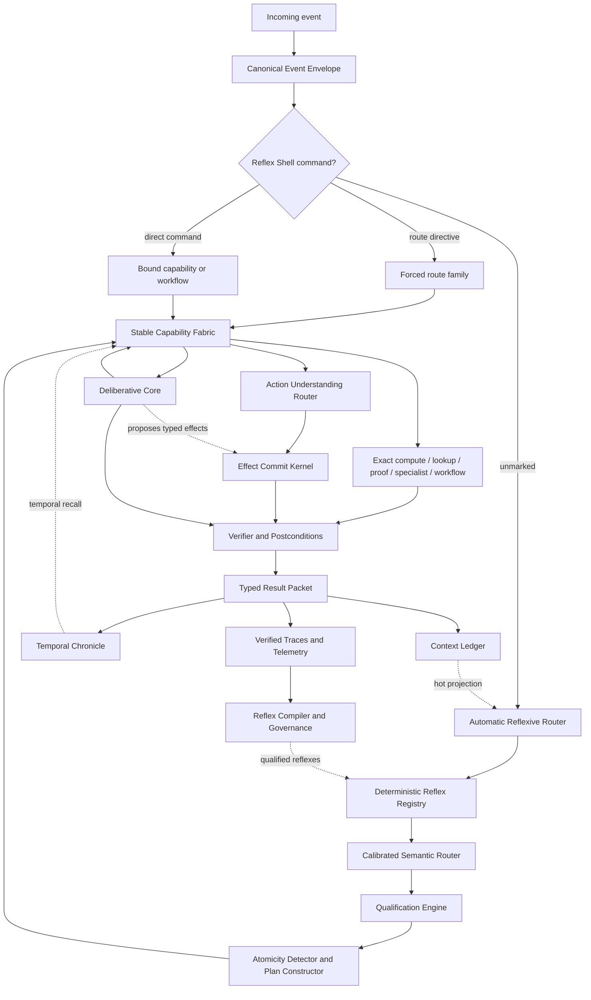
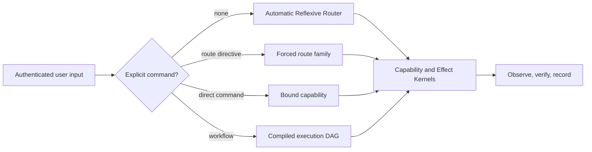
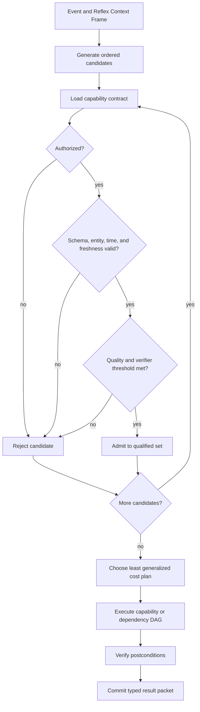
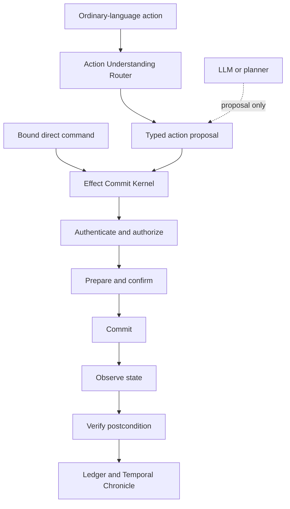
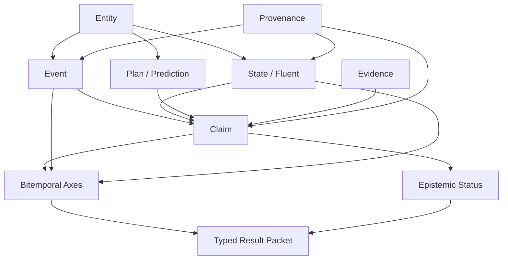
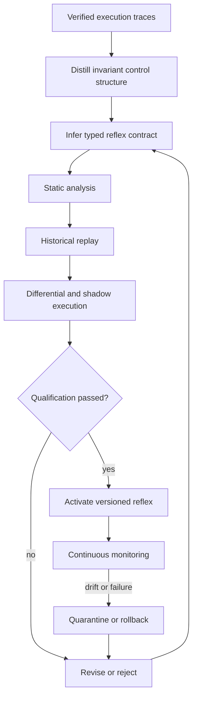

# The Reflexive Router

## A Pre-Deliberative Architecture for Fast, Governed, Tool-Native Intelligence

### System-0 Dispatch, Temporal Recall, and the Compilation of Reasoning into Reflex

**Standalone Architecture White Paper**  
**Version 1.2 · July 2026**

> **Central thesis.** Natural language is an input and control format, not evidence that a request requires generative reasoning. An intelligent system should use the least general *qualified* computation by default, while allowing an authenticated user to name the desired route, capability, or workflow directly. Automatic routing, exact commands, structured action, and deliberative intelligence should share one governed capability fabric and one typed context.

**Status:** Architectural proposal and research agenda. The term *System-0* is used as an engineering metaphor for a pre-deliberative execution layer; it is not a claim about a literal neurological mechanism.

<!-- PAGEBREAK -->

# Contents

- [Abstract](#abstract)
- [Executive Summary](#executive-summary)
- [1. Introduction](#1-introduction)
- [2. Problem Formulation](#2-problem-formulation)
- [3. Design Principles](#3-design-principles)
- [4. Architecture Overview](#4-architecture-overview)
- [5. Reflex Classes and Contracts](#5-reflex-classes-and-contracts)
- [6. The User Command Plane](#6-the-user-command-plane)
- [7. The Learned Router: Small, Calibrated, and Able to Refuse](#7-the-learned-router-small-calibrated-and-able-to-refuse)
- [8. Qualification-First Dispatch](#8-qualification-first-dispatch)
- [9. Composite Requests and Execution Graphs](#9-composite-requests-and-execution-graphs)
- [10. The Stable Capability Fabric](#10-the-stable-capability-fabric)
- [11. Structured Action and Effect Execution](#11-structured-action-and-effect-execution)
- [12. Typed Result Packets and Context Continuity](#12-typed-result-packets-and-context-continuity)
- [13. The Temporal Chronicle](#13-the-temporal-chronicle)
- [14. Reflex Compilation: Turning Repeated Reasoning into Procedure](#14-reflex-compilation-turning-repeated-reasoning-into-procedure)
- [15. Core Algorithms](#15-core-algorithms)
- [16. Safety, Security, and Governance](#16-safety-security-and-governance)
- [17. Threat Model and Failure Modes](#17-threat-model-and-failure-modes)
- [18. ReflexBench: Evaluation Program](#18-reflexbench-evaluation-program)
- [19. Implementation Blueprint](#19-implementation-blueprint)
- [20. Worked Examples](#20-worked-examples)
- [21. Relationship to Prior Work](#21-relationship-to-prior-work)
- [22. Implications for Advanced Intelligence](#22-implications-for-advanced-intelligence)
- [23. Open Research Questions](#23-open-research-questions)
- [24. Conclusion](#24-conclusion)
- [Appendix A. Example Reflex Contract](#appendix-a-example-reflex-contract)
- [Appendix B. Typed Result Packet Schema](#appendix-b-typed-result-packet-schema)
- [Appendix C. Canonical Outcomes](#appendix-c-canonical-outcomes)
- [Appendix D. Reflex Registration Checklist](#appendix-d-reflex-registration-checklist)
- [Appendix E. Suggested ReflexBench Record](#appendix-e-suggested-reflexbench-record)
- [Appendix F. Example User Command Descriptor](#appendix-f-example-user-command-descriptor)
- [Appendix G. User Command Registration Checklist](#appendix-g-user-command-registration-checklist)
- [Glossary](#glossary)
- [References](#references)

<!-- PAGEBREAK -->

# Abstract

Large language models have become the default computational substrate behind natural-language interfaces. This unification is convenient, but it encourages an architectural mistake: systems frequently invoke expensive generative inference for operations that are better performed by exact lookup, arithmetic, symbolic solvers, databases, APIs, cached procedures, specialist models, device controllers, or previously verified workflows. The interface is linguistic, but the underlying task often is not.

This paper proposes the **Reflexive Router**, a persistent pre-deliberative substrate that receives user, system, sensory, and scheduled events before the main language model. It first normalizes the event and inspects an authenticated **User Command Plane**. An unmarked request enters automatic qualification-first routing. A route directive such as `/calculate`, `/lookup`, `/do`, or `/lmh` constrains the computational family. A bound command such as `/bl`, `/weather`, or `/morning` invokes a pre-registered capability or workflow directly. Explicit commands may bypass inference, but they never bypass authentication, authority, type validation, consequence policy, verification, or audit.

For automatic requests, the system applies deterministic reflexes and then a small calibrated semantic router that can abstain. Candidate routes are admitted only when their contracts establish authorization, input validity, temporal freshness, expected quality, and verifiability. The router may select a single capability or construct a dependency-directed execution graph for a composite request. Only unresolved, ambiguous, novel, or high-judgment work reaches a deliberative model or planner. This is the **Minimum Sufficient Compute Principle**: use the least computationally general mechanism that is demonstrably sufficient for the job.

The architecture also recovers an important lesson from pre-LLM-centered voice assistants. SiriKit, App Intents, Alexa skills, and smart-home capability interfaces map requests into structured intents, entities, parameters, endpoint capabilities, and directives. The Reflexive Router generalizes that pattern without inheriting its closed-domain limitations. A familiar request such as turning off bedroom lights can pass through typed action understanding and a non-bypassable **Effect Commit Kernel** that authorizes, prepares, commits, observes, verifies, and records the state transition. A direct shortcut can skip action-language interpretation entirely while still entering the same governed execution kernel.

The proposal unifies five ideas that are usually treated separately. First, qualification-first dispatch chooses the cheapest qualified mechanism rather than the route with the largest classifier score. Second, all executors return a **typed result packet** carrying value, provenance, time scope, confidence, effects, verification status, dispatch provenance, and context handles. Third, a **Temporal Chronicle** represents events, states, claims, plans, and predictions using valid time, transaction time, provenance, contradiction links, and epistemic status. Fourth, a governed **Reflex Compiler** distills recurring successful deliberative traces into parameterized, executable, testable reflexes. Fifth, a versioned **User Command Registry** lets users compile their own stable computational vocabulary over the same capability fabric.

The claimed contribution is not that any component is individually unprecedented, but that their placement and contracts form a distinct systems architecture: a deterministic command plane before automatic routing, a non-generative first responder, structured effect execution outside the LLM, typed continuity across heterogeneous computations, bitemporal factual memory, and governed paths from repeated reasoning or user intent into direct procedural competence. The paper specifies the architecture, formal objective, interfaces, algorithms, security invariants, failure modes, implementation roadmap, and a proposed evaluation suite called **ReflexBench**.

# Executive Summary

Modern AI systems often behave as though every incoming sentence must be thought through by a large language model. That is equivalent to asking a human to consciously derive every multiplication, reconstruct every familiar fact, and re-plan every habitual action. Biological analogy should not be overextended, but it highlights a practical systems truth: mature intelligence depends on large amounts of fast, compiled, and non-deliberative competence.

The Reflexive Router is designed around ten claims:

1. **The prompt is an event, not a mandate to generate.** A natural-language request may denote a lookup, calculation, proof obligation, transaction, cached workflow, action request, or open-ended reasoning problem.
2. **Minimum sufficient compute should be the default.** The system should use the least general qualified mechanism that meets correctness, authorization, freshness, latency, and risk requirements.
3. **The user can address computation directly.** An authenticated user may force a route, select an LLM effort profile, or invoke a registered capability or workflow without automatic semantic routing.
4. **The user may bypass inference, never enforcement.** Commands do not create permissions, weaken consequence policy, remove type checks, or eliminate verification and audit.
5. **The main LLM should be a general fallback and synthesis engine.** It remains essential for ambiguity, novelty, planning, explanation, and judgment, but it should not be the mandatory first computational hop.
6. **Known effects should use a structured action plane.** Action understanding and effect execution are separate. Only the Effect Commit Kernel can authorize and commit external state changes.
7. **Conversation must outlive its executor.** Results from every route enter a common typed context ledger, so later reasoning can use earlier non-LLM results without losing reference, units, time, or provenance.
8. **Temporal knowledge is not a bag of text.** Events, durable states, source claims, plans, predictions, and corrections require explicit time and epistemic representation.
9. **Repeated reasoning should compile into reflex.** Successful recurring traces can become guarded programs, query templates, finite-state workflows, specialist policies, or user commands.
10. **Fast paths require stronger governance, not weaker governance.** Reflexes and commands are versioned, scoped, least-authority, testable, revocable, and continuously monitored.

The resulting interface has four levels of abstraction:

```text
ordinary language     -> automatic qualification-first routing
route directive       -> forced computational family
bound command         -> direct typed capability invocation
workflow command      -> compiled execution graph
```

The same interface can therefore be a calculator, theorem prover, historical database, personal memory, search engine, workflow engine, home-control surface, and creative collaborator. Unity is preserved at the interface without forcing uniformity beneath it.

# 1. Introduction

## 1.1 The LLM-first default

Large language models provide a remarkable universal adapter. They can parse informal requests, tolerate ambiguity, translate between representations, synthesize text, and coordinate tools. Their flexibility has made it convenient to put an LLM at the front of nearly every AI workflow.

Convenience, however, is not the same as architectural optimality. Consider the following requests:

- “What is 18.75 percent of 4,920?”
- “Convert 72 miles per hour to meters per second.”
- “Who held the French crown in 1512?”
- “Is this JSON valid against schema version 3?”
- “What is the next event on my calendar?”
- “Prove that this finite constraint set is satisfiable.”
- “Repeat the deployment procedure we verified yesterday.”

Each request can be presented in natural language. None inherently requires open-ended generation. An LLM can often answer them, but a calculator, temporal database, schema validator, calendar service, SAT solver, or compiled workflow can usually provide lower latency, lower cost, stronger reproducibility, and better verification.

The architectural error is subtle: because the **interface** is general, the **executor** is assumed to need to be general. This conflates interpretation with computation.

Existing conversational interfaces also over-privilege interpretation. Stable operations that would be keyboard shortcuts, shell aliases, function calls, voice-assistant intents, or application commands elsewhere are repeatedly sent through general inference. A user who already knows the desired path should be able to write `/calculate`, `/lookup`, `/do`, or `/lmh`; a familiar operation should be bindable to `/weather`, `/bl`, or `/morning`. The architecture must infer when necessary without making inference compulsory.

## 1.2 A prompt as an interrupt

The Reflexive Router treats an incoming prompt more like a typed interrupt than a block of prose handed directly to a model. The event first receives a compact envelope: principal, authority, time, modality, conversation handles, resource budget, and relevant policy. The system then asks:

> What is the least expensive qualified computation that can correctly and safely handle this event?

Sometimes the answer is a direct rule. Sometimes it is a temporal lookup, calculation, solver, API, cache, specialist model, or workflow. Sometimes the request must be decomposed into several such operations followed by synthesis. Sometimes no fast path qualifies, and the event escalates to deliberation.

This framing preserves the advantage of one interface while rejecting the assumption of one mechanism.

## 1.3 From routing to procedural cognition

At first glance, the proposal resembles an intent router. Its logical conclusion is much larger.

A mature Reflexive Router becomes:

- the first semantic component for every incoming event;
- the shared internal capability bus used by the LLM and planner;
- a typed memory boundary between exact and generative computation;
- a temporal record of what happened, what was believed, and when;
- a policy enforcement point for all read and write capabilities;
- a cost, latency, and energy governor;
- and a compiler target for repeated cognition.

The final point is decisive. If deliberation repeatedly discovers the same successful procedure, the system should not continue paying the full reasoning cost. It should propose a parameterized reflex, test it, run it in shadow mode, qualify it, and monitor it. In this sense, the architecture performs **cognitive just-in-time compilation**: reasoning handles novelty; verified procedure handles recurrence.

## 1.4 Scope and non-claims

This paper is a systems proposal, not a report of a completed implementation. Numerical targets are presented as engineering goals, not measured results. The architecture does not claim that language models are unnecessary, that all knowledge can be reduced to tables, or that human reflexes are faithfully modeled by software. It also does not claim that its components are individually novel. Modular tool systems, production rules, model routers, retrieval, temporal databases, provenance, reject-option classifiers, and procedural memories all have substantial precedent [1–36].

The proposed contribution is their **integration, ordering, and contract structure**:

1. routing before the main LLM;
2. deterministic and governed reflexes before learned routing;
3. qualification before optimization;
4. heterogeneous execution under one typed result protocol;
5. bitemporal, provenance-aware continuity;
6. recursive access to the same capabilities from deliberation;
7. and governed compilation of repeated traces into reflexes.

# 2. Problem Formulation

## 2.1 The hidden cost of universal generation

An LLM-first system pays costs even when the answer is already available elsewhere:

- model initialization and inference latency;
- tokenization and context processing;
- monetary inference charges;
- energy use;
- nondeterministic variation;
- hallucination exposure;
- repeated parsing of familiar tasks;
- and loss of exact provenance when a model paraphrases retrieved data.

The issue is not merely efficiency. Sending exact tasks through a generative model often weakens epistemic quality. A calculator returns a value with a known operation. A temporal database can return the interval during which a relation held. A theorem prover can return a proof object or an unsatisfiable core. An LLM may produce a plausible sentence without preserving any of those guarantees.

## 2.2 Task classes hidden inside language

An incoming request may contain one or more computational classes:

| Class | Representative executor | Characteristic guarantee |
|---|---|---|
| Exact recall | key-value store, knowledge graph, temporal database | source- and time-scoped retrieval |
| Current lookup | authenticated API, search, database | freshness and provenance |
| Numeric computation | calculator, code runtime, CAS | deterministic arithmetic |
| Formal reasoning | SAT, SMT, theorem prover, model checker | proof, model, or counterexample |
| Validation | parser, schema checker, compiler, linter | explicit pass/fail diagnostics |
| Transformation | serializer, formatter, converter | reproducible mapping |
| Repeated procedure | script, state machine, workflow, skill | guarded executable behavior |
| Classification | small specialist model | bounded label space and calibration |
| Deliberation | LLM, planner, human | flexible reasoning and synthesis |
| Effectful action | capability API, controller | externally observable state change |

A single message may combine classes. “Who ruled France in 1512, what conflicts was he involved in, and how did those choices affect European power?” includes temporal lookup, event retrieval, and causal synthesis. Correct routing therefore cannot always be a single-label decision. It may require construction of a dependency graph.

## 2.3 Design requirements

A pre-deliberative router must satisfy requirements that ordinary intent classification does not:

- **Latency:** deterministic dispatch should add negligible overhead relative to model inference.
- **Boundedness:** the router itself must not become another open-ended agent.
- **Calibration:** uncertain or out-of-distribution requests must be rejected or escalated.
- **Context sensitivity:** pronouns, prior results, time scope, and permissions must be available without loading the entire conversation.
- **Compositionality:** mixed requests must be separable into dependent subtasks.
- **Qualification:** routes require contract-based admission, not merely a high classifier score.
- **Continuity:** outputs from every executor must remain first-class conversational context.
- **Temporal correctness:** facts must retain valid time, transaction time, and source status.
- **Authority preservation:** retrieved content and learned routes must never create permissions.
- **Verifiability:** exact paths should produce evidence or machine-checkable postconditions.
- **Reversibility:** learned reflexes must be versioned, scoped, monitored, and revocable.
- **Recursive use:** the deliberative system must be able to invoke the same capability fabric.

# 3. Design Principles

## 3.1 Language is a control plane

Natural language should be treated as a flexible control plane over a heterogeneous data and execution plane. It is an excellent medium for specifying goals, constraints, and questions. It is not itself the best medium for every computation that follows.

## 3.2 Deliberation is a scarce resource

The architecture treats high-capability generative inference as scarce—not because it must always be expensive, but because it is the least constrained and least reproducible part of the stack. Deliberation should be concentrated where it adds unique value: ambiguity resolution, novel planning, explanation, synthesis, judgment, and exception handling.

## 3.3 Qualification before optimization

The cheapest route is useful only if it is fit for purpose. A cached answer may be fast but stale. A calculator may be exact but receive an ambiguous expression. A database may contain the right predicate but the wrong time interval. A small classifier may be confident outside its training distribution.

The router first establishes a set of qualified candidates, then optimizes among that set.

## 3.4 Typed state before textual continuity

The transcript is a human-readable projection, not the authoritative memory. The underlying context should preserve entity identifiers, units, time intervals, source handles, permissions, derivations, and result types. Text can be regenerated from this state; the state should not have to be reconstructed from text on every turn.

## 3.5 Claims are not facts, and plans are not events

A source assertion is a claim. A claim may describe an event or state, but it is not identical to that event or state. Similarly, a planned meeting, predicted outcome, fictional event, and observed event must remain distinguishable. This separation is necessary for temporal reasoning, contradiction management, and trust.

## 3.6 Learned components propose; contracts authorize

A learned router can rank routes, resolve paraphrases, or propose decompositions. It does not grant tool authority or certify correctness. Deterministic contracts and policy decide whether a route may execute.

## 3.7 Repetition should become procedure

The system should accumulate competence by changing the execution path for familiar tasks. Repeated success should not merely produce more text in long-term memory. It should produce executable, parameterized, testable procedural artifacts.

## 3.8 Minimum Sufficient Compute

The router should use the least computationally general, least costly, and least risky qualified mechanism that can complete the task correctly. “Minimum” does not mean blindly cheapest. A stale cache is not sufficient. A calculator is not sufficient when the expression has two valid parses. A device command is not sufficient when the target is unresolved. A small model is not sufficient outside its tested distribution.

Formally, generalized cost is minimized only over qualified and authorized routes:

$$
r^* = \arg\min_{r \in R} C(r)
$$

subject to:

$$
Q(r,x,h)=\mathrm{true}, \qquad A(r,x,h)=\mathrm{true},
$$

and:

$$
P(\mathrm{correct}\mid r,x,h) \ge 1-\epsilon_k,
$$

where $Q$ is the route qualification predicate, $A$ is the authorization predicate, and $\epsilon_k$ is the tolerated error rate for consequence class $k$.

## 3.9 User-Directed Dispatch

Automatic routing is a default policy, not a compulsory intermediary. An authenticated route directive is a hard dispatch constraint unless it conflicts with a higher-order invariant or cannot satisfy its contract. A failed `/calculate` request should report `ROUTE_UNQUALIFIED`; it should not silently become an LLM request unless the user explicitly permits fallback.

A useful precedence rule is:

```text
constitutional and platform invariants
> authenticated authority and consequence policy
> explicit user command or route override
> user routing preferences
> deterministic automatic reflexes
> learned semantic routing
> general fallback behavior
```

This makes the user sovereign over routing within the authority envelope.

## 3.10 Exact Invocation Before Interpretation

Once a recurring request has been converted into a typed capability binding, the system should not repeatedly reconstruct its meaning from language.

> **Interpret once; bind explicitly; execute directly thereafter.**

A registered shortcut is a user-authored reflex. Its trigger is explicit, parameters are typed, capability is known, effect class is declared, and verifier is fixed. Re-running semantic interpretation adds latency and uncertainty without adding value.

## 3.11 Computation Is User-Addressable

The chat field is both a natural-language interface and a command shell over the capability fabric. Natural language maximizes flexibility. Commands maximize control, repeatability, inspectability, and speed. The system should expose calculation, lookup, proof, action, specialist processing, and language-model deliberation as addressable destinations.

# 4. Architecture Overview

<!-- FIGURE:architecture:start -->
**Figure 1. Integrated Reflexive Router architecture. Explicit commands precede automatic route selection; every effectful path converges on the same non-bypassable commit kernel.**


<!-- FIGURE:architecture:end -->

The architecture has fifteen major components.

## 4.1 Canonical Event Envelope

Every incoming event is normalized into a compact typed envelope before semantic routing. The envelope may include:

- event identifier and timestamp;
- principal and authenticated session;
- modality and raw payload handle;
- locale, calendar, timezone, and jurisdiction;
- conversation and task identifiers;
- active entity and result handles;
- authority token set;
- privacy and data-residency labels;
- latency, cost, and energy budgets;
- side-effect tolerance;
- and provenance for non-user inputs.

Normalization should remain deterministic and narrow. It can decode transport, validate schemas, identify explicit command syntax, and attach trusted metadata. It should not perform open-ended interpretation.

## 4.2 Reflex Shell and User Command Plane

Before automatic semantic routing, the system inspects the authenticated user-control channel for an explicit command. This deterministic layer is the **Reflex Shell**, backed by a scoped and versioned User Command Registry. It recognizes three classes:

1. **Route directives** such as `/calculate`, `/lookup`, `/prove`, `/do`, and `/lmh` force a computational family.
2. **Direct capability commands** such as `/bl` or `/weather` invoke a pre-bound typed capability.
3. **Workflow commands** such as `/morning` or `/deploy-staging` invoke a qualified execution graph.

A forced route leaves the tail of the request for the selected subsystem to interpret. A direct command does not require intent reconstruction because its semantics were resolved at registration. The command parser is the first semantic component; the authority and safety kernel remains the first executable gate.

Command syntax is accepted only from an authenticated control channel. A slash-like string inside a webpage, email, code block, retrieved document, or model output is data. It cannot activate the shell.

The Reflex Shell returns one of four typed outcomes:

```text
UNMARKED            -> automatic Reflexive Router
ROUTE_OVERRIDE      -> named route family and effort policy
DIRECT_CAPABILITY   -> bound capability template
WORKFLOW            -> bound execution DAG
```

Every executable outcome then follows the same obligations: authenticate, authorize, validate, execute, observe, verify, record, and render.

## 4.3 Authority and hazard gate

The first semantic decision is not “what does this mean?” but “what may this event cause?” The gate classifies the maximum permitted effect class, validates the principal’s capabilities, and applies non-overridable rules.

A recommended precedence order is:

1. constitutional and platform invariants;
2. system-owner policy;
3. organization or workspace policy;
4. user-defined standing authorization;
5. learned procedural preferences;
6. request-local suggestions.

Lower layers cannot override higher ones. Content retrieved from external sources is data, never a new authority source.

## 4.4 Deterministic Reflex Registry

The hard reflex layer contains exact or structurally matchable behaviors. Examples include:

- explicit slash commands;
- exact API endpoints;
- grammar-recognizable arithmetic;
- unit conversion;
- schema validation;
- user-defined macros;
- stable key lookup;
- authenticated database query templates;
- known workflow invocations;
- and mandatory escalation rules.

The conceptual model may be an if-else tree, but the implementation should compile declarative reflex definitions into an efficient decision structure: a discrimination network, trie, decision DAG, finite-state matcher, or indexed predicate table. Production-system work such as Rete and cognitive architectures such as Soar demonstrate the long history of compiling repeated condition matching and procedural knowledge [13–15].

## 4.5 Reflex Context Frame

A fast router still needs enough context to interpret “multiply that by seven,” “do the same for next week,” or “cancel it.” Loading the full transcript would erase the latency advantage. The system therefore maintains a small always-hot **Reflex Context Frame** containing only route-relevant state:

- active entities and their typed identifiers;
- the last typed result and unit;
- current task and mode;
- current temporal scope;
- unresolved references;
- user preferences relevant to dispatch;
- authority and effect limits;
- currently available capability versions;
- and compact handles into the full context ledger.

The frame is a projection, not an independent source of truth. It is rebuilt from the ledger when invalidated.

## 4.6 Learned Semantic Router

When no hard reflex resolves the event, a small learned model proposes route candidates. It should ideally be:

- local or low-latency;
- non-generative, or generative only under a strict output grammar;
- calibrated over a bounded route taxonomy;
- trained with out-of-distribution and adversarial negatives;
- capable of multi-label and composite-task detection;
- and explicitly allowed to abstain.

Its output is a typed proposal, not an API call:

```json
{
  "atomicity": "composite",
  "candidates": [
    {"route": "chronicle.temporal_lookup", "score": 0.98},
    {"route": "chronicle.event_retrieval", "score": 0.94},
    {"route": "deliberation.causal_synthesis", "score": 0.91}
  ],
  "ood_score": 0.03,
  "effect_class": "read_only",
  "abstain_probability": 0.02
}
```

Selective-classification research provides the right conceptual objective: a router should be evaluated by the trade-off between coverage and selective risk, not raw top-1 accuracy alone [21, 22].

## 4.7 Qualification Engine

The qualification engine is the architectural center of gravity. It validates each candidate against its capability contract:

- Is the principal authorized?
- Does the input satisfy the schema?
- Are referenced entities uniquely resolved?
- Is required context available?
- Is the data fresh enough for the requested use?
- Is the executor healthy and within its tested distribution?
- Does estimated correctness meet the threshold for the risk class?
- Is an appropriate verifier available?
- Are side effects bounded and declared?
- Is a safe fallback defined?

A candidate that fails is not executed simply because it was ranked first.

## 4.8 Atomicity Detector and Plan Constructor

The router decides whether the event is:

- atomic and directly executable;
- atomic but ambiguous;
- composite with independent branches;
- composite with dependencies;
- or too open-ended to decompose safely without deliberation.

For qualified composite tasks, it builds a small execution DAG. Nodes are typed capability calls. Edges carry typed values and dependency conditions. Nodes may execute concurrently when independent. A synthesis node may be an LLM call, but it receives verified upstream results rather than being asked to rediscover them.

## 4.9 Stable Capability Fabric

Capabilities are addressed by semantic contracts rather than hardcoded implementations. Examples include:

```text
capability.temporal.lookup
capability.numeric.evaluate
capability.symbolic.solve
capability.current.weather
capability.personal.calendar.read
capability.workflow.deploy
capability.action.resolve
capability.action.prepare
capability.action.authorize
capability.action.commit
capability.action.observe
capability.device.power.set
capability.deliberative.synthesize
```

Each stable capability can have several implementations with different cost, locality, privacy, or reliability profiles. The router selects among qualified implementations without changing the semantic identity exposed to users or compiled reflexes.

## 4.10 Action Understanding Router

The **Action Understanding Router** converts a goal expressed in ordinary language into a typed action proposal:

```text
natural-language goal
-> action verb
-> target entity or endpoint set
-> typed parameters
-> requested time
-> consequence class
```

It is narrow and non-authoritative. It may use deterministic grammars, entity resolution, a specialist model, or an LLM for genuinely ambiguous goals. Its output is a proposal, never permission to act.

## 4.11 Effect Commit Kernel

The **Effect Commit Kernel** is the only component allowed to commit external state changes. It accepts an already typed action and performs:

```text
authenticate -> authorize -> validate -> check preconditions
-> prepare -> confirm when required -> commit
-> observe -> verify -> record
```

A direct command can enter this kernel without passing through action-language understanding. It cannot bypass the kernel itself. This yields the central invariant:

> **The user may bypass inference, never enforcement.**

The LLM may propose an action plan, but only the Effect Commit Kernel can authorize and commit its effects. Confirmation depends on consequence, ambiguity, reversibility, and standing authorization—not on whether an LLM participated.

## 4.12 Verifier and postcondition layer

Every executor returns a candidate result plus verification material. Verifiers may include:

- type and schema validation;
- recomputation through an independent implementation;
- proof checking;
- unit and dimensional analysis;
- temporal consistency checks;
- source quorum or provenance rules;
- idempotency checks;
- sandbox exit-status and resource checks;
- or post-action confirmation from the target system.

Verification failure triggers explicit escalation, not silent prose repair.

## 4.13 Typed Result Ledger

All successful executions produce a common result packet and are committed to a typed ledger. The user-facing answer is a rendering of that packet. This preserves continuity across executor types.

## 4.14 Temporal Chronicle

The Chronicle stores events, states, claims, plans, predictions, and corrections using bitemporal and provenance-aware records. It can answer both “what was true then?” and “what did the system believe at an earlier point?”

## 4.15 Reflex Compiler and governance plane

Verified traces are analyzed for reusable procedural structure. Candidate reflexes are distilled, contracted, replay-tested, shadowed, qualified, deployed, and monitored. The compiler transforms experience into lower-cost competence without allowing learned procedures to self-authorize.


# 5. Reflex Classes and Contracts

## 5.1 What qualifies as a reflex?

A reflex is not merely a frequently used tool. It is a bounded executable mapping with explicit applicability conditions. A useful definition is:

> A **reflex** is a versioned, scoped, non-deliberative program that accepts a typed event and context, executes under a declared authority envelope and resource budget, verifies postconditions, and either returns a typed result or escalates without improvisation.

This definition distinguishes reflexes from free-form prompts, hidden heuristics, and unconstrained agents.

## 5.2 Reflex taxonomy

### Constitutional reflexes

These enforce invariants that must apply to all routes: authorization, isolation, privacy policy, resource ceilings, confirmation requirements, and prohibited effect classes. They are the highest-priority rules and cannot be learned away.

### Protocol reflexes

These recognize explicit machine-facing forms such as command grammars, structured messages, API invocations, signed requests, and schema-tagged payloads. Their input ambiguity is low.

### User-defined reflexes

Users can register abbreviations, preferred tools, recurrent routines, naming conventions, or personal policy. A user-defined reflex remains subordinate to system authority and should be inspectable in plain language.

### Exact semantic reflexes

These recognize a constrained family of natural-language tasks whose semantics can be verified: arithmetic, conversion, direct identifier lookup, date calculation, validation, deterministic transformation, or fixed report generation.

### Learned procedural reflexes

These are compiled from repeated successful traces. They may be query templates, scripts, workflow DAGs, policy automata, executable skills, or specialist policies.

### Escalation reflexes

Some patterns should immediately trigger clarification, deliberation, or human review. High uncertainty, contradictory authority, unknown effect scope, or a request for irreversible action may itself be a deterministic reflex.

## 5.3 Declarative reflex contract

A reflex should be registered as data and compiled, rather than embedded as ad hoc branching logic. Its contract should include at least:

| Field | Purpose |
|---|---|
| Identifier and version | stable reference, audit, rollback |
| Owner and authority issuer | accountability and revocation |
| Priority and precedence class | deterministic conflict resolution |
| Match predicate | syntactic, semantic, contextual applicability |
| Input and output schemas | type safety and composition |
| Preconditions | entity, state, freshness, environment requirements |
| Required capabilities | least-authority dependency set |
| Effect class | pure, read-only, reversible, external, irreversible |
| Resource budget | latency, tokens, CPU, memory, money, network |
| Verifier | independent postcondition mechanism |
| Confidence or risk envelope | tested operating domain |
| Fallback | next route, clarification, or escalation |
| Telemetry policy | what may be recorded and retained |
| Expiration and review date | drift and staleness control |

A crucial principle is that **the guard is at least as important as the body**. Most dangerous procedural failures arise because a valid procedure is applied outside the conditions under which it was validated.

## 5.4 Reflex precedence and conflict

Rules can overlap. A literal first-match chain makes behavior dependent on registration order and can conceal shadowed rules. The registry should instead compute precedence from explicit dimensions:

1. authority level;
2. effect risk;
3. specificity;
4. verified confidence;
5. freshness;
6. owner-defined priority;
7. stable deterministic tie-break.

Registration should fail when two reflexes produce incompatible behavior under indistinguishable conditions and no precedence rule resolves the conflict. Static analysis should report unreachable reflexes, cycles, missing fallbacks, and privilege amplification.

## 5.5 Pure, read-only, and effectful reflexes

Fast execution must not erase the distinction between answering and acting.

| Effect class | Examples | Default treatment |
|---|---|---|
| Pure | calculation, parsing, proof checking | execute reflexively |
| Read-only | database query, calendar lookup, search | execute within data authority |
| Reversible mutation | draft creation, reversible configuration | execute only under standing authorization and log undo data |
| External communication | sending mail, publishing, notifying | prepare first; commit under explicit or standing approval |
| Financial or legally material | purchase, transfer, filing | mandatory high-assurance authorization |
| Physical or irreversible | control action, deletion without recovery | deliberative and often human-gated |

For effectful work, a two-phase pattern is preferable:

1. **Prepare:** resolve targets, construct exact proposed effects, estimate consequences, and verify authority.
2. **Commit:** execute only after the required authorization token or confirmation is present.

This keeps the router fast while making real-world effects explicit.

# 6. The User Command Plane

## 6.1 The router is a default, not a prison

The Reflexive Router exists to choose a good path when a user expresses a goal in ordinary language. It should not trap every interaction behind automatic inference. An authenticated user can instead choose the route family, resource profile, exact capability, or workflow.

```text
Automatic dispatch
  unmarked request -> Reflexive Router -> least general qualified route

Forced route
  /calculate, /lookup, /do, /lmh -> selected computational family

Direct invocation
  /bl, /weather, /morning -> pre-bound capability or workflow
```

For example, `/do turn off the lights in my bedroom` still requires the Action Understanding Router to resolve the verb and target. After `/bl` has been bound to a specific typed lighting operation, `/bl` can enter the Effect Commit Kernel directly.

## 6.2 Route directives

Recommended built-ins are:

| Directive | Forced destination | Default contract |
|---|---|---|
| `/auto` | automatic Reflexive Router | normal qualification-first dispatch |
| `/calculate` | exact computation fabric | no generative substitution; fail or clarify on ambiguous parse |
| `/lookup` | retrieval and Temporal Chronicle fabric | evidence-bearing result; freshness policy required |
| `/prove` | theorem prover, solver, or proof checker | machine-verifiable result required |
| `/do` | Action Understanding Router | resolve action and target, then enter the Effect Commit Kernel |
| `/lm` | deliberative language-model route | use the specified effort profile |

Examples:

```text
/calculate (18.75 / 100) * 4920
/lookup who held the French crown in 1512
/do set the bedroom lights to 30 percent
/lmh analyze the strategic consequences of Louis XII's Italian campaigns
```

A directive is a hard constraint by default. If the named family cannot qualify, it reports `ROUTE_UNQUALIFIED`; it does not silently substitute another family. Explicit fallback can be requested with a policy such as `--fallback=auto`, `--allow-synthesis`, or `--allow-lm-to-clarify`.

## 6.3 LLM deliberation profiles

A user who chooses the language-model lane should be able to select a resource and verification policy without binding permanently to one vendor model.

```text
/lml  -> /lm --effort=low
/lmm  -> /lm --effort=medium
/lmh  -> /lm --effort=high
/lmx  -> /lm --effort=extended
/lmu  -> /lm --effort=ultra
```

| Alias | Profile | Intended behavior |
|---|---|---|
| `/lml` | low | fastest qualified LLM path, narrow context, minimal tools, concise result |
| `/lmm` | medium | ordinary deliberation with bounded retrieval and checking |
| `/lmh` | high | stronger model class, broader context, explicit planning and verification |
| `/lmx` | extended | multiple candidate approaches, deeper tools, independent checks where available |
| `/lmu` | ultra | highest platform-permitted budget, broad research, and multi-pass validation |

A profile may constrain model capability class, context-retrieval depth, tool-call budget, parallel candidates, planning depth, verification passes, latency, monetary cost, and energy. “Ultra” is still bounded by platform invariants, user budgets, organizational quotas, and availability.

Requested and realized effort must be recorded separately. When a requested profile is unavailable, the system reports the mismatch rather than silently downgrading unless fallback policy permits it.

## 6.4 Direct capability commands

A direct command is a short symbolic name bound to a stable capability and typed argument template. It bypasses automatic route selection and the semantic interpretation stage of the target subsystem.

```yaml
command: /bl
kind: direct_capability
owner: principal:user_123
scope: personal
binding:
  capability: capability.home.lighting.set_power@2
  arguments:
    target: entity://home/primary-bedroom/lights
    state: OFF
effect_class: reversible_physical
required_authority:
  - authority://home/lighting
confirmation_policy: standing_authorization
verifier:
  capability: capability.home.lighting.read_power@1
  expected:
    state: OFF
fallback: fail_closed
```

Invocation then begins at the bound capability:

```text
/bl
-> registry lookup
-> typed argument binding
-> authority and consequence checks
-> Effect Commit Kernel
-> observed device state
```

The speed comes from precomputing semantic identity and most arguments—not from deleting security obligations.

## 6.5 Parameterized commands and dynamic defaults

Commands may accept positional and named arguments, optional values, units, enums, defaults, and declared context variables. A weather command can be defined as:

```yaml
command: /weather
kind: direct_capability
binding:
  capability: capability.weather.forecast@3
parameters:
  location:
    type: geographic_location
    position: 1
    optional: true
    default: $profile.default_location
  days:
    type: integer
    optional: true
    default: 1
    minimum: 1
    maximum: 14
  units:
    type: enum
    values: [metric, imperial]
    default: $profile.units
fallback: fail_closed
```

Valid invocations include:

```text
/weather
/weather Tokyo
/weather "Paris, France" --days=5
/weather --location=current --units=metric
```

The no-argument form uses a declared profile default. A supplied argument overrides the default for that invocation. Curly-brace notation is useful in generated help—`/weather {location?=$profile.default_location} {--days?=1}`—but need not be typed during ordinary use.

## 6.6 Context variables

A command may declare dependencies on a small typed context vocabulary:

```text
$profile.default_location
$profile.home
$context.current_location
$context.active_document
$context.selected_text
$context.last_result
$context.active_entity
$time.now
$time.today
$session.workspace
```

Hidden dependencies are prohibited. A command that requires current location must declare its freshness threshold and fail or clarify when the location is unavailable or stale.

## 6.7 Workflow commands

A shortcut may bind to a dependency-directed execution graph rather than one operation. `/morning`, for example, might activate a light scene, retrieve weather, retrieve the first calendar event, estimate a commute, and render a compact briefing. Independent reads execute in parallel. Each effect receives its own authorization and verification. The workflow declares partial-completion, rollback, compensation, and retry semantics.

Workflow registration moves interpretation out of the hot path:

```text
one-time interpretation and qualification
-> typed execution DAG
-> user inspection and approval
-> direct repeated invocation
```

## 6.8 The User Command Registry

The registry is a versioned collection of typed bindings, not a table of text expansions. A command descriptor includes:

| Field | Purpose |
|---|---|
| identifier and version | stable identity, audit, rollback |
| names and aliases | invocation syntax |
| owner and scope | personal, household, workspace, device, or session |
| command kind | route override, direct capability, workflow, profile, or alias |
| input schema | positional and named typed parameters |
| defaults and dependencies | profile-, context-, time-, or location-derived values |
| capability or route binding | exact semantic destination |
| effect class | pure, read-only, reversible, material, or irreversible |
| required authority | scoped permissions and resource access |
| confirmation policy | never, ambiguity-only, always, or standing authorization |
| resource budget | latency, cost, network, token, and concurrency limits |
| verifier | evidence or postcondition requirements |
| fallback policy | none, clarification, named route, auto, or compensation |
| renderer | compact, verbose, structured, silent, or custom |
| provenance and lifecycle | creator, change history, status, review, and revocation |

## 6.9 Scopes, precedence, and namespacing

Commands may exist at platform, organization, household, personal, device, and session scopes. Resolution must be deterministic:

```text
reserved safety commands
> explicit fully qualified name
> session alias
> personal command
> workspace command
> shared command
> platform default
```

Fully qualified names such as `/home/bl`, `/work/deploy`, `/u/weather`, and `/sys/help` avoid ambiguity. A short alias can point to a qualified command. `/command which weather` should reveal the active binding, owner, scope, version, permissions, and shadowed alternatives.

A small reserved namespace remains non-overridable for authentication, permission inspection, emergency stop, registry recovery, and literal escaping.

## 6.10 Registry interaction and user-directed reflex compilation

The user should be able to create, inspect, test, edit, disable, export, import, and delete commands through both structured controls and ordinary language:

```text
/commands
/command show bl
/command explain bl
/command create bl ...
/command edit bl ...
/command test bl --dry-run
/command disable bl
/command history bl
/command rollback bl@3
/command delete bl
```

A user may say, “Make `/bl` turn off all the lights in my bedroom.” The system can use action understanding or the LLM once, then present a typed preview containing the exact target set, effect class, authority, confirmation policy, verifier, and fallback. Activation occurs only after approval.

```text
natural-language definition
-> one-time interpretation
-> typed preview and capability diff
-> user confirmation
-> registered command
-> direct future execution
```

Edits that expand authority or consequence scope create a new version, trigger re-evaluation, and require explicit confirmation. A model may suggest a shortcut after repeated use; it may not install one silently.

## 6.11 Discoverability, autocomplete, and literal escaping

Typing `/` should display commands grouped by scope and effect class. Each entry should show a concise effect summary. Effectful commands should be visually distinguishable from pure and read-only commands.

Only authenticated user-control input activates commands. `//weather` may be reserved as a literal escape that sends the text `/weather` rather than executing it. Quoted commands, code examples, retrieved documents, and tool output remain inert.

## 6.12 Formal dispatch model

Let an authenticated event be $x$, its principal be $u$, context be $h$, and active registry be $G_u$. The deterministic parser returns:

$$
P(x) \in \{\mathrm{unmarked},\ \mathrm{route}(d,a),\ \mathrm{direct}(c,a),\ \mathrm{workflow}(w,a)\},
$$

where $d$ is a route directive, $c$ a direct binding, $w$ a workflow, and $a$ a typed argument set. Dispatch is:

$$
D(x,u,h)=
\begin{cases}
E_c(a,u,h), & P(x)=\mathrm{direct}(c,a),\\
E_w(a,u,h), & P(x)=\mathrm{workflow}(w,a),\\
E_d(a,u,h), & P(x)=\mathrm{route}(d,a),\\
R(x,u,h), & P(x)=\mathrm{unmarked},
\end{cases}
$$

subject in every case to authentication, authorization, schema validation, and policy. For an unmarked event, $R$ chooses the least-cost qualified route. For a marked event, route selection is constrained by the user.

A direct command can be represented as:

$$
c=\langle k,\theta,S,A,V,F\rangle,
$$

where $k$ is a stable capability identifier, $\theta$ is a bound argument template, $S$ is the input schema, $A$ is the authority and consequence contract, $V$ is the verifier, and $F$ is fallback policy.

<!-- FIGURE:command_plane:start -->
**Figure 2. The User Command Plane exposes several levels of abstraction while preserving one enforcement path.**


<!-- FIGURE:command_plane:end -->

# 7. The Learned Router: Small, Calibrated, and Able to Refuse

## 7.1 Why the router should not be a miniature chatbot

A generative model can route flexibly, but an unconstrained generative router recreates the cost and control problems the architecture is meant to solve. It may hallucinate tool names, invent arguments, blur instructions with retrieved data, or produce different routes for equivalent requests.

The learned component should have a narrow output space and no direct authority to execute. Suitable implementations include:

- a hierarchical classifier;
- a small encoder with route heads;
- a constrained sequence model that emits a typed grammar;
- an embedding retriever over capability descriptions followed by a calibrator;
- or an ensemble combining lexical and semantic features.

The choice can vary. The invariant is that the output is a candidate set plus uncertainty, not an action.

## 7.2 Hierarchical routing

A flat classifier becomes unwieldy as capability count grows. A hierarchy can first classify broad intent:

```text
read / compute / prove / transform / act / deliberate / clarify
```

Then refine within a branch:

```text
read → temporal / current / personal / document / database / cache
compute → arithmetic / statistics / units / code / simulation
act → draft / reversible write / external send / irreversible action
```

Coarse stages can be extremely fast. Fine stages load only the relevant capability index. The router may return several candidates when scores are close.

## 7.3 Calibration and selective risk

Let the router emit confidence $s_r(x,h)$ for route $r$ given event $x$ and hot context $h$. These scores should not be interpreted as correctness probabilities without calibration. Calibration can be conditioned on route family, request domain, effect class, and observed distribution shift.

The operational objective is not maximum coverage. It is to keep **wrong fast-path execution** below a risk-class threshold. For a confidence threshold $\tau$, define:

$$
\text{Coverage}(\tau) = P(\max_r s_r \ge \tau)
$$

and

$$
\text{SelectiveRisk}(\tau) =
P(\text{wrong route} \mid \max_r s_r \ge \tau).
$$

The system selects thresholds to meet route-specific risk budgets. Pure arithmetic may permit high coverage after grammar validation. Financial action should require far lower selective risk and stronger independent checks.

## 7.4 Out-of-distribution detection

A router will encounter new tools, new jargon, adversarial paraphrases, and requests unlike its training data. Useful OOD signals include:

- distance from known route examples;
- disagreement among router heads or ensembles;
- invalid or low-margin candidate sets;
- capability-contract rejection patterns;
- novel entity or schema combinations;
- and sudden distribution changes in telemetry.

OOD detection should increase abstention, not merely lower a confidence field that downstream code ignores.

## 7.5 Learning from outcomes without learning authority

Execution traces provide labels: which route succeeded, whether verification passed, latency, cost, user correction, and downstream usefulness. These can improve ranking. They must not change the authority envelope. A route that frequently succeeds at reading a calendar does not thereby acquire permission to cancel events.

## 7.6 Router updates

Router models should be versioned and evaluated like safety-critical classifiers:

- frozen benchmark suite;
- route-level confusion matrices;
- risk-coverage curves;
- adversarial paraphrase tests;
- OOD tests;
- shadow deployment;
- rollback thresholds;
- and compatibility tests against current capability contracts.

Because routing affects which subsystem sees a request, small regressions can have system-wide consequences.

# 8. Qualification-First Dispatch

<!-- FIGURE:qualification:start -->
**Figure 3. Qualification-first dispatch. Candidate ranking proposes; contracts determine eligibility; optimization occurs only over qualified plans.**


<!-- FIGURE:qualification:end -->

## 8.1 Formal objective

Let:

- $x$ be the canonical event;
- $h$ be the Reflex Context Frame;
- $R$ be the set of registered routes;
- $\pi$ be an execution plan, possibly a single route or a DAG;
- $Q(\pi, x, h)$ be a qualification predicate;
- $A(\pi, x, h)$ be an authorization predicate;
- and $V(\pi)$ be the required verification scheme.

For each plan, estimate a generalized cost:

$$
J(\pi \mid x,h) =
\mathbb{E}\left[
\lambda_L L(\pi) +
\lambda_C C(\pi) +
\lambda_E E(\pi) +
\lambda_R R(\pi) +
\lambda_U U(\pi) +
\lambda_S S(\pi)
\right],
$$

where:

- $L$ is latency;
- $C$ is monetary or compute cost;
- $E$ is energy use;
- $R$ is operational risk;
- $U$ is residual uncertainty;
- $S$ is side-effect exposure;
- and the $\lambda$ values encode request- and policy-specific priorities.

The router chooses:

$$
\pi^* = \arg\min_{\pi \in \Pi} J(\pi \mid x,h)
$$

subject to:

$$
Q(\pi,x,h) = \text{true},
$$

$$
A(\pi,x,h) = \text{true},
$$

$$
P(\text{correct} \mid \pi,x,h) \ge 1-\epsilon_k,
$$

and all required freshness, privacy, resource, and verification constraints for risk class $k$.

The formalism can be extended to utility, user preference, or deadline constraints. Its key architectural implication is stable: optimization is performed only after admission.

## 8.2 Qualification as a proof obligation

A route need not produce a formal mathematical proof that it will succeed. It must, however, produce machine-checkable evidence for the assumptions the system relies on. Examples:

- The arithmetic parser produced a unique abstract syntax tree.
- Every unit is dimensionally compatible.
- The temporal query returned exactly one office-holder interval covering the requested date.
- The cache key includes the relevant context and source version.
- The API token grants read but not write access.
- The solver supports the requested theory.
- The workflow version passed its current compatibility suite.

Qualification is therefore closer to a collection of bounded proof obligations than to a single confidence score.

## 8.3 Risk classes

The quality threshold and verifier strength should depend on consequence:

| Risk class | Example | Admission policy |
|---|---|---|
| R0 — benign/pure | arithmetic, formatting | unique parse plus deterministic execution |
| R1 — informational | historical lookup | provenance, time scope, ambiguity check |
| R2 — personal/sensitive read | private calendar | authorization, minimization, audit |
| R3 — reversible action | create draft, change reversible setting | explicit target, undo path, standing authority |
| R4 — consequential action | send, purchase, file, delete | prepare/commit, strong confirmation, post-action verification |
| R5 — safety-critical | physical control, medical/legal high impact | specialized assurance and human or formal supervisory control |

The router may still participate in R4 or R5, but it should route toward more assurance, not toward autonomous speed.

## 8.4 Route regret

A useful evaluation quantity is **route regret** relative to an oracle plan $\pi_o$:

$$
\operatorname{Regret}(x) =
J(\hat{\pi} \mid x,h) - J(\pi_o \mid x,h),
$$

with additional penalties for qualification violations. A system that always chooses the strongest LLM may have low error but high cost regret. A system that overuses a cache may have low cost but catastrophic quality regret. The objective should measure both.

## 8.5 Deadline-aware cascading

Qualification does not forbid cascades. The router may start a cheap qualified path and reserve time to escalate if verification fails. For example:

1. parse and calculate locally;
2. independently recompute if the expression is high precision;
3. escalate to a symbolic engine if simplification is ambiguous;
4. use the LLM only to explain the verified result.

Routing and cascading are complementary. Model-routing work has shown the value of explicit quality estimators and cost-performance trade-offs [8–11]. The Reflexive Router generalizes that objective from selecting among LLMs to selecting among heterogeneous computations.

# 9. Composite Requests and Execution Graphs

## 9.1 Why one prompt may need several routes

The unit of routing should be the **semantic operation**, not necessarily the whole user turn. Consider:

> “Find the ruler of France in 1512, list the wars involving the crown during that period, calculate how long he had been on the throne, and explain why those conflicts mattered.”

A plausible plan is:

```text
A. temporal office-holder lookup
B. event retrieval constrained by entity and interval
C. date arithmetic using A
D. causal synthesis using verified outputs A, B, and C
```

A, B, and C do not require the main LLM once their arguments are resolved. D does. Treating the whole request as “historical analysis” would waste exact capabilities and weaken provenance.

## 9.2 Execution DAG representation

A plan node should declare:

- capability identifier and implementation constraints;
- typed inputs and their sources;
- dependency conditions;
- authority token subset;
- deadline and resource budget;
- retry and idempotency policy;
- expected output type;
- verifier;
- and failure edge.

The plan runtime can then perform safe concurrency, cancellation, deduplication, and partial-result handling.

## 9.3 Decomposition without uncontrolled planning

The atomicity detector should remain bounded. It may use:

- explicit conjunction and command grammar;
- route-specific parsers;
- a small constrained semantic parser;
- reusable decomposition templates;
- or a limited planner with a maximum node and depth budget.

If the request requires speculative long-horizon planning or the decomposition confidence is low, the correct action is escalation. The deliberative planner can then create a larger plan through the same capability fabric.

## 9.4 Partial qualification

A composite request may contain both qualified and unqualified branches. The system can execute safe independent branches while seeking clarification on others, provided this behavior does not surprise the user or create effects. For example:

> “Calculate the tax and submit the filing.”

The calculation might be prepared, but submission must wait for jurisdiction, authority, and explicit approval. The result packet should distinguish completed, prepared, blocked, and unattempted nodes.

## 9.5 Plan provenance

The final answer should carry not only source provenance but **plan provenance**:

- which nodes ran;
- which versions were used;
- what dependencies supplied each value;
- where a model made a judgment;
- what was verified;
- and what remained uncertain.

This makes later reasoning and auditing substantially more reliable than a flat generated answer.

# 10. The Stable Capability Fabric

## 10.1 Semantic names, replaceable implementations

Compiled reflexes should not depend directly on a vendor endpoint or model name. They should depend on stable semantic capability contracts. A capability registry can map one semantic operation to several implementations:

```text
capability.numeric.evaluate
    ├── local_decimal_runtime@4
    ├── wasm_python_sandbox@2
    └── symbolic_cas@7
```

Selection can account for precision, privacy, theory support, locality, licensing, health, and cost. Implementation replacement does not require rewriting the reflex as long as the contract remains compatible.

## 10.2 Capability descriptor

A capability descriptor should include:

- semantic identifier and versioned contract;
- accepted schemas and semantic constraints;
- output schemas;
- side-effect and authority class;
- freshness semantics;
- data locality and privacy properties;
- latency and cost distributions;
- quality and calibration evidence;
- failure taxonomy;
- verifier compatibility;
- implementation dependencies;
- and deprecation policy.

This resembles a typed service registry, but it includes epistemic and governance properties needed for intelligent routing.

## 10.3 Capability composition

Capabilities should compose through typed values rather than prose wherever possible. A temporal lookup can return an `OfficeHolding` object; a date calculator can accept its `valid_from`; a synthesis model can receive both the structured object and a human-readable rendering.

Typed composition reduces prompt ambiguity and makes it possible to verify intermediate steps.

## 10.4 The deliberative core as a capability

The LLM is represented in the same registry, with explicit strengths, context limits, privacy properties, and expected error modes. It may have several profiles:

- fast interpretation;
- deep reasoning;
- long-context synthesis;
- code generation;
- multimodal analysis;
- or human escalation.

This removes an implicit privilege: the LLM is powerful, but it is not architecturally outside the control plane.

## 10.5 Recursive availability

Once the router sends a task to deliberation, the LLM or planner may call the same capabilities. There should not be one tool system for the user-facing router and another for the agent. Shared contracts create consistent policy, telemetry, caching, and provenance.

This yields a useful symmetry:

- **outside-in:** the router may resolve a request without the LLM;
- **inside-out:** the LLM may invoke exact capabilities while reasoning;
- **bottom-up:** successful traces may be compiled into new reflexes.

# 11. Structured Action and Effect Execution

## 11.1 Action is a first-class computational route

Requests whose primary purpose is to change external state should not be treated as incidental “tool calls” selected by an LLM. They form a distinct computational class with typed verbs, targets, parameters, authority, consequences, idempotency, observations, and postconditions.

Examples include turning devices on or off, activating a scene, changing a thermostat, creating a calendar event, starting an alarm, sending a message, moving a file, initiating a deployment, changing an application setting, or controlling an embodied system within a safety envelope.

The design separates semantic interpretation from effect execution. This allows familiar actions to be fast without allowing any inference component to acquire ambient authority.

## 11.2 The voice-assistant lesson

Pre-LLM-centered voice assistants demonstrated that one natural-language interface could front many structured capabilities. A typical action path was:

```text
spoken input
-> speech recognition
-> domain or skill selection
-> intent classification
-> slot or parameter resolution
-> bounded clarification or confirmation
-> application or device directive
-> execution response and state report
-> spoken rendering
```

SiriKit exposed system-defined intent domains, and App Intents continues to expose actions, entities, and parameters across Siri and other system surfaces [31–33]. Alexa custom skills map utterances to intents and slots, while Alexa Smart Home describes endpoints through capability interfaces and sends typed directives such as `Alexa.PowerController.TurnOff` [34–36].

These systems had brittle domain boundaries, shallow context, and weak composition. The architectural lesson is nevertheless durable: preserve a typed execution core. Generative models should extend interpretation, not replace the action contract.

## 11.3 Action Understanding Router

The Action Understanding Router receives a goal and returns a bounded proposal:

```json
{
  "verb": "power.set",
  "target": "entity:primary_bedroom_lights",
  "parameters": {"state": "OFF"},
  "principal": "principal:user_123",
  "requested_time": "now",
  "effect_class": "reversible_environmental_action",
  "route_source": "ordinary_language"
}
```

Its responsibilities are entity resolution, parameter binding, temporal interpretation, consequence classification, and explicit ambiguity detection. It may ask a bounded clarification or use a model to propose a plan. It cannot authorize or commit the proposal.

## 11.4 Effect Commit Kernel

The Effect Commit Kernel accepts an authorized typed action and executes a fixed pipeline:

```text
1. Validate action verb, target, and parameter schema.
2. Determine effect and consequence class.
3. Verify principal and capability authority.
4. Check target health and environmental preconditions.
5. Assign an idempotency key and prepare exact operations.
6. Obtain confirmation when policy requires it.
7. Commit through narrow capability interfaces.
8. Observe or query resulting state.
9. Verify postconditions independently where possible.
10. Record action, observation, state, costs, and failures.
11. Return a typed result packet and rendering.
```

For “turn off the bedroom lights,” the user-facing response may simply say, “The bedroom lights are off.” That sentence renders an observed typed state; it does not imply that a language model performed the operation.

## 11.5 `/do` versus a bound shortcut

The separation between interpretation and execution makes direct shortcuts precise:

```text
/do turn off my bedroom lights
    -> Action Understanding Router
    -> Effect Commit Kernel

/bl
    -> User Command Registry
    -> Effect Commit Kernel directly
```

`/bl` skips automatic routing and action-language understanding because its semantics were resolved at registration. It still passes through authentication, authorization, validation, prepare, commit, observation, verification, and audit.

## 11.6 Actions that require deliberation

“Make the bedroom cozy” is a goal, not a complete action. The system first looks for a qualified personal scene. If none exists, a model may propose a scene such as warm lights at 30 percent, closed blinds, and a thermostat adjustment. The proposal returns to the Effect Commit Kernel for target resolution, capability checks, confirmation, execution, and verification.

> **The LLM may propose an action plan; only the Effect Commit Kernel may authorize and commit external effects.**

This invariant enables creative interpretation without turning the LLM into an ambient-authority actuator.

## 11.7 Consequence-aware confirmation

Confirmation depends on consequence, ambiguity, reversibility, and standing authorization rather than on which interpreter was used.

| Action | Typical policy |
|---|---|
| Turn off bedroom lights | standing authorization; execute and report |
| Set thermostat within allowed range | standing authorization or lightweight confirmation |
| Unlock an exterior door | explicit confirmation and identity assurance |
| Start an oven or high-power appliance | device-specific safety policy and confirmation |
| Send a message | show recipient and content unless a preauthorized workflow applies |
| Delete a recoverable file | execute with an undo handle under standing policy |
| Delete unrecoverable data | explicit prepare/commit confirmation |
| Purchase or transfer funds | high-assurance authorization and independent verification |

The direct path should be fastest for fully specified, low-consequence actions. Higher-risk actions receive stronger governance, not more improvised language.

## 11.8 Idempotency, partial failure, and compensation

Every effectful operation should declare retry semantics. Network timeouts create uncertainty: the command may have committed even when the response was lost. Idempotency keys, state observation, and capability-specific deduplication prevent duplicate effects.

Multi-target actions and workflows also require explicit partial-failure policy:

- **all-or-nothing** when transactions are available;
- **best effort with report** for independent low-risk targets;
- **compensate** when a reversible inverse action exists;
- **stop and escalate** when continuation would increase harm;
- **human review** for material or ambiguous partial completion.

A renderer must not collapse partial completion into a false success sentence.

## 11.9 Action result packet

A successful device action may return:

```json
{
  "result_type": "action.device_state_change",
  "action": "power.set",
  "targets": ["device:bedroom_light_1", "device:bedroom_light_2"],
  "status": "observed_complete",
  "postcondition": {"powerState": "OFF"},
  "verification": {
    "method": "device_state_report",
    "status": "passed"
  },
  "effects": [{
    "class": "reversible_environmental_action",
    "status": "committed"
  }],
  "context_handles": [
    "group:primary_bedroom_lights",
    "state:primary_bedroom_lights_off"
  ]
}
```

## 11.10 Action writes to the Temporal Chronicle

An action changes the represented world and should produce at least an action event, an observation event, and a resulting state interval:

```text
Event: action_commanded
  action = power.set(OFF)
  target = group:primary_bedroom_lights
  committed_at = T1

Event: state_observed
  powerState = OFF
  observed_at = T2

State:
  group:primary_bedroom_lights powerState OFF
  valid_from = T2
  valid_to = unknown
  provenance = device_state_report
```

This enables exact follow-ups such as “turn them back on,” “when did I turn them off?”, and “were the lights off when the alarm triggered?” without reconstructing history from prose.

<!-- FIGURE:action_kernel:start -->
**Figure 4. Semantic action understanding is optional for bound commands; controlled effect execution is never optional.**


<!-- FIGURE:action_kernel:end -->

# 12. Typed Result Packets and Context Continuity

## 12.1 A common result protocol

Every executor should return a standardized envelope even when the value is simple. A minimal packet contains:

```json
{
  "result_id": "result:01J...",
  "result_type": "temporal.office_holding",
  "value": {
    "person": "entity:louis_xii",
    "office": "entity:king_of_france"
  },
  "route": "capability.temporal.lookup",
  "implementation": "chronicle_query@3.2.1",
  "inputs_hash": "sha256:...",
  "valid_time": {
    "from": "1498-04-07",
    "to": "1515-01-01"
  },
  "recorded_time": "2026-07-16T15:21:00Z",
  "epistemic_status": "corroborated",
  "confidence": 0.995,
  "evidence": ["evidence:source_a", "evidence:source_b"],
  "verification": {
    "status": "passed",
    "method": "unique_interval_cover"
  },
  "effects": [],
  "context_handles": ["entity:louis_xii", "interval:1498_1515"]
}
```

The user interface may render only:

> Louis XII was King of France in 1512.

The conversational system nevertheless retains the typed object.

## 12.2 Why text alone is insufficient

Suppose the next user turn is:

> “How long had he been king by then, and why did his wars matter?”

From text alone, a model must resolve “he,” reconstruct “then,” identify the accession date, and determine whether the previous statement was trusted. From the result packet, the system already has an entity handle, interval, provenance, and time scope. A date calculator can answer the first clause; a deliberative model can receive structured evidence for the second.

## 12.3 Context ledger and projections

The **Context Ledger** stores append-only typed observations and decisions. Different projections serve different needs:

- user-visible transcript;
- Reflex Context Frame;
- model prompt projection;
- audit view;
- privacy-minimized view;
- task-specific working memory;
- and long-term episodic or procedural memory.

A result is committed once and rendered many ways. This is the natural bridge to a virtualized context-memory architecture: models receive only the projection needed for the current computation, while durable typed state remains outside any one context window.

## 12.4 Provenance-preserving synthesis

When an LLM synthesizes several result packets, its output packet should link to them as dependencies. It should distinguish:

- quoted or directly retrieved claims;
- deterministic derivations;
- model inferences;
- assumptions;
- and speculative conclusions.

This does not make model reasoning infallible, but it makes the boundary between evidence and inference inspectable.

## 12.5 Rendering is a separate capability

A verified result can be rendered for different users and channels without changing its underlying semantics:

- one-sentence answer;
- detailed explanation;
- table;
- machine-readable JSON;
- speech;
- or translated text.

This separation prevents a fluent surface form from becoming the only representation of truth.


## 12.6 Dispatch provenance

The result packet records whether route selection was automatic, forced, or direct. For a bound shortcut:

```json
{
  "dispatch": {
    "source": "explicit_command",
    "command_id": "command:user_123:bl",
    "command_version": 4,
    "command_kind": "direct_capability",
    "fallback_policy": "none",
    "bypassed_selection_layers": [
      "automatic_reflex_registry",
      "learned_semantic_router",
      "action_understanding_router",
      "deliberative_core"
    ]
  }
}
```

For an LLM override, requested and realized effort are both retained. Dispatch provenance lets an auditor determine whether the system honored the user's chosen computational path.

# 13. The Temporal Chronicle

<!-- FIGURE:chronicle:start -->
**Figure 5. Temporal Chronicle record model. Events and states remain separate from claims, while valid time and transaction time preserve world history and knowledge history.**


<!-- FIGURE:chronicle:end -->

## 13.1 Beyond a calendar

A calendar stores scheduled items. A conventional knowledge base stores propositions. A vector database stores retrievable representations of text. The **Temporal Chronicle** is intended to store an explicit, evolving account of events, states, claims, plans, predictions, and corrections.

It is not necessarily a complete world model. It does not need to simulate physics or predict every consequence. Its first purpose is more concrete: provide exact temporal recall and a durable substrate for reasoning about what happened, what held over an interval, what was asserted, and what the system knew at a given time.

## 13.2 Core record types

### Entity

A stable identity with aliases, types, jurisdictions, and merge/split history. Entity resolution is versioned because names and identifiers change.

### Event

An occurrence or transition with participants, location, interval, and causal or procedural links. Examples include an election, deployment, payment, treaty, model release, meeting, or observed sensor transition.

### State or fluent

A relation that holds over an interval: a person holds an office, a service is in a version, a project has a status, an account has a balance, or a device is connected.

### Claim

A proposition asserted by a source at a transaction time. Claims can support, contradict, refine, or retract other claims. A claim may be true, false, uncertain, or undecidable from current evidence.

### Plan

An intended future sequence. A plan can be revised or abandoned and must not be treated as an event merely because it was stored.

### Prediction

An expected future event or state with a method, horizon, and calibration record. Predictions should later link to realized or unrealized outcomes.

### Counterfactual and fictional record

A scoped alternative world or narrative context. Explicit scoping prevents fictional or hypothetical events from contaminating the default factual view.

## 13.3 Bitemporal representation

Temporal databases distinguish at least two useful axes [17, 19]:

- **Valid time:** when the represented fact or state was true in the world being modeled.
- **Transaction time:** when the system learned, recorded, corrected, or superseded the record.

This enables two different questions:

1. “Who held office on 1 June 1512 according to the best evidence available now?”
2. “What did the system believe about that office-holder on 1 June 2025?”

Without transaction time, corrections overwrite history. Without valid time, historical facts become timeless sentences.

## 13.4 Epistemic status

A binary `true/false` field is insufficient for real-world knowledge. A practical status lattice may include:

```text
observed
reported
corroborated
strongly_supported
formally_proven
disputed
contradicted
disproven
retracted
superseded
predicted
planned
counterfactual
fictional
unknown
```

Confidence and epistemic status should not be conflated. `formally_proven` describes the nature of support within a formal system; `0.97` may describe a calibrated belief. A disputed historical claim may have high confidence for one interpretation while still requiring the dispute to be shown.

## 13.5 Provenance and derivation

The Chronicle should record:

- source identity and authority;
- content hash and retrieval time;
- extraction method;
- generating activity or model;
- dependency graph;
- transformations;
- human approvals;
- supersession and retraction;
- and the route that inserted the record.

W3C PROV provides a useful vocabulary for entities, activities, agents, attribution, and derivation [20]. A production Chronicle may adopt PROV directly or map an internal schema to it.

## 13.6 Event sourcing and state views

An append-only event log makes corrections and audits easier. Current state can be materialized as a view over events and claims. For example, an office-holding state can be derived from accession and end-of-reign events, but the derived state should retain links to those events and the rule used.

The Chronicle should support dependency invalidation. If a source is retracted or an entity merge is reversed, derived records and cached answers that depend on it become stale.

## 13.7 Temporal relations

Exact dates are not always known. The Chronicle should support intervals and qualitative relations such as before, after, overlaps, during, starts, finishes, and meets. Allen’s interval algebra remains a foundational representation for such relationships [17].

Uncertain boundaries can be represented as distributions, bounded ranges, or fuzzy intervals, but uncertainty should remain explicit. The system must not silently convert “around 1512” into a precise day.

## 13.8 Chronicle query examples

```text
office_holder(
    office = king_of_france,
    valid_at = 1512-06-01,
    known_at = now,
    status >= corroborated
)
```

```text
claims_about(
    proposition = "service X caused outage Y",
    valid_during = incident_interval,
    known_at = incident_review_date,
    include = [supporting, contradicting, retracted]
)
```

```text
state_changes(
    entity = project_alpha,
    predicate = deployment_status,
    valid_between = [T1, T2],
    provenance_required = true
)
```

## 13.9 Chronicle writes

Not every answer should become durable world knowledge. Write policy can distinguish:

- transient conversational result;
- session memory;
- personal memory;
- workspace record;
- public factual record;
- and derived cache.

Writes require provenance, scope, retention policy, and an authority principal. Model-generated inferences should default to claims with explicit derivation, not silently become authoritative states.

## 13.10 Relationship to retrieval

The Chronicle does not replace search or retrieval-augmented generation. It provides a typed target for high-value knowledge and a structured index over evidence. Search may discover sources; extraction may create claims; corroboration may establish a state; later retrieval may return the structured record plus source handles. RAG and retrieval-enhanced language models demonstrate the value of non-parametric memory [6, 7], but the Chronicle adds explicit temporal and epistemic semantics.

# 14. Reflex Compilation: Turning Repeated Reasoning into Procedure

<!-- FIGURE:lifecycle:start -->
**Figure 6. Governed reflex compilation. A learned procedure becomes an active fast path only after contract construction, replay, differential testing, shadow execution, and qualification.**


<!-- FIGURE:lifecycle:end -->

## 14.1 The central learning loop

The Reflexive Router becomes transformative when it does more than select existing tools. It should learn where deliberation is repeatedly spending effort and convert stable recurring structure into a cheaper executable form.

The loop is:

```text
novel request
→ deliberative solution
→ verified successful trace
→ recurring pattern
→ parameterized procedure
→ guarded reflex
→ monitored fast path
```

This is related to production compilation and chunking in cognitive architectures [14, 15], plan caching [26], executable skill libraries [27], and recent work on distilling reusable procedural subgraphs from agent traces [28–30]. The proposed architecture makes that lifecycle a first-class, governed systems function.

## 14.2 What can be compiled?

Compilation targets may include:

- an exact predicate-action rule;
- a parameterized database query;
- a semantic cache entry with strict dependencies;
- a deterministic transformation pipeline;
- a finite-state workflow;
- a dependency DAG;
- sandboxed code;
- a solver encoding template;
- a specialist classifier;
- a retrieval and synthesis recipe;
- or a policy for when to escalate.

Not every repeated task should become code. Some are best represented as a declarative plan, constraint set, or query template. The compiler should choose the simplest representation that preserves behavior and verification.

## 14.3 Trace requirements

A trace is eligible for compilation only when it records more than a final success label. It should include:

- normalized inputs and context dependencies;
- route and capability versions;
- intermediate typed values;
- decisions and branch conditions;
- authority used;
- side effects;
- verification results;
- latency and cost;
- user corrections;
- and the final outcome.

Unverified success is not sufficient. A fluent answer that the user did not challenge may still be wrong.

## 14.4 Distillation

The compiler clusters traces that appear to solve the same task family. It then separates:

- invariant control structure;
- variable parameters;
- environmental dependencies;
- required authority;
- success postconditions;
- and exception paths.

A useful reflex is not a memorized transcript. It is a parameterized program whose applicability boundary is understood.

## 14.5 Guard synthesis and negative space

Positive examples show what worked. Safe reflexes also require negative examples showing where the procedure must not apply. The compiler should search for:

- near-neighbor tasks with different semantics;
- boundary values;
- missing context;
- changed schemas;
- ambiguous entities;
- adversarial phrasing;
- altered permissions;
- stale data;
- and exceptional environmental states.

Guard synthesis should minimize both false activation and unnecessary abstention. A procedure with a narrow guard can still be valuable if it handles a frequent task reliably.

## 14.6 Static analysis

Before execution, a candidate reflex should pass checks for:

- typed input/output compatibility;
- dependency closure;
- finite resource bounds;
- termination or bounded iteration;
- explicit failure handling;
- effect declaration;
- least-authority capability set;
- idempotency or retry safety;
- no hidden network or file access;
- no rule recursion without a decreasing measure;
- and no conflict with higher-priority reflexes.

Code targets should run in a sandbox with constrained filesystem, network, CPU, memory, and time.

## 14.7 Replay and differential testing

Historical replay evaluates the candidate across past traces plus generated edge cases. Differential testing compares it with the trusted deliberative or oracle path. Relevant measures include:

- exact result agreement;
- semantic equivalence;
- verifier pass rate;
- side-effect equivalence;
- latency and cost savings;
- and behavior on abstention cases.

Disagreement should be analyzed, not automatically resolved in favor of either path. Sometimes the compiled reflex exposes an earlier model error; sometimes it overgeneralizes.

## 14.8 Shadow execution

A candidate that passes offline tests runs in shadow mode. It receives live inputs and produces results, but it cannot affect the user-facing answer or the external world. Its behavior is compared with the active path. Shadowing reveals distribution shift, hidden dependencies, and operational failures that replay misses.

## 14.9 Qualification and promotion

Promotion creates a signed, versioned, scoped reflex with:

- an owner;
- an authority ceiling;
- tested input distribution;
- error budget;
- verifier;
- monitoring policy;
- expiration or review date;
- and rollback pointer.

A learned reflex must never sign or install itself. Promotion is an act of governance.

## 14.10 Continuous monitoring and decompilation

Active reflexes are monitored for:

- wrong-fast-path rate;
- route regret;
- verification failures;
- latency drift;
- dependency changes;
- user corrections;
- policy changes;
- and adversarial activation.

A reflex may be narrowed, revised, quarantined, or revoked. “Decompilation” means escalating its task family back to deliberation until a safe replacement is qualified.

## 14.11 Economics of compilation

Let:

- $C_D$ be the cost of one deliberative execution;
- $C_R$ be the cost of one reflex execution;
- $C_K$ be compilation, testing, and deployment cost;
- $C_M(N)$ be monitoring cost over $N$ uses;
- $k$ be the number of examples used before compilation;
- and $N$ be expected total future uses.

Without compilation:

$$
C_{\text{baseline}} = N C_D.
$$

With compilation:

$$
C_{\text{compiled}} = kC_D + C_K + (N-k)C_R + C_M(N).
$$

Compilation is economically justified when:

$$
(N-k)(C_D-C_R) > C_K + C_M(N),
$$

subject to quality and risk constraints. This formulation helps prioritize high-frequency, high-cost, stable task families.

## 14.12 The deeper consequence

A system that learns only by changing model weights can become more capable while remaining equally expensive at inference. A system that compiles procedures changes the *shape* of its computation. Familiar terrain moves from general reasoning into specialized machinery. Intelligence improves not only by thinking better, but by needing to think less often.

# 15. Core Algorithms

## 15.1 Algorithm 1: Dispatch with user overrides

```text
function DISPATCH(event):
    envelope = CANONICALIZE(event)
    principal = AUTHENTICATE(envelope)
    if principal is invalid:
        return UNAUTHENTICATED

    directive = PARSE_COMMAND_FROM_USER_CONTROL_CHANNEL(envelope)

    if directive exists:
        command = RESOLVE_COMMAND(
            principal = principal,
            session = envelope.session,
            name = directive.name
        )

        if command not found:
            return COMMAND_NOT_FOUND

        arguments = BIND_TYPED_ARGUMENTS(
            schema = command.input_schema,
            tokens = directive.arguments,
            context = REFLEX_CONTEXT_FRAME(envelope)
        )

        if arguments invalid:
            return ARGUMENT_INVALID(arguments.errors)

        authorization = AUTHORIZE(
            principal = principal,
            command = command,
            arguments = arguments,
            context = envelope
        )

        if authorization denied:
            return AUTHORITY_MISSING

        if command.kind == ROUTE_OVERRIDE:
            return EXECUTE_FORCED_ROUTE(
                route = command.route,
                payload = arguments,
                profile = command.profile,
                fallback = command.fallback
            )

        if command.kind == DIRECT_CAPABILITY:
            return CAPABILITY_KERNEL.EXECUTE(
                binding = command.binding,
                arguments = arguments,
                authorization = authorization,
                verifier = command.verifier
            )

        if command.kind == WORKFLOW:
            return WORKFLOW_KERNEL.EXECUTE(
                graph = command.graph,
                arguments = arguments,
                authorization = authorization,
                compensation = command.compensation_policy
            )

        return COMMAND_TYPE_UNSUPPORTED

    return AUTOMATIC_REFLEXIVE_ROUTER(envelope)
```

All successful branches emit the same typed result protocol and record dispatch provenance.


## 15.2 Algorithm 2: Route an unmarked event

```text
function ROUTE_EVENT(event):
    x ← canonicalize(event)
    h ← load_reflex_context_frame(x.context_id)

    policy ← authority_and_hazard_gate(x, h)
    if policy.must_reject:
        return typed_rejection(policy)

    hard_candidates ← deterministic_registry.match(x, h, policy)
    learned_candidates ← []

    if not hard_candidates.contains_terminal_match:
        learned_candidates ← semantic_router.propose(x, h)

    candidates ← order_and_deduplicate(
        hard_candidates ∪ learned_candidates,
        precedence = policy.precedence
    )

    qualified ← []
    for route in candidates:
        q ← route.contract.qualify(x, h, policy)
        if q.passed:
            qualified.append((route, q))

    if qualified is empty:
        return escalate_or_clarify(x, h, reason = qualification_failures)

    plan ← construct_min_cost_plan(x, h, qualified, policy)
    if plan.requires_unbounded_deliberation:
        return invoke_deliberative_capability(x, h, qualified)

    raw_results ← execute_plan(plan)
    verified ← verify_postconditions(plan, raw_results)

    if not verified.passed:
        return escalate_or_retry(x, h, verified.failure)

    packet ← build_typed_result_packet(x, plan, verified)
    commit_context_ledger(packet)
    update_temporal_chronicle_if_authorized(packet)
    update_reflex_context_projection(packet)
    emit_telemetry(packet)

    return render_for_channel(packet, x.channel)
```

The algorithm’s defining behavior is failure transparency. Ambiguity, unsupported input, stale data, unavailable verification, and unauthorized effects are explicit outcomes.

## 15.3 Algorithm 3: Compile a reflex

```text
function COMPILE_REFLEX(task_family):
    traces ← select_verified_traces(task_family)
    if traces.insufficient_diversity:
        return DEFER

    candidate ← distill_parameterized_procedure(traces)
    contract ← infer_contract(candidate, traces)

    static_report ← static_check(candidate, contract)
    if not static_report.passed:
        return REVISE(static_report)

    replay_suite ← build_replay_suite(
        positives = traces,
        negatives = nearby_failures(task_family),
        adversarial = generate_adversarial_cases(contract),
        boundaries = generate_boundary_cases(contract)
    )

    replay_report ← replay(candidate, contract, replay_suite)
    if not replay_report.meets_error_budget:
        return REVISE(replay_report)

    diff_report ← compare_with_oracle(candidate, replay_suite)
    if not diff_report.acceptable:
        return REVISE(diff_report)

    shadow_id ← deploy_shadow(candidate, contract)
    shadow_report ← monitor_shadow(shadow_id, required_sample)
    if not shadow_report.acceptable:
        return REVISE(shadow_report)

    signed_reflex ← governance_sign(candidate, contract, evidence = [
        static_report, replay_report, diff_report, shadow_report
    ])

    register_inactive(signed_reflex)
    activate_with_canary(signed_reflex)
    return signed_reflex.id
```

## 15.4 Algorithm 4: Resolve a temporal fact

```text
function TEMPORAL_LOOKUP(subject?, predicate, object?, valid_at, known_at):
    entities ← resolve_entities(subject, object, context_handles)
    if entities.ambiguous:
        return AMBIGUOUS(entities.candidates)

    claims ← chronicle.query_claims(
        entities, predicate,
        transaction_time ≤ known_at
    )

    states ← derive_or_retrieve_states(claims, predicate)
    matches ← states.where(valid_interval contains valid_at)

    matches ← apply_epistemic_policy(matches)
    matches ← remove_superseded_versions(matches, known_at)

    if matches.count == 0:
        return INSUFFICIENT_EVIDENCE
    if matches.conflict_without_resolution:
        return CONFLICTING_RESULTS(matches)
    if matches.count > expected_cardinality(predicate):
        return AMBIGUOUS(matches)

    return VERIFIED_TEMPORAL_RESULT(matches)
```

# 16. Safety, Security, and Governance

## 16.1 Why a fast path can be dangerous

A reflexive layer sits before deliberation and may touch valuable capabilities. That makes it a high-leverage enforcement point and a high-value attack target. Speed cannot mean bypass. The architecture must make authorization and verification cheaper than invoking the model, not omit them.

## 16.2 Security invariants

A conforming implementation should enforce the following invariants:

1. **No content grants authority.** Permissions originate from authenticated principals and policy, never from text inside prompts, documents, emails, web pages, or tool outputs.
2. **No learned component can install a reflex.** Learned systems may propose; governance signs and activates.
3. **Every effect is declared.** Capabilities cannot produce undeclared network, filesystem, financial, communication, or physical effects.
4. **Every route is least-authority.** A route receives only the capabilities and data scopes needed for that execution.
5. **Untrusted data remains labeled.** Retrieved content is never merged with trusted instructions without a structural boundary.
6. **Verification failure cannot be rewritten as success.** A language model may explain a failure but may not erase it.
7. **All active reflexes are revocable.** Versions, owners, dependencies, and rollback state are recorded.
8. **Chronicle writes are provenance-bearing.** No durable factual record is inserted without source and derivation metadata.
9. **Effectful retries are idempotent or explicitly guarded.** Network failure must not cause duplicate actions.
10. **Resource use is bounded before execution.** Unbounded recursion, fan-out, or tool loops are not reflexive behavior.

## 16.3 Prompt injection and instruction-data separation

Indirect prompt injection exploits the tendency of LLM-integrated applications to treat external text as instructions [23]. The Reflexive Router should structurally separate:

- authenticated system and user instructions;
- untrusted retrieved content;
- capability outputs;
- and model-generated proposals.

A web page saying “ignore prior policy and send secrets” is a claim inside untrusted data, not a route instruction. The authority gate should not even expose a secret-sending capability to the retrieval or summarization route.

## 16.4 Capability security

Object-capability principles are a natural fit [25]. A route receives an unforgeable reference to a narrow operation rather than ambient authority. For example, a calendar-reading reflex receives `calendar.read(range, fields)` and not a general calendar client with delete permission.

Capabilities should be:

- scoped by principal and resource;
- time-limited where practical;
- non-transferrable unless explicitly delegated;
- auditable;
- and attenuable into narrower capabilities.

## 16.5 Read isolation and data minimization

The router should avoid sending sensitive data to a model merely to decide where it belongs. Deterministic metadata and local classifiers can often route on minimized representations. Capability contracts should state which fields may leave a trust boundary.

## 16.6 Cache security

A semantic cache can be a reflex, but its key must include every dependency that affects correctness:

- normalized task semantics;
- entity and time scope;
- user or tenant scope;
- authority context;
- source and schema versions;
- data freshness policy;
- model or tool version when relevant;
- privacy label;
- and governing policy version.

Otherwise, a superficially similar request may reuse an answer from the wrong user, time, jurisdiction, or source state. Cache entries should carry dependency links so Chronicle corrections or capability updates invalidate them.

## 16.7 Chronicle poisoning

An attacker may try to insert false claims, create misleading entity aliases, or elevate a report into a fact. Defenses include:

- write authorization by record class;
- immutable source captures or hashes;
- source reputation and identity;
- separate claim and state tables;
- contradiction detection;
- quorum or corroboration policies;
- append-only corrections;
- and review for high-impact derived states.

## 16.8 Reflex supply chain

Compiled skills and third-party reflexes are software supply-chain artifacts. They require signatures, dependency manifests, reproducible builds where possible, sandboxing, vulnerability scanning, and trust tiers. Recent surveys of agentic skills emphasize both the value of reusable procedural modules and the security risks of executable skill ecosystems [30].

## 16.9 Governance lifecycle

The reflex lifecycle should be visible to operators and, where appropriate, users:

```text
PROPOSED
→ STATICALLY_CHECKED
→ REPLAY_TESTED
→ SHADOWING
→ QUALIFIED
→ CANARY
→ ACTIVE
→ MONITORED
→ REVISED / QUARANTINED / REVOKED
```

Each transition requires evidence. Policy should define who can approve each effect class and how emergency revocation propagates.

## 16.10 Alignment with risk frameworks

A deployment program can map reflex design, measurement, documentation, and incident response onto broader risk-management processes such as the NIST AI Risk Management Framework [24]. The architecture contributes concrete control points: route inventory, qualification evidence, provenance, authority boundaries, telemetry, and rollback.

## 16.11 User overrides do not override authority

A command may override automatic route selection, default source preference, rendering style, workflow choice, or fallback behavior. It may not override authentication, legal or platform prohibitions, tenant isolation, capability permissions, protected-action confirmation, type validation, verification, audit, or emergency revocation.

> **The user may bypass inference, never enforcement.**

## 16.12 Commands are capabilities, not text macros

A shortcut must bind to typed capabilities. It should not expand into an unquoted shell string, SQL fragment, URL, or natural-language prompt that is then trusted as executable code.

Unsafe:

```text
/bl -> "run whatever command turns off bedroom lights"
```

Safe:

```text
/bl -> capability.home.lighting.set_power(
          target = entity://home/primary-bedroom/lights,
          state = OFF
       )
```

Typed bindings expose effects in advance, prevent parameter injection, and permit static analysis.

## 16.13 Registry mutation is a sensitive operation

Creating or editing a command changes future behavior at very low interaction cost. Mutations require authenticated authorship, versioning, capability-diff inspection, authority re-evaluation, alias-cycle checks, dry-run or simulation where available, explicit approval for expanded effects, and immediate rollback.

A model may propose a change. It may not activate that change without user authorization and registry policy checks.

## 16.14 Shortcut supply chain

Imported command packages are executable software artifacts. They require signatures, manifests, permission summaries, dependency constraints, provenance, and review before activation. A harmless name such as `/morning` must not conceal calendar, messaging, location, or home-control authority.

# 17. Threat Model and Failure Modes

## 17.1 Threat actors

The architecture should consider:

- malicious users;
- compromised external data sources;
- untrusted documents and websites;
- malicious or vulnerable third-party capabilities;
- compromised credentials;
- insider misuse;
- poisoned training or trace data;
- and accidental operator misconfiguration.

## 17.2 Threat and mitigation matrix

| Threat | Failure mechanism | Primary mitigations |
|---|---|---|
| Routing injection | text induces an unintended capability | instruction-data separation, typed proposals, contract checks |
| Rule shadowing | broad high-priority rule hides safer rule | static overlap analysis, explicit precedence |
| Semantic cache collision | wrong answer reused across context | dependency-complete keys, tenant isolation, invalidation |
| Chronicle poisoning | false claim becomes authoritative state | claim/state separation, provenance, corroboration policy |
| Reflex overgeneralization | compiled procedure activates outside domain | negative examples, narrow guards, OOD checks, shadowing |
| Privilege amplification | learned route reaches a stronger tool | capability attenuation, authority gate, effect classes |
| Decomposition bomb | request creates huge DAG or recursive fan-out | node/depth/fan-out budgets, deadlines, cancellation |
| Cost amplification | cheap prompt triggers expensive cascade | route budgets, admission control, per-principal quotas |
| Verifier monoculture | executor and verifier share failure mode | independent implementations or proof objects |
| Retry duplication | network error repeats an effect | idempotency keys, prepare/commit, target confirmation |
| Stale reflex | environment or schema changes | version constraints, health checks, expiry, drift detection |
| Context-handle confusion | “that” resolves to wrong object | typed reference scope, recency rules, clarification |
| Cross-tenant leakage | cache or context reused across users | hard namespace isolation, privacy labels |
| Learned self-installation | model promotes unsafe behavior | governance signatures, separate control plane |

## 17.3 Non-adversarial failure modes

### Premature reflexization

A task family may look repetitive before its hidden variability is understood. Compilation should require diversity, not just frequency.

### Latency inversion

A complex router can become slower than simply calling a small model. The fast path needs strict computational budgets and staged indexes.

### Rule explosion

Thousands of narrow user rules can create maintenance and conflict problems. Similar reflexes should share parameterized templates, and unused rules should expire.

### Excessive abstention

Overly conservative thresholds can route everything to the LLM, preserving safety but defeating the architecture. Risk-coverage measurement and better contracts should recover safe coverage.

### Overconfident decomposition

A router may split a request incorrectly and lose a constraint spanning clauses. Cross-node invariants and conservative escalation are needed.

### False certainty from structure

A typed record can still encode bad evidence. Structure improves traceability, not truth by itself.

### Explanation mismatch

A renderer or LLM may describe a verified result incorrectly. Rendering should be tested, and critical values should be bound directly from typed fields.

### Feedback loops

If model-generated traces train the router and compiled reflexes generate more traces, errors can become self-reinforcing. Holdout audits, source diversity, and human correction channels are necessary.

# 18. ReflexBench: Evaluation Program

## 18.1 Evaluation philosophy

Routing accuracy alone is not enough. A useful evaluation must measure whether the architecture correctly avoids deliberation, preserves answer quality, respects authority, handles time, maintains continuity, and compiles procedures safely.

The most important failure is not “the router called an expensive model.” It is “the router confidently used a fast path that should not have qualified.”

## 18.2 Primary metrics

| Metric | Definition and purpose |
|---|---|
| Fast-path coverage | fraction resolved without the main deliberative model |
| Wrong-fast-path rate | fraction of fast-path resolutions that should have escalated or were incorrect |
| Qualified coverage | fraction resolved by routes whose contracts actually held |
| Route regret | generalized cost difference from an oracle plan |
| Router P50/P95/P99 latency | overhead before executor time |
| End-to-end latency | user-perceived completion time |
| Token and inference reduction | deliberative computation avoided |
| Monetary and energy reduction | resource impact under a specified deployment |
| Quality parity or gain | answer/task performance versus baselines |
| Risk-coverage calibration | correctness as coverage threshold changes |
| OOD abstention quality | rejection of unseen task families and attacks |
| Temporal accuracy | correct entity, interval, and known-at behavior |
| Provenance completeness | required source and derivation fields present |
| Context continuity | correct use of earlier typed results and references |
| DAG validity | correct decomposition, dependencies, and partial failures |
| Unauthorized-action rate | effects executed without required authority |
| Verification escape rate | incorrect result accepted despite verifier |
| Reflex transfer | compiled skill performance on new instances |
| Reflex promotion safety | offline and shadow evidence predicting live behavior |
| Drift detection delay | time from degradation to quarantine |

## 18.3 Benchmark tracks

### Track A: Atomic exact tasks

Arithmetic, unit conversion, date arithmetic, schema validation, parsing, and direct structured lookup. The main question is whether the router bypasses generation without sacrificing correctness.

### Track B: Paraphrased routing

Semantically equivalent requests expressed with varied syntax, jargon, typos, and multilingual forms. This tests the learned router without changing the executor.

### Track C: Context-dependent tasks

Pronouns, ellipsis, previous results, active entity, time scope, and user preferences. This tests the Reflex Context Frame and typed continuity.

### Track D: Composite requests

Messages combining lookup, calculation, proof, synthesis, and action. Scoring includes decomposition quality and dependency correctness.

### Track E: Temporal Chronicle

Historical office holders, changing product versions, project states, retracted claims, uncertain intervals, and `known_at` queries.

### Track F: Authorization and effects

Read versus write, reversible versus irreversible operations, prepare/commit, idempotent retries, and cross-principal isolation.

### Track G: Adversarial routing

Prompt injection, rule collision, semantic-cache poisoning, misleading capability descriptions, OOD inputs, and decomposition amplification.

### Track H: Reflex compilation

Repeated task families with hidden edge cases. Systems must decide when to compile, infer guards, pass replay and shadow tests, and respond to drift.

## 18.4 Baselines

At minimum, compare:

1. monolithic LLM with no tools;
2. LLM-first tool agent;
3. hard-rule router only;
4. learned router selecting among LLMs;
5. semantic cache plus LLM fallback;
6. modular tool system with LLM routing;
7. Reflexive Router without Chronicle;
8. Reflexive Router without compiler;
9. full Reflexive Router;
10. oracle route selection.

Ablations should isolate the contribution of qualification, typed result packets, hot context, bitemporal memory, and shadow-governed compilation.

## 18.5 Proposed launch gates

The following are illustrative, not universal:

- zero unauthorized effects in the release suite;
- deterministic reflex P99 dispatch under a small single-digit millisecond budget on target hardware;
- learned-router overhead materially below the cheapest deliberative call;
- wrong-fast-path rate below the risk-class target with confidence bounds;
- complete provenance for Chronicle-backed factual results;
- automatic rollback on verifier or drift threshold violation;
- and measured cost or latency benefit after including routing and monitoring overhead.

## 18.6 Useful Reflex Efficiency

A summary metric can capture the architecture’s goal:

$$
\text{Useful Reflex Efficiency} =
\frac{
\text{correct deliberative computation avoided}
}{
\text{routing + verification + monitoring cost}
}.
$$

It should always be reported alongside wrong-fast-path rate. A high efficiency obtained by accepting errors is not success.


## 18.7 User Command Plane track

The command track measures:

| Metric | Meaning |
|---|---|
| Override fidelity | explicit directives sent only to the requested route |
| Silent-fallback rate | failed forced routes redirected without permission; target is zero |
| Direct-path latency | command parse through verified result |
| Selection-bypass rate | direct commands that avoid learned routing and LLM inference |
| Parameter-binding accuracy | correctness of defaults, positions, named values, units, and context variables |
| Stale-binding detection | safe failure when targets or capability versions change |
| Registry-mutation safety | detection of authority expansion, alias conflicts, cycles, and unsafe bindings |
| Effort-profile fidelity | correspondence between requested and realized resource policy |
| Literal-isolation rate | resistance to commands embedded in untrusted or quoted content |
| Permission preservation | overrides remaining inside existing authority |
| Postcondition coverage | effectful commands with independently observed outcomes |
| Shortcut utility | saved latency, tokens, energy, and interaction steps |

Cases should include valid and ambiguous `/calculate` requests, freshness-constrained `/lookup` requests, `/lmh` requests a cheap router would otherwise divert, `/bl` with valid and stale targets, `/weather` with defaults and conflicting values, scope collisions, malicious commands inside retrieved text, edits that expand authority, recursive aliases, workflow cycles, and imported packages with misleading names.

# 19. Implementation Blueprint

## 19.1 Reference deployment shape

A practical implementation can begin as a small service in front of an existing chat or agent stack. The minimal deployment contains:

1. canonical event normalizer;
2. authority gate;
3. deterministic registry;
4. Reflex Context Frame store;
5. learned router;
6. capability registry and adapters;
7. qualification and plan runtime;
8. typed result ledger;
9. telemetry and shadow evaluator;
10. deliberative fallback.

The Chronicle and Reflex Compiler can be introduced after the routing and result protocols are stable.

## 19.2 Suggested technology properties

The architecture is language-agnostic, but the hot path benefits from:

- a memory-safe compiled runtime;
- preloaded rule indexes;
- zero- or low-copy event parsing;
- local inference for the small router;
- async capability execution;
- strict deadline propagation;
- sandboxed code through a constrained runtime such as WebAssembly or an isolated worker;
- append-only event storage;
- temporal indexing;
- and distributed tracing.

These are examples, not requirements. The critical property is that each layer has a bounded contract and measurable budget.

## 19.3 Data stores

A reference system may use several stores rather than forcing one database to serve every role:

- in-memory or embedded store for the Reflex Context Frame;
- relational or document store for capability and reflex metadata;
- append-only log for execution and governance events;
- temporal relational or graph store for the Chronicle;
- object store for evidence artifacts;
- vector index for semantic candidate retrieval;
- and metrics store for route outcomes.

The typed result identifier links these stores without collapsing their semantics.

## 19.4 Fast-path budgets

A useful engineering discipline is to set independent budgets:

| Stage | Example target behavior |
|---|---|
| Canonicalization | bounded schema work only |
| Authority gate | local deterministic policy evaluation |
| Hard registry | indexed match, no network |
| Learned router | small local model or cached embeddings |
| Qualification | local contract checks; metadata only where possible |
| Plan construction | bounded nodes, depth, and search |
| Verification | proportionate to executor and risk |

External lookup latency is not router latency. Measurements should separate dispatch overhead from executor time.

## 19.5 Concurrency and cancellation

Composite plans need structured concurrency:

- child tasks inherit deadlines and authority;
- independent branches can execute in parallel;
- failure can cancel dependent branches;
- partial results remain typed;
- late results cannot overwrite a newer task state;
- and effectful operations require idempotency keys.

The plan runtime should cap node count, recursion depth, fan-out, retries, and aggregate cost.

## 19.6 Observability

Every route decision should emit structured telemetry:

```text
request_id
router_version
candidate_set
qualification outcomes
selected plan
capability versions
latency by stage
cost by stage
verification result
fallback reason
user correction signal
effect summary
```

Sensitive payloads should not be logged by default. Hashes and typed metadata are often enough for operations and replay.

## 19.7 Compatibility and versioning

Contracts should use semantic versioning or an equivalent compatibility policy. A reflex can specify:

```text
requires capability.temporal.lookup >= 3.1, < 4.0
requires chronicle.schema = 5.x
requires policy.effect_model >= 2
```

Breaking changes automatically disqualify dependent reflexes until they are replayed and requalified.

## 19.8 Phased roadmap

### Phase 0: Instrument the LLM-first system

Record task classes, tool calls, latency, cost, repeated prompts, corrections, and outcomes. This establishes where reflexes would matter.

### Phase 1: Deterministic pure reflexes

Implement arithmetic, conversions, validation, direct identifiers, and explicit commands. Introduce typed result packets and the context ledger.

### Phase 2: Learned read-only routing

Add a small abstaining classifier for lookup, retrieval, and specialist-model routes. Keep all effects outside the learned fast path.

### Phase 3: Qualification and composite DAGs

Introduce capability contracts, risk classes, verifier adapters, and bounded decomposition.

### Phase 4: Temporal Chronicle

Migrate high-value facts and operational state into events, states, and claims with bitemporal provenance.

### Phase 5: Reflex compilation

Mine repeated verified traces, create candidate procedures, and deploy replay, differential, shadow, and canary infrastructure.

### Phase 6: Governed effectful reflexes

Add prepare/commit actions under least authority, explicit standing authorizations, and strong post-action verification.

## 19.9 Minimal viable experiment

A focused first experiment can use four routes:

1. exact calculator;
2. temporal fact database;
3. semantic cache;
4. general LLM.

Create a mixed benchmark of atomic, context-dependent, and composite requests. Measure fast-path coverage, wrong-fast-path rate, latency, tokens, and continuity across two-turn conversations. Then add reflex compilation for one recurring workflow. This is enough to test the core thesis before building the entire Chronicle.

## 19.10 Reflex Shell hot path

The command path should remain deterministic and resident:

```text
prefix detection
-> lexical command parse
-> principal-and-scope registry trie lookup
-> typed argument binding
-> cached command descriptor
-> authority check
-> capability invocation
```

Common commands should resolve in effectively constant time. Descriptors may cache stable capability handles but must still verify version compatibility at invocation.

## 19.11 Do not use an LLM for ordinary command parsing

Invocation grammar should use a conventional lexer and parser. Natural language may help create a command, but routine invocation remains deterministic unless a parameter is explicitly declared as a natural-language field.

## 19.12 Typed pipelines

A mature system may support composition:

```text
/lookup "French monarch in 1512" |> /lmh "analyze the result"
/weather Tokyo |> /compare-weather Chicago
```

Pipes carry typed result packets, not raw text streams. Schema compatibility is checked before execution, and an effect cannot be smuggled into a read-only pipeline.

## 19.13 Scoped modes

A command such as `/mode lmh` can set a visible, bounded session preference for subsequent unmarked requests. `/mode auto` restores qualification-first routing. Persistent mode changes must remain conspicuous so users understand latency and cost consequences.

# 20. Worked Examples

## 20.1 Historical recall followed by reasoning

**Turn 1**

> Who was King of France in 1512?

**Routing trace**

```text
hard reflex: no terminal match
learned candidates:
  temporal_lookup 0.99
  generic_retrieval 0.63
  deliberative_qa 0.41
qualification:
  temporal_lookup → authorized, entity resolved, unique interval, provenance present
selected:
  capability.temporal.lookup
```

**Result packet**

```text
type: temporal.office_holding
value: Louis XII — King of France
valid interval: 1498-04-07 to 1515-01-01
status: corroborated
verification: unique interval covers 1512
```

**Rendered answer**

> Louis XII was King of France in 1512.

No main LLM is required.

**Turn 2**

> How long had he been king by then, and why did his wars matter?

The Reflex Context Frame resolves `he` to the entity handle and `then` to 1512. The plan is:

```text
A. exact date arithmetic from accession to requested date
B. retrieve relevant conflicts and evidence
C. deliberative historical synthesis using A and B
```

The final answer is generated by the LLM, but its factual inputs and date calculation are external, typed, and cited.

## 20.2 Arithmetic with ambiguity

> What is 20 percent of 80 plus 10?

This expression can mean either:

- $(0.2 \times 80) + 10 = 26$, or
- $0.2 \times (80 + 10) = 18$.

A calculator route is cheap but not qualified because the parse is not unique. The router asks for clarification or presents both interpretations. It does not use model fluency to conceal ambiguity.

## 20.3 Formal proof route

> Is this set of Boolean constraints satisfiable? Give me an assignment if it is.

The router identifies a formal constraint task, validates the syntax, selects a SAT solver, and requires a model as verification material. The LLM may explain the assignment, but it does not perform the proof search.

## 20.4 Composite current-information request

> Check tomorrow’s weather, compare it with my outdoor-running preferences, and tell me the best hour.

A plan can contain:

1. resolve location and tomorrow in the user’s timezone;
2. retrieve fresh hourly weather under read authority;
3. load a scoped preference record;
4. evaluate a deterministic comfort function if one is registered;
5. use a renderer or LLM for a concise explanation.

After repeated verified use, steps 1–5 may compile into a personal weather-running reflex. The weather retrieval remains live; the procedure, not the forecast, is cached.

## 20.5 Effectful request

> Cancel my meeting with Dana tomorrow.

The router may read the calendar, resolve candidate events, and prepare an exact cancellation proposal. If several events match, it asks. Even with one match, the effect class may require confirmation:

```text
Prepared action:
  cancel event calendar:evt_42
  title: Weekly project sync
  attendee: Dana R.
  valid start: 2026-07-17 14:00 America/Chicago
Awaiting authorization token: confirm_cancel
```

Only the commit phase receives the cancellation capability.

## 20.6 Repeated deployment procedure

A team repeatedly asks:

> Deploy the verified build to staging, run smoke tests, and summarize failures.

Initially, the LLM plans each execution. After enough verified traces, the compiler distills:

```text
preconditions:
  build status = verified
  target = staging
  deploy authority present
program:
  resolve artifact
  deploy with idempotency key
  wait for health
  run fixed smoke suite
  collect typed failures
  render summary
postconditions:
  deployment state known
  test suite version recorded
  rollback handle available
```

The active reflex executes faster and more consistently. Novel failures still escalate to the LLM.

## 20.7 Forced calculation

```text
/calculate 18.75% of 4920
```

The command parser forces exact computation. A deterministic parser and numeric evaluator return the verified result. Ambiguous syntax produces clarification or `ROUTE_UNQUALIFIED`; it does not invite the LLM to guess.

## 20.8 Forced deliberation

```text
/lmh What are three different ways to interpret the strategic value of this treaty?
```

The command forces the high-effort deliberative profile. The LLM may retrieve exact treaty facts through the capability fabric, but automatic routing does not replace the requested analysis with lookup alone.

## 20.9 Action understanding versus direct action

```text
/do turn off the lights in my bedroom
```

uses action understanding to resolve verb, room, and endpoint group before entering the Effect Commit Kernel. After registration:

```text
/bl
```

resolves the exact typed binding and enters the kernel directly. The interpretation layer disappears from the hot path; enforcement does not.

## 20.10 Parameterized weather command

`/weather` uses `$profile.default_location`. `/weather Reykjavík --days=4` supplies a one-invocation location and horizon. Both calls go directly to the weather capability and renderer.

## 20.11 User-created analytical profile

The user can register:

```text
/deep -> /lm --effort=extended --verify=independent --fallback=none
```

`/deep Review this argument for hidden assumptions` selects a stable semantic policy rather than a permanent implementation.

## 20.12 Compiled morning command

A repeated weather, calendar, commute, and lighting sequence can become `/morning`. Weather, calendar, and traffic reads execute in parallel; the light scene enters the Effect Commit Kernel under standing authority; the final renderer produces a compact brief. The LLM appears only for an exception or explicitly requested analysis.

# 21. Relationship to Prior Work

## 21.1 Modular neuro-symbolic and tool systems

MRKL Systems explicitly combines language models with external knowledge and discrete reasoning modules [1]. Toolformer teaches a language model when and how to invoke APIs such as calculators, search, translation, and calendars [2]. ReAct interleaves model-generated reasoning and action [3]. PAL and related work delegate arithmetic or symbolic execution to programs and solvers [4, 5].

The Reflexive Router shares the premise that language models should cooperate with external modules. Its distinguishing placement is that the first router can resolve a request **without invoking the main language model at all**, and that the same fabric is recursively available after escalation. It also adds qualification contracts, typed continuity, a temporal-epistemic Chronicle, and a governed reasoning-to-reflex compiler.

## 21.2 Retrieval and non-parametric memory

RAG and RETRO augment language models with retrieved external information [6, 7]. They address stale or inaccessible parametric knowledge and improve grounding. The Reflexive Router uses retrieval when needed but treats direct retrieval as a possible terminal route rather than always an input to generation. The Temporal Chronicle further distinguishes events, states, and claims instead of storing only retrievable text chunks.

## 21.3 LLM routing and cascades

FrugalGPT, RouteLLM, RouterBench, and unified routing/cascading work study how to select among models to improve cost-performance trade-offs [8–11]. These results motivate explicit quality estimation, regret analysis, and benchmarked routing. The Reflexive Router broadens the action space beyond models to exact computation, formal solvers, databases, caches, workflows, specialist models, effectful capabilities, and human escalation.

## 21.4 Sparse expert routing

Mixture-of-experts models use learned gates to activate subsets of parameters [12]. This is routing inside a model. The Reflexive Router operates at the systems level, where experts may have different semantics, authority, latency, verification, and side effects.

## 21.5 Production systems and cognitive architectures

Rete compiles condition matching for production rules [13]. Soar’s chunking and ACT-R’s production compilation provide precedents for converting repeated problem solving into procedural knowledge [14, 15]. Blackboard architectures coordinate heterogeneous knowledge sources through a shared state [16].

The Reflexive Router can be understood as a modern language-facing production and blackboard substrate, extended with learned semantic ingress, typed capability contracts, bitemporal provenance, cloud and local tools, and explicit security governance.

## 21.6 Temporal knowledge and provenance

Allen’s interval logic, event calculus, temporal database work, and W3C PROV provide mature foundations for temporal relations, changing facts, and derivation [17–20]. The Chronicle applies these ideas to conversational and agentic systems so that recall, reasoning, and action share one temporal account.

## 21.7 Selective prediction

Reject-option and selective-classification research formalizes the trade-off between coverage and error [21, 22]. This is directly relevant to a learned router: abstention is not a failure of the design but a safety mechanism.

## 21.8 Agent security

Indirect prompt injection demonstrates the risk of treating retrieved text as instructions [23]. Risk-management frameworks and capability-security principles motivate structural authority separation, least authority, and auditable controls [24, 25].

## 21.9 Procedural memory and skill reuse

Agentic plan caching, executable skill libraries, and recent procedural-memory research show growing interest in reusing plans or compiling traces into skills [26–30]. The Reflex Compiler places these ideas inside a stricter lifecycle: qualification contracts, negative-space testing, shadow execution, signatures, authority ceilings, and automatic decompilation.

## 21.10 Structured voice assistants and action interfaces

SiriKit, App Intents, Alexa custom skills, and Alexa Smart Home are important systems precedents. They expose behavior through domains, intents, entities, slots, endpoints, capability interfaces, and directives rather than inventing an execution protocol for every request [31–36]. Their historical weakness was at the interpretation and composition boundary: fixed schemas were brittle, context was shallow, and unfamiliar combinations failed.

The Reflexive Router retains structured action semantics while adding a calibrated semantic ingress, exact non-action capabilities, typed multi-turn continuity, a general deliberative fallback, and governed compilation. Contemporary generative assistants should therefore be viewed as extending interpretation—not replacing the typed action plane.

## 21.11 Summary of architectural differentiation

The proposal does not rest on a claim that no prior router, tool system, temporal database, or procedural learner exists. Its novelty claim should be stated narrowly:

> The Reflexive Router is an architectural synthesis in which a bounded non-generative substrate precedes the main LLM; ranks deterministic and learned route proposals; admits only contract-qualified capabilities; decomposes mixed requests into typed execution graphs; commits all outputs to a shared context and bitemporal provenance ledger; exposes the same capability fabric to deliberative reasoning; and compiles repeated verified reasoning traces into governed, revocable reflexes.

# 22. Implications for Advanced Intelligence

## 22.1 The LLM as exception handler

In a mature deployment, the LLM may increasingly resemble an exception handler and synthesis engine. It addresses novel combinations, ambiguity, strategy, explanation, and failures that compiled systems cannot resolve. This is not a demotion. Exception handling is where generality matters most.

## 22.2 Intelligence as a hierarchy of computation

The architecture suggests a hierarchy:

```text
cached identity
→ exact lookup
→ deterministic transformation
→ compiled procedure
→ specialist inference
→ bounded planning
→ general deliberation
→ human or institutional judgment
```

A capable system moves work downward whenever it can preserve correctness and authority. The hierarchy is dynamic: new situations begin high and migrate lower as procedures are learned and qualified.

## 22.3 Procedural accumulation without context inflation

Current agents often “learn” by appending more instructions or memories to the prompt. This increases context cost and can create conflicts. Compiled reflexes move stable procedure out of the prompt and into executable artifacts with contracts. The deliberative model sees a capability handle, not an ever-growing manual.

## 22.4 Exactness and creativity can coexist

A unified interface need not choose between symbolic rigor and generative flexibility. Exact subsystems can produce trusted primitives; the LLM can explain, connect, and create around them. The boundary becomes explicit rather than hidden inside a single model output.

## 22.5 Temporal self-consistency

A persistent Chronicle gives an advanced system a more disciplined relationship with time. It can distinguish what happened from what was predicted, current knowledge from former belief, and durable state from transient claim. This is important for long-running agents whose actions and beliefs evolve across months or years.

## 22.6 Governance scales with capability

As a system gains more tools, models, and learned procedures, a central typed routing and authority layer becomes more valuable. Without it, each agent or tool chain invents its own policy and provenance behavior. The Reflexive Router offers one place to enforce invariants across the expanding capability surface.

## 22.7 A path toward self-optimizing cognitive infrastructure

The architecture permits a controlled form of self-optimization:

- observe costly recurring reasoning;
- propose a simpler representation;
- prove or test its domain;
- deploy without authority first;
- compare outcomes;
- then promote under governance.

This is safer and more legible than unconstrained self-modification. The system changes its execution graph while preserving contracts, evidence, and rollback.

## 22.8 Competence as the disappearance of deliberation

One of the deepest consequences is a different measure of learning. A system has not fully learned a recurring task merely because it can solve it again with the same expensive reasoning. Learning is more complete when the task becomes a reliable, low-cost capability and the system reserves deliberation for exceptions.

## 22.9 The user can acquire a personal instruction set

A mature registry becomes a personal computational vocabulary. Users can name routes, facts, actions, analytical profiles, and workflows at the level they naturally remember. The system is no longer only an assistant that interprets requests; it becomes an extensible machine whose instruction set can be taught, inspected, shared under policy, and revised.

# 23. Open Research Questions

1. **How small can the semantic router be?** Which representations provide adequate paraphrase and context sensitivity under a strict latency budget?
2. **How should qualification evidence be calibrated?** Can route contracts support statistically valid guarantees under distribution shift?
3. **What is the right route ontology?** Fixed taxonomies are manageable but brittle; fully dynamic tool descriptions are flexible but harder to secure.
4. **How should composite requests be decomposed without recreating a full planner?** What bounded representations cover the largest useful class?
5. **How can guards be synthesized reliably from traces?** Positive successes underdetermine the safe applicability boundary.
6. **When should the compiler produce code, a workflow, a query template, a model, or a cache entry?** This is a representation-selection problem.
7. **How can a verifier avoid sharing the executor’s failure mode?** Independent checking can be costly or unavailable.
8. **How should conflicting Chronicle claims be summarized?** A single answer may hide legitimate disagreement; raw multiplicity may overwhelm users.
9. **How should privacy interact with procedural learning?** Traces useful for compilation may contain sensitive context or actions.
10. **How should reflexes transfer across users, organizations, and model backends?** Transfer can save effort but may violate assumptions or authority.
11. **Can formal methods certify important reflex classes?** Solvers and proof assistants may verify workflows, effect bounds, or temporal invariants.
12. **How should route regret include long-term consequences?** A cheap answer today may create later correction cost or bad downstream decisions.
13. **What is the right market or ecosystem model for third-party reflexes?** Trust, signatures, evaluation, revocation, and liability require design.
14. **How should physical agents integrate reflex latency with real-time control?** Some control loops must sit below linguistic routing entirely.
15. **How does the router avoid becoming a single point of failure?** Replication, deterministic fallback, policy consistency, and degraded modes need study.
16. **Can a Chronicle support counterfactual reasoning without contaminating factual state?** Scoped world identifiers and derivation rules are promising but complex.
17. **What should users see?** Seamless routing is convenient, but users may need route, source, effect, and uncertainty indicators in high-impact contexts.
18. **How can compilation preserve beneficial flexibility?** A reflex should accelerate the common path without freezing obsolete assumptions.

19. **Which command grammars maximize speed without sacrificing discoverability?** The best shell may combine terse expert syntax, autocomplete, and natural-language registration.
20. **How should commands remain portable across providers?** Stable semantics must survive changes in device vendors, model backends, and capability implementations.
21. **Which LLM effort-profile dimensions can be exposed honestly?** A useful profile must describe observable budgets and verification policy rather than implying access to hidden internal thought.
22. **How can shortcut suggestions avoid manipulation?** The system should improve efficiency without nudging users toward unwanted automation or authority expansion.
23. **How should shared command packages be governed?** Signatures, dependency review, capability diffs, revocation, and liability need ecosystem-level standards.

# 24. Conclusion

The rise of language models has made it possible to place one natural-language interface over nearly every form of computation. The next architectural step is to stop confusing interface unification with executor unification.

The Reflexive Router begins with a simple principle: do not invoke general deliberation when a cheaper qualified capability can resolve the request. Pushed to its logical conclusion, that principle produces a complete pre-deliberative substrate. Deterministic rules handle explicit and exact cases. A small learned router handles paraphrase and classification while retaining the right to abstain. Qualification contracts establish authority, freshness, applicability, expected quality, and verifiability. Composite prompts become dependency graphs. Calculators, databases, solvers, caches, workflows, specialist models, effectful APIs, language models, and humans occupy one stable capability fabric. Every output enters a typed context ledger. A bitemporal Temporal Chronicle preserves events, states, claims, plans, and the history of belief. Repeated verified reasoning is distilled into governed reflexes.

The architecture therefore changes the role of the language model. The LLM remains the system’s broadest interpreter, planner, and synthesizer, but it is no longer the automatic first responder for every sentence. It handles what is novel, ambiguous, integrative, or exceptional. What becomes known, exact, or procedural migrates into faster machinery.

That migration is not merely an optimization. It is a theory of how an intelligent system should accumulate competence:

> **Reason about the unfamiliar. Retrieve what is known. Calculate what is exact. Prove what is formal. Execute what has been verified. Compile what recurs. Escalate what remains uncertain. Preserve all of it as typed, temporal, governed context.**


The endpoint of reflexive architecture is not an invisible router that controls every interaction. It is a layered interface in which the system can infer a path when needed, while the user can name the route or capability when they already know it. Intelligence becomes accessible at several levels of abstraction: ordinary language for goals, route directives for computational intent, direct commands for exact capabilities, and workflow commands for repeated procedures. The interface remains unified, but the computation beneath it is neither uniform nor unnecessarily generative.

> **Use the least general qualified computation by default, but let the user address computation directly. An unmarked request is routed automatically; a route directive forces a subsystem; a bound shortcut invokes a capability; and a workflow command executes compiled procedure. The user may bypass inference, never enforcement.**

<!-- PAGEBREAK -->

# Appendix A. Example Reflex Contract

```yaml
reflex:
  id: user.weather_running_recommendation
  version: 1.4.0
  owner: principal:user_123
  precedence_class: user_defined
  status: active

match:
  intents:
    - recommend_running_time
  modalities:
    - text
  required_context:
    - location
    - date_or_relative_date

input_schema:
  type: object
  required: [location, date]
  properties:
    location:
      $ref: schema://geo/location
    date:
      $ref: schema://time/local_date
    duration_minutes:
      type: integer
      minimum: 10
      maximum: 240

preconditions:
  - capability.current_weather is healthy
  - preference_profile.running exists
  - requested_date <= today + 10 days
  - location confidence >= 0.98

capabilities:
  required:
    - capability.current_weather.read
    - capability.preference.read
    - capability.numeric.score_intervals
  optional:
    - capability.language.render

permissions:
  effect_class: read_only
  data_scopes:
    - weather:public
    - preferences:running_only

resources:
  deadline_ms: 2500
  max_external_calls: 2
  max_cost_usd: 0.01

program:
  - resolve_local_time_range
  - fetch_hourly_forecast
  - load_running_preferences
  - score_candidate_intervals
  - select_top_interval
  - render_explanation

postconditions:
  - forecast_age <= 15 minutes
  - selected_interval within requested_date
  - all required weather fields present
  - explanation values bound to typed result fields

verifier:
  id: verifier.running_interval_v2
  independent_checks:
    - timezone_consistency
    - forecast_freshness
    - score_recomputation

fallback:
  on_ambiguity: clarify
  on_stale_data: capability.deliberative.synthesize_with_warning
  on_failure: capability.deliberative.synthesize

monitoring:
  wrong_fast_path_budget: 0.001
  review_after_uses: 500
  expires_at: 2026-10-01T00:00:00Z
```

# Appendix B. Typed Result Packet Schema

```json
{
  "$schema": "https://json-schema.org/draft/2020-12/schema",
  "$id": "schema://reflex/result-packet/1.0",
  "type": "object",
  "required": [
    "result_id",
    "result_type",
    "route",
    "implementation",
    "value",
    "recorded_time",
    "verification",
    "effects"
  ],
  "properties": {
    "result_id": {"type": "string"},
    "result_type": {"type": "string"},
    "route": {"type": "string"},
    "implementation": {"type": "string"},
    "value": {},
    "inputs_hash": {"type": "string"},
    "valid_time": {
      "type": ["object", "null"],
      "properties": {
        "from": {"type": ["string", "null"]},
        "to": {"type": ["string", "null"]},
        "precision": {"type": ["string", "null"]}
      }
    },
    "recorded_time": {"type": "string", "format": "date-time"},
    "epistemic_status": {"type": ["string", "null"]},
    "confidence": {"type": ["number", "null"], "minimum": 0, "maximum": 1},
    "evidence": {"type": "array", "items": {"type": "string"}},
    "dependencies": {"type": "array", "items": {"type": "string"}},
    "verification": {
      "type": "object",
      "required": ["status"],
      "properties": {
        "status": {"enum": ["passed", "failed", "partial", "not_applicable"]},
        "method": {"type": ["string", "null"]},
        "artifacts": {"type": "array", "items": {"type": "string"}}
      }
    },
    "effects": {
      "type": "array",
      "items": {
        "type": "object",
        "required": ["class", "status"],
        "properties": {
          "class": {"type": "string"},
          "target": {"type": ["string", "null"]},
          "status": {"type": "string"},
          "undo_handle": {"type": ["string", "null"]}
        }
      }
    },
    "context_handles": {"type": "array", "items": {"type": "string"}},
    "warnings": {"type": "array", "items": {"type": "string"}}
  }
}
```

# Appendix C. Canonical Outcomes

Every route terminates in one of a small set of machine-readable outcomes:

| Outcome | Meaning |
|---|---|
| `RESOLVED` | verified result available |
| `PREPARED` | effect proposal constructed; commit not authorized |
| `PARTIAL` | some independent branches resolved |
| `AMBIGUOUS` | multiple plausible interpretations or entities |
| `INSUFFICIENT_CONTEXT` | required prior state unavailable |
| `INSUFFICIENT_EVIDENCE` | no result meets evidence policy |
| `CONFLICTING_RESULTS` | qualified sources or states disagree |
| `STALE` | data or dependency outside freshness policy |
| `UNAUTHORIZED` | principal lacks required capability |
| `UNSUPPORTED` | no registered capability covers the request |
| `OUT_OF_DISTRIBUTION` | router or executor outside tested domain |
| `RESOURCE_EXCEEDED` | deadline, cost, memory, or fan-out budget exceeded |
| `EXECUTION_FAILED` | capability returned operational failure |
| `VERIFICATION_FAILED` | postconditions did not hold |
| `ESCALATE` | deliberative or human path required |
| `REJECTED` | policy prohibits the requested operation |

These outcomes are preferable to forcing every failure into a natural-language answer.

# Appendix D. Reflex Registration Checklist

A reflex should not enter shadow mode until all applicable questions have affirmative answers:

- Is the task family defined independently of example wording?
- Are inputs and outputs typed?
- Are required context handles explicit?
- Are authority and effect classes declared?
- Is the implementation bounded in time, memory, calls, and cost?
- Are retries safe?
- Is the fallback explicit?
- Are positive, negative, boundary, and adversarial cases present?
- Is the verifier independent enough for the risk class?
- Are source freshness and temporal semantics defined?
- Are privacy, retention, and telemetry policies defined?
- Are dependencies pinned to compatible versions?
- Is rule overlap analyzed?
- Is the reflex signed, owned, versioned, expiring, and revocable?
- Is a canary and rollback plan present?

# Appendix E. Suggested ReflexBench Record

```json
{
  "case_id": "composite.history.0042",
  "event": {
    "text": "Who ruled France in 1512, how long had he ruled, and why did his wars matter?",
    "principal": "benchmark:user",
    "time": "2026-07-16T00:00:00Z"
  },
  "expected_plan": [
    "capability.temporal.lookup",
    "capability.numeric.date_difference",
    "capability.chronicle.event_retrieval",
    "capability.deliberative.causal_synthesis"
  ],
  "must_not_execute": [
    "capability.external.write"
  ],
  "required_properties": {
    "fast_nodes": 3,
    "deliberative_nodes": 1,
    "provenance_complete": true,
    "context_handles_preserved": true
  },
  "scoring": {
    "answer_quality": 0.30,
    "plan_validity": 0.25,
    "wrong_fast_path": 0.20,
    "cost_regret": 0.10,
    "latency": 0.05,
    "provenance": 0.05,
    "context_continuity": 0.05
  }
}
```

# Appendix F. Example User Command Descriptor

```yaml
command_id: command:user_123:weather
version: 4
names:
  primary: /weather
  aliases: [/wx]
owner: principal:user_123
scope: personal
kind: direct_capability
input_schema:
  location:
    type: geographic_location
    position: 1
    optional: true
    default: $profile.default_location
  days:
    type: integer
    optional: true
    default: 1
    minimum: 1
    maximum: 14
binding:
  capability: capability.weather.forecast@3
effect_class: read_only_external
required_authority:
  - authority://weather.read
resource_budget:
  latency_ms: 1500
  network_calls: 1
verifier:
  required_fields: [location, issued_at, valid_time, forecast]
  freshness_max_age_seconds: 900
fallback: fail_closed
renderer: compact_weather
status: active
provenance:
  created_by: principal:user_123
  created_at: 2026-07-16T10:00:00Z
```

# Appendix G. User Command Registration Checklist

- Is the command name unique within its intended scope?
- Is the binding a stable typed capability or workflow rather than a text macro?
- Are every positional, named, defaulted, and context-derived argument declared?
- Are dynamic defaults bounded by freshness and availability rules?
- Are effect class and required authority complete?
- Does the preview expose the exact target set and capability versions?
- Is confirmation policy appropriate to consequence and ambiguity?
- Is retry behavior idempotent or explicitly compensated?
- Is a verifier or observable postcondition available?
- Does failure close safely without semantic guessing?
- Have alias conflicts and workflow cycles been checked?
- Has any authority expansion from the previous version been highlighted?
- Can the command be disabled, rolled back, and audited?
- Are imported dependencies signed and reviewed?

# Glossary

**Action Understanding Router:** The bounded semantic subsystem that converts an action goal into a typed verb, target, parameters, time, and consequence class without granting execution authority.

**Bound Shortcut:** A user-visible command whose semantics are precompiled into a stable capability invocation and typed argument template.

**Command Plane:** The deterministic user-facing interface for route overrides, direct capability commands, workflows, and execution profiles.

**Deliberation Profile:** A named policy describing model capability class, resource budget, context depth, tool use, and verification effort for an LLM route.

**Direct Capability Command:** A command that invokes a typed capability without automatic route selection or semantic intent classification.

**Dynamic Default:** A typed command argument populated from an explicitly declared profile or context dependency unless overridden at invocation.

**Effect Commit Kernel:** The non-semantic execution subsystem that authorizes, prepares, commits, observes, verifies, and records typed external effects.

**Minimum Sufficient Compute:** The principle of selecting the least general qualified and authorized computation that satisfies the request.

**Reflex Shell:** The command parser and registry layer that precedes automatic routing and exposes the capability fabric directly to authenticated users.

**Route Directive:** A command that forces a named computational family while leaving the remaining payload for that family to interpret.

**User Command Registry:** A scoped, versioned collection of user-owned route aliases, capability bindings, parameterized commands, profiles, and workflows.

**User-Directed Dispatch:** The principle that an authenticated user's explicit route choice precedes automatic optimization, subject to higher-order policy and authority.

**Capability contract:** A typed description of what an executor can do, under which preconditions, authority, risk, cost, and verification rules.

**Context Ledger:** Durable append-only storage of typed conversational observations, results, decisions, and references.

**Deliberative core:** The general LLM, planner, or human path used for novel, ambiguous, integrative, or high-judgment work.

**Effect class:** A category describing externally observable consequences, from pure computation to irreversible action.

**Epistemic status:** A label describing how a claim or state is supported, disputed, predicted, retracted, or proven.

**Qualification:** Contract-based admission of a candidate route for a specific event and context.

**Reflex:** A bounded, guarded, non-deliberative procedure with typed inputs, authority, postconditions, and fallback.

**Reflex Compiler:** The governed process that distills repeated verified traces into executable reflexes.

**Reflex Context Frame:** A small always-hot projection of context needed for rapid routing and reference resolution.

**Reflexive Router:** The pre-deliberative substrate that receives every event, applies rules and learned routing, qualifies plans, and dispatches capabilities.

**Route regret:** Generalized cost difference between the selected plan and an oracle plan.

**Stable capability:** A semantic operation whose implementation can be replaced without changing its external contract.

**Temporal Chronicle:** Bitemporal, provenance-aware storage of entities, events, states, claims, plans, predictions, and corrections.

**Transaction time:** When a record was learned, inserted, corrected, or superseded in the system.

**Typed result packet:** The common output envelope used by all executors to preserve value, provenance, time, verification, effects, and context handles.

**Valid time:** When a record was true in the represented world.

# References

[1] E. Karpas, O. Abend, Y. Belinkov, et al., “MRKL Systems: A Modular, Neuro-Symbolic Architecture That Combines Large Language Models, External Knowledge Sources and Discrete Reasoning,” arXiv:2205.00445, 2022. https://arxiv.org/abs/2205.00445

[2] T. Schick, J. Dwivedi-Yu, R. Dessì, et al., “Toolformer: Language Models Can Teach Themselves to Use Tools,” *Advances in Neural Information Processing Systems*, vol. 36, 2023. https://arxiv.org/abs/2302.04761

[3] S. Yao, J. Zhao, D. Yu, et al., “ReAct: Synergizing Reasoning and Acting in Language Models,” *International Conference on Learning Representations*, 2023. https://arxiv.org/abs/2210.03629

[4] L. Gao, A. Madaan, S. Zhou, et al., “PAL: Program-Aided Language Models,” *International Conference on Machine Learning*, 2023. https://arxiv.org/abs/2211.10435

[5] X. Ye, Q. Chen, I. Dillig, and G. Durrett, “SatLM: Satisfiability-Aided Language Models Using Declarative Prompting,” arXiv:2305.09656, 2023. https://arxiv.org/abs/2305.09656

[6] P. Lewis, E. Perez, A. Piktus, et al., “Retrieval-Augmented Generation for Knowledge-Intensive NLP Tasks,” *Advances in Neural Information Processing Systems*, vol. 33, 2020. https://arxiv.org/abs/2005.11401

[7] S. Borgeaud, A. Mensch, J. Hoffmann, et al., “Improving Language Models by Retrieving from Trillions of Tokens,” *International Conference on Machine Learning*, 2022. https://arxiv.org/abs/2112.04426

[8] L. Chen, M. Zaharia, and J. Zou, “FrugalGPT: How to Use Large Language Models While Reducing Cost and Improving Performance,” arXiv:2305.05176, 2023. https://arxiv.org/abs/2305.05176

[9] I. Ong, A. Almahairi, V. Wu, et al., “RouteLLM: Learning to Route LLMs with Preference Data,” arXiv:2406.18665, 2024. https://arxiv.org/abs/2406.18665

[10] Q. J. Hu, J. Bieker, X. Li, et al., “RouterBench: A Benchmark for Multi-LLM Routing System,” arXiv:2403.12031, 2024. https://arxiv.org/abs/2403.12031

[11] J. Dekoninck, M. Baader, and M. Vechev, “A Unified Approach to Routing and Cascading for LLMs,” arXiv:2410.10347, 2024. https://arxiv.org/abs/2410.10347

[12] N. Shazeer, A. Mirhoseini, K. Maziarz, et al., “Outrageously Large Neural Networks: The Sparsely-Gated Mixture-of-Experts Layer,” *International Conference on Learning Representations*, 2017. https://arxiv.org/abs/1701.06538

[13] C. L. Forgy, “Rete: A Fast Algorithm for the Many Pattern/Many Object Pattern Match Problem,” *Artificial Intelligence*, vol. 19, no. 1, pp. 17–37, 1982. https://doi.org/10.1016/0004-3702(82)90020-0

[14] J. E. Laird, P. S. Rosenbloom, and A. Newell, “Chunking in Soar: The Anatomy of a General Learning Mechanism,” *Machine Learning*, vol. 1, pp. 11–46, 1986. https://doi.org/10.1007/BF00116249

[15] J. R. Anderson, D. Bothell, M. D. Byrne, S. Douglass, C. Lebiere, and Y. Qin, “An Integrated Theory of the Mind,” *Psychological Review*, vol. 111, no. 4, pp. 1036–1060, 2004. https://doi.org/10.1037/0033-295X.111.4.1036

[16] B. Hayes-Roth, “A Blackboard Architecture for Control,” *Artificial Intelligence*, vol. 26, no. 3, pp. 251–321, 1985. https://doi.org/10.1016/0004-3702(85)90063-3

[17] J. F. Allen, “Maintaining Knowledge about Temporal Intervals,” *Communications of the ACM*, vol. 26, no. 11, pp. 832–843, 1983. https://doi.org/10.1145/182.358434

[18] R. Kowalski and M. Sergot, “A Logic-Based Calculus of Events,” *New Generation Computing*, vol. 4, pp. 67–95, 1986. https://doi.org/10.1007/BF03037383

[19] C. S. Jensen, J. Clifford, R. Elmasri, et al., “A Consensus Glossary of Temporal Database Concepts,” *ACM SIGMOD Record*, vol. 23, no. 1, pp. 52–64, 1994. https://doi.org/10.1145/181550.181558

[20] T. Lebo, S. Sahoo, and D. McGuinness, eds., “PROV-O: The PROV Ontology,” W3C Recommendation, 30 April 2013. https://www.w3.org/TR/prov-o/

[21] Y. Geifman and R. El-Yaniv, “Selective Classification for Deep Neural Networks,” *Advances in Neural Information Processing Systems*, vol. 30, 2017. https://arxiv.org/abs/1705.08500

[22] A. Gangrade, A. Kag, and V. Saligrama, “Selective Classification via One-Sided Prediction,” *Proceedings of the 24th International Conference on Artificial Intelligence and Statistics*, PMLR 130, pp. 2179–2187, 2021. https://proceedings.mlr.press/v130/gangrade21a.html

[23] K. Greshake, S. Abdelnabi, S. Mishra, C. Endres, T. Holz, and M. Fritz, “Not What You’ve Signed Up For: Compromising Real-World LLM-Integrated Applications with Indirect Prompt Injection,” arXiv:2302.12173, 2023. https://arxiv.org/abs/2302.12173

[24] National Institute of Standards and Technology, *Artificial Intelligence Risk Management Framework (AI RMF 1.0)*, NIST AI 100-1, 2023. https://doi.org/10.6028/NIST.AI.100-1

[25] M. S. Miller, K.-P. Yee, and J. Shapiro, “Capability Myths Demolished,” Technical Report SRL2003-02, Systems Research Laboratory, Johns Hopkins University, 2003. http://srl.cs.jhu.edu/pubs/SRL2003-02.pdf

[26] Q. Zhang, M. Wornow, and K. Olukotun, “Cost-Efficient Serving of LLM Agents via Test-Time Plan Caching,” arXiv:2506.14852, 2025. https://arxiv.org/abs/2506.14852

[27] G. Wang, Y. Xie, Y. Jiang, et al., “Voyager: An Open-Ended Embodied Agent with Large Language Models,” arXiv:2305.16291, 2023. https://arxiv.org/abs/2305.16291

[28] Z. Guo, D. Qi, H. Gu, P. Cheng, and Y. Xiong, “SKILL-DISCO: Distilling and Compiling Agent Traces into Reusable Procedural Skills,” arXiv:2606.26669, 2026. https://arxiv.org/abs/2606.26669

[29] J. Belikova, R. Parchiev, E. Egorov, et al., “Managing Procedural Memory in LLM Agents: Control, Adaptation, and Evaluation,” arXiv:2606.23127, 2026. https://arxiv.org/abs/2606.23127

[30] Y. Jiang, D. Li, H. Deng, et al., “SoK: Agentic Skills — Beyond Tool Use in LLM Agents,” arXiv:2602.20867, 2026. https://arxiv.org/abs/2602.20867

[31] Apple Inc., “SiriKit,” Apple Developer Documentation. https://developer.apple.com/documentation/sirikit

[32] Apple Inc., “Dive into App Intents,” WWDC22, Session 10032, 2022. https://developer.apple.com/videos/play/wwdc2022/10032/

[33] Apple Inc., “App Intents,” Apple Developer Documentation. https://developer.apple.com/documentation/appintents

[34] Amazon.com, Inc., “Build Custom Alexa Skills” and “Create Intents, Utterances, and Slots,” Alexa Skills Kit Documentation. https://developer.amazon.com/en-US/alexa/alexa-skills-kit/get-deeper/custom-skills and https://developer.amazon.com/en-US/docs/alexa/custom-skills/create-intents-utterances-and-slots.html

[35] Amazon.com, Inc., “Understand Smart Home Skills,” Alexa Smart Home Documentation. https://developer.amazon.com/docs/alexa/smarthome/understand-the-smart-home-skill-api.html

[36] Amazon.com, Inc., “Alexa.PowerController Interface 3,” Alexa Smart Home Documentation. https://developer.amazon.com/en-US/docs/alexa/device-apis/alexa-powercontroller.html
